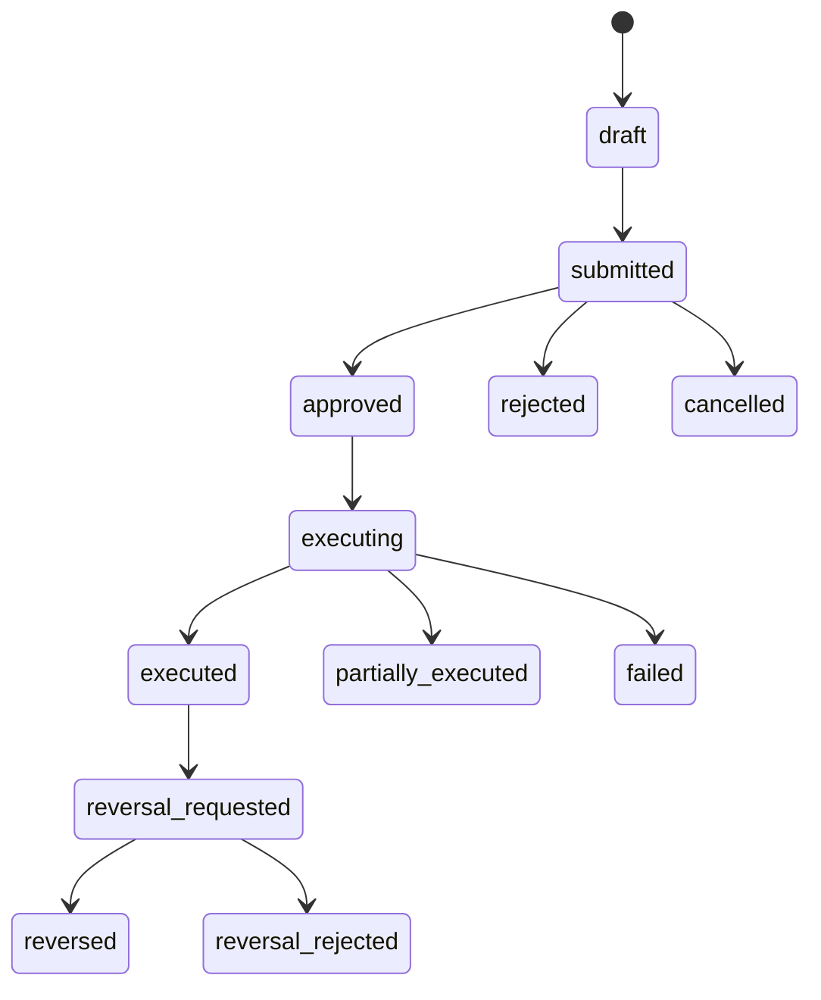

# 管理后台 RBAC、审批与审计设计

App 版本：1.0

日期：2026-07-20

状态：需求讨论中；后台权限实现前冻结候选

## 1. 文档目的

本文定义 Nuxt 管理后台的角色、capability、对象范围、强认证、审批、审计和应急控制。目标是让每个敏感操作都能回答：谁以什么权限、在什么范围、基于什么原因、经谁批准、对哪个版本、产生了什么结果。

后台 UI 的菜单、路由和按钮控制只用于减少误操作；Hono Admin API 的服务端授权才是最终权限边界。

## 2. 授权模型

### 2.1 决策公式

```text
allow = authenticated
    AND accountActive
    AND capabilityGranted
    AND objectInScope
    AND environmentAllowed
    AND sessionFreshEnough
    AND approvalSatisfiedIfRequired
    AND targetStateAllowsAction
    AND riskPolicyAllows
```

角色只是 capability 的集合模板，业务代码不应写 `if role == owner`。每次授权结果记录最终角色、capability、scope、策略版本和拒绝原因。

### 2.2 管理身份上下文

| 字段 | 说明 |
|------|------|
| `adminAccountId` | 当前操作员稳定账号 ID |
| `sessionId/deviceId` | 会话与设备 |
| `roles` | 当前有效角色模板 |
| `capabilities` | 服务端解析后的细粒度权限 |
| `scopes` | 地区、运营组、案件、资料、金额和环境范围 |
| `strongAuthAt` | 最近一次强认证时间 |
| `delegationRef` | 临时委派或值班授权来源 |
| `policyVersion` | RBAC/审批策略版本 |
| `riskState` | 账号、设备、IP 和行为风险摘要 |

管理员不能通过请求体声明自己的角色、scope 或审批结果。

## 3. 角色模板

| 角色模板 | 主要职责 | 默认不具备 |
|----------|----------|------------|
| Owner | 组织配置、角色授权、应急开关、最终责任 | 不默认读取私信正文/证据，不默认替代独立财务复核 |
| 内容编辑 | 建立真人/资料草稿、媒体整理、标签建议 | 认证通过、发布、消息、会员和财务 |
| 认证审核 | 审核身份/授权/资料一致性证据 | 编辑原始内容、发布、代运营、财务 |
| 发布审核 | 校验公开展示并发布/暂停 | 修改认证证据、代运营、财务 |
| 推荐运营 | 配置推荐规则、精选位、灰度和回滚 | 修改认证状态、查看私信、调币 |
| 代运营 | 接收、领取、回复和转派平台运营会话 | 以真人身份发送、查看财务、认证发布 |
| 消息安全审核 | 查看经案件授权的必要消息证据并处置 | 普遍浏览私信、代运营回复、财务 |
| 客服 | 账号/会员/钱包摘要、创建服务工单 | 直接发放高风险会员、调币、证据原件 |
| 商业运营 | 会员目录草案、grant 申请、未来商品运营 | 财务复核、直接改账本、认证发布 |
| 财务操作 | 创建调币/冲正/批量调整申请、对账 | 审批自己的申请、删除分录 |
| 财务复核 | 复核高风险调整和受控报表 | 发起并批准同一申请、编辑账本 |
| 审计只读 | 查询追加式审计、完整性异常和受控导出 | 任何业务写入、无目的读取正文/证据 |
| 安全管理员 | 账号限制、事件响应、应急开关、权限调查 | 日常内容运营、财务业务执行 |

Owner 不是绕过控制的“超级按钮”。极少数 break-glass 行为必须独立强认证、限时、说明原因、实时告警并由事后复核。

## 4. Capability 命名与目录

采用 `domain.resource.action`。`read`、`read_sensitive`、`create`、`update`、`approve`、`execute`、`export` 分开，不使用含义模糊的 `manage_all`。

### 4.1 真人、内容与目录

| Capability | 典型角色 | 约束 |
|------------|----------|------|
| `person.draft.create` | 内容编辑 | 来源与授权字段必填 |
| `person.draft.update` | 内容编辑 | `expectedVersion`；已进入审核时受限 |
| `person.evidence.read_sensitive` | 认证审核 | 用途原因、强认证、审计 |
| `person.verification.review` | 认证审核 | 不能审核自己提交的高风险资料 |
| `person.publication.review` | 发布审核 | 认证必须有效 |
| `person.publication.pause` | 发布审核、安全管理员 | 必填原因；高优先级撤权事件 |
| `taxonomy.catalog.edit` | 内容编辑/目录运营 | 只编辑草案 |
| `taxonomy.catalog.publish` | 发布审核/指定 Owner | 不可变版本、预览影响、可回滚 |
| `recommendation.rule.edit` | 推荐运营 | 只编辑草案 |
| `recommendation.rule.publish` | 推荐运营 + 必要复核 | 灰度、规则版本、Kill switch |

### 4.2 消息、举报与安全

| Capability | 典型角色 | 约束 |
|------------|----------|------|
| `conversation.queue.read` | 代运营 | 仅所属运营组/地区 |
| `conversation.assign` | 代运营主管 | 领取、转派、释放均审计 |
| `conversation.reply_as_platform` | 代运营 | senderType 由服务端固定为 `platform_operator` |
| `conversation.internal_note.create` | 代运营/审核 | 永不进入用户 API/事件 |
| `conversation.message.read_sensitive` | 代运营或案件审核 | 只读当前分配会话或案件证据范围 |
| `moderation.case.review` | 消息安全审核 | 按案件 scope；最小正文窗口 |
| `moderation.action.execute` | 安全审核/管理员 | 处置类型与影响预览 |
| `moderation.appeal.review` | 独立申诉审核 | 不由原处置人单独终审 |

任何后台请求都不能接受 `senderType=person` 作为可选参数。只有未来本人账号通过用户/真人专用通道发送时，服务端才生成 `person`。

### 4.3 会员、金币与审计

| Capability | 典型角色 | 约束 |
|------------|----------|------|
| `membership.catalog.read` | 客服/商业/审计 | 非敏感读取 |
| `membership.grant.request` | 客服/商业运营 | 业务单号、来源、期限、用户说明 |
| `membership.grant.approve` | 商业复核/Owner | 不能批准自己的申请 |
| `membership.grant.revoke` | 商业主管/安全 | 影响预览、原因、必要复核 |
| `wallet.summary.read` | 客服/财务 | 仅必要摘要；按账号 scope |
| `wallet.entry.read_sensitive` | 财务/审计 | 强认证、目的说明、审计 |
| `wallet.adjustment.request` | 财务操作 | 禁止直接传最终余额 |
| `wallet.adjustment.approve` | 财务复核 | 与发起人分离 |
| `wallet.adjustment.execute` | 系统 Workflow/受控角色 | 只追加分录 |
| `wallet.reversal.request` | 财务操作 | 必须引用原分录 |
| `audit.event.read` | 审计只读/安全 | 字段按权限脱敏 |
| `audit.export.request` | 审计/Owner | 强认证、范围预览、必要复核、水印 |
| `rbac.assignment.update` | Owner/安全管理员 | 高风险、双人或事后复核 |

## 5. 对象 Scope

capability 决定“能做什么”，scope 决定“能对什么做”。建议支持：

| Scope 类型 | 示例 | 适用场景 |
|------------|------|----------|
| region | `region:cn-bj` | 内容、推荐、运营与合规区域 |
| operator_group | `operator_group:night-shift-a` | 代运营会话队列 |
| person/profile | `person:per_xxx` | 临时争议/修复权限 |
| moderation_case | `case:case_xxx` | 消息证据最小读取 |
| account_segment | `support_tier:standard` | 客服能力限制 |
| financial_limit | `single<=N`, `daily<=N`, `batch<=N` | 调币与会员发放；N 待 OQ-018 冻结 |
| environment | `dev`, `staging`, `production` | 防止测试权限进入生产 |
| time_window | 值班或临时委派有效期 | 限时权限 |

默认拒绝跨 scope。对象转区、会话转组或案件合并后必须重新计算访问，已经打开的后台页面不能继续依赖旧缓存提交。

## 6. 后台页面与权限映射

| 页面域 | 查看 capability | 写入 capability | 高风险门禁 |
|--------|-----------------|-----------------|------------|
| 真人草稿 | `person.draft.read` | `person.draft.create/update` | 敏感证据单独授权 |
| 认证队列 | `person.verification.read` | `person.verification.review` | 提交/审核分离规则 |
| 发布队列 | `person.publication.read` | `person.publication.review/pause` | 版本检查、影响预览 |
| Taxonomy | `taxonomy.catalog.read` | `edit/publish` | 发布版本复核 |
| 推荐运营 | `recommendation.rule.read` | `edit/publish/rollback` | 灰度与 Kill switch |
| 代运营消息 | `conversation.queue.read` | `assign/reply_as_platform` | scope、披露和正文审计 |
| 举报案件 | `moderation.case.read` | `review/action.execute` | 最小证据、申诉分离 |
| 会员 | `membership.grant.read` | `request/approve/revoke` | 来源、期限、审批 |
| 钱包 | `wallet.summary.read` | `adjustment.request/approve` | 阈值、双人、不可负余额策略 |
| 审计 | `audit.event.read` | `audit.export.request` | 脱敏、强认证、水印 |
| RBAC | `rbac.assignment.read` | `rbac.assignment.update` | 高风险变更和告警 |

Nuxt 服务端渲染和客户端路由都可以读取一份只读 capability 摘要来控制导航，但 API 必须逐请求重新授权。

## 7. 强认证与会话安全

### 7.1 触发强认证的操作

- 查看身份/授权原始证据、私信正文或个人账本详细信息。
- 发布/暂停真人资料、批量导出、批量会员发放和调币。
- 批准/执行高风险财务动作、更新 RBAC、使用 Kill switch。
- 下载审计、证据、数据导出或迁移差异包。

具体身份方式由 OQ-030 确认。实现必须支持 `strongAuthAt` 和策略化新鲜度，而不是仅在登录时验证一次。新鲜度数值在安全评审时配置化。

### 7.2 会话控制

- 管理会话与普通用户会话分离，Cookie/Token scope 不混用。
- 设备、新位置、异常行为或权限升级触发再次认证。
- 角色撤销、scope 变化、账号冻结后通过 session version 立即失效。
- 生产权限不自动继承 dev/staging 权限；临时权限到期自动失效。
- 后台不得在 URL、浏览器历史或前端日志保存证件、消息正文和下载凭证。

## 8. 审批模型

### 8.1 通用状态机



每次状态迁移都要求 `expectedVersion`。审批人不能修改申请内容后直接批准；如需修改，退回发起人形成新版本并重新提交。

### 8.2 审批策略

```text
ApprovalPolicy
├── actionKey
├── conditionExpression（金额/批量/风险/地区/对象）
├── requiredApproverCapabilities
├── requiredDistinctApprovers
├── requesterCannotApprove
├── strongAuthFreshness
├── expiresAfter
└── policyVersion
```

策略结果和版本固化在审批单上。策略更新不静默改变已提交申请；高风险紧急变更需明确迁移或重新提交。

### 8.3 首期需要审批或分离的动作

| 动作 | 默认模式 | 未决参数 |
|------|----------|----------|
| 真人认证 | 提交人与审核人按风险分离 | OQ-008 |
| 真人发布/暂停 | 认证与发布角色分离；暂停可应急执行后复核 | OQ-008 |
| 推荐规则发布 | 草案/发布分离，灰度后放量 | 运营策略 |
| 会员发放/撤销 | 普通申请可按规则直达，高风险复核 | 额度/批量策略 |
| 单笔/批量调币 | 超金额、频率或批量阈值双人复核 | OQ-018 |
| 敏感导出 | 强认证，按范围决定复核 | OQ-020/安全策略 |
| RBAC 权限提升 | 高风险双人或紧急事后复核 | 安全策略 |

未决阈值不应以临时代码常量落地；在决策关闭后进入有版本、审批和回滚的策略配置。

## 9. 领域工作流

### 9.1 真人认证与发布

```text
内容编辑创建草稿
→ 来源/授权/媒体校验
→ 认证审核（身份、授权、资料一致性按声明范围）
→ 发布审核（公开文案、媒体、地区、标签、披露）
→ 生成公开投影
→ 监控/撤权
```

认证通过不等于自动发布；发布审核不能修改认证结论。暂停优先阻断公开访问，后续再完成影响扫描和资源失效。

### 9.2 平台代运营消息

```text
会话进入运营组队列
→ 操作员领取/系统分配
→ 查看披露、会员、限制和必要上下文
→ 以 platform_operator 回复
→ 需要时创建内部备注/转派/升级案件
→ 关闭或释放
```

领取只授予当前会话的限时 scope。内部备注使用独立存储/DTO/事件，不得通过筛选错误进入用户通道。实际操作员 ID 只在受限审计中保存；用户侧显示“平台运营”。

### 9.3 管理员调币

```text
搜索账号并核对稳定标识
→ 选择加币/扣币/补偿/冲正
→ 输入 reasonCode 和用户可见说明
→ 预览前余额、预计后余额和影响
→ 规则判定直接执行或待复核
→ 追加账本分录
→ 用户通知、审计、对账
```

界面和 API 都不得提供“编辑余额”。任何 correction 都通过冲正或新的调整单完成。

## 10. 审计事件

### 10.1 最小字段

```text
AuditEvent
├── auditEventId / sequence
├── occurredAt
├── actorAccountId / sessionId / deviceRiskRef
├── effectiveRoles / capability / scopes
├── actionKey
├── targetType / targetId / targetVersion
├── requestId / traceId / idempotencyKey
├── reasonCode / redactedReason
├── approvalRequestId / approvalStepId
├── result / errorCode
├── beforeDigest / afterDigest / redactedDiff
├── policyVersion
└── previousAuditDigest（完整性链，如采用）
```

审计 payload 只记录可证明行为所需的脱敏差异，不复制私信正文、证件、授权原件、Token、签名 URL 或完整支付凭证。需要查看原始证据时记录受控 `evidenceRef`，并对读取本身再次审计。

### 10.2 必须审计

- 所有后台写操作、审批、拒绝、取消、冲正和补偿。
- 角色/scope/临时权限变更、强认证和 break-glass。
- 私信正文、身份/授权证据、个人账本等高风险读取。
- 导入、导出、批量任务、规则发布/回滚和 Kill switch。
- 审计查询/导出、完整性检查结果和异常处置。

审计事件不可编辑或删除；更正通过关联新事件。业务成功但审计缺失属于高优先级完整性事故。

## 11. 敏感读取与导出

采用“先看摘要、按需展开、最小范围”的交互：

1. 列表默认只显示脱敏摘要。
2. 操作员选择业务用途并完成必要强认证。
3. 服务端验证 capability、对象 scope、案件/工单关联和时间窗口。
4. 返回最小字段或最小消息时间窗，并记录读取审计。
5. 导出先显示范围、记录数、敏感级别和保留提示；必要时审批。
6. 文件生成到私有 R2，使用短期一次性下载凭证、水印和自动到期。

不得为了看板便利把私信正文、证件或个人余额复制到通用分析库。

## 12. 并发与防误操作

- 编辑类表单使用 `expectedVersion`；冲突时展示服务端当前版本和用户未提交更改。
- 领取会话、批准申请、执行调币和发布规则使用条件更新，防止多人重复执行。
- 危险操作确认框明确对象、动作、不可逆影响和用户可见说明，不能只写“确定吗”。
- 批量任务先上传/筛选、预检、影响预览，再提交；每项有独立状态和错误。
- 浏览器刷新或重复点击使用幂等键返回原结果，不创建第二个审批/分录。
- 列表批量选择跨分页时显示明确范围，不使用含糊的“全选全部”。

## 13. Break-glass 与应急控制

适用场景仅限严重安全或公开内容风险。流程：

```text
强认证
→ 选择应急动作与范围
→ 填写事故号/原因/有效期
→ 执行最小化 Kill switch 或权限
→ 实时通知安全负责人
→ 自动到期或显式解除
→ 事后独立复核与事故报告
```

应急动作优先是停止新会话、暂停资料、停止媒体凭证、冻结调币或切只读，而不是直接删除权威数据。break-glass 不允许伪装真人、不允许编辑账本历史、不允许绕过审计。

## 14. 权限管理生命周期

- 入职：按岗位模板授予最小权限，生产环境单独批准。
- 调岗：先撤旧 scope，再授新权限；避免并集长期残留。
- 临时值班/委派：关联来源、范围和到期时间，禁止永久化。
- 离职/账号风险：立即递增 session version、撤销所有角色与下载凭证。
- 定期复核：按角色、scope、未使用权限、异常读取和临时授权检查。
- 策略变更：版本化、预览影响、灰度、回滚并记录审计。

## 15. 测试与验收

### 15.1 测试矩阵

- 角色 × capability：允许、拒绝和默认拒绝。
- capability × scope：同区/跨区、所属组/非所属组、金额内/超限。
- 发起人 × 审批人：自批拒绝、多人并发、审批过期、策略版本变化。
- 会话 × 正文权限：当前分配、案件授权、过期 scope、内部备注隔离。
- 钱包 × 风险：加币、扣币、余额不足、冲正、重复幂等键、批量部分失败。
- 审计 × 故障：审计不可用时高风险写入关闭、业务/审计对账、导出留痕。
- UI × API：隐藏按钮后直接调用 API 仍拒绝，旧页面缓存不能越权。

### 15.2 验收标准

- **RBAC-AC-001**：业务代码基于 capability 和 scope 授权，不硬编码角色名称。
- **RBAC-AC-002**：发起人不能批准需要职责分离的同一申请。
- **RBAC-AC-003**：操作员只能读取所属队列/案件的最小消息范围，读取行为被审计。
- **RBAC-AC-004**：任何管理员回复都由服务端生成 `platform_operator`，无法伪造 `person`。
- **RBAC-AC-005**：调币只追加分录；任何页面和 API 都没有直接编辑余额能力。
- **RBAC-AC-006**：角色/scope 撤销后现有会话及时失效，已打开页面提交也被拒绝。
- **RBAC-AC-007**：后台业务成功可关联请求、审批、业务结果、通知和追加式审计。
- **RBAC-AC-008**：敏感导出有强认证、范围预览、必要复核、水印、短期凭证和下载审计。
- **RBAC-AC-009**：break-glass 限时、最小化、实时告警并接受独立事后复核。

## 16. 实现前待关闭事项

- OQ-008：上传、认证和发布的职责分离强度。
- OQ-018：调币金额、频率、批量阈值和负余额规则。
- OQ-020：审计、消息、证据、导出和账务保留期限。
- OQ-022：举报/高危事件 SLA、值班和升级渠道。
- OQ-025：数据权利与隐私事件 Owner。
- OQ-030：后台登录、强认证和身份适配器。

## 17. 相关文档

- [Nuxt 管理后台交互与低保真规格](./ADMIN_CONSOLE_INTERACTION_SPEC.md)
- [Cloudflare 后端模块与实时链路设计](./CLOUDFLARE_BACKEND_MODULE_DESIGN.md)
- [金币钱包与调币 PRD](../ways-of-work/plan/real-person-discovery-platform/wallet-ledger-and-admin-coin-adjustments/prd.md)
- [运营看板与审计 PRD](../ways-of-work/plan/real-person-discovery-platform/operations-dashboard-and-audit-log/prd.md)
- [开放问题与决策登记](./DECISIONS_AND_OPEN_QUESTIONS.md)
