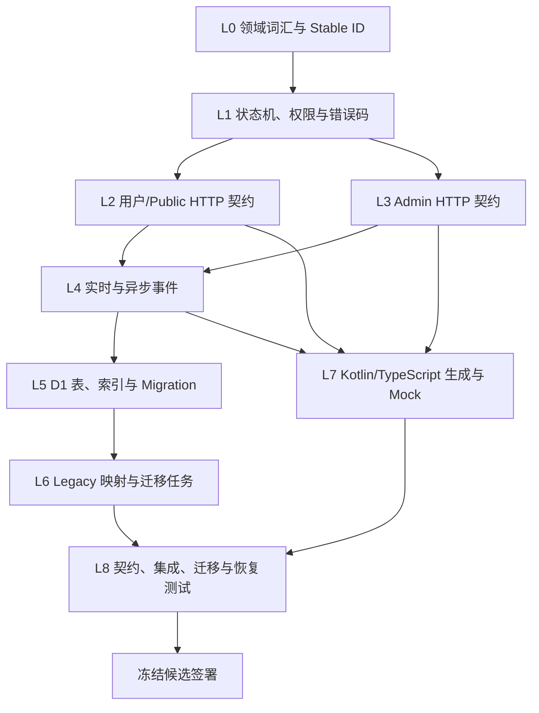

# API、DTO 与数据契约冻结计划

App 版本：1.0

日期：2026-07-20

状态：需求讨论中；实现启动前执行计划

## 1. 文档目的

本文定义从需求讨论进入实现前，如何冻结 HTTP API、实时事件、Kotlin/TypeScript DTO、D1 表、状态机、错误码和迁移契约。它不表示当前 schema 已冻结，也不授权创建路由、生成代码或执行 migration。

冻结的目标不是让所有字段永远不变，而是建立事实源、兼容规则、评审顺序和可验证产物，使 Android、iOS、Nuxt、Hono、D1、DO 和迁移任务不会各自解释产品规则。

## 2. 契约事实源

| 契约 | 唯一事实源 | 生成/消费方 | 不允许成为事实源的内容 |
|------|------------|-------------|--------------------------|
| HTTP API | OpenAPI | Hono 校验/文档、Kotlin 客户端、Nuxt 管理端 | 手写页面接口类型、聊天记录中的 JSON |
| 实时事件 | JSON Schema + event registry | DO、Queue、KMP、后台消息工作台 | 临时 WebSocket payload |
| 配置/目录 | JSON Schema + config registry | Entitlement、Taxonomy、客户端渲染 | 中文文案或 UI 颜色 |
| 错误 | Error registry | API、KMP、Nuxt、测试、文案目录 | 抛出的原始异常消息 |
| 状态机 | State machine registry | 领域用例、后台 UI、测试 | 散落 Boolean 和页面自行推导 |
| D1 schema | 有序 migration + schema snapshot | API、迁移/对账、测试 | ORM 自动同步生产表 |
| 稳定 ID/枚举 | Domain registry | 所有端 | D1 自增 ID、展示名称 |
| 埋点 | Event catalog | App/Web、分析 | 私信正文或动态任意属性 |

OpenAPI/JSON Schema 可以生成或校验 Kotlin/TypeScript 类型，但领域模型仍通过显式 Mapper 与 DTO 分离。不能把网络 nullability、数据库字段或平台类传播到整个业务层。

## 3. 冻结层级



不得先设计 D1 表再反推产品对象；也不得因 UI 已画出字段就绕过领域和权限冻结。

## 4. L0：领域词汇、标识与时间

### 4.1 必须固定的对象

- `Account`：登录、设备、隐私和权益主体。
- `Person`：现实真人主体与权利事实。
- `PersonProfile`：审核后可公开的展示版本。
- `Gallery/Media`：内容集合和媒体对象。
- `OperatorAssignment`：平台运营或本人运营的当前归属。
- `Conversation/Message`：观看者面向 Person 的会话与有序事件。
- `MembershipGrant/EntitlementSnapshot`：权益来源与解析结果。
- `WalletEntry/AdjustmentRequest`：追加式账本和管理申请。

### 4.2 ID 规则

- 对外使用带类型前缀的不可枚举字符串，如 `acc_`、`per_`、`pp_`、`cv_`；实际生成算法在实现评审中选择。
- D1 内部 rowid 或旧系统 ID 不进入公开/管理契约。
- legacy ID 只出现在受限映射表和迁移审计中。
- 幂等键、client message ID、business ID、event ID、request ID 和 trace ID 各自语义独立。
- 任何对象合并/拆分保留映射和 tombstone，不回收 stable ID。

### 4.3 时间和版本

- API 时间统一 UTC ISO 8601；D1 精确格式在 migration 基线统一。
- 用户展示按本地时区；额度重置时区和会员到期边界必须在 OQ-014 中明确。
- 可变聚合使用整数 `version`；发布目录/规则/配置使用不可变 `versionId`。
- 客户端版本、契约版本、schema 版本和业务目录版本不得共用一个数字。

## 5. L1：状态机、权限和错误码

### 5.1 必须登记的状态机

| 状态机 | 关键状态 | 冻结重点 |
|--------|----------|----------|
| Person verification | draft/submitted/approved/rejected/expired | 核验范围、复核和证据 |
| Profile publication | draft/in_review/published/paused/archived | 与认证分离、暂停优先 |
| Authorization | active/expiring/expired/revoked/disputed | 用途、有效期、撤权影响 |
| Conversation | initializing/active/restricted/closed/archived | 重开规则、运营模式 |
| Message | received/pending/accepted/delivered/read/rejected/recalled | 审核、撤回、tombstone |
| Membership grant | scheduled/active/expired/revoked/superseded | 叠加、到期和来源 |
| Adjustment request | draft/submitted/approved/executing/executed/rejected/reversed | 阈值、职责分离、冲正 |
| Import/data right workflow | validating/running/partial/succeeded/failed/compensating | 重试、取消和补偿 |

每个状态机登记：允许转换、发起 capability、前置条件、副作用、幂等键、错误码、审计 action、用户文案 key 和异步事件。

### 5.2 权限目录

用户侧 entitlement 使用稳定 key 和 typed value，例如 boolean、integer、duration、enum/set。后台权限使用 `domain.resource.action` capability + scope。二者不能混用，会员 entitlement 永远不能授予后台能力。

### 5.3 错误注册表

每个错误至少包含：稳定 `code`、HTTP status、retryable、用户 copy key、客户端行为、日志级别、敏感详情规则和最小支持契约版本。

兼容规则：

- 已发布 code 的语义不改变；需要新语义时创建新 code。
- 未知 4xx 默认不重试并显示安全通用错误；未知 5xx 可按幂等性有限重试。
- `details` 只能增加可选字段，不能成为旧客户端授权依据。
- 不能把内部异常类名、SQL、对象 key、阈值和操作员身份放入用户响应。

## 6. L2/L3：HTTP 契约

### 6.1 路由分类

| 类型 | 前缀 | 身份 | 缓存与授权 |
|------|------|------|------------|
| Public | `/api/v2/discovery`、`/person-profiles`、`/catalog` | 匿名或登录 | 只读公开投影；允许显式 ETag |
| User | `/api/v2/me`、`/conversations`、`/notifications`、`/reports` | 当前账号 | 私有，不共享缓存；对象级授权 |
| Admin | `/api/v2/admin` | 管理身份 | 独立会话、capability/scope/强认证/审计 |
| Internal | 不公开或服务绑定调用 | Worker/Workflow 身份 | 服务级认证、最小绑定范围 |

完整资源候选见 [API 与实时通信契约](./API_AND_REALTIME_CONTRACT.md)。冻结时逐路由建立 owner、状态、权限、幂等性、限流、DTO、错误和审计矩阵。

### 6.2 请求 DTO 规则

- 所有字段明确 required/optional/nullable；optional 与 nullable 不等价。
- 写命令使用 allowlist，未知写字段默认拒绝或按契约策略忽略，避免 mass assignment。
- 枚举请求严格校验；客户端不得发送 `unknown` 作为业务选择。
- 管理写命令包含 `expectedVersion`、`reasonCode/reasonText` 和幂等键（如适用）。
- 金额、金币、rank、额度使用整数和明确单位，不使用浮点。
- 用户/管理员不能提交服务端控制字段：senderType、余额后值、审核人、审批结果、publish status 的非法跳转等。

### 6.3 响应 DTO 规则

- 使用统一 `data/meta` 或 `error/meta` envelope。
- DTO 只返回调用方所需字段；公开、用户和管理 DTO 分离。
- 服务端返回显式 `operationMode/receiverLabel`，客户端不根据认领字段推导消息接收方。
- 受限能力返回结构化 AccessDecision/错误，不返回内部策略公式。
- 列表使用 opaque cursor；cursor 绑定筛选、排序和规则版本。
- 媒体返回 stable media ID、受控派生信息和短期 access，不把 R2 key 当 URL。

### 6.4 Nullability 示例语义

| 场景 | 表达 |
|------|------|
| 字段本版本未提供 | optional，缺失 |
| 已知没有值 | nullable，显式 `null` |
| 不允许公开 | 字段不存在，不返回 `null` 暗示存在 |
| 未知枚举 | 响应可映射为客户端 `unknown`，同时保留安全 raw code（如策略允许） |
| 空列表 | `[]`，不使用 `null` |

### 6.5 分页、排序与过滤

- `limit` 有服务端上限，cursor 不透明、有有效期并与查询摘要绑定。
- 稳定排序必须含唯一 tie-breaker；不能仅按热度或时间造成重复/遗漏。
- taxonomy filter 发送 stable term ID，不发送中文名称。
- 返回 `ruleVersion/catalogVersion`，客户端发现不兼容时刷新目录和首屏。
- Admin 导出与前台分页分离，不允许通过无限 `limit` 替代受控导出。

## 7. DTO 分层与生成策略

```text
OpenAPI / JSON Schema
├── Kotlin transport DTO + enum adapters
├── TypeScript transport DTO / validators
├── Hono request/response schema validator
├── Mock responses / contract fixtures
└── 文档与破坏性变更检查

Transport DTO
↕ 显式 Mapper
Domain Model
↕ Repository / UseCase
UI Model 或 Persistence Entity
```

### 7.1 生成边界

- 生成代码只存在于契约层，不包含业务用例、授权判断和 UI 文案。
- 生成器版本锁定；产物可重复生成并由 CI 检查无未提交差异。
- 若生成器无法正确表达 Kotlin `sealed`/unknown enum 或 KMP source set，允许采用手写 transport model + schema 测试，但必须保持单一 schema 事实源。
- TypeScript 运行时不能只信静态类型，外部输入仍需 schema 校验。

### 7.2 兼容未知值

- 响应 enum 新增值是潜在客户端兼容风险；客户端映射到 `unknown` 并采取最小权限行为。
- entitlement 未知 key 不渲染、不执行，但可保存在脱敏兼容指标中。
- 新 `contentType`、Route 或原生 capability 必须配 `minimumClientVersion`，旧客户端收到后显示不可用而不是尝试解析。
- 删除字段、收紧 nullability、改变单位、改变默认值和重用 enum 值均为破坏性变更。

## 8. L4：实时与异步事件契约

### 8.1 通用事件封装

```text
eventId
eventType
schemaVersion
aggregateType / aggregateId / aggregateVersion
occurredAt
producer
traceId / causationId / correlationId
payload
```

会话事件另含 `conversationId + sequence`。通知、投影和审计消费不能用 Queue 投递时间替代业务发生时间。

### 8.2 事件演进

- 同一 `schemaVersion` 只增加明确可选且旧消费者可忽略的字段。
- 删除/改名/类型变化发布新 schema version，生产者在兼容窗口内按计划双发或消费者先升级。
- 未知事件默认记录兼容指标并忽略；涉及撤权/限制的未知事件必须触发权威刷新或 fail closed。
- 事件 payload 使用对象引用和最小事实，不复制私信正文、证件、Token、签名 URL。
- 每个消费者登记幂等键、可重放范围、死信处理和数据重建方式。

### 8.3 事件注册表示例字段

| 字段 | 说明 |
|------|------|
| event type/version | 稳定标识 |
| owner/producer | 唯一语义负责人 |
| consumers | 投影、通知、审核、分析等 |
| sensitivity | public/internal/restricted |
| ordering | aggregate、conversation 或无顺序要求 |
| idempotency | 消费去重键 |
| retention/replay | 可重放来源与窗口 |
| compatibility | 支持版本和下线计划 |

## 9. L5：D1 Schema 冻结

### 9.1 每张表必须登记

- 领域 owner、用途和权威/投影属性。
- 主键、业务唯一键、外键/引用语义和 stable ID。
- 状态、version、创建/更新时间、软删除/tombstone 规则。
- 敏感级别、加密/引用方式、保留与删除策略。
- 读写路径、预期查询、索引和分页顺序。
- migration 引入阶段、回填、对账、回滚/forward-fix。

### 9.2 表族优先级

| 顺序 | 表族 | 进入 App 1.0 migration |
|------|------|------------------------|
| 1 | stable ID、legacy mapping、migration job | 是，M0 |
| 2 | account/session/consent/privacy | 是 |
| 3 | person/profile/authorization/verification/operator assignment | 是 |
| 4 | taxonomy/public projection/discovery rule | 是 |
| 5 | interactions/folders/history/blocks | 是 |
| 6 | membership catalog/grant/entitlement snapshot | 是 |
| 7 | conversation index/message projection/assignment/receipt | 是；正文保留待 OQ 冻结 |
| 8 | notification/preferences/dedup | 是 |
| 9 | wallet entry/snapshot/adjustment/reversal | 是 |
| 10 | moderation/approval/audit | 是 |
| 11 | products/orders/gifts/cosmetics | 否；未来 Feature 冻结后再建 |
| 12 | person claim/handover | 否；M3 冻结后再建 |

目标模型中出现未来表，不代表允许提前创建 production migration。1.0 schema 只包含当前执行、审计或兼容所需字段。

### 9.3 索引评审

每个列表 API 以真实 `WHERE + ORDER BY + cursor` 反推组合索引；同时评估写放大和基数。禁止为“以后可能查询”无依据堆索引。必须覆盖：公开资格/发布时间、地区/热度稳定排序、账号互动、会话更新时间、消息 sequence、通知未读、grant 有效期、wallet business key、审批状态和审计 target/time。

### 9.4 Migration 规则

- 只允许有序、可重复验证的 D1 migrations，不使用生产 ORM auto-sync。
- 扩展式变更优先：先加可选字段/新表 → 双读或回填 → 切读 → 收紧约束 → 后续清理。
- 大量回填使用可恢复任务，按 stable cursor 分批，不依赖一次长事务。
- migration 前记录备份/bookmark 能力和恢复步骤，且必须核对 Cloudflare 当前官方文档。
- 数据删除或不可逆转换优先 forward-fix；能否回滚需逐 migration 声明，不能统一承诺。

## 10. L6：MeiGallery 映射与迁移契约

### 10.1 映射清单

| Legacy 概念 | 目标概念 | 关键规则 |
|-------------|----------|----------|
| user | Account | 只迁移登录/会员主体，不自动创建 Person |
| gallery/profile-like content | Gallery + Person/Profile 候选 | 未完成授权/认证/发布前不公开 |
| vip/svip | MembershipGrant 候选 | 只迁移证据明确的 rank/有效期，不承诺等价订阅 |
| tags/region strings | Taxonomy stable term | 使用 mapping version，未知值进入人工复核 |
| media object | Media + rights | stable ID、checksum、授权用途和派生状态 |

### 10.2 每阶段唯一写主

| 阶段 | Legacy | v2 | 对账/回滚点 |
|------|--------|----|-------------|
| 盘点 | 唯一写主 | 仅设计 | schema/数据质量报告 |
| 影子 ID | 业务写主 | 映射/投影只写 | 删除影子映射不影响业务 |
| 候选导入 | 原内容仍写主 | 草稿候选 | 按 item 重跑/废弃草稿 |
| App 发现 | Web legacy 写主或明确模块写主 | App 公开投影读主 | 关闭 App 路由/回退投影版本 |
| 会员/消息/钱包 | 对应新域不再 legacy 双写 | v2 唯一写主 | Feature flag、账本/消息 forward-fix |
| Web 切换 | 按模块逐一停止 legacy 写 | v2 写主 | 每模块独立回退窗口 |

禁止应用层长期同步双写。迁移事件和任务必须有 source version、mapping version、target version、checksum 和结果。

## 11. 冻结执行顺序与产物

| Gate | 评审内容 | 必须产物 | 责任人建议 |
|------|----------|----------|------------|
| G0 范围 | 1.0/未来边界、首发地区、年龄、身份 | 范围签署、OQ 决策 | Owner/产品/法务 |
| G1 领域 | 词汇、ID、状态机、所有权 | Domain registry、状态图 | 架构/后端/产品 |
| G2 权限 | entitlement、RBAC、scope、审批 | 权限目录和矩阵 | 安全/运营/财务 |
| G3 用户 API | Public/User 路由和 DTO | OpenAPI draft、error registry | 后端/KMP/测试 |
| G4 Admin API | 管理命令、版本、审计 | Admin OpenAPI、capability mapping | 后端/Web/安全 |
| G5 事件 | DO/Queue 事件、顺序、重放 | JSON Schema、event registry | 后端/KMP/SRE |
| G6 数据 | D1/R2 所有权、索引、保留 | ERD、DDL review、migration plan | 后端/隐私/SRE |
| G7 生成 | Kotlin/TS 产物、Mock | 可重复生成、fixture、mock server | KMP/Web/后端 |
| G8 验证 | 兼容、集成、故障、迁移 | 测试报告和差异清零 | QA/安全/SRE |
| G9 签署 | 风险、开放问题、回滚 | Freeze record/ADR | 各 Owner |

任一 Gate 未通过时只回到受影响层修订，不通过频繁递增文档版本制造噪音；Git 保留讨论期变更历史，App 文档仍保持版本 1.0。

## 12. 破坏性变更判断

以下均视为破坏性或需显式兼容评审：

- 删除/重命名字段、从 optional 变 required、允许 null 改为不允许 null。
- enum 移除/重用、金额单位变化、时间边界变化、默认排序变化。
- cursor 语义、幂等键范围或业务唯一键变化。
- `senderType`、`operationMode`、entitlement 的安全语义变化。
- error code 改义或 HTTP 状态变化导致客户端行为改变。
- 实时 sequence、补拉窗口、事件排序或回执语义变化。
- D1 唯一约束、状态值或数据所有权变化。

兼容策略按优先级：新增版本/新字段 → 生产者/消费者分阶段升级 → 观测旧版本流量 → 停止旧版本 → 清理。新原生能力必须配最低 App 版本并通过应用商店升级，不能仅靠远程配置。

## 13. 契约测试与 CI 门禁

### 13.1 必须自动化

- OpenAPI/JSON Schema lint、引用完整性和 example 验证。
- 与上一冻结基线比较破坏性变更。
- Kotlin/TypeScript 生成可重复性和编译。
- Hono 请求/响应运行时校验与授权错误。
- Consumer contract：KMP、Nuxt 管理端、DO/Queue 消费者。
- 事件重复、乱序、未知字段/枚举和版本升级。
- D1 migration 从空库、上一版本和脱敏样本升级。
- 权限矩阵、状态转换、幂等和审计完整性。

### 13.2 Fixture 原则

- 使用合成账号、真人和媒体，不复制生产私信、证件、账本或授权原件。
- 固定时钟、stable ID、idempotency key 和 catalog/rule version。
- 覆盖 `verified/published` 与所有不可公开组合。
- 覆盖五级会员、到期、撤销、未知 entitlement 和无会员。
- 覆盖 platform_operator/person/system sender，App 1.0 不产生图片等未来内容。

## 14. 未决事项与阻塞关系

| 冻结对象 | 阻塞问题 |
|----------|----------|
| 注册/身份 DTO | OQ-001、OQ-002、OQ-003、OQ-030 |
| 真人/授权 schema | OQ-006、OQ-007、OQ-008、OQ-024 |
| Entitlement DTO | OQ-014、OQ-016 |
| 消息状态/事件/表 | OQ-010、OQ-020、OQ-021、OQ-022、OQ-028、OQ-033 |
| 钱包调整表/审批 | OQ-018、OQ-020 |
| 数据位置/环境 | OQ-024、OQ-031 |
| KMP 生成/兼容矩阵 | OQ-026、OQ-027、OQ-030 |

未来价格、在线支付、金币包、礼物、装扮和系统推送相关问题不阻塞 App 1.0，但相应生产路由、表和 capability 必须保持未启用。

## 15. 冻结验收标准

- **CONTRACT-AC-001**：每个 App 1.0 路由有 owner、身份、权限、幂等、DTO、错误、限流、审计和测试定义。
- **CONTRACT-AC-002**：公开、用户和 Admin DTO 分离，任何公开响应不含证据、内部备注或实际操作员身份。
- **CONTRACT-AC-003**：Kotlin/TypeScript 类型可从同一契约生成或由自动测试证明一致。
- **CONTRACT-AC-004**：未知字段、enum、entitlement、事件和 Route 有明确安全降级。
- **CONTRACT-AC-005**：每张 App 1.0 D1 表有 owner、唯一键、索引依据、保留和 migration 方案。
- **CONTRACT-AC-006**：DO/Queue 事件有顺序、幂等、重放、死信和敏感级别定义。
- **CONTRACT-AC-007**：MeiGallery 迁移每阶段只有一个写主，并能按 stable ID 对账。
- **CONTRACT-AC-008**：所有阻塞 OQ 已关闭或该范围明确移出实现，不能用临时默认值代替。
- **CONTRACT-AC-009**：冻结产物通过 schema lint、破坏性检查、生成编译、migration 和消费者契约测试。

## 16. 冻结记录模板

```text
冻结对象：
事实源路径：
覆盖 App 版本：1.0
契约/schema 版本：
依赖决策：
已解决开放问题：
兼容范围：
迁移/回滚策略：
验证证据：
已知风险：
Owner：
产品/后端/KMP/Web/QA/安全/数据签署：
冻结日期：
```

## 17. 相关文档

- [API 与实时通信契约](./API_AND_REALTIME_CONTRACT.md)
- [数据模型与渐进迁移](./DATA_AND_MIGRATION.md)
- [KMP 客户端模块与状态导航设计](./KMP_CLIENT_MODULE_DESIGN.md)
- [Cloudflare 后端模块与实时链路设计](./CLOUDFLARE_BACKEND_MODULE_DESIGN.md)
- [管理后台 RBAC、审批与审计设计](./ADMIN_RBAC_AND_WORKFLOW_DESIGN.md)
- [开放问题与决策登记](./DECISIONS_AND_OPEN_QUESTIONS.md)
