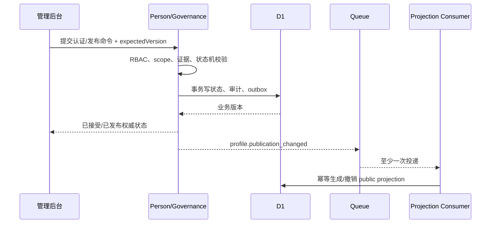
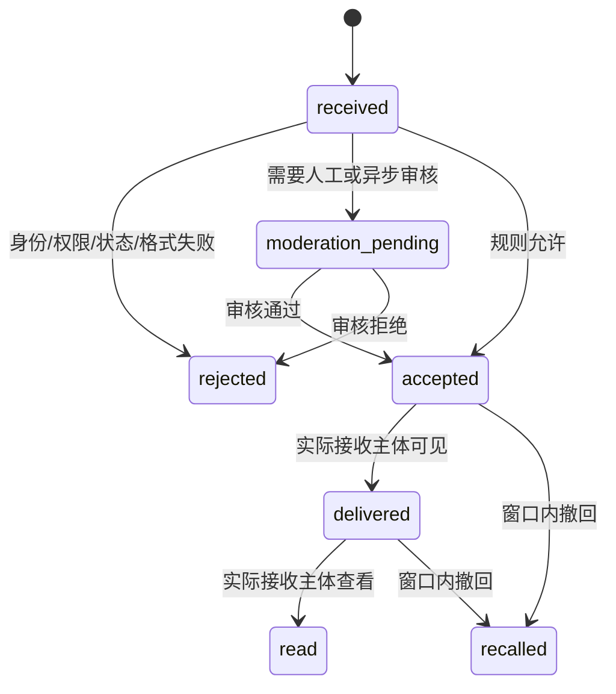

# Cloudflare 后端模块与实时链路设计

App 版本：1.0

日期：2026-07-20

状态：需求讨论中；后端实现前冻结候选

## 1. 文档目的

本文把产品、API 和数据目标拆成可实现的 Hono 模块、D1 所有权、Durable Objects 会话模型、Queue/Workflow 异步链路及故障边界。本文只定义技术方案，不创建 API 路由、D1 migration、Queue、Workflow 或 Durable Object namespace。

## 2. 部署形态

### 2.1 首期选择：模块化单体

- `meigallery-web`：Nuxt 4 Web 与管理后台，Cloudflare Worker + Workers Assets。
- `meigallery-api`：Hono API Worker，同时提供 `/api/v2` public/app/admin 路由和内部领域编排。
- `ConversationRoom`：按 `conversationId` 定位的 Durable Object class。
- Queues/Workflows：由 API Worker 或专用消费者处理异步和长任务；是否物理拆 Worker 以部署约束和容量验证为准。

首期不按领域拆成多个网络微服务。领域边界通过 package、接口、表所有权、事务边界、事件 schema、权限中间件和测试固定。出现独立扩容、发布节奏、故障隔离或团队所有权需求后才物理拆分。

### 2.2 推荐目录边界

```text
packages/api/src/
├── app/                        # Hono 装配、环境绑定、全局错误
├── platform/
│   ├── auth/                   # 会话、设备、管理员强认证
│   ├── database/               # D1 gateway、transaction helper
│   ├── idempotency/            # 幂等命令登记
│   ├── outbox/                 # 事务 Outbox 与 Queue 发布
│   ├── audit/                  # 追加审计接口
│   ├── storage/                # R2/Stream 适配
│   ├── realtime/               # DO ticket 与协议
│   └── observability/          # request/trace、脱敏、指标
├── modules/
│   ├── identity/
│   ├── person/
│   ├── taxonomy/
│   ├── discovery/
│   ├── interaction/
│   ├── entitlement/
│   ├── messaging/
│   ├── notification/
│   ├── wallet/
│   ├── moderation/
│   ├── admin/
│   └── migration/
├── routes/public/
├── routes/app/
├── routes/admin/
└── contracts/                  # 生成或校验后的服务端契约适配
```

每个模块内部建议包含 `domain`、`application`、`repository` 和 `transport` 四个逻辑层。Hono handler 只完成输入解析、调用用例和响应映射，不直接写 D1，也不在 handler 内拼权限 SQL。

## 3. 请求管线

```mermaid
flowchart LR
    REQ["Request"] --> EDGE["WAF / Rate Limit / Turnstile"]
    EDGE --> RID["Request ID / Client Metadata"]
    RID --> AUTH["Session / Account / Admin Auth"]
    AUTH --> VAL["Contract Validation"]
    VAL --> IDEM["Idempotency Check"]
    IDEM --> AZ["Entitlement / RBAC / Object Scope"]
    AZ --> UC["Application Use Case"]
    UC --> TX["D1 Transaction / DO Command / Workflow"]
    TX --> AUD["Audit + Outbox"]
    AUD --> RES["Response Envelope"]
```



管线按路由类型裁剪，但管理写接口不能跳过管理员身份、capability、对象 scope、必要强认证和审计。公开 GET 仍需要输入、可见性、速率和枚举防护。

### 3.1 授权上下文

用户侧最少包含：`accountId`、`sessionId`、`deviceId`、账号状态、资格/地区、会员快照版本、风险状态和客户端 capability 版本。

管理侧另包含：`adminAccountId`、角色、capability 集合、对象 scope、强认证时间、环境、值班/分组归属和委派信息。客户端传来的角色或会员字段不进入授权上下文。

## 4. 模块职责与 D1 所有权

| 模块 | 拥有的表族 | 对外能力 | 可读依赖 |
|------|------------|----------|----------|
| identity | `accounts_v2`、identities、devices、sessions、consents、privacy/data-right requests | 注册、登录、设备、偏好、数据权利 | entitlement 摘要、risk 状态 |
| person | persons、profiles、authorizations、verifications、operator assignments、profile-gallery/media rights | 资料草稿、认证、发布、公开详情、媒体授权 | taxonomy、audit |
| taxonomy | terms、aliases、mappings、catalog versions | 目录查询、发布、兼容映射 | 无 |
| discovery | public projections、rule versions、featured placements、recommendation sessions | feed、搜索、热门、最新 | person public facts、taxonomy、聚合 signals |
| interaction | viewer interactions、favorite folders/items、history、blocks | 喜欢/关注/收藏/历史/拉黑 | profile availability |
| entitlement | membership catalog、grants、entitlement definitions/snapshots | 目录、发放、解析、到期 | account |
| messaging | conversation index、participants、assignments、message projection/index、receipts、moderation refs | 建会话、列表、补拉、发送、运营分配 | account、entitlement、profile、blocks/risk |
| notification | notifications、preferences、template versions、dedup | 列表、已读、归档、偏好 | 业务事件 |
| wallet | wallet accounts、entries、balance snapshots、adjustment requests/reversals | 余额、明细、调整、冲正、对账 | account、approval |
| moderation | report cases、evidence refs、actions、appeals | 举报、审核、限制、申诉 | person、interaction、messaging |
| admin/audit | roles、scopes、approval requests/steps、audit events/integrity checks | 后台授权、审批、审计查询/导出 | 各领域的只读摘要 |
| migration | legacy mappings、import/migration jobs/items/reconciliation | 候选导入、进度、对账 | legacy adapter、目标领域命令 |

表名为逻辑表族，不代表已经冻结 migration 名称。正式 DDL 由 [API、DTO 与数据契约冻结计划](./API_DATA_CONTRACT_FREEZE_PLAN.md) 控制。

### 4.1 跨模块访问规则

1. 同一请求中的强一致校验优先调用领域只读接口，必要时读取该领域发布的不可变快照。
2. 其他模块不得写拥有者的表，即使处于同一 D1 数据库。
3. 查询聚合使用 projection/read model，不在公开接口进行无限制跨表拼接。
4. 领域变化通过 transaction outbox 发布；消费者按稳定 event schema 更新投影。
5. 任何临时跨模块 SQL 都必须登记为债务、限定只读并有替换期限，不能成为默认模式。

## 5. D1 事务、幂等与 Outbox

### 5.1 单领域命令模板

```text
校验 Idempotency-Key 与规范化请求摘要
→ 开启 D1 transaction/batch 边界
→ 读取当前版本并执行对象级条件检查
→ 追加业务变更
→ 写 idempotency result
→ 写 domain_outbox(eventId, aggregateId, version, payloadRef)
→ 提交
→ 尝试向 Queue 发布；失败由 outbox relay 重试
```

关键点：幂等记录与业务结果必须位于同一权威提交边界。相同 key + 相同请求返回原结果；相同 key + 不同规范化请求返回 `IDEMPOTENCY_CONFLICT`。

### 5.2 乐观并发

认证、发布、推荐规则、会员 grant、会话分配、调整单和审批单使用整数 `version` 或不可变版本 ID。管理请求提交 `expectedVersion`；版本冲突返回当前摘要和差异提示，不进行最后写入覆盖。

### 5.3 Outbox 规则

- `eventId` 全局唯一，`aggregateType + aggregateId + aggregateVersion` 唯一。
- payload 只含消费者需要的最小字段；敏感正文使用受控引用，不进入通用 Queue。
- relay 可重复发布，消费者必须有 `consumer_inbox` 或等价去重记录。
- 只有权威业务提交成功才产生领域事件；分析事件不能反向驱动核心业务。
- outbox 长时间未发布、重复失败或业务成功无事件均需告警。

## 6. 关键领域流程

### 6.1 真人认证、发布与公开投影



公开 API 只读 public projection。投影未完成时不能退回读取未审核源表；资料暂停或授权撤销使用高优先级失效事件，并允许公开 API 根据权威 denylist/version 快速阻断旧投影。

### 6.2 创建/复用会话

唯一业务关系建议为 `viewerAccountId + targetPersonId + conversationScope`，而不是展示 profile 名称。流程：

1. 校验账号、年龄/地区资格、目标资料 `verified + published`、拉黑、安全限制。
2. 解析当前 `direct_message.create` entitlement 和额度；额度数值待 OQ-014 冻结。
3. 使用 Idempotency-Key 和唯一关系查询/创建会话索引。
4. 在同一 D1 提交中记录会话、参与主体、`platform_managed` 运营模式、披露版本、额度占用/用量和 outbox。
5. 初始化 Conversation DO；若初始化暂时失败，会话处于可恢复 `initializing`，不得重复扣额度。
6. 返回会话 ID、接收主体标签、披露版本和服务端额度摘要。

若未来真人认领，新会话可以使用 `person_managed`；历史会话不自动改变，交接遵循独立 Workflow 和用户选择。

### 6.3 会员发放与到期

- 目录、grant 和解析后的 entitlement snapshot 分开存储。
- grant 以业务单号幂等追加，修改通过 supersede/revoke 事件，不覆盖来源历史。
- 权限解析读取所有有效来源，按显式合并规则产生 snapshot version。
- 定时扫描只负责提醒/加速；任何受限 API 都按当前时间和有效期校验，不能依赖定时任务才能到期。
- 权益变化发布事件，客户端缓存和消息连接收到限制提示；旧会话仍可读但不可发送。

### 6.4 钱包调整与冲正

```text
创建 adjustment_request
→ 校验 reasonCode、用户可见说明、金额、账户与风险
→ 按 OQ-018 规则决定待复核或可执行
→ 独立复核人批准（如需）
→ D1 条件事务锁定 wallet version
→ 追加 wallet_entry
→ 更新可重建 balance_snapshot
→ 标记 adjustment 已执行并写 outbox/audit
```

扣币默认不能让余额低于零，除非 OQ-018 明确冻结例外和处置。冲正创建反向分录并引用原分录，原记录永不编辑/删除。批量调整由 Workflow 分项执行，每项独立幂等，部分失败可重试和导出报告。

## 7. Durable Objects 会话设计

### 7.1 定位与权威边界

每个 `conversationId` 映射到一个 `ConversationRoom`。DO 负责：

- 单会话命令串行化和单调 `sequence`。
- `clientMessageId` 去重与已接收结果恢复。
- WebSocket 连接、心跳、订阅和短期 presence（仅内部连接状态）。
- 近期消息事件、回执高水位和 DO outbox。
- 休眠/唤醒后的快照恢复。

DO 不负责：全局会话列表、管理员跨会话检索、长期报表、会员目录、钱包余额、真人公开投影或伪造用户在线状态。D1 保存可查询会话/消息投影和治理索引。

### 7.2 DO 状态

```text
ConversationState
├── conversationId
├── stateVersion
├── operationMode
├── participantRefs
├── authorizationSnapshotVersion / expiresAt
├── nextSequence
├── lastReadSequenceByParticipant
├── restrictionState
└── protocolVersion

MessageEvent
├── eventId
├── sequence
├── clientMessageId
├── senderType
├── senderRef（用户侧最小化）
├── contentType
├── contentRef / encryptedBody
├── moderationState
├── createdAt
└── status
```

消息正文的具体持久化、加密和保留位置在 OQ-020/OQ-021 关闭后冻结。无论选择 DO Storage、D1 受控列或 R2 加密对象，都不得进入通用日志、分析 payload 或公开投影。

### 7.3 发送状态机



App 1.0 仅允许 `text`、`emoji` 和服务端 `system`。审核策略由 OQ-021 决定：若同步规则不能安全放行，状态应为 `moderation_pending`，不能先投递后假装未发生。

### 7.4 消息提交与 Outbox

1. API 或连接票据必须绑定账号、设备、会话范围、有效期和授权版本。
2. DO 每次命令重新验证票据、参与主体、会话限制和 capability；关键版本过期时回 API 重验或拒绝刷新票据。
3. 以 `clientMessageId` 查重；相同 ID 不同正文摘要返回冲突。
4. 在一次 DO durable storage transaction 中分配 sequence、保存事件和 DO outbox。
5. 只有第 4 步成功才向客户端确认 `accepted/pending`。
6. outbox relay 向 Queue 投递；失败保留并重试，不能丢弃已确认消息。
7. D1 projection consumer 按 `conversationId + sequence` 幂等更新；缺口进入恢复队列。

这里承诺的是“DO 权威接收不丢 + 下游可重放”，不是跨 D1/DO/Queue 的瞬时强一致。长期恢复窗口和归档策略由容量 Spike 冻结。

### 7.5 实时协议与恢复

- 客户端先通过 HTTP 获取短期 ticket，再连接 DO；URL 中不携带长期 Token。
- `hello` 提交每个可见会话最后 sequence；服务端返回 snapshot 和可补发范围。
- 超出 DO 近期窗口时，通过 HTTP 从权威归档/投影补拉，再恢复实时。
- 事件带 `eventId`、`schemaVersion`、`conversationId`、`sequence` 和服务端时间。
- 未知事件安全忽略并记录兼容指标；权限相关未知事件触发会话 HTTP 刷新。
- App 进入后台可关闭连接；回前台先补拉会话/通知摘要，再恢复实时。

### 7.6 连接与隐私

连接状态只用于系统可靠性，不向观看者展示“真人在线/输入中”。如未来开放 typing，必须区分 `platform_operator` 与 `person`、完成产品/隐私评审并要求客户端升级；App 1.0 不提供该事件。

## 8. Queue 设计

建议按风险和处理特征划分逻辑 Queue，不把所有事件塞入单一队列：

| Queue | 生产者 | 消费者 | 失败策略 |
|-------|--------|--------|----------|
| `projection-events` | person、interaction、DO、entitlement | discovery/message/read model | 幂等重放；高优先级撤权单独告警 |
| `notification-events` | 各业务模块 | notification | 事件引用去重，未读只增一次 |
| `moderation-events` | messaging、reports、media | moderation | 高危升级，普通重试/死信人工处理 |
| `audit-integrity-events` | admin、wallet、workflow | audit checker | 不改原审计，只产生异常记录 |
| `migration-events` | import/migration workflow | migration item worker | 单项重试，失败不阻塞整包 |

具体 Queue 数量、batch、retry、retention 和 dead-letter 配置必须在实施时核对 Cloudflare 当前官方能力和套餐，不在本文硬编码。

## 9. Workflow 设计

适合 Workflows 的任务：

- MeiGallery/zip 导入、逐项校验、上传和草稿创建。
- 真人认领、会话交接、授权撤销影响扫描。
- 高风险/批量会员发放与金币调整。
- 数据导出、注销、删除和保留例外处理。
- 审计/报表导出、媒体批处理和迁移对账。

Workflow 每一步必须有幂等业务键、可查询状态、重试上限、人工介入点和补偿/forward-fix。Workflow 不是分布式事务；步骤成功后不能通过内存回滚，必须显式补偿并审计。

### 9.1 通用状态

`draft → validating → awaiting_approval? → queued → running → partially_succeeded | succeeded | failed | cancelled`。

已产生外部效果后不能简单 `cancelled`；需要 `compensating → compensated | compensation_failed`。用户/管理员可见文案必须区分等待、处理中、部分成功和需人工处理。

## 10. 媒体与 R2/Stream

- 原始媒体、授权证据、导入包和数据导出包放私有 R2；对象 key 不暴露敏感业务含义。
- API 以 stable media ID 接收请求，重验资料状态、用途授权、会员和风险后签发短期访问凭证。
- 公共派生图与私有原图使用不同 bucket/prefix、缓存策略和撤销机制。
- 上传执行 MIME、扩展名、magic bytes、尺寸/大小、元数据和恶意内容校验。
- 资料暂停或授权撤销时先阻断新凭证，再清理/失效派生资源并记录影响范围。
- Stream 只在视频 Feature 实施时接入；App 1.0 未使用视频时不创建无效生产依赖。

## 11. 管理后台 API 隔离

所有管理路由位于 `/api/v2/admin/*`，使用独立中间件链和 capability 注册表。公开/用户 handler 不能因为账号具有管理员角色就返回内部字段；管理 DTO 也不能复用到用户响应。

管理命令统一接收 `reasonCode`、必要的 `reasonText`、`expectedVersion`、`requestId` 和幂等键；高风险命令另需 `approvalRequestId` 与新鲜强认证证明。详细规则见 [管理后台 RBAC、审批与审计设计](./ADMIN_RBAC_AND_WORKFLOW_DESIGN.md)。

## 12. 安全设计

- 对外 ID 使用不可枚举 stable ID，所有详情仍执行对象级授权。
- 列表和搜索实施字段白名单、分页上限、速率限制和反批量枚举策略。
- 管理员敏感读取（消息正文、证据、个人账本、导出）需要独立 capability、用途原因和审计。
- 签名媒体 URL、DO ticket、导出凭证均短期、绑定范围且不可复用到其他对象。
- Session、entitlement、role/scope、资料可见性和会话限制变化使用版本号帮助即时撤权。
- 通用错误不返回 SQL、DO/R2 key、内部规则阈值、操作员身份或证据位置。
- 高风险写入在审计不可用时 fail closed。

## 13. 可观测性与运行门禁

### 13.1 技术指标

- API 成功率、p50/p95/p99、D1 锁/重试、DO 唤醒/连接/命令延迟。
- Queue 年龄、重试、死信、投影 lag、通知 dedup。
- Workflow 阶段时长、部分失败、人工等待、补偿失败。
- R2/Stream 访问凭证签发失败、403、撤权延迟。

### 13.2 业务完整性指标

- 已发布资料无公开投影、已撤权资料仍可访问。
- DO sequence 与 D1 projection 缺口、消息确认但未投影。
- 有效 grant 与 entitlement snapshot 差异、到期未撤权。
- 钱包分录与余额快照差异、重复业务键、审批完成无分录。
- 管理业务成功无审计、审计 sequence 缺口或异常读取。

阈值与 SLO 必须在 OQ-022、OQ-028、OQ-031 关闭和压测后登记。

## 14. 故障与恢复矩阵

| 故障点 | 已提交边界 | 恢复方式 | 用户结果 |
|--------|------------|----------|----------|
| D1 事务失败 | 无 | 安全重试同一幂等键 | 操作未生效 |
| 业务提交后 Queue 发布失败 | D1 已提交 + outbox | relay 重发 | 权威结果成功，投影可能短暂延迟 |
| DO 写失败 | 无消息确认 | 同一 clientMessageId 重试 | 不显示已发送 |
| DO 写成功、Queue 失败 | DO event + outbox 已提交 | DO outbox 重放 | 显示已接收/处理中，投影稍后恢复 |
| D1 消息投影乱序 | DO 权威 sequence 已存在 | 按缺口补拉/重放 | 客户端不跳过缺口伪造完整 |
| Workflow 中途失败 | 已完成步骤保留 | 从 checkpoint 重试或补偿 | 显示部分成功/需处理 |
| 审计写失败 | 高风险业务不提交 | 修复后重试 | 管理操作失败关闭 |
| 会员到期事件延迟 | 到期时间仍权威 | API 按时间拒绝，异步刷新投影 | 不能继续发送 |

## 15. 技术验证计划

1. D1：条件事务、唯一业务键、outbox relay、消费者去重和 migration 演练。
2. DO：单会话并发、WebSocket hibernation、sequence、clientMessageId 去重、outbox 恢复。
3. 跨组件：DO 已确认后 Queue/D1 故障、投影重建、消息导出和保留清理。
4. Workflow：单项失败、重启、取消、补偿、重复回调和人工复核。
5. 安全：对象越权、管理员 scope、票据重放、批量枚举、日志/Queue 敏感数据扫描。
6. 容量：发现列表、热点真人、热点会话、代运营队列、批量调币和导入。

## 16. 后端验收标准

- **BE-MOD-AC-001**：每张权威表有唯一领域拥有者，其他模块无跨域写入。
- **BE-MOD-AC-002**：所有公开资料读路径只返回 `verified + published` 投影；投影延迟不回源未审核数据。
- **BE-MOD-AC-003**：关键 D1 命令的业务结果、幂等结果和 outbox 位于同一提交边界。
- **BE-MOD-AC-004**：DO 只有在消息事件与 DO outbox 持久化后才确认接收。
- **BE-MOD-AC-005**：Queue 重复、乱序和延迟不会产生重复通知、重复分录或越权投影。
- **BE-MOD-AC-006**：会员到期不依赖异步任务即可在受限 API 立即失效。
- **BE-MOD-AC-007**：管理员无法用用户 API、公开 DTO 或伪造 senderType 绕过平台运营披露。
- **BE-MOD-AC-008**：高风险业务在授权、审批或审计不可用时 fail closed。
- **BE-MOD-AC-009**：跨 D1、DO、Queue、R2 的每条链路都有提交点、重放、对账和用户状态说明。

## 17. 相关文档

- [Epic 架构方案](../ways-of-work/plan/real-person-discovery-platform/arch.md)
- [技术架构方案](./TECHNICAL_ARCHITECTURE.md)
- [数据模型与渐进迁移](./DATA_AND_MIGRATION.md)
- [API 与实时通信契约](./API_AND_REALTIME_CONTRACT.md)
- [管理后台 RBAC、审批与审计设计](./ADMIN_RBAC_AND_WORKFLOW_DESIGN.md)
- [API、DTO 与数据契约冻结计划](./API_DATA_CONTRACT_FREEZE_PLAN.md)
