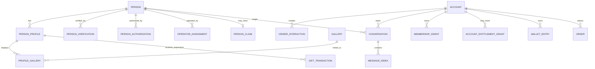

# 真人发现平台数据模型与渐进迁移方案

App 版本：1.0

日期：2026-08-10

状态：需求讨论中；M0 公开投影、M1 空权威表与 Membership-4 目录管理平面已进入开发验证

范围说明：目标模型覆盖长期产品，但 App 1.0 只要求会员目录/grant/entitlement、钱包账本和管理员调币。`products`、`orders`、礼物和装扮表在未来商业化 Feature 冻结后再创建 production migration，不能因出现在目标模型中而默认进入 1.0 实现。

## 1. 目标

将现有 MeiGallery 的账号、会员、图库、媒体、标签和后台能力逐步接入共享核心，同时建立真人、公开资料、运营归属、会话、五级会员和虚拟商业化的新模型。迁移期间 Web 保持可用，App 不直接依赖 legacy 表。

## 2. 核心对象

### 2.1 不可合并的概念

- `Account`：登录、设备、角色、隐私和付费主体。
- `Person`：现实中的真人主体和权利事实，不一定有账号。
- `PersonProfile`：经过审核的公开展示版本，可有版本历史。
- `Gallery`：图片/视频内容集合，可关联一个或多个合法主体。
- `OperatorAssignment`：当前由平台运营还是本人运营，以及管理员分配。

## 3. 目标表族

表名为设计建议，实施前通过 D1 migration 和技术评审冻结。

### 3.1 身份和账号

| 表 | 关键字段 | 说明 |
|----|----------|------|
| `accounts_v2` | `id`, `legacy_user_id`, `status`, `region`, `created_at` | 共享账号 |
| `account_identities` | `account_id`, `provider`, `provider_subject`, `verified_at` | 登录标识 |
| `account_devices` | `account_id`, `device_id`, `platform`, `session_version` | 设备和远程退出 |
| `account_roles` | `account_id`, `role`, `scope` | RBAC |
| `consent_records` | `account_id`, `document_version`, `decision`, `created_at` | 条款/隐私选择 |
| `privacy_preferences` | `account_id`, `purpose`, `enabled`, `policy_version`, `updated_at` | 分用途隐私与推荐设置 |
| `data_right_requests` | `id`, `account_id`, `type`, `status`, `workflow_ref`, `created_at` | 导出、清除和注销 Workflow |

#### 3.1.1 Auth-1 账号访问实施边界

`0069_app_account_access.sql` 采用“复用现有账号主体 + 增量 App 身份表族”的过渡方式，不创建第二套可登录用户表：

- `users.id` 继续作为服务端内部账号主键；`app_account_security.account_public_id` 生成稳定 `acc_*` API ID，客户端不接触自增 ID。
- `app_account_identities` 仅在邮箱验证码注册或现有账号密码验证成功后写入，provider subject 使用 SHA-256 摘要，不能仅凭相同邮箱静默合并。
- `app_account_consents` 记录条款、隐私、平台运营说明和必要资格说明的文档版本、决定、请求 ID 与时间；当前不写死年龄数值、首发地区或证件材料。
- `app_devices` 只保存随机安装标识摘要、平台、可理解设备名、App 版本和 session version；不保存广告 ID、硬件序列号或精确位置。
- `app_sessions` 保存可撤销的 Access/Refresh Token 摘要和账号/设备版本；`app_refresh_token_history` 支持旋转凭证重放检测。
- `app_account_security_events` 只记录安全事件引用和原因码，不保存邮箱、Token、验证码或安装标识原文。
- migration 没有 seed、用户回填或 production 数据写入；Web Cookie 会话继续独立工作，App 能力由默认关闭的 feature flag 控制。

该结构只支持 Auth-1 开发验证。正式账号 schema、文档版本、保留期、年龄/资格证明和地区字段仍须 G-01/G-03 关闭后再决定；不得把本表族命名直接解释为已冻结目标表名。

### 3.2 真人、资料和内容

| 表 | 关键字段 | 说明 |
|----|----------|------|
| `persons` | `id`, `status`, `claim_status`, `created_at` | 真人主体，不含不必要公开字段 |
| `person_profiles` | `id`, `person_id`, `display_name`, `region_id`, `verification_status`, `publish_status`, `version` | 公开资料 |
| `person_authorizations` | `person_id`, `purpose`, `evidence_ref`, `valid_from`, `valid_until`, `status` | 用途授权 |
| `person_verifications` | `person_id`, `type`, `result`, `evidence_ref`, `reviewer_id`, `reviewed_at` | 核验范围和结果 |
| `operator_assignments` | `person_id`, `mode`, `operator_group_id`, `valid_from`, `valid_until` | 平台/本人运营模式 |
| `person_claims` | `person_id`, `claimant_account_id`, `status`, `workflow_id` | 本人认领 |
| `profile_galleries` | `profile_id`, `gallery_id`, `sort_order`, `status` | 真人资料与图库映射 |
| `media_rights` | `media_id`, `person_id`, `purpose`, `evidence_ref`, `status` | 媒体权利 |

`display_name` 可以是审核通过的公开名称，不等同法定姓名。敏感身份材料不进入公开 profile 表。

### 3.3 发现与互动

| 表 | 关键字段 | 说明 |
|----|----------|------|
| `profile_public_projections` | `profile_id`, `person_id`, 公开展示快照、资格状态、地区、排序分数、`source_gallery_id`, `projection_version`, `published_at` | M0 已创建的可重建公开只读投影；不是认证/授权权威表 |
| `app_taxonomy_terms` | `term_id`, `type`, `parent_term_id`, `lifecycle_status`, `version` | Taxonomy-1 标签、地区和分类稳定词条编辑事实 |
| `app_taxonomy_term_revisions` | `term_id`, `version`, 修订快照、`change_reason` | 不可变词条修订历史，别名当前随修订以受约束 JSON 保存 |
| `app_taxonomy_legacy_mappings` | 来源命名空间/类型/规范值、`mapping_type`, `target_term_id`, 规则版本 | MeiGallery/外部值显式映射；未知值默认待复核 |
| `app_taxonomy_catalogs` / `app_taxonomy_catalog_items` | `catalog_id`, `version_code`, `effective_at`, 不可变条目快照 | Taxonomy-1 不可变目录发布版本和合并重定向 |
| `person_profile_taxonomy_assignments` | `profile_id`, `profile_version`, `catalog_id`, `term_id`, `catalog_term_version` | 人物内容版本结构化标注 |
| `profile_public_taxonomy_terms` | `profile_id`, `term_id`, `taxonomy_type`, `catalog_id` | 随人物发布原子刷新的公开分类投影 |
| `viewer_interactions` | `account_id`, `profile_id`, `type`, `idempotency_key` | 喜欢/关注/收藏 |
| `favorite_folders` | `id`, `account_id`, `name`, `sort_order` | 收藏夹 |
| `favorite_folder_items` | `folder_id`, `profile_id`, `created_at` | 收藏归档 |
| `view_history` | `account_id`, `profile_id`, `viewed_at`, `expires_at` | 浏览历史 |
| `search_history` | `account_id`, `query_ref`, `searched_at`, `expires_at` | 本人搜索历史；敏感原文不进入分析 |
| `profile_blocks` | `account_id`, `profile_id`, `status`, `created_at` | 服务端拉黑与解除状态 |
| `app_recommendation_policies` | `policy_id`, capability、生产门禁、隐私决策和容量上限 | Recommendation-1 显式策略版本 |
| `app_recommendation_rule_versions` | `rule_version_id`, `rule_set_id`, `mode`, `state`, 权重、灰度、排期和回退引用 | 版本化推荐规则；只允许草稿阶段原位编辑 |
| `app_recommendation_rule_events` | `rule_version_id`, `from_state`, `to_state`, `action`, `actor_id` | 推荐规则追加式状态时间线 |
| `app_recommendation_preferences` | `account_id`, `personalization_enabled`, `taxonomy_catalog_id`, 稳定词条 | 本人主动选择的推荐偏好 |
| `app_recommendation_editorial_placements` | `placement_id`, `profile_id`, `priority`, 时间窗、地区和状态 | 固定披露“平台精选”的运营排期 |
| `app_recommendation_heat_versions` / `app_recommendation_heat_scores` | 不可变公式版本；`profile_id`, 整数分数、样本量和时间窗 | OQ-009 批准后才可发布的热度投影 |
| `app_recommendation_sessions` / `app_recommendation_session_items` | 摘要账号、规则、上下文、资料、理由和到期时间 | OQ-020 批准并启用 purge 后才写入的最小化证据 |
| `app_recommendation_admin_requests` | `admin_id`, 幂等键摘要、请求摘要和结果引用 | 规则创建/复制与精选创建幂等事实 |
| `notification_event_definitions` | `event_type`, `category`, `necessity`, `schema_version`, `status` | 事件、必要性、去重和 action 契约 |
| `notification_templates` | `id`, `event_type`, `locale`, `version`, `status`, `effective_at` | 不可变站内模板版本 |
| `notifications` | `id`, `account_id`, `category`, `event_ref`, `template_version`, `target_ref`, `status`, `read_at`, `created_at` | App 1.0 站内通知、目标和未读状态 |
| `notification_preferences` | `account_id`, `category`, `enabled`, `updated_at` | 站内通知偏好；必要安全通知不可关闭 |

`viewer_interactions` 不存在 reciprocal/matched 状态。

#### 3.3.1 M0 公开投影实施边界

`0067_app_public_profile_projection.sql` 是首条 App 读链路的过渡反腐层，不提前创建仍受 OQ-006～OQ-008、OQ-024 约束的 Person、Verification、Authorization 和 Media Rights 权威表：

- 表默认为空，migration 不包含 seed、回填或从 `galleries` 自动插入的 SQL。
- `source_gallery_id` 只表示管理员明确批准后复用的媒体来源；仅有 published gallery 不会生成 Person/Profile。
- 公开查询同时检查 `verification_status=verified`、`publication_status=published`、`authorization_status=active`、授权已开始且未过期、认证未过期、`visibility_status=visible` 和来源图库仍发布。
- `tags_json`、地区、运营披露和推荐原因是发布时生成的审核快照，避免直接把 legacy 自由标签当公开真人事实。
- 认证、授权或可见性撤回后，投影写入方必须立即更新/删除记录；在后台写流程落地前不得向生产手工灌入人物数据。
- 权威表完成后由单向 projector 重建此表；客户端契约继续只消费 stable `per_`/`pp_` ID，不感知 legacy ID。

#### 3.3.2 M1 人物供给实施边界

`0068_app_person_supply_workflow.sql` 已创建空的 `persons`、`person_profiles`、`person_authorizations`、`person_verifications` 和 `person_publication_reviews`，并为公开投影增加授权开始时间、认证到期时间、内容版本和三类审批记录 ID：

- `person_profiles.content_version` 只标识内容快照；`lock_version` 独立承担后台乐观并发，避免一次状态审批导致已有认证错误失效。
- 用途授权和认证记录都绑定 `profile_id + profile_version`；证据只保存私有引用，不复制敏感原件。
- 认证检查至少覆盖身份/真实存在、授权或代理关系、资料一致性、媒体权利四项；正式证据强度和对外声明仍是生产门禁。
- 发布复核只能读取当前内容版本的有效授权与认证；通过后单向 upsert `profile_public_projections`，并记录授权、认证、发布和投影版本引用。
- 编辑已经发布的资料只增加草稿内容版本，线上投影继续保留旧审定快照；暂停或撤销立即把投影设为不可见。
- 当前 API 仅支持管理员单笔创建候选，不从 legacy 图库自动生成人物。未来批量候选导入必须是独立任务、默认草稿、逐项失败和人工复核，不得复用公开投影作为写主。
- M1 migration 尚未执行 production，且没有任何真实人物、证据、seed 或回填数据。

#### 3.3.3 Recommendation-1 推荐数据实施边界

`0083_app_recommendation_rules_and_editorial.sql` 只建立默认关闭的 development 数据骨架：

- migration seed 一条未发布策略和一条未批准热度草稿；仅当现有 Owner 存在时创建 `rolloutPercent=0` 的非个性化规则草稿，不创建 active/scheduled 规则、偏好、排期或曝光。
- 推荐运行不复制人物事实，始终读取 `profile_public_projections` 并复用认证、授权、发布、有效期、可见性和来源图库资格；精选引用 `person_profiles`，但返回前仍以公开投影重新校验。
- 规则通过 `rule_set_id + version_number` 表达版本序列；同一入口/模式最多一个 active 和一个 scheduled。灰度目标必须引用同模式、同入口且曾安全生效的回退版本。
- `app_recommendation_preferences` 只保存账号主动开启状态、不可变 taxonomy 目录和最多 20 个稳定词条；关闭时原子清空目录和词条，不保留隐式画像。
- `app_recommendation_sessions` 只预留最小化证据结构。只有策略同时批准证据保留天数并开启 purge 时运行时才允许写入；账号只保存基于服务端密钥、与游标签名分用途隔离的 HMAC 摘要。推荐游标短期有效，不能在证据清理后重建旧会话并延长保留期。
- 热度公式、样本量和反刷方案未批准前，规则热度权重必须为 `0`；既有公开投影的 legacy 分数不自动升级为正式热度事实。
- migration 不修改 Wrangler、不切换 capability、不导入真实数据；配置、migration 执行与验证在全部开发完成后的统一阶段处理。

### 3.4 会话与代运营

| 表 | 关键字段 | 说明 |
|----|----------|------|
| `conversations` | `id`, `viewer_account_id`, `person_id`, `operation_mode`, `status`, `disclosure_version`, `last_sequence` | 会话索引与接收主体披露 |
| `conversation_assignments` | `conversation_id`, `operator_id/group_id`, `status`, `lease_version`, `assigned_at` | 管理员分配和并发租约 |
| `message_index` | `conversation_id`, `sequence`, `client_message_id`, `sender_type`, `sender_ref`, `content_ref`, `status`, `recall_until` | D1 查询投影、幂等和撤回窗口 |
| `message_receipts` | `conversation_id`, `sequence`, `recipient_type`, `read_at` | 实际接收主体回执 |
| `conversation_handover_consents` | `conversation_id`, `account_id`, `decision`, `version` | 历史交接同意 |
| `internal_conversation_notes` | `conversation_id`, `operator_id`, `body_ref` | 后台隔离备注 |

消息权威顺序和短期实时状态由 Durable Object 管理；D1 保存可检索投影。内部备注绝不进入用户消息投影。

### 3.5 会员与商业化

| 表 | 关键字段 | 说明 |
|----|----------|------|
| `membership_catalog_versions` | `id`, `region`, `status`, `effective_at`, `min_client_version` | 不可变会员目录发布版本 |
| `membership_tiers` | `id`, `rank`, `name`, `catalog_version` | 五级展示目录；名称不参与授权 |
| `entitlement_definitions` | `key`, `value_type`, `schema_version`, `merge_policy`, `safe_default` | typed 权限定义 |
| `tier_entitlements` | `tier_id`, `key`, `value_json` | 等级权益 |
| `membership_grant_requests` | `id`, `account_id`, `action`, `tier_id`, `status`, `operator_id`, `approver_id` | 发放、续期、替换、撤销和复核请求 |
| `membership_grants` | `id`, `account_id`, `tier_id`, `source`, `valid_from`, `valid_until`, `revoked_by_event_id` | 会员等级的追加式有效记录 |
| `account_entitlement_grants` | `id`, `account_id`, `key`, `value_json`, `source`, `valid_from`, `valid_until` | 经授权的账号级例外权益 |
| `entitlement_usage_counters` | `account_id`, `key`, `period_start`, `used`, `version` | 额度原子消费和周期重置 |
| `products` / `product_versions` | `id`, `type`, `price`, `currency`, `resource_version` | 未来商业化：会员/金币/礼物/装扮目录 |
| `orders` | `id`, `account_id`, `external_transaction_id`, `status` | 未来商业化：订单 |
| `wallets` | `account_id`, `currency_code`, `balance_snapshot`, `last_sequence`, `version` | 钱包权威查询快照；可从分录重建 |
| `wallet_entries` | `id`, `account_id`, `sequence`, `direction`, `amount`, `reason_code`, `previous_balance`, `balance_after`, `reversal_of` | 只追加账本 |
| `gift_transactions` | `id`, `account_id`, `profile_id`, `product_version_id`, `wallet_entry_id` | 未来商业化：礼物记录 |
| `cosmetic_inventory` | `account_id`, `product_version_id`, `valid_until`, `equipped_slot` | 未来商业化：装扮库存 |
| `coin_adjustment_requests` | `id`, `business_ref`, `account_id`, `direction`, `amount`, `operator_id`, `approver_id`, `reason`, `status` | 单笔调币、复核和执行 |
| `coin_adjustment_batches` / `items` | `id`, `status`, `operator_id`, `approver_id`; `batch_id`, `account_id`, `external_ref`, `status` | 批量校验、逐项幂等和部分结果 |

Membership-4 当前实现使用 `app_membership_catalog_metadata`、`app_membership_catalog_commands`、`app_membership_catalog_publish_requests/events/decisions` 为既有五级目录增加基线、乐观锁、内容哈希、管理员幂等和独立发布复核。目录创建采用全量复制；当前环境引用、已发布、待复核以及被 grant、会员申请或后继目录引用的版本不可原地修改。`0089` 只建立 schema 和既有目录 metadata，不切换运行目录、不迁移 grant、不批准真实 production-ready；执行、配置和测试统一后置。

### 3.6 审核和审计

| 表 | 说明 |
|----|------|
| `review_cases` | 真人、媒体、消息、举报和认领审核队列 |
| `reports` / `report_evidence` | 用户举报和最小证据快照 |
| `moderation_actions` | 暂停、隐藏、冻结、警告和恢复 |
| `audit_events_v2` | 管理员和高风险系统写操作的追加事件 |
| `audit_integrity_checkpoints` | 审计 sequence、完整性清单、验证与恢复结果 |
| `metric_definitions` / `metric_versions` | 运营指标定义、Owner、来源、敏感级别和生效版本 |
| `metric_snapshots` | 按允许维度聚合的指标结果、新鲜度和质量状态 |
| `operational_incidents` | 异常级别、Owner、状态、Runbook 和处置时间线 |
| `migration_jobs` / `migration_items` | 迁移任务、逐项结果、重试和证据 |

## 4. Stable ID 与映射

- v2 使用不可枚举字符串 ID；具体 ULID/UUIDv7 在 API 与数据模型冻结前通过独立技术决策确定。
- `legacy_id_mappings` 保存实体类型、legacy ID、v2 ID、迁移批次、校验哈希和状态。
- 对外 API 只暴露 v2 ID，不暴露 D1 自增 ID。
- 映射唯一且不可重用；删除/合并使用状态和关联事件表达。

## 5. MeiGallery 复用规则

| 现有数据 | 复用方式 | 禁止事项 |
|----------|----------|----------|
| 用户 | 建立账号影子映射，用户主动登录/接受新条款后激活 | 不自动成为公开真人 |
| 会员 | 映射有证据的 rank/有效期，生成独立 grant | 不把旧名称当新权限 |
| 图库/媒体 | 保留原 ID 引用或复制到共享内容域，逐项复核用途授权 | 不因已在网站展示就默认可用于互动 App |
| 标签/地区 | 归一化到统一 taxonomy，并保留 alias | 不直接信任自由文本进行权限/地区判断 |
| 管理员 | 映射账号后重新授予最小角色 | 不继承全量 Owner 权限 |
| 审计 | 原日志只读保留，新操作写 v2 审计 | 不重写历史操作者和时间 |

## 6. 迁移阶段

### 阶段 0：盘点与冻结

- 导出现有 schema、数据量、权限、媒体来源和会员状态。
- 建立数据字典、敏感级别、Owner、保留期和用途授权清单。
- 冻结任何“直接将图库人物变成交友账号”的脚本或方案。

退出条件：每类数据有 Owner、合法用途、映射策略和不迁移规则。

### 阶段 1：v2 地基与影子 ID

- 创建 v2 核心表、stable ID 和 legacy 映射。
- 全量生成不可见影子账号和内容映射，不改变前台行为。
- 建立逐批哈希、数量和引用完整性对账。

当前 Auth-1 只在用户完成 App 注册，或现有用户成功验证密码并接受当前文档后按需创建账号公共 ID、身份映射、同意和设备会话；尚未执行“全量生成不可见影子账号”，也没有离线回填现有用户。

退出条件：映射可重复运行且结果幂等，Web 仍以 legacy 为写主。

### 阶段 2：真人资料候选创建与受控导入

- 当前由管理员从明确来源图库单笔创建候选 `Person` 和 `PersonProfile` 草稿；未来如启用批量方式，只能生成默认不可见候选，不能自动发布。
- 导入来源与授权证据引用，未知或不足的标为待补证。
- 管理员逐项认证和发布；任何候选默认不可公开。

退出条件：公开投影只包含人工确认的 `verified + published` 资料。

### 阶段 3：App 发现与互动

- App 读取 v2 公开投影，互动只写 v2。
- 标签、媒体和账号必要信息通过适配器或单向同步获取。
- 建立推荐、互动和受保护媒体访问对账。

退出条件：App 不直接查询 legacy 表，暂停资料可快速撤回。

### 阶段 4：App 1.0 私信、会员与金币账本

- 新建 v2 会话、管理员分配、站内通知、五级目录、entitlement grant 和钱包账本。
- 旧会员仅通过一次性、可追溯 grant 映射；不双写余额。
- 管理员会员发放和调币全部写 v2；不创建商店订单或用户金币消费。

退出条件：会员 grant、entitlement、调币/账本对账通过，代运营披露和审计完整。

### 阶段 5：未来在线商业化

- 按独立 Feature migration 创建商品、订单、礼物和装扮表。
- 商店回调、购买、退款、用户扣币和库存全部写 v2。
- 上线前完成商店、账本和库存逐笔对账。

退出条件：订单、权益、账本和库存日对账通过，客户端版本门槛有效。

### 阶段 6：Web 渐进切换

- 按账号、权益、标签、媒体和图库顺序，把 Web 读取切向共享核心。
- 先双读比较，再切换读主；写路径每次只保留一个主系统。
- 删除 legacy 写路径前跨越明确兼容和回滚窗口。

退出条件：连续对账通过、旧版本支持窗口结束、归档有恢复验证。

### 阶段 7：本人认领与交接

- 认领 Workflow 绑定真人和账号。
- 新会话路由本人；历史会话只按批准的同意记录迁移可见性。
- 运营模式切换、撤回和争议均有审计和回滚。

## 7. 双读、写主与回滚

| 阶段 | 写主 | 影子/双读 | 回滚方式 |
|------|------|-----------|----------|
| 0–1 | legacy | v2 映射 | 删除未发布影子批次 |
| 2 | v2 真人草稿 | legacy 图库只读 | 撤销候选/投影，不改 legacy |
| 3 | v2 互动 | 公开投影与 legacy 内容对账 | 关闭 App feature flag |
| 4 | v2 私信、会员与金币账本 | grant/entitlement/账本对账 | 停止新会话/调币，forward-fix |
| 5 | v2 在线商业化 | 外部商店/订单/库存对账 | 停止新单，forward-fix |
| 6 | 每模块唯一写主 | 双读比较 | 路由切回上一读主 |
| 7 | v2 | 交接前后快照 | 暂停路由并恢复上一运营模式 |

已发生的订单、账本、消息和审计不做破坏性回滚，采用 forward-fix、冲正或状态恢复。

## 8. 数据质量校验

- 映射唯一性和引用完整性。
- `verified + published` 与公开投影集合完全一致。
- active taxonomy/地区引用可解析到同一 catalog version，merged/archived 词条不存在悬空公开引用。
- 个性化关闭或历史清除后，新推荐曝光不再引用被禁用的账号行为信号。
- 每个公开媒体存在有效用途授权和可访问派生资源。
- 会话运营模式与当前 OperatorAssignment/Claim 一致。
- App 1.0 会员 grant、entitlement 和管理员钱包分录可逐笔关联；未来商业化启用后再加入订单和库存关联。
- 余额快照等于有效分录汇总。
- 管理员写入都有审计；内部备注不会出现在用户 API。
- 拉黑、资料暂停和账号限制与推荐、互动、会话和媒体撤权状态一致。
- 数据导出不包含其他主体或内部备注，注销后隔离保留数据不进入普通产品查询。

## 9. 隐私、保留和删除

- 身份、授权、消息、账务、安全证据分别制定保留策略。
- 公开资料与敏感身份材料分表/分存储、分权限。
- 用户删除账号后撤销登录和公开关联；法定账务/安全证据按批准期限隔离保留。
- 真人授权撤回时停止新展示和新凭证，进入内容撤回与争议 Workflow。
- 数据导出只包含请求者有权获得的数据，不包含管理员内部备注或其他主体隐私。

## 10. 迁移验收

- **DATA-AC-001**：普通账号映射后不产生公开真人资料。
- **DATA-AC-002**：没有用途授权证据的媒体不能进入已发布公开投影。
- **DATA-AC-003**：迁移任务重复运行不会复制真人、互动、权益或账本分录。
- **DATA-AC-004**：任一批次可查看输入、输出、失败、哈希、审计和回滚点。
- **DATA-AC-005**：App API 不包含 legacy 自增 ID，也不直接查询 legacy 表。
- **DATA-AC-006**：App 1.0 会员 grant 和余额在切换前后逐笔对账，无静默覆盖；订单在未来商业化阶段加入验收。
- **DATA-AC-007**：认领后历史会话没有同意记录则真人账号不可读取。
- **DATA-AC-008**：关闭 v2 feature flag 后，现有 Web 不受影响且新写入安全停止。
- **DATA-AC-009**：Access/Refresh Token、邮箱 identity subject 和安装标识在 D1 只保存不可逆摘要，API、日志和安全事件不返回摘要或原值。
- **DATA-AC-010**：旧 Refresh Token 重放、账号/设备撤权或 session version 变化后，相关旧 Access Token 在下一次请求被拒绝。
