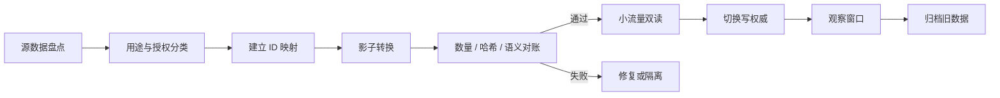

# 数据模型与渐进迁移方案

版本：1.0

日期：2026-07-19
状态：`[已确认范围 / 目标设计 / 迁移设计]`

## 1. 迁移目标

首批允许评估复用的数据包括：现有用户账号、会员等级、合法授权媒体、标签分类和管理员体系。复用的前提是用途兼容、数据质量达标和用户重新授权。

迁移的核心原则：

- 先建立共享目标模型，再迁移数据；不让新 App 直接依赖遗留 schema。
- 账号可复用，交友身份必须重新激活。
- 媒体可复用对象文件，不能复用未覆盖交友展示用途的授权。
- 数据迁移使用可重入任务、批次报告、双读对账和明确回滚点。
- 不长期双写。双写只存在于受控过渡窗口，并有唯一权威来源。

## 2. 当前数据评估

| 当前数据 | 当前结构 | 可复用程度 | 目标处理 |
|----------|----------|------------|----------|
| 用户 | `users`，整数 ID、邮箱密码、昵称、头像、角色 | 条件复用 | 建立不可枚举 `account_id` 和 `legacy_user_link`；重新验证手机号、年龄和新条款 |
| 会话 | `sessions`，Web cookie token hash | 不迁移 | 保持 Web 有效窗口；App 创建独立 token session |
| 会员等级 | `membership_levels`，以 rank 比较 | 可复用定义 | 转换为共享 entitlement catalog；名称不作为权限判断 |
| 用户会员 | `user_memberships`，时间区间与人工发放者 | 可复用事实 | 导入为 `entitlement_grants`，保留来源、原 ID、有效期和发放者 |
| 图库 | `galleries` | 不作为交友资料复用 | 继续属于 Gallery 域；必要时只作为授权媒体来源证据 |
| 媒体 | `media_assets`，R2/Stream，归属于 gallery | 条件复用对象 | 经权利复核和主体同意后创建新的 `profile_media` 引用；原归属不改变 |
| 标签 | `tags`，含地区、身份、性格、风格、职业等 | 白名单复用 | 建立受控词表映射；敏感或语义不合适的标签不迁移 |
| 管理员 | `users.role` 的 admin/owner | 条件复用 | 映射到 RBAC 角色；强制 MFA 和重新授权，不能复用普通 Web session |
| 审计日志 | `admin_audit_logs` | 历史保留 | 只读归档；新平台写统一审计事件，保留 legacy 引用 |
| 站内分析/广告归因 | 多张分析与归因表 | 不迁移到交友画像 | 业务隔离；未取得交友用途同意不得用于推荐或营销 |

## 3. 数据用途门禁

### 3.1 账号迁移

账号迁移只建立身份关联，不自动完成以下动作：

- 不自动创建交友资料。
- 不自动公开昵称、头像、地区、职业或标签。
- 不自动开启定位、个性化推荐、推送或营销。
- 不自动将现有会员权益映射为付费订阅，除非权益规则明确且向用户说明。

首次进入 App 时，用户必须完成：

1. 旧账号控制权验证。
2. 手机号验证和成年人门槛。
3. 独立交友服务条款与隐私政策同意。
4. 迁移字段逐项确认。
5. 资料创建与审核。

### 3.2 媒体迁移

媒体只有同时满足以下条件才能成为 `profile_media`：

- 已确认上传者或权利人身份。
- 授权范围明确包含交友资料展示、推荐流和必要的审核处理。
- 照片主体与交友账号是同一人，或具有可验证的合法代理关系。
- 不包含未成年人、第三方隐私、敏感证件或禁止内容。
- 通过交友资料媒体审核。

若任一条件不满足，媒体仍可留在 Gallery 域，但不得出现在交友发现流。

### 3.3 标签迁移

| 当前标签类型 | 默认策略 | 说明 |
|--------------|----------|------|
| `personality`、`style`、`occupation` | 人工白名单映射 | 用户主动选择后才进入资料 |
| `city_country`、`region_*` | 转为标准地区代码 | 不迁移自由文本精确地址 |
| `hair`、`clothing`、`scene` | 默认不迁移 | 更适合内容描述，不应自动成为人物身份标签 |
| `identity` | 逐项隐私评估 | 可能涉及敏感身份、性取向或其他高风险画像 |
| `content_type` | 保留在 Gallery 域 | 不进入交友推荐画像 |

## 4. 目标核心实体

### 4.1 身份与同意

| 实体 | 关键字段 | 说明 |
|------|----------|------|
| `accounts` | `id`, `status`, `public_id`, `created_at` | 共享身份根，不存公开资料 |
| `account_credentials` | `account_id`, `type`, `identifier_hash`, `verified_at` | 邮箱、手机号、第三方登录；敏感标识加密或哈希 |
| `account_sessions` | `token_hash`, `device_id`, `audience`, `expires_at`, `revoked_at` | Web、App、Admin audience 隔离 |
| `legacy_user_links` | `account_id`, `source`, `legacy_user_id`, `migration_state` | 保留一对一迁移映射 |
| `verification_credentials` | `type`, `status`, `provider_ref`, `verified_at`, `expires_at` | 只保存最小结果和供应商引用 |
| `terms_acceptances` | `account_id`, `document_type`, `version`, `accepted_at`, `evidence` | 条款和政策版本留痕 |
| `privacy_consents` | `purpose`, `status`, `version`, `granted_at`, `withdrawn_at` | 位置、推荐、营销、迁移等独立目的 |

### 4.2 资料与社交

| 实体 | 关键字段 | 说明 |
|------|----------|------|
| `profiles` | `account_id`, `status`, `display_name`, `birth_year`, `city_code`, `bio` | 交友资料根 |
| `profile_versions` | `profile_id`, `version`, `review_status`, `submitted_at` | 审核版本，不直接覆盖线上版本 |
| `profile_media` | `profile_id`, `media_id`, `rights_status`, `review_status`, `sort_order` | 资料媒体引用与权利状态 |
| `profile_tags` | `profile_id`, `taxonomy_id`, `visibility` | 用户主动选择的受控标签 |
| `discovery_preferences` | 年龄段、城市范围、可见性、个性化开关 | 偏好和隐私设置 |
| `interactions` | `actor_id`, `target_id`, `type`, `idempotency_key`, `created_at` | 喜欢、跳过、招呼 |
| `matches` | `member_low`, `member_high`, `status`, `matched_at` | 规范化成员顺序保证唯一 |
| `blocks` | `blocker_id`, `blocked_id`, `reason_code`, `created_at` | 安全边界，查询优先级最高 |

### 4.3 消息与安全

| 实体 | 存储 | 说明 |
|------|------|------|
| `conversations` | 社交 D1 | 会话元数据、成员和状态 |
| `messages` | Durable Object SQLite | 权威消息、递增序号和幂等键 |
| `conversation_projections` | 社交 D1 | 会话列表、最后消息摘要、未读计数 |
| `reports` | 社交 D1 | 举报分类、状态、优先级和提交者 |
| `report_evidence` | D1 + 私有 R2 | 消息快照、媒体引用和证据哈希 |
| `moderation_cases` | 社交 D1 | 审核任务、决定、SLA 和申诉 |
| `safety_actions` | 社交 D1 | 限流、冻结、封禁和恢复的追加记录 |

### 4.4 权益与账本

| 实体 | 关键约束 |
|------|----------|
| `entitlement_products` | 商品与权益分离；平台 SKU 映射可版本化 |
| `entitlement_grants` | 来源、有效期、原订单/人工发放/legacy 引用必填 |
| `store_transactions` | `(store, original_transaction_id)` 唯一 |
| `wallet_accounts` | 每账号每币种唯一 |
| `wallet_ledger_entries` | 只追加；同一业务操作借贷平衡；幂等键唯一 |
| `gift_catalog` | 确定性商品、价格版本、上下架状态 |
| `gift_transactions` | 扣币、收件人、会话、账本交易和事件 ID 可追踪 |

## 5. 权威来源矩阵

迁移期间，每类数据只能有一个写入权威：

| 阶段 | 账号 | 会员/权益 | 资料/匹配 | 消息 | 媒体 |
|------|------|-----------|-----------|------|------|
| A 建模前 | legacy D1 | legacy D1 | 不存在 | 不存在 | legacy D1/R2 |
| B 影子迁移 | legacy D1 | legacy D1 | 新社交 D1 | DO | legacy 媒体 + 新引用 |
| C App 内测 | 核心 D1；legacy 通过兼容层 | 核心 D1，回投影给 Web | 新社交 D1 | DO | 共享媒体服务 |
| D Web 切换 | 核心 D1 | 核心 D1 | 新社交 D1 | DO | 共享媒体服务 |
| E 退役后 | 核心 D1 | 核心 D1 | 新社交 D1 | DO | 共享媒体服务 |

禁止在同一阶段让 legacy 和 core 同时接受同类主数据写入而没有冲突规则。

## 6. 迁移任务模型

### 6.1 批次与条目

每次迁移由 `migration_batches` 和 `migration_items` 记录：

- 源数据快照或 bookmark。
- 迁移类型、schema 版本和代码版本。
- 总数、成功数、跳过数、失败数和阻断数。
- 每条源 ID、目标 ID、输入摘要哈希、输出摘要哈希和失败码。
- 开始/完成时间、操作者、审批人和回滚锚点。

任务必须可重入：同一源记录和迁移版本重复执行时不能生成重复目标。

### 6.2 标准流程

## 7. 分阶段迁移

### M0：盘点与冻结契约

- 生成现有核心表、数量、外键缺口、重复账号和无效会员报告。
- 建立数据分类、处理目的、保留期限和授权证据清单。
- 冻结 legacy 到 v2 的映射契约，不冻结正常业务写入。

退出条件：所有首批字段有 `迁移/重采集/不迁移` 结论。

### M1：身份映射与影子读取

- 为每个现有用户创建 `account_id` 和唯一 legacy link。
- 不迁移 session、密码明文或无必要的历史行为数据。
- v2 只读展示迁移预览；不改变 Web 登录和会员判断。

退出条件：账号数量、唯一性、角色和状态 100% 对账；冲突账号有隔离清单。

### M2：同意驱动的 App 激活

- 用户首次登录时创建 App session。
- 记录新条款、成年人、迁移字段、位置和推荐同意。
- 仅为主动激活用户创建 draft profile。

退出条件：未激活账号在发现、匹配和消息查询中均不可见。

### M3：权益切换

- 将现有有效会员转换为 entitlement grant，保留 legacy 来源。
- Web 先双读比较旧 rank 与新 entitlement，差异只告警不切换。
- 连续观察无阻断差异后，Web 切换新权益读模型。

退出条件：有效期边界、最高 rank、多重会员和过期行为全部一致。

### M4：媒体与标签

- 媒体服务统一对象元数据，但 Gallery 与 Profile 关系分离。
- 已授权媒体由用户逐项选择并再次审核。
- 标签按白名单映射，未映射标签不阻断账号迁移。

退出条件：任何 profile media 都能追溯主体、来源、授权和审核决定。

### M5：管理员与 Web 模块迁移

- 管理员完成 MFA 和角色重授权。
- 后台模块逐个切到 v2；每次只迁一个权威边界。
- v1 进入只读和退役窗口。

退出条件：生产流量不再写 legacy 目标表，保留期结束后可归档。

## 8. 对账与验收

### 8.1 数量对账

- 源总数 = 成功 + 跳过 + 失败 + 阻断。
- 用户、角色、会员有效区间和媒体对象均有分类统计。
- 目标记录无孤儿账号、无重复 legacy link、无无效外键。

### 8.2 语义对账

- 在固定时点计算 legacy 与 target 的有效会员最高 rank，结果必须一致。
- disabled 用户不能在 target 中变成 active。
- 未验证邮箱不能在 target 中变成 verified。
- 未取得交友授权的媒体不能创建 profile media。
- admin/owner 迁移不能扩大原权限。

### 8.3 安全对账

- 迁移报告不得包含密码哈希、验证码、完整身份证号或媒体公开 URL。
- 迁移操作者和审批者分离，高风险批次写审计日志。
- 生产迁移前保存 D1 Time Travel bookmark、仓库外导出和 R2 清单哈希。

## 9. 回滚策略

回滚不是删除新库，而是恢复明确的写权威：

1. 停止新迁移 Workflow 和 Queue consumer。
2. 关闭 App 新激活或相关 feature flag。
3. 将 Web 读路径切回 legacy；App 显示维护状态。
4. 对已发生的新 App 消息、举报和订单保持只读，不反写 legacy。
5. 使用迁移批次映射隔离错误目标记录。
6. 如需恢复 D1，先验证恢复点不会覆盖迁移后合法交易或安全证据。

订单、账本、举报和消息一旦产生，不允许通过简单数据库回滚抹去；必须使用冲正、补偿或只读保全。

## 10. 注销与删除编排

账号注销由 Workflow 执行：

1. 立即停止登录、发现和消息发送。
2. 取消推送 token，处理订阅提示和恢复路径。
3. 冻结公开资料，撤销媒体访问凭证。
4. 删除或匿名化资料、偏好、设备、非必要分析数据和 UGC。
5. 按适用法律保留必要的账务、争议和安全证据，并限制用途。
6. 删除会话成员可识别信息；对方会话保留最小“账号已注销”系统状态。
7. 生成完成报告并通知用户。

注销流程必须同时满足 Apple App 内发起删除和 Google Play App 内 + Web 删除入口要求。

## 11. 中国大陆数据与跨境门禁

位置、身份、通信内容、联系人关系、消费记录和用户画像均可能构成个人信息或敏感个人信息。不能仅因为底层服务来自 Cloudflare 就假设满足中国大陆数据驻留、跨境提供和安全评估要求。

公开上线前必须完成：

- 数据流图和处理者/受托处理者清单。
- D1、R2、Durable Objects、日志、身份核验、支付和推送的数据位置与传输路径确认。
- 敏感个人信息单独同意、个人信息保护影响评估和保存记录。
- 跨境机制、备案/申报/合同等适用性法律意见。
- 数据主体查阅、复制、更正、删除、撤回同意和注销演练。

依据参考：[中华人民共和国个人信息保护法](https://www.cac.gov.cn/2021-08/20/c_1631050028355286.htm) 与 [个人信息保护政策法规问答（2026年1月）](https://www.cac.gov.cn/2026-01/09/c_1769688003183197.htm)。

## 12. 迁移完成定义

迁移阶段只有同时满足以下条件才能关闭：

- 数据数量、唯一性、引用和业务语义对账通过。
- 用户同意和媒体授权没有被迁移过程扩大。
- Web、App、后台的关键路径回归通过。
- 备份、恢复和回滚完成演练并记录证据。
- 迁移失败项有明确处置，不存在未分类失败。
- 旧数据进入只读归档并有删除日期与责任人。
