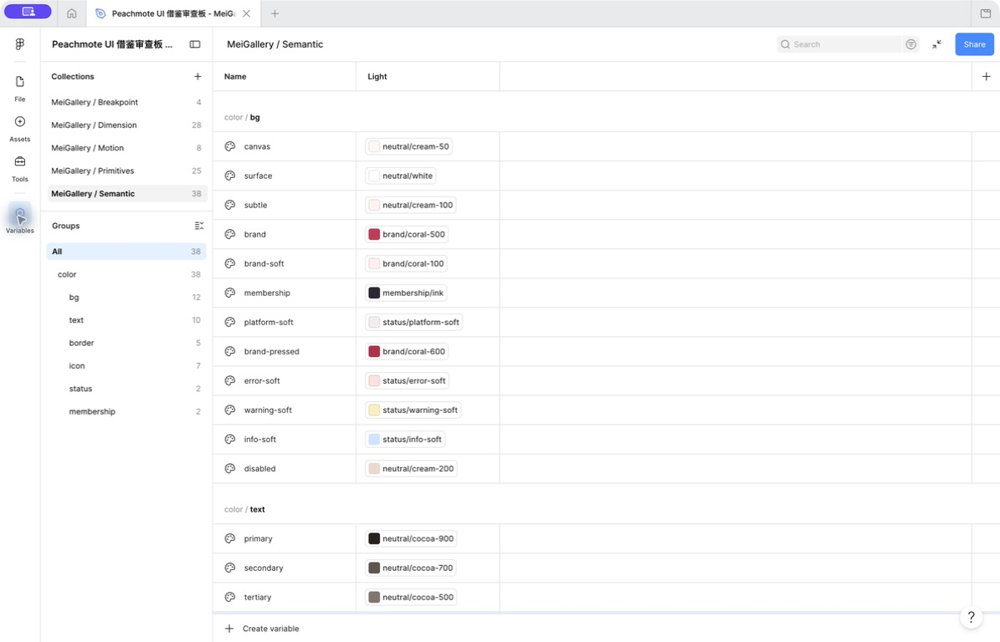

# MeiGallery App 1.0 Figma Design System Phase 1

App 版本：1.0

执行日期：2026-07-30

Figma 文件：`Peachmote UI 借鉴审查板 - MeiGallery`

Figma File Key：`LaNSwwGsznwcpV8msj7BQC`

阶段状态：已完成并通过结构校验

## 1. 阶段目标

本阶段只收口 Figma 变量、代码映射、文字样式和基础效果，不批量重画业务页面。目标是为后续 Icon Library、移动端组件、后台组件和全部页面重构提供稳定基础，同时保持已有品牌方向和历史变量兼容。

> 后续状态：基于本 Design System 的实时基线现为 99 页/408 个正式状态（移动端 208、后台 200）；本阶段正文中的旧数量只作历史快照。当前结论见 [Figma 最终交付审计与实施记录](./FIGMA_FINAL_DELIVERY_AUDIT_AND_PLAN.md)。

执行前已创建 Figma 回滚版本：

- 版本名：`App 1.0｜Phase 1 前基线`
- 版本说明：`变量、文字样式与基础规范统一前的回滚点`
- Version ID：`2381931297467463900`

## 2. 完成清单

| ID | 工作项 | 结果 |
|---|---|---|
| `P1.a` | 盘点现有变量集合、模式、样式与缺口 | 完成；基线为 3 个集合、59 个变量、8 个文字样式 |
| `P1.b` | 补齐原始色、间距、尺寸、描边、透明度、动效与断点 | 完成；新增 28 个非语义变量 |
| `P1.c` | 补齐语义别名 | 完成；新增 16 个语义变量，全部引用原始变量 |
| `P1.d` | 设置变量 Scope | 完成；未使用 `ALL_SCOPES`，代码型变量保持无画布 Scope |
| `P1.e` | 配置 Web、Android、iOS Code Syntax | 完成；103 个变量三端映射缺失均为 0 |
| `P1.f` | 统一 Noto Sans SC 文字/数字样式与基础效果 | 完成；13 个文字样式、4 个效果样式 |
| `P1.g` | 变量、别名、重复项和样式完整性校验 | 完成；重复、断链和语义原始值均为 0 |
| `P1.h` | 保存证据并同步研发文档 | 完成 |

## 3. 变量体系

### 3.1 集合与数量

| Collection | Mode | 数量 | 用途 |
|---|---|---:|---|
| `MeiGallery / Primitives` | `Value` | 25 | 不直接表达业务语义的颜色原值 |
| `MeiGallery / Semantic` | `Light` | 38 | 页面和组件使用的语义颜色别名 |
| `MeiGallery / Dimension` | `Value` | 28 | 间距、圆角、尺寸、描边和透明度 |
| `MeiGallery / Motion` | `Value` | 8 | 动效时长和缓动曲线 |
| `MeiGallery / Breakpoint` | `Value` | 4 | 移动端、平板、桌面和宽屏断点 |
| 合计 | — | 103 | — |

当前 App 1.0 只有浅色模式。后续如果新增深色模式，应在 `Semantic` 中增加 Mode，不复制业务页面或新建第二套语义变量。

### 3.2 本阶段新增原始颜色

| Variable | Value | 用途 |
|---|---|---|
| `status/error` | `#B42318` | 错误文字、边框、Icon |
| `status/error-soft` | `#FEE4E2` | 错误背景 |
| `status/warning` | `#B54708` | 警告文字、Icon |
| `status/warning-soft` | `#FEF0C7` | 警告背景 |
| `status/info` | `#175CD3` | 信息文字、Icon |
| `status/info-soft` | `#D1E9FF` | 信息背景 |

成功态沿用已有 `status/success`，品牌色、会员色与中性色保持现有方向，不重新选色。

### 3.3 本阶段新增语义颜色

| 类型 | Variables |
|---|---|
| 背景 | `color/bg/error-soft`、`color/bg/warning-soft`、`color/bg/info-soft`、`color/bg/disabled` |
| 文字 | `color/text/error`、`color/text/warning`、`color/text/info`、`color/text/disabled` |
| 边框 | `color/border/focus`、`color/border/error`、`color/border/disabled` |
| Icon | `color/icon/disabled`、`color/icon/error`、`color/icon/warning`、`color/icon/info`、`color/icon/success` |

上述 16 个变量全部使用 Variable Alias，不直接保存颜色值。页面和组件优先使用 `Semantic`，只有设计系统基础板可以直接展示 `Primitives`。

### 3.4 本阶段新增尺寸、描边与透明度

| 分类 | Variables |
|---|---|
| Icon | `size/icon-sm=16`、`size/icon-lg=24`、`size/icon-xl=32` |
| 点击容器 | `size/icon-button=48` |
| 描边 | `stroke/hairline=1`、`stroke/icon=1.75` |
| 透明度 | `opacity/disabled=0.38`、`opacity/hover=0.08`、`opacity/pressed=0.12`、`opacity/focus=0.16` |

既有 `size/icon-md=24` 暂不删除，以保持历史画板兼容。Icon Library 阶段将明确 `16/20/24/32` 视觉槽位，并迁移重复或语义冲突的旧命名。

### 3.5 动效变量

| Variable | Value |
|---|---|
| `duration/instant` | `0ms` |
| `duration/quick` | `120ms` |
| `duration/standard` | `200ms` |
| `duration/emphasis` | `320ms` |
| `duration/long` | `500ms` |
| `easing/standard` | `cubic-bezier(0.2, 0, 0, 1)` |
| `easing/decelerate` | `cubic-bezier(0, 0, 0, 1)` |
| `easing/accelerate` | `cubic-bezier(0.3, 0, 1, 1)` |

动效变量属于代码交付值，不绑定画布颜色、尺寸或文字 Scope。

### 3.6 断点变量

| Variable | Value |
|---|---:|
| `viewport/mobile` | 393 |
| `viewport/tablet` | 768 |
| `viewport/desktop` | 1024 |
| `viewport/wide` | 1440 |

断点用于 KMP 自适应布局、Nuxt 管理后台和 Figma 响应式验收，不代表每个 Page ID 都需要四套独立画板。

## 4. Code Syntax 与 Scope

103 个变量均配置：

- Web：CSS Custom Property 或项目 Token 标识符。
- Android：Kotlin/Compose Token 标识符。
- iOS：Swift Token 标识符。

示例：

| Figma Variable | Web | Android | iOS |
|---|---|---|---|
| `neutral/white` | 现有 Web 映射 | `MeiGalleryPrimitives.neutralWhite` | `MeiGallery.Primitives.neutralWhite` |
| `color/bg/canvas` | 现有 Web 映射 | `MeiGallerySemantic.colorBgCanvas` | `MeiGallery.Semantic.colorBgCanvas` |
| `spacing/md` | 现有 Web 映射 | `MeiGalleryDimension.spacingMd` | `MeiGallery.Dimension.spacingMd` |

三端实现仍应通过生成或集中 Token 文件消费这些标识符，不在业务组件中复制颜色和尺寸常量。

Scope 原则：

- 原始色和纯代码值不暴露为通用画布属性。
- 语义颜色只开放与其用途一致的 Fill、Stroke 或文字用途。
- 断点使用 `WIDTH_HEIGHT`。
- 全部变量均未设置 `ALL_SCOPES`。

## 5. 排版规范

字体统一为 `Noto Sans SC`。Figma 已确认可用字重：

`Thin`、`Light`、`DemiLight`、`Regular`、`Medium`、`Bold`、`Black`。

### 5.1 文字样式

既有 8 个样式保持：

- `App/Display`
- `App/Heading/Large`
- `App/Heading/Medium`
- `App/Title/Medium`
- `App/Body/Large`
- `App/Body/Medium`
- `App/Label/Large`
- `App/Label/Small`

本阶段新增 5 个样式：

| Style | Font | Size / Line height | 用途 |
|---|---|---|---|
| `App/Body/Small` | Regular | 12 / 18 | 时间戳、辅助说明和最小正文 |
| `App/Label/Action` | Medium | 14 / 20 | 按钮、标签与高频操作 |
| `App/Number/Balance` | Bold | 32 / 40 | 金币余额与会员权益主数值 |
| `App/Number/Amount` | Bold | 20 / 28 | 价格、数量与重点统计 |
| `App/Number/Metadata` | Medium | 14 / 20 | 距离、年龄、计数等紧凑数据 |

金额、余额和计数在实现端启用等宽数字；关键错误、权限、会员和金币说明不得降到 12sp 以下。

### 5.2 效果样式

| Style | 用途 |
|---|---|
| `App/Shadow/Card` | 普通卡片和悬浮列表项 |
| `App/Shadow/Floating` | 既有高层级悬浮元素 |
| `App/Shadow/Overlay` | Dialog、Bottom Sheet 和高层级浮层 |
| `App/Focus/Brand` | 键盘焦点与可访问性高亮 |

焦点效果不替代错误边框；状态冲突时同时保留错误语义和可见焦点。

## 6. 校验结果

| 校验项 | 结果 |
|---|---:|
| Variable Collections | 5 |
| Variables | 103 |
| 缺失 Web Code Syntax | 0 |
| 缺失 Android Code Syntax | 0 |
| 缺失 iOS Code Syntax | 0 |
| `ALL_SCOPES` | 0 |
| 同集合重名变量 | 0 |
| 断裂 Variable Alias | 0 |
| Semantic 直接颜色值 | 0 |
| Text Styles | 13 |
| Effect Styles | 4 |

## 7. 证据

变量集合、数量和语义别名截图：

截图显示 5 个集合及 `25 / 38 / 28 / 8 / 4` 的变量数量，并展示 `Semantic` 中背景与文字变量均指向原始变量。

## 8. 后续阶段入口

Phase 1 只完成基础变量和样式，不代表全部最终 UI 已冻结。下一阶段应：

1. 重构 Figma 文件页和交付索引，保留历史页为只读归档。
2. 建立 Tabler Icons 语义组件、标准槽位和 48dp 点击容器。
3. 以正式基础组件替换页面级按钮、独立 Vector 和未绑定文字。
4. 再按稳定 Page ID 批量完成移动端、管理后台和 Prototype Flows。
