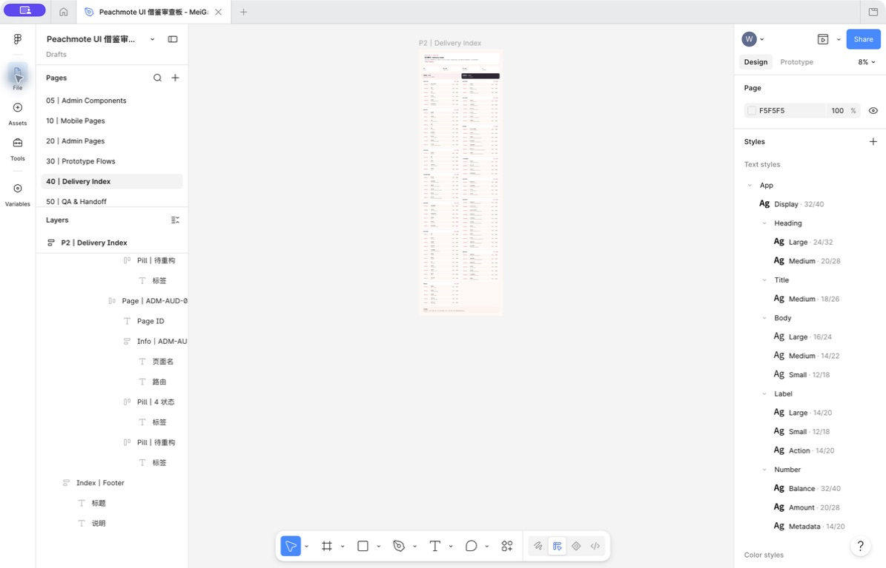
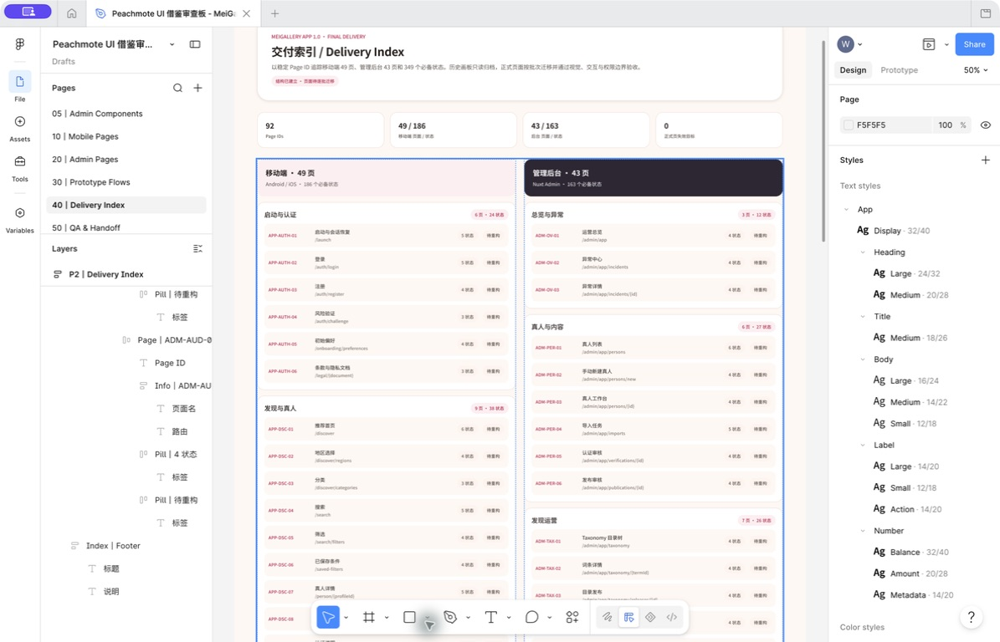
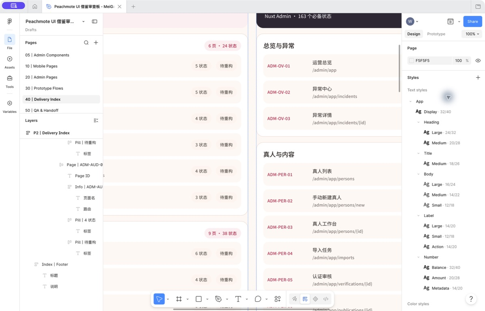
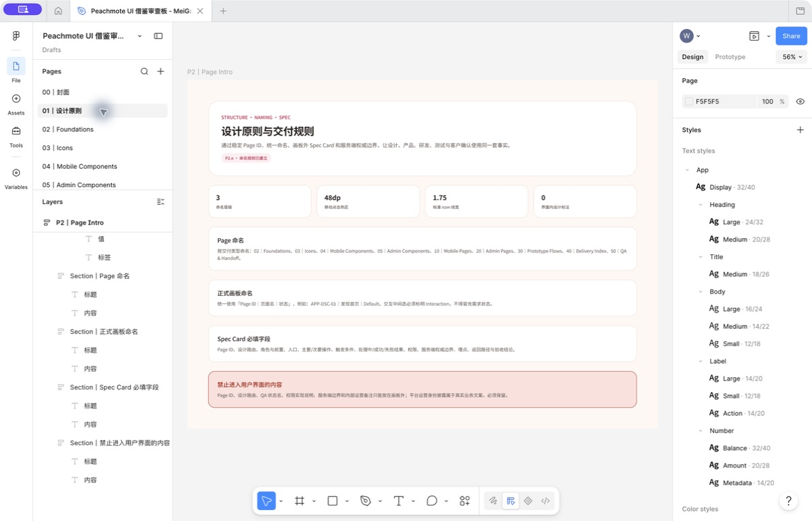

# MeiGallery App 1.0 Figma 文件结构 Phase 2

App 版本：1.0

执行日期：2026-07-30

Figma 文件：`Peachmote UI 借鉴审查板 - MeiGallery`

Figma File Key：`LaNSwwGsznwcpV8msj7BQC`

阶段状态：已完成并通过结构、样式和原型目标校验

## 1. 阶段目标

本阶段把多批次设计混放的 Figma 文件重构为“正式交付区 + 历史归档区”，建立 92 个 Page ID 的 Delivery Index、统一命名和 Spec Card 规则。历史节点不删除，原型目标 ID 不重建，以避免已存在的交互连接失效。

执行前已创建 Figma 回滚版本：

- 版本名：`App 1.0｜Phase 2 前基线`
- 版本说明：`Figma 文件结构、历史归档与 Delivery Index 重构前的回滚点`
- Version ID：`2381950989888493587`

## 2. 完成清单

| ID | 工作项 | 结果 |
|---|---|---|
| `P2.a` | 复核现有页面与正式/历史资产归属 | 完成；原有 10 页全部建立明确归档映射 |
| `P2.b` | 建立最终交付分页结构 | 完成；新建并排序 11 个正式交付页 |
| `P2.c` | 历史内容只读归档 | 完成；未删除画板，历史节点 ID 保持不变 |
| `P2.d` | 建立 92 Page ID Delivery Index | 完成；覆盖 49 个移动页、43 个后台页和 349 个状态 |
| `P2.e` | 建立画板与 Spec Card 命名规则 | 完成；规则已写入 Figma `01｜设计原则` |
| `P2.f` | 结构、文字样式与原型目标校验 | 完成；重复、空正式页、未绑定文字和失效目标均为 0 |
| `P2.g` | 保存截图、文档与阶段状态 | 完成 |

## 3. 正式交付区

| 顺序 | Page | Figma Page ID | 本阶段内容 | 后续责任 |
|---:|---|---|---|---|
| 1 | `00｜封面` | `145:57035` | 文件范围、状态、产品边界和规模 | 最终交付状态总览 |
| 2 | `01｜设计原则` | `145:57036` | Page、Frame、Spec Card 和标注边界 | 全阶段共同遵守 |
| 3 | `02｜Foundations` | `145:57037` | 103 个变量、13 个文字样式、4 个效果样式说明 | 维护 Design Token |
| 4 | `03｜Icons` | `145:57038` | Icon 尺寸、线宽、语义范围和状态门禁 | Phase 3 建立 Library |
| 5 | `04｜Mobile Components` | `145:57039` | KMP 移动端组件范围和状态 | Phase 3 完成 |
| 6 | `05｜Admin Components` | `145:57040` | Nuxt 管理后台组件范围和状态 | Phase 4 完成 |
| 7 | `10｜Mobile Pages` | `145:57041` | 49 页、186 状态、批次和边界说明 | Phase 3 完成 |
| 8 | `20｜Admin Pages` | `145:57042` | 43 页、163 状态、高风险优先流 | Phase 4 完成 |
| 9 | `30｜Prototype Flows` | `145:57043` | 14 条端到端旅程和连线门禁 | Phase 5 完成 |
| 10 | `40｜Delivery Index` | `145:57044` | 92 Page ID 的进度索引 | 每批设计后更新 |
| 11 | `50｜QA & Handoff` | `145:57045` | 视觉、交互、无障碍和交付同步门禁 | Phase 6 完成 |

11 个正式页均已有可阅读的 Intro 或 Delivery Index，不存在意义不明的空白正式页。

## 4. 历史归档区

| 原 Page ID | 归档后名称 | 子节点 | 处理 |
|---|---|---:|---|
| `9:2` | `90｜Archive｜00 封面` | 1 | 保留 |
| `9:3` | `90｜Archive｜01 设计说明` | 1 | 保留 |
| `9:4` | `90｜Archive｜02 视觉基础` | 1 | 保留 |
| `9:5` | `90｜Archive｜分隔 组件` | 0 | 保留为空分隔历史 |
| `9:6` | `90｜Archive｜03 核心组件` | 5 | 保留 |
| `9:7` | `90｜Archive｜分隔 页面` | 0 | 保留为空分隔历史 |
| `9:8` | `90｜Archive｜04 App 1.0 核心页面` | 221 | 保留全部历史移动画板 |
| `9:9` | `90｜Archive｜05 原型流程（空）` | 0 | 保留审计事实 |
| `25:2` | `90｜Archive｜06 色彩校准审查` | 4 | 保留 |
| `0:1` | `90｜Archive｜UI 借鉴审查` | 1 | 保留 |

归档规则：

- 历史区只用于参考、迁移和问题追溯，不作为研发实现入口。
- 迁移采用“复制到正式页 → 按 Design System 重构 → 视觉和状态 QA → 更新 Delivery Index”，不直接在归档页继续叠加新批次。
- 已有 Prototype reaction 的节点 ID 不变，因页面改名而不失效。

## 5. Delivery Index

`40｜Delivery Index` 已按两列建立移动端和管理后台索引：

| 平台 | Page ID | 必备状态 | 模块 |
|---|---:|---:|---:|
| 移动端 | 49 | 186 | 7 |
| 管理后台 | 43 | 163 | 7 |
| 合计 | 92 | 349 | 14 |

每行显示：

- 稳定 Page ID。
- 页面名称。
- 设计路由。
- 必备状态数量。
- 当前设计状态。

当前状态使用：

- `待迁移`：已有可复用的 Figma 最终状态，但尚未迁移到新的正式交付页。
- `待重构`：需要根据需求状态和统一 Design System 重做。
- 后续增加 `设计中`、`待 QA`、`已验收`，但不得用状态颜色代替文字。

Delivery Index 只表示设计交付进度，不改变产品优先级、研发状态或客户签署状态。

## 6. 命名与 Spec Card

### 6.1 正式画板

统一格式：

```text
Page ID｜页面名｜状态
```

示例：

```text
APP-DSC-01｜发现首页｜Default
APP-DSC-01｜发现首页｜Loading
APP-DSC-01｜发现首页｜Error
```

交互中间态必须标记 `Interaction`，不得冒充需求状态。

### 6.2 Spec Card

每个正式画板外必须记录：

1. Page ID 和设计路由。
2. 角色、前置条件和入口。
3. 主要操作、次要操作和返回路径。
4. 触发条件。
5. 处理中、成功和失败结果。
6. 权限与服务端权威边界。
7. 埋点和验收结论。

### 6.3 不进入用户界面的标注

以下内容只允许位于 Spec Card 或 Delivery Index：

- Page ID。
- 设计路由。
- QA 状态名。
- 权限实现说明。
- 服务端权威边界。
- 内部运营备注。

“平台运营接收”等属于真实业务披露，不是设计标注，必须继续显示在用户界面。

## 7. 校验结果

| 校验项 | 结果 |
|---|---:|
| Figma 总页面 | 21 |
| 正式交付页 | 11 |
| 历史归档页 | 10 |
| 重名页面 | 0 |
| 空白正式页 | 0 |
| Delivery Index 行 | 92 |
| 唯一 Page ID | 92 |
| 重复 Page ID | 0 |
| 功能模块卡 | 14 |
| 正式区文字节点 | 688 |
| 未绑定 Text Style 的正式区文字 | 0 |
| 含 reaction 的历史节点 | 936 |
| 唯一原型目标 | 120 |
| 失效原型目标 | 0 |

本阶段校验只证明结构、文字样式和既有目标 ID 完整，不代表 349 个需求状态已经完成最终视觉和端到端连线。

## 8. 视觉证据

### 8.1 页面结构和 Delivery Index 全景



### 8.2 Delivery Index 顶部和模块



### 8.3 Page ID 行排版细节



### 8.4 设计原则和命名规范



## 9. 后续阶段入口

Phase 3 按以下顺序推进：

1. 建立 Tabler Icons 语义 Library、16/20/24/32 槽位、1.75 线宽和 48dp 点击容器。
2. 建立移动端基础组件和业务组件变体。
3. 从启动认证、发现真人等高频路径开始，把 49 个移动 Page ID 和 186 个状态迁入 `10｜Mobile Pages`。
4. 每一批完成视觉、交互、文字、Icon、热区和产品边界 QA 后，再把 Delivery Index 状态更新为 `已验收`。
