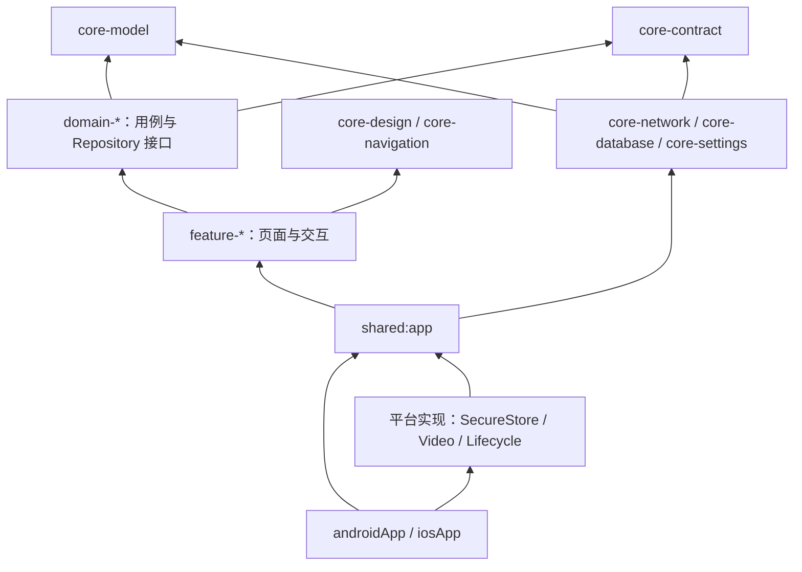
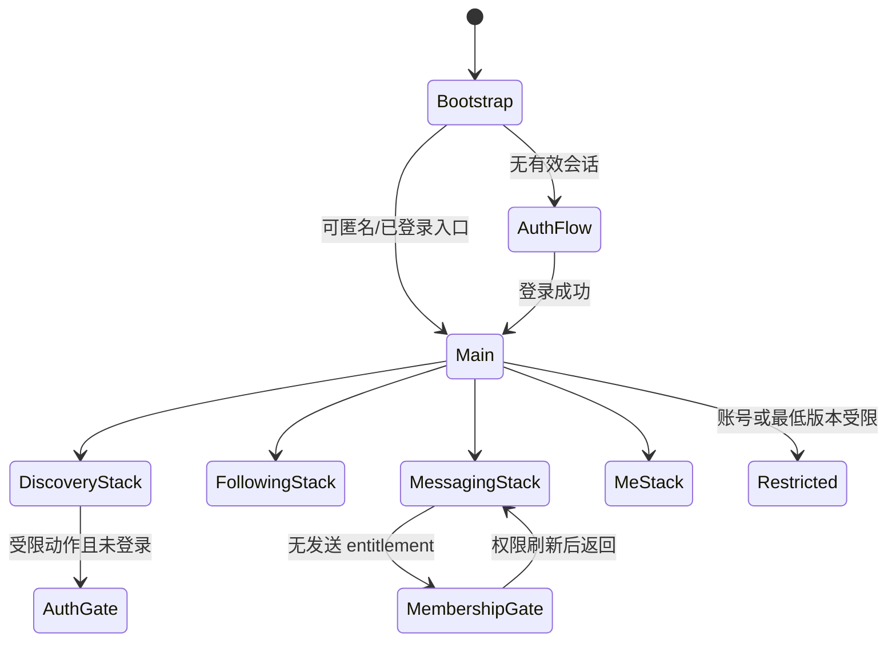

# KMP 客户端模块与状态导航设计

App 版本：1.0

日期：2026-08-02

状态：最小技术脚手架与 M0 公共发现切片已落地；其余业务、导航与持久化仍为冻结候选

## 1. 文档目的

本文把 [移动端页面与交互规格](./MOBILE_APP_INTERACTION_SPEC.md) 转换为 KMP 可实现的模块、依赖、页面状态、导航、本地数据、网络和平台端口。独立仓库 `meigallery-client` 已创建最小工程并实现 M0 公共发现读链路；未经 Spike 验证的其余功能库和业务模块仍不得视为依赖锁。

App 1.0 仅发布 Android/iOS。普通用户桌面端未立项；若未来立项，可以复用不依赖平台 UI 的领域和契约模块，但不得把当前设计解释为已承诺桌面兼容。

## 2. 设计原则

- UI 采用单向数据流：`UiEvent → ViewModel → UseCase/Repository → UiState/UiEffect`。
- Screen ID 是设计与分析标识，Route 是类型安全的运行时导航对象，两者不可混为 URL 字符串。
- Feature 只能依赖核心模块和显式领域接口，不跨 Feature 读取数据库表或调用网络 Service。
- 服务端是账号、权限、消息、会员和余额的权威；本地缓存只能改善体验。
- 登录态与会员态分离；Token 有效不代表具有私信或受保护媒体权限。
- 未知字段、枚举和 capability 安全降级，不自动显示、启用或扩大权限。
- App 1.0 不引入支付、系统推送、图片消息、礼物和装扮 SDK/模块实现。

## 3. 推荐工程与模块边界

当前物理脚手架保持少量模块：

```text
meigallery-client/
└── apps/
    ├── androidApp
    ├── iosApp
    └── shared/
        ├── core
        ├── domain
        ├── feature
        └── app
```

以下是随业务成熟逐步拆分的目标逻辑边界，不代表当前已经创建全部 Gradle project：

```text
apps/
├── androidApp                  # Android Application、系统入口与平台装配
├── iosApp                      # iOS Application、系统入口与平台装配
└── shared/
    ├── app                     # 根组件、依赖装配、全局状态与 App 生命周期
    ├── core-model              # 稳定领域值对象，不含网络/数据库注解泄漏
    ├── core-contract           # API DTO、事件 schema、错误码、映射器
    ├── core-network            # Ktor、鉴权、重试、请求 ID、WebSocket
    ├── core-database           # Room、表实体、DAO、本地 migration
    ├── core-settings           # DataStore Preferences 与配置
    ├── core-security           # SecureStore/清理端口、脱敏工具
    ├── core-observability      # 埋点、性能、崩溃上下文的脱敏封装
    ├── core-design             # Token、基础组件、图标、主题、无障碍
    ├── core-navigation         # 类型安全 Route、Tab 栈、导航守卫
    ├── core-testing            # Fake、Fixture、Coroutine/Clock 测试工具
    ├── domain-account
    ├── domain-person
    ├── domain-interaction
    ├── domain-entitlement
    ├── domain-messaging
    ├── domain-notification
    ├── domain-wallet
    ├── feature-auth
    ├── feature-discovery
    ├── feature-person
    ├── feature-interaction
    ├── feature-messaging
    ├── feature-membership
    ├── feature-notification
    ├── feature-wallet
    ├── feature-settings
    └── platform-media          # 公共视频/媒体端口；实现位于平台 source set
```

当前脚手架已按 `core`、`domain`、`feature`、`app` 四组建立物理模块；当独立编译、所有权或复用收益明确时再拆分，避免过早增加构建成本。

### 3.1 依赖方向



禁止依赖：`domain-* → feature-*`、`core-model → 网络/数据库/UI`、`feature-A → feature-B 的内部实现`、`commonMain → Media3/AVFoundation/Android Context/UIKit 类型`。

## 4. Feature 与页面映射

| Feature 模块 | 主要 Screen ID | 主要领域依赖 | 1.0 |
|--------------|----------------|--------------|-----|
| `feature-auth` | APP-001～APP-006 | account | 必须 |
| `feature-discovery` | APP-101～APP-108 | person、interaction | 必须 |
| `feature-person` | APP-109～APP-114 | person、entitlement、interaction | 必须 |
| `feature-interaction` | APP-201～APP-208 | interaction、person | 必须 |
| `feature-messaging` | APP-301～APP-309 | messaging、entitlement、person | 必须 |
| `feature-membership` | APP-401～APP-405 | entitlement | 必须；仅手动获取说明 |
| `feature-wallet` | APP-501～APP-504 | wallet | 必须；仅余额/明细 |
| `feature-notification` | APP-601～APP-604 | notification | 必须；无系统推送 |
| `feature-settings` | APP-701～APP-714 | account | 必须 |
| future commerce | 礼物、充值、装扮页面 | wallet、catalog | 不创建 1.0 可达路由 |

完整 Screen ID 和页面状态以 [移动端页面与交互规格](./MOBILE_APP_INTERACTION_SPEC.md) 为事实源。

## 5. 页面状态模型

### 5.1 通用状态骨架

```text
ScreenUiState
├── content：页面稳定内容
├── loadState：initialLoading | content | empty | refreshing | offline | failed
├── permissions：登录、entitlement、对象可用性和 capability 的展示快照
├── transient：局部提交、分页、输入、选择、弹层状态
└── freshness：服务端版本、最后同步时间、是否过期

UiEffect
├── Navigate(route)
├── ShowMessage(copyKey)
├── OpenSystemSettings
├── RequestReauthentication
└── AnnounceAccessibility(copyKey)
```

`UiEffect` 只表达一次性动作，不保存长期业务事实。需要旋转、进程恢复或重新组合后仍成立的内容必须进入 `UiState` 或 SavedState。

### 5.2 权限状态不得简化为 Boolean

受限动作使用可解释结果：

```text
AccessDecision
├── allowed
├── login_required
├── entitlement_required(requiredKey, minimumRank?)
├── quota_exhausted(resetsAt?)
├── account_restricted(reasonCode)
├── object_unavailable(reasonCode)
├── moderation_restricted(reasonCode)
├── app_upgrade_required(minimumVersion)
└── unknown_denied
```

客户端可以据此显示正确文案和入口，但发起操作后仍以服务端再次校验为准。禁止在客户端通过比较会员中文名决定权限。

### 5.3 列表状态

- 首屏加载与下一页加载分开建模，下一页失败不清空已显示内容。
- 游标与 `ruleVersion/filterVersion` 绑定；服务端返回游标失效时重新建列表，不拼接不同规则结果。
- 下拉刷新保留已有内容，直到新结果成功替换；失败显示非阻断错误。
- 公开资料返回 `PROFILE_NOT_AVAILABLE` 时从本地投影移除，不能继续从缓存进入详情。
- 大字体、小屏或无障碍模式可从双列降为单列，不改变排序和埋点标识。

### 5.4 提交状态

喜欢、关注和收藏可进行乐观更新，但必须保存前值；服务端拒绝时回滚并使用稳定错误文案。创建会话、发送消息、会员发放结果、余额和账本不做未确认的乐观业务成功展示。

## 6. 导航与返回栈

### 6.1 根导航

App 1.0 使用四个根 Tab：发现、关注、消息、我的。每个 Tab 保有独立返回栈；重复点击当前 Tab 回到该 Tab 根页面，再次点击可按产品约定触发刷新或回到顶部。



### 6.2 Route 类型

Route 只携带稳定、最小参数，例如 `profileId`、`conversationId`、`notificationId`。真人名称、会员状态、签名媒体 URL 和完整对象不得作为路由参数，进入页面后从 Repository 获取权威内容。

### 6.3 导航守卫

| 守卫 | 触发点 | 行为 |
|------|--------|------|
| Auth Gate | 喜欢、关注、收藏、消息、钱包、设置 | 保存安全的 pending route，登录后重放一次 |
| Entitlement Gate | 创建会话、发送消息、受保护媒体 | 打开会员说明；刷新权限后重新请求，不本地放行 |
| Availability Gate | 真人下架、会话关闭、通知目标失效 | 显示终态并移除危险操作 |
| Upgrade Gate | 服务端返回 `APP_UPGRADE_REQUIRED` | 显示最低版本说明，不解析未知原生能力 |
| Reauthentication Gate | 设备管理、数据导出、注销等敏感操作 | 调用平台认证端口；失败留在当前页 |

pending route 不得包含敏感正文、Token、签名 URL 或一次性凭证。登录取消后清理；目标失效时进入安全落地页。

### 6.4 Deep Link

- 支持的 1.0 目标仅包括公开真人详情、会话、通知详情、会员说明、钱包明细和账号安全入口。
- 所有 Deep Link 先经过域名/协议白名单和参数校验，再执行登录/权限/对象守卫。
- 通知包含的目标只是引用，不代表仍可访问；打开时必须重新请求。
- 未知或未来 Route 进入“当前版本暂不支持”页，不崩溃、不自动跳网页执行高风险操作。

## 7. 数据层与同步

### 7.1 Repository 责任

| Repository | 权威来源 | 可缓存内容 | 禁止缓存/注意事项 |
|------------|----------|------------|-------------------|
| Account | API | 非敏感账号摘要、偏好 | Token 只进 SecureStore |
| Discovery | API 公开投影 | 列表、目录、规则版本 | 过期投影不得绕过下架 |
| Person | API 公开/受保护投影 | 公开详情、媒体描述 | 签名 URL 与媒体 ID 分离 |
| Interaction | API | 本人关系、待同步 UI 操作 | 不推导 Match |
| Entitlement | API | 展示快照、版本、有效期 | API 调用时服务端重验 |
| Messaging | API + DO/WebSocket | 会话摘要、必要消息投影、outbox | 正文保留与加密由 OQ-020 冻结 |
| Notification | API | 本人通知投影 | 实时只触发刷新 |
| Wallet | API | 余额/分录只读快照 | 不本地计算可用余额作为授权 |

### 7.2 Room 逻辑表族

- `cached_profile`、`cached_profile_media`、`cached_taxonomy_term`。
- `interaction_state`、`favorite_folder_projection`。
- `conversation_summary`、`message_projection`、`message_outbox`、`conversation_sync_cursor`。
- `notification_projection`、`membership_snapshot`、`wallet_snapshot`。
- `sync_metadata`：资源、账号、schema、最后成功时间和失效标记。

本地 schema 名称为设计占位，创建客户端工程时再生成正式 Room schema。账号切换必须按 `accountId` 隔离或清除用户数据，不能在多账号之间复用私有投影。

### 7.3 DataStore 与 SecureStore

DataStore 只保存主题、语言、内容展示偏好、非敏感筛选、引导完成状态和最后选中的 Tab。Access/Refresh Token、设备私钥和可复用凭证进入 Android Keystore/iOS Keychain 封装的 `SecureStore`。

退出、远程撤权、账号注销、会员失效和资料撤权分别触发不同清理范围；受保护媒体缓存需要独立命名空间，确保撤权时可清理而不影响公开图片。

### 7.4 同步策略

```text
UI 订阅本地/内存 StateFlow
→ Repository 判断新鲜度并发起网络请求
→ DTO 通过显式 Mapper 转领域模型
→ 单事务更新本地投影和 sync metadata
→ UI 自动收到新状态
```

- 公共发现允许 stale-while-refresh，并显示最后同步语义。
- 账号状态、entitlement、余额、会话发送资格在关键操作前网络重验。
- 自动重试仅限 GET、PUT/DELETE 幂等互动和携带幂等键的已定义命令。
- App 后台时不承诺持续实时连接；App 1.0 无系统推送，回到前台后主动补拉。

## 8. 网络、鉴权与错误映射

### 8.1 Ktor 管线

```text
Request Builder
→ Client Metadata（平台、版本、契约、语言）
→ Request ID / Idempotency Key
→ Auth Header
→ 脱敏日志
→ Ktor Engine（Android OkHttp / iOS Darwin）
→ Response Envelope
→ Error Registry
→ DTO Mapper
```

- Refresh Token 只允许单航班刷新，其他失败请求等待同一结果。
- 刷新失败原子清理会话并广播 `SessionExpired`，避免多个页面重复弹登录。
- 401 只触发一次刷新；403 不刷新 Token；429 尊重服务端安全的重试时间。
- 消息、数据导出和其他关键 POST 使用稳定客户端命令 ID/幂等键。
- 网络日志不输出 Authorization、Cookie、正文、签名 URL、证据或完整错误详情。

### 8.2 错误归一化

网络、协议、业务、平台和本地存储错误映射为稳定 `AppError`。页面不得直接显示异常字符串；使用 [统一 UI 状态、文案与埋点目录](./UI_STATE_COPY_AND_ANALYTICS_CATALOG.md) 的 copy key。未知错误默认可恢复失败，不把内部信息交给用户。

## 9. 实时消息客户端

### 9.1 ConnectionManager

App 级 `RealtimeConnectionManager` 只有一个连接协调入口，按前后台状态、登录账号和可见会话管理连接，不允许每个页面自行创建 WebSocket。

状态：`disconnected → ticketing → connecting → syncing → connected → backoff`。账号退出、远程撤权或票据过期立即关闭；重连使用有上限的抖动退避，具体数值在 OQ-028 后冻结。

### 9.2 事件恢复

- 每个会话保存 `lastAppliedSequence`，只应用下一连续 sequence。
- 重复 sequence 幂等忽略；出现缺口时暂停该会话实时应用，通过 HTTP 补拉。
- `conversation.snapshot` 的服务端版本低于本地已应用版本时拒绝覆盖。
- 实时通知事件只触发通知列表刷新，不直接构造权威通知。
- 发送 outbox 使用 `clientMessageId`，网络超时后查询/重试同一 ID，禁止生成第二条消息。

### 9.3 消息 UI 真相

客户端只展示服务端返回的 `senderType` 和状态。`platform_operator` 显示“平台运营”，`person` 只有在服务端已认领且授权时显示真人身份。App 不合成真人在线、输入中或已读；平台已读仅表示平台接收主体查看。

## 10. 平台端口

| 端口 | commonMain 契约 | Android | iOS |
|------|-----------------|---------|-----|
| SecureStore | 保存/读取/删除敏感凭证 | Keystore | Keychain |
| AppLifecycle | 前后台、内存压力、退出 | Lifecycle | UIApplication/Scene |
| VideoPlayer | 播放状态和控制 | Media3 ExoPlayer | AVPlayer/AVKit |
| MediaSurface | Compose 可嵌入表面 | Android View/Compose | UIKitView |
| Reauthentication | 设备凭证/生物识别能力 | BiometricPrompt 等 | LocalAuthentication 等 |
| ExternalNavigator | 浏览器、系统设置、邮件/电话 | Intent | UIApplication |
| Clock/Locale | 时间、时区、语言 | 平台实现 | 平台实现 |
| CacheCleaner | 按账号/保护级别清理 | 平台缓存目录 | 平台缓存目录 |

支付、系统推送和图片选择/上传端口不在 App 1.0 依赖图中，未来 Feature 立项时再加入。

## 11. 设计系统和可访问性

- `core-design` 只包含语义 Token 和可复用组件，不包含领域网络调用。
- 会员等级的名称、颜色和装饰由目录配置映射到客户端支持的语义样式；未知样式回退为中性样式。
- 所有图标按钮提供可访问名称，动态字体不裁切关键权益、金额和接收主体披露。
- 图片提供审核后的替代文本或通用语义；装饰图不重复朗读。
- 动画尊重减少动态效果；列表和消息在屏幕阅读器下保持逻辑顺序。
- 金币增减、撤回、关闭会话和数据权利操作不能只用颜色表达结果。

## 12. 测试边界

| 层 | 必须覆盖 |
|----|----------|
| core/domain 单元 | 权限决策映射、状态机、游标、未知枚举、时间/到期、Mapper |
| Repository | 网络/Room 合并、账号隔离、失效、离线、幂等重试 |
| ViewModel | 全部 `stateKey`、一次性 Effect、乐观回滚、进程恢复 |
| 导航 | 四 Tab 独立栈、登录/会员/升级守卫、Deep Link、返回手势 |
| 实时 | 重复、乱序、缺口、断线、票据过期、HTTP 兜底、账号切换 |
| 媒体 | 签名过期、403、缓存清理、Android/iOS 资源释放 |
| UI | 小屏、大字体、深色、高对比、屏幕阅读器、减少动画 |
| 安全 | 日志脱敏、Token 存储、缓存越权、root/jailbreak 风险策略评审 |

## 13. 实现前冻结清单

### 13.1 必须先关闭

- OQ-026：Kotlin/CMP/Gradle/AGP/KSP/JDK/Xcode 可构建矩阵。
- OQ-027：iOS 最低版本；Android 是否在 API 26 基础上继续提高。
- OQ-030：首发商店、登录方式和身份适配器。
- OQ-001/OQ-002/OQ-003：产品标识、首发地区和年龄门槛。

### 13.2 私信模块额外门禁

- OQ-014：各级额度和重置规则。
- OQ-020/OQ-021：消息保留、文本审核和人工队列。
- OQ-028/OQ-033：实时恢复基线、撤回窗口和会话重开规则。

### 13.3 技术 Spike 通过条件

1. Android/iOS 同一套 ViewModel、Navigation 3、Room、Paging、Ktor、Coil 可以构建运行。
2. 登录刷新、四 Tab 返回栈、Deep Link 守卫和进程恢复通过。
3. 公开图、受保护图与 HLS 在两平台完成凭证过期/撤权验证。
4. WebSocket 完成乱序/重复/缺口/休眠恢复与 HTTP 兜底。
5. Release 构建扫描不到 Token、固定签名 URL、私信正文和测试凭证。

## 14. 客户端验收标准

- **KMP-MOD-AC-001**：`commonMain` 中不存在 Android/iOS 框架类型泄漏。
- **KMP-MOD-AC-002**：所有受限动作由统一 AccessDecision 展示，并由服务端再次授权。
- **KMP-MOD-AC-003**：四个根 Tab 独立恢复返回栈，登录/会员守卫不会形成循环跳转。
- **KMP-MOD-AC-004**：App 收到未知枚举、capability 或未来 Route 时安全降级且不扩大权限。
- **KMP-MOD-AC-005**：账号退出、远程撤权、会员失效和资料撤权能按范围清理敏感状态与缓存。
- **KMP-MOD-AC-006**：重复/乱序消息不会重复展示，sequence 缺口通过权威补拉恢复。
- **KMP-MOD-AC-007**：管理员代运营消息始终显示平台运营身份，不推断真人在线或已读。
- **KMP-MOD-AC-008**：App 1.0 构建不包含支付、系统推送、图片消息、礼物或装扮的可达实现。

## 15. 相关文档

- [Epic 架构方案](../ways-of-work/plan/real-person-discovery-platform/arch.md)
- [KMP 客户端技术栈与库选型](./KMP_CLIENT_TECH_STACK.md)
- [移动端页面与交互规格](./MOBILE_APP_INTERACTION_SPEC.md)
- [API 与实时通信契约](./API_AND_REALTIME_CONTRACT.md)
- [API、DTO 与数据契约冻结计划](./API_DATA_CONTRACT_FREEZE_PLAN.md)
