# MeiGallery 真人发现与互动 App 1.0 产品需求确认书

文档用途：客户需求确认、产品设计、开发估算、测试验收

产品工作名：心动遇见你（正式名称待确认）

App 版本：1.0

文档状态：待客户确认

日期：2026-07-30

## 1. 确认说明

本文是 App 1.0 的单一客户确认稿，覆盖独立 Android/iOS App、配套 Nuxt 管理后台、现有 MeiGallery 数据复用、主要页面交互、异常状态、业务规则、原型图和验收标准。

客户确认本文后，产品、UI、技术和测试均以本文为需求基线。尚未确认的参数集中在第 17 章，不应由设计或开发人员自行决定。后续需要改变已确认范围时，应先完成影响评估，再更新同一 App 版本下的需求基线；讨论期不频繁增加文档版本号。

配套的 [App 1.0 高保真关键旅程原型](./interactive-prototype/index.html) 可直接操作登录、发现、详情、会员申请、平台话题、通知钱包、内容审核和运营调币八个场景。[App 1.0 逐页交互设计库](./interactive-prototype/pages.html) 进一步覆盖移动端 49 页和管理后台 43 页，共 92 个可独立访问的页面级需求原型。Figma 最终文件已覆盖 92 页、349 个需求状态、92 个流程预览和 2,284 个有效交互动作；客户文档另保留 169 个 Page ID/状态/图片确定性映射，方便离线逐页确认。详细页面基线见 [逐页产品与交互设计](./APP_PAGE_LEVEL_PRODUCT_DESIGN.md) 和 [详细功能与逐页原型说明](./APP_DETAILED_FUNCTION_PROTOTYPE_SPEC.md)；产品总需求、发布范围、Feature PRD 与 Page ID 的对应关系见 [App 1.0 需求追踪矩阵](./APP_REQUIREMENTS_TRACEABILITY.md)；本阶段关键决策见 [App 1.0 产品决策基线](./APP_1_0_PRODUCT_DECISION_BASELINE.md)。

### 1.1 本次要求客户重点确认

1. 普通用户注册后只是观看者，不会进入真人列表。
2. 只有管理员认证并发布的真人资料才能公开展示。
3. 当前多数真人尚未由本人运营，用户发起的是“与真人相关的平台话题”，由平台运营人员接收和回复。
4. 平台运营身份必须持续披露，不得表现为真人本人在线、输入、已读或回复。
5. 只有有效心享会员可以创建和发送平台话题，不需要双方同意或匹配。
6. 五级会员全部在 1.0 展示，用户通过站内申请获取，管理员审核并手动发放；1.0 不提供在线购买。
7. 金币在 1.0 只展示余额和管理员调整明细，不提供充值、礼物、转账或提现。
8. App 1.0 不包含支付、系统推送、图片消息、礼物、装扮和真人本人认领。

## 2. 产品背景与目标

### 2.1 背景

现有 MeiGallery 以管理员发布的图库和媒体为核心。新 App 不是简单复制图库页面，而是以“真人”为发现对象，将现有内容整理为有来源、有用途授权、有认证结论、有发布状态和有运营归属的真人资料。

平台首期的供给侧仍由管理员管理。普通注册用户只浏览、互动和使用会员平台话题；未来真人本人可在完成认领、身份核验和授权复核后接收新会话，但该能力不属于 App 1.0。

### 2.2 产品定位

面向成年观看者的经授权真人内容发现与平台话题服务：用户可以按地区、热度、职业、风格和偏好发现经平台审核发布的真人资料，进行喜欢、关注、收藏，并在持有有效会员时围绕目标真人发起由平台运营接收的话题。

### 2.3 业务目标

- 建立“真人资料供给 → 审核发布 → 用户发现 → 单向互动 → 会员申请 → 平台话题 → 平台运营”的完整闭环。
- 复用 MeiGallery 已有账号、图库、媒体和会员数据，同时为未来 Web 迁移建立统一业务模型。
- 建立五级会员、entitlement、金币账本和后台审批基础，为未来商业化保留扩展空间。
- 让认证范围、消息接收主体、会员权益和金币变化都可以解释、查询和审计。

### 2.4 成功标准

- 未认证、未发布或用途授权不完整的真人资料公开曝光为零。
- 普通用户被错误创建为真人资料为零。
- 未披露平台代运营、管理员冒充真人和虚假本人已读为零。
- 重复创建会话、重复发放会员和重复调币为零。
- 用户可以独立完成发现、关注/收藏、会员门槛理解、提交并查询会员申请、阅读/发送平台话题、举报和账号管理。
- 限量 Beta 连续四周达到：邀请用户首个详情访问率不低于 60%，详情访问后的关注/收藏率不低于 30%，平台运营主体理解正确率不低于 90%。
- 合规新话题和会员申请的接收主体、当前状态与用户可见时间线可追踪率为 100%；OQ-010 关闭前不设置对用户承诺的固定处理时效。

## 3. 产品边界

### 3.1 App 1.0 必须交付

- Android/iOS App；Android 最低版本暂按 API 26，iOS 最低版本待确认。
- 观看者注册、登录、退出、设备与账号安全。
- 推荐、地区、热门、最新、分类、搜索和筛选。
- 真人详情、认证说明、图库媒体和平台运营说明。
- 喜欢、关注、收藏、收藏夹、浏览历史。
- 五级心享会员目录、站内会员申请与进度、当前权益、管理员手动发放和自动到期。
- 会员创建/发送文本话题、会话列表、站内实时刷新和平台代运营工作台。
- 站内通知中心，不依赖 APNs、FCM 等系统推送。
- 金币余额、明细、管理员加币/扣币/补偿/冲正和必要复核。
- 举报、拉黑、申诉、隐私设置、数据导出和注销申请。
- 真人导入、认证、发布、推荐运营、代运营、会员、金币、审核和审计后台。

App 1.0 采用分层交付：

- P0 限量测试必需：发现、会员申请、平台话题、供给审核、安全、会员发放、调币和审计主闭环。
- P1 客户最终验收必需：完整账号管理、收藏历史、通知、数据权利和运营支撑。
- P2 后台运营增强：高级看板、推荐 Dry-run、批量工具、完整性中心和受控导出；不阻塞移动端 1.0，可由 Nuxt 后台独立上线。

### 3.2 App 1.0 明确不做

- 普通用户公开资料、用户上传真人、双向喜欢、配对和用户间聊天。
- 在线支付、会员购买、自动续费、金币充值和订单退款。
- 礼物、头像框、主页皮肤、聊天皮肤和任何金币消费入口。
- 图片、语音、视频、文件、位置消息、音视频通话和直播。
- 系统推送、桌面用户端、精确定位、精确距离和持续定位。
- 真人本人认领、本人运营、历史会话交接。
- “在线”“正在输入”“本人已读”“保证回复”“保证见面”“无限畅聊”等误导能力或文案。

### 3.3 未来可扩展但不能提前显示

未来可以通过新 App 版本增加在线购买、充值、礼物、装扮、媒体消息、系统推送、真人认领和用户桌面端。服务端可提前保留稳定 capability/entitlement key，但 1.0 客户端不得出现不可执行入口、占位按钮或促销文案。五级会员目录在 1.0 一次性支持，未来权益按最低客户端版本启用。

## 4. 核心概念与角色

### 4.1 核心概念

| 概念 | 定义 | 不等同于 |
|------|------|----------|
| Account | 注册、登录、设备、会员、金币和隐私的账号主体 | 真人资料 |
| Person | 现实中的真人主体及其权利事实 | 登录账号、展示页面 |
| PersonProfile | 经过审核的真人公开展示版本 | 身份证件、内部资料 |
| Gallery | 图片或视频内容集合，可关联真人资料 | 真人本身 |
| Verification | 平台实际完成的核验范围和结论 | 本人已入驻、保证真实无风险 |
| Publication | 某个资料版本是否允许公开 | 认证结论 |
| OperatorAssignment | 当前由平台运营还是未来由本人运营 | 真人认证 |
| Membership/Entitlement | 账号的会员等级、有效期和具体权限 | 认证、回复保证 |
| WalletEntry | 一次不可修改的金币变化分录 | 可手工覆盖的余额字段 |

### 4.2 用户与后台角色

| 角色 | 主要任务 | 关键限制 |
|------|----------|----------|
| 访客 | 查看品牌、协议和有限公开预览 | 不能互动、查看私有数据或发起话题 |
| 普通观看者 | 发现、搜索、喜欢、关注、收藏、举报和设置 | 不能发起话题，不能进入真人列表 |
| 心享会员 | 普通观看者能力 + 平台话题和已配置会员权益 | 不保证回复，不改变认证结果 |
| 内容编辑 | 上传、导入、编辑真人草稿和媒体 | 不能自行认证并发布 |
| 认证审核 | 审核身份/存在性、授权、资料一致性和媒体权利 | 不能代运营或直接发布 |
| 发布审核 | 审核公开版本、披露、媒体和发布状态 | 不能修改认证证据 |
| 代运营 | 领取、回复、转派未认领真人会话 | 只能以平台运营身份发送 |
| 客服/安全审核 | 处理举报、拉黑、申诉和风险案件 | 只能按案件读取最小证据 |
| 商业运营 | 提交会员发放或撤销申请 | 不能直接改金币余额 |
| 财务操作/复核 | 创建、复核和执行调币或冲正 | 发起人不能批准自己的高风险申请 |
| 审计只读 | 查询审计、异常和受控导出 | 不能修改业务与审计历史 |
| 入驻真人（未来） | 认领后管理获准字段并接收新会话 | 不属于 App 1.0 |

## 5. 信息架构与导航

### 5.1 移动端一级导航

```text
推荐
├── 推荐 / 地区 / 热门 / 最新
├── 分类
├── 搜索与筛选
└── 真人详情与媒体

关注
├── 关注更新
├── 喜欢记录
├── 收藏夹
└── 浏览历史

消息
├── 平台话题
├── 消息通知
├── 互动通知
├── 会员与金币通知
└── 系统与安全通知

我的
├── 当前会员与权益
├── 会员申请与进度
├── 金币余额与明细
├── 账号与设备
├── 隐私、推荐与通知偏好
├── 拉黑、举报和申诉
└── 数据导出、注销和帮助
```

四个一级 Tab 分别保存自己的返回栈和滚动位置。切换 Tab 不应丢失当前浏览上下文；账号失效、资料下架或权限撤回后，旧页面必须刷新为安全状态。

### 5.2 管理后台一级导航

```text
工作台
真人与内容
认证与发布
标签、地区与分类
推荐与热度运营
平台话题运营
举报与安全审核
会员与金币
运营看板
审计日志
系统设置与权限
```

后台采用桌面“左侧导航 + 列表 + 详情/操作区”的结构。菜单和按钮根据权限隐藏，但服务端仍对每个请求重新校验角色、对象范围、强认证和审批状态。

### 5.3 页面覆盖与逐页确认

App 1.0 当前定义 92 个独立页面设计对象：

| 平台 | 页面数 | 设计范围 |
|------|--------|----------|
| Android/iOS 移动端 | 49 | 启动认证、发现真人、单向互动、平台话题、站内通知、五级会员、金币钱包、我的与系统状态 |
| Nuxt 管理后台 | 43 | 总览异常、真人供给、认证发布、目录推荐、代运营、安全申诉、会员金币、通知审计 |

页面优先级为 P0 54 页、P1 31 页、P2 7 页。Figma 最终设计覆盖全部 92 个 Page ID 和 349 个需求状态，其中移动端 186 个、管理后台 163 个；`30｜Prototype Flows` 同步提供 92 个流程预览。为了支持脱离 Figma 的逐页签署，本文件仍内嵌 92 张默认状态、54 张 P0 关键状态，以及通知/金币 23 张逐状态本地导出图，共 169 个确定性图片映射。

每个页面必须有稳定 Page ID、设计路由、页面目标、进入方式、主次操作、必备状态、成功出口、失败下一步、需求追踪键和页面级验收。客户可在 [逐页设计库](./interactive-prototype/pages.html) 搜索 Page ID 并单独评审；评审意见应引用 Page ID，涉及业务规则变化时还应引用对应 PRD/SCP 编号，避免只描述截图位置。92 页是完整需求覆盖，不代表 92 页同时进入首批开发；P0/P1/P2 的排期边界以第 3.1 节和产品决策基线为准。

### 5.4 Figma 最终设计交付与评审入口

Figma 最终文件：[Peachmote UI 借鉴审查板 - MeiGallery](https://www.figma.com/design/LaNSwwGsznwcpV8msj7BQC/Peachmote-UI-%E5%80%9F%E9%89%B4%E5%AE%A1%E6%9F%A5%E6%9D%BF---MeiGallery)

最终版本 ID：`2381987656588552168`

| 交付区域 | 覆盖 | 客户评审重点 |
|---|---:|---|
| `10｜Mobile Pages` | 49 页 / 186 状态 | 页面层级、文字排版、Icon、44dp 热区、状态与返回路径 |
| `20｜Admin Pages` | 43 页 / 163 状态 | 工作台密度、筛选表格、审批、审计、异常与并发状态 |
| `30｜Prototype Flows` | 92 个流程预览 / 494 个流程动作 | 从入口到成功、失败、受限和安全出口是否完整 |
| 页面内交互 | 1,790 个动作 | 主次操作、跨页目标、危险操作和幂等反馈 |
| `40｜Delivery Index` | 92 个 Page ID | 需求、页面、状态、原型和交付证据的定位 |
| `50｜QA & Handoff` | 视觉/交互/边界/交付门禁 | 是否达到实现、测试和客户签署所需完整度 |

最终 QA：92/92 页面、349/349 状态全部覆盖；2,284 个有效交互动作的缺失目标为 0；移动端关键点击热区小于 44dp 为 0；正式页未发现未绑定文字样式、原始填充/描边、缺失字体或文字溢出。客户审阅时可先查看下列最终视觉总览，再到附录 A/B/C 按 Page ID 逐页确认功能和状态。

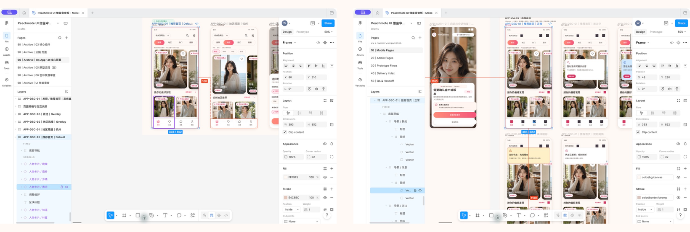

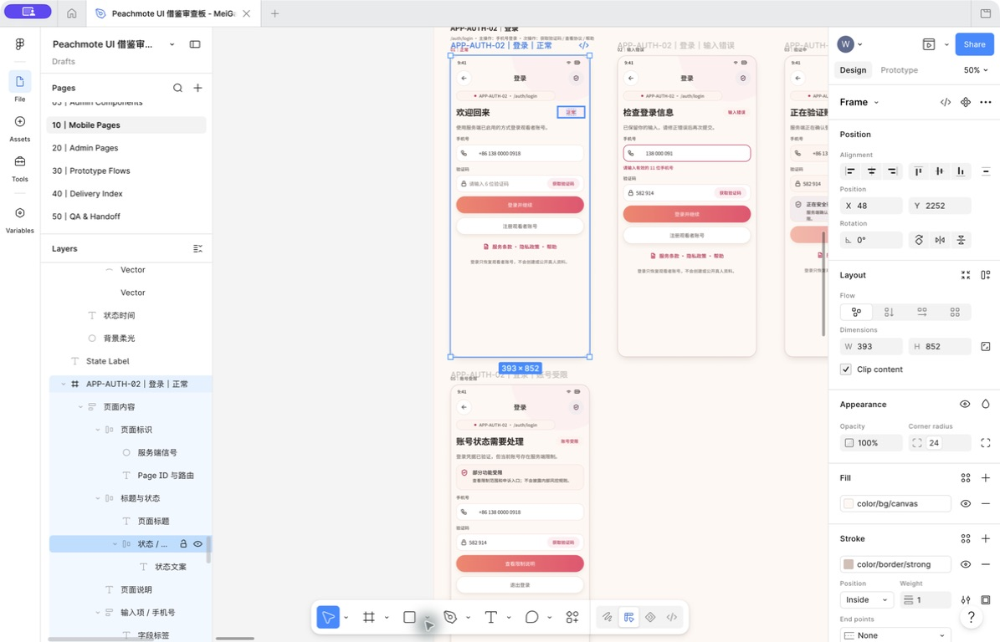

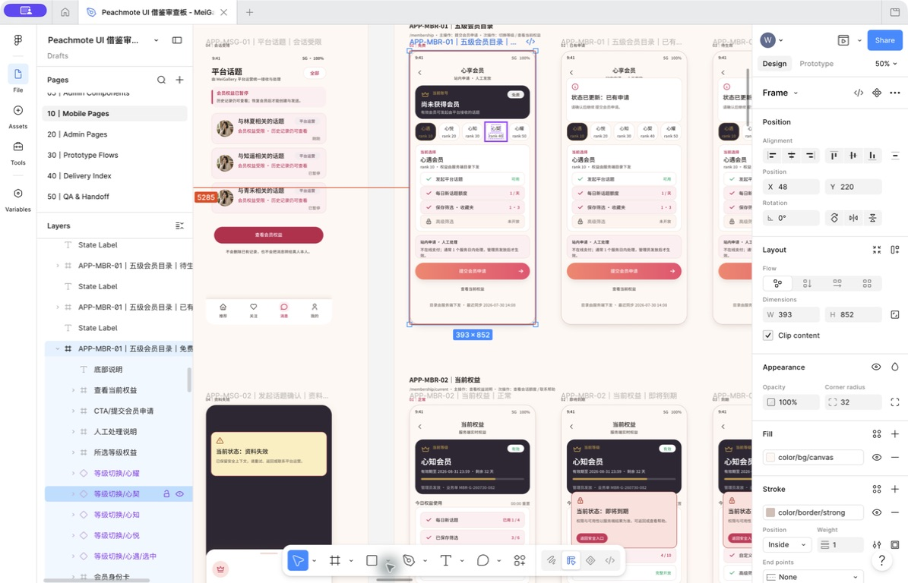

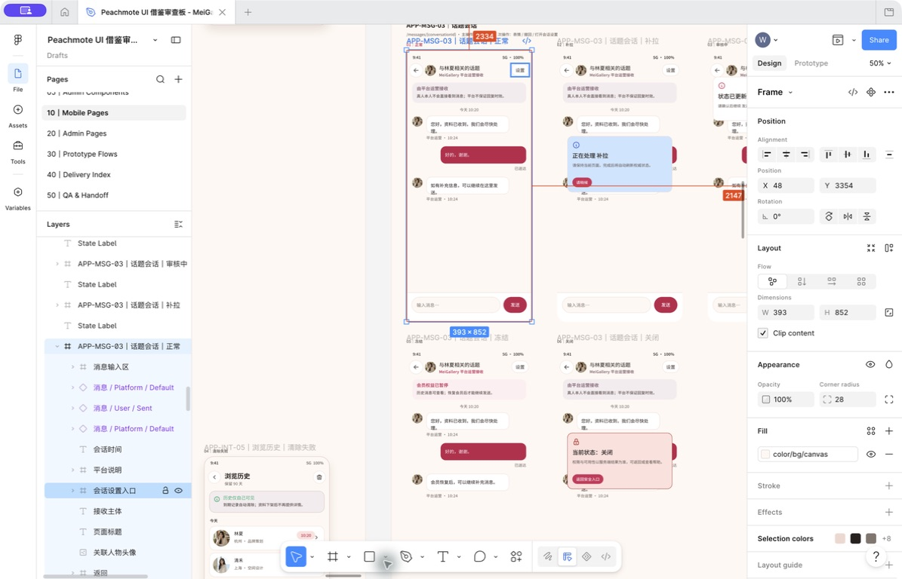

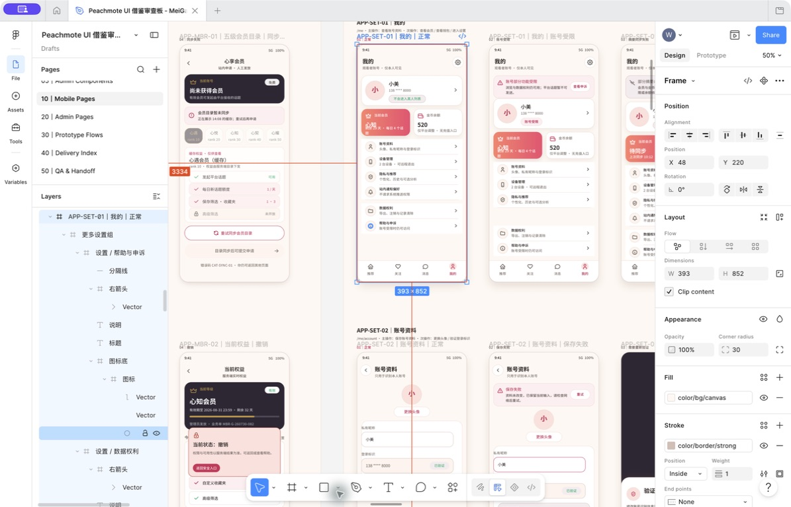

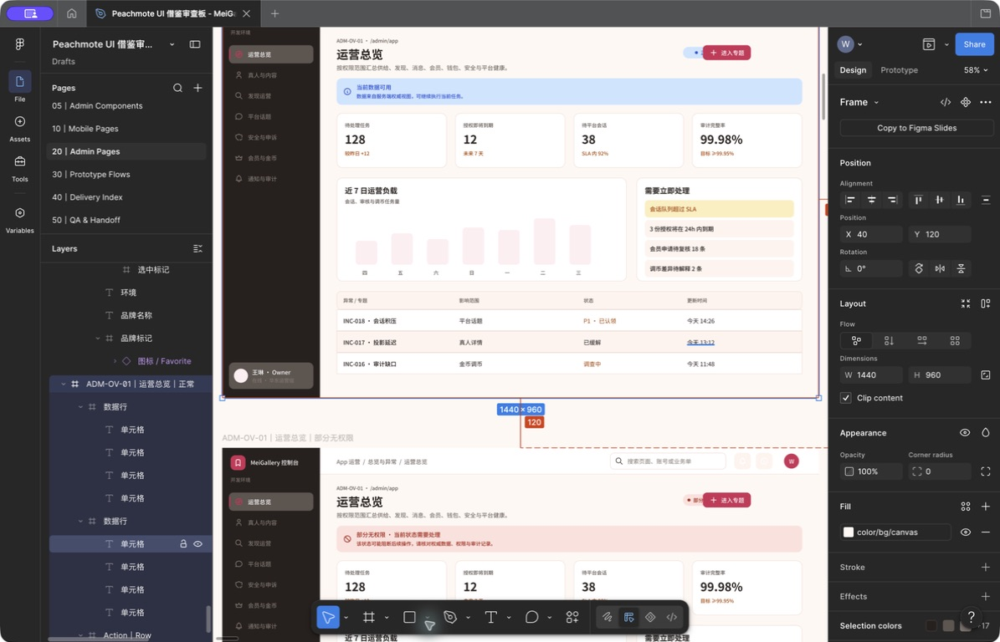

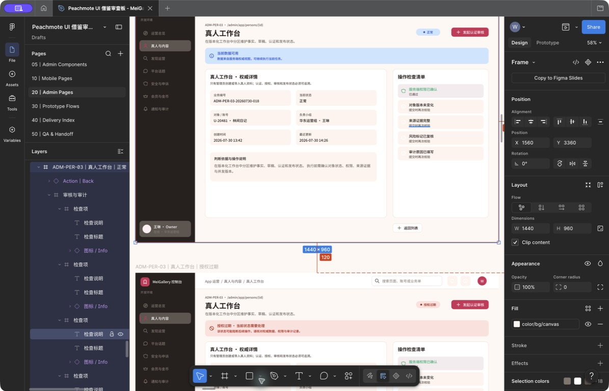

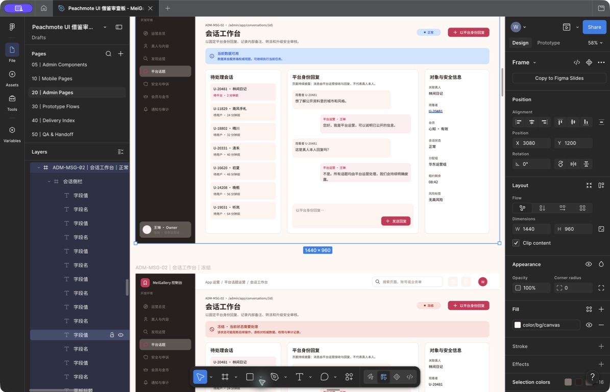

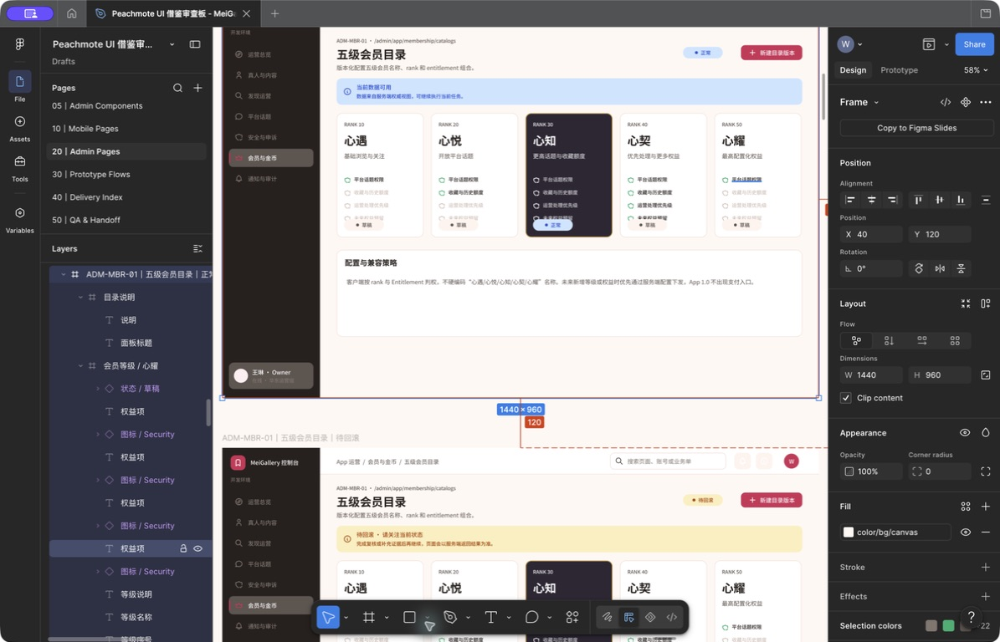

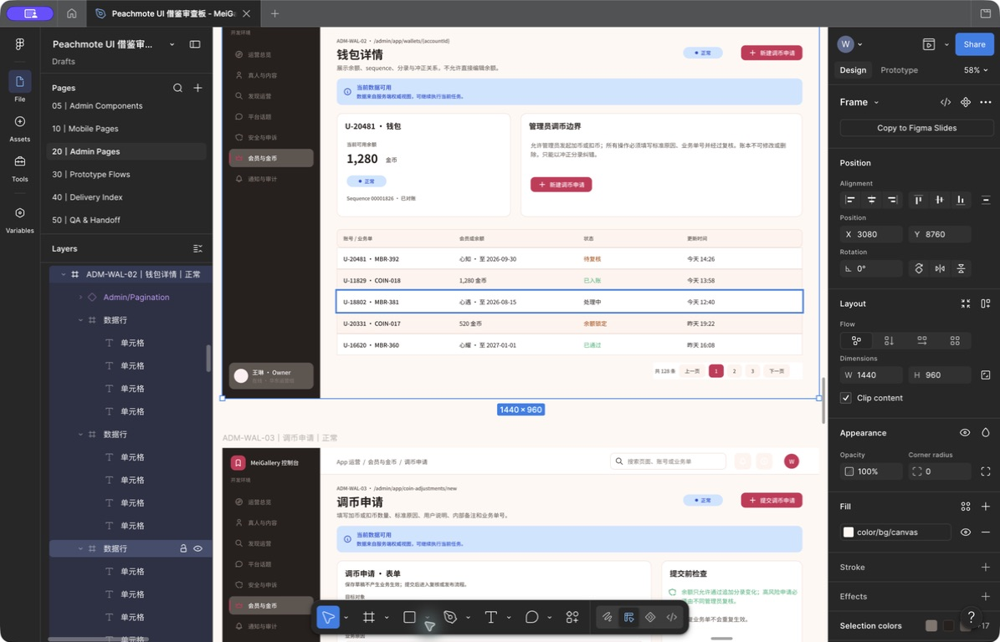

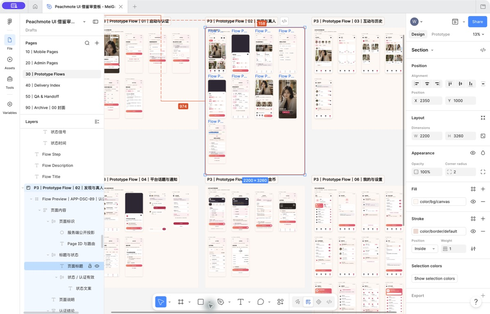

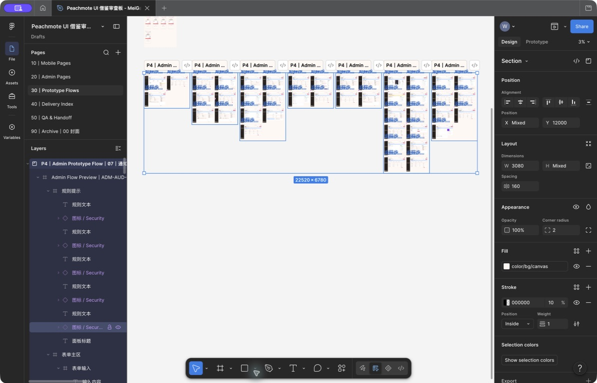

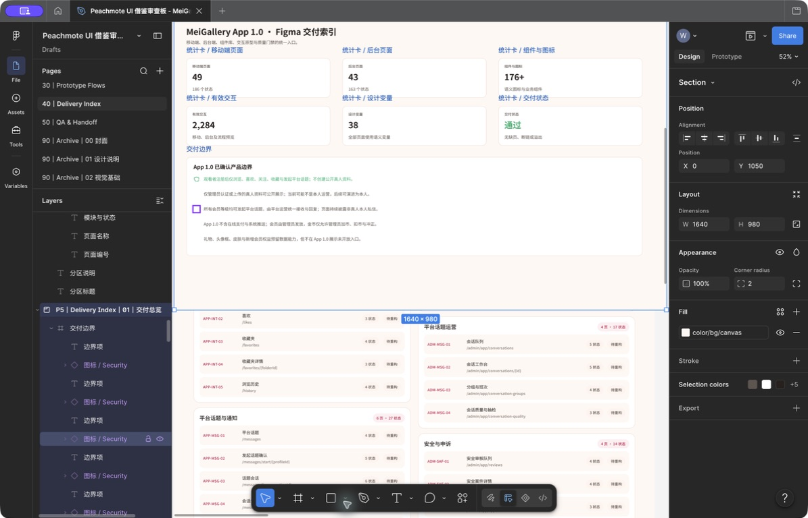

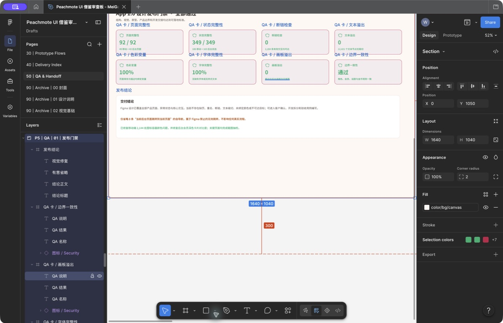

## 6. 端到端业务流程

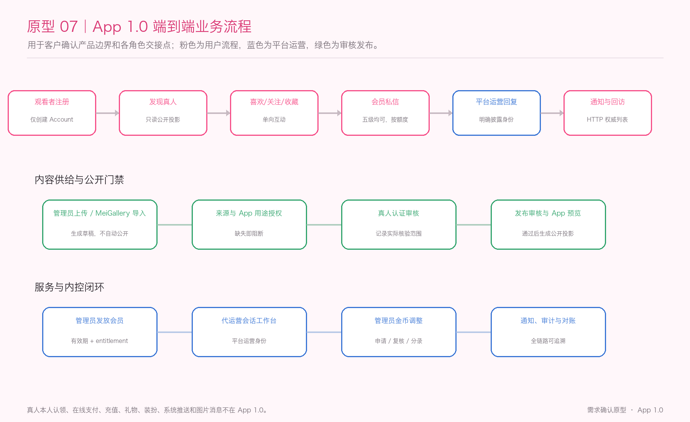

### 6.1 真人资料公开流程

1. 内容编辑通过管理员上传或 MeiGallery 候选导入创建真人与资料草稿。
2. 系统检查来源、稳定映射、App 用途授权、媒体完整性和疑似重复。
3. 认证审核分别记录主体存在性、授权/代理权、资料一致性和媒体权利的实际结论。
4. 发布审核查看锁定版本的 App 卡片、详情、认证说明和平台运营说明。
5. 只有认证有效、发布通过、用途授权有效且无安全隐藏的版本才能生成公开投影。
6. 授权撤回、认证过期、争议或安全事件触发暂停，停止新曝光、新话题和新媒体凭证。

### 6.2 观看者互动流程

1. 用户注册后获得 Account，不创建 Person/Profile。
2. 用户通过推荐、地区、热门、最新、分类或搜索进入真人详情。
3. 用户可以喜欢、关注和收藏；三种关系独立且都是单向行为。
4. 普通观看者点击“发起话题”时进入会员说明，不创建会话、不消耗额度。
5. 有效会员确认接收主体和额度后创建或复用会话。
6. 当前 `platform_managed` 资料的消息进入平台运营队列，由管理员以平台运营身份回复。
7. 会员到期后会话历史仍可读，输入区变为只读。

### 6.3 会员与金币管理流程

1. 用户可在 App 提交会员申请并查询进度；平台也可按运营规则直接发放。
2. 管理员选择会员等级、有效期、来源和用户可见说明，提交发放。
3. 高风险或批量操作按策略进入独立复核；执行成功后更新 entitlement 并通知用户。
4. 管理员创建加币、扣币、补偿或冲正申请，预览预计余额。
5. 达到金额、频率或批量阈值时由不同复核人批准。
6. 执行只追加 WalletEntry；原分录不可修改或删除。
7. 用户只看到已生效余额、分录原因、时间和必要的业务引用。

## 7. 五级心享会员方案

### 7.1 等级命名与定位

| rank | 名称 | 客户展示定位 | App 1.0 平台话题 |
|------|------|--------------|----------------|
| 10 | 心遇 | 开启相遇，适合轻度尝试 | 可创建、可发送 |
| 20 | 心悦 | 更从容地发现与交流 | 可创建、可发送 |
| 30 | 心知 | 更深入地管理偏好与交流 | 可创建、可发送 |
| 40 | 心契 | 面向高频发现与持续交流 | 可创建、可发送 |
| 50 | 心耀 | 当前最高等级的完整权益组合 | 可创建、可发送 |

等级名称只用于展示，服务端使用 rank 和 entitlement 授权。高等级默认继承低等级权限；不继承项必须显式配置。

### 7.2 App 1.0 建议权益基线（待客户确认）

| 权益 | 心遇 | 心悦 | 心知 | 心契 | 心耀 |
|------|------|------|------|------|------|
| 每日新话题额度 | 1 | 2 | 4 | 6 | 10 |
| 已有话题发送文本 | 允许 | 允许 | 允许 | 允许 | 允许 |
| 保存筛选条件上限 | 1 | 3 | 6 | 12 | 20 |
| 自定义收藏夹上限 | 3 | 5 | 10 | 20 | 30 |
| 高级筛选 | 不开放 | 基础组合 | 完整开放 | 完整开放 | 完整开放 |

说明：

- “新话题额度”只在首次成功创建会话时消耗；已有会话复用、重复点击或网络重试不重复消耗。
- App 1.0 不设置对用户展示的“无限消息”。已有会话发送受统一安全频控、内容审核、会话状态和会员有效期控制。
- 额度按首发服务时区每天 00:00 重置，默认使用 `Asia/Shanghai`；首发地区改变时由服务端配置调整。
- 上表是可落地的推荐默认值，客户可在确认页修改；实现后由服务端配置，不在客户端硬编码名称和数值。

### 7.3 会员页面规则

- 同时展示五级等级、当前等级、有效期、已用/剩余额度、申请状态、获取方式和限制。
- 免费用户的主按钮为“提交会员申请”，不是“立即购买”。
- App 1.0 不显示价格、折扣、续订、恢复购买、退款或倒计时促销。
- 所有等级必须展示“话题由平台运营接收”“不保证回复时间或关系结果”。
- 到期、撤销或账号受限后立即失去发送 entitlement，不能依赖客户端倒计时自行判断。

### 7.4 会员申请与发放闭环

1. 用户选择目标等级，查看完整权益、限制、平台接收说明和“不承诺固定时效”的服务边界。
2. 用户提交站内会员申请；表单包含期望等级、复用的已验证登录邮箱、联系时段偏好、最多 300 字可选申请说明和当前人工处理披露确认，不采集手机号、微信号或任意联系文本。
3. 同一账号同一时间最多存在一个进行中的申请；重复提交返回原申请。
4. 用户可查看已提交、处理中、待补充、已通过、已拒绝、已取消和已过期状态。
5. 管理员从会员申请队列领取，必要时请求补充；通过后创建会员发放申请。
6. grant 生效后 App 刷新 entitlement，并展示等级、有效期和额度。
7. 平台也可以在没有用户申请时直接发放，但仍需来源、业务单号、有效期、用户说明、内部原因和审计。

用户可见服务口径：“申请由平台人工处理；提交不代表已获得会员，只有管理员完成正式发放后权益才生效。当前不承诺固定处理时效或必然通过。”

### 7.5 未来权限挂载原则

未来高级媒体、礼物、装扮、优先客服或其他能力按稳定 entitlement key 挂载，并设置最低 App 版本。旧客户端收到未知权益时隐藏该能力，不能崩溃，也不能自行获得权限。

## 8. 移动端详细需求与交互

### 8.1 启动、注册与登录


页面：启动检查、欢迎页、登录/注册、验证码或密码验证、条款与隐私、首次偏好。

主流程：

1. App 启动后获取最低版本、服务地区、登录方式和功能能力配置。
2. 当前版本不支持时进入强制升级页；服务地区不可用时进入地区说明页。
3. 用户选择服务端启用的手机号、邮箱或第三方方式登录/注册。
4. 注册前展示完整条款、隐私政策和适用年龄说明；文档未加载时不能提交同意。
5. 注册成功只创建观看者账号，可跳过首次偏好直接进入非个性化推荐。
6. 登录成功后恢复账号范围内的会员、互动、会话和设置，不恢复已失效权限。

关键交互：

- 验证码发送按钮显示倒计时、失败原因和再次发送入口，避免重复请求。
- 登录失败区分输入错误、账号受限、验证码过期、网络失败和需要额外验证。
- 登录守卫完成后只重放一次原目标页面；目标已下架时进入安全不可用页。
- 远程退出或会话失效时清理私有缓存、消息草稿和受保护媒体凭证。

验收：注册用户不会出现在推荐列表；取消登录不会执行原受限操作；未知登录方式不会产生空白按钮。

### 8.2 推荐首页

页面结构：地区范围、搜索、筛选、通知入口；推荐/地区/热门/最新页签；推荐说明；真人卡片；四 Tab 导航。

真人卡片至少展示：审核封面、展示名、“资料已认证”说明、模糊地区、职业/核心标签和推荐理由。不得展示在线、精确距离、本人回复率、消费排名或快速匹配。

交互规则：

- 点击卡片主体进入详情；喜欢/关注/收藏快捷操作与卡片点击区分离。
- 下拉刷新创建新的推荐会话；向下分页沿用当前规则版本。
- 规则版本变化时保留当前内容并提示“推荐已更新”，由用户主动回到新列表顶部。
- 卡片操作可以先反馈，但服务端失败时必须回滚并显示明确原因。
- 普通字号使用双列卡；小屏、大字体或屏幕阅读器模式切换单列。
- 个性化关闭后新推荐会话不使用账号行为信号，并显示“非个性化推荐”。

状态：骨架加载、首次空、分页失败、离线缓存、规则更新、资料下架和账号受限。

### 8.3 地区、分类、搜索与筛选

地区只使用国家、地区组、省/市等模糊层级，不请求持续定位，不显示精确距离。

基础搜索覆盖审核后的展示名、地区、职业和标签。筛选至少包含地区、职业、风格、性格、发型、服饰、场景和内容类型中已启用的目录项。

交互规则：

- 用户打开筛选时保留当前结果；点击“应用”后才重新请求。
- 筛选页显示已选条件、预计结果数、清空和冲突提示。
- 高级条件无 entitlement 时只展示价值说明并进入会员说明，不返回受限结果。
- 无结果时提供放宽条件、清空筛选或查看热门，不使用未认证资料填充。
- 保存条件使用稳定目录 ID；目录项被合并或下线后标记失效并允许移除。
- 搜索历史与浏览历史分开设置且默认关闭；开启后才记录未来搜索，关闭不自动删除已有记录。
- 搜索历史支持逐条和全部清除；全部清除可同时关闭后续记录，自由文本不得进入 URL、普通分析日志或管理员审计。

### 8.4 真人详情与媒体


详情顺序：媒体头图 → 认证与展示名 → 模糊地区/职业/标签 → 简介 → 图库 → 话题接收主体说明 → 喜欢/关注/收藏 → 发起话题 → 举报/拉黑/分享。

关键交互：

- “资料已认证”可点击查看平台实际核验范围和更新时间。
- “平台接收”使用不同颜色、图标和说明，不得与认证徽章合并。
- `platform_managed` 资料的主按钮统一为“发起话题”，按钮附近持续展示“平台接收”；只有未来 `person_managed` 资料才允许显示“给本人发私信”。
- 媒体只展示审核后的派生资源；受保护媒体先请求短期凭证。
- 凭证过期且权限仍有效时可静默刷新一次；资料暂停、授权撤回或会员失效时停止刷新并清理保护缓存。
- 分享链接每次打开重新校验公开状态；下架后只显示通用不可用说明。
- 拉黑前说明将停止推荐、互动和新话题；解除拉黑不自动恢复互动或会话。

### 8.5 喜欢、关注、收藏和历史

- 喜欢：轻量偏好信号，可随时撤销，不通知对方。
- 关注：订阅真人资料更新，可从“关注”Tab 查看。
- 收藏：保存资料，支持默认收藏和自定义收藏夹。
- 历史：按时间分组，仅本人可见，可删除单条或全部清除。

三种互动必须使用不同图标、动词和成功反馈。任何页面都不能出现“匹配成功”“对方喜欢了你”“等待同意”等双方关系文案。

资料下架后，列表项显示安全不可用状态并停止新互动；清除历史后新的个性化推荐不再引用已清除记录。

### 8.6 平台话题门槛与创建会话

用户从真人详情点击“发起话题”后，服务端返回目标状态、消息接收主体、会员资格、额度和限制。

普通观看者：

- 打开会员说明与申请页。
- 不创建 Conversation。
- 不占用新会话额度。
- 不显示在线购买按钮；可以提交或查看站内会员申请。

有效会员：

1. 展示“当前由平台运营接收和回复，不是由真人本人直接接收”。
2. 展示当日剩余额度、重置时间和不保证回复说明。
3. 用户确认后创建或复用会话。
4. 已存在会话时直接复用，不再次占用额度。
5. 资料下架、已拉黑、额度用尽或账号受限时不创建会话，并提供正确下一步。

### 8.7 平台话题列表与会话


会话列表展示“与目标真人相关的话题”、平台运营标签、最近消息安全摘要、时间、未读数、静音和限制状态。列表不得写成“与真人本人聊天”。

会话页持续展示：

- 顶部“平台运营接收”标签。
- 首屏服务说明卡。
- 平台回复气泡的“平台运营”身份。
- 用户消息状态：发送中、审核中、已送达、平台运营已读、发送失败或已撤回。

发送交互：

1. App 1.0 仅提供文本输入、表情和发送按钮，不显示相册、加号、礼物、语音或通话。
2. 用户点击发送后创建稳定 clientMessageId；超时重试复用同一 ID。
3. 内容需要审核时显示“审核中”，不能提前显示已送达。
4. 实时连接断开时显示非阻断提示；App 1.0 不在离线时自动排队无感发送。
5. 恢复连接后按消息 sequence 补拉，不能重复、跳过或伪造已读。
6. 平台运营实际查看后才显示“平台运营已读”；不得显示“本人已读”。

默认交互：消息发送后 2 分钟内允许撤回，撤回后保留“消息已撤回”占位；关闭会话后变为只读，重新开启需要用户主动操作并重新校验会员、资料、拉黑和安全状态，同一会话不重复消耗新话题额度。

### 8.8 站内通知


分类：消息、互动、会员/金币、系统/安全、营销。

- 通知列表由 HTTP 查询结果作为权威；Message-3 当前只实现手动 HTTP 拉取，未来实时事件如单独启用也只能触发刷新。
- 通知支持单条已读和全部已读；多设备未读以服务端为准。
- 点击通知先更新已读，再请求目标当前状态；目标失效时进入通知安全详情页。
- 账号、安全、会员、金币和数据权利结果等必要通知不可被营销开关屏蔽。
- 通知摘要不得包含完整私信正文、内部备注、证件或访问凭证。
- App 1.0 不请求系统推送权限，App 回到前台时主动对账通知和未读。

### 8.9 金币钱包

钱包页展示余额、最后同步时间、规则说明和明细入口。明细可按全部、增加和扣减筛选，展示数量、原因、时间、用户可见业务引用和冲正关系。

交互规则：

- 客户端不本地预测、增加或扣减余额。
- 待复核、拒绝或失败的后台调整不进入用户账本。
- 冲正保留原分录，并显示关联的新反向分录。
- 余额或明细同步失败时展示最后同步时间，不把缓存余额作为消费授权。
- App 1.0 不显示充值、礼物、转账、提现或兑换入口。
- 钱包页固定说明“金币仅用于记录平台调整，当前不可购买、消费、转赠、兑换或提现，不具有现金价值”；零余额账号仍可查看规则和历史，不用促销方式强调余额。

### 8.9.1 通知与金币 Figma 逐状态导出确认

客户 DOCX 的附录 C 将以下 23 个状态逐页展示，每页都包含对应截图、触发条件、关键交互、预期结果、服务端权威边界、Figma Frame ID 和单独确认栏：

| Page ID | 页面 | 最终状态 |
|---|---|---|
| `APP-MSG-05` | 通知列表 | 正常、全部已读、首次空、分页失败、实时离线 |
| `APP-MSG-06` | 通知详情 | 正常、目标失效、无权限、需要升级 |
| `APP-WAL-01` | 金币钱包 | 正常、空钱包、离线缓存、同步失败 |
| `APP-WAL-02` | 金币明细 | 正常、增加筛选、扣减筛选、首次空、分页加载、对账维护 |
| `APP-WAL-03` | 金币分录详情 | 正常、业务单号已复制、分录不可用、冲正中 |

这 23 张逐状态导出图是 349 个 Figma 最终状态中的深度确认样本；全量最终稿已经覆盖移动端 49 页/186 状态、后台 43 页/163 状态和 2,284 个有效交互动作，缺失目标、移动端关键点击热区不足和文字溢出均为 0。原型用于确认视觉与交互；未读、权限、目标状态、余额、分录与冲正关系仍必须以服务端实时结果为准。

### 8.10 我的、设置和数据权利

“我的”展示账号摘要、会员卡、金币卡、账号与设备、通知设置、隐私与推荐、拉黑与举报、数据导出与注销、帮助与申诉。

关键交互：

- 用户昵称和头像只用于识别本人账号，不形成公开真人资料。
- 设备页标识当前设备，可远程退出其他设备；敏感操作要求重新验证。
- 用户可以关闭个性化推荐、清除搜索/浏览历史和管理可选分析。
- 营销通知可关闭，必要通知保留并解释原因。
- 数据导出按任务显示等待、处理中、完成、失败和下载过期，下载前重新验证。
- 注销页说明不可逆影响、阻塞项和依法隔离保留的数据；处理中不能显示“已删除”。

### 8.11 全局异常状态

| 状态 | 展示原则 | 主要操作 |
|------|----------|----------|
| 加载 | 使用骨架，不伪造真人、余额或消息 | 等待/取消可选 |
| 空 | 解释为什么为空，并给出安全下一步 | 返回推荐/调整条件 |
| 网络错误 | 保留可用旧内容并标记时间 | 重试 |
| 离线 | 仅显示允许的缓存摘要 | 重新连接 |
| 无权限 | 解释登录或 entitlement 门槛 | 登录/查看会员说明 |
| 对象下架 | 不泄漏内部原因或旧保护内容 | 返回推荐/帮助 |
| 账号受限 | 展示原因类别、范围和申诉 | 申诉/退出 |
| 会员到期 | 历史会话只读，停止新发送 | 查看会员说明 |
| 强制升级 | 当前版本无法安全支持能力 | 更新 App |
| 维护 | 不把缓存状态冒充最新事实 | 重试/帮助 |

## 9. 管理后台详细需求与交互

### 9.1 真人上传与 MeiGallery 导入


管理员可单条新建真人草稿或导入 MeiGallery 候选。导入必须保留 legacy 映射、输入哈希、来源、媒体清单和批次记录。

预检至少检查：

- 独立 App 展示、推荐和互动用途授权。
- 主体是否明确，多真人图库是否需要人工拆分。
- 展示名相同或媒体相似的疑似重复。
- 必填内容、封面、至少一张图片和媒体完整性。
- 标签/地区映射、未知目录项和导入版本。
- EXIF 精确位置、文件类型、尺寸和安全风险。

导入只创建草稿。单项失败不阻塞其他项目；重复执行同一批次不复制真人、资料或媒体。

### 9.2 真人认证

认证与发布使用两个独立状态轴。认证审核分别记录：主体存在性/身份范围、授权/代理权、资料一致性和媒体权利。

审核员可以通过、退回补充、拒绝或升级安全/法务。公开文案只能描述已完成且未过期的核验范围，不能写“本人已入驻”“本人在线”或“保证绝对真实”。

资料修改后生成新候选版本；已经通过的旧版本不会被静默覆盖。

### 9.3 发布审核、暂停与恢复

发布审核查看锁定版本的卡片、详情、分享、认证说明、媒体和平台运营说明预览。

发布前必须满足：认证有效、用途授权有效、公开字段完整、媒体安全、目录有效、运营归属明确、话题接收主体说明正确、举报入口可用。

发布通过后生成公开投影。投影失败时保持上一完整版本或不可见，不允许一半新一半旧。

紧急暂停优先停止推荐、搜索、详情、新话题和新媒体凭证。暂停不删除资料、历史消息和审计。恢复前必须重新通过当前认证、授权和发布门禁。

### 9.4 标签、地区、分类与推荐运营

- 目录项使用稳定 ID、类型、父级、别名、状态和版本。
- 合并或下线目录项时预览受影响资料、筛选和保存条件。
- 热门使用版本化聚合规则和时间衰减，不直接以消费额、会员等级或话题数排名。
- 运营精选必须显示“平台精选/推广”，不能冒充自然热度或真人认证。
- 推荐规则支持草稿、预览、灰度、发布、暂停和回滚；认证/授权过滤不可作为实验变量。

### 9.5 平台话题代运营工作台


工作台包含队列、筛选、会话详情、用户可见消息、内部备注、领取/转派和安全升级。

- 会话按运营组、地区、等待时间、会员等级和安全状态分配。
- 操作员领取后获得当前会话的限时访问范围。
- 回复身份由服务端固定为 platform_operator，后台不提供“以真人身份回复”。
- 内部备注与用户消息使用独立数据和接口，任何用户页面都不能读取。
- 领取、查看敏感正文、回复、转派、备注和关闭全部审计。
- OQ-010 关闭前不对外显示固定服务时段或处理时效；页面只说明由平台人工处理、不保证固定回复时间。未来确认排班后由服务端下发当前生效配置，不由客户端硬编码。
- 平台运营只回答已公开资料、图库、内容更新和平台服务问题；需要本人确认时必须说明平台无法代表本人回答。
- 禁止以真人第一人称编造经历、观点、情感、行程或关系，禁止提供未公开联系方式、精确位置或见面承诺。
- 正式开放前必须书面确认至少 1 名在岗运营和 1 名可接替人员；单人容量、服务时段和等待阈值在 OQ-010 关闭后进入运行配置。
- 队列达到 70% 预警、85% 限流、100% 满载；满载时暂停创建新话题，历史会话仍可读，不能伪装成会员失效或额度耗尽。

### 9.6 举报、安全审核与申诉

举报对象包括真人、媒体、会话和消息。用户提交后获得安全案件号和可见进度。

后台按风险分级展示案件；审核员只能读取处理案件所需的最小证据和消息时间窗。处置可联动资料暂停、会话限制、账号限制、媒体隐藏和运营组升级。

申诉由与原处置人员分离的角色复核。案件、处置、改判和证据读取都写入审计。

### 9.7 会员申请、发放与撤销

管理员搜索账号时展示稳定账号标识、当前等级、有效期和风险提示，避免同名误操作。

会员管理包含“用户申请”和“发放记录”两个视图。申请队列展示申请编号、目标等级、提交时间、等待时长、联系方式验证状态和处理状态；支持领取、请求补充、通过、拒绝、取消和查看审计。

发放表单包含：等级、生效时间、到期时间/期限、来源、业务单号、原因、用户可见说明和内部备注。提交前预览旧权益、新权益和对平台话题/额度的影响。

重复业务单号返回原结果；待复核不生效。撤销或替换不删除原 grant，而是追加新的状态变化并通知用户。

### 9.8 金币调整、复核与冲正

调整类型：加币、扣币、服务补偿、冲正。表单包含数量、标准原因、用户可见说明、内部备注、业务单号和预计余额。

App 1.0 内控基线：

- 不允许执行后余额小于 0 的扣币。
- 单笔绝对值超过 1,000、同一账号 24 小时累计超过 2,000，或批量超过 20 个账号时必须双人复核。
- 发起人不能批准自己的高风险申请。
- 执行失败不产生 WalletEntry；重试复用同一业务键。
- 错误分录只能通过引用原分录的冲正修复。

### 9.9 运营看板与审计

看板只展示经过口径登记的聚合指标、数据更新时间和质量状态。敏感钻取重新鉴权，小样本结果按策略抑制。

审计至少记录操作者、角色/范围、动作、对象与版本、结果、原因、请求/Trace、申请/批准/执行关系和脱敏前后差异。

审计事件不可编辑或删除。高风险业务成功但没有审计属于严重故障，应阻止操作或触发告警。

## 10. 关键业务状态

### 10.1 真人认证

```text
未认证 → 待审核 → 已认证
                 ├→ 已拒绝
                 └→ 退回补充
已认证 → 已过期 / 已撤销 → 重新审核
```

### 10.2 资料发布

```text
草稿 → 待发布审核 → 已发布
                   ├→ 退回草稿
                   └→ 归档
已发布 → 已暂停 → 重新审核 → 已发布
```

### 10.3 会话与消息

```text
会话：初始化 → 进行中 → 受限 / 只读 → 已关闭
消息：已接收 → 审核中 / 已接受 → 已送达 → 平台运营已读
消息：已接收 / 已接受 / 已送达 → 已拒绝 / 已撤回
```

### 10.4 会员

```text
待生效 → 生效中 → 已到期
生效中 → 已撤销 / 已替换
```

### 10.5 管理申请

```text
草稿 → 已提交 → 已批准 → 执行中 → 已执行
              ├→ 已拒绝
              └→ 已取消
已执行 → 申请冲正 → 已冲正 / 冲正拒绝
```

## 11. 核心文案规则

### 11.1 必须使用

- 认证：“资料已认证”“查看认证范围”。
- 平台运营：“发起话题”“平台接收”“消息由平台运营接收和回复”“平台运营已读”。
- 会员门槛：“需要有效心享会员”“提交会员申请”“查看申请进度”。
- 结果承诺：“平台不保证回复时间、见面或关系结果”。
- 金币：“平台服务补偿 +100 金币”“管理员调整 -30 金币”。

### 11.2 禁止使用

- “真人在线”“正在输入”“本人已读”（没有本人实际事件时）。
- “快速匹配”“匹配成功”“等待对方同意”。
- “绝对真实”“平台担保”“保证回复”“保证见面”。
- “无限畅聊”“无限消息”（存在安全频控时）。
- “立即购买”“充值”“送礼”（App 1.0）。
- 对 `platform_managed` 资料使用“给本人发私信”“与本人聊天”“对方会收到”。
- 把平台运营消息写成真人第一人称本人经历或身份事实。

## 12. 权限与安全规则

- 所有公开列表由服务端排除非认证、非发布、授权失效和安全隐藏资料。
- App 隐藏按钮不构成授权；创建会话、发送消息、媒体访问和后台操作必须服务端重验。
- 受保护媒体使用短期凭证；退出、会员失效或授权撤回后清理缓存。
- 后台采用 capability + 对象范围，不通过角色名称写死权限。
- 认证、发布、代运营、财务、复核和审计按职责分离。
- 管理员高风险读取和写入需要强认证、原因、版本检查和审计。
- 私信正文、证件、授权原件、Token、签名 URL 和内部备注禁止进入通用日志与产品分析。
- 金币余额只能由追加式分录计算或验证，不能直接覆盖。

## 13. 非功能需求

### 13.1 体验与性能

- 推荐/搜索采用游标分页；快速滚动取消离屏原图请求。
- 首屏不能因下载全量媒体阻塞；使用稳定骨架和缩略图。
- 网络失败保留允许的旧内容并展示最后同步时间。
- App 回到前台后刷新账号、会员、会话、通知和余额关键摘要。
- 性能目标在真实数据量和 Cloudflare 套餐压测后冻结，不在需求讨论期提供伪精确数字。

### 13.2 可访问性

- Android/iOS 支持屏幕阅读器、动态字体、高对比度和减少动态效果。
- 认证、会员、平台运营和消息状态不能只靠颜色表达。
- 大字体下双列卡切为单列；重要文案、金额和接收主体不能截断。
- 后台支持键盘操作、可见焦点、200% 缩放和表单错误定位。

### 13.3 可用性与恢复

- 关键写操作使用幂等键，网络重试不产生重复结果。
- 实时消息按会话 sequence 去重和补拉；实时失败可使用 HTTP 查询/发送兜底。
- Queue 重复投递不得产生重复通知或重复账本分录。
- 资料撤权、会员到期和拉黑不依赖客户端缓存或定时任务才能生效。
- 迁移、批量发放、批量调币和数据导出支持分项结果、重试和人工介入。

### 13.4 平台约束

- App 采用 KMP + Compose Multiplatform，首发 Android/iOS。
- Web 和管理后台继续使用 Nuxt 4；普通用户桌面端不立项。
- 后端、数据和媒体基础设施使用 Cloudflare Workers、D1、R2、Durable Objects、Queues、Workflows 和未来 Stream。
- App 不直接读取 D1、R2、DO 或 MeiGallery legacy 表。

## 14. 数据复用与迁移需求

- 现有用户映射为 Account，不自动映射为 Person。
- 现有图库只能作为真人/资料候选，必须补充 App 用途授权、主体关系、认证和发布审核。
- 旧标签和地区通过版本化映射转换为 stable taxonomy，未知值进入人工处理。
- 旧 vip/svip 只在来源、rank 和有效期证据明确时迁移，不自动承诺与五级会员等价。
- 每个迁移阶段只能有一个写主；先双读对账，再切换读主，不能长期应用层双写。
- App API 只读取 v2 稳定模型和公开投影，不直接依赖 legacy 自增 ID。

### 14.1 App 1.0 限量 Beta 门禁

App 1.0 首次业务发布采用限量邀请，不在功能完成后直接公开放量。

- 至少 80 个可公开真人资料。
- 至少覆盖 3 个地区组，每个核心地区不少于 15 个资料。
- 100% 具有独立 App 展示、推荐与互动用途授权，且认证、发布和运营归属有效。
- 95% 的必填资料完整，90% 的资料至少有 6 项可展示媒体。
- 近 30 天有新增或更新内容的公开资料占比不低于 20%，每周至少更新 12 个资料或图库。
- 没有未关闭的高风险授权争议，认证与发布队列有明确 Owner。
- 服务时段内满足最低运营排班，举报和高危事件具有 7×24 升级联系人。

内部 Alpha 可以在至少 30 个合格资料、至少 2 个地区组的条件下开始；公开扩量建议在至少 200 个合格资料、连续四周达到运营和质量指标后另行决策。

## 15. 指标与埋点

### 15.1 产品指标

北极星指标为“每周有效发现用户数”，定义为一周内完成以下任一行为的去重观看者：

- 查看至少 2 个不同的已认证真人详情，并完成至少 1 次关注或收藏。
- 创建 1 个合规平台话题，收到至少 1 次有效平台回复，并产生 1 次用户后续回应。

排除测试账号、管理员账号、刷量行为和仅打开页面未产生主动行为的访问。

核心指标：

- 供给：认证发布真人数、授权完整率、资料完整度、近 30 天更新率、审核时长、暂停和争议率。
- 发现：合规曝光、首个详情访问、搜索成功、无结果、关注和收藏转化。
- 平台话题：会员门槛曝光、会话创建、额度用量、平台首次有效响应、有效往返和关闭率。
- 会员：申请提交、首次处理、补充、通过、拒绝、各级发放、生效、到期、撤销和话题使用。
- 金币：调整申请、审批、分录、冲正和余额差异。
- 安全：举报、拉黑、处置、申诉改判和平台运营披露投诉。

限量 Beta 连续四周的扩量目标：

| 指标 | 目标 |
|------|------|
| 邀请用户完成首个真人详情访问 | 不低于 60% |
| 详情访问用户产生关注或收藏 | 不低于 30% |
| 有效会员完成首个平台话题创建 | 不低于 20% |
| 合规新话题接收主体与处理状态可追踪 | 100% |
| 披露理解测试中正确回答“消息由谁接收” | 不低于 90% |
| 会员申请全状态可追踪且正式 grant 前错误放权 | 100%；错误放权为 0 |
| 未授权发布、管理员冒充本人、越权读取、账本不可解释差异 | 0 |

### 15.2 埋点隐私

事件只记录稳定对象引用、入口、位置、原因代码、规则版本和结果。不得记录私信正文、证件、精确位置、Token、完整搜索敏感原文和管理员内部备注。

### 15.3 反指标

不以骚扰消息量、消费金额、隐藏平台运营身份、诱导高会员等级或放松认证门槛换取增长。

## 16. App 1.0 验收标准

### 16.1 账号与供给

- 普通账号注册、上传头像或获得会员后仍不会成为公开真人。
- 任一未认证、未发布、授权失效或已暂停资料在推荐、搜索、详情和分享中均不可见。
- MeiGallery 重复导入不会复制真人、资料、媒体、会员或账本。
- 限量 Beta 前达到第 14.1 节供给、地区、内容完整度和运营归属门禁。

### 16.2 发现与互动

- 无行为历史或关闭个性化时仍可获得合格的非个性化推荐。
- 搜索无结果不使用未认证资料填充。
- 喜欢、关注和收藏可独立撤销，不产生 Match。
- 大字体和屏幕阅读器可完成发现、详情、互动和举报。

### 16.3 会员与平台话题

- 五级会员同时可见并支持用户申请、进度查询和管理员手动发放，App 不显示购买入口。
- 同一账号不能重复创建进行中的会员申请；通过后 entitlement、等级、有效期和额度一致刷新。
- 无有效会员时点击任一“发起话题”入口不会创建会话或消耗额度。
- 有效会员不需要双方同意即可创建/复用会话。
- 平台运营披露存在于详情、建会话确认、会话列表、会话顶部和平台消息气泡。
- `platform_managed` 资料不显示“给本人发私信”或“与本人聊天”；未来 `person_managed` 模式才能使用本人接收文案。
- 管理员无法发送 senderType=person；用户看不到伪造的本人在线、输入或已读。
- 会员到期后历史会话只读，重新获得会员后仍重新校验会话状态。
- 断线重连不会产生重复消息、sequence 缺口、虚假送达或虚假已读。

### 16.4 金币与后台

- 用户余额可以从有效分录重建，待复核/失败调整不进入明细。
- 任何页面和 API 都没有直接编辑余额或删除原分录能力。
- 高风险申请的发起人不能批准自己的申请。
- 所有管理写操作、敏感读取、审批、导入和导出可关联完整审计。
- 队列预警、限流和满载阈值可执行；满载时停止新话题但不破坏历史证据。
- 紧急暂停后停止公开曝光、新话题和新媒体凭证，但不破坏历史证据。

### 16.5 范围检查

- App 1.0 不包含在线支付、充值、系统推送、图片消息、礼物、装扮、真人认领和用户桌面端入口。
- 客户端收到未知 entitlement、事件或未来功能时安全忽略，不崩溃、不扩大权限。
- 49 个移动端 Page ID、43 个管理后台 Page ID、P0/P1/P2 的 54/31/7 页面数量与需求追踪矩阵一致。
- 92 个 Page ID 均包含产品需求编号、发布范围编号、Feature PRD、默认状态原型和页面级验收；54 个 P0 页面另有关键状态原型，总计 146 张基础原型。
- Figma 最终设计完整覆盖 92 页、349 个需求状态和 92 个流程预览；页面内与流程动作合计 2,284 个，缺失目标为 0。
- 客户 DOCX 保留 146 张基础逐页图与通知/金币 23 张逐状态导出图，共 169 个确定性图片映射；同名状态优先使用逐状态导出图。
- 客户确认书和逐页交互设计确认册中的每张原型都以 Page ID 和状态确定性映射，不存在功能说明与图片错位。

## 17. 客户产品与业务确认事项

本表只保留会改变用户体验、服务承诺、业务成本或排期的事项。法律、运营准备和技术验证不要求客户在功能确认表中代替专业负责人作结论。

| 编号 | 确认事项 | 本文建议基线 | 客户确认/调整 |
|------|----------|--------------|---------------|
| C-01 | 产品定位与当前沟通主体 | 经授权真人内容发现与平台话题服务；App 1.0 由平台运营接收 |  |
| C-02 | 用户沟通入口 | `platform_managed` 统一显示“发起话题（平台接收）”；未来本人运营才显示“给本人发私信” |  |
| C-03 | 五级会员权益 | 采用第 7.2 节额度与筛选/收藏权益 |  |
| C-04 | 会员获取闭环 | 用户站内申请、管理员审核发放；当前不承诺固定时效或必然通过 |  |
| C-05 | 平台运营服务 | 当前不承诺固定服务时段或回复时效；队列满载时暂停新话题 |  |
| C-06 | 首发供给与方式 | 至少 80 个合格真人资料、3 个地区组，以限量邀请 Beta 首发 |  |
| C-07 | 研发优先级 | P0/P1/P2 分层；92 页完整设计覆盖不等于首批同时开发 |  |
| C-08 | 正式产品名与品牌 | “心动遇见你”为工作名；商标、域名和商店检索后确定正式名称 |  |

## 18. 上线前专业门禁

以下事项不改变本文功能范围，但没有书面结论时不得进入对应实现或生产发布：

| 门禁 | 最晚关闭点 | 责任方 |
|------|------------|--------|
| 首发地区、运营主体、年龄门槛和登录方式 | 账号与协议实现前 | Owner、产品、法务 |
| 独立 App 展示、推荐、互动和商业化用途授权盘点 | 首批数据导入前 | 内容 Owner、法务 |
| 消息、证据、账号和审计保留期 | 数据库 schema 冻结前 | 隐私、法务、安全 |
| P0/P1/P2 举报 SLA、值班人与外部升级渠道 | 平台话题 Alpha 前 | 安全负责人、运营 |
| iOS 最低版本、目标商店和应用标识 | 客户端脚手架前 | 产品、客户端、商店运营 |
| Cloudflare 数据位置、容量、套餐和预算 | 生产敏感数据接入前 | 法务、安全、SRE、Owner |
| KMP/Compose/Gradle/Xcode 最小可构建矩阵 | 客户端功能开发前 | 客户端架构负责人 |

## 19. 客户确认结论

确认选择：

- [ ] 同意本文 App 1.0 产品范围、角色、业务规则、交互和验收标准。
- [ ] 同意按第 17 章建议方案执行。
- [ ] 原则同意，但需按第 17 章“客户确认/调整”内容修改后再次确认。
- [ ] 暂不确认，需重新讨论产品定位或 App 1.0 范围。

客户/项目方：____________________

确认人：__________________________

职务：____________________________

确认日期：______年____月____日

签字/盖章：_______________________

## 附录 A：原型覆盖说明

| 原型 | 覆盖范围 |
|------|----------|
| 原型 01 | 登录、推荐、搜索与筛选 |
| 原型 02 | 真人详情、接收主体、平台话题确认、五级会员与申请 |
| 原型 03 | 话题列表、平台运营会话、会员到期只读 |
| 原型 04 | 站内通知、金币钱包、个人中心 |
| 原型 05 | 后台真人列表、认证检查和发布预览 |
| 原型 06 | 平台话题运营、会员发放、金币调整与审批 |
| 原型 07 | 用户、内容、运营和内控端到端流程 |
| 原型 08 | 移动端逐页设计库、推荐首页与单页说明 |
| 原型 09 | 管理后台逐页设计库、认证审核与单页说明 |

以上图片来自 [App 1.0 高保真关键旅程原型](./interactive-prototype/index.html)，用于快速确认主流程。完整的 [92 页逐页交互设计库](./interactive-prototype/pages.html) 用于逐页确认信息结构、主次操作和必备状态；Figma 最终文件负责像素级视觉、完整状态和原型连线。[逐页产品与交互设计](./APP_PAGE_LEVEL_PRODUCT_DESIGN.md) 提供页面目录、优先级和验收方法；[详细功能与逐页原型说明](./APP_DETAILED_FUNCTION_PROTOTYPE_SPEC.md) 逐页嵌入 146 张基础原型，并对通知与金币 5 页使用 23 张逐状态导出图；[需求追踪矩阵](./APP_REQUIREMENTS_TRACEABILITY.md) 记录产品需求、发布范围、Feature PRD 与 Page ID 的对应关系。客户 DOCX 附录 A/B/C 会按 Page ID 展示 169 个图片映射和确认栏，Figma 的 349 个最终状态仍是实现视觉与交互的权威来源。

## 附录 B：需求文档关系

本文是客户 DOCX 的内容生成源。客户以 DOCX 阅读和确认；研发、测试、接口设计与任务拆分统一使用 [App 1.0 开发需求规格](./MEIGALLERY_APP_1_0_DEVELOPMENT_REQUIREMENTS.md)。团队内部的产品总需求、发布范围、详细 Feature PRD、需求追踪矩阵、技术架构、KMP 模块、API/数据契约、后台 RBAC 和测试说明继续保留。若与客户结论产生实质冲突，应先回到产品确认流程解决，并同步更新上游需求、开发规格、Page ID 和原型，不由开发、设计或测试人员自行选择。
