# MeiGallery App 1.0 开发需求规格

App 版本：1.0

更新日期：2026-08-09

状态：需求讨论中；客户确认结论同步后作为开发排期与实现验收基线

> 本文由产品总需求、App 1.0 发布范围和统一页面目录确定性生成。DOCX 只用于客户阅读与确认；研发、测试、接口设计和任务拆分统一引用本 Markdown、需求编号和 Page ID。

## 1. 文档定位与使用规则

1. 本文是 App 1.0 面向开发的单一入口，覆盖产品范围、需求编号、技术边界、92 个页面级实现对象、349 个 Figma 最终设计状态、169 个客户文档图片映射和开发验收。
2. 客户意见先同步到产品总需求、发布范围、Feature PRD 和页面目录，再重新生成本文与客户 DOCX；不得直接在 DOCX 中维护独立需求。
3. 开发任务、接口、测试用例、缺陷和变更必须至少引用一个 `PRD/SCP` 编号和一个 Page ID；纯后端门禁可引用需求编号并标注“无独立页面”。
4. 原型用于确认信息层级、交互和状态表达，不替代服务端权限、数据状态机、API 契约或安全门禁。
5. 发生冲突时按“客户已确认结论 → App 1.0 发布范围 → 产品总需求 → Feature PRD → 本文逐页规格 → 原型”处理，并先修订上游再重新生成下游。

## 2. 开发交付基线

| 指标 | 基线 |
|---|---:|
| App 版本 | 1.0 |
| 页面总数 | 92 |
| 移动端页面 | 49 |
| Nuxt 管理后台页面 | 43 |
| P0 / P1 / P2 | 54 / 31 / 7 |
| 默认状态原型 | 92 |
| P0 关键状态原型 | 54 |
| 基础逐页原型 | 146 |
| Figma 最终设计页面 | 92 |
| Figma 最终设计状态 | 349（移动端 186 / 后台 163） |
| Figma 页面内 / 流程动作 | 1790 / 494 |
| Figma 有效交互动作总数 | 2284 |
| 通知与金币逐状态本地导出 | 5 页 / 23 张 |
| 客户文档图片映射总数 | 169 |
| 已建立需求追踪的页面 | 92 |

### 2.1 Figma 最终设计交付

- 最终文件：[Peachmote UI 借鉴审查板 - MeiGallery](https://www.figma.com/design/LaNSwwGsznwcpV8msj7BQC/Peachmote-UI-%E5%80%9F%E9%89%B4%E5%AE%A1%E6%9F%A5%E6%9D%BF---MeiGallery)；最终版本 ID：`2381987656588552168`。
- `10｜Mobile Pages` 覆盖 49 个 Page ID、186 个状态；`20｜Admin Pages` 覆盖 43 个 Page ID、163 个状态。
- `30｜Prototype Flows` 覆盖 92 个流程预览；页面内与流程动作合计 2284 个，缺失目标为 0。
- `40｜Delivery Index` 按 Page ID 提供页面索引和需求追踪；`50｜QA & Handoff` 提供视觉、交互、边界和交付门禁。
- 最终 QA 中未发现未绑定文字样式、原始填充/描边、缺失字体、文字溢出或移动端不足 44dp 的关键点击热区。
- 开发以 Page ID、状态名称和需求追踪键定位设计；客户文档中的 169 张图用于离线逐页确认，不替代 Figma 中 349 个最终状态。

### 2.2 App 1.0 实现范围

- Android/iOS 观看者客户端：KMP + Compose Multiplatform，共享业务、状态、网络、缓存和主要 UI。
- 桌面运营端：现有 Nuxt 管理后台，覆盖真人供给、认证发布、推荐运营、平台话题、会员申请与发放、金币调整、安全审核和审计。
- 后端与数据：复用现有 MeiGallery 数据并通过共享业务平台渐进迁移；App 不直接读取 legacy 表。
- 商业能力：只做五级会员展示、站内申请、管理员手动发放、金币余额与追加式明细。
- 通知：站内拉取和实时刷新完成全部核心流程，不依赖系统推送。

### 2.3 App 1.0 明确不实现

- 在线支付、自动续订、金币充值、礼物、头像框、主页皮肤、聊天皮肤、订单和退款。
- 系统推送、图片消息、音视频通话、直播、公开评论和用户上传公开媒体。
- 普通用户公开真人资料、双向匹配、普通用户间聊天、真人认领后的本人运营和普通用户桌面客户端。
- 未来能力不得生成可点击入口、占位按钮、伪价格或可执行状态；需要新增页面、SDK、权限或审核声明时正常升级 App。

### 2.4 当前分阶段实现状态

需求范围仍按本文完整追踪，代码按可回滚纵向切片逐步落地；“已实现开发切片”不等于客户需求已整体冻结或获准生产发布。

- M0、M1、Auth-1、Interaction-1/2/3、Search-1/2、Taxonomy-1、Membership-1/2、Message-1/2/3、Safety-2 与 Wallet-1 已形成生产默认关闭的分阶段开发基线；dev 只按已批准阶段受控开启联调所需能力。
- Interaction-2 已完成多文件夹收藏与默认关闭浏览历史的服务端代码、D1 schema 和 App API v2 `1.11.0` 契约，覆盖默认收藏、文件夹管理、全部收藏、历史显式开关、有效浏览记录、逐条删除、版本化全部清除和屏蔽联动。KMP 页面、环境配置、migration、专项测试与远端联调按“先完成全部开发、后统一配置测试”的顺序后置，当前 capability 继续关闭。
- Interaction-3 已完成关注后已审核公开发布更新流、独立 capability、Message-3 惰性去重站内通知和投递前资格复核的服务端代码、D1 schema 与 App API v2 `1.12.0` 契约。它不复制发布内容、不接系统推送、不向目标真人或运营端披露关注者；KMP 页面、环境配置、migration、专项测试与远端联调继续后置，当前 `followUpdates=false`。
- Search-1 已完成人物公开字段搜索、相关度/热度/最新稳定分页、账号屏蔽过滤，以及默认关闭、显式记录、版本化清除的私有搜索历史服务端代码、D1 schema 与 App API v2 `1.13.0` 契约。搜索词使用 POST 正文，不进入 URL、游标、审计或分析事件；KMP 页面、环境配置、migration、专项测试与远端联调继续后置，当前 `search.profiles=false`、`search.history=false`。
- Taxonomy-1 已完成稳定词条 ID、不可变修订与目录快照、合并重定向、legacy 显式待复核映射、人物内容版本关联、发布门禁和公开分类投影的服务端代码、D1 schema 与累计 App API v2 `1.14.0` 契约。公共目录支持独立 capability 与 ETag，人物 DTO 新增 `taxonomyTerms`；真实目录、Nuxt/KMP 页面、环境配置、migration、专项测试与远端联调继续后置，当前 `taxonomy.catalog=false`。
- Search-2 已完成组内 OR/组间 AND、父级包含后代的 taxonomy 结构化筛选，高级 entitlement 服务端校验、结果数安全预估、目录重定向/失效诊断和账号私有保存条件 CRUD 的服务端代码、D1 schema 与累计 App API v2 `1.15.0` 契约。保存条件不持久化自由搜索词，创建原子受 `discovery.saved_filter.max` 限制；环境配置、`0082` 执行、真实目录/grant 迁移、KMP/Nuxt 页面、专项测试与远端联调后置，当前 `search.filters=false`、`search.savedFilters=false`。
- Message-1 已实现 `APP-MSG-01` 列表、`APP-MSG-02` 人物详情内二次披露确认、`APP-MSG-03` 仅文本会话核心状态；Message-2 进一步实现人物详情安全区、话题/消息举报、观看者关闭话题、`APP-SET-06/07` 合并式安全中心，以及 `ADM-MSG-01/02` 限时领取工作台和 `ADM-SAF-01/02` 最小安全审核工作台。
- Message-2 冻结屏蔽/解除、四类举报目标契约、本人举报时间线、话题关闭、会话 assignment、最小证据、结论处置和全局暂停/容量控制；Safety-2 进一步实现 `APP-SET-08`“举报未发现违规结论的一次独立复核”以及 `ADM-SAF-03/04` 申诉队列和详情。账号限制/金币等其他来源申诉、用户补充媒体证据、内部备注/转派、通知、撤回、实时通道和质量看板仍未实现。
- 已完成的既有跨仓切片具备对应代码和测试；Interaction-2/3、Search-1/2 与 Taxonomy-1 当前仅完成服务端开发代码，不能据此推断客户端、配置或验证已完成。production 的 Auth、会员、消息、安全、搜索、taxonomy、互动收藏/历史/关注更新、后台和 production-ready 开关及新目录选择保持关闭；既有 dev 联调状态不向这些新切片扩散。保留策略仍为 `unresolved`，不导入真实数据、不执行自动清理，也不代表生产发布授权。
- Interaction-2、Interaction-3、Search-1、Taxonomy-1、Search-2、Message-1、Message-2 与 Safety-2 的实现边界分别以 [Interaction-2 收藏夹与浏览历史开发基线](./INTERACTION_2_FAVORITES_HISTORY_INTEGRATION.md)、[Interaction-3 关注更新流与站内通知开发基线](./INTERACTION_3_FOLLOW_UPDATES_INTEGRATION.md)、[Search-1 人物搜索与搜索历史开发基线](./SEARCH_1_PERSON_SEARCH_HISTORY_INTEGRATION.md)、[Taxonomy-1 稳定分类目录与人物关联开发基线](./TAXONOMY_1_CATALOG_AND_PROFILE_INTEGRATION.md)、[Search-2 结构化筛选、结果预估与保存条件开发基线](./SEARCH_2_FILTERS_AND_SAVED_FILTERS_INTEGRATION.md)、[Message-1 跨仓集成边界](./MESSAGE_1_CROSS_REPO_INTEGRATION.md)、[Message-2 跨仓集成边界](./MESSAGE_2_CROSS_REPO_INTEGRATION.md) 和 [Safety-2 申诉跨端集成边界](./SAFETY_2_APPEAL_INTEGRATION.md) 为准，不能仅凭页面或服务端路由存在判断功能可上线。

## 3. 不可违反的业务与安全边界

- 注册只创建观看者 `Account`；只有管理员认证且发布的真人资料进入公开列表。
- 未认领真人相关话题由平台运营接收与处理，入口、列表和会话持续披露平台身份；不得伪装本人在线、输入、已读或回复。
- 只有有效会员 entitlement 才能创建或发送平台话题；会员申请通过但 grant 未生效时仍无权限。
- 五级会员的名称只用于展示，授权统一使用数值 `rank`、稳定 entitlement key、有效期和额度。
- 喜欢、关注、收藏是互相独立的单向关系，不创建匹配。
- 举报不要求会员，但要求有效账号会话；屏蔽与举报目标归属、最小证据和处置结果只能由服务端判定。屏蔽会清理喜欢/关注并关闭关联话题，解除后不得自动恢复。
- 金币不可提现、转账或兑换法币；管理员加扣币和冲正只追加账本分录，历史不可编辑删除。
- 受保护媒体、对象级授权、会员有效期、会话资格、余额和后台写操作全部由服务端判定。
- 所有后台写操作记录操作者、原因、前后状态、请求链和时间；高风险会员/调币操作执行职责分离。

## 4. 技术实现基线与规范性文档

| 主题 | 约束 | 规范性文档 |
|---|---|---|
| 客户端 | KMP + Compose Multiplatform；App 1.0 发布 Android/iOS | [KMP 技术栈](./KMP_CLIENT_TECH_STACK.md)、[KMP 模块设计](./KMP_CLIENT_MODULE_DESIGN.md) |
| 管理后台 | Nuxt 管理后台；不建设普通用户桌面客户端 | [后台交互规格](./ADMIN_CONSOLE_INTERACTION_SPEC.md)、[后台 RBAC](./ADMIN_RBAC_AND_WORKFLOW_DESIGN.md) |
| 后端 | Cloudflare Workers + Hono，共享核心平台和领域边界 | [技术架构](./TECHNICAL_ARCHITECTURE.md)、[Cloudflare 后端模块](./CLOUDFLARE_BACKEND_MODULE_DESIGN.md) |
| 数据迁移 | App 通过新契约访问；MeiGallery legacy 数据渐进映射和迁移 | [数据与迁移](./DATA_AND_MIGRATION.md) |
| API/事件 | OpenAPI、JSON Schema、幂等键、版本化枚举和安全未知值处理 | [API 与实时契约](./API_AND_REALTIME_CONTRACT.md)、[契约冻结计划](./API_DATA_CONTRACT_FREEZE_PLAN.md) |
| UI/文案/埋点 | Page ID、状态 key、文案 key 和事件 key 稳定 | [UI/UX](./UI_UX_DESIGN.md)、[状态文案与埋点](./UI_STATE_COPY_AND_ANALYTICS_CATALOG.md) |
| 信任与合规 | 认证、授权、运营披露、举报申诉和数据权利为上线门禁 | [信任、安全、隐私与合规](./TRUST_SAFETY_PRIVACY_COMPLIANCE.md) |

## 5. 产品功能需求

以下需求文本从 `PRODUCT_REQUIREMENTS.md` 同步生成。未来能力保留建模与兼容方向，但不得进入 App 1.0 页面或实现排期。

### 5.1 App 1.0 功能需求

- **PRD-FR-001**：支持由首发地区、渠道和服务端 capability 启用的邮箱、手机号或经评审第三方登录；不要求所有方式同时启用。账号激活前展示条款、隐私和目标地区必要资格要求。
- **PRD-FR-002**：用户可管理设备、远程退出、修改绑定、安全验证、数据导出和注销。
- **PRD-FR-003**：注册只创建 `Account`，不得自动创建 `Person` 或 `PersonProfile`。
- **PRD-FR-004**：服务端基于角色、账号状态、会员 entitlement 和对象关系授权。
- **PRD-FR-010**：资料来源只允许管理员上传、MeiGallery 导入或外部提交后审核。
- **PRD-FR-011**：只有 `verified + published` 的资料进入推荐、列表、搜索和分享页。
- **PRD-FR-012**：资料记录来源、授权、认证、媒体、标签、地区、运营主体和发布历史。
- **PRD-FR-013**：暂停、撤销认证或归档后必须立即停止新曝光和新平台话题。
- **PRD-FR-020**：提供推荐、地区、热门、最新、分类、搜索和筛选入口。
- **PRD-FR-021**：推荐可使用地区、标签、职业、风格、热度、时效和观看者行为，不使用精确位置轨迹。
- **PRD-FR-022**：用户可切换非个性化排序、关闭个性化推荐并清除相关记录。
- **PRD-FR-023**：推荐返回可解释理由；付费等级不影响真人认证真实性。
- **PRD-FR-030**：详情展示认证标识、展示名、模糊地区、标签、简介、图库、运营说明和可执行操作。
- **PRD-FR-031**：受保护媒体由服务端校验后发放短期访问凭证。
- **PRD-FR-032**：页面始终提供举报、拉黑和分享入口；分享页遵循资料当前状态。
- **PRD-FR-040**：喜欢、关注、收藏相互独立、幂等并支持撤销，不产生匹配。
- **PRD-FR-041**：关注用于更新订阅，收藏支持文件夹，喜欢作为轻量偏好信号。
- **PRD-FR-042**：浏览历史仅本人可见，可逐条或全部清理。
- **PRD-FR-050**：只有有效 `direct_message.create` entitlement 才能围绕真人资料创建平台话题，不要求双方同意。
- **PRD-FR-051**：服务端校验目标状态、会员有效期、等级额度、频控、拉黑和安全状态。
- **PRD-FR-052**：未认领真人的会话进入管理员工作台；入口、会话和运营主体变化必须持续披露。
- **PRD-FR-053**：管理员消息显示为平台运营回复，并记录实际操作员；不得伪造真人本人在线、输入、已读或回复。
- **PRD-FR-054**：App 1.0 消息支持文本、表情、系统消息，以及发送、失败、审核中、送达、已读、撤回规则、举报、拉黑、静音和关闭状态；图片等媒体消息以后独立启用。
- **PRD-FR-055**：会员权益不保证任何回复时效或关系结果。
- **PRD-FR-056**：只有有效 `direct_message.send` entitlement 才能在会话中发送消息；会员到期后历史会话保留为只读。
- **PRD-FR-060**：App 1.0 同时展示心遇、心悦、心知、心契、心耀五级，并允许管理员手动发放；不提供在线购买。
- **PRD-FR-061**：授权使用 rank 与 entitlement，名称、颜色、文案和价格不参与权限判断。
- **PRD-FR-062**：App 1.0 会员页展示获取方式、有效期、具体额度、接收主体、限制和条款；价格、续订和退款仅在未来在线购买启用后展示。
- **PRD-FR-063**：高等级默认继承低等级；到期后自动回落免费权限。
- **PRD-FR-064**：现有通用字段可远程配置；未知能力在旧客户端安全忽略。
- **PRD-FR-065**：心遇至心耀五级有效会员均具备 `direct_message.create` 和 `direct_message.send` 基础 entitlement；差异由额度和其他 entitlement 表达。
- **PRD-FR-066**：用户可在 App 内选择等级并提交会员申请，查看已提交、处理中、待补充、已通过、已拒绝和已取消状态；会员权限仅在管理员 grant 生效后获得。
- **PRD-FR-070**：金币不可提现、转账、兑换法币或用于概率商品。
- **PRD-FR-071**：金币不具现金价值；App 1.0 仅展示余额和明细，不提供购买、充值、消费、兑换、转账、提现、赠礼或装扮入口。
- **PRD-FR-074**：管理员调币使用追加式账本、标准原因、用户说明、审计和高风险双人复核。
- **PRD-FR-080**：App 1.0 通知中心按消息、互动、会员/金币、系统/安全和营销分类控制，使用站内拉取/实时刷新，不依赖系统推送。
- **PRD-FR-081**：交易、安全和账号通知不得因关闭营销通知而丢失。
- **PRD-FR-082**：用户可访问帮助、举报进度、申诉、隐私设置、数据导出和注销。
- **PRD-FR-090**：App 1.0 后台包括真人导入、认证发布、标签地区、推荐位、平台话题运营、举报审核、会员发放、调币复核和审计；商品、订单退款和认领模块按后续阶段启用。
- **PRD-FR-091**：认证、发布、代运营、财务、复核和审计使用独立角色，所有写操作记录原因和前后状态。
- **PRD-FR-092**：批量任务逐项幂等，单项失败不得重复处理已成功项目。

### 5.2 未来能力需求

- **PRD-FR-072**：后续礼物为固定价格的非提现互动商品，不向真人产生可提现收入。
- **PRD-FR-073**：后续头像框、主页皮肤和聊天皮肤支持预览、购买、装备、卸下、期限和下架处理。
- **PRD-FR-075**：未来订单、扣币、赠礼和发货必须幂等；余额不足或失败时不产生部分扣款。

### 5.3 App 1.0 发布范围要求

- **SCP-FR-001**：注册只创建观看者 `Account`，普通账号不得创建公开真人资料。
- **SCP-FR-002**：公开发现只包含 `verified + published` 真人资料，并支持推荐、地区、热门、最新、分类、搜索和筛选。
- **SCP-FR-003**：真人详情支持受控媒体、喜欢、关注、收藏、“发起话题（平台接收）”门槛、举报、拉黑和分享。
- **SCP-FR-004**：首版同时展示心遇、心悦、心知、心契、心耀五级；五级均可由授权管理员手动发放并设置有效期。
- **SCP-FR-005**：五个有效会员等级均具有 `direct_message.create` 和 `direct_message.send` 基础 entitlement；等级可以配置新会话额度和未来附加权益，但不得把等级名称写入授权逻辑。
- **SCP-FR-005A**：五级建议基线为每日新话题 `1/2/4/6/10`、保存筛选 `1/3/6/12/20`、收藏夹 `3/5/10/20/30`；正式 catalog 仍须关闭 OQ-014 后发布。
- **SCP-FR-005B**：用户可选择等级并提交站内会员申请，查看已提交、处理中、待补充、已通过、已拒绝和已取消状态；申请不产生 entitlement，管理员 grant 生效后才获得权限。
- **SCP-FR-006**：无有效会员、会员到期、额度不足、目标不可用、已拉黑或安全受限时不得创建会话。
- **SCP-FR-007**：未认领真人的新会话由平台运营接收和回复；入口、会话列表和会话页持续披露接收主体。
- **SCP-FR-008**：首版用户消息支持文本、表情和系统消息；图片消息在内容审核能力完成前不得启用。
- **SCP-FR-009**：首版提供站内消息、互动、会员/金币和系统安全通知；不依赖 APNs、FCM 或其他系统推送完成核心流程。
- **SCP-FR-010**：管理员可以向任意有效账号加币、扣币、补偿和冲正；只能新增账本分录，用户可查看数量、原因、时间和申诉入口。
- **SCP-FR-011**：金币不具现金价值；首版不提供购买、充值、提现、转账、兑换或消费入口，余额用于迁移、活动、补偿、运营调整和未来能力准备。
- **SCP-FR-012**：Nuxt 管理后台必须覆盖真人供给、认证发布、标签地区、推荐运营、平台话题、举报审核、会员申请与发放、金币调整和审计。
- **SCP-FR-014**：App 1.0 首次业务发布采用限量邀请 Beta；建议在至少 80 个可公开真人资料、3 个地区组和服务时段 1 人在岗 + 1 人备岗的条件下开放。
- **SCP-FR-015**：平台话题队列达到配置容量的 70%/85%/100% 时分别预警、限流或暂停新话题；客户端展示真实繁忙状态，不伪装为会员或额度问题。
- **SCP-FR-013**：账号提供设备、隐私推荐、数据导出、注销、帮助和申诉能力。
- **SCP-FR-030**：1.0 可以远程调整已支持的五级名称副文案、视觉 token、entitlement 数值、筛选目录、推荐权重、地区、服务说明、频控和功能开关。
- **SCP-FR-031**：远程配置不得启用客户端未实现的页面、支付流程、系统推送、消息媒体类型、相机/相册、视频播放方式或其他原生能力。
- **SCP-FR-032**：客户端收到未知 capability、entitlement、商品类型或枚举时必须安全忽略，不崩溃、不显示伪入口、不扩大权限。
- **SCP-FR-033**：未来能力需要新增原生依赖、权限、页面或审核声明时，允许并要求正常升级 App，不以“无需升级”为发布目标。

### 5.4 未来发布范围与版本升级要求

- **SCP-FR-020**：订单、商店凭证、金币包、退款、礼物、头像框、主页皮肤和聊天皮肤继续保留长期领域模型、PRD 和兼容原则，但 1.0 不要求部署对应生产表、API、SDK、页面或运营商品。
- **SCP-FR-021**：未启用能力不得显示可点击购买入口、虚假价格、余额充值、赠礼或装备成功状态；服务端目录必须通过 capability 控制隐藏。
- **SCP-FR-022**：未来上线商店支付、金币充值、礼物、装扮、图片消息或系统推送前，必须独立完成 Feature PRD、平台适配、安全/商店评审、测试和 App 发版。
- **SCP-FR-023**：真人本人认领及历史会话交接属于后续阶段，不影响 1.0 未认领真人的平台代运营闭环。
- **SCP-FR-024**：普通用户 Windows/macOS 客户端不属于已承诺路线；未来只有在独立需求和成本评审通过后才立项。当前桌面运营需求由 Nuxt 管理后台满足。

## 6. 非功能要求与产品级验收

### 6.1 产品非功能要求

- **PRD-NFR-001**：所有对象级授权和受保护媒体访问在服务端执行。
- **PRD-NFR-002**：消息、订单、账本、礼物和批量任务具备幂等键和可重试语义。
- **PRD-NFR-003**：管理员写操作、运营主体变化和安全处置全量审计。
- **PRD-NFR-004**：配置、推荐规则和 entitlement 版本化、可灰度、可回滚。
- **PRD-NFR-005**：日志不包含平台话题正文、完整证件、支付凭证、精确位置或访问令牌。
- **PRD-NFR-006**：客户端覆盖加载、空、错误、离线、无权限、已下架、安全受限和强制升级状态。
- **PRD-NFR-007**：Android/iOS 支持屏幕阅读器、动态字体、高对比度和减少动态效果；Nuxt 管理后台支持键盘导航和缩放。
- **PRD-NFR-008**：关键服务定义可测 SLO、告警、降级和灾难恢复方案。

### 6.2 发布范围非功能要求

- **SCP-NFR-001**：1.0 的权限、会员有效期、会话资格、金币余额和管理员操作均以服务端权威状态为准。
- **SCP-NFR-002**：五级会员、会话、消息、金币账本和 capability 使用版本化 schema，并兼容未知字段。
- **SCP-NFR-003**：不因支付、推送和虚拟商品未启用而引入空页面、失效按钮或不可完成的核心路径。
- **SCP-NFR-004**：管理员手动会员和金币操作必须具备最小权限、强认证、原因、审计和高风险复核。
- **SCP-NFR-005**：Android/iOS 在无系统推送、无支付 SDK 的构建中完成全部 1.0 核心 E2E。
- **SCP-NFR-006**：页面覆盖加载、空、错误、离线、无权限、下架、额度不足和安全受限状态，并满足动态字体与屏幕阅读器要求。

### 6.3 产品级验收

- **PRD-AC-001**：普通账号注册或被管理员发放会员后仍不会成为公开真人资料。
- **PRD-AC-002**：未认证或未发布资料在所有公开入口均不可见。
- **PRD-AC-003**：喜欢、关注和收藏不创建匹配或用户间聊天。
- **PRD-AC-004**：无有效会员时点击“发起话题”不创建会话，可提交会员申请并查看接收主体说明。
- **PRD-AC-005**：围绕未认领真人发起话题时，用户持续看到平台运营接收/回复标识。
- **PRD-AC-006**：管理员调币只产生新账本分录，用户可查看原因，历史不可编辑删除。
- **PRD-AC-007**：五级会员都可在 App 1.0 目录中展示和由管理员发放，服务端按 rank/entitlement 授权；客户端不存在在线支付入口。
- **PRD-AC-008**：真人认领后新会话路由本人，历史平台运营消息不自动开放。
- **PRD-AC-009**：旧客户端安全忽略未知 entitlement，不崩溃也不扩大权限。
- **PRD-AC-010**：任一公开发布候选版本通过安全、隐私、目标商店、管理员账本、无障碍和恢复门禁；支付和推送门禁仅在对应能力启用时加入。
- **PRD-AC-011**：会员申请通过但管理员 grant 尚未生效时，用户仍不能创建或发送平台话题消息。
- **PRD-AC-012**：App 1.0 的 92 个 Page ID 均能追踪到至少一个产品需求编号、发布范围编号和 Feature PRD，且页面名称、优先级、状态和原型文件使用同一清单。
- **PRD-AC-013**：92 个页面均具有默认状态原型，54 个 P0 页面均额外具有关键状态原型；原型总数为 146 张，文档中不存在凭章节顺序猜测图片的映射。
- **PRD-AC-014**：礼物、装扮、在线支付、金币充值、系统推送、媒体消息、真人认领和普通用户桌面端在 App 1.0 追踪矩阵中标记为未来范围，不生成可执行页面、占位入口或上线验收项。
- **PRD-AC-015**：Figma 最终文件包含 49 个移动端页面/186 个状态、43 个后台页面/163 个状态和 92 个流程预览；2,284 个有效交互动作无缺失目标，正式页不存在未绑定文字样式、缺失字体或文字溢出。

### 6.4 发布范围验收

- **SCP-AC-001**：Given 一个普通账号，When 浏览和上传账号头像，Then 不会生成公开真人资料或进入发现列表。
- **SCP-AC-002**：Given 五级会员目录，When 1.0 用户打开会员页，Then 可以查看全部五级明确权益，但看不到在线支付或自动续订入口。
- **SCP-AC-003**：Given 管理员手动授予任意一个有效心享等级，When 用户创建并发送平台话题消息，Then 服务端按 `direct_message.create`、`direct_message.send` 和额度判断，而不是按等级名称判断。
- **SCP-AC-004**：Given 未认领真人，When 会员创建并使用会话，Then 用户持续看到“平台运营接收/回复”，管理员操作可审计。
- **SCP-AC-005**：Given App 未取得系统推送权限或未集成推送 SDK，When 用户在 App 内刷新通知和会话，Then 仍可完成全部核心旅程。
- **SCP-AC-006**：Given 用户打开钱包，When 管理员完成加币、扣币或冲正，Then 用户看到权威余额和可理解明细，但找不到充值、提现、赠礼或装扮购买入口。
- **SCP-AC-007**：Given 服务端误下发未来商品或未知 entitlement，When 1.0 客户端解析，Then 安全忽略且不出现可执行入口、不崩溃、不获得额外权限。
- **SCP-AC-008**：Given 未来决定开放支付、推送、礼物或装扮，When 评审发布计划，Then 必须包含新 Feature PRD、客户端版本门槛和应用商店/安全验收，不能仅修改远程配置。
- **SCP-AC-009**：Given 普通用户桌面客户端没有立项，When 运营人员在桌面处理资料、平台话题、会员和金币，Then 通过 Nuxt 管理后台完成，不阻塞 App 1.0 发布。
- **SCP-AC-010**：Given 无有效会员的观看者，When 提交会员申请，Then 申请进入后台队列但不获得话题权限；只有管理员 grant 生效后权限才可用。
- **SCP-AC-011**：Given 运营队列达到满载阈值，When 用户尝试发起新话题，Then 系统暂停创建并展示可恢复说明，历史可见能力不被误撤销。
- **SCP-AC-012**：Given App 1.0 逐页清单，When 执行需求一致性校验，Then 49 个移动端页面、43 个管理后台页面、54 个 P0、31 个 P1 和 7 个 P2 与页面目录完全一致。
- **SCP-AC-013**：Given 两份客户确认 DOCX，When 按 Page ID 检查功能说明和图片，Then 92 个页面均包含需求追踪键和默认原型，54 个 P0 页面均包含关键状态原型，总计 146 张且无错配。
- **SCP-AC-014**：Given 一个未来能力需求，When 检查 App 1.0 页面和原型，Then 该能力只出现在未来范围说明中，不存在可执行入口、占位按钮或暗示已可用的文案。

## 7. 全局实现规则

- 每页使用 Page ID 作为设计、导航、埋点、测试和缺陷追踪的稳定键；展示标题可以调整，但 Page ID 不得复用。
- 页面至少实现默认、加载、空、错误、离线、无权限、对象失效和服务端状态变化后的安全收敛；具体状态以逐页规格为准。
- 写操作必须具备处理中、成功、失败、防重复提交和服务端权威回读；消息、账本和批量任务必须使用幂等语义。
- 权限下降、会员到期、真人暂停/撤销、拉黑或安全处置后，客户端不得继续展示过期能力或受保护内容。
- 未知 capability、entitlement、商品类型、状态枚举或字段必须安全忽略，不崩溃、不扩大权限、不显示伪入口。
- Android/iOS 支持屏幕阅读器、动态字体、高对比度和减少动态效果；Nuxt 后台支持键盘操作和 200% 缩放。
- 日志、崩溃报告和埋点不得记录平台话题正文、完整证件、精确位置、访问令牌或其他直接敏感信息。

## 8. 逐页开发规格

### 移动端 · 启动与认证

本组共 6 个页面。实现、接口、测试和缺陷均按 Page ID 追踪。

#### APP-AUTH-01 启动与会话恢复

**平台与模块：** 移动端 · 启动与认证　　**优先级：** P0　　**设计路由：** `/launch`

**用户价值：** 在进入业务前恢复配置、账号会话和最低版本约束。

**适用角色：** 游客、观看者

**前置条件：** 客户端已取得远程配置；涉及账号写操作时必须通过服务端验证、频控和风险校验。

**进入路径：** 冷启动、回到前台或深链唤起

**页面结构：** 品牌、会话恢复和系统门槛居中展示，最低版本、维护和离线状态优先于业务入口。

**详细交互：** 用户从“冷启动、回到前台或深链唤起”进入。主要操作为“继续进入”，执行时显示处理中状态；服务端确认成功后刷新权威数据并可进入 APP-AUTH-02「登录」。次要操作包括：重试、查看帮助。失败时保留已输入内容，展示可理解原因，并提供重试、返回或帮助入口。

**业务规则：** 注册和登录只处理观看者账号，不创建公开真人资料。

**数据与权限：** 只读取当前账号范围内的必要数据；所有写操作均由服务端鉴权、校验并返回权威状态。

**页面状态：** 首次、恢复中、离线、升级、维护

**Figma 最终稿映射：** `10｜Mobile Pages` → `APP-AUTH-01`，共 5 个需求状态；在 [Figma 最终设计文件](https://www.figma.com/design/LaNSwwGsznwcpV8msj7BQC/Peachmote-UI-%E5%80%9F%E9%89%B4%E5%AE%A1%E6%9F%A5%E6%9D%BF---MeiGallery) 中按 Page ID 定位。

**实现追踪：**

- 追踪键：`APP-AUTH-01 → PRD-FR-001,PRD-FR-002,PRD-FR-003,PRD-FR-004 → SCP-FR-001,SCP-FR-013 → F-01/ACC-FR-*`
- 产品需求：`PRD-FR-001`、`PRD-FR-002`、`PRD-FR-003`、`PRD-FR-004`
- 发布范围：`SCP-FR-001`、`SCP-FR-013`
- 非功能要求：`PRD-NFR-001`、`PRD-NFR-005`、`PRD-NFR-006`、`PRD-NFR-007`
- 产品级验收：`PRD-AC-001`、`PRD-AC-010`
- 模块 PRD：[F-01 观看者注册、登录与设备安全](../ways-of-work/plan/real-person-discovery-platform/account-access-and-device-management/prd.md)（ACC-FR-*）

**开发验收：**

- 从“冷启动、回到前台或深链唤起”能够进入，页面明确显示 APP-AUTH-01、页面名称、设计路由和返回路径。
- 主要操作“继续进入”具有处理中、成功和失败反馈，重复提交不会产生不可控的重复业务结果。
- 页面覆盖“首次、恢复中、离线、升级、维护”状态，并在空、错误、受限或冲突时提供安全下一步。
- 服务端状态变化后不会继续展示过期权限、过期余额、失效认证或不可访问内容。
- 注册和登录只处理观看者账号，不创建公开真人资料。
- UI 层、状态层、数据层和服务端契约不得使用页面展示名称替代稳定 ID、rank、entitlement 或状态枚举。
- 加载、空、错误、离线、无权限、对象失效和服务端状态变化必须按本页状态集合安全收敛。

**P0 关键状态：** 离线

---

#### APP-AUTH-02 登录

**平台与模块：** 移动端 · 启动与认证　　**优先级：** P0　　**设计路由：** `/auth/login`

**用户价值：** 让观看者使用服务端启用的方式安全登录，并明确条款与隐私入口。

**适用角色：** 游客、观看者

**前置条件：** 客户端已取得远程配置；涉及账号写操作时必须通过服务端验证、频控和风险校验。

**进入路径：** 启动页、权限门槛或登录后回跳

**页面结构：** 采用单任务认证表单，输入错误就近呈现，观看者身份边界紧邻主操作。

**详细交互：** 用户从“启动页、权限门槛或登录后回跳”进入。主要操作为“手机号登录”，执行时显示处理中状态；服务端确认成功后刷新权威数据并可进入 APP-DSC-01「推荐首页」。次要操作包括：获取验证码、查看协议、帮助。失败时保留已输入内容，展示可理解原因，并提供重试、返回或帮助入口。

**业务规则：** 注册和登录只处理观看者账号，不创建公开真人资料。

**数据与权限：** 只读取当前账号范围内的必要数据；所有写操作均由服务端鉴权、校验并返回权威状态。

**页面状态：** 正常、输入错误、验证中、频控、账号受限

**Figma 最终稿映射：** `10｜Mobile Pages` → `APP-AUTH-02`，共 5 个需求状态；在 [Figma 最终设计文件](https://www.figma.com/design/LaNSwwGsznwcpV8msj7BQC/Peachmote-UI-%E5%80%9F%E9%89%B4%E5%AE%A1%E6%9F%A5%E6%9D%BF---MeiGallery) 中按 Page ID 定位。

**实现追踪：**

- 追踪键：`APP-AUTH-02 → PRD-FR-001,PRD-FR-002,PRD-FR-003,PRD-FR-004 → SCP-FR-001,SCP-FR-013 → F-01/ACC-FR-*`
- 产品需求：`PRD-FR-001`、`PRD-FR-002`、`PRD-FR-003`、`PRD-FR-004`
- 发布范围：`SCP-FR-001`、`SCP-FR-013`
- 非功能要求：`PRD-NFR-001`、`PRD-NFR-005`、`PRD-NFR-006`、`PRD-NFR-007`
- 产品级验收：`PRD-AC-001`、`PRD-AC-010`
- 模块 PRD：[F-01 观看者注册、登录与设备安全](../ways-of-work/plan/real-person-discovery-platform/account-access-and-device-management/prd.md)（ACC-FR-*）

**开发验收：**

- 从“启动页、权限门槛或登录后回跳”能够进入，页面明确显示 APP-AUTH-02、页面名称、设计路由和返回路径。
- 主要操作“手机号登录”具有处理中、成功和失败反馈，重复提交不会产生不可控的重复业务结果。
- 页面覆盖“正常、输入错误、验证中、频控、账号受限”状态，并在空、错误、受限或冲突时提供安全下一步。
- 服务端状态变化后不会继续展示过期权限、过期余额、失效认证或不可访问内容。
- 注册和登录只处理观看者账号，不创建公开真人资料。
- UI 层、状态层、数据层和服务端契约不得使用页面展示名称替代稳定 ID、rank、entitlement 或状态枚举。
- 加载、空、错误、离线、无权限、对象失效和服务端状态变化必须按本页状态集合安全收敛。

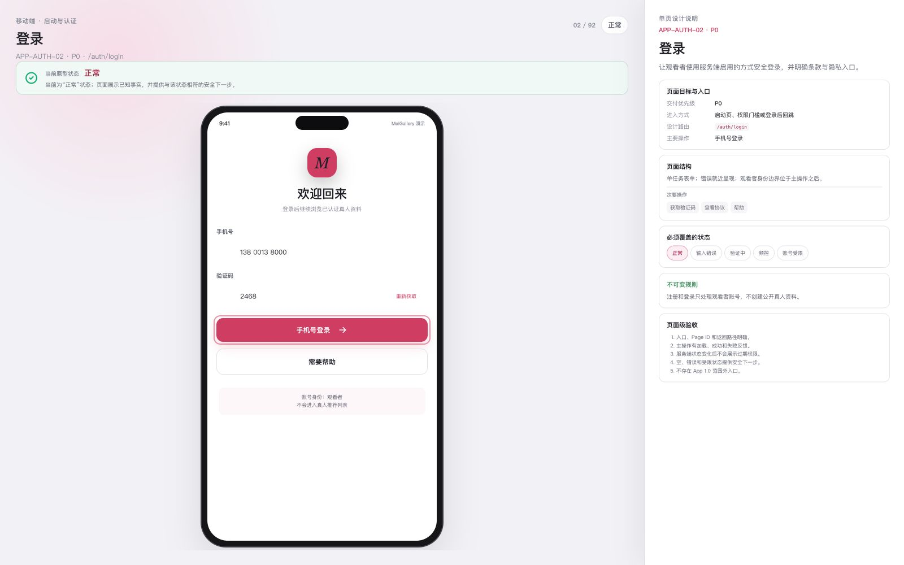

**P0 关键状态：** 账号受限

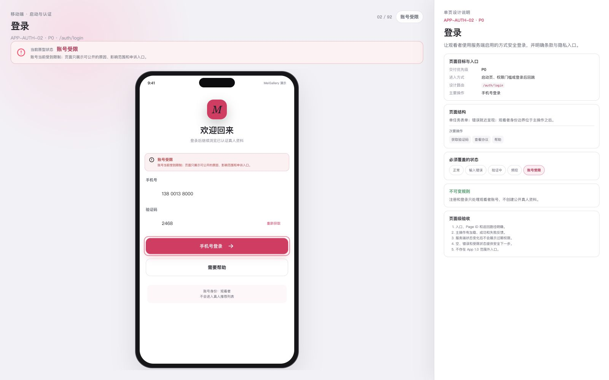

---

#### APP-AUTH-03 注册

**平台与模块：** 移动端 · 启动与认证　　**优先级：** P0　　**设计路由：** `/auth/register`

**用户价值：** 只创建观看者账号，不创建公开真人资料。

**适用角色：** 游客、观看者

**前置条件：** 客户端已取得远程配置；涉及账号写操作时必须通过服务端验证、频控和风险校验。

**进入路径：** 登录页选择注册

**页面结构：** 采用单任务认证表单，输入错误就近呈现，观看者身份边界紧邻主操作。

**详细交互：** 用户从“登录页选择注册”进入。主要操作为“创建观看者账号”，执行时显示处理中状态；服务端确认成功后刷新权威数据并可进入 APP-AUTH-05「初始偏好」。次要操作包括：重新发送、查看条款。失败时保留已输入内容，展示可理解原因，并提供重试、返回或帮助入口。

**业务规则：** 注册和登录只处理观看者账号，不创建公开真人资料。

**数据与权限：** 只读取当前账号范围内的必要数据；所有写操作均由服务端鉴权、校验并返回权威状态。

**页面状态：** 正常、标识占用、验证码失效、地区不可用

**Figma 最终稿映射：** `10｜Mobile Pages` → `APP-AUTH-03`，共 4 个需求状态；在 [Figma 最终设计文件](https://www.figma.com/design/LaNSwwGsznwcpV8msj7BQC/Peachmote-UI-%E5%80%9F%E9%89%B4%E5%AE%A1%E6%9F%A5%E6%9D%BF---MeiGallery) 中按 Page ID 定位。

**实现追踪：**

- 追踪键：`APP-AUTH-03 → PRD-FR-001,PRD-FR-002,PRD-FR-003,PRD-FR-004 → SCP-FR-001,SCP-FR-013 → F-01/ACC-FR-*`
- 产品需求：`PRD-FR-001`、`PRD-FR-002`、`PRD-FR-003`、`PRD-FR-004`
- 发布范围：`SCP-FR-001`、`SCP-FR-013`
- 非功能要求：`PRD-NFR-001`、`PRD-NFR-005`、`PRD-NFR-006`、`PRD-NFR-007`
- 产品级验收：`PRD-AC-001`、`PRD-AC-010`
- 模块 PRD：[F-01 观看者注册、登录与设备安全](../ways-of-work/plan/real-person-discovery-platform/account-access-and-device-management/prd.md)（ACC-FR-*）

**开发验收：**

- 从“登录页选择注册”能够进入，页面明确显示 APP-AUTH-03、页面名称、设计路由和返回路径。
- 主要操作“创建观看者账号”具有处理中、成功和失败反馈，重复提交不会产生不可控的重复业务结果。
- 页面覆盖“正常、标识占用、验证码失效、地区不可用”状态，并在空、错误、受限或冲突时提供安全下一步。
- 服务端状态变化后不会继续展示过期权限、过期余额、失效认证或不可访问内容。
- 注册和登录只处理观看者账号，不创建公开真人资料。
- UI 层、状态层、数据层和服务端契约不得使用页面展示名称替代稳定 ID、rank、entitlement 或状态枚举。
- 加载、空、错误、离线、无权限、对象失效和服务端状态变化必须按本页状态集合安全收敛。

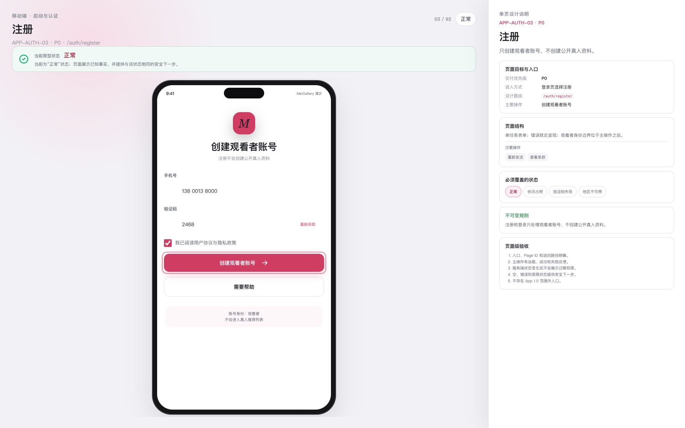

**P0 关键状态：** 验证码失效

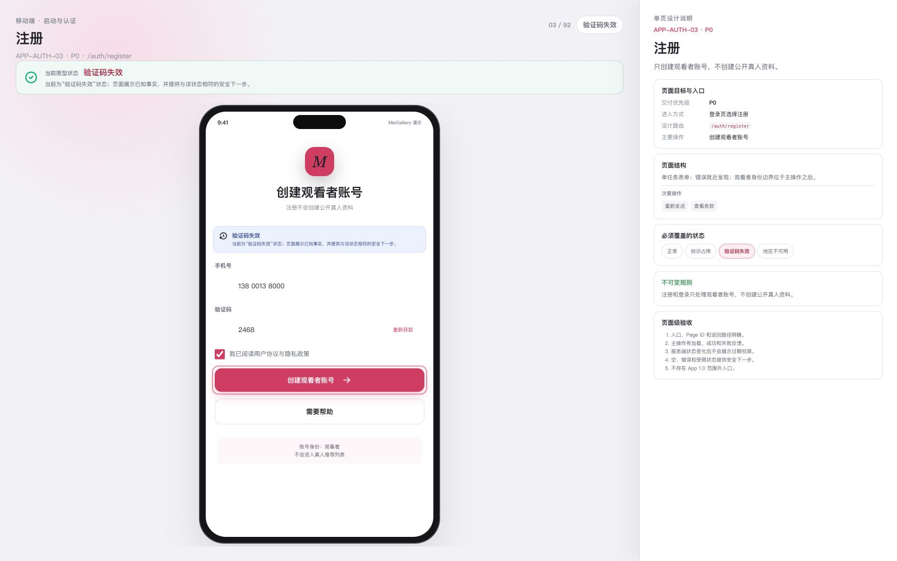

---

#### APP-AUTH-04 风险验证

**平台与模块：** 移动端 · 启动与认证　　**优先级：** P1　　**设计路由：** `/auth/challenge`

**用户价值：** 在敏感登录或账号操作前完成二次验证并解释触发原因。

**适用角色：** 游客、观看者

**前置条件：** 客户端已取得远程配置；涉及账号写操作时必须通过服务端验证、频控和风险校验。

**进入路径：** 登录风险、设备变化或敏感操作

**页面结构：** 风险原因、验证目标、验证码输入和重试限制按任务顺序纵向组织。

**详细交互：** 用户从“登录风险、设备变化或敏感操作”进入。主要操作为“完成验证”，执行时显示处理中状态；服务端确认成功后刷新权威数据并可进入 APP-DSC-01「推荐首页」。次要操作包括：重新发送、退出账号。失败时保留已输入内容，展示可理解原因，并提供重试、返回或帮助入口。

**业务规则：** 注册和登录只处理观看者账号，不创建公开真人资料。

**数据与权限：** 只读取当前账号范围内的必要数据；所有写操作均由服务端鉴权、校验并返回权威状态。

**页面状态：** 等待、失败、次数限制

**Figma 最终稿映射：** `10｜Mobile Pages` → `APP-AUTH-04`，共 3 个需求状态；在 [Figma 最终设计文件](https://www.figma.com/design/LaNSwwGsznwcpV8msj7BQC/Peachmote-UI-%E5%80%9F%E9%89%B4%E5%AE%A1%E6%9F%A5%E6%9D%BF---MeiGallery) 中按 Page ID 定位。

**实现追踪：**

- 追踪键：`APP-AUTH-04 → PRD-FR-001,PRD-FR-002,PRD-FR-003,PRD-FR-004 → SCP-FR-001,SCP-FR-013 → F-01/ACC-FR-*`
- 产品需求：`PRD-FR-001`、`PRD-FR-002`、`PRD-FR-003`、`PRD-FR-004`
- 发布范围：`SCP-FR-001`、`SCP-FR-013`
- 非功能要求：`PRD-NFR-001`、`PRD-NFR-005`、`PRD-NFR-006`、`PRD-NFR-007`
- 产品级验收：`PRD-AC-001`、`PRD-AC-010`
- 模块 PRD：[F-01 观看者注册、登录与设备安全](../ways-of-work/plan/real-person-discovery-platform/account-access-and-device-management/prd.md)（ACC-FR-*）

**开发验收：**

- 从“登录风险、设备变化或敏感操作”能够进入，页面明确显示 APP-AUTH-04、页面名称、设计路由和返回路径。
- 主要操作“完成验证”具有处理中、成功和失败反馈，重复提交不会产生不可控的重复业务结果。
- 页面覆盖“等待、失败、次数限制”状态，并在空、错误、受限或冲突时提供安全下一步。
- 服务端状态变化后不会继续展示过期权限、过期余额、失效认证或不可访问内容。
- 注册和登录只处理观看者账号，不创建公开真人资料。
- UI 层、状态层、数据层和服务端契约不得使用页面展示名称替代稳定 ID、rank、entitlement 或状态枚举。
- 加载、空、错误、离线、无权限、对象失效和服务端状态变化必须按本页状态集合安全收敛。

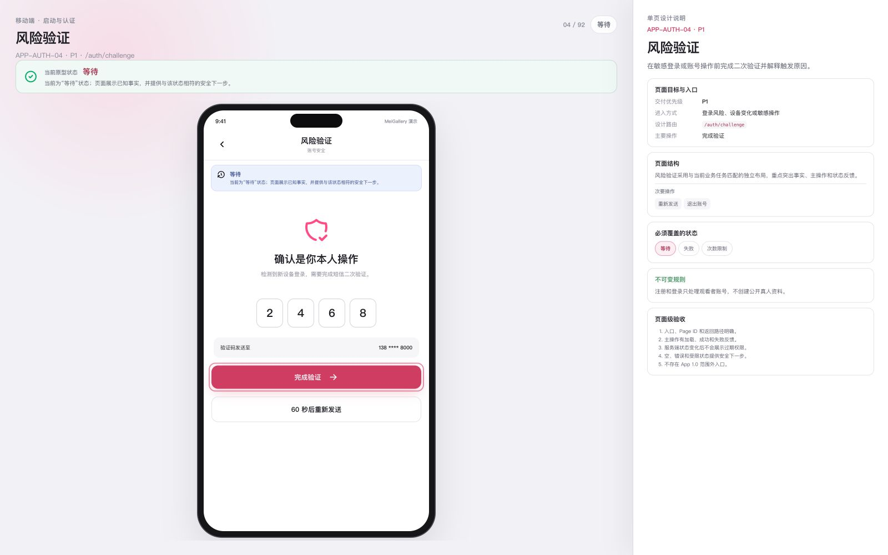

---

#### APP-AUTH-05 初始偏好

**平台与模块：** 移动端 · 启动与认证　　**优先级：** P1　　**设计路由：** `/onboarding/preferences`

**用户价值：** 收集可跳过的地区与内容偏好，用于非关系型内容推荐。

**适用角色：** 游客、观看者

**前置条件：** 客户端已取得远程配置；涉及账号写操作时必须通过服务端验证、频控和风险校验。

**进入路径：** 首次注册成功

**页面结构：** 按地区、风格和主题分组选择，持续披露偏好用途及跳过后的推荐方式。

**详细交互：** 用户从“首次注册成功”进入。主要操作为“保存偏好”，执行时显示处理中状态；服务端确认成功后刷新权威数据并可进入 APP-DSC-01「推荐首页」。次要操作包括：跳过、查看用途。失败时保留已输入内容，展示可理解原因，并提供重试、返回或帮助入口。

**业务规则：** 注册和登录只处理观看者账号，不创建公开真人资料。

**数据与权限：** 只读取当前账号范围内的必要数据；所有写操作均由服务端鉴权、校验并返回权威状态。

**页面状态：** 正常、空目录、保存失败、非个性化说明

**Figma 最终稿映射：** `10｜Mobile Pages` → `APP-AUTH-05`，共 4 个需求状态；在 [Figma 最终设计文件](https://www.figma.com/design/LaNSwwGsznwcpV8msj7BQC/Peachmote-UI-%E5%80%9F%E9%89%B4%E5%AE%A1%E6%9F%A5%E6%9D%BF---MeiGallery) 中按 Page ID 定位。

**实现追踪：**

- 追踪键：`APP-AUTH-05 → PRD-FR-001,PRD-FR-002,PRD-FR-003,PRD-FR-004 → SCP-FR-001,SCP-FR-013 → F-01/ACC-FR-*`
- 产品需求：`PRD-FR-001`、`PRD-FR-002`、`PRD-FR-003`、`PRD-FR-004`
- 发布范围：`SCP-FR-001`、`SCP-FR-013`
- 非功能要求：`PRD-NFR-001`、`PRD-NFR-005`、`PRD-NFR-006`、`PRD-NFR-007`
- 产品级验收：`PRD-AC-001`、`PRD-AC-010`
- 模块 PRD：[F-01 观看者注册、登录与设备安全](../ways-of-work/plan/real-person-discovery-platform/account-access-and-device-management/prd.md)（ACC-FR-*）

**开发验收：**

- 从“首次注册成功”能够进入，页面明确显示 APP-AUTH-05、页面名称、设计路由和返回路径。
- 主要操作“保存偏好”具有处理中、成功和失败反馈，重复提交不会产生不可控的重复业务结果。
- 页面覆盖“正常、空目录、保存失败、非个性化说明”状态，并在空、错误、受限或冲突时提供安全下一步。
- 服务端状态变化后不会继续展示过期权限、过期余额、失效认证或不可访问内容。
- 注册和登录只处理观看者账号，不创建公开真人资料。
- UI 层、状态层、数据层和服务端契约不得使用页面展示名称替代稳定 ID、rank、entitlement 或状态枚举。
- 加载、空、错误、离线、无权限、对象失效和服务端状态变化必须按本页状态集合安全收敛。

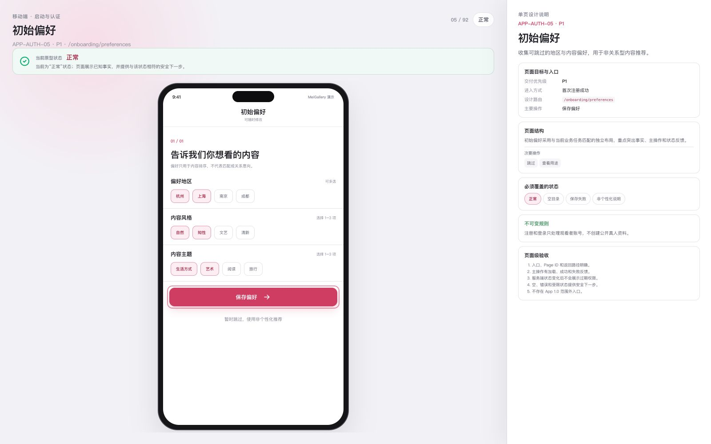

---

#### APP-AUTH-06 条款与隐私文档

**平台与模块：** 移动端 · 启动与认证　　**优先级：** P0　　**设计路由：** `/legal/{document}`

**用户价值：** 展示生效版本、更新时间和完整正文，支持从原入口返回。

**适用角色：** 游客、观看者

**前置条件：** 客户端已取得远程配置；涉及账号写操作时必须通过服务端验证、频控和风险校验。

**进入路径：** 登录、注册、设置与关于页

**页面结构：** 固定展示文档版本、更新时间、完整正文与返回原入口动作。

**详细交互：** 用户从“登录、注册、设置与关于页”进入。主要操作为“返回原页面”，执行时显示处理中状态；服务端确认成功后刷新权威数据并可进入 APP-AUTH-02「登录」。次要操作包括：切换文档、重新加载。失败时保留已输入内容，展示可理解原因，并提供重试、返回或帮助入口。

**业务规则：** 注册和登录只处理观看者账号，不创建公开真人资料。

**数据与权限：** 只读取当前账号范围内的必要数据；所有写操作均由服务端鉴权、校验并返回权威状态。

**页面状态：** 正常、加载失败、版本更新

**Figma 最终稿映射：** `10｜Mobile Pages` → `APP-AUTH-06`，共 3 个需求状态；在 [Figma 最终设计文件](https://www.figma.com/design/LaNSwwGsznwcpV8msj7BQC/Peachmote-UI-%E5%80%9F%E9%89%B4%E5%AE%A1%E6%9F%A5%E6%9D%BF---MeiGallery) 中按 Page ID 定位。

**实现追踪：**

- 追踪键：`APP-AUTH-06 → PRD-FR-001,PRD-FR-002,PRD-FR-003,PRD-FR-004 → SCP-FR-001,SCP-FR-013 → F-01/ACC-FR-*`
- 产品需求：`PRD-FR-001`、`PRD-FR-002`、`PRD-FR-003`、`PRD-FR-004`
- 发布范围：`SCP-FR-001`、`SCP-FR-013`
- 非功能要求：`PRD-NFR-001`、`PRD-NFR-005`、`PRD-NFR-006`、`PRD-NFR-007`
- 产品级验收：`PRD-AC-001`、`PRD-AC-010`
- 模块 PRD：[F-01 观看者注册、登录与设备安全](../ways-of-work/plan/real-person-discovery-platform/account-access-and-device-management/prd.md)（ACC-FR-*）

**开发验收：**

- 从“登录、注册、设置与关于页”能够进入，页面明确显示 APP-AUTH-06、页面名称、设计路由和返回路径。
- 主要操作“返回原页面”具有处理中、成功和失败反馈，重复提交不会产生不可控的重复业务结果。
- 页面覆盖“正常、加载失败、版本更新”状态，并在空、错误、受限或冲突时提供安全下一步。
- 服务端状态变化后不会继续展示过期权限、过期余额、失效认证或不可访问内容。
- 注册和登录只处理观看者账号，不创建公开真人资料。
- UI 层、状态层、数据层和服务端契约不得使用页面展示名称替代稳定 ID、rank、entitlement 或状态枚举。
- 加载、空、错误、离线、无权限、对象失效和服务端状态变化必须按本页状态集合安全收敛。

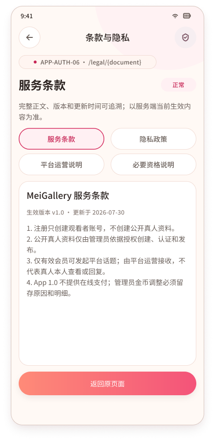

**P0 关键状态：** 加载失败

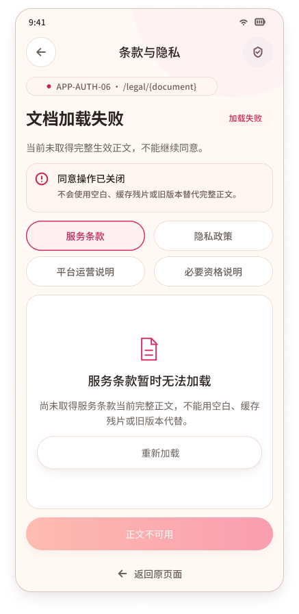

---

### 移动端 · 发现与真人

本组共 9 个页面。实现、接口、测试和缺陷均按 Page ID 追踪。

#### APP-DSC-01 推荐首页

**平台与模块：** 移动端 · 发现与真人　　**优先级：** P0　　**设计路由：** `/discover`

**用户价值：** 按地区、内容热度和用户偏好展示已认证、已发布的真人资料。

**适用角色：** 观看者

**前置条件：** 推荐目录可用；真人资料必须处于认证有效、授权有效、已发布且未被安全隐藏状态。

**进入路径：** 登录完成、底部推荐 Tab 或返回首页

**页面结构：** 推荐范围、搜索、频道和真人卡片构成首屏，认证状态与推荐依据优先展示。

**详细交互：** 用户从“登录完成、底部推荐 Tab 或返回首页”进入。主要操作为“查看真人详情”，执行时显示处理中状态；服务端确认成功后刷新权威数据并可进入 APP-DSC-07「真人详情」。次要操作包括：搜索、筛选、切换频道、查看通知。失败时保留已输入内容，展示可理解原因，并提供重试、返回或帮助入口。

**业务规则：** 只展示认证有效、已发布、授权有效且未被安全隐藏的真人资料。

**数据与权限：** 只读取公开投影和经授权媒体凭证；受保护媒体凭证由服务端短期签发。

**页面状态：** 正常、首次空、骨架、分页、离线缓存、规则刷新

**Figma 最终稿映射：** `10｜Mobile Pages` → `APP-DSC-01`，共 6 个需求状态；在 [Figma 最终设计文件](https://www.figma.com/design/LaNSwwGsznwcpV8msj7BQC/Peachmote-UI-%E5%80%9F%E9%89%B4%E5%AE%A1%E6%9F%A5%E6%9D%BF---MeiGallery) 中按 Page ID 定位。

**实现追踪：**

- 追踪键：`APP-DSC-01 → PRD-FR-020,PRD-FR-021,PRD-FR-022,PRD-FR-023 → SCP-FR-002,SCP-FR-003 → F-02–F-05/DSP-FR-*,A-05/ROP-FR-*`
- 产品需求：`PRD-FR-020`、`PRD-FR-021`、`PRD-FR-022`、`PRD-FR-023`
- 发布范围：`SCP-FR-002`、`SCP-FR-003`
- 非功能要求：`PRD-NFR-001`、`PRD-NFR-004`、`PRD-NFR-005`、`PRD-NFR-006`、`PRD-NFR-007`
- 产品级验收：`PRD-AC-002`、`PRD-AC-010`
- 模块 PRD：[F-02–F-05 真人发现、搜索与资料浏览](../ways-of-work/plan/real-person-discovery-platform/person-discovery-and-profile-experience/prd.md)（DSP-FR-*）；[A-05 推荐位、排序规则与热度运营](../ways-of-work/plan/real-person-discovery-platform/recommendation-and-popularity-operations/prd.md)（ROP-FR-*）

**开发验收：**

- 从“登录完成、底部推荐 Tab 或返回首页”能够进入，页面明确显示 APP-DSC-01、页面名称、设计路由和返回路径。
- 主要操作“查看真人详情”具有处理中、成功和失败反馈，重复提交不会产生不可控的重复业务结果。
- 页面覆盖“正常、首次空、骨架、分页、离线缓存、规则刷新”状态，并在空、错误、受限或冲突时提供安全下一步。
- 服务端状态变化后不会继续展示过期权限、过期余额、失效认证或不可访问内容。
- 只展示认证有效、已发布、授权有效且未被安全隐藏的真人资料。
- UI 层、状态层、数据层和服务端契约不得使用页面展示名称替代稳定 ID、rank、entitlement 或状态枚举。
- 加载、空、错误、离线、无权限、对象失效和服务端状态变化必须按本页状态集合安全收敛。

**P0 关键状态：** 离线缓存

---

#### APP-DSC-02 地区选择

**平台与模块：** 移动端 · 发现与真人　　**优先级：** P0　　**设计路由：** `/discover/regions`

**用户价值：** 用模糊地区层级控制内容范围，不申请或展示精确定位。

**适用角色：** 观看者

**前置条件：** 推荐目录可用；真人资料必须处于认证有效、授权有效、已发布且未被安全隐藏状态。

**进入路径：** 推荐页地区入口或筛选页

**页面结构：** 搜索、当前选择、最近使用和完整目录分区组织，并明确不使用精确定位。

**详细交互：** 用户从“推荐页地区入口或筛选页”进入。主要操作为“应用地区”，执行时显示处理中状态；服务端确认成功后刷新权威数据并可进入 APP-DSC-01「推荐首页」。次要操作包括：搜索地区、清除选择。失败时保留已输入内容，展示可理解原因，并提供重试、返回或帮助入口。

**业务规则：** 只展示认证有效、已发布、授权有效且未被安全隐藏的真人资料。

**数据与权限：** 只读取公开投影和经授权媒体凭证；受保护媒体凭证由服务端短期签发。

**页面状态：** 正常、定位未使用、目录更新、无结果

**Figma 最终稿映射：** `10｜Mobile Pages` → `APP-DSC-02`，共 4 个需求状态；在 [Figma 最终设计文件](https://www.figma.com/design/LaNSwwGsznwcpV8msj7BQC/Peachmote-UI-%E5%80%9F%E9%89%B4%E5%AE%A1%E6%9F%A5%E6%9D%BF---MeiGallery) 中按 Page ID 定位。

**实现追踪：**

- 追踪键：`APP-DSC-02 → PRD-FR-020,PRD-FR-021,PRD-FR-022,PRD-FR-023 → SCP-FR-002,SCP-FR-003 → F-02–F-05/DSP-FR-*,A-04/TAX-FR-*`
- 产品需求：`PRD-FR-020`、`PRD-FR-021`、`PRD-FR-022`、`PRD-FR-023`
- 发布范围：`SCP-FR-002`、`SCP-FR-003`
- 非功能要求：`PRD-NFR-001`、`PRD-NFR-004`、`PRD-NFR-005`、`PRD-NFR-006`、`PRD-NFR-007`
- 产品级验收：`PRD-AC-002`、`PRD-AC-010`
- 模块 PRD：[F-02–F-05 真人发现、搜索与资料浏览](../ways-of-work/plan/real-person-discovery-platform/person-discovery-and-profile-experience/prd.md)（DSP-FR-*）；[A-04 标签、地区与分类目录管理](../ways-of-work/plan/real-person-discovery-platform/taxonomy-region-and-category-management/prd.md)（TAX-FR-*）

**开发验收：**

- 从“推荐页地区入口或筛选页”能够进入，页面明确显示 APP-DSC-02、页面名称、设计路由和返回路径。
- 主要操作“应用地区”具有处理中、成功和失败反馈，重复提交不会产生不可控的重复业务结果。
- 页面覆盖“正常、定位未使用、目录更新、无结果”状态，并在空、错误、受限或冲突时提供安全下一步。
- 服务端状态变化后不会继续展示过期权限、过期余额、失效认证或不可访问内容。
- 只展示认证有效、已发布、授权有效且未被安全隐藏的真人资料。
- UI 层、状态层、数据层和服务端契约不得使用页面展示名称替代稳定 ID、rank、entitlement 或状态枚举。
- 加载、空、错误、离线、无权限、对象失效和服务端状态变化必须按本页状态集合安全收敛。

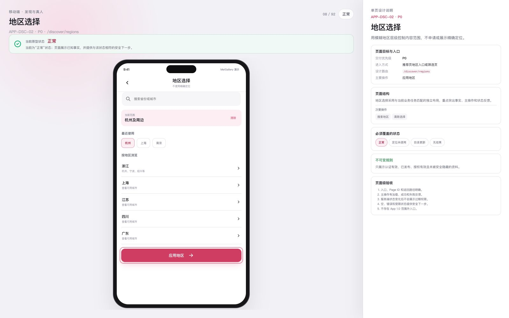

**P0 关键状态：** 无结果

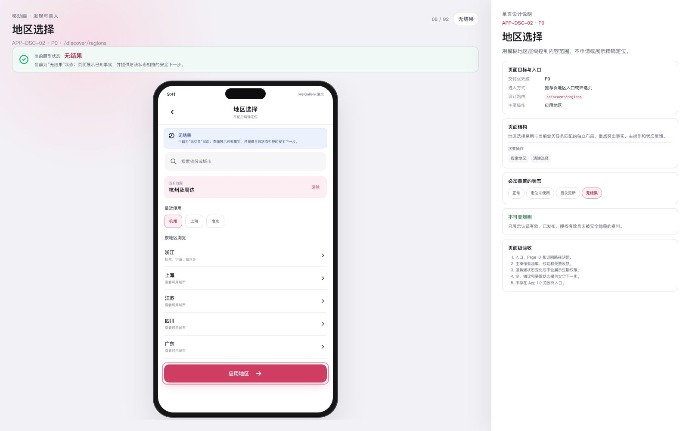

---

#### APP-DSC-03 分类

**平台与模块：** 移动端 · 发现与真人　　**优先级：** P1　　**设计路由：** `/discover/categories`

**用户价值：** 按身份、职业、风格和内容类型组织可浏览主题。

**适用角色：** 观看者

**前置条件：** 推荐目录可用；真人资料必须处于认证有效、授权有效、已发布且未被安全隐藏状态。

**进入路径：** 推荐频道或搜索入口

**页面结构：** 分类入口按业务维度分组，空分类和目录失效均保留可恢复路径。

**详细交互：** 用户从“推荐频道或搜索入口”进入。主要操作为“进入分类”，执行时显示处理中状态；服务端确认成功后刷新权威数据并可进入 APP-DSC-01「推荐首页」。次要操作包括：收藏主题、查看全部。失败时保留已输入内容，展示可理解原因，并提供重试、返回或帮助入口。

**业务规则：** 只展示认证有效、已发布、授权有效且未被安全隐藏的真人资料。

**数据与权限：** 只读取公开投影和经授权媒体凭证；受保护媒体凭证由服务端短期签发。

**页面状态：** 正常、空分类、目录失效

**Figma 最终稿映射：** `10｜Mobile Pages` → `APP-DSC-03`，共 3 个需求状态；在 [Figma 最终设计文件](https://www.figma.com/design/LaNSwwGsznwcpV8msj7BQC/Peachmote-UI-%E5%80%9F%E9%89%B4%E5%AE%A1%E6%9F%A5%E6%9D%BF---MeiGallery) 中按 Page ID 定位。

**实现追踪：**

- 追踪键：`APP-DSC-03 → PRD-FR-020,PRD-FR-021,PRD-FR-022,PRD-FR-023 → SCP-FR-002,SCP-FR-003 → F-02–F-05/DSP-FR-*,A-04/TAX-FR-*`
- 产品需求：`PRD-FR-020`、`PRD-FR-021`、`PRD-FR-022`、`PRD-FR-023`
- 发布范围：`SCP-FR-002`、`SCP-FR-003`
- 非功能要求：`PRD-NFR-001`、`PRD-NFR-004`、`PRD-NFR-005`、`PRD-NFR-006`、`PRD-NFR-007`
- 产品级验收：`PRD-AC-002`、`PRD-AC-010`
- 模块 PRD：[F-02–F-05 真人发现、搜索与资料浏览](../ways-of-work/plan/real-person-discovery-platform/person-discovery-and-profile-experience/prd.md)（DSP-FR-*）；[A-04 标签、地区与分类目录管理](../ways-of-work/plan/real-person-discovery-platform/taxonomy-region-and-category-management/prd.md)（TAX-FR-*）

**开发验收：**

- 从“推荐频道或搜索入口”能够进入，页面明确显示 APP-DSC-03、页面名称、设计路由和返回路径。
- 主要操作“进入分类”具有处理中、成功和失败反馈，重复提交不会产生不可控的重复业务结果。
- 页面覆盖“正常、空分类、目录失效”状态，并在空、错误、受限或冲突时提供安全下一步。
- 服务端状态变化后不会继续展示过期权限、过期余额、失效认证或不可访问内容。
- 只展示认证有效、已发布、授权有效且未被安全隐藏的真人资料。
- UI 层、状态层、数据层和服务端契约不得使用页面展示名称替代稳定 ID、rank、entitlement 或状态枚举。
- 加载、空、错误、离线、无权限、对象失效和服务端状态变化必须按本页状态集合安全收敛。

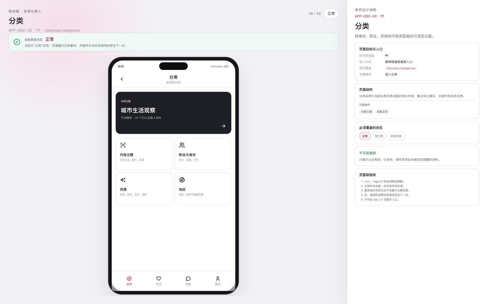

---

#### APP-DSC-04 搜索

**平台与模块：** 移动端 · 发现与真人　　**优先级：** P0　　**设计路由：** `/search`

**用户价值：** 搜索展示名、地区、职业与标签，并明确无结果原因。

**适用角色：** 观看者

**前置条件：** 推荐目录可用；真人资料必须处于认证有效、授权有效、已发布且未被安全隐藏状态。

**进入路径：** 推荐页搜索框

**页面结构：** 搜索输入、历史、建议、结果和无结果解释围绕同一搜索任务组织。

**详细交互：** 用户从“推荐页搜索框”进入。主要操作为“提交搜索”，客户端通过 `POST /api/v2/person-profiles/search` 在正文中发送搜索词和可选 `filters`；仅条件搜索默认热门，文本搜索默认相关度。服务端确认成功后刷新权威数据并可进入 APP-DSC-07「真人详情」。搜索读取本身不写历史；只有用户已开启独立搜索历史、存在自由搜索词且结果成功呈现，客户端才提交带当前设置版本的显式记录命令。次要操作包括：逐条/全部清除历史、打开筛选。切换搜索词、条件或排序必须丢弃旧游标；失败时保留输入和条件，展示可理解原因，并提供重试、返回或帮助入口。

**业务规则：** 自由文本只检索审核展示昵称、公开地区和公开标签；Search-2 结构化条件只使用稳定 taxonomy ID，地区同组 OR、跨组 AND、父级包含后代。只展示认证有效、已发布、授权有效且未被安全隐藏的真人资料；受限或失效条件不得被忽略。搜索历史默认关闭并与浏览历史完全独立，纯筛选不写自由文本历史。

**数据与权限：** 只读取公开投影和经授权媒体凭证；受保护媒体凭证由服务端短期签发。

**页面状态：** 初始、输入中、有结果、无结果、历史关闭

**Figma 最终稿映射：** `10｜Mobile Pages` → `APP-DSC-04`，共 5 个需求状态；在 [Figma 最终设计文件](https://www.figma.com/design/LaNSwwGsznwcpV8msj7BQC/Peachmote-UI-%E5%80%9F%E9%89%B4%E5%AE%A1%E6%9F%A5%E6%9D%BF---MeiGallery) 中按 Page ID 定位。

**实现追踪：**

- 追踪键：`APP-DSC-04 → PRD-FR-020,PRD-FR-021,PRD-FR-022,PRD-FR-023 → SCP-FR-002,SCP-FR-003 → F-02–F-05/DSP-FR-*,A-04/TAX-FR-*`
- 产品需求：`PRD-FR-020`、`PRD-FR-021`、`PRD-FR-022`、`PRD-FR-023`
- 发布范围：`SCP-FR-002`、`SCP-FR-003`
- 非功能要求：`PRD-NFR-001`、`PRD-NFR-004`、`PRD-NFR-005`、`PRD-NFR-006`、`PRD-NFR-007`
- 产品级验收：`PRD-AC-002`、`PRD-AC-010`
- 模块 PRD：[F-02–F-05 真人发现、搜索与资料浏览](../ways-of-work/plan/real-person-discovery-platform/person-discovery-and-profile-experience/prd.md)（DSP-FR-*）；[A-04 标签、地区与分类目录管理](../ways-of-work/plan/real-person-discovery-platform/taxonomy-region-and-category-management/prd.md)（TAX-FR-*）

**开发验收：**

- 从“推荐页搜索框”能够进入，页面明确显示 APP-DSC-04、页面名称、设计路由和返回路径。
- 主要操作“提交搜索”具有处理中、成功和失败反馈；读取无隐式写入，历史记录使用稳定 `searchId` 幂等提交。
- 页面覆盖“初始、输入中、有结果、无结果、历史关闭”状态，并在空、错误、受限或冲突时提供安全下一步。
- 服务端状态变化后不会继续展示过期权限、过期余额、失效认证或不可访问内容。
- 只展示认证有效、已发布、授权有效且未被安全隐藏的真人资料。
- 搜索词不得进入 URL、分页游标、保存条件、审计日志或分析事件；切换搜索词、筛选条件或排序后必须丢弃旧游标。
- 历史关闭时不提交记录；逐条删除和全部清除后旧设置版本的在途写入必须被服务端拒绝。
- UI 层、状态层、数据层和服务端契约不得使用页面展示名称替代稳定 ID、rank、entitlement 或状态枚举。
- 加载、空、错误、离线、无权限、对象失效和服务端状态变化必须按本页状态集合安全收敛。

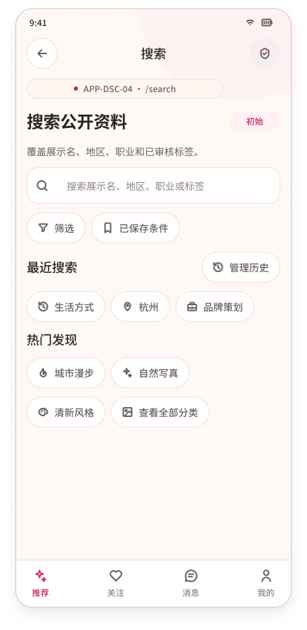

**P0 关键状态：** 无结果

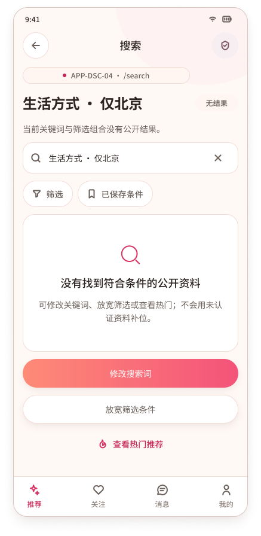

---

#### APP-DSC-05 筛选

**平台与模块：** 移动端 · 发现与真人　　**优先级：** P0　　**设计路由：** `/search/filters`

**用户价值：** 配置基础与会员高级条件，实时反馈预计结果数。

**适用角色：** 观看者

**前置条件：** 推荐目录可用；真人资料必须处于认证有效、授权有效、已发布且未被安全隐藏状态。

**进入路径：** 搜索页或推荐页筛选入口

**页面结构：** 基础筛选、高级权益门槛、预计结果数和应用动作处于同一工作面。

**详细交互：** 用户从“搜索页或推荐页筛选入口”进入，先读取 taxonomy 目录与 `GET /api/v2/me/search-filter-capabilities`。基础项可直接选择；风格/职业/场景在 `advancedTier=basic|full` 时开放，其余高级项要求 `full`。修改条件后防抖调用 `POST /api/v2/person-profiles/search/preview`，在不替换当前搜索结果的前提下显示目录重定向、失效/冗余项、权限状态和预计结果数。只有 `canApply=true` 时“查看 N 位”可提交正式搜索；受限时主动作改为查看会员权益，失效时要求移除或刷新目录。次要操作包括：清空、保存条件。失败时保留当前输入和条件，不扩大结果范围。

**业务规则：** 地区范围/地区组/城市国家为一个逻辑组，同组 OR、不同组 AND；父级包含后代，同组父子同时选择时后代冗余。基础筛选对登录观看者开放，高级筛选由 `discovery.filter.advanced` 服务端判断。只展示认证有效、已发布、授权有效且未被安全隐藏的真人资料；越权和无效条件 fail closed。

**数据与权限：** 条件只传 `catalogVersionId + termIds`，客户端展示名不参与查询。preview 与正式搜索共用公开资格和屏蔽口径；受保护媒体凭证仍由服务端短期签发。

**页面状态：** 正常、权益门槛、目录冲突、无结果

**Figma 最终稿映射：** `10｜Mobile Pages` → `APP-DSC-05`，共 4 个需求状态；在 [Figma 最终设计文件](https://www.figma.com/design/LaNSwwGsznwcpV8msj7BQC/Peachmote-UI-%E5%80%9F%E9%89%B4%E5%AE%A1%E6%9F%A5%E6%9D%BF---MeiGallery) 中按 Page ID 定位。

**实现追踪：**

- 追踪键：`APP-DSC-05 → PRD-FR-020,PRD-FR-021,PRD-FR-022,PRD-FR-023 → SCP-FR-002,SCP-FR-003 → F-02–F-05/DSP-FR-*,A-04/TAX-FR-*`
- 产品需求：`PRD-FR-020`、`PRD-FR-021`、`PRD-FR-022`、`PRD-FR-023`
- 发布范围：`SCP-FR-002`、`SCP-FR-003`
- 非功能要求：`PRD-NFR-001`、`PRD-NFR-004`、`PRD-NFR-005`、`PRD-NFR-006`、`PRD-NFR-007`
- 产品级验收：`PRD-AC-002`、`PRD-AC-010`
- 模块 PRD：[F-02–F-05 真人发现、搜索与资料浏览](../ways-of-work/plan/real-person-discovery-platform/person-discovery-and-profile-experience/prd.md)（DSP-FR-*）；[A-04 标签、地区与分类目录管理](../ways-of-work/plan/real-person-discovery-platform/taxonomy-region-and-category-management/prd.md)（TAX-FR-*）

**开发验收：**

- 从“搜索页或推荐页筛选入口”能够进入，页面明确显示 APP-DSC-05、页面名称、设计路由和返回路径。
- 主要操作“应用筛选”具有处理中、成功和失败反馈；preview 不修改当前结果，只有正式提交成功后才替换结果。
- 页面覆盖“正常、权益门槛、目录冲突、无结果”状态，并在空、错误、受限或冲突时提供安全下一步。
- 服务端状态变化后不会继续展示过期权限、过期余额、失效认证或不可访问内容。
- 只展示认证有效、已发布、授权有效且未被安全隐藏的真人资料。
- 同组 OR、跨组 AND、父级包含后代；目录 merged 返回重定向，invalid/restricted 阻止正式搜索且不计算结果数。
- 受限条件只进入权益说明，不显示在线支付，不返回受限结果；无结果提供放宽、清空和热门入口。
- UI 层、状态层、数据层和服务端契约不得使用页面展示名称替代稳定 ID、rank、entitlement 或状态枚举。
- 加载、空、错误、离线、无权限、对象失效和服务端状态变化必须按本页状态集合安全收敛。

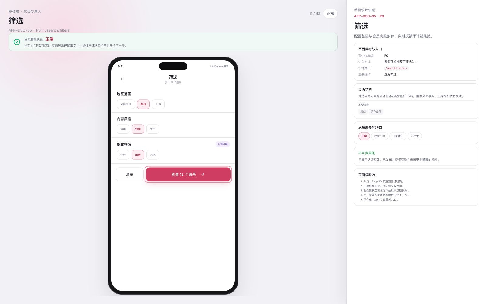

**P0 关键状态：** 权益门槛

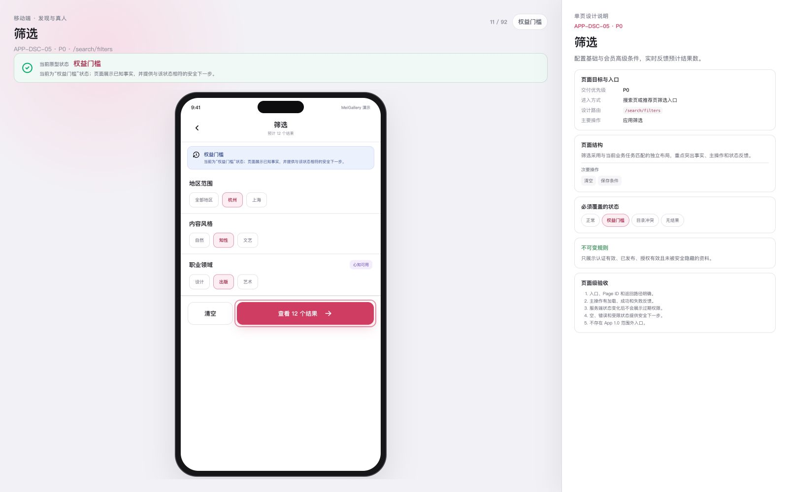

---

#### APP-DSC-06 已保存条件

**平台与模块：** 移动端 · 发现与真人　　**优先级：** P1　　**设计路由：** `/saved-filters`

**用户价值：** 管理常用筛选条件并安全处理目录词条变化。

**适用角色：** 观看者

**前置条件：** 推荐目录可用；真人资料必须处于认证有效、授权有效、已发布且未被安全隐藏状态。

**进入路径：** 筛选页保存入口或我的页面

**页面结构：** 已保存条件、额度、目录变化和管理动作按可恢复性组织。

**详细交互：** 用户从“筛选页保存入口或我的页面”进入，通过 `GET /api/v2/me/saved-filters` 获取本人条件和“已保存 X / Y”。创建要求名称、稳定条件、热门/最新默认排序和客户端稳定 `Idempotency-Key`；不允许保存自由搜索词。主要操作“使用条件”会先按当前目录和会员权益重新 preview，只有 `canApply=true` 才进入 APP-DSC-04「搜索」。次要操作包括：重命名、修改条件、删除，修改和删除均携带 `expectedVersion`；版本冲突时刷新单项并要求用户确认，不静默覆盖。

**业务规则：** 保存数量由 `discovery.saved_filter.max` 服务端原子限制。会员降级不删除既有项；卡片保留并显示当前不可用条件，可重命名、改为本人可用的基础条件或删除。目录 merged 自动指向目标并提示更新；invalid 项保留为可移除错误，不允许扩大搜索。

**数据与权限：** 资源严格按 Bearer 账号隔离，不接收请求体账号 ID；只持久化名称、稳定 taxonomy ID、目录和默认排序。删除清空词条内容并保留最小幂等 tombstone。

**页面状态：** 正常、空、额度满、标签已合并

**Figma 最终稿映射：** `10｜Mobile Pages` → `APP-DSC-06`，共 4 个需求状态；在 [Figma 最终设计文件](https://www.figma.com/design/LaNSwwGsznwcpV8msj7BQC/Peachmote-UI-%E5%80%9F%E9%89%B4%E5%AE%A1%E6%9F%A5%E6%9D%BF---MeiGallery) 中按 Page ID 定位。

**实现追踪：**

- 追踪键：`APP-DSC-06 → PRD-FR-020,PRD-FR-021,PRD-FR-022,PRD-FR-023 → SCP-FR-002,SCP-FR-003 → F-02–F-05/DSP-FR-*,A-04/TAX-FR-*`
- 产品需求：`PRD-FR-020`、`PRD-FR-021`、`PRD-FR-022`、`PRD-FR-023`
- 发布范围：`SCP-FR-002`、`SCP-FR-003`
- 非功能要求：`PRD-NFR-001`、`PRD-NFR-004`、`PRD-NFR-005`、`PRD-NFR-006`、`PRD-NFR-007`
- 产品级验收：`PRD-AC-002`、`PRD-AC-010`
- 模块 PRD：[F-02–F-05 真人发现、搜索与资料浏览](../ways-of-work/plan/real-person-discovery-platform/person-discovery-and-profile-experience/prd.md)（DSP-FR-*）；[A-04 标签、地区与分类目录管理](../ways-of-work/plan/real-person-discovery-platform/taxonomy-region-and-category-management/prd.md)（TAX-FR-*）

**开发验收：**

- 从“筛选页保存入口或我的页面”能够进入，页面明确显示 APP-DSC-06、页面名称、设计路由和返回路径。
- 主要操作“使用条件”先重新校验目录、权限和结果数；创建幂等，修改/删除使用乐观版本，重复提交不会产生不可控结果。
- 页面覆盖“正常、空、额度满、标签已合并”状态，并在空、错误、受限或冲突时提供安全下一步。
- 服务端状态变化后不会继续展示过期权限、过期余额、失效认证或不可访问内容。
- 只展示认证有效、已发布、授权有效且未被安全隐藏的真人资料。
- 额度满或会员降级时不删除既有条件；失效、重定向和受限状态必须在卡片上可理解、可恢复。
- 删除成功或 `deleted=false` 都收敛到已删除终态；旧幂等键不得复活已删除条件。
- UI 层、状态层、数据层和服务端契约不得使用页面展示名称替代稳定 ID、rank、entitlement 或状态枚举。
- 加载、空、错误、离线、无权限、对象失效和服务端状态变化必须按本页状态集合安全收敛。

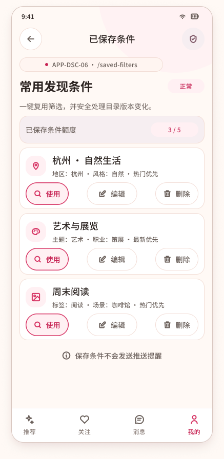

---

#### APP-DSC-07 真人详情

**平台与模块：** 移动端 · 发现与真人　　**优先级：** P0　　**设计路由：** `/person/{profileId}`

**用户价值：** 呈现授权资料、认证范围、平台维护说明和单向互动入口。

**适用角色：** 观看者

**前置条件：** 推荐目录可用；真人资料必须处于认证有效、授权有效、已发布且未被安全隐藏状态。

**进入路径：** 推荐、搜索、关注、喜欢、收藏或历史

**页面结构：** 媒体主视觉、认证事实、单向互动、平台维护披露和资料正文依次展开。

**详细交互：** 用户从“推荐、搜索、关注、喜欢、收藏或历史”进入。主要操作为“发起话题”，执行时显示处理中状态；服务端确认成功后刷新权威数据并可进入 APP-MSG-02「发起话题确认」。次要操作包括：喜欢、关注、收藏、查看认证、举报。失败时保留已输入内容，展示可理解原因，并提供重试、返回或帮助入口。

**业务规则：** 只展示认证有效、已发布、授权有效且未被安全隐藏的真人资料。

**数据与权限：** 只读取公开投影和经授权媒体凭证；受保护媒体凭证由服务端短期签发。

**页面状态：** 正常、下架、受限、离线摘要、媒体不可用

**Figma 最终稿映射：** `10｜Mobile Pages` → `APP-DSC-07`，共 5 个需求状态；在 [Figma 最终设计文件](https://www.figma.com/design/LaNSwwGsznwcpV8msj7BQC/Peachmote-UI-%E5%80%9F%E9%89%B4%E5%AE%A1%E6%9F%A5%E6%9D%BF---MeiGallery) 中按 Page ID 定位。

**实现追踪：**

- 追踪键：`APP-DSC-07 → PRD-FR-030,PRD-FR-031,PRD-FR-032 → SCP-FR-002,SCP-FR-003 → F-02–F-05/DSP-FR-*`
- 产品需求：`PRD-FR-030`、`PRD-FR-031`、`PRD-FR-032`
- 发布范围：`SCP-FR-002`、`SCP-FR-003`
- 非功能要求：`PRD-NFR-001`、`PRD-NFR-004`、`PRD-NFR-005`、`PRD-NFR-006`、`PRD-NFR-007`
- 产品级验收：`PRD-AC-002`、`PRD-AC-010`
- 模块 PRD：[F-02–F-05 真人发现、搜索与资料浏览](../ways-of-work/plan/real-person-discovery-platform/person-discovery-and-profile-experience/prd.md)（DSP-FR-*）

**开发验收：**

- 从“推荐、搜索、关注、喜欢、收藏或历史”能够进入，页面明确显示 APP-DSC-07、页面名称、设计路由和返回路径。
- 主要操作“发起话题”具有处理中、成功和失败反馈，重复提交不会产生不可控的重复业务结果。
- 页面覆盖“正常、下架、受限、离线摘要、媒体不可用”状态，并在空、错误、受限或冲突时提供安全下一步。
- 服务端状态变化后不会继续展示过期权限、过期余额、失效认证或不可访问内容。
- 只展示认证有效、已发布、授权有效且未被安全隐藏的真人资料。
- UI 层、状态层、数据层和服务端契约不得使用页面展示名称替代稳定 ID、rank、entitlement 或状态枚举。
- 加载、空、错误、离线、无权限、对象失效和服务端状态变化必须按本页状态集合安全收敛。

**P0 关键状态：** 受限

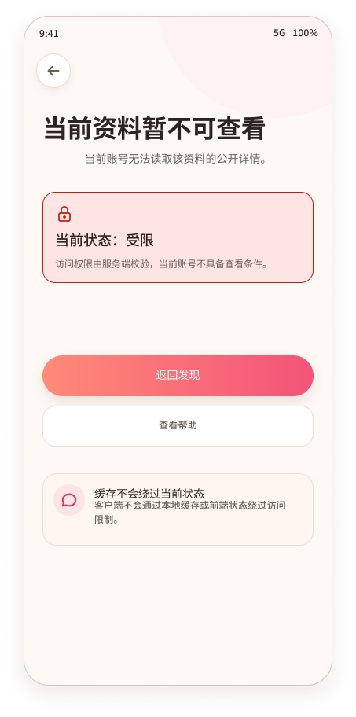

---

#### APP-DSC-08 媒体浏览

**平台与模块：** 移动端 · 发现与真人　　**优先级：** P0　　**设计路由：** `/person/{profileId}/media`

**用户价值：** 安全浏览已授权图片，支持分页、缩放、说明和举报。

**适用角色：** 观看者

**前置条件：** 推荐目录可用；真人资料必须处于认证有效、授权有效、已发布且未被安全隐藏状态。

**进入路径：** 真人详情媒体区域

**页面结构：** 媒体画布、页码、说明、缩放和举报动作保持清晰分层。

**详细交互：** 用户从“真人详情媒体区域”进入。主要操作为“查看下一张”，执行时显示处理中状态；服务端确认成功后刷新权威数据并可进入 APP-DSC-07「真人详情」。次要操作包括：缩放、查看说明、举报。失败时保留已输入内容，展示可理解原因，并提供重试、返回或帮助入口。

**业务规则：** 只展示认证有效、已发布、授权有效且未被安全隐藏的真人资料。

**数据与权限：** 只读取公开投影和经授权媒体凭证；受保护媒体凭证由服务端短期签发。

**页面状态：** 正常、凭证刷新、加载失败、内容隐藏

**Figma 最终稿映射：** `10｜Mobile Pages` → `APP-DSC-08`，共 4 个需求状态；在 [Figma 最终设计文件](https://www.figma.com/design/LaNSwwGsznwcpV8msj7BQC/Peachmote-UI-%E5%80%9F%E9%89%B4%E5%AE%A1%E6%9F%A5%E6%9D%BF---MeiGallery) 中按 Page ID 定位。

**实现追踪：**

- 追踪键：`APP-DSC-08 → PRD-FR-030,PRD-FR-031,PRD-FR-032 → SCP-FR-002,SCP-FR-003 → F-02–F-05/DSP-FR-*`
- 产品需求：`PRD-FR-030`、`PRD-FR-031`、`PRD-FR-032`
- 发布范围：`SCP-FR-002`、`SCP-FR-003`
- 非功能要求：`PRD-NFR-001`、`PRD-NFR-004`、`PRD-NFR-005`、`PRD-NFR-006`、`PRD-NFR-007`
- 产品级验收：`PRD-AC-002`、`PRD-AC-010`
- 模块 PRD：[F-02–F-05 真人发现、搜索与资料浏览](../ways-of-work/plan/real-person-discovery-platform/person-discovery-and-profile-experience/prd.md)（DSP-FR-*）

**开发验收：**

- 从“真人详情媒体区域”能够进入，页面明确显示 APP-DSC-08、页面名称、设计路由和返回路径。
- 主要操作“查看下一张”具有处理中、成功和失败反馈，重复提交不会产生不可控的重复业务结果。
- 页面覆盖“正常、凭证刷新、加载失败、内容隐藏”状态，并在空、错误、受限或冲突时提供安全下一步。
- 服务端状态变化后不会继续展示过期权限、过期余额、失效认证或不可访问内容。
- 只展示认证有效、已发布、授权有效且未被安全隐藏的真人资料。
- UI 层、状态层、数据层和服务端契约不得使用页面展示名称替代稳定 ID、rank、entitlement 或状态枚举。
- 加载、空、错误、离线、无权限、对象失效和服务端状态变化必须按本页状态集合安全收敛。

**P0 关键状态：** 加载失败

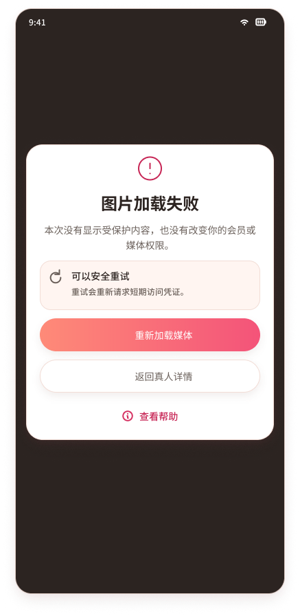

---

#### APP-DSC-09 认证说明

**平台与模块：** 移动端 · 发现与真人　　**优先级：** P0　　**设计路由：** `/person/{profileId}/verification`

**用户价值：** 解释平台实际核验的范围、更新时间和失效条件。

**适用角色：** 观看者

**前置条件：** 推荐目录可用；真人资料必须处于认证有效、授权有效、已发布且未被安全隐藏状态。

**进入路径：** 真人详情认证标识

**页面结构：** 核验范围、更新时间、失效条件和平台责任边界集中披露。

**详细交互：** 用户从“真人详情认证标识”进入。主要操作为“返回真人详情”，执行时显示处理中状态；服务端确认成功后刷新权威数据并可进入 APP-DSC-07「真人详情」。次要操作包括：查看平台说明、举报问题。失败时保留已输入内容，展示可理解原因，并提供重试、返回或帮助入口。

**业务规则：** 只展示认证有效、已发布、授权有效且未被安全隐藏的真人资料。

**数据与权限：** 只读取公开投影和经授权媒体凭证；受保护媒体凭证由服务端短期签发。

**页面状态：** 正常、认证失效、资料变化

**Figma 最终稿映射：** `10｜Mobile Pages` → `APP-DSC-09`，共 3 个需求状态；在 [Figma 最终设计文件](https://www.figma.com/design/LaNSwwGsznwcpV8msj7BQC/Peachmote-UI-%E5%80%9F%E9%89%B4%E5%AE%A1%E6%9F%A5%E6%9D%BF---MeiGallery) 中按 Page ID 定位。

**实现追踪：**

- 追踪键：`APP-DSC-09 → PRD-FR-030,PRD-FR-031,PRD-FR-032 → SCP-FR-002,SCP-FR-003 → F-02–F-05/DSP-FR-*,A-03/VER-FR-*`
- 产品需求：`PRD-FR-030`、`PRD-FR-031`、`PRD-FR-032`
- 发布范围：`SCP-FR-002`、`SCP-FR-003`
- 非功能要求：`PRD-NFR-001`、`PRD-NFR-004`、`PRD-NFR-005`、`PRD-NFR-006`、`PRD-NFR-007`
- 产品级验收：`PRD-AC-002`、`PRD-AC-010`
- 模块 PRD：[F-02–F-05 真人发现、搜索与资料浏览](../ways-of-work/plan/real-person-discovery-platform/person-discovery-and-profile-experience/prd.md)（DSP-FR-*）；[A-03 真人认证与发布审核](../ways-of-work/plan/real-person-discovery-platform/person-verification-and-publication/prd.md)（VER-FR-*）

**开发验收：**

- 从“真人详情认证标识”能够进入，页面明确显示 APP-DSC-09、页面名称、设计路由和返回路径。
- 主要操作“返回真人详情”具有处理中、成功和失败反馈，重复提交不会产生不可控的重复业务结果。
- 页面覆盖“正常、认证失效、资料变化”状态，并在空、错误、受限或冲突时提供安全下一步。
- 服务端状态变化后不会继续展示过期权限、过期余额、失效认证或不可访问内容。
- 只展示认证有效、已发布、授权有效且未被安全隐藏的真人资料。
- UI 层、状态层、数据层和服务端契约不得使用页面展示名称替代稳定 ID、rank、entitlement 或状态枚举。
- 加载、空、错误、离线、无权限、对象失效和服务端状态变化必须按本页状态集合安全收敛。

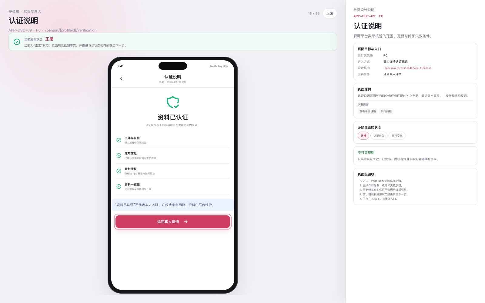

**P0 关键状态：** 认证失效

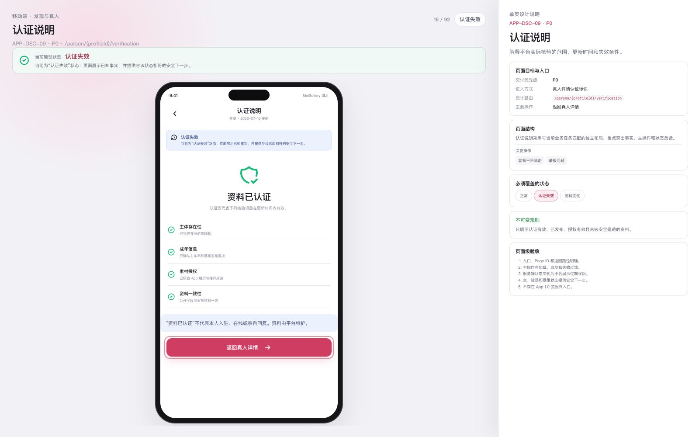

---

### 移动端 · 互动与历史

本组共 5 个页面。实现、接口、测试和缺陷均按 Page ID 追踪。

#### APP-INT-01 关注更新

**平台与模块：** 移动端 · 互动与历史　　**优先级：** P0　　**设计路由：** `/following`

**用户价值：** 聚合已关注真人的新公开内容，不暗示双向关系。

**适用角色：** 已登录观看者

**前置条件：** 用户已登录；目标真人资料仍可访问；操作额度和对象状态由服务端重新校验。

**进入路径：** 底部关注 Tab

**页面结构：** 关注更新按时间组织，不使用匹配、在线或关系暗示。

**详细交互：** 用户从“底部关注 Tab”进入。主要操作为“查看更新”，执行时显示处理中状态；服务端确认成功后刷新权威数据并可进入 APP-DSC-07「真人详情」。次要操作包括：筛选更新、取消关注。失败时保留已输入内容，展示可理解原因，并提供重试、返回或帮助入口。

**业务规则：** 喜欢、关注和收藏互相独立，不产生匹配、通知对方或双向关系。

**数据与权限：** 只读取当前账号范围内的必要数据；所有写操作均由服务端鉴权、校验并返回权威状态。

**页面状态：** 正常、首次空、无更新、资料下架

**Figma 最终稿映射：** `10｜Mobile Pages` → `APP-INT-01`，共 4 个需求状态；在 [Figma 最终设计文件](https://www.figma.com/design/LaNSwwGsznwcpV8msj7BQC/Peachmote-UI-%E5%80%9F%E9%89%B4%E5%AE%A1%E6%9F%A5%E6%9D%BF---MeiGallery) 中按 Page ID 定位。

**实现追踪：**

- 追踪键：`APP-INT-01 → PRD-FR-040,PRD-FR-041,PRD-FR-042 → SCP-FR-003 → F-06/VIR-FR-*`
- 产品需求：`PRD-FR-040`、`PRD-FR-041`、`PRD-FR-042`
- 发布范围：`SCP-FR-003`
- 非功能要求：`PRD-NFR-001`、`PRD-NFR-005`、`PRD-NFR-006`、`PRD-NFR-007`
- 产品级验收：`PRD-AC-003`
- 模块 PRD：[F-06 喜欢、关注、收藏与浏览历史](../ways-of-work/plan/real-person-discovery-platform/viewer-interactions-and-history/prd.md)（VIR-FR-*）

**开发验收：**

- 从“底部关注 Tab”能够进入，页面明确显示 APP-INT-01、页面名称、设计路由和返回路径。
- 主要操作“查看更新”具有处理中、成功和失败反馈，重复提交不会产生不可控的重复业务结果。
- 页面覆盖“正常、首次空、无更新、资料下架”状态，并在空、错误、受限或冲突时提供安全下一步。
- 服务端状态变化后不会继续展示过期权限、过期余额、失效认证或不可访问内容。
- 喜欢、关注和收藏互相独立，不产生匹配、通知对方或双向关系。
- UI 层、状态层、数据层和服务端契约不得使用页面展示名称替代稳定 ID、rank、entitlement 或状态枚举。
- 加载、空、错误、离线、无权限、对象失效和服务端状态变化必须按本页状态集合安全收敛。

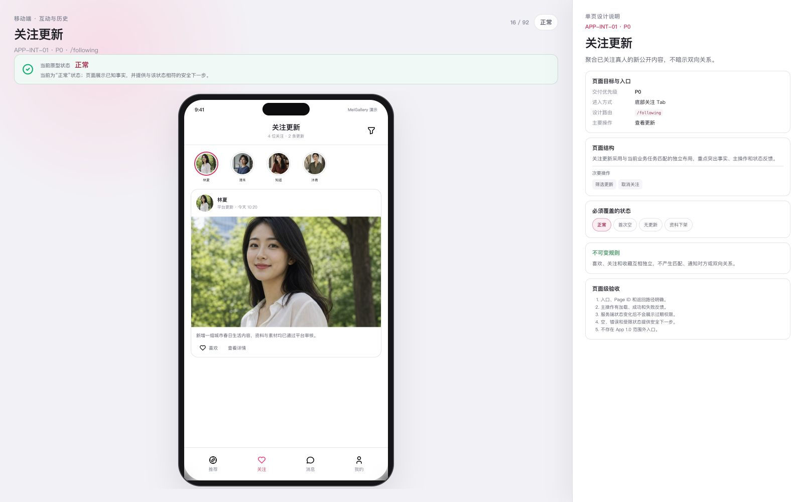

**P0 关键状态：** 资料下架

---

#### APP-INT-02 喜欢

**平台与模块：** 移动端 · 互动与历史　　**优先级：** P0　　**设计路由：** `/likes`

**用户价值：** 保存用户喜欢过的真人，支持独立撤销。

**适用角色：** 已登录观看者

**前置条件：** 用户已登录；目标真人资料仍可访问；操作额度和对象状态由服务端重新校验。

**进入路径：** 我的页面或互动入口

**页面结构：** 真人列表与移除、筛选或解除动作并列，资料不可用时解释原因。

**详细交互：** 用户从“我的页面或互动入口”进入。主要操作为“查看真人”，执行时显示处理中状态；服务端确认成功后刷新权威数据并可进入 APP-DSC-07「真人详情」。次要操作包括：取消喜欢、筛选。失败时保留已输入内容，展示可理解原因，并提供重试、返回或帮助入口。

**业务规则：** 喜欢、关注和收藏互相独立，不产生匹配、通知对方或双向关系。

**数据与权限：** 只读取当前账号范围内的必要数据；所有写操作均由服务端鉴权、校验并返回权威状态。

**页面状态：** 正常、空、资料不可用

**Figma 最终稿映射：** `10｜Mobile Pages` → `APP-INT-02`，共 3 个需求状态；在 [Figma 最终设计文件](https://www.figma.com/design/LaNSwwGsznwcpV8msj7BQC/Peachmote-UI-%E5%80%9F%E9%89%B4%E5%AE%A1%E6%9F%A5%E6%9D%BF---MeiGallery) 中按 Page ID 定位。

**实现追踪：**

- 追踪键：`APP-INT-02 → PRD-FR-040,PRD-FR-041,PRD-FR-042 → SCP-FR-003 → F-06/VIR-FR-*`
- 产品需求：`PRD-FR-040`、`PRD-FR-041`、`PRD-FR-042`
- 发布范围：`SCP-FR-003`
- 非功能要求：`PRD-NFR-001`、`PRD-NFR-005`、`PRD-NFR-006`、`PRD-NFR-007`
- 产品级验收：`PRD-AC-003`
- 模块 PRD：[F-06 喜欢、关注、收藏与浏览历史](../ways-of-work/plan/real-person-discovery-platform/viewer-interactions-and-history/prd.md)（VIR-FR-*）

**开发验收：**

- 从“我的页面或互动入口”能够进入，页面明确显示 APP-INT-02、页面名称、设计路由和返回路径。
- 主要操作“查看真人”具有处理中、成功和失败反馈，重复提交不会产生不可控的重复业务结果。
- 页面覆盖“正常、空、资料不可用”状态，并在空、错误、受限或冲突时提供安全下一步。
- 服务端状态变化后不会继续展示过期权限、过期余额、失效认证或不可访问内容。
- 喜欢、关注和收藏互相独立，不产生匹配、通知对方或双向关系。
- UI 层、状态层、数据层和服务端契约不得使用页面展示名称替代稳定 ID、rank、entitlement 或状态枚举。
- 加载、空、错误、离线、无权限、对象失效和服务端状态变化必须按本页状态集合安全收敛。

**P0 关键状态：** 资料不可用

---

#### APP-INT-03 收藏夹

**平台与模块：** 移动端 · 互动与历史　　**优先级：** P1　　**设计路由：** `/favorites`

**用户价值：** 以文件夹管理收藏的真人资料，不形成关系状态。

**适用角色：** 已登录观看者

**前置条件：** 用户已登录；目标真人资料仍可访问；操作额度和对象状态由服务端重新校验。

**进入路径：** 我的页面或详情收藏动作

**页面结构：** 收藏夹、额度和管理动作按文件夹层级呈现。

**详细交互：** 用户从“我的页面或详情收藏动作”进入。主要操作为“打开收藏夹”，执行时显示处理中状态；服务端确认成功后刷新权威数据并可进入 APP-INT-04「收藏夹详情」。次要操作包括：新建文件夹、重命名、删除。失败时保留已输入内容，展示可理解原因，并提供重试、返回或帮助入口。

**业务规则：** 喜欢、关注和收藏互相独立，不产生匹配、通知对方或双向关系。

**数据与权限：** 只读取当前账号范围内的必要数据；所有写操作均由服务端鉴权、校验并返回权威状态。

**页面状态：** 正常、空、额度满、离线

**Figma 最终稿映射：** `10｜Mobile Pages` → `APP-INT-03`，共 4 个需求状态；在 [Figma 最终设计文件](https://www.figma.com/design/LaNSwwGsznwcpV8msj7BQC/Peachmote-UI-%E5%80%9F%E9%89%B4%E5%AE%A1%E6%9F%A5%E6%9D%BF---MeiGallery) 中按 Page ID 定位。

**实现追踪：**

- 追踪键：`APP-INT-03 → PRD-FR-040,PRD-FR-041,PRD-FR-042 → SCP-FR-003 → F-06/VIR-FR-*`
- 产品需求：`PRD-FR-040`、`PRD-FR-041`、`PRD-FR-042`
- 发布范围：`SCP-FR-003`
- 非功能要求：`PRD-NFR-001`、`PRD-NFR-005`、`PRD-NFR-006`、`PRD-NFR-007`
- 产品级验收：`PRD-AC-003`
- 模块 PRD：[F-06 喜欢、关注、收藏与浏览历史](../ways-of-work/plan/real-person-discovery-platform/viewer-interactions-and-history/prd.md)（VIR-FR-*）

**开发验收：**

- 从“我的页面或详情收藏动作”能够进入，页面明确显示 APP-INT-03、页面名称、设计路由和返回路径。
- 主要操作“打开收藏夹”具有处理中、成功和失败反馈，重复提交不会产生不可控的重复业务结果。
- 页面覆盖“正常、空、额度满、离线”状态，并在空、错误、受限或冲突时提供安全下一步。
- 服务端状态变化后不会继续展示过期权限、过期余额、失效认证或不可访问内容。
- 喜欢、关注和收藏互相独立，不产生匹配、通知对方或双向关系。
- UI 层、状态层、数据层和服务端契约不得使用页面展示名称替代稳定 ID、rank、entitlement 或状态枚举。
- 加载、空、错误、离线、无权限、对象失效和服务端状态变化必须按本页状态集合安全收敛。

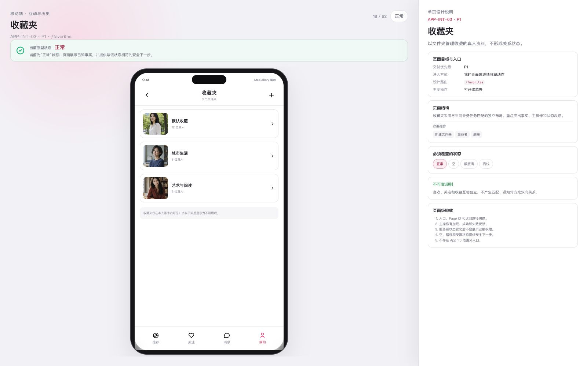

---

#### APP-INT-04 收藏夹详情

**平台与模块：** 移动端 · 互动与历史　　**优先级：** P1　　**设计路由：** `/favorites/{folderId}`

**用户价值：** 展示文件夹内真人并支持移动或移除。

**适用角色：** 已登录观看者

**前置条件：** 用户已登录；目标真人资料仍可访问；操作额度和对象状态由服务端重新校验。

**进入路径：** 收藏夹列表

**页面结构：** 真人列表与移除、筛选或解除动作并列，资料不可用时解释原因。

**详细交互：** 用户从“收藏夹列表”进入。主要操作为“查看真人”，执行时显示处理中状态；服务端确认成功后刷新权威数据并可进入 APP-DSC-07「真人详情」。次要操作包括：移动、移除、编辑名称。失败时保留已输入内容，展示可理解原因，并提供重试、返回或帮助入口。

**业务规则：** 喜欢、关注和收藏互相独立，不产生匹配、通知对方或双向关系。

**数据与权限：** 只读取当前账号范围内的必要数据；所有写操作均由服务端鉴权、校验并返回权威状态。

**页面状态：** 正常、文件夹已删除、资料下架

**Figma 最终稿映射：** `10｜Mobile Pages` → `APP-INT-04`，共 3 个需求状态；在 [Figma 最终设计文件](https://www.figma.com/design/LaNSwwGsznwcpV8msj7BQC/Peachmote-UI-%E5%80%9F%E9%89%B4%E5%AE%A1%E6%9F%A5%E6%9D%BF---MeiGallery) 中按 Page ID 定位。

**实现追踪：**

- 追踪键：`APP-INT-04 → PRD-FR-040,PRD-FR-041,PRD-FR-042 → SCP-FR-003 → F-06/VIR-FR-*`
- 产品需求：`PRD-FR-040`、`PRD-FR-041`、`PRD-FR-042`
- 发布范围：`SCP-FR-003`
- 非功能要求：`PRD-NFR-001`、`PRD-NFR-005`、`PRD-NFR-006`、`PRD-NFR-007`
- 产品级验收：`PRD-AC-003`
- 模块 PRD：[F-06 喜欢、关注、收藏与浏览历史](../ways-of-work/plan/real-person-discovery-platform/viewer-interactions-and-history/prd.md)（VIR-FR-*）

**开发验收：**

- 从“收藏夹列表”能够进入，页面明确显示 APP-INT-04、页面名称、设计路由和返回路径。
- 主要操作“查看真人”具有处理中、成功和失败反馈，重复提交不会产生不可控的重复业务结果。
- 页面覆盖“正常、文件夹已删除、资料下架”状态，并在空、错误、受限或冲突时提供安全下一步。
- 服务端状态变化后不会继续展示过期权限、过期余额、失效认证或不可访问内容。
- 喜欢、关注和收藏互相独立，不产生匹配、通知对方或双向关系。
- UI 层、状态层、数据层和服务端契约不得使用页面展示名称替代稳定 ID、rank、entitlement 或状态枚举。
- 加载、空、错误、离线、无权限、对象失效和服务端状态变化必须按本页状态集合安全收敛。

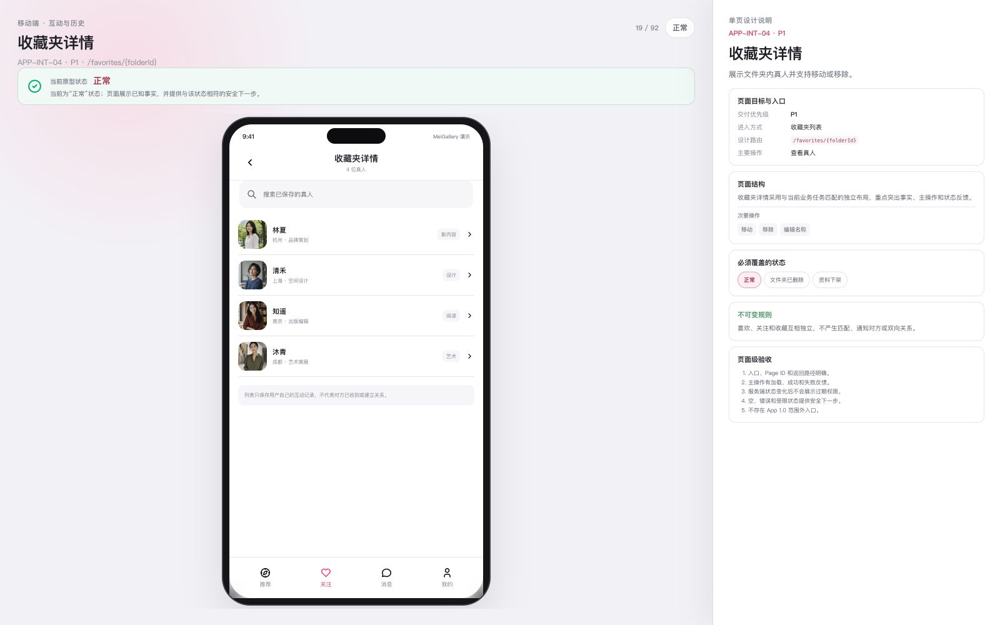

---

#### APP-INT-05 浏览历史

**平台与模块：** 移动端 · 互动与历史　　**优先级：** P1　　**设计路由：** `/history`

**用户价值：** 按时间展示浏览记录，并允许逐条或全部清除。

**适用角色：** 已登录观看者

**前置条件：** 用户已登录；目标真人资料仍可访问；操作额度和对象状态由服务端重新校验。

**进入路径：** 我的页面

**页面结构：** 按时间分组浏览记录，并提供单条清除和全部清除。

**详细交互：** 用户从“我的页面”进入。主要操作为“查看历史详情”，执行时显示处理中状态；服务端确认成功后刷新权威数据并可进入 APP-DSC-07「真人详情」。次要操作包括：删除单条、全部清除。失败时保留已输入内容，展示可理解原因，并提供重试、返回或帮助入口。

**业务规则：** 喜欢、关注和收藏互相独立，不产生匹配、通知对方或双向关系。

**数据与权限：** 只读取当前账号范围内的必要数据；所有写操作均由服务端鉴权、校验并返回权威状态。

**页面状态：** 正常、空、保留到期、清除失败

**Figma 最终稿映射：** `10｜Mobile Pages` → `APP-INT-05`，共 4 个需求状态；在 [Figma 最终设计文件](https://www.figma.com/design/LaNSwwGsznwcpV8msj7BQC/Peachmote-UI-%E5%80%9F%E9%89%B4%E5%AE%A1%E6%9F%A5%E6%9D%BF---MeiGallery) 中按 Page ID 定位。

**实现追踪：**

- 追踪键：`APP-INT-05 → PRD-FR-040,PRD-FR-041,PRD-FR-042 → SCP-FR-003 → F-06/VIR-FR-*`
- 产品需求：`PRD-FR-040`、`PRD-FR-041`、`PRD-FR-042`
- 发布范围：`SCP-FR-003`
- 非功能要求：`PRD-NFR-001`、`PRD-NFR-005`、`PRD-NFR-006`、`PRD-NFR-007`
- 产品级验收：`PRD-AC-003`
- 模块 PRD：[F-06 喜欢、关注、收藏与浏览历史](../ways-of-work/plan/real-person-discovery-platform/viewer-interactions-and-history/prd.md)（VIR-FR-*）

**开发验收：**

- 从“我的页面”能够进入，页面明确显示 APP-INT-05、页面名称、设计路由和返回路径。
- 主要操作“查看历史详情”具有处理中、成功和失败反馈，重复提交不会产生不可控的重复业务结果。
- 页面覆盖“正常、空、保留到期、清除失败”状态，并在空、错误、受限或冲突时提供安全下一步。
- 服务端状态变化后不会继续展示过期权限、过期余额、失效认证或不可访问内容。
- 喜欢、关注和收藏互相独立，不产生匹配、通知对方或双向关系。
- UI 层、状态层、数据层和服务端契约不得使用页面展示名称替代稳定 ID、rank、entitlement 或状态枚举。
- 加载、空、错误、离线、无权限、对象失效和服务端状态变化必须按本页状态集合安全收敛。

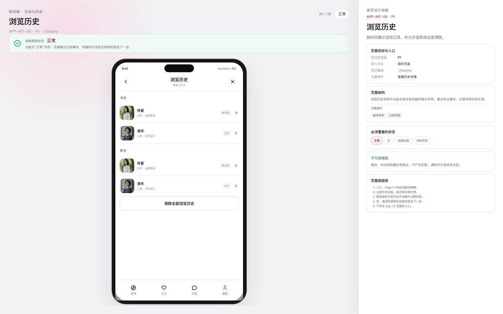

---

### 移动端 · 平台话题与通知

本组共 6 个页面。实现、接口、测试和缺陷均按 Page ID 追踪。

#### APP-MSG-01 平台话题

**平台与模块：** 移动端 · 平台话题与通知　　**优先级：** P0　　**设计路由：** `/messages`

**用户价值：** 列出由平台运营接收的话题会话，明确接收主体、未读和限制状态。

**适用角色：** 有效会员、受限状态下的已登录观看者

**前置条件：** 用户已登录；发送或新建话题时具有有效会员资格；目标资料与会话未被冻结或关闭。

**进入路径：** 底部消息 Tab

**页面结构：** 平台接收主体、未读、限制状态和话题摘要组成会话列表。

**详细交互：** 用户从“底部消息 Tab”进入。主要操作为“打开话题”，执行时显示处理中状态；服务端确认成功后刷新权威数据并可进入 APP-MSG-03「话题会话」。次要操作包括：筛选未读、静音。失败时保留已输入内容，展示可理解原因，并提供重试、返回或帮助入口。

**业务规则：** 话题由平台管理员接收与处理；只有有效会员可以新建和发送。

**数据与权限：** 读取当前账号可见的话题摘要或会话；发送动作由服务端校验会员、会话状态、额度和内容安全策略。

**页面状态：** 正常、首次空、离线、会话受限

**Figma 最终稿映射：** `10｜Mobile Pages` → `APP-MSG-01`，共 4 个需求状态；在 [Figma 最终设计文件](https://www.figma.com/design/LaNSwwGsznwcpV8msj7BQC/Peachmote-UI-%E5%80%9F%E9%89%B4%E5%AE%A1%E6%9F%A5%E6%9D%BF---MeiGallery) 中按 Page ID 定位。

**实现追踪：**

- 追踪键：`APP-MSG-01 → PRD-FR-050,PRD-FR-051,PRD-FR-052,PRD-FR-053,PRD-FR-054,PRD-FR-055,PRD-FR-056 → SCP-FR-005,SCP-FR-006,SCP-FR-007,SCP-FR-008,SCP-FR-015 → F-07、A-06/MOP-FR-*`
- 产品需求：`PRD-FR-050`、`PRD-FR-051`、`PRD-FR-052`、`PRD-FR-053`、`PRD-FR-054`、`PRD-FR-055`、`PRD-FR-056`
- 发布范围：`SCP-FR-005`、`SCP-FR-006`、`SCP-FR-007`、`SCP-FR-008`、`SCP-FR-015`
- 非功能要求：`PRD-NFR-001`、`PRD-NFR-002`、`PRD-NFR-003`、`PRD-NFR-005`、`PRD-NFR-006`、`PRD-NFR-007`、`PRD-NFR-008`
- 产品级验收：`PRD-AC-004`、`PRD-AC-005`、`PRD-AC-011`
- 模块 PRD：[F-07、A-06 会员平台话题、实时会话与运营工作台](../ways-of-work/plan/real-person-discovery-platform/member-messaging-and-managed-operations/prd.md)（MOP-FR-*）

**开发验收：**

- 从“底部消息 Tab”能够进入，页面明确显示 APP-MSG-01、页面名称、设计路由和返回路径。
- 主要操作“打开话题”具有处理中、成功和失败反馈，重复提交不会产生不可控的重复业务结果。
- 页面覆盖“正常、首次空、离线、会话受限”状态，并在空、错误、受限或冲突时提供安全下一步。
- 服务端状态变化后不会继续展示过期权限、过期余额、失效认证或不可访问内容。
- 话题由平台管理员接收与处理；只有有效会员可以新建和发送。
- UI 层、状态层、数据层和服务端契约不得使用页面展示名称替代稳定 ID、rank、entitlement 或状态枚举。
- 加载、空、错误、离线、无权限、对象失效和服务端状态变化必须按本页状态集合安全收敛。

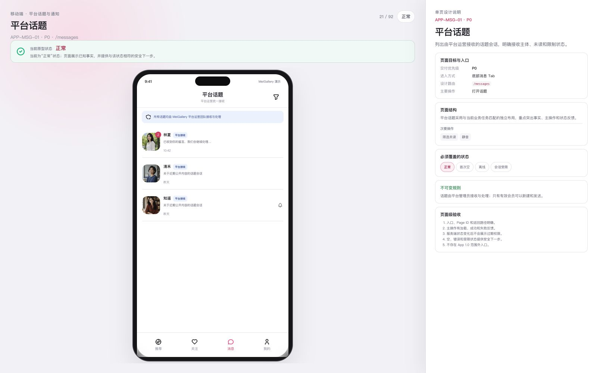

**P0 关键状态：** 会话受限

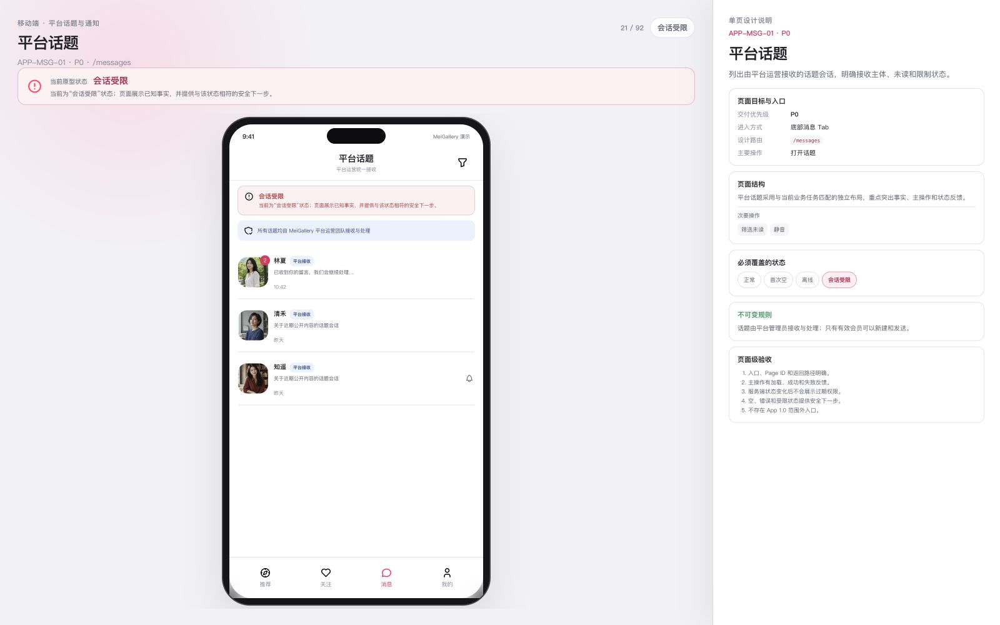

---

#### APP-MSG-02 发起话题确认

**平台与模块：** 移动端 · 平台话题与通知　　**优先级：** P0　　**设计路由：** `/messages/start/{profileId}`

**用户价值：** 在创建话题前披露平台接收、会员资格、额度和不保证回复。

**适用角色：** 有效会员、受限状态下的已登录观看者

**前置条件：** 用户已登录；发送或新建话题时具有有效会员资格；目标资料与会话未被冻结或关闭。

**进入路径：** 真人详情“发起话题”按钮

**页面结构：** 在创建话题前集中披露会员资格、额度、接收主体和不保证回复。

**详细交互：** 用户从“真人详情“发起话题”按钮”进入。主要操作为“确认发起话题”，执行时显示处理中状态；服务端确认成功后刷新权威数据并可进入 APP-MSG-03「话题会话」。次要操作包括：查看会员、取消。失败时保留已输入内容，展示可理解原因，并提供重试、返回或帮助入口。

**业务规则：** 话题由平台管理员接收与处理；只有有效会员可以新建和发送。

**数据与权限：** 读取当前账号可见的话题摘要或会话；发送动作由服务端校验会员、会话状态、额度和内容安全策略。

**页面状态：** 正常、无会员、额度尽、资料失效、已有话题

**Figma 最终稿映射：** `10｜Mobile Pages` → `APP-MSG-02`，共 5 个需求状态；在 [Figma 最终设计文件](https://www.figma.com/design/LaNSwwGsznwcpV8msj7BQC/Peachmote-UI-%E5%80%9F%E9%89%B4%E5%AE%A1%E6%9F%A5%E6%9D%BF---MeiGallery) 中按 Page ID 定位。

**实现追踪：**

- 追踪键：`APP-MSG-02 → PRD-FR-050,PRD-FR-051,PRD-FR-052,PRD-FR-053,PRD-FR-054,PRD-FR-055,PRD-FR-056 → SCP-FR-005,SCP-FR-006,SCP-FR-007,SCP-FR-008,SCP-FR-015 → F-07、A-06/MOP-FR-*`
- 产品需求：`PRD-FR-050`、`PRD-FR-051`、`PRD-FR-052`、`PRD-FR-053`、`PRD-FR-054`、`PRD-FR-055`、`PRD-FR-056`
- 发布范围：`SCP-FR-005`、`SCP-FR-006`、`SCP-FR-007`、`SCP-FR-008`、`SCP-FR-015`
- 非功能要求：`PRD-NFR-001`、`PRD-NFR-002`、`PRD-NFR-003`、`PRD-NFR-005`、`PRD-NFR-006`、`PRD-NFR-007`、`PRD-NFR-008`
- 产品级验收：`PRD-AC-004`、`PRD-AC-005`、`PRD-AC-011`
- 模块 PRD：[F-07、A-06 会员平台话题、实时会话与运营工作台](../ways-of-work/plan/real-person-discovery-platform/member-messaging-and-managed-operations/prd.md)（MOP-FR-*）

**开发验收：**

- 从“真人详情“发起话题”按钮”能够进入，页面明确显示 APP-MSG-02、页面名称、设计路由和返回路径。
- 主要操作“确认发起话题”具有处理中、成功和失败反馈，重复提交不会产生不可控的重复业务结果。
- 页面覆盖“正常、无会员、额度尽、资料失效、已有话题”状态，并在空、错误、受限或冲突时提供安全下一步。
- 服务端状态变化后不会继续展示过期权限、过期余额、失效认证或不可访问内容。
- 话题由平台管理员接收与处理；只有有效会员可以新建和发送。
- UI 层、状态层、数据层和服务端契约不得使用页面展示名称替代稳定 ID、rank、entitlement 或状态枚举。
- 加载、空、错误、离线、无权限、对象失效和服务端状态变化必须按本页状态集合安全收敛。

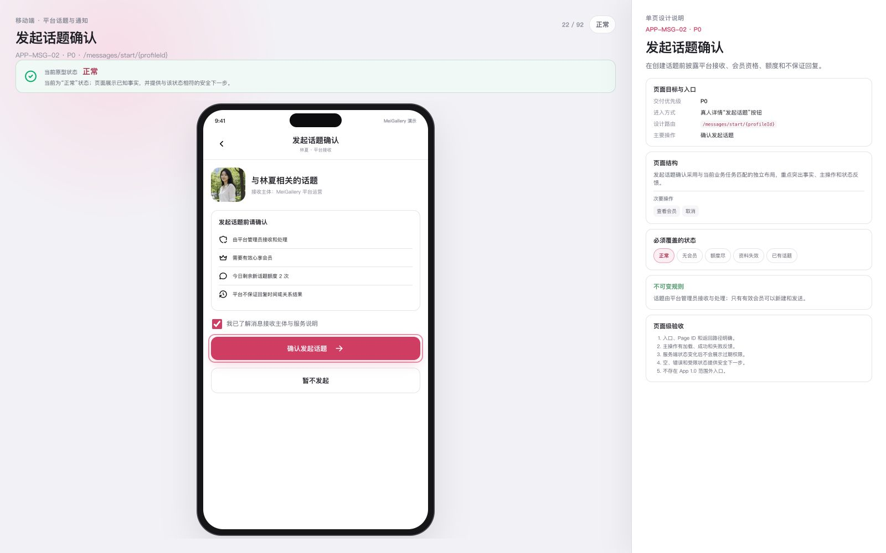

**P0 关键状态：** 无会员

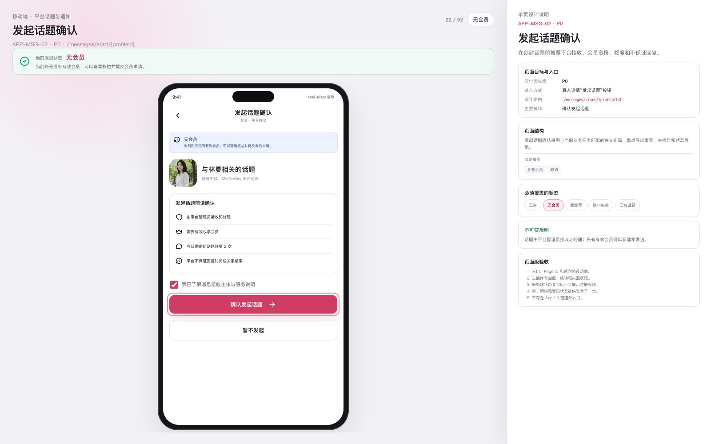

---

#### APP-MSG-03 话题会话

**平台与模块：** 移动端 · 平台话题与通知　　**优先级：** P0　　**设计路由：** `/messages/{conversationId}`

**用户价值：** 让有效会员发送文本消息，并持续披露由平台管理员接收和处理。

**适用角色：** 有效会员、受限状态下的已登录观看者

**前置条件：** 用户已登录；发送或新建话题时具有有效会员资格；目标资料与会话未被冻结或关闭。

**进入路径：** 平台话题列表或发起确认

**页面结构：** 接收主体固定置顶，消息线程、审核状态和输入区保持清晰分层。

**详细交互：** 用户从“平台话题列表或发起确认”进入。主要操作为“发送消息”，执行时显示处理中状态；服务端确认成功后刷新权威数据并可进入 APP-MSG-04「会话设置」。次要操作包括：表情、撤回、打开会话设置。失败时保留已输入内容，展示可理解原因，并提供重试、返回或帮助入口。

**业务规则：** 话题由平台管理员接收与处理；只有有效会员可以新建和发送。

**数据与权限：** 读取当前账号可见的话题摘要或会话；发送动作由服务端校验会员、会话状态、额度和内容安全策略。

**页面状态：** 正常、补拉、审核中、只读、冻结、关闭

**Figma 最终稿映射：** `10｜Mobile Pages` → `APP-MSG-03`，共 6 个需求状态；在 [Figma 最终设计文件](https://www.figma.com/design/LaNSwwGsznwcpV8msj7BQC/Peachmote-UI-%E5%80%9F%E9%89%B4%E5%AE%A1%E6%9F%A5%E6%9D%BF---MeiGallery) 中按 Page ID 定位。

**实现追踪：**

- 追踪键：`APP-MSG-03 → PRD-FR-050,PRD-FR-051,PRD-FR-052,PRD-FR-053,PRD-FR-054,PRD-FR-055,PRD-FR-056 → SCP-FR-005,SCP-FR-006,SCP-FR-007,SCP-FR-008,SCP-FR-015 → F-07、A-06/MOP-FR-*`
- 产品需求：`PRD-FR-050`、`PRD-FR-051`、`PRD-FR-052`、`PRD-FR-053`、`PRD-FR-054`、`PRD-FR-055`、`PRD-FR-056`
- 发布范围：`SCP-FR-005`、`SCP-FR-006`、`SCP-FR-007`、`SCP-FR-008`、`SCP-FR-015`
- 非功能要求：`PRD-NFR-001`、`PRD-NFR-002`、`PRD-NFR-003`、`PRD-NFR-005`、`PRD-NFR-006`、`PRD-NFR-007`、`PRD-NFR-008`
- 产品级验收：`PRD-AC-004`、`PRD-AC-005`、`PRD-AC-011`
- 模块 PRD：[F-07、A-06 会员平台话题、实时会话与运营工作台](../ways-of-work/plan/real-person-discovery-platform/member-messaging-and-managed-operations/prd.md)（MOP-FR-*）

**开发验收：**

- 从“平台话题列表或发起确认”能够进入，页面明确显示 APP-MSG-03、页面名称、设计路由和返回路径。
- 主要操作“发送消息”具有处理中、成功和失败反馈，重复提交不会产生不可控的重复业务结果。
- 页面覆盖“正常、补拉、审核中、只读、冻结、关闭”状态，并在空、错误、受限或冲突时提供安全下一步。
- 服务端状态变化后不会继续展示过期权限、过期余额、失效认证或不可访问内容。
- 话题由平台管理员接收与处理；只有有效会员可以新建和发送。
- UI 层、状态层、数据层和服务端契约不得使用页面展示名称替代稳定 ID、rank、entitlement 或状态枚举。
- 加载、空、错误、离线、无权限、对象失效和服务端状态变化必须按本页状态集合安全收敛。

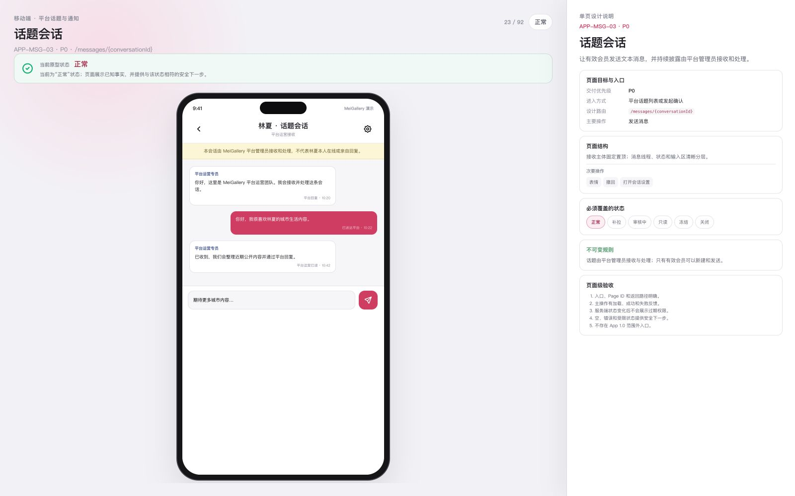

**P0 关键状态：** 冻结

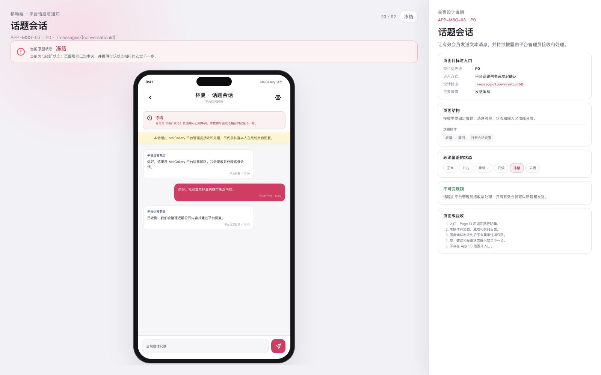

---

#### APP-MSG-04 会话设置

**平台与模块：** 移动端 · 平台话题与通知　　**优先级：** P0　　**设计路由：** `/messages/{conversationId}/details`

**用户价值：** 管理静音、举报、拉黑和关闭，同时重复展示接收主体。

**适用角色：** 有效会员、受限状态下的已登录观看者

**前置条件：** 用户已登录；发送或新建话题时具有有效会员资格；目标资料与会话未被冻结或关闭。

**进入路径：** 会话页右上角菜单

**页面结构：** 会话披露、静音、举报、拉黑和关闭动作按风险程度组织。

**详细交互：** 用户从“会话页右上角菜单”进入。主要操作为“保存会话设置”，执行时显示处理中状态；服务端确认成功后刷新权威数据并可进入 APP-MSG-01「平台话题」。次要操作包括：举报、拉黑、关闭会话。失败时保留已输入内容，展示可理解原因，并提供重试、返回或帮助入口。

**业务规则：** 话题由平台管理员接收与处理；只有有效会员可以新建和发送。

**数据与权限：** 读取当前账号可见的话题摘要或会话；发送动作由服务端校验会员、会话状态、额度和内容安全策略。

**页面状态：** 正常、操作失败、已关闭

**Figma 最终稿映射：** `10｜Mobile Pages` → `APP-MSG-04`，共 3 个需求状态；在 [Figma 最终设计文件](https://www.figma.com/design/LaNSwwGsznwcpV8msj7BQC/Peachmote-UI-%E5%80%9F%E9%89%B4%E5%AE%A1%E6%9F%A5%E6%9D%BF---MeiGallery) 中按 Page ID 定位。

**实现追踪：**

- 追踪键：`APP-MSG-04 → PRD-FR-050,PRD-FR-051,PRD-FR-052,PRD-FR-053,PRD-FR-054,PRD-FR-055,PRD-FR-056 → SCP-FR-005,SCP-FR-006,SCP-FR-007,SCP-FR-008,SCP-FR-015 → F-07、A-06/MOP-FR-*`
- 产品需求：`PRD-FR-050`、`PRD-FR-051`、`PRD-FR-052`、`PRD-FR-053`、`PRD-FR-054`、`PRD-FR-055`、`PRD-FR-056`
- 发布范围：`SCP-FR-005`、`SCP-FR-006`、`SCP-FR-007`、`SCP-FR-008`、`SCP-FR-015`
- 非功能要求：`PRD-NFR-001`、`PRD-NFR-002`、`PRD-NFR-003`、`PRD-NFR-005`、`PRD-NFR-006`、`PRD-NFR-007`、`PRD-NFR-008`
- 产品级验收：`PRD-AC-004`、`PRD-AC-005`、`PRD-AC-011`
- 模块 PRD：[F-07、A-06 会员平台话题、实时会话与运营工作台](../ways-of-work/plan/real-person-discovery-platform/member-messaging-and-managed-operations/prd.md)（MOP-FR-*）

**开发验收：**

- 从“会话页右上角菜单”能够进入，页面明确显示 APP-MSG-04、页面名称、设计路由和返回路径。
- 主要操作“保存会话设置”具有处理中、成功和失败反馈，重复提交不会产生不可控的重复业务结果。
- 页面覆盖“正常、操作失败、已关闭”状态，并在空、错误、受限或冲突时提供安全下一步。
- 服务端状态变化后不会继续展示过期权限、过期余额、失效认证或不可访问内容。
- 话题由平台管理员接收与处理；只有有效会员可以新建和发送。
- UI 层、状态层、数据层和服务端契约不得使用页面展示名称替代稳定 ID、rank、entitlement 或状态枚举。
- 加载、空、错误、离线、无权限、对象失效和服务端状态变化必须按本页状态集合安全收敛。

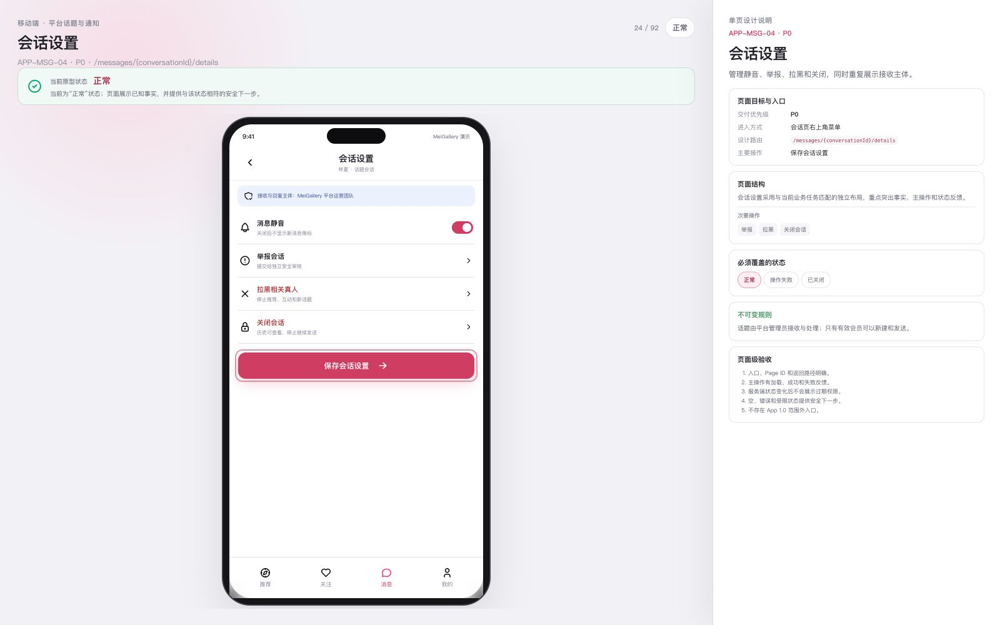

**P0 关键状态：** 操作失败

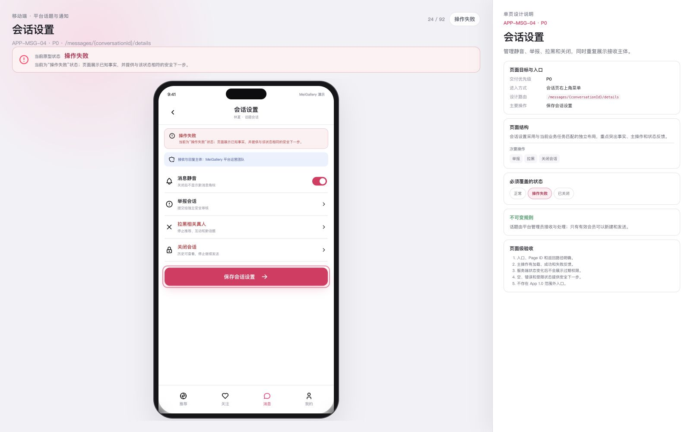

---

#### APP-MSG-05 通知列表

**平台与模块：** 移动端 · 平台话题与通知　　**优先级：** P0　　**设计路由：** `/notifications/{category}`

**用户价值：** 按消息、互动、会员金币、系统安全和营销分类展示站内通知。

**适用角色：** 已登录观看者、会员、受限账号（按服务端可见范围）

**前置条件：** 用户已登录；通知可见范围、必要性、已读状态和目标当前状态均由服务端确认。

**进入路径：** 推荐页铃铛或消息页通知入口

**页面结构：** 通知按业务分类和时间排列，必要通知与可选通知有明确差异。

**详细交互：** 用户从推荐页铃铛或消息页通知入口进入。首次进入、切换分类和回到前台均以 HTTP 拉取权威列表；实时事件只触发重新拉取。点击通知先提交幂等已读，再读取目标当前状态并进入 APP-MSG-06；“全部已读”成功后必须服务端回读，多设备差异不得仅靠本地清零。分页失败保留已有列表，实时离线保留缓存并提示新鲜度。

**业务规则：** HTTP 查询是通知权威，实时事件只触发刷新；账号、安全、会员、金币和数据权利等必要通知不可被营销开关屏蔽。

**数据与权限：** 只读取当前账号可见的用户安全通知；摘要不得包含完整话题正文、内部备注、证件、访问凭证或其他敏感数据。

**页面状态：** 正常、全部已读、首次空、分页失败、实时离线

**Figma 最终稿映射：** `10｜Mobile Pages` → `APP-MSG-05`，共 5 个需求状态；在 [Figma 最终设计文件](https://www.figma.com/design/LaNSwwGsznwcpV8msj7BQC/Peachmote-UI-%E5%80%9F%E9%89%B4%E5%AE%A1%E6%9F%A5%E6%9D%BF---MeiGallery) 中按 Page ID 定位。

**实现追踪：**

- 追踪键：`APP-MSG-05 → PRD-FR-080,PRD-FR-081 → SCP-FR-009 → F-12/NTF-FR-*`
- 产品需求：`PRD-FR-080`、`PRD-FR-081`
- 发布范围：`SCP-FR-009`
- 非功能要求：`PRD-NFR-001`、`PRD-NFR-002`、`PRD-NFR-003`、`PRD-NFR-005`、`PRD-NFR-006`、`PRD-NFR-007`、`PRD-NFR-008`
- 产品级验收：`PRD-AC-010`
- 模块 PRD：[F-12 站内通知中心与通知偏好](../ways-of-work/plan/real-person-discovery-platform/in-app-notification-center/prd.md)（NTF-FR-*）

**开发验收：**

- 从“推荐页铃铛或消息页通知入口”能够进入，页面明确显示 APP-MSG-05、页面名称、设计路由和返回路径。
- 主要操作“打开通知”具有处理中、成功和失败反馈，重复提交不会产生不可控的重复业务结果。
- 页面覆盖“正常、全部已读、首次空、分页失败、实时离线”状态，并在空、错误、受限或冲突时提供安全下一步。
- 服务端状态变化后不会继续展示过期权限、过期余额、失效认证或不可访问内容。
- HTTP 查询是通知权威，实时事件只触发刷新；账号、安全、会员、金币和数据权利等必要通知不可被营销开关屏蔽。
- UI 层、状态层、数据层和服务端契约不得使用页面展示名称替代稳定 ID、rank、entitlement 或状态枚举。
- 加载、空、错误、离线、无权限、对象失效和服务端状态变化必须按本页状态集合安全收敛。

**Figma 最终交互状态：** 本页已完成 5 个独立状态设计；以下 Frame、触发条件、操作结果和权威边界共同构成实现与验收基线。

**状态 1｜正常｜`145:52718`**

- 触发条件：进入通知中心或 HTTP 刷新成功，且当前分类存在可见通知。
- 关键交互：切换“全部/话题/互动/会员金币/安全”分类；点击通知先标记已读，再读取目标当前状态；“全部已读”只提交一次幂等请求。
- 预期结果：展示未读数量、分类、时间、摘要和必要通知标识；成功点击进入 APP-MSG-06，列表未读状态以服务端回读为准。
- 权威边界：HTTP 查询结果是列表与未读权威；实时事件只触发失效与重新拉取。
- [打开 Figma 交互原型](https://www.figma.com/proto/LaNSwwGsznwcpV8msj7BQC/Peachmote-UI-%E5%80%9F%E9%89%B4%E5%AE%A1%E6%9F%A5%E6%9D%BF---MeiGallery?node-id=145-52718&scaling=min-zoom&content-scaling=fixed&starting-point-node-id=145%3A52718&show-proto-sidebar=1&page-id=9%3A8)

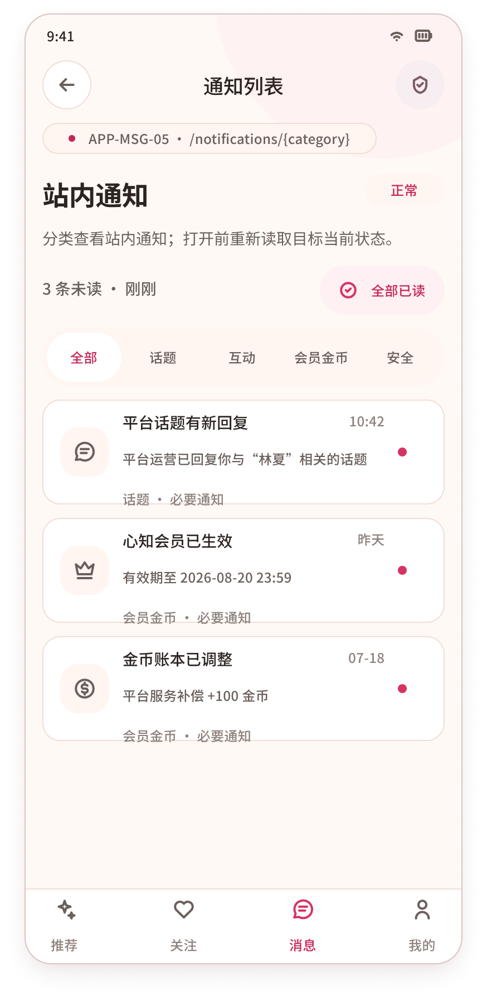

**状态 2｜全部已读｜`145:52918`**

- 触发条件：用户点击“全部已读”且服务端确认成功。
- 关键交互：按钮进入处理中并防重复提交；成功后清除当前账号的未读标记，多设备差异通过下一次 HTTP 回读收敛。
- 预期结果：显示“全部已读”反馈，卡片内容继续保留；失败时恢复按钮并保留原未读状态。
- 权威边界：客户端不得仅本地清零；以服务端 unreadCount 和 readAt 为准。
- [打开 Figma 交互原型](https://www.figma.com/proto/LaNSwwGsznwcpV8msj7BQC/Peachmote-UI-%E5%80%9F%E9%89%B4%E5%AE%A1%E6%9F%A5%E6%9D%BF---MeiGallery?node-id=145-52918&scaling=min-zoom&content-scaling=fixed&starting-point-node-id=145%3A52918&show-proto-sidebar=1&page-id=9%3A8)

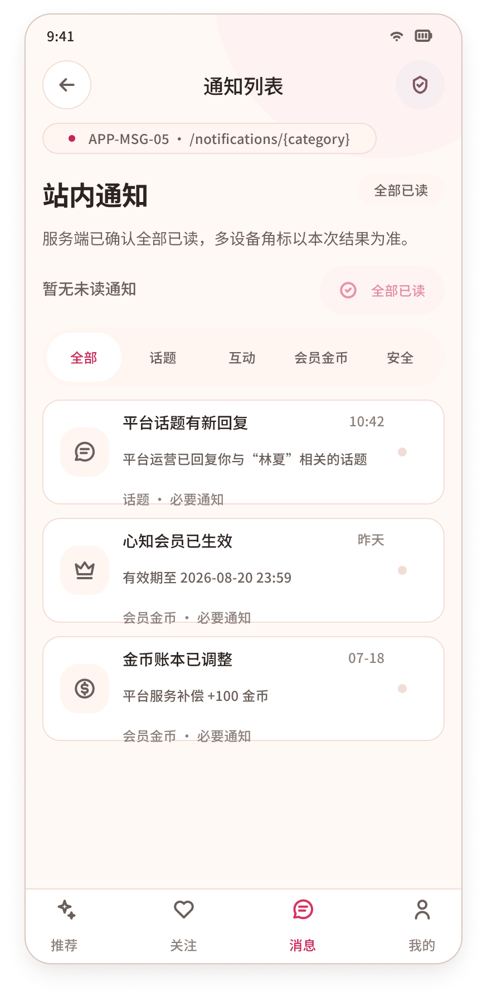

**状态 3｜首次空｜`145:53118`**

- 触发条件：当前分类查询成功但没有任何可见通知。
- 关键交互：用户可切回“全部”或查看其他分类；不展示虚构通知和占位营销内容。
- 预期结果：说明当前分类暂无通知并提供“查看全部通知”安全出口，底部导航仍可用。
- 权威边界：空状态来自成功响应的空集合，不与请求失败混淆。
- [打开 Figma 交互原型](https://www.figma.com/proto/LaNSwwGsznwcpV8msj7BQC/Peachmote-UI-%E5%80%9F%E9%89%B4%E5%AE%A1%E6%9F%A5%E6%9D%BF---MeiGallery?node-id=145-53118&scaling=min-zoom&content-scaling=fixed&starting-point-node-id=145%3A53118&show-proto-sidebar=1&page-id=9%3A8)

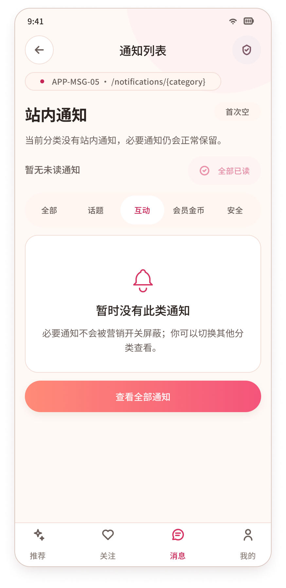

**状态 4｜分页失败｜`145:53287`**

- 触发条件：已有列表可用，但加载下一页或刷新增量失败。
- 关键交互：保留已加载通知和滚动位置；失败区块就近提供“重新加载后续通知”。
- 预期结果：用户仍可打开已有通知；重试复用原筛选条件和分页游标，不重复插入项目。
- 权威边界：失败页不得覆盖最近一次成功结果；新结果按稳定 notificationId 去重。
- [打开 Figma 交互原型](https://www.figma.com/proto/LaNSwwGsznwcpV8msj7BQC/Peachmote-UI-%E5%80%9F%E9%89%B4%E5%AE%A1%E6%9F%A5%E6%9D%BF---MeiGallery?node-id=145-53287&scaling=min-zoom&content-scaling=fixed&starting-point-node-id=145%3A53287&show-proto-sidebar=1&page-id=9%3A8)

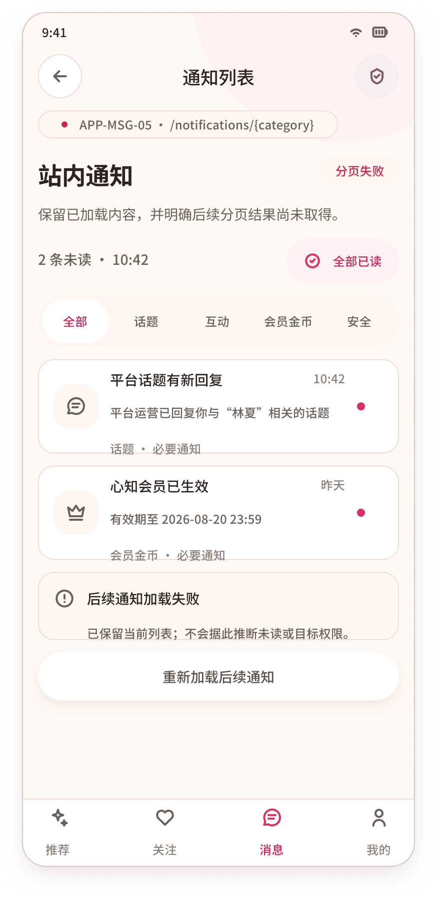

**状态 5｜实时离线｜`145:53483`**

- 触发条件：实时连接断开，但最近一次 HTTP 列表仍可展示。
- 关键交互：顶部显示非阻断提示；用户可手动重新连接并对账，仍可打开缓存列表中的通知。
- 预期结果：不宣称通知为最新；恢复后先 HTTP 补拉，再恢复实时监听。
- 权威边界：缓存只读，未读、目标状态和必要通知均需联网确认。
- [打开 Figma 交互原型](https://www.figma.com/proto/LaNSwwGsznwcpV8msj7BQC/Peachmote-UI-%E5%80%9F%E9%89%B4%E5%AE%A1%E6%9F%A5%E6%9D%BF---MeiGallery?node-id=145-53483&scaling=min-zoom&content-scaling=fixed&starting-point-node-id=145%3A53483&show-proto-sidebar=1&page-id=9%3A8)

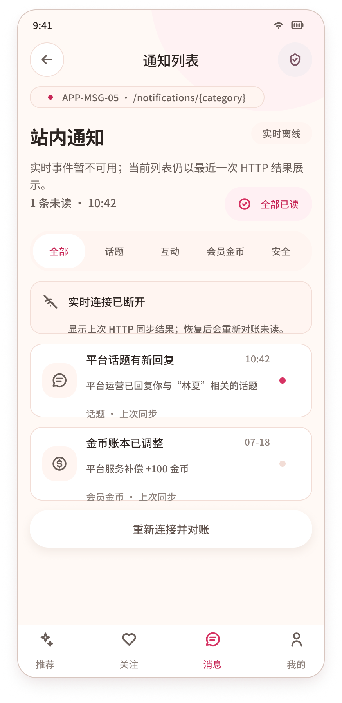

---

#### APP-MSG-06 通知详情

**平台与模块：** 移动端 · 平台话题与通知　　**优先级：** P1　　**设计路由：** `/notifications/detail/{notificationId}`

**用户价值：** 展示用户安全正文、事件时间、目标当前状态和可执行下一步。

**适用角色：** 已登录观看者、会员、受限账号（按服务端可见范围）

**前置条件：** 用户已登录；通知可见范围、必要性、已读状态和目标当前状态均由服务端确认。

**进入路径：** 通知列表

**页面结构：** 正文、事件时间、目标当前状态和安全下一步构成单一通知详情。

**详细交互：** 用户从通知列表进入。页面展示事件时间、用户安全正文、目标当前状态和当前可执行动作；点击主操作前重新校验目标、账号和 entitlement。目标失效时保留安全历史说明并返回列表；无权限时进入当前权益或安全出口；未知能力需要升级时不渲染不可执行入口。

**业务规则：** HTTP 查询是通知权威，实时事件只触发刷新；账号、安全、会员、金币和数据权利等必要通知不可被营销开关屏蔽。

**数据与权限：** 只读取当前账号可见的用户安全通知；摘要不得包含完整话题正文、内部备注、证件、访问凭证或其他敏感数据。

**页面状态：** 正常、目标失效、无权限、需要升级

**Figma 最终稿映射：** `10｜Mobile Pages` → `APP-MSG-06`，共 4 个需求状态；在 [Figma 最终设计文件](https://www.figma.com/design/LaNSwwGsznwcpV8msj7BQC/Peachmote-UI-%E5%80%9F%E9%89%B4%E5%AE%A1%E6%9F%A5%E6%9D%BF---MeiGallery) 中按 Page ID 定位。

**实现追踪：**

- 追踪键：`APP-MSG-06 → PRD-FR-080,PRD-FR-081 → SCP-FR-009 → F-12/NTF-FR-*`
- 产品需求：`PRD-FR-080`、`PRD-FR-081`
- 发布范围：`SCP-FR-009`
- 非功能要求：`PRD-NFR-001`、`PRD-NFR-002`、`PRD-NFR-003`、`PRD-NFR-005`、`PRD-NFR-006`、`PRD-NFR-007`、`PRD-NFR-008`
- 产品级验收：`PRD-AC-010`
- 模块 PRD：[F-12 站内通知中心与通知偏好](../ways-of-work/plan/real-person-discovery-platform/in-app-notification-center/prd.md)（NTF-FR-*）

**开发验收：**

- 从“通知列表”能够进入，页面明确显示 APP-MSG-06、页面名称、设计路由和返回路径。
- 主要操作“前往相关页面”具有处理中、成功和失败反馈，重复提交不会产生不可控的重复业务结果。
- 页面覆盖“正常、目标失效、无权限、需要升级”状态，并在空、错误、受限或冲突时提供安全下一步。
- 服务端状态变化后不会继续展示过期权限、过期余额、失效认证或不可访问内容。
- HTTP 查询是通知权威，实时事件只触发刷新；账号、安全、会员、金币和数据权利等必要通知不可被营销开关屏蔽。
- UI 层、状态层、数据层和服务端契约不得使用页面展示名称替代稳定 ID、rank、entitlement 或状态枚举。
- 加载、空、错误、离线、无权限、对象失效和服务端状态变化必须按本页状态集合安全收敛。

**Figma 最终交互状态：** 本页已完成 4 个独立状态设计；以下 Frame、触发条件、操作结果和权威边界共同构成实现与验收基线。

**状态 1｜正常｜`145:53849`**

- 触发条件：通知存在、当前账号可见，且通知目标仍可安全访问。
- 关键交互：展示事件时间、用户安全正文、接收主体说明和目标当前状态；主按钮按目标类型进入对应页面。
- 预期结果：进入目标前再次读取当前状态；平台话题通知明确由平台运营接收和处理。
- 权威边界：通知历史正文可读，但跳转能力以目标当前状态和当前 entitlement 为准。
- [打开 Figma 交互原型](https://www.figma.com/proto/LaNSwwGsznwcpV8msj7BQC/Peachmote-UI-%E5%80%9F%E9%89%B4%E5%AE%A1%E6%9F%A5%E6%9D%BF---MeiGallery?node-id=145-53849&scaling=min-zoom&content-scaling=fixed&starting-point-node-id=145%3A53849&show-proto-sidebar=1&page-id=9%3A8)

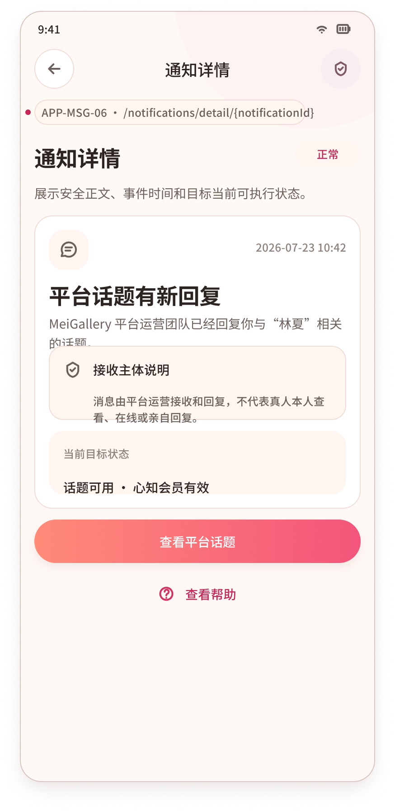

**状态 2｜目标失效｜`145:53999`**

- 触发条件：通知仍存在，但关联资料、会话、内容或业务对象已下架、删除或关闭。
- 关键交互：保留用户安全历史说明，不再执行原深链；提供返回通知列表和安全说明。
- 预期结果：不显示内部下架原因或访问凭证，不产生循环跳转。
- 权威边界：目标当前状态覆盖通知生成时的历史目标状态。
- [打开 Figma 交互原型](https://www.figma.com/proto/LaNSwwGsznwcpV8msj7BQC/Peachmote-UI-%E5%80%9F%E9%89%B4%E5%AE%A1%E6%9F%A5%E6%9D%BF---MeiGallery?node-id=145-53999&scaling=min-zoom&content-scaling=fixed&starting-point-node-id=145%3A53999&show-proto-sidebar=1&page-id=9%3A8)

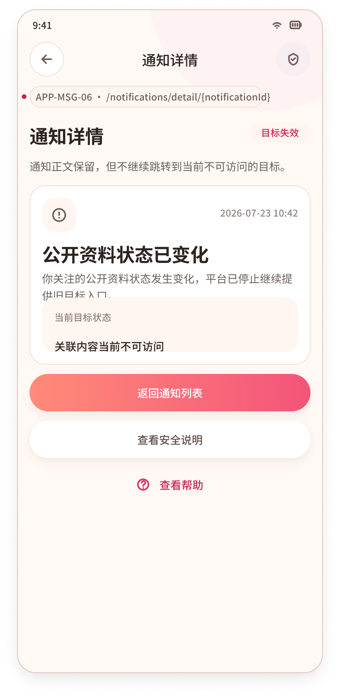

**状态 3｜无权限｜`145:54144`**

- 触发条件：账号、会员或对象权限下降，当前用户不再具备目标 entitlement。
- 关键交互：正文仅显示允许保留的历史摘要；主操作改为查看当前权益或返回列表。
- 预期结果：不因旧通知恢复过期能力，不把客户端缓存当作授权。
- 权威边界：服务端权限校验优先；客户端未知 entitlement 必须安全拒绝。
- [打开 Figma 交互原型](https://www.figma.com/proto/LaNSwwGsznwcpV8msj7BQC/Peachmote-UI-%E5%80%9F%E9%89%B4%E5%AE%A1%E6%9F%A5%E6%9D%BF---MeiGallery?node-id=145-54144&scaling=min-zoom&content-scaling=fixed&starting-point-node-id=145%3A54144&show-proto-sidebar=1&page-id=9%3A8)

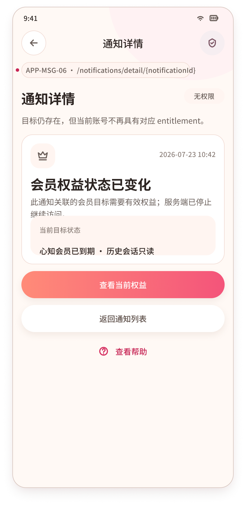

**状态 4｜需要升级｜`145:54288`**

- 触发条件：通知目标需要当前客户端尚未实现、但服务端已声明最低版本的新能力。
- 关键交互：展示版本能力说明和安全返回；仅在存在可信更新渠道时提供更新入口。
- 预期结果：旧版本不渲染未知功能、不崩溃、不扩大权限。
- 权威边界：最低客户端版本和能力兼容由服务端配置与 App 版本共同判定。
- [打开 Figma 交互原型](https://www.figma.com/proto/LaNSwwGsznwcpV8msj7BQC/Peachmote-UI-%E5%80%9F%E9%89%B4%E5%AE%A1%E6%9F%A5%E6%9D%BF---MeiGallery?node-id=145-54288&scaling=min-zoom&content-scaling=fixed&starting-point-node-id=145%3A54288&show-proto-sidebar=1&page-id=9%3A8)

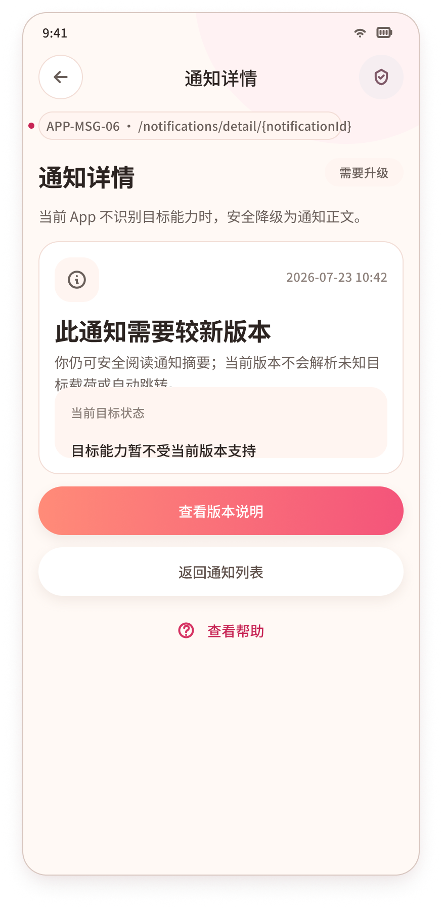

---

### 移动端 · 会员与金币

本组共 6 个页面。实现、接口、测试和缺陷均按 Page ID 追踪。

#### APP-MBR-01 五级会员目录

**平台与模块：** 移动端 · 会员与金币　　**优先级：** P0　　**设计路由：** `/membership`

**用户价值：** 展示心遇、心悦、心知、心契、心耀五级精确权益，并进入站内申请。

**适用角色：** 已登录观看者、会员

**前置条件：** 用户已登录；会员目录版本可用；申请结果不直接产生权限，必须等待管理员 grant 生效。

**进入路径：** 真人详情门槛或我的会员卡

**页面结构：** 五级会员、当前状态、精确权益和站内申请入口构成完整会员门槛。

**详细交互：** 用户从“真人详情门槛或我的会员卡”进入。主要操作为“提交会员申请”，执行时显示处理中状态；服务端确认成功后刷新权威数据并可进入 APP-MBR-03「会员申请与状态」。次要操作包括：切换等级、查看当前权益。失败时保留已输入内容，展示可理解原因，并提供重试、返回或帮助入口。

**业务规则：** App 1.0 不提供在线支付；提交申请不产生权限，管理员 grant 生效后才获得会员权益。

**数据与权限：** 读取会员目录、当前 grant 与申请状态；申请写入不等同于权限生效。

**页面状态：** 免费、已有申请、待生效、同步失败

**Figma 最终稿映射：** `10｜Mobile Pages` → `APP-MBR-01`，共 4 个需求状态；在 [Figma 最终设计文件](https://www.figma.com/design/LaNSwwGsznwcpV8msj7BQC/Peachmote-UI-%E5%80%9F%E9%89%B4%E5%AE%A1%E6%9F%A5%E6%9D%BF---MeiGallery) 中按 Page ID 定位。

**实现追踪：**

- 追踪键：`APP-MBR-01 → PRD-FR-060,PRD-FR-061,PRD-FR-062,PRD-FR-063,PRD-FR-064,PRD-FR-065,PRD-FR-066 → SCP-FR-004,SCP-FR-005,SCP-FR-005A,SCP-FR-005B → F-09、A-08/MBR-FR-*`
- 产品需求：`PRD-FR-060`、`PRD-FR-061`、`PRD-FR-062`、`PRD-FR-063`、`PRD-FR-064`、`PRD-FR-065`、`PRD-FR-066`
- 发布范围：`SCP-FR-004`、`SCP-FR-005`、`SCP-FR-005A`、`SCP-FR-005B`
- 非功能要求：`PRD-NFR-001`、`PRD-NFR-002`、`PRD-NFR-004`、`PRD-NFR-005`、`PRD-NFR-006`、`PRD-NFR-007`
- 产品级验收：`PRD-AC-004`、`PRD-AC-007`、`PRD-AC-009`、`PRD-AC-011`
- 模块 PRD：[F-09、A-08 心享会员、Entitlement 与管理员手动发放](../ways-of-work/plan/real-person-discovery-platform/membership-entitlements-and-manual-grants/prd.md)（MBR-FR-*）

**开发验收：**

- 从“真人详情门槛或我的会员卡”能够进入，页面明确显示 APP-MBR-01、页面名称、设计路由和返回路径。
- 主要操作“提交会员申请”具有处理中、成功和失败反馈，重复提交不会产生不可控的重复业务结果。
- 页面覆盖“免费、已有申请、待生效、同步失败”状态，并在空、错误、受限或冲突时提供安全下一步。
- 服务端状态变化后不会继续展示过期权限、过期余额、失效认证或不可访问内容。
- App 1.0 不提供在线支付；提交申请不产生权限，管理员 grant 生效后才获得会员权益。
- UI 层、状态层、数据层和服务端契约不得使用页面展示名称替代稳定 ID、rank、entitlement 或状态枚举。
- 加载、空、错误、离线、无权限、对象失效和服务端状态变化必须按本页状态集合安全收敛。

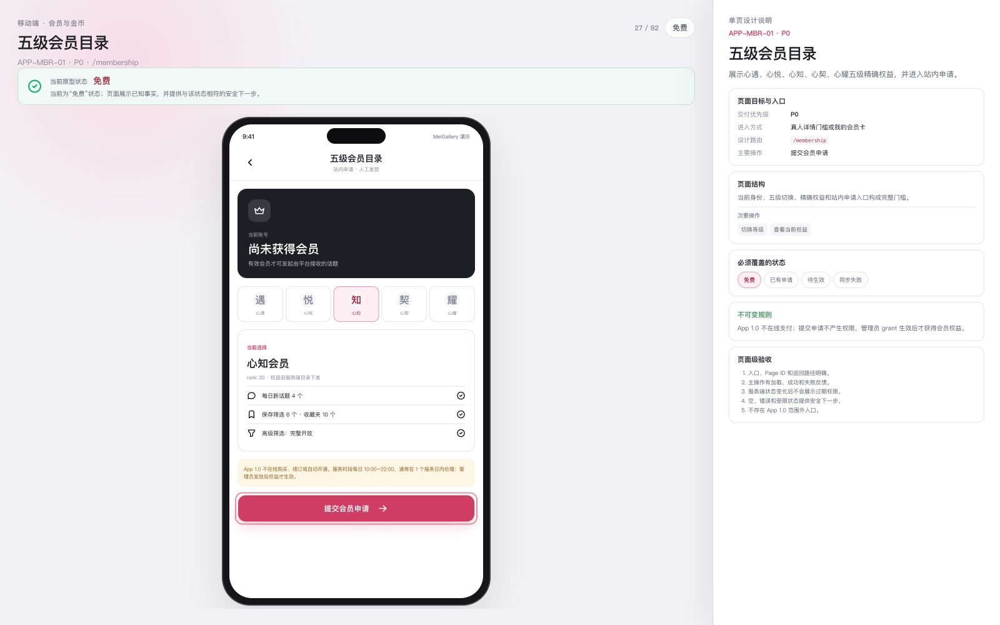

**P0 关键状态：** 同步失败

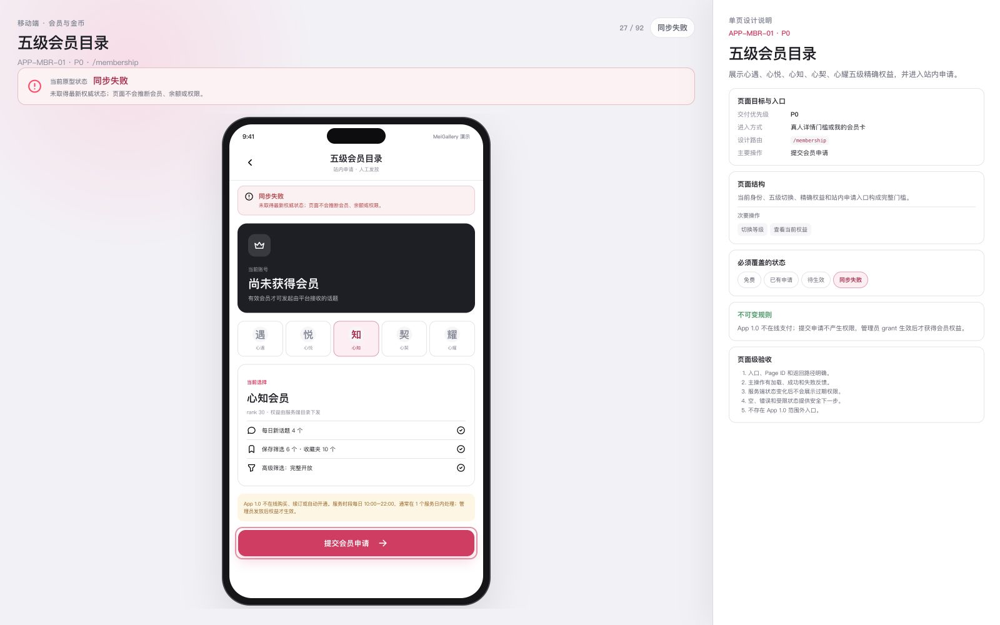

---

#### APP-MBR-02 当前权益

**平台与模块：** 移动端 · 会员与金币　　**优先级：** P0　　**设计路由：** `/membership/current`

**用户价值：** 展示当前等级、有效期、可用权益和当期额度事实。

**适用角色：** 已登录观看者、会员

**前置条件：** 用户已登录；会员目录版本可用；申请结果不直接产生权限，必须等待管理员 grant 生效。

**进入路径：** 我的会员卡或会员目录

**页面结构：** 等级、有效期、当期额度和可用权益以权威事实形式展示。

**详细交互：** 用户从“我的会员卡或会员目录”进入。主要操作为“查看权益说明”，执行时显示处理中状态；服务端确认成功后刷新权威数据并可进入 APP-MBR-03「会员申请与状态」。次要操作包括：查看会话额度、联系帮助。失败时保留已输入内容，展示可理解原因，并提供重试、返回或帮助入口。

**业务规则：** App 1.0 不提供在线支付；提交申请不产生权限，管理员 grant 生效后才获得会员权益。

**数据与权限：** 读取会员目录、当前 grant 与申请状态；申请写入不等同于权限生效。

**页面状态：** 正常、即将到期、到期、撤销、受限

**Figma 最终稿映射：** `10｜Mobile Pages` → `APP-MBR-02`，共 5 个需求状态；在 [Figma 最终设计文件](https://www.figma.com/design/LaNSwwGsznwcpV8msj7BQC/Peachmote-UI-%E5%80%9F%E9%89%B4%E5%AE%A1%E6%9F%A5%E6%9D%BF---MeiGallery) 中按 Page ID 定位。

**实现追踪：**

- 追踪键：`APP-MBR-02 → PRD-FR-060,PRD-FR-061,PRD-FR-062,PRD-FR-063,PRD-FR-064,PRD-FR-065,PRD-FR-066 → SCP-FR-004,SCP-FR-005,SCP-FR-005A,SCP-FR-005B → F-09、A-08/MBR-FR-*`
- 产品需求：`PRD-FR-060`、`PRD-FR-061`、`PRD-FR-062`、`PRD-FR-063`、`PRD-FR-064`、`PRD-FR-065`、`PRD-FR-066`
- 发布范围：`SCP-FR-004`、`SCP-FR-005`、`SCP-FR-005A`、`SCP-FR-005B`
- 非功能要求：`PRD-NFR-001`、`PRD-NFR-002`、`PRD-NFR-004`、`PRD-NFR-005`、`PRD-NFR-006`、`PRD-NFR-007`
- 产品级验收：`PRD-AC-004`、`PRD-AC-007`、`PRD-AC-009`、`PRD-AC-011`
- 模块 PRD：[F-09、A-08 心享会员、Entitlement 与管理员手动发放](../ways-of-work/plan/real-person-discovery-platform/membership-entitlements-and-manual-grants/prd.md)（MBR-FR-*）

**开发验收：**

- 从“我的会员卡或会员目录”能够进入，页面明确显示 APP-MBR-02、页面名称、设计路由和返回路径。
- 主要操作“查看权益说明”具有处理中、成功和失败反馈，重复提交不会产生不可控的重复业务结果。
- 页面覆盖“正常、即将到期、到期、撤销、受限”状态，并在空、错误、受限或冲突时提供安全下一步。
- 服务端状态变化后不会继续展示过期权限、过期余额、失效认证或不可访问内容。
- App 1.0 不提供在线支付；提交申请不产生权限，管理员 grant 生效后才获得会员权益。
- UI 层、状态层、数据层和服务端契约不得使用页面展示名称替代稳定 ID、rank、entitlement 或状态枚举。
- 加载、空、错误、离线、无权限、对象失效和服务端状态变化必须按本页状态集合安全收敛。

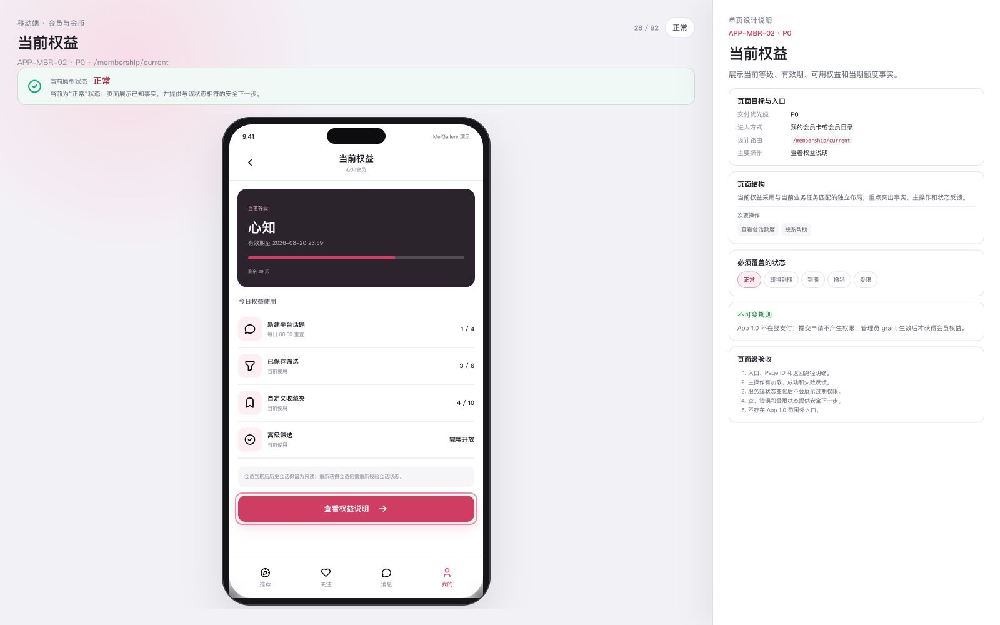

**P0 关键状态：** 受限

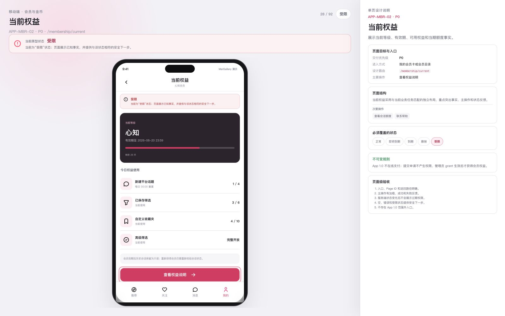

---

#### APP-MBR-03 会员申请与状态

**平台与模块：** 移动端 · 会员与金币　　**优先级：** P0　　**设计路由：** `/membership/apply`

**用户价值：** 提交期望等级和可选说明，查看人工处理状态；会员仅在管理员发放后生效。

**适用角色：** 已登录观看者、会员

**前置条件：** 用户已登录；会员目录版本可用；申请结果不直接产生权限，必须等待管理员 grant 生效。

**进入路径：** 会员目录或权益页

**页面结构：** 申请表单、人工处理说明、状态时间线和管理员发放结果形成闭环。

**详细交互：** 用户从“会员目录或权益页”进入。主要操作为“提交会员申请”，执行时显示处理中状态；服务端确认成功后刷新权威数据并可进入 APP-MBR-02「当前权益」。次要操作包括：取消申请、补充说明、联系平台。失败时保留已输入内容，展示可理解原因，并提供重试、返回或帮助入口。

**业务规则：** App 1.0 不提供在线支付；提交申请不产生权限，管理员 grant 生效后才获得会员权益。

**数据与权限：** 读取会员目录、当前 grant 与申请状态；申请写入不等同于权限生效。

**页面状态：** 未申请、已提交、处理中、待补充、已通过、已拒绝、已取消

**Figma 最终稿映射：** `10｜Mobile Pages` → `APP-MBR-03`，共 7 个需求状态；在 [Figma 最终设计文件](https://www.figma.com/design/LaNSwwGsznwcpV8msj7BQC/Peachmote-UI-%E5%80%9F%E9%89%B4%E5%AE%A1%E6%9F%A5%E6%9D%BF---MeiGallery) 中按 Page ID 定位。

**实现追踪：**

- 追踪键：`APP-MBR-03 → PRD-FR-060,PRD-FR-061,PRD-FR-062,PRD-FR-063,PRD-FR-064,PRD-FR-065,PRD-FR-066 → SCP-FR-004,SCP-FR-005,SCP-FR-005A,SCP-FR-005B → F-09、A-08/MBR-FR-*`
- 产品需求：`PRD-FR-060`、`PRD-FR-061`、`PRD-FR-062`、`PRD-FR-063`、`PRD-FR-064`、`PRD-FR-065`、`PRD-FR-066`
- 发布范围：`SCP-FR-004`、`SCP-FR-005`、`SCP-FR-005A`、`SCP-FR-005B`
- 非功能要求：`PRD-NFR-001`、`PRD-NFR-002`、`PRD-NFR-004`、`PRD-NFR-005`、`PRD-NFR-006`、`PRD-NFR-007`
- 产品级验收：`PRD-AC-004`、`PRD-AC-007`、`PRD-AC-009`、`PRD-AC-011`
- 模块 PRD：[F-09、A-08 心享会员、Entitlement 与管理员手动发放](../ways-of-work/plan/real-person-discovery-platform/membership-entitlements-and-manual-grants/prd.md)（MBR-FR-*）

**开发验收：**

- 从“会员目录或权益页”能够进入，页面明确显示 APP-MBR-03、页面名称、设计路由和返回路径。
- 主要操作“提交会员申请”具有处理中、成功和失败反馈，重复提交不会产生不可控的重复业务结果。
- 页面覆盖“未申请、已提交、处理中、待补充、已通过、已拒绝、已取消”状态，并在空、错误、受限或冲突时提供安全下一步。
- 服务端状态变化后不会继续展示过期权限、过期余额、失效认证或不可访问内容。
- App 1.0 不提供在线支付；提交申请不产生权限，管理员 grant 生效后才获得会员权益。
- UI 层、状态层、数据层和服务端契约不得使用页面展示名称替代稳定 ID、rank、entitlement 或状态枚举。
- 加载、空、错误、离线、无权限、对象失效和服务端状态变化必须按本页状态集合安全收敛。

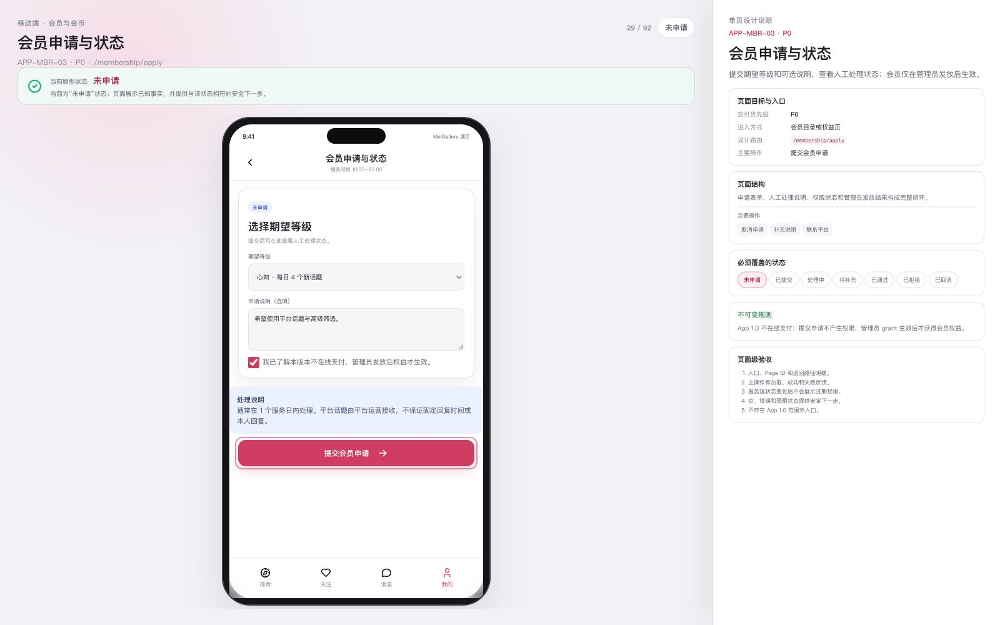

**P0 关键状态：** 已拒绝

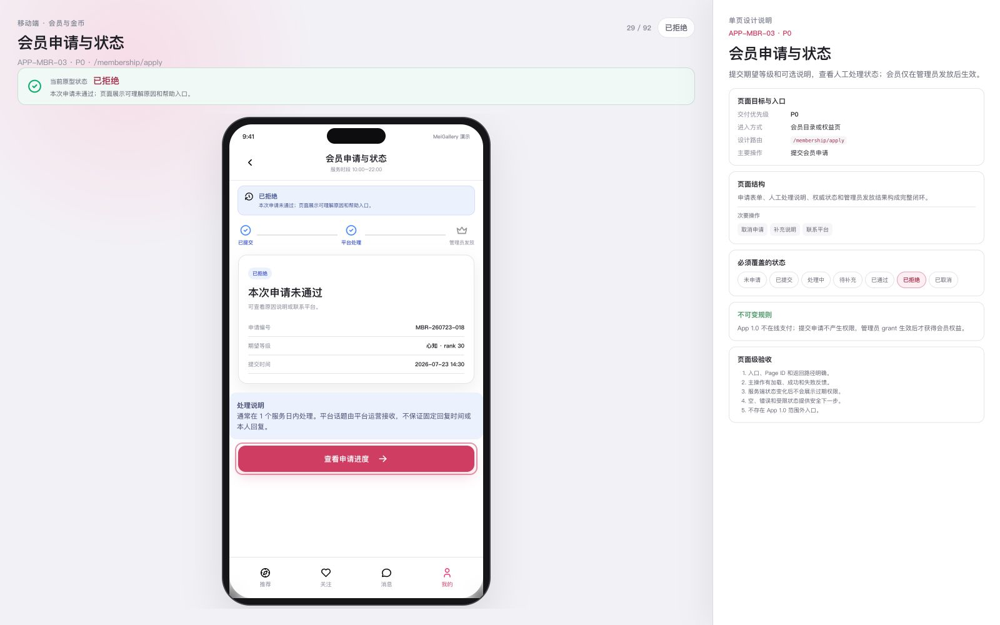

---

#### APP-WAL-01 金币钱包

**平台与模块：** 移动端 · 会员与金币　　**优先级：** P0　　**设计路由：** `/wallet`

**用户价值：** 只读展示余额、最后同步时间和管理员调整规则。

**适用角色：** 已登录观看者

**前置条件：** 用户已登录；余额与明细来自服务端有效分录投影，离线缓存只用于只读展示。

**进入路径：** 我的金币卡

**页面结构：** 余额、同步时间、只读规则和明细入口组成钱包首页。

**详细交互：** 用户从“我的金币卡”进入。页面先读取权威余额投影和最近有效分录，再展示同步时间与只读规则；点击“查看金币明细”进入 APP-WAL-02。离线时只展示带时间戳缓存，同步失败不把余额改成 0，也不生成补偿分录；页面始终不出现充值、消费、转账、兑换或提现入口。

**业务规则：** 金币不具现金价值；客户端只读余额和有效分录，不出现购买、充值、消费、兑换、转账或提现。

**数据与权限：** 只读取余额与有效分录；客户端不得直接修改余额，申诉只创建独立案件。

**页面状态：** 正常、空钱包、离线缓存、同步失败

**Figma 最终稿映射：** `10｜Mobile Pages` → `APP-WAL-01`，共 4 个需求状态；在 [Figma 最终设计文件](https://www.figma.com/design/LaNSwwGsznwcpV8msj7BQC/Peachmote-UI-%E5%80%9F%E9%89%B4%E5%AE%A1%E6%9F%A5%E6%9D%BF---MeiGallery) 中按 Page ID 定位。

**实现追踪：**

- 追踪键：`APP-WAL-01 → PRD-FR-070,PRD-FR-071,PRD-FR-074 → SCP-FR-010,SCP-FR-011 → F-10、A-10/WAL-FR-*`
- 产品需求：`PRD-FR-070`、`PRD-FR-071`、`PRD-FR-074`
- 发布范围：`SCP-FR-010`、`SCP-FR-011`
- 非功能要求：`PRD-NFR-001`、`PRD-NFR-002`、`PRD-NFR-005`、`PRD-NFR-006`、`PRD-NFR-007`
- 产品级验收：`PRD-AC-006`
- 模块 PRD：[F-10、A-10 金币钱包与管理员调币](../ways-of-work/plan/real-person-discovery-platform/wallet-ledger-and-admin-coin-adjustments/prd.md)（WAL-FR-*）

**开发验收：**

- 从“我的金币卡”能够进入，页面明确显示 APP-WAL-01、页面名称、设计路由和返回路径。
- 主要操作“查看金币明细”具有处理中、成功和失败反馈，重复提交不会产生不可控的重复业务结果。
- 页面覆盖“正常、空钱包、离线缓存、同步失败”状态，并在空、错误、受限或冲突时提供安全下一步。
- 服务端状态变化后不会继续展示过期权限、过期余额、失效认证或不可访问内容。
- 金币不具现金价值；客户端只读余额和有效分录，不出现购买、充值、消费、兑换、转账或提现。
- UI 层、状态层、数据层和服务端契约不得使用页面展示名称替代稳定 ID、rank、entitlement 或状态枚举。
- 加载、空、错误、离线、无权限、对象失效和服务端状态变化必须按本页状态集合安全收敛。

**Figma 最终交互状态：** 本页已完成 4 个独立状态设计；以下 Frame、触发条件、操作结果和权威边界共同构成实现与验收基线。

**状态 1｜正常｜`145:54433`**

- 触发条件：余额投影和最近有效分录同步成功。
- 关键交互：展示余额、最后同步时间、只读规则和最近分录；点击“查看金币明细”进入 APP-WAL-02。
- 预期结果：明确金币不具现金价值，页面不存在购买、充值、消费、兑换、转账或提现入口。
- 权威边界：余额来自有效分录投影；客户端不得直接修改或自行汇总覆盖。
- [打开 Figma 交互原型](https://www.figma.com/proto/LaNSwwGsznwcpV8msj7BQC/Peachmote-UI-%E5%80%9F%E9%89%B4%E5%AE%A1%E6%9F%A5%E6%9D%BF---MeiGallery?node-id=145-54433&scaling=min-zoom&content-scaling=fixed&starting-point-node-id=145%3A54433&show-proto-sidebar=1&page-id=9%3A8)

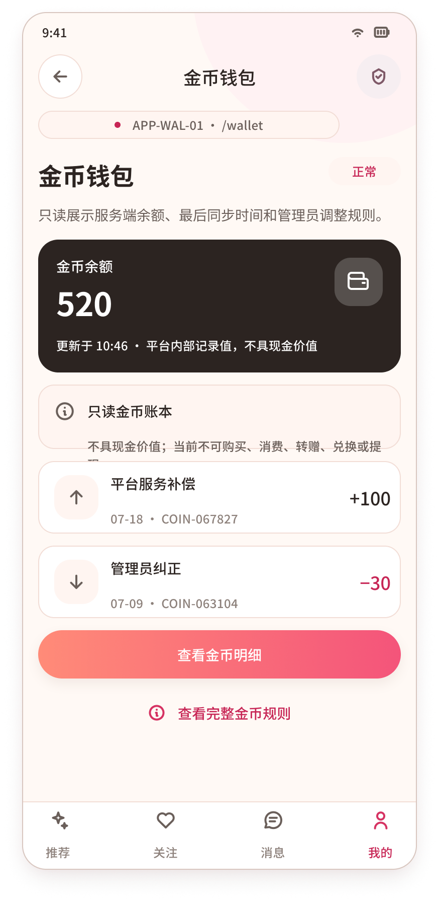

**状态 2｜空钱包｜`145:54618`**

- 触发条件：账号余额为 0，且没有任何已生效分录。
- 关键交互：保留规则说明和明细入口，不展示充值或消费引导。
- 预期结果：显示“还没有生效分录”，后续管理员调整生效后可正常刷新。
- 权威边界：0 是服务端权威结果，不用缺失值或请求失败替代。
- [打开 Figma 交互原型](https://www.figma.com/proto/LaNSwwGsznwcpV8msj7BQC/Peachmote-UI-%E5%80%9F%E9%89%B4%E5%AE%A1%E6%9F%A5%E6%9D%BF---MeiGallery?node-id=145-54618&scaling=min-zoom&content-scaling=fixed&starting-point-node-id=145%3A54618&show-proto-sidebar=1&page-id=9%3A8)

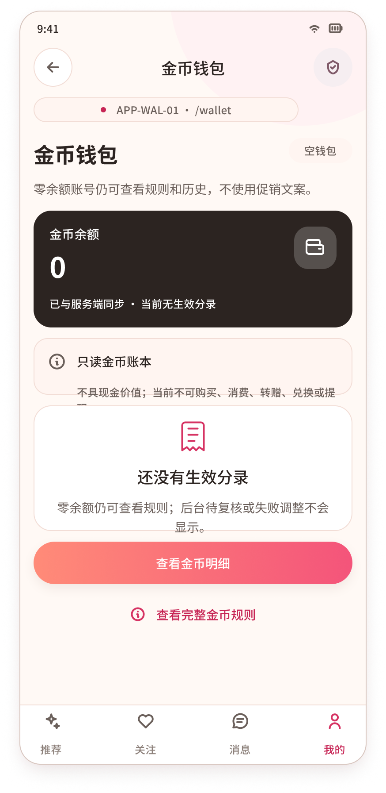

**状态 3｜离线缓存｜`145:54793`**

- 触发条件：当前离线，但本地存在最近一次成功同步的钱包快照。
- 关键交互：显示缓存时间和“重新连接并刷新”；允许查看缓存明细，禁止执行任何写操作。
- 预期结果：明确“不是当前最新余额”；联网后先刷新权威余额再移除离线提示。
- 权威边界：离线快照仅用于只读展示，不能用于授权或业务结算。
- [打开 Figma 交互原型](https://www.figma.com/proto/LaNSwwGsznwcpV8msj7BQC/Peachmote-UI-%E5%80%9F%E9%89%B4%E5%AE%A1%E6%9F%A5%E6%9D%BF---MeiGallery?node-id=145-54793&scaling=min-zoom&content-scaling=fixed&starting-point-node-id=145%3A54793&show-proto-sidebar=1&page-id=9%3A8)

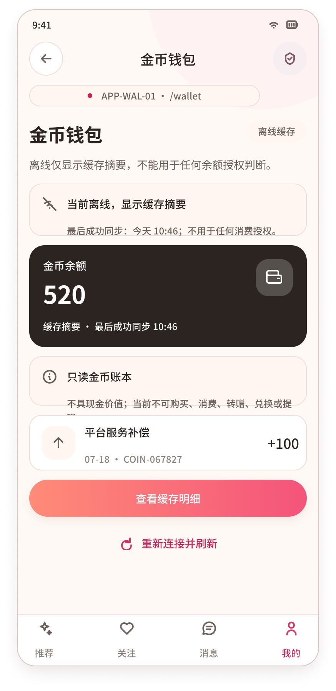

**状态 4｜同步失败｜`145:54977`**

- 触发条件：同步请求失败或余额 projection 暂不可用。
- 关键交互：保留最近一次成功余额并标记时间；提供重新同步和查看缓存明细。
- 预期结果：不把失败显示成 0，不覆盖缓存，不生成任何补偿分录。
- 权威边界：同步失败只影响展示新鲜度，分录与余额仍以服务端为唯一权威。
- [打开 Figma 交互原型](https://www.figma.com/proto/LaNSwwGsznwcpV8msj7BQC/Peachmote-UI-%E5%80%9F%E9%89%B4%E5%AE%A1%E6%9F%A5%E6%9D%BF---MeiGallery?node-id=145-54977&scaling=min-zoom&content-scaling=fixed&starting-point-node-id=145%3A54977&show-proto-sidebar=1&page-id=9%3A8)

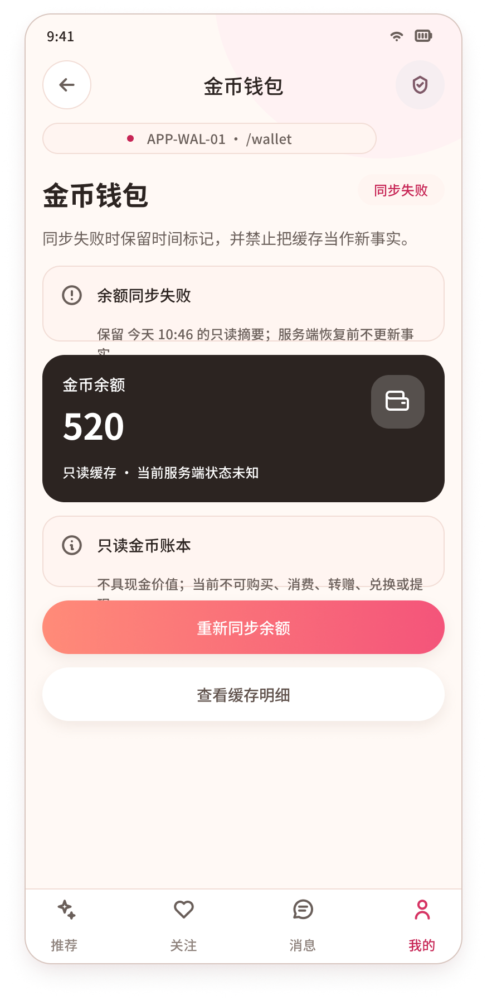

---

#### APP-WAL-02 金币明细

**平台与模块：** 移动端 · 会员与金币　　**优先级：** P0　　**设计路由：** `/wallet/entries`

**用户价值：** 按全部、增加和扣减筛选不可覆盖的有效分录。

**适用角色：** 已登录观看者

**前置条件：** 用户已登录；余额与明细来自服务端有效分录投影，离线缓存只用于只读展示。

**进入路径：** 钱包页

**页面结构：** 不可覆盖的有效分录按方向和时间筛选，并保留对账维护说明。

**详细交互：** 用户从钱包页进入。默认按时间倒序读取有效分录，可切换全部、增加和扣减筛选；切换筛选会重置服务端游标，加载更多复用 nextCursor 并按 entryId 去重。分页失败或维护状态保留已验证历史，不修改、隐藏或重新计算原分录。

**业务规则：** 金币不具现金价值；客户端只读余额和有效分录，不出现购买、充值、消费、兑换、转账或提现。

**数据与权限：** 只读取余额与有效分录；客户端不得直接修改余额，申诉只创建独立案件。

**页面状态：** 正常、增加筛选、扣减筛选、首次空、分页加载、对账维护

**Figma 最终稿映射：** `10｜Mobile Pages` → `APP-WAL-02`，共 6 个需求状态；在 [Figma 最终设计文件](https://www.figma.com/design/LaNSwwGsznwcpV8msj7BQC/Peachmote-UI-%E5%80%9F%E9%89%B4%E5%AE%A1%E6%9F%A5%E6%9D%BF---MeiGallery) 中按 Page ID 定位。

**实现追踪：**

- 追踪键：`APP-WAL-02 → PRD-FR-070,PRD-FR-071,PRD-FR-074 → SCP-FR-010,SCP-FR-011 → F-10、A-10/WAL-FR-*`
- 产品需求：`PRD-FR-070`、`PRD-FR-071`、`PRD-FR-074`
- 发布范围：`SCP-FR-010`、`SCP-FR-011`
- 非功能要求：`PRD-NFR-001`、`PRD-NFR-002`、`PRD-NFR-005`、`PRD-NFR-006`、`PRD-NFR-007`
- 产品级验收：`PRD-AC-006`
- 模块 PRD：[F-10、A-10 金币钱包与管理员调币](../ways-of-work/plan/real-person-discovery-platform/wallet-ledger-and-admin-coin-adjustments/prd.md)（WAL-FR-*）

**开发验收：**

- 从“钱包页”能够进入，页面明确显示 APP-WAL-02、页面名称、设计路由和返回路径。
- 主要操作“查看分录详情”具有处理中、成功和失败反馈，重复提交不会产生不可控的重复业务结果。
- 页面覆盖“正常、增加筛选、扣减筛选、首次空、分页加载、对账维护”状态，并在空、错误、受限或冲突时提供安全下一步。
- 服务端状态变化后不会继续展示过期权限、过期余额、失效认证或不可访问内容。
- 金币不具现金价值；客户端只读余额和有效分录，不出现购买、充值、消费、兑换、转账或提现。
- UI 层、状态层、数据层和服务端契约不得使用页面展示名称替代稳定 ID、rank、entitlement 或状态枚举。
- 加载、空、错误、离线、无权限、对象失效和服务端状态变化必须按本页状态集合安全收敛。

**Figma 最终交互状态：** 本页已完成 6 个独立状态设计；以下 Frame、触发条件、操作结果和权威边界共同构成实现与验收基线。

**状态 1｜正常｜`145:55148`**

- 触发条件：全部方向的有效分录查询成功。
- 关键交互：按时间倒序展示增加、扣减和冲正关系；点击分录进入 APP-WAL-03，加载更多使用稳定游标。
- 预期结果：每项显示方向、数量、原因、时间和安全业务引用；不展示内部备注。
- 权威边界：只展示已生效分录；原分录不可修改或删除。
- [打开 Figma 交互原型](https://www.figma.com/proto/LaNSwwGsznwcpV8msj7BQC/Peachmote-UI-%E5%80%9F%E9%89%B4%E5%AE%A1%E6%9F%A5%E6%9D%BF---MeiGallery?node-id=145-55148&scaling=min-zoom&content-scaling=fixed&starting-point-node-id=145%3A55148&show-proto-sidebar=1&page-id=9%3A8)

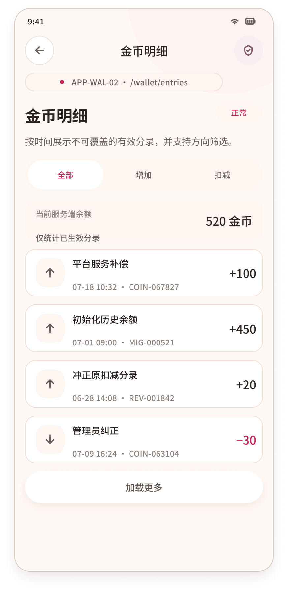

**状态 2｜增加筛选｜`145:55320`**

- 触发条件：用户选择“增加”。
- 关键交互：重新以 direction=credit 查询并重置分页游标；切换筛选时保留页面结构。
- 预期结果：只显示增加、补偿或冲正增加等已生效分录，筛选结果为空时进入对应空状态。
- 权威边界：筛选由服务端执行，客户端不得隐藏不理解的分录后自行计算余额。
- [打开 Figma 交互原型](https://www.figma.com/proto/LaNSwwGsznwcpV8msj7BQC/Peachmote-UI-%E5%80%9F%E9%89%B4%E5%AE%A1%E6%9F%A5%E6%9D%BF---MeiGallery?node-id=145-55320&scaling=min-zoom&content-scaling=fixed&starting-point-node-id=145%3A55320&show-proto-sidebar=1&page-id=9%3A8)

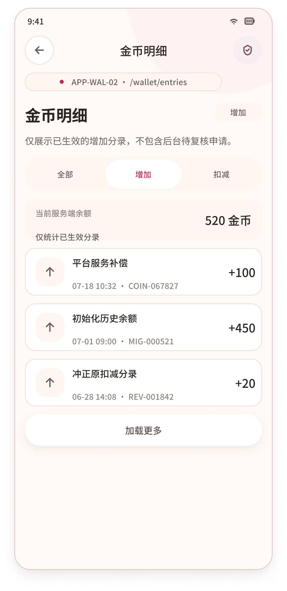

**状态 3｜扣减筛选｜`145:55483`**

- 触发条件：用户选择“扣减”。
- 关键交互：重新以 direction=debit 查询并重置分页游标；负向数量使用一致视觉语义。
- 预期结果：只显示管理员扣减、冲正扣减等已生效分录，不出现用户消费记录。
- 权威边界：App 1.0 没有消费能力；扣减只能来自管理员受控调整或冲正。
- [打开 Figma 交互原型](https://www.figma.com/proto/LaNSwwGsznwcpV8msj7BQC/Peachmote-UI-%E5%80%9F%E9%89%B4%E5%AE%A1%E6%9F%A5%E6%9D%BF---MeiGallery?node-id=145-55483&scaling=min-zoom&content-scaling=fixed&starting-point-node-id=145%3A55483&show-proto-sidebar=1&page-id=9%3A8)

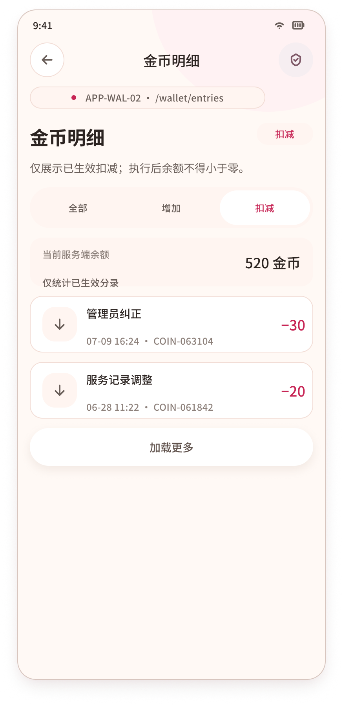

**状态 4｜首次空｜`145:55637`**

- 触发条件：当前筛选查询成功但没有已生效分录。
- 关键交互：显示筛选相关空状态；允许切回全部或查看金币规则。
- 预期结果：不生成示例分录，不把待审批调整显示为已生效。
- 权威边界：空集合来自服务端成功响应。
- [打开 Figma 交互原型](https://www.figma.com/proto/LaNSwwGsznwcpV8msj7BQC/Peachmote-UI-%E5%80%9F%E9%89%B4%E5%AE%A1%E6%9F%A5%E6%9D%BF---MeiGallery?node-id=145-55637&scaling=min-zoom&content-scaling=fixed&starting-point-node-id=145%3A55637&show-proto-sidebar=1&page-id=9%3A8)

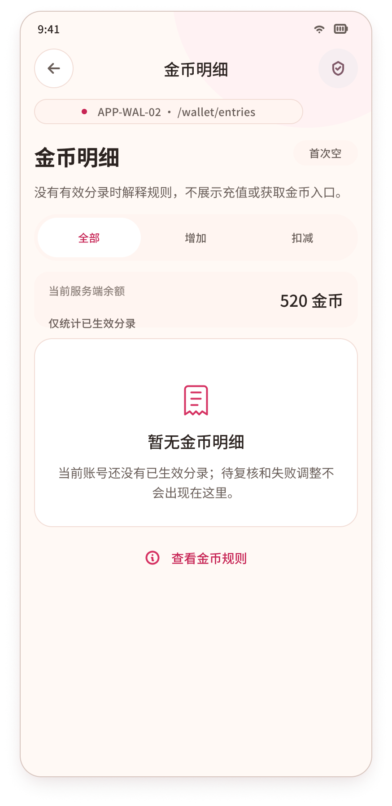

**状态 5｜分页加载｜`145:55785`**

- 触发条件：用户点击加载更多且仍有 nextCursor。
- 关键交互：按钮进入加载状态并防重复请求；成功后按 entryId 去重追加，失败保留已有分录。
- 预期结果：不打乱已加载顺序；nextCursor 为空时不再展示加载入口。
- 权威边界：分页游标由服务端签发，客户端不按本地页码推算。
- [打开 Figma 交互原型](https://www.figma.com/proto/LaNSwwGsznwcpV8msj7BQC/Peachmote-UI-%E5%80%9F%E9%89%B4%E5%AE%A1%E6%9F%A5%E6%9D%BF---MeiGallery?node-id=145-55785&scaling=min-zoom&content-scaling=fixed&starting-point-node-id=145%3A55785&show-proto-sidebar=1&page-id=9%3A8)

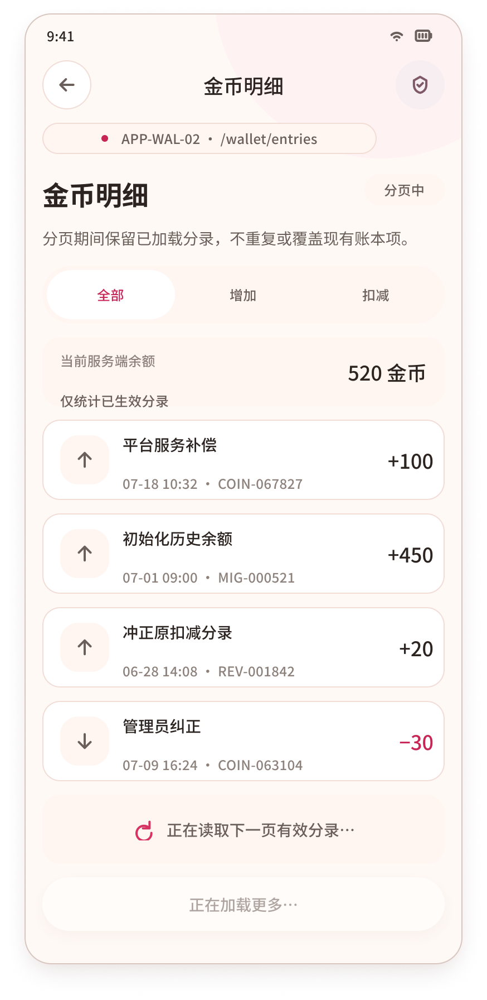

**状态 6｜对账维护｜`145:55962`**

- 触发条件：钱包正在对账或投影存在可恢复延迟。
- 关键交互：保留已验证历史，冻结最新余额摘要并提供刷新状态和帮助入口。
- 预期结果：不删除或改写历史分录；维护完成后整体回读权威余额和游标。
- 权威边界：对账修复只允许追加 forward-fix/冲正分录，不直接覆盖余额。
- [打开 Figma 交互原型](https://www.figma.com/proto/LaNSwwGsznwcpV8msj7BQC/Peachmote-UI-%E5%80%9F%E9%89%B4%E5%AE%A1%E6%9F%A5%E6%9D%BF---MeiGallery?node-id=145-55962&scaling=min-zoom&content-scaling=fixed&starting-point-node-id=145%3A55962&show-proto-sidebar=1&page-id=9%3A8)

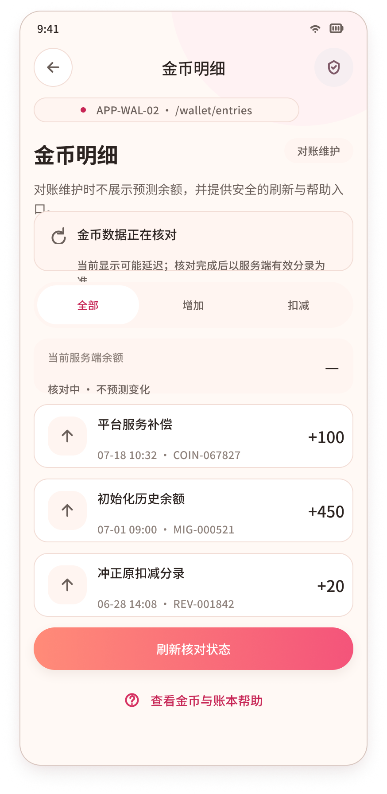

---

#### APP-WAL-03 金币分录详情

**平台与模块：** 移动端 · 会员与金币　　**优先级：** P1　　**设计路由：** `/wallet/entries/{entryId}`

**用户价值：** 展示方向、数量、原因、安全业务单号、冲正关系和申诉入口。

**适用角色：** 已登录观看者

**前置条件：** 用户已登录；余额与明细来自服务端有效分录投影，离线缓存只用于只读展示。

**进入路径：** 金币明细

**页面结构：** 方向、数量、原因、业务单号、冲正关系和申诉入口集中展示。

**详细交互：** 用户从金币明细进入。页面展示方向、数量、原因、时间、安全业务单号、执行结果和冲正关系；复制只包含用户安全业务引用。提交申诉只创建独立案件并进入 APP-SET-08，不直接改余额；冲正通过新分录表达，原分录始终保留且不可编辑删除。

**业务规则：** 金币不具现金价值；客户端只读余额和有效分录，不出现购买、充值、消费、兑换、转账或提现。

**数据与权限：** 只读取余额与有效分录；客户端不得直接修改余额，申诉只创建独立案件。

**页面状态：** 正常、业务单号已复制、分录不可用、冲正中

**Figma 最终稿映射：** `10｜Mobile Pages` → `APP-WAL-03`，共 4 个需求状态；在 [Figma 最终设计文件](https://www.figma.com/design/LaNSwwGsznwcpV8msj7BQC/Peachmote-UI-%E5%80%9F%E9%89%B4%E5%AE%A1%E6%9F%A5%E6%9D%BF---MeiGallery) 中按 Page ID 定位。

**实现追踪：**

- 追踪键：`APP-WAL-03 → PRD-FR-070,PRD-FR-071,PRD-FR-074 → SCP-FR-010,SCP-FR-011 → F-10、A-10/WAL-FR-*`
- 产品需求：`PRD-FR-070`、`PRD-FR-071`、`PRD-FR-074`
- 发布范围：`SCP-FR-010`、`SCP-FR-011`
- 非功能要求：`PRD-NFR-001`、`PRD-NFR-002`、`PRD-NFR-005`、`PRD-NFR-006`、`PRD-NFR-007`
- 产品级验收：`PRD-AC-006`
- 模块 PRD：[F-10、A-10 金币钱包与管理员调币](../ways-of-work/plan/real-person-discovery-platform/wallet-ledger-and-admin-coin-adjustments/prd.md)（WAL-FR-*）

**开发验收：**

- 从“金币明细”能够进入，页面明确显示 APP-WAL-03、页面名称、设计路由和返回路径。
- 主要操作“提交申诉”具有处理中、成功和失败反馈，重复提交不会产生不可控的重复业务结果。
- 页面覆盖“正常、业务单号已复制、分录不可用、冲正中”状态，并在空、错误、受限或冲突时提供安全下一步。
- 服务端状态变化后不会继续展示过期权限、过期余额、失效认证或不可访问内容。
- 金币不具现金价值；客户端只读余额和有效分录，不出现购买、充值、消费、兑换、转账或提现。
- UI 层、状态层、数据层和服务端契约不得使用页面展示名称替代稳定 ID、rank、entitlement 或状态枚举。
- 加载、空、错误、离线、无权限、对象失效和服务端状态变化必须按本页状态集合安全收敛。

**Figma 最终交互状态：** 本页已完成 4 个独立状态设计；以下 Frame、触发条件、操作结果和权威边界共同构成实现与验收基线。

**状态 1｜正常｜`145:56138`**

- 触发条件：分录存在、已生效且当前账号可见。
- 关键交互：展示方向、数量、原因、发生时间、业务单号、执行结果和冲正关系；可复制业务单号或进入独立申诉。
- 预期结果：原分录明确不可编辑删除；申诉只创建案件，不改变余额。
- 权威边界：分录事实、状态和冲正关系由服务端返回。
- [打开 Figma 交互原型](https://www.figma.com/proto/LaNSwwGsznwcpV8msj7BQC/Peachmote-UI-%E5%80%9F%E9%89%B4%E5%AE%A1%E6%9F%A5%E6%9D%BF---MeiGallery?node-id=145-56138&scaling=min-zoom&content-scaling=fixed&starting-point-node-id=145%3A56138&show-proto-sidebar=1&page-id=9%3A8)

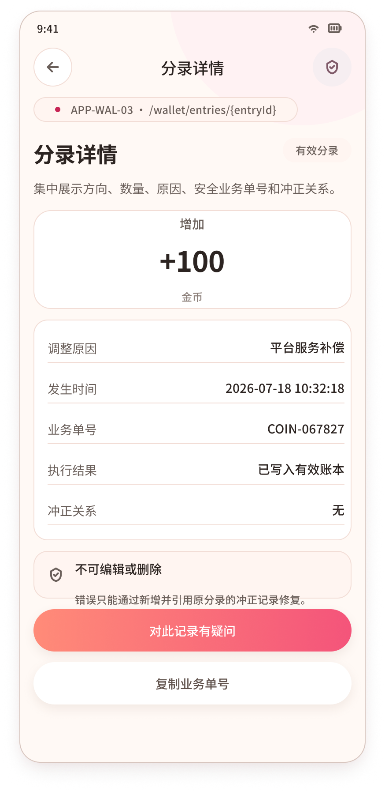

**状态 2｜业务单号已复制｜`145:56296`**

- 触发条件：用户点击“复制业务单号”。
- 关键交互：仅复制对用户安全的业务引用并展示短暂成功反馈；不复制内部审计 ID 或敏感备注。
- 预期结果：重复点击保持幂等，不改变分录状态。
- 权威边界：可复制字段由服务端 DTO 明确提供。
- [打开 Figma 交互原型](https://www.figma.com/proto/LaNSwwGsznwcpV8msj7BQC/Peachmote-UI-%E5%80%9F%E9%89%B4%E5%AE%A1%E6%9F%A5%E6%9D%BF---MeiGallery?node-id=145-56296&scaling=min-zoom&content-scaling=fixed&starting-point-node-id=145%3A56296&show-proto-sidebar=1&page-id=9%3A8)

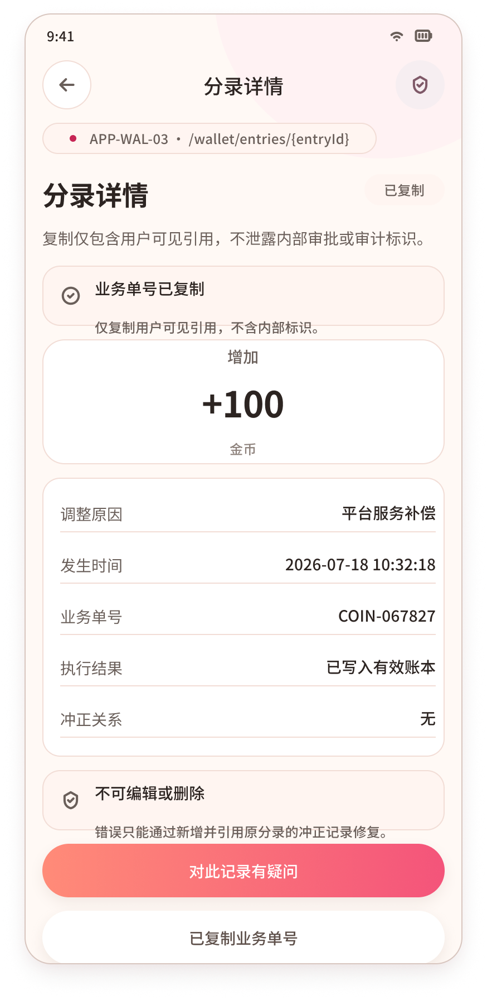

**状态 3｜分录不可用｜`145:56461`**

- 触发条件：分录不存在、已超出可见范围或引用失效。
- 关键交互：不显示缓存详情；提供返回金币明细和帮助入口。
- 预期结果：不泄露其他账号分录是否存在，不把不可用解释为余额为 0。
- 权威边界：服务端对象级授权和返回状态优先。
- [打开 Figma 交互原型](https://www.figma.com/proto/LaNSwwGsznwcpV8msj7BQC/Peachmote-UI-%E5%80%9F%E9%89%B4%E5%AE%A1%E6%9F%A5%E6%9D%BF---MeiGallery?node-id=145-56461&scaling=min-zoom&content-scaling=fixed&starting-point-node-id=145%3A56461&show-proto-sidebar=1&page-id=9%3A8)

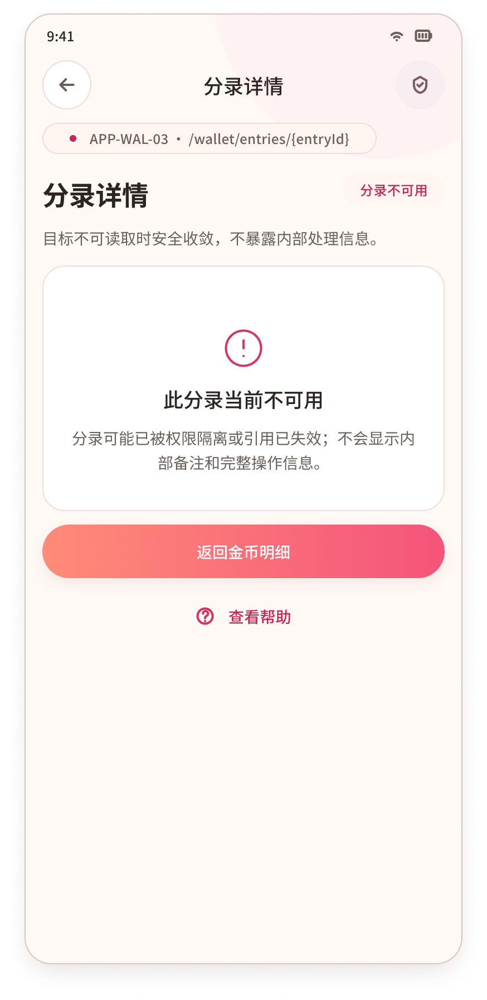

**状态 4｜冲正中｜`145:56598`**

- 触发条件：原分录已关联待执行或已执行的冲正流程。
- 关键交互：展示冲正状态与关联引用；允许查看冲正进度，但原分录继续保留。
- 预期结果：冲正完成后追加反向分录并刷新关系，不修改或删除原记录。
- 权威边界：冲正由申请—复核—执行状态机驱动，客户端只读。
- [打开 Figma 交互原型](https://www.figma.com/proto/LaNSwwGsznwcpV8msj7BQC/Peachmote-UI-%E5%80%9F%E9%89%B4%E5%AE%A1%E6%9F%A5%E6%9D%BF---MeiGallery?node-id=145-56598&scaling=min-zoom&content-scaling=fixed&starting-point-node-id=145%3A56598&show-proto-sidebar=1&page-id=9%3A8)

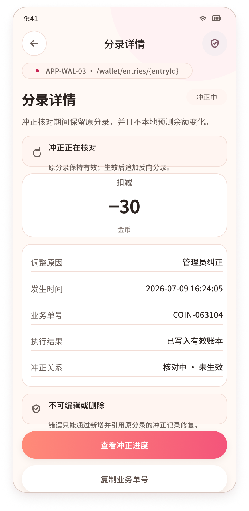

---

### 移动端 · 我的与设置

本组共 12 个页面。实现、接口、测试和缺陷均按 Page ID 追踪。

#### APP-SET-01 我的

**平台与模块：** 移动端 · 我的与设置　　**优先级：** P0　　**设计路由：** `/me`

**用户价值：** 汇总私有账号、会员、金币、设置、帮助和数据权利入口。

**适用角色：** 已登录观看者

**前置条件：** 用户已登录；敏感操作需重新验证；账号限制和数据权利状态以服务端为准。

**进入路径：** 底部我的 Tab

**页面结构：** 账号、会员、金币、帮助和数据权利以私有个人中心信息架构组织。

**详细交互：** 用户从“底部我的 Tab”进入。主要操作为“查看账号资料”，执行时显示处理中状态；服务端确认成功后刷新权威数据并可进入 APP-SET-02「账号资料」。次要操作包括：查看会员、查看钱包、进入设置。失败时保留已输入内容，展示可理解原因，并提供重试、返回或帮助入口。

**业务规则：** 账号设置不改变公开真人资料；敏感操作需要服务端重新验证。

**数据与权限：** 只读取当前账号范围内的必要数据；所有写操作均由服务端鉴权、校验并返回权威状态。

**页面状态：** 正常、账号受限、摘要同步失败

**Figma 最终稿映射：** `10｜Mobile Pages` → `APP-SET-01`，共 3 个需求状态；在 [Figma 最终设计文件](https://www.figma.com/design/LaNSwwGsznwcpV8msj7BQC/Peachmote-UI-%E5%80%9F%E9%89%B4%E5%AE%A1%E6%9F%A5%E6%9D%BF---MeiGallery) 中按 Page ID 定位。

**实现追踪：**

- 追踪键：`APP-SET-01 → PRD-FR-080,PRD-FR-081,PRD-FR-082 → SCP-FR-013 → F-13/PDR-FR-*`
- 产品需求：`PRD-FR-080`、`PRD-FR-081`、`PRD-FR-082`
- 发布范围：`SCP-FR-013`
- 非功能要求：`PRD-NFR-001`、`PRD-NFR-005`、`PRD-NFR-006`、`PRD-NFR-007`
- 产品级验收：`PRD-AC-001`、`PRD-AC-010`
- 模块 PRD：[F-13 我的、隐私设置与数据权利](../ways-of-work/plan/real-person-discovery-platform/privacy-settings-and-data-rights/prd.md)（PDR-FR-*）

**开发验收：**

- 从“底部我的 Tab”能够进入，页面明确显示 APP-SET-01、页面名称、设计路由和返回路径。
- 主要操作“查看账号资料”具有处理中、成功和失败反馈，重复提交不会产生不可控的重复业务结果。
- 页面覆盖“正常、账号受限、摘要同步失败”状态，并在空、错误、受限或冲突时提供安全下一步。
- 服务端状态变化后不会继续展示过期权限、过期余额、失效认证或不可访问内容。
- 账号设置不改变公开真人资料；敏感操作需要服务端重新验证。
- UI 层、状态层、数据层和服务端契约不得使用页面展示名称替代稳定 ID、rank、entitlement 或状态枚举。
- 加载、空、错误、离线、无权限、对象失效和服务端状态变化必须按本页状态集合安全收敛。

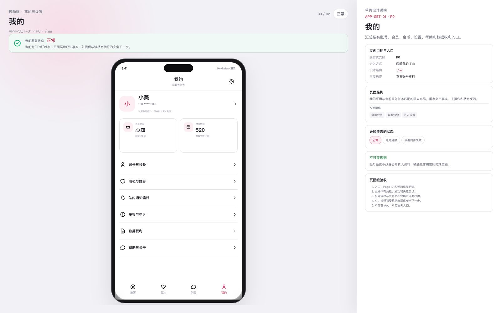

**P0 关键状态：** 账号受限

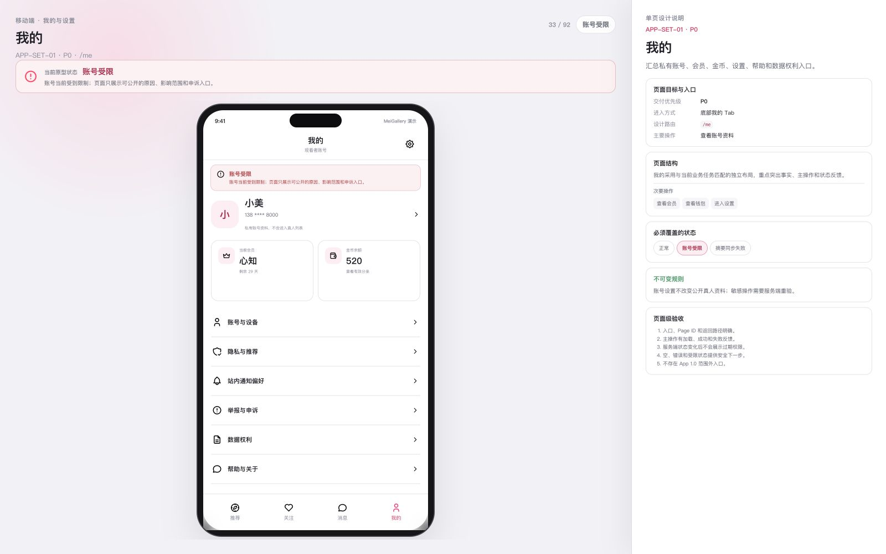

---

#### APP-SET-02 账号资料

**平台与模块：** 移动端 · 我的与设置　　**优先级：** P1　　**设计路由：** `/me/account`

**用户价值：** 编辑只用于识别本人账号的昵称与头像，不生成公开真人资料。

**适用角色：** 已登录观看者

**前置条件：** 用户已登录；敏感操作需重新验证；账号限制和数据权利状态以服务端为准。

**进入路径：** 我的页面

**页面结构：** 只编辑观看者账号识别信息，并持续说明不会生成公开真人资料。

**详细交互：** 用户从“我的页面”进入。主要操作为“保存账号资料”，执行时显示处理中状态；服务端确认成功后刷新权威数据并可进入 APP-SET-01「我的」。次要操作包括：更换头像、验证登录标识。失败时保留已输入内容，展示可理解原因，并提供重试、返回或帮助入口。

**业务规则：** 账号设置不改变公开真人资料；敏感操作需要服务端重新验证。

**数据与权限：** 只读取当前账号范围内的必要数据；所有写操作均由服务端鉴权、校验并返回权威状态。

**页面状态：** 正常、保存失败、需要重新验证

**Figma 最终稿映射：** `10｜Mobile Pages` → `APP-SET-02`，共 3 个需求状态；在 [Figma 最终设计文件](https://www.figma.com/design/LaNSwwGsznwcpV8msj7BQC/Peachmote-UI-%E5%80%9F%E9%89%B4%E5%AE%A1%E6%9F%A5%E6%9D%BF---MeiGallery) 中按 Page ID 定位。

**实现追踪：**

- 追踪键：`APP-SET-02 → PRD-FR-080,PRD-FR-081,PRD-FR-082,PRD-FR-001,PRD-FR-002 → SCP-FR-013 → F-13/PDR-FR-*,F-01/ACC-FR-*`
- 产品需求：`PRD-FR-080`、`PRD-FR-081`、`PRD-FR-082`、`PRD-FR-001`、`PRD-FR-002`
- 发布范围：`SCP-FR-013`
- 非功能要求：`PRD-NFR-001`、`PRD-NFR-005`、`PRD-NFR-006`、`PRD-NFR-007`
- 产品级验收：`PRD-AC-001`、`PRD-AC-010`
- 模块 PRD：[F-13 我的、隐私设置与数据权利](../ways-of-work/plan/real-person-discovery-platform/privacy-settings-and-data-rights/prd.md)（PDR-FR-*）；[F-01 观看者注册、登录与设备安全](../ways-of-work/plan/real-person-discovery-platform/account-access-and-device-management/prd.md)（ACC-FR-*）

**开发验收：**

- 从“我的页面”能够进入，页面明确显示 APP-SET-02、页面名称、设计路由和返回路径。
- 主要操作“保存账号资料”具有处理中、成功和失败反馈，重复提交不会产生不可控的重复业务结果。
- 页面覆盖“正常、保存失败、需要重新验证”状态，并在空、错误、受限或冲突时提供安全下一步。
- 服务端状态变化后不会继续展示过期权限、过期余额、失效认证或不可访问内容。
- 账号设置不改变公开真人资料；敏感操作需要服务端重新验证。
- UI 层、状态层、数据层和服务端契约不得使用页面展示名称替代稳定 ID、rank、entitlement 或状态枚举。
- 加载、空、错误、离线、无权限、对象失效和服务端状态变化必须按本页状态集合安全收敛。

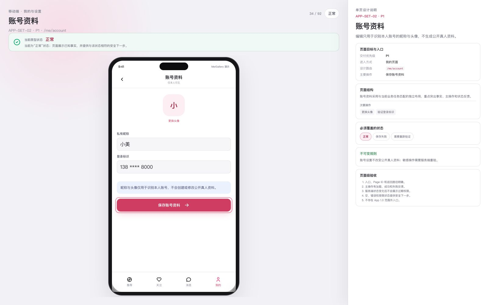

---

#### APP-SET-03 设备管理

**平台与模块：** 移动端 · 我的与设置　　**优先级：** P1　　**设计路由：** `/me/devices`

**用户价值：** 查看当前和其他登录设备，并可远程退出。

**适用角色：** 已登录观看者

**前置条件：** 用户已登录；敏感操作需重新验证；账号限制和数据权利状态以服务端为准。

**进入路径：** 我的页面账号与安全

**页面结构：** 当前设备、其他设备、最后活动时间和远程退出动作清晰分层。

**详细交互：** 用户从“我的页面账号与安全”进入。主要操作为“退出其他设备”，执行时显示处理中状态；服务端确认成功后刷新权威数据并可进入 APP-SET-01「我的」。次要操作包括：查看设备详情。失败时保留已输入内容，展示可理解原因，并提供重试、返回或帮助入口。

**业务规则：** 账号设置不改变公开真人资料；敏感操作需要服务端重新验证。

**数据与权限：** 只读取当前账号范围内的必要数据；所有写操作均由服务端鉴权、校验并返回权威状态。

**页面状态：** 正常、仅当前设备、撤销失败

**Figma 最终稿映射：** `10｜Mobile Pages` → `APP-SET-03`，共 3 个需求状态；在 [Figma 最终设计文件](https://www.figma.com/design/LaNSwwGsznwcpV8msj7BQC/Peachmote-UI-%E5%80%9F%E9%89%B4%E5%AE%A1%E6%9F%A5%E6%9D%BF---MeiGallery) 中按 Page ID 定位。

**实现追踪：**

- 追踪键：`APP-SET-03 → PRD-FR-080,PRD-FR-081,PRD-FR-082,PRD-FR-001,PRD-FR-002 → SCP-FR-013 → F-13/PDR-FR-*,F-01/ACC-FR-*`
- 产品需求：`PRD-FR-080`、`PRD-FR-081`、`PRD-FR-082`、`PRD-FR-001`、`PRD-FR-002`
- 发布范围：`SCP-FR-013`
- 非功能要求：`PRD-NFR-001`、`PRD-NFR-005`、`PRD-NFR-006`、`PRD-NFR-007`
- 产品级验收：`PRD-AC-001`、`PRD-AC-010`
- 模块 PRD：[F-13 我的、隐私设置与数据权利](../ways-of-work/plan/real-person-discovery-platform/privacy-settings-and-data-rights/prd.md)（PDR-FR-*）；[F-01 观看者注册、登录与设备安全](../ways-of-work/plan/real-person-discovery-platform/account-access-and-device-management/prd.md)（ACC-FR-*）

**开发验收：**

- 从“我的页面账号与安全”能够进入，页面明确显示 APP-SET-03、页面名称、设计路由和返回路径。
- 主要操作“退出其他设备”具有处理中、成功和失败反馈，重复提交不会产生不可控的重复业务结果。
- 页面覆盖“正常、仅当前设备、撤销失败”状态，并在空、错误、受限或冲突时提供安全下一步。
- 服务端状态变化后不会继续展示过期权限、过期余额、失效认证或不可访问内容。
- 账号设置不改变公开真人资料；敏感操作需要服务端重新验证。
- UI 层、状态层、数据层和服务端契约不得使用页面展示名称替代稳定 ID、rank、entitlement 或状态枚举。
- 加载、空、错误、离线、无权限、对象失效和服务端状态变化必须按本页状态集合安全收敛。

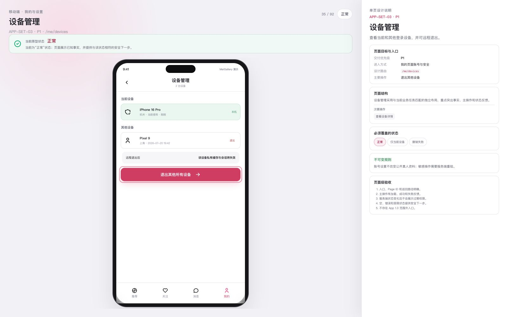

---

#### APP-SET-04 隐私与推荐

**平台与模块：** 移动端 · 我的与设置　　**优先级：** P1　　**设计路由：** `/me/privacy`

**用户价值：** 管理个性化推荐、浏览历史和可选分析，并解释用途。

**适用角色：** 已登录观看者

**前置条件：** 用户已登录；敏感操作需重新验证；账号限制和数据权利状态以服务端为准。

**进入路径：** 我的页面隐私入口

**页面结构：** 设置项包含用途说明、当前状态和保存反馈，必要能力不可被错误关闭。

**详细交互：** 用户从“我的页面隐私入口”进入。主要操作为“保存隐私设置”，执行时显示处理中状态；服务端确认成功后刷新权威数据并可进入 APP-SET-01「我的」。次要操作包括：查看用途、清除历史。失败时保留已输入内容，展示可理解原因，并提供重试、返回或帮助入口。

**业务规则：** 账号设置不改变公开真人资料；敏感操作需要服务端重新验证。

**数据与权限：** 只读取当前账号范围内的必要数据；所有写操作均由服务端鉴权、校验并返回权威状态。

**页面状态：** 正常、保存冲突、政策更新

**Figma 最终稿映射：** `10｜Mobile Pages` → `APP-SET-04`，共 3 个需求状态；在 [Figma 最终设计文件](https://www.figma.com/design/LaNSwwGsznwcpV8msj7BQC/Peachmote-UI-%E5%80%9F%E9%89%B4%E5%AE%A1%E6%9F%A5%E6%9D%BF---MeiGallery) 中按 Page ID 定位。

**实现追踪：**

- 追踪键：`APP-SET-04 → PRD-FR-080,PRD-FR-081,PRD-FR-082 → SCP-FR-013 → F-13/PDR-FR-*`
- 产品需求：`PRD-FR-080`、`PRD-FR-081`、`PRD-FR-082`
- 发布范围：`SCP-FR-013`
- 非功能要求：`PRD-NFR-001`、`PRD-NFR-005`、`PRD-NFR-006`、`PRD-NFR-007`
- 产品级验收：`PRD-AC-001`、`PRD-AC-010`
- 模块 PRD：[F-13 我的、隐私设置与数据权利](../ways-of-work/plan/real-person-discovery-platform/privacy-settings-and-data-rights/prd.md)（PDR-FR-*）

**开发验收：**

- 从“我的页面隐私入口”能够进入，页面明确显示 APP-SET-04、页面名称、设计路由和返回路径。
- 主要操作“保存隐私设置”具有处理中、成功和失败反馈，重复提交不会产生不可控的重复业务结果。
- 页面覆盖“正常、保存冲突、政策更新”状态，并在空、错误、受限或冲突时提供安全下一步。
- 服务端状态变化后不会继续展示过期权限、过期余额、失效认证或不可访问内容。
- 账号设置不改变公开真人资料；敏感操作需要服务端重新验证。
- UI 层、状态层、数据层和服务端契约不得使用页面展示名称替代稳定 ID、rank、entitlement 或状态枚举。
- 加载、空、错误、离线、无权限、对象失效和服务端状态变化必须按本页状态集合安全收敛。

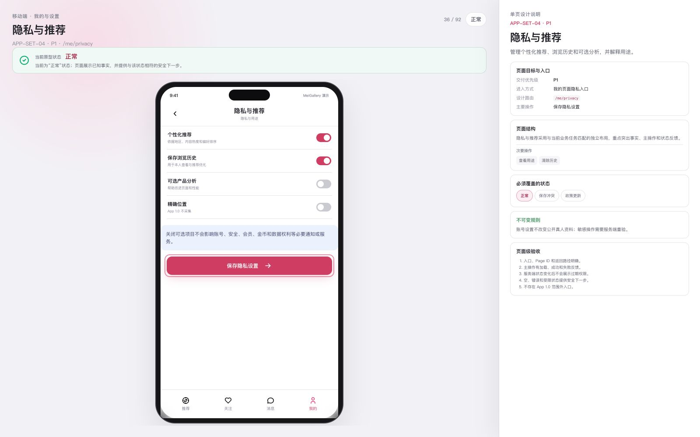

---

#### APP-SET-05 站内通知偏好

**平台与模块：** 移动端 · 我的与设置　　**优先级：** P1　　**设计路由：** `/me/notification-preferences`

**用户价值：** 管理消息、互动、营销通知，同时保留不可关闭的必要通知。

**适用角色：** 已登录观看者

**前置条件：** 用户已登录；敏感操作需重新验证；账号限制和数据权利状态以服务端为准。

**进入路径：** 我的页面通知设置

**页面结构：** 设置项包含用途说明、当前状态和保存反馈，必要能力不可被错误关闭。

**详细交互：** 用户从“我的页面通知设置”进入。主要操作为“保存通知偏好”，执行时显示处理中状态；服务端确认成功后刷新权威数据并可进入 APP-SET-01「我的」。次要操作包括：恢复默认。失败时保留已输入内容，展示可理解原因，并提供重试、返回或帮助入口。

**业务规则：** 账号设置不改变公开真人资料；敏感操作需要服务端重新验证。

**数据与权限：** 只读取当前账号范围内的必要数据；所有写操作均由服务端鉴权、校验并返回权威状态。

**页面状态：** 正常、同步失败、策略变化

**Figma 最终稿映射：** `10｜Mobile Pages` → `APP-SET-05`，共 3 个需求状态；在 [Figma 最终设计文件](https://www.figma.com/design/LaNSwwGsznwcpV8msj7BQC/Peachmote-UI-%E5%80%9F%E9%89%B4%E5%AE%A1%E6%9F%A5%E6%9D%BF---MeiGallery) 中按 Page ID 定位。

**实现追踪：**

- 追踪键：`APP-SET-05 → PRD-FR-080,PRD-FR-081,PRD-FR-082 → SCP-FR-013 → F-13/PDR-FR-*`
- 产品需求：`PRD-FR-080`、`PRD-FR-081`、`PRD-FR-082`
- 发布范围：`SCP-FR-013`
- 非功能要求：`PRD-NFR-001`、`PRD-NFR-005`、`PRD-NFR-006`、`PRD-NFR-007`
- 产品级验收：`PRD-AC-001`、`PRD-AC-010`
- 模块 PRD：[F-13 我的、隐私设置与数据权利](../ways-of-work/plan/real-person-discovery-platform/privacy-settings-and-data-rights/prd.md)（PDR-FR-*）

**开发验收：**

- 从“我的页面通知设置”能够进入，页面明确显示 APP-SET-05、页面名称、设计路由和返回路径。
- 主要操作“保存通知偏好”具有处理中、成功和失败反馈，重复提交不会产生不可控的重复业务结果。
- 页面覆盖“正常、同步失败、策略变化”状态，并在空、错误、受限或冲突时提供安全下一步。
- 服务端状态变化后不会继续展示过期权限、过期余额、失效认证或不可访问内容。
- 账号设置不改变公开真人资料；敏感操作需要服务端重新验证。
- UI 层、状态层、数据层和服务端契约不得使用页面展示名称替代稳定 ID、rank、entitlement 或状态枚举。
- 加载、空、错误、离线、无权限、对象失效和服务端状态变化必须按本页状态集合安全收敛。

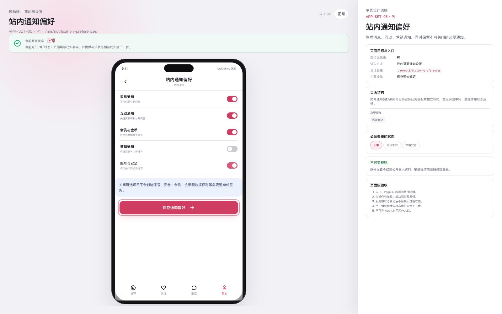

---

#### APP-SET-06 拉黑名单

**平台与模块：** 移动端 · 我的与设置　　**优先级：** P0　　**设计路由：** `/me/blocks`

**用户价值：** 查看已拉黑真人、影响说明并支持解除拉黑。

**适用角色：** 已登录观看者

**前置条件：** 用户已登录；敏感操作需重新验证；账号限制和数据权利状态以服务端为准。

**进入路径：** 我的页面隐私与安全

**页面结构：** 真人列表与移除、筛选或解除动作并列，资料不可用时解释原因。

**详细交互：** 用户从“我的页面隐私与安全”进入。主要操作为“解除拉黑”，执行时显示处理中状态；服务端确认成功后刷新权威数据并可进入 APP-SET-01「我的」。次要操作包括：查看真人、查看影响。失败时保留已输入内容，展示可理解原因，并提供重试、返回或帮助入口。

**业务规则：** 账号设置不改变公开真人资料；敏感操作需要服务端重新验证。

**数据与权限：** 只读取当前账号范围内的必要数据；所有写操作均由服务端鉴权、校验并返回权威状态。

**页面状态：** 正常、空、解除失败

**Figma 最终稿映射：** `10｜Mobile Pages` → `APP-SET-06`，共 3 个需求状态；在 [Figma 最终设计文件](https://www.figma.com/design/LaNSwwGsznwcpV8msj7BQC/Peachmote-UI-%E5%80%9F%E9%89%B4%E5%AE%A1%E6%9F%A5%E6%9D%BF---MeiGallery) 中按 Page ID 定位。

**实现追踪：**

- 追踪键：`APP-SET-06 → PRD-FR-080,PRD-FR-081,PRD-FR-082 → SCP-FR-013 → F-13/PDR-FR-*,A-07/MOD-FR-*`
- 产品需求：`PRD-FR-080`、`PRD-FR-081`、`PRD-FR-082`
- 发布范围：`SCP-FR-013`
- 非功能要求：`PRD-NFR-001`、`PRD-NFR-005`、`PRD-NFR-006`、`PRD-NFR-007`
- 产品级验收：`PRD-AC-001`、`PRD-AC-010`
- 模块 PRD：[F-13 我的、隐私设置与数据权利](../ways-of-work/plan/real-person-discovery-platform/privacy-settings-and-data-rights/prd.md)（PDR-FR-*）；[A-07 举报、拉黑与安全审核](../ways-of-work/plan/real-person-discovery-platform/report-blocking-and-moderation/prd.md)（MOD-FR-*）

**开发验收：**

- 从“我的页面隐私与安全”能够进入，页面明确显示 APP-SET-06、页面名称、设计路由和返回路径。
- 主要操作“解除拉黑”具有处理中、成功和失败反馈，重复提交不会产生不可控的重复业务结果。
- 页面覆盖“正常、空、解除失败”状态，并在空、错误、受限或冲突时提供安全下一步。
- 服务端状态变化后不会继续展示过期权限、过期余额、失效认证或不可访问内容。
- 账号设置不改变公开真人资料；敏感操作需要服务端重新验证。
- UI 层、状态层、数据层和服务端契约不得使用页面展示名称替代稳定 ID、rank、entitlement 或状态枚举。
- 加载、空、错误、离线、无权限、对象失效和服务端状态变化必须按本页状态集合安全收敛。

**P0 关键状态：** 解除失败

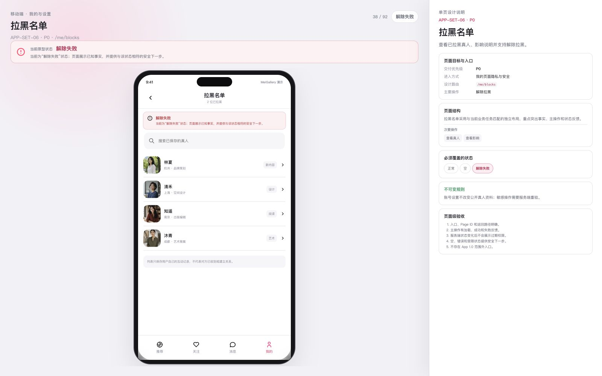

---

#### APP-SET-07 举报记录

**平台与模块：** 移动端 · 我的与设置　　**优先级：** P0　　**设计路由：** `/me/reports`

**用户价值：** 展示举报对象、时间和用户可见处理进度。

**适用角色：** 已登录观看者

**前置条件：** 用户已登录；敏感操作需重新验证；账号限制和数据权利状态以服务端为准。

**进入路径：** 我的页面帮助与安全

**页面结构：** 案件对象、创建时间、用户可见进度和下一步集中呈现。

**详细交互：** 用户从“我的页面帮助与安全”进入。主要操作为“查看举报进度”，执行时显示处理中状态；服务端确认成功后刷新权威数据并可进入 APP-SET-01「我的」。次要操作包括：查看说明。失败时保留已输入内容，展示可理解原因，并提供重试、返回或帮助入口。

**业务规则：** 账号设置不改变公开真人资料；敏感操作需要服务端重新验证。

**数据与权限：** 只读取当前账号范围内的必要数据；所有写操作均由服务端鉴权、校验并返回权威状态。

**页面状态：** 正常、空、状态延迟

**Figma 最终稿映射：** `10｜Mobile Pages` → `APP-SET-07`，共 3 个需求状态；在 [Figma 最终设计文件](https://www.figma.com/design/LaNSwwGsznwcpV8msj7BQC/Peachmote-UI-%E5%80%9F%E9%89%B4%E5%AE%A1%E6%9F%A5%E6%9D%BF---MeiGallery) 中按 Page ID 定位。

**实现追踪：**

- 追踪键：`APP-SET-07 → PRD-FR-080,PRD-FR-081,PRD-FR-082 → SCP-FR-013 → F-13/PDR-FR-*,A-07/MOD-FR-*`
- 产品需求：`PRD-FR-080`、`PRD-FR-081`、`PRD-FR-082`
- 发布范围：`SCP-FR-013`
- 非功能要求：`PRD-NFR-001`、`PRD-NFR-005`、`PRD-NFR-006`、`PRD-NFR-007`
- 产品级验收：`PRD-AC-001`、`PRD-AC-010`
- 模块 PRD：[F-13 我的、隐私设置与数据权利](../ways-of-work/plan/real-person-discovery-platform/privacy-settings-and-data-rights/prd.md)（PDR-FR-*）；[A-07 举报、拉黑与安全审核](../ways-of-work/plan/real-person-discovery-platform/report-blocking-and-moderation/prd.md)（MOD-FR-*）

**开发验收：**

- 从“我的页面帮助与安全”能够进入，页面明确显示 APP-SET-07、页面名称、设计路由和返回路径。
- 主要操作“查看举报进度”具有处理中、成功和失败反馈，重复提交不会产生不可控的重复业务结果。
- 页面覆盖“正常、空、状态延迟”状态，并在空、错误、受限或冲突时提供安全下一步。
- 服务端状态变化后不会继续展示过期权限、过期余额、失效认证或不可访问内容。
- 账号设置不改变公开真人资料；敏感操作需要服务端重新验证。
- UI 层、状态层、数据层和服务端契约不得使用页面展示名称替代稳定 ID、rank、entitlement 或状态枚举。
- 加载、空、错误、离线、无权限、对象失效和服务端状态变化必须按本页状态集合安全收敛。

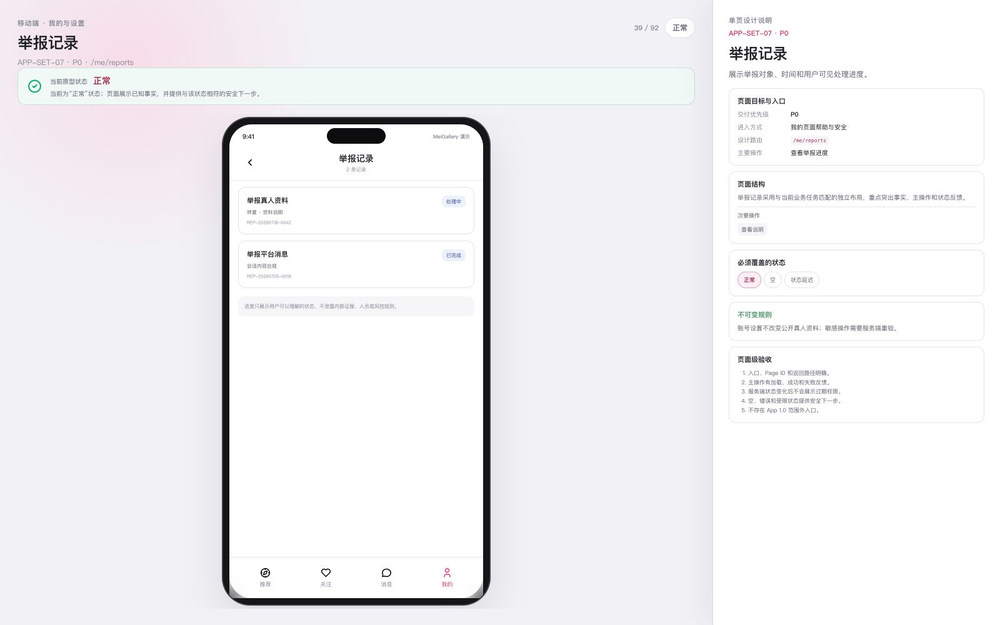

**P0 关键状态：** 状态延迟

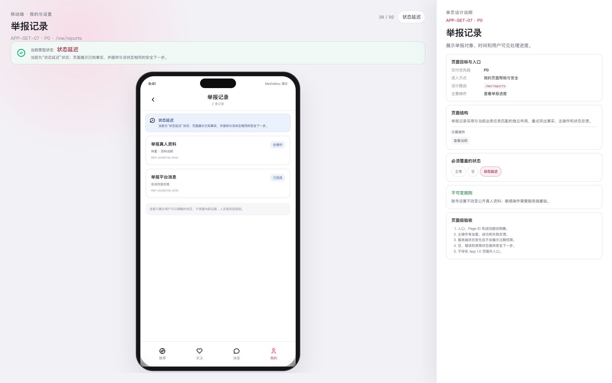

---

#### APP-SET-08 申诉

**平台与模块：** 移动端 · 我的与设置　　**优先级：** P0　　**设计路由：** `/me/appeals`

**用户价值：** 创建申诉、说明证据并跟踪独立复核进度。

**适用角色：** 已登录观看者

**前置条件：** 用户已登录；敏感操作需重新验证；账号限制和数据权利状态以服务端为准。

**进入路径：** 账号受限、举报记录或分录详情

**页面结构：** 申诉原因、说明、证据和独立复核进度围绕单一任务组织。

**详细交互：** 用户从“账号受限、举报记录或分录详情”进入。主要操作为“提交申诉”，执行时显示处理中状态；服务端确认成功后刷新权威数据并可进入 APP-SET-07「举报记录」。次要操作包括：补充说明、查看进度。失败时保留已输入内容，展示可理解原因，并提供重试、返回或帮助入口。

**业务规则：** 账号设置不改变公开真人资料；敏感操作需要服务端重新验证。

**数据与权限：** 只读取当前账号范围内的必要数据；所有写操作均由服务端鉴权、校验并返回权威状态。

**页面状态：** 正常、已有处理中、提交失败

**Figma 最终稿映射：** `10｜Mobile Pages` → `APP-SET-08`，共 3 个需求状态；在 [Figma 最终设计文件](https://www.figma.com/design/LaNSwwGsznwcpV8msj7BQC/Peachmote-UI-%E5%80%9F%E9%89%B4%E5%AE%A1%E6%9F%A5%E6%9D%BF---MeiGallery) 中按 Page ID 定位。

**实现追踪：**

- 追踪键：`APP-SET-08 → PRD-FR-080,PRD-FR-081,PRD-FR-082 → SCP-FR-013 → F-13/PDR-FR-*,A-07/MOD-FR-*`
- 产品需求：`PRD-FR-080`、`PRD-FR-081`、`PRD-FR-082`
- 发布范围：`SCP-FR-013`
- 非功能要求：`PRD-NFR-001`、`PRD-NFR-005`、`PRD-NFR-006`、`PRD-NFR-007`
- 产品级验收：`PRD-AC-001`、`PRD-AC-010`
- 模块 PRD：[F-13 我的、隐私设置与数据权利](../ways-of-work/plan/real-person-discovery-platform/privacy-settings-and-data-rights/prd.md)（PDR-FR-*）；[A-07 举报、拉黑与安全审核](../ways-of-work/plan/real-person-discovery-platform/report-blocking-and-moderation/prd.md)（MOD-FR-*）

**开发验收：**

- 从“账号受限、举报记录或分录详情”能够进入，页面明确显示 APP-SET-08、页面名称、设计路由和返回路径。
- 主要操作“提交申诉”具有处理中、成功和失败反馈，重复提交不会产生不可控的重复业务结果。
- 页面覆盖“正常、已有处理中、提交失败”状态，并在空、错误、受限或冲突时提供安全下一步。
- 服务端状态变化后不会继续展示过期权限、过期余额、失效认证或不可访问内容。
- 账号设置不改变公开真人资料；敏感操作需要服务端重新验证。
- UI 层、状态层、数据层和服务端契约不得使用页面展示名称替代稳定 ID、rank、entitlement 或状态枚举。
- 加载、空、错误、离线、无权限、对象失效和服务端状态变化必须按本页状态集合安全收敛。

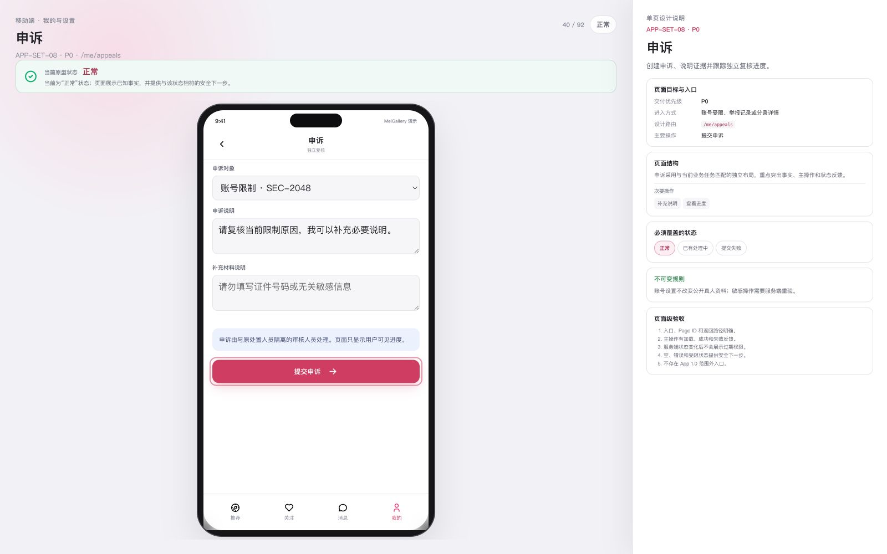

**P0 关键状态：** 已有处理中

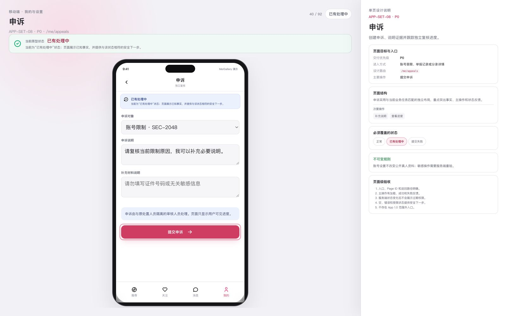

---

#### APP-SET-09 数据导出

**平台与模块：** 移动端 · 我的与设置　　**优先级：** P1　　**设计路由：** `/me/data-export`

**用户价值：** 说明可导出范围，创建任务并在重新验证后下载。

**适用角色：** 已登录观看者

**前置条件：** 用户已登录；敏感操作需重新验证；账号限制和数据权利状态以服务端为准。

**进入路径：** 我的页面数据权利

**页面结构：** 任务范围、状态、过期时间、重新验证和下载动作依次展示。

**详细交互：** 用户从“我的页面数据权利”进入。主要操作为“创建导出任务”，执行时显示处理中状态；服务端确认成功后刷新权威数据并可进入 APP-SET-01「我的」。次要操作包括：下载、重新创建。失败时保留已输入内容，展示可理解原因，并提供重试、返回或帮助入口。

**业务规则：** 账号设置不改变公开真人资料；敏感操作需要服务端重新验证。

**数据与权限：** 只读取当前账号范围内的必要数据；所有写操作均由服务端鉴权、校验并返回权威状态。

**页面状态：** 正常、处理中、失败、已过期、需要重新验证

**Figma 最终稿映射：** `10｜Mobile Pages` → `APP-SET-09`，共 5 个需求状态；在 [Figma 最终设计文件](https://www.figma.com/design/LaNSwwGsznwcpV8msj7BQC/Peachmote-UI-%E5%80%9F%E9%89%B4%E5%AE%A1%E6%9F%A5%E6%9D%BF---MeiGallery) 中按 Page ID 定位。

**实现追踪：**

- 追踪键：`APP-SET-09 → PRD-FR-080,PRD-FR-081,PRD-FR-082 → SCP-FR-013 → F-13/PDR-FR-*`
- 产品需求：`PRD-FR-080`、`PRD-FR-081`、`PRD-FR-082`
- 发布范围：`SCP-FR-013`
- 非功能要求：`PRD-NFR-001`、`PRD-NFR-005`、`PRD-NFR-006`、`PRD-NFR-007`
- 产品级验收：`PRD-AC-001`、`PRD-AC-010`
- 模块 PRD：[F-13 我的、隐私设置与数据权利](../ways-of-work/plan/real-person-discovery-platform/privacy-settings-and-data-rights/prd.md)（PDR-FR-*）

**开发验收：**

- 从“我的页面数据权利”能够进入，页面明确显示 APP-SET-09、页面名称、设计路由和返回路径。
- 主要操作“创建导出任务”具有处理中、成功和失败反馈，重复提交不会产生不可控的重复业务结果。
- 页面覆盖“正常、处理中、失败、已过期、需要重新验证”状态，并在空、错误、受限或冲突时提供安全下一步。
- 服务端状态变化后不会继续展示过期权限、过期余额、失效认证或不可访问内容。
- 账号设置不改变公开真人资料；敏感操作需要服务端重新验证。
- UI 层、状态层、数据层和服务端契约不得使用页面展示名称替代稳定 ID、rank、entitlement 或状态枚举。
- 加载、空、错误、离线、无权限、对象失效和服务端状态变化必须按本页状态集合安全收敛。

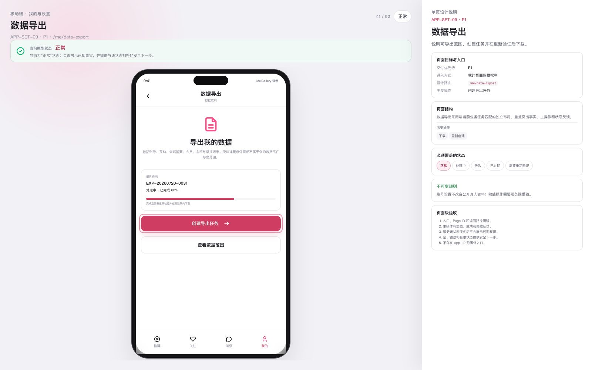

---

#### APP-SET-10 注销账号

**平台与模块：** 移动端 · 我的与设置　　**优先级：** P1　　**设计路由：** `/me/delete-account`

**用户价值：** 解释不可逆影响、阻塞项、重新验证和可取消阶段。

**适用角色：** 已登录观看者

**前置条件：** 用户已登录；敏感操作需重新验证；账号限制和数据权利状态以服务端为准。

**进入路径：** 我的页面数据权利

**页面结构：** 不可逆影响、阻塞项、重新验证和可取消阶段在危险操作前完整披露。

**详细交互：** 用户从“我的页面数据权利”进入。主要操作为“提交注销申请”，执行时显示处理中状态；服务端确认成功后刷新权威数据并可进入 APP-AUTH-01「启动与会话恢复」。次要操作包括：取消申请、重新验证。失败时保留已输入内容，展示可理解原因，并提供重试、返回或帮助入口。

**业务规则：** 账号设置不改变公开真人资料；敏感操作需要服务端重新验证。

**数据与权限：** 只读取当前账号范围内的必要数据；所有写操作均由服务端鉴权、校验并返回权威状态。

**页面状态：** 正常、存在阻塞项、处理中、失败

**Figma 最终稿映射：** `10｜Mobile Pages` → `APP-SET-10`，共 4 个需求状态；在 [Figma 最终设计文件](https://www.figma.com/design/LaNSwwGsznwcpV8msj7BQC/Peachmote-UI-%E5%80%9F%E9%89%B4%E5%AE%A1%E6%9F%A5%E6%9D%BF---MeiGallery) 中按 Page ID 定位。

**实现追踪：**

- 追踪键：`APP-SET-10 → PRD-FR-080,PRD-FR-081,PRD-FR-082 → SCP-FR-013 → F-13/PDR-FR-*`
- 产品需求：`PRD-FR-080`、`PRD-FR-081`、`PRD-FR-082`
- 发布范围：`SCP-FR-013`
- 非功能要求：`PRD-NFR-001`、`PRD-NFR-005`、`PRD-NFR-006`、`PRD-NFR-007`
- 产品级验收：`PRD-AC-001`、`PRD-AC-010`
- 模块 PRD：[F-13 我的、隐私设置与数据权利](../ways-of-work/plan/real-person-discovery-platform/privacy-settings-and-data-rights/prd.md)（PDR-FR-*）

**开发验收：**

- 从“我的页面数据权利”能够进入，页面明确显示 APP-SET-10、页面名称、设计路由和返回路径。
- 主要操作“提交注销申请”具有处理中、成功和失败反馈，重复提交不会产生不可控的重复业务结果。
- 页面覆盖“正常、存在阻塞项、处理中、失败”状态，并在空、错误、受限或冲突时提供安全下一步。
- 服务端状态变化后不会继续展示过期权限、过期余额、失效认证或不可访问内容。
- 账号设置不改变公开真人资料；敏感操作需要服务端重新验证。
- UI 层、状态层、数据层和服务端契约不得使用页面展示名称替代稳定 ID、rank、entitlement 或状态枚举。
- 加载、空、错误、离线、无权限、对象失效和服务端状态变化必须按本页状态集合安全收敛。

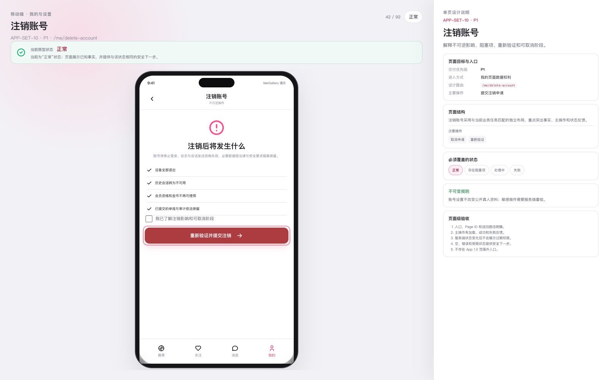

---

#### APP-SET-11 帮助中心

**平台与模块：** 移动端 · 我的与设置　　**优先级：** P0　　**设计路由：** `/help`

**用户价值：** 提供服务说明、主题搜索、常见问题和联系平台入口。

**适用角色：** 已登录观看者

**前置条件：** 用户已登录；敏感操作需重新验证；账号限制和数据权利状态以服务端为准。

**进入路径：** 登录、设置、错误和业务说明入口

**页面结构：** 主题搜索、常见问题、服务边界和联系平台入口按问题解决路径组织。

**详细交互：** 用户从“登录、设置、错误和业务说明入口”进入。主要操作为“打开帮助主题”，执行时显示处理中状态；服务端确认成功后刷新权威数据并可进入 APP-SET-01「我的」。次要操作包括：搜索、联系平台。失败时保留已输入内容，展示可理解原因，并提供重试、返回或帮助入口。

**业务规则：** 账号设置不改变公开真人资料；敏感操作需要服务端重新验证。

**数据与权限：** 只读取当前账号范围内的必要数据；所有写操作均由服务端鉴权、校验并返回权威状态。

**页面状态：** 正常、离线、无结果

**Figma 最终稿映射：** `10｜Mobile Pages` → `APP-SET-11`，共 3 个需求状态；在 [Figma 最终设计文件](https://www.figma.com/design/LaNSwwGsznwcpV8msj7BQC/Peachmote-UI-%E5%80%9F%E9%89%B4%E5%AE%A1%E6%9F%A5%E6%9D%BF---MeiGallery) 中按 Page ID 定位。

**实现追踪：**

- 追踪键：`APP-SET-11 → PRD-FR-080,PRD-FR-081,PRD-FR-082 → SCP-FR-013 → F-13/PDR-FR-*`
- 产品需求：`PRD-FR-080`、`PRD-FR-081`、`PRD-FR-082`
- 发布范围：`SCP-FR-013`
- 非功能要求：`PRD-NFR-001`、`PRD-NFR-005`、`PRD-NFR-006`、`PRD-NFR-007`
- 产品级验收：`PRD-AC-001`、`PRD-AC-010`
- 模块 PRD：[F-13 我的、隐私设置与数据权利](../ways-of-work/plan/real-person-discovery-platform/privacy-settings-and-data-rights/prd.md)（PDR-FR-*）

**开发验收：**

- 从“登录、设置、错误和业务说明入口”能够进入，页面明确显示 APP-SET-11、页面名称、设计路由和返回路径。
- 主要操作“打开帮助主题”具有处理中、成功和失败反馈，重复提交不会产生不可控的重复业务结果。
- 页面覆盖“正常、离线、无结果”状态，并在空、错误、受限或冲突时提供安全下一步。
- 服务端状态变化后不会继续展示过期权限、过期余额、失效认证或不可访问内容。
- 账号设置不改变公开真人资料；敏感操作需要服务端重新验证。
- UI 层、状态层、数据层和服务端契约不得使用页面展示名称替代稳定 ID、rank、entitlement 或状态枚举。
- 加载、空、错误、离线、无权限、对象失效和服务端状态变化必须按本页状态集合安全收敛。

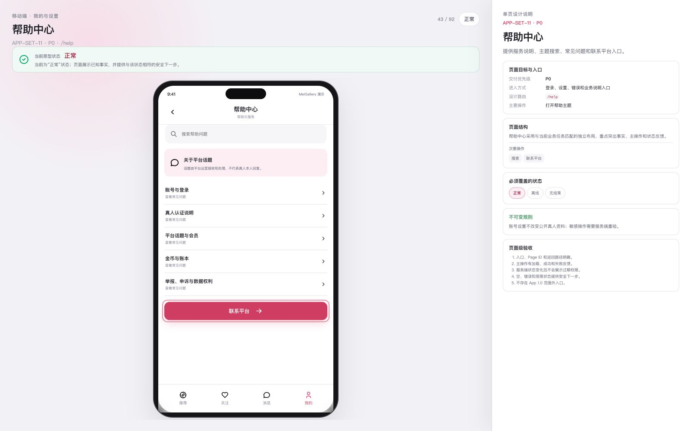

**P0 关键状态：** 离线

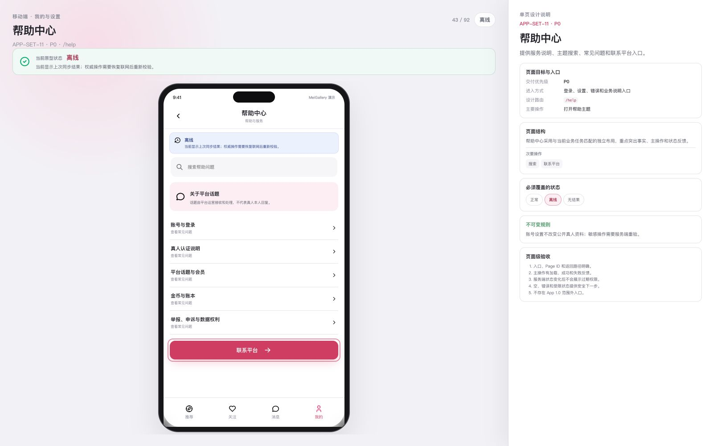

---

#### APP-SET-12 关于与法律

**平台与模块：** 移动端 · 我的与设置　　**优先级：** P1　　**设计路由：** `/about`

**用户价值：** 展示 App 版本、协议、隐私政策和开源许可。

**适用角色：** 已登录观看者

**前置条件：** 用户已登录；敏感操作需重新验证；账号限制和数据权利状态以服务端为准。

**进入路径：** 我的页面

**页面结构：** 版本、协议、隐私政策和开源许可集中展示。

**详细交互：** 用户从“我的页面”进入。主要操作为“查看法律文档”，执行时显示处理中状态；服务端确认成功后刷新权威数据并可进入 APP-AUTH-06「条款与隐私文档」。次要操作包括：查看版本信息、查看许可。失败时保留已输入内容，展示可理解原因，并提供重试、返回或帮助入口。

**业务规则：** 账号设置不改变公开真人资料；敏感操作需要服务端重新验证。

**数据与权限：** 只读取当前账号范围内的必要数据；所有写操作均由服务端鉴权、校验并返回权威状态。

**页面状态：** 正常、文档不可用

**Figma 最终稿映射：** `10｜Mobile Pages` → `APP-SET-12`，共 2 个需求状态；在 [Figma 最终设计文件](https://www.figma.com/design/LaNSwwGsznwcpV8msj7BQC/Peachmote-UI-%E5%80%9F%E9%89%B4%E5%AE%A1%E6%9F%A5%E6%9D%BF---MeiGallery) 中按 Page ID 定位。

**实现追踪：**

- 追踪键：`APP-SET-12 → PRD-FR-080,PRD-FR-081,PRD-FR-082 → SCP-FR-013 → F-13/PDR-FR-*`
- 产品需求：`PRD-FR-080`、`PRD-FR-081`、`PRD-FR-082`
- 发布范围：`SCP-FR-013`
- 非功能要求：`PRD-NFR-001`、`PRD-NFR-005`、`PRD-NFR-006`、`PRD-NFR-007`
- 产品级验收：`PRD-AC-001`、`PRD-AC-010`
- 模块 PRD：[F-13 我的、隐私设置与数据权利](../ways-of-work/plan/real-person-discovery-platform/privacy-settings-and-data-rights/prd.md)（PDR-FR-*）

**开发验收：**

- 从“我的页面”能够进入，页面明确显示 APP-SET-12、页面名称、设计路由和返回路径。
- 主要操作“查看法律文档”具有处理中、成功和失败反馈，重复提交不会产生不可控的重复业务结果。
- 页面覆盖“正常、文档不可用”状态，并在空、错误、受限或冲突时提供安全下一步。
- 服务端状态变化后不会继续展示过期权限、过期余额、失效认证或不可访问内容。
- 账号设置不改变公开真人资料；敏感操作需要服务端重新验证。
- UI 层、状态层、数据层和服务端契约不得使用页面展示名称替代稳定 ID、rank、entitlement 或状态枚举。
- 加载、空、错误、离线、无权限、对象失效和服务端状态变化必须按本页状态集合安全收敛。

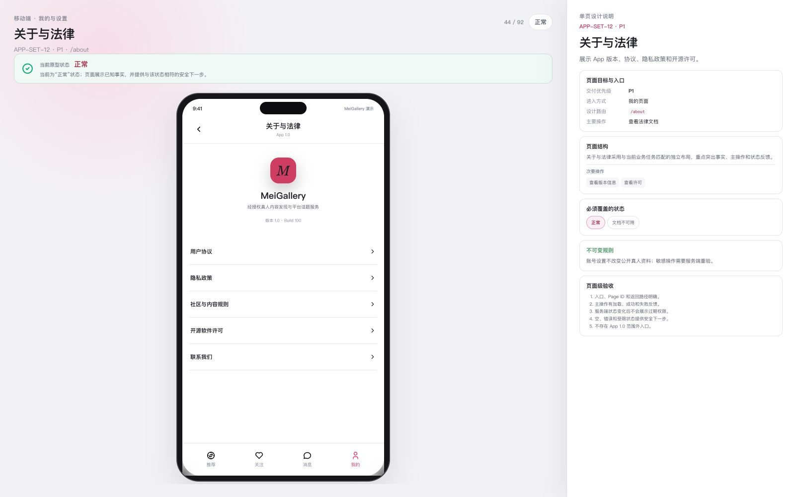

---

### 移动端 · 系统状态

本组共 5 个页面。实现、接口、测试和缺陷均按 Page ID 追踪。

#### APP-SYS-01 强制升级

**平台与模块：** 移动端 · 系统状态　　**优先级：** P1　　**设计路由：** `system://upgrade`

**用户价值：** 当当前版本无法安全支持服务端能力时阻止继续操作。

**适用角色：** 游客、观看者、会员

**前置条件：** 客户端已取得或尝试取得远程配置、会话和业务状态；缓存不得冒充最新事实。

**进入路径：** 启动检查或未知能力门槛

**页面结构：** 单一事实、影响范围和安全下一步居中呈现，不暴露内部风控细节。

**详细交互：** 用户从“启动检查或未知能力门槛”进入。主要操作为“更新 App”，执行时显示处理中状态；服务端确认成功后刷新权威数据并可进入 APP-AUTH-01「启动与会话恢复」。次要操作包括：返回、查看帮助。失败时保留已输入内容，展示可理解原因，并提供重试、返回或帮助入口。

**业务规则：** 缓存不能冒充最新事实；必须提供可理解原因和安全返回路径。

**数据与权限：** 只读取当前账号范围内的必要数据；所有写操作均由服务端鉴权、校验并返回权威状态。

**页面状态：** 必须升级、商店不可用

**Figma 最终稿映射：** `10｜Mobile Pages` → `APP-SYS-01`，共 2 个需求状态；在 [Figma 最终设计文件](https://www.figma.com/design/LaNSwwGsznwcpV8msj7BQC/Peachmote-UI-%E5%80%9F%E9%89%B4%E5%AE%A1%E6%9F%A5%E6%9D%BF---MeiGallery) 中按 Page ID 定位。

**实现追踪：**

- 追踪键：`APP-SYS-01 → PRD-FR-080 → SCP-FR-031,SCP-FR-032,SCP-FR-033 → App 1.0 范围/SCP-FR-*`
- 产品需求：`PRD-FR-080`
- 发布范围：`SCP-FR-031`、`SCP-FR-032`、`SCP-FR-033`
- 非功能要求：`PRD-NFR-001`、`PRD-NFR-004`、`PRD-NFR-006`、`PRD-NFR-007`、`PRD-NFR-008`
- 产品级验收：`PRD-AC-009`、`PRD-AC-010`
- 模块 PRD：[App 1.0 范围 发布范围与能力启用策略](../ways-of-work/plan/real-person-discovery-platform/app-1-0-release-scope/prd.md)（SCP-FR-*）

**开发验收：**

- 从“启动检查或未知能力门槛”能够进入，页面明确显示 APP-SYS-01、页面名称、设计路由和返回路径。
- 主要操作“更新 App”具有处理中、成功和失败反馈，重复提交不会产生不可控的重复业务结果。
- 页面覆盖“必须升级、商店不可用”状态，并在空、错误、受限或冲突时提供安全下一步。
- 服务端状态变化后不会继续展示过期权限、过期余额、失效认证或不可访问内容。
- 缓存不能冒充最新事实；必须提供可理解原因和安全返回路径。
- UI 层、状态层、数据层和服务端契约不得使用页面展示名称替代稳定 ID、rank、entitlement 或状态枚举。
- 加载、空、错误、离线、无权限、对象失效和服务端状态变化必须按本页状态集合安全收敛。

---

#### APP-SYS-02 服务维护

**平台与模块：** 移动端 · 系统状态　　**优先级：** P1　　**设计路由：** `system://maintenance`

**用户价值：** 说明服务暂不可用，缓存内容不代表最新事实。

**适用角色：** 游客、观看者、会员

**前置条件：** 客户端已取得或尝试取得远程配置、会话和业务状态；缓存不得冒充最新事实。

**进入路径：** 启动或任意服务请求

**页面结构：** 单一事实、影响范围和安全下一步居中呈现，不暴露内部风控细节。

**详细交互：** 用户从“启动或任意服务请求”进入。主要操作为“重新尝试”，执行时显示处理中状态；服务端确认成功后刷新权威数据并可进入 APP-AUTH-01「启动与会话恢复」。次要操作包括：查看帮助。失败时保留已输入内容，展示可理解原因，并提供重试、返回或帮助入口。

**业务规则：** 缓存不能冒充最新事实；必须提供可理解原因和安全返回路径。

**数据与权限：** 只读取当前账号范围内的必要数据；所有写操作均由服务端鉴权、校验并返回权威状态。

**页面状态：** 维护中、部分恢复

**Figma 最终稿映射：** `10｜Mobile Pages` → `APP-SYS-02`，共 2 个需求状态；在 [Figma 最终设计文件](https://www.figma.com/design/LaNSwwGsznwcpV8msj7BQC/Peachmote-UI-%E5%80%9F%E9%89%B4%E5%AE%A1%E6%9F%A5%E6%9D%BF---MeiGallery) 中按 Page ID 定位。

**实现追踪：**

- 追踪键：`APP-SYS-02 → PRD-FR-080 → SCP-FR-031,SCP-FR-032,SCP-FR-033 → App 1.0 范围/SCP-FR-*`
- 产品需求：`PRD-FR-080`
- 发布范围：`SCP-FR-031`、`SCP-FR-032`、`SCP-FR-033`
- 非功能要求：`PRD-NFR-001`、`PRD-NFR-004`、`PRD-NFR-006`、`PRD-NFR-007`、`PRD-NFR-008`
- 产品级验收：`PRD-AC-009`、`PRD-AC-010`
- 模块 PRD：[App 1.0 范围 发布范围与能力启用策略](../ways-of-work/plan/real-person-discovery-platform/app-1-0-release-scope/prd.md)（SCP-FR-*）

**开发验收：**

- 从“启动或任意服务请求”能够进入，页面明确显示 APP-SYS-02、页面名称、设计路由和返回路径。
- 主要操作“重新尝试”具有处理中、成功和失败反馈，重复提交不会产生不可控的重复业务结果。
- 页面覆盖“维护中、部分恢复”状态，并在空、错误、受限或冲突时提供安全下一步。
- 服务端状态变化后不会继续展示过期权限、过期余额、失效认证或不可访问内容。
- 缓存不能冒充最新事实；必须提供可理解原因和安全返回路径。
- UI 层、状态层、数据层和服务端契约不得使用页面展示名称替代稳定 ID、rank、entitlement 或状态枚举。
- 加载、空、错误、离线、无权限、对象失效和服务端状态变化必须按本页状态集合安全收敛。

---

#### APP-SYS-03 账号受限

**平台与模块：** 移动端 · 系统状态　　**优先级：** P0　　**设计路由：** `system://restricted`

**用户价值：** 展示限制范围、原因类别和申诉入口，不泄露内部规则。

**适用角色：** 游客、观看者、会员

**前置条件：** 客户端已取得或尝试取得远程配置、会话和业务状态；缓存不得冒充最新事实。

**进入路径：** 登录、敏感操作或安全事件

**页面结构：** 单一事实、影响范围和安全下一步居中呈现，不暴露内部风控细节。

**详细交互：** 用户从“登录、敏感操作或安全事件”进入。主要操作为“查看限制详情”，执行时显示处理中状态；服务端确认成功后刷新权威数据并可进入 APP-SET-08「申诉」。次要操作包括：申诉、退出账号。失败时保留已输入内容，展示可理解原因，并提供重试、返回或帮助入口。

**业务规则：** 缓存不能冒充最新事实；必须提供可理解原因和安全返回路径。

**数据与权限：** 只读取当前账号范围内的必要数据；所有写操作均由服务端鉴权、校验并返回权威状态。

**页面状态：** 部分受限、全部受限

**Figma 最终稿映射：** `10｜Mobile Pages` → `APP-SYS-03`，共 2 个需求状态；在 [Figma 最终设计文件](https://www.figma.com/design/LaNSwwGsznwcpV8msj7BQC/Peachmote-UI-%E5%80%9F%E9%89%B4%E5%AE%A1%E6%9F%A5%E6%9D%BF---MeiGallery) 中按 Page ID 定位。

**实现追踪：**

- 追踪键：`APP-SYS-03 → PRD-FR-001,PRD-FR-002,PRD-FR-082 → SCP-FR-031,SCP-FR-032,SCP-FR-033 → App 1.0 范围/SCP-FR-*`
- 产品需求：`PRD-FR-001`、`PRD-FR-002`、`PRD-FR-082`
- 发布范围：`SCP-FR-031`、`SCP-FR-032`、`SCP-FR-033`
- 非功能要求：`PRD-NFR-001`、`PRD-NFR-004`、`PRD-NFR-006`、`PRD-NFR-007`、`PRD-NFR-008`
- 产品级验收：`PRD-AC-009`、`PRD-AC-010`
- 模块 PRD：[App 1.0 范围 发布范围与能力启用策略](../ways-of-work/plan/real-person-discovery-platform/app-1-0-release-scope/prd.md)（SCP-FR-*）

**开发验收：**

- 从“登录、敏感操作或安全事件”能够进入，页面明确显示 APP-SYS-03、页面名称、设计路由和返回路径。
- 主要操作“查看限制详情”具有处理中、成功和失败反馈，重复提交不会产生不可控的重复业务结果。
- 页面覆盖“部分受限、全部受限”状态，并在空、错误、受限或冲突时提供安全下一步。
- 服务端状态变化后不会继续展示过期权限、过期余额、失效认证或不可访问内容。
- 缓存不能冒充最新事实；必须提供可理解原因和安全返回路径。
- UI 层、状态层、数据层和服务端契约不得使用页面展示名称替代稳定 ID、rank、entitlement 或状态枚举。
- 加载、空、错误、离线、无权限、对象失效和服务端状态变化必须按本页状态集合安全收敛。

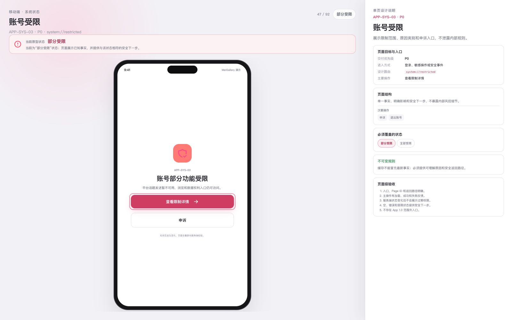

**P0 关键状态：** 全部受限

---

#### APP-SYS-04 对象不可用

**平台与模块：** 移动端 · 系统状态　　**优先级：** P0　　**设计路由：** `system://unavailable`

**用户价值：** 在资料、会话或通知目标失效时提供安全返回路径。

**适用角色：** 游客、观看者、会员

**前置条件：** 客户端已取得或尝试取得远程配置、会话和业务状态；缓存不得冒充最新事实。

**进入路径：** 对象深链或状态刷新

**页面结构：** 单一事实、影响范围和安全下一步居中呈现，不暴露内部风控细节。

**详细交互：** 用户从“对象深链或状态刷新”进入。主要操作为“返回推荐”，执行时显示处理中状态；服务端确认成功后刷新权威数据并可进入 APP-DSC-01「推荐首页」。次要操作包括：查看帮助。失败时保留已输入内容，展示可理解原因，并提供重试、返回或帮助入口。

**业务规则：** 缓存不能冒充最新事实；必须提供可理解原因和安全返回路径。

**数据与权限：** 只读取当前账号范围内的必要数据；所有写操作均由服务端鉴权、校验并返回权威状态。

**页面状态：** 已下架、无权限、已删除

**Figma 最终稿映射：** `10｜Mobile Pages` → `APP-SYS-04`，共 3 个需求状态；在 [Figma 最终设计文件](https://www.figma.com/design/LaNSwwGsznwcpV8msj7BQC/Peachmote-UI-%E5%80%9F%E9%89%B4%E5%AE%A1%E6%9F%A5%E6%9D%BF---MeiGallery) 中按 Page ID 定位。

**实现追踪：**

- 追踪键：`APP-SYS-04 → PRD-FR-013,PRD-FR-032 → SCP-FR-031,SCP-FR-032,SCP-FR-033 → App 1.0 范围/SCP-FR-*`
- 产品需求：`PRD-FR-013`、`PRD-FR-032`
- 发布范围：`SCP-FR-031`、`SCP-FR-032`、`SCP-FR-033`
- 非功能要求：`PRD-NFR-001`、`PRD-NFR-004`、`PRD-NFR-006`、`PRD-NFR-007`、`PRD-NFR-008`
- 产品级验收：`PRD-AC-009`、`PRD-AC-010`
- 模块 PRD：[App 1.0 范围 发布范围与能力启用策略](../ways-of-work/plan/real-person-discovery-platform/app-1-0-release-scope/prd.md)（SCP-FR-*）

**开发验收：**

- 从“对象深链或状态刷新”能够进入，页面明确显示 APP-SYS-04、页面名称、设计路由和返回路径。
- 主要操作“返回推荐”具有处理中、成功和失败反馈，重复提交不会产生不可控的重复业务结果。
- 页面覆盖“已下架、无权限、已删除”状态，并在空、错误、受限或冲突时提供安全下一步。
- 服务端状态变化后不会继续展示过期权限、过期余额、失效认证或不可访问内容。
- 缓存不能冒充最新事实；必须提供可理解原因和安全返回路径。
- UI 层、状态层、数据层和服务端契约不得使用页面展示名称替代稳定 ID、rank、entitlement 或状态枚举。
- 加载、空、错误、离线、无权限、对象失效和服务端状态变化必须按本页状态集合安全收敛。

**P0 关键状态：** 无权限

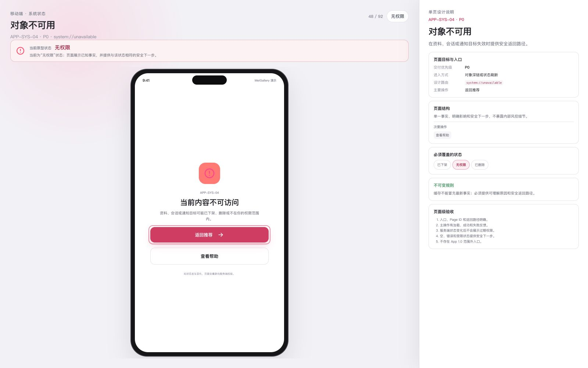

---

#### APP-SYS-05 地区不可用

**平台与模块：** 移动端 · 系统状态　　**优先级：** P1　　**设计路由：** `system://region`

**用户价值：** 说明当前地区尚未开放服务并停止业务入口。

**适用角色：** 游客、观看者、会员

**前置条件：** 客户端已取得或尝试取得远程配置、会话和业务状态；缓存不得冒充最新事实。

**进入路径：** 注册、登录或地区切换

**页面结构：** 单一事实、影响范围和安全下一步居中呈现，不暴露内部风控细节。

**详细交互：** 用户从“注册、登录或地区切换”进入。主要操作为“查看地区说明”，执行时显示处理中状态；服务端确认成功后刷新权威数据并可进入 APP-AUTH-01「启动与会话恢复」。次要操作包括：退出。失败时保留已输入内容，展示可理解原因，并提供重试、返回或帮助入口。

**业务规则：** 缓存不能冒充最新事实；必须提供可理解原因和安全返回路径。

**数据与权限：** 只读取当前账号范围内的必要数据；所有写操作均由服务端鉴权、校验并返回权威状态。

**页面状态：** 未开放、政策变化

**Figma 最终稿映射：** `10｜Mobile Pages` → `APP-SYS-05`，共 2 个需求状态；在 [Figma 最终设计文件](https://www.figma.com/design/LaNSwwGsznwcpV8msj7BQC/Peachmote-UI-%E5%80%9F%E9%89%B4%E5%AE%A1%E6%9F%A5%E6%9D%BF---MeiGallery) 中按 Page ID 定位。

**实现追踪：**

- 追踪键：`APP-SYS-05 → PRD-FR-020,PRD-FR-022 → SCP-FR-031,SCP-FR-032,SCP-FR-033 → App 1.0 范围/SCP-FR-*`
- 产品需求：`PRD-FR-020`、`PRD-FR-022`
- 发布范围：`SCP-FR-031`、`SCP-FR-032`、`SCP-FR-033`
- 非功能要求：`PRD-NFR-001`、`PRD-NFR-004`、`PRD-NFR-006`、`PRD-NFR-007`、`PRD-NFR-008`
- 产品级验收：`PRD-AC-009`、`PRD-AC-010`
- 模块 PRD：[App 1.0 范围 发布范围与能力启用策略](../ways-of-work/plan/real-person-discovery-platform/app-1-0-release-scope/prd.md)（SCP-FR-*）

**开发验收：**

- 从“注册、登录或地区切换”能够进入，页面明确显示 APP-SYS-05、页面名称、设计路由和返回路径。
- 主要操作“查看地区说明”具有处理中、成功和失败反馈，重复提交不会产生不可控的重复业务结果。
- 页面覆盖“未开放、政策变化”状态，并在空、错误、受限或冲突时提供安全下一步。
- 服务端状态变化后不会继续展示过期权限、过期余额、失效认证或不可访问内容。
- 缓存不能冒充最新事实；必须提供可理解原因和安全返回路径。
- UI 层、状态层、数据层和服务端契约不得使用页面展示名称替代稳定 ID、rank、entitlement 或状态枚举。
- 加载、空、错误、离线、无权限、对象失效和服务端状态变化必须按本页状态集合安全收敛。

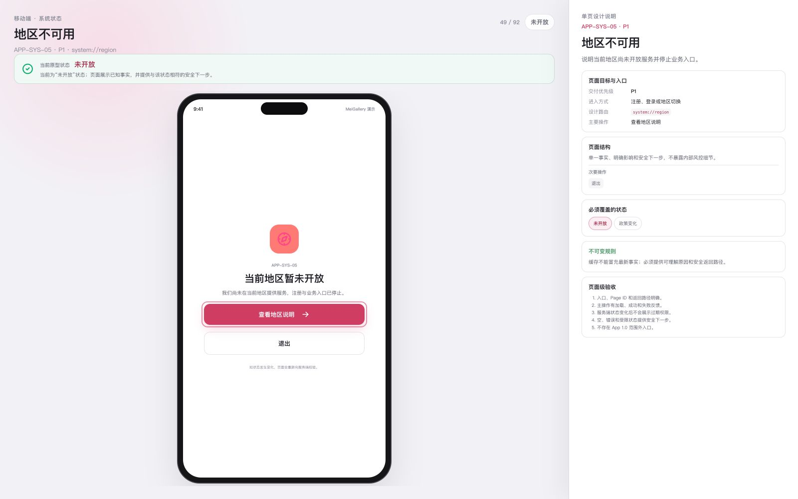

---

### 管理后台 · 总览与异常

本组共 3 个页面。实现、接口、测试和缺陷均按 Page ID 追踪。

#### ADM-OV-01 运营总览

**平台与模块：** 管理后台 · 总览与异常　　**优先级：** P1　　**设计路由：** `/admin/app`

**用户价值：** 按权限范围汇总供给、发现、消息、会员、钱包、安全与平台健康。

**适用角色：** Owner、运营主管、安全主管

**前置条件：** 管理员已登录，并同时满足角色 capability、对象范围、数据版本和必要的独立复核条件。

**进入路径：** 后台登录后的默认首页

**页面结构：** 指标摘要、质量状态和专题入口分层，未知值不显示为零。

**详细交互：** 用户从“后台登录后的默认首页”进入。主要操作为“进入专题”，执行时显示处理中状态；服务端确认成功后刷新权威数据并可进入 ADM-OV-02「异常中心」。次要操作包括：切换范围、切换时间。失败时保留已输入内容，展示可理解原因，并提供重试、返回或帮助入口。

**业务规则：** 后台写操作必须经过 capability、对象范围、版本检查和不可删除审计。

**数据与权限：** 管理员 API 与公开 API 分离；读取和写入同时校验 capability、对象范围、版本与审计要求。

**页面状态：** 正常、数据延迟、质量异常、部分无权限

**Figma 最终稿映射：** `20｜Admin Pages` → `ADM-OV-01`，共 4 个需求状态；在 [Figma 最终设计文件](https://www.figma.com/design/LaNSwwGsznwcpV8msj7BQC/Peachmote-UI-%E5%80%9F%E9%89%B4%E5%AE%A1%E6%9F%A5%E6%9D%BF---MeiGallery) 中按 Page ID 定位。

**实现追踪：**

- 追踪键：`ADM-OV-01 → PRD-FR-090,PRD-FR-091,PRD-FR-092 → SCP-FR-012,SCP-FR-014,SCP-FR-015 → A-13/OAU-FR-*`
- 产品需求：`PRD-FR-090`、`PRD-FR-091`、`PRD-FR-092`
- 发布范围：`SCP-FR-012`、`SCP-FR-014`、`SCP-FR-015`
- 非功能要求：`PRD-NFR-001`、`PRD-NFR-002`、`PRD-NFR-003`、`PRD-NFR-004`、`PRD-NFR-005`、`PRD-NFR-006`、`PRD-NFR-007`、`PRD-NFR-008`
- 产品级验收：`PRD-AC-010`
- 模块 PRD：[A-13 运营看板、审计日志与异常追踪](../ways-of-work/plan/real-person-discovery-platform/operations-dashboard-and-audit-log/prd.md)（OAU-FR-*）

**开发验收：**

- 从“后台登录后的默认首页”能够进入，页面明确显示 ADM-OV-01、页面名称、设计路由和返回路径。
- 主要操作“进入专题”具有处理中、成功和失败反馈，重复提交不会产生不可控的重复业务结果。
- 页面覆盖“正常、数据延迟、质量异常、部分无权限”状态，并在空、错误、受限或冲突时提供安全下一步。
- 服务端状态变化后不会继续展示过期权限、过期余额、失效认证或不可访问内容。
- 后台写操作必须经过 capability、对象范围、版本检查和不可删除审计。
- UI 层、状态层、数据层和服务端契约不得使用页面展示名称替代稳定 ID、rank、entitlement 或状态枚举。
- 加载、空、错误、离线、无权限、对象失效和服务端状态变化必须按本页状态集合安全收敛。

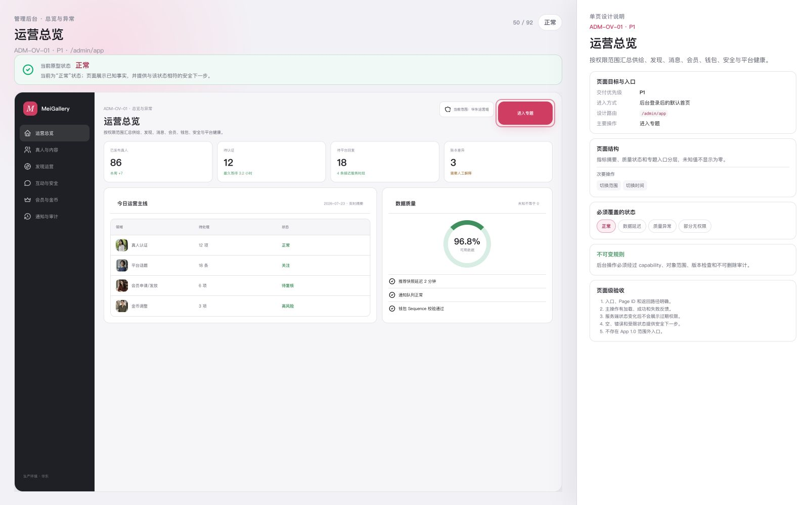

---

#### ADM-OV-02 异常中心

**平台与模块：** 管理后台 · 总览与异常　　**优先级：** P2　　**设计路由：** `/admin/app/incidents`

**用户价值：** 集中处理跨领域异常、优先级、责任人与 Runbook。

**适用角色：** Owner、运营主管、安全主管

**前置条件：** 管理员已登录，并同时满足角色 capability、对象范围、数据版本和必要的独立复核条件。

**进入路径：** 运营总览异常卡或全局任务入口

**页面结构：** 筛选、范围、等待时间、状态和列表详情入口保持稳定。

**详细交互：** 用户从“运营总览异常卡或全局任务入口”进入。主要操作为“认领异常”，执行时显示处理中状态；服务端确认成功后刷新权威数据并可进入 ADM-OV-03「异常详情」。次要操作包括：筛选优先级、关联 Runbook。失败时保留已输入内容，展示可理解原因，并提供重试、返回或帮助入口。

**业务规则：** 后台写操作必须经过 capability、对象范围、版本检查和不可删除审计。

**数据与权限：** 管理员 API 与公开 API 分离；读取和写入同时校验 capability、对象范围、版本与审计要求。

**页面状态：** 正常、P0/P1、未分配、已缓解

**Figma 最终稿映射：** `20｜Admin Pages` → `ADM-OV-02`，共 4 个需求状态；在 [Figma 最终设计文件](https://www.figma.com/design/LaNSwwGsznwcpV8msj7BQC/Peachmote-UI-%E5%80%9F%E9%89%B4%E5%AE%A1%E6%9F%A5%E6%9D%BF---MeiGallery) 中按 Page ID 定位。

**实现追踪：**

- 追踪键：`ADM-OV-02 → PRD-FR-090,PRD-FR-091,PRD-FR-092 → SCP-FR-012,SCP-FR-014,SCP-FR-015 → A-13/OAU-FR-*`
- 产品需求：`PRD-FR-090`、`PRD-FR-091`、`PRD-FR-092`
- 发布范围：`SCP-FR-012`、`SCP-FR-014`、`SCP-FR-015`
- 非功能要求：`PRD-NFR-001`、`PRD-NFR-002`、`PRD-NFR-003`、`PRD-NFR-004`、`PRD-NFR-005`、`PRD-NFR-006`、`PRD-NFR-007`、`PRD-NFR-008`
- 产品级验收：`PRD-AC-010`
- 模块 PRD：[A-13 运营看板、审计日志与异常追踪](../ways-of-work/plan/real-person-discovery-platform/operations-dashboard-and-audit-log/prd.md)（OAU-FR-*）

**开发验收：**

- 从“运营总览异常卡或全局任务入口”能够进入，页面明确显示 ADM-OV-02、页面名称、设计路由和返回路径。
- 主要操作“认领异常”具有处理中、成功和失败反馈，重复提交不会产生不可控的重复业务结果。
- 页面覆盖“正常、P0/P1、未分配、已缓解”状态，并在空、错误、受限或冲突时提供安全下一步。
- 服务端状态变化后不会继续展示过期权限、过期余额、失效认证或不可访问内容。
- 后台写操作必须经过 capability、对象范围、版本检查和不可删除审计。
- UI 层、状态层、数据层和服务端契约不得使用页面展示名称替代稳定 ID、rank、entitlement 或状态枚举。
- 加载、空、错误、离线、无权限、对象失效和服务端状态变化必须按本页状态集合安全收敛。

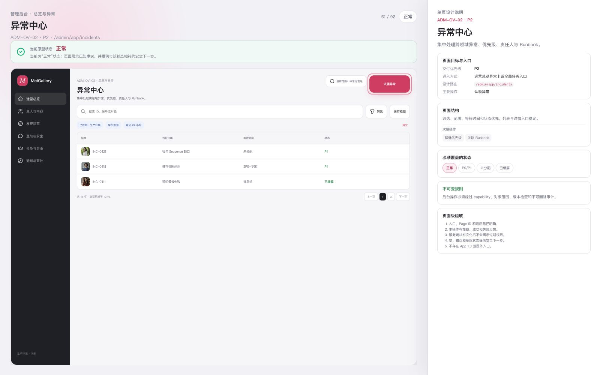

---

#### ADM-OV-03 异常详情

**平台与模块：** 管理后台 · 总览与异常　　**优先级：** P2　　**设计路由：** `/admin/app/incidents/{id}`

**用户价值：** 记录影响、时间线、处置动作和受控安全开关。

**适用角色：** Owner、运营主管、安全主管

**前置条件：** 管理员已登录，并同时满足角色 capability、对象范围、数据版本和必要的独立复核条件。

**进入路径：** 异常中心

**页面结构：** 异常事实、影响对象、处置状态和后续动作集中展示。

**详细交互：** 用户从“异常中心”进入。主要操作为“添加处置记录”，执行时显示处理中状态；服务端确认成功后刷新权威数据并可进入 ADM-OV-02「异常中心」。次要操作包括：更新状态、执行安全开关、关闭异常。失败时保留已输入内容，展示可理解原因，并提供重试、返回或帮助入口。

**业务规则：** 后台写操作必须经过 capability、对象范围、版本检查和不可删除审计。

**数据与权限：** 管理员 API 与公开 API 分离；读取和写入同时校验 capability、对象范围、版本与审计要求。

**页面状态：** 正常、影响扩大、并发更新、证据不足

**Figma 最终稿映射：** `20｜Admin Pages` → `ADM-OV-03`，共 4 个需求状态；在 [Figma 最终设计文件](https://www.figma.com/design/LaNSwwGsznwcpV8msj7BQC/Peachmote-UI-%E5%80%9F%E9%89%B4%E5%AE%A1%E6%9F%A5%E6%9D%BF---MeiGallery) 中按 Page ID 定位。

**实现追踪：**

- 追踪键：`ADM-OV-03 → PRD-FR-090,PRD-FR-091,PRD-FR-092 → SCP-FR-012,SCP-FR-014,SCP-FR-015 → A-13/OAU-FR-*`
- 产品需求：`PRD-FR-090`、`PRD-FR-091`、`PRD-FR-092`
- 发布范围：`SCP-FR-012`、`SCP-FR-014`、`SCP-FR-015`
- 非功能要求：`PRD-NFR-001`、`PRD-NFR-002`、`PRD-NFR-003`、`PRD-NFR-004`、`PRD-NFR-005`、`PRD-NFR-006`、`PRD-NFR-007`、`PRD-NFR-008`
- 产品级验收：`PRD-AC-010`
- 模块 PRD：[A-13 运营看板、审计日志与异常追踪](../ways-of-work/plan/real-person-discovery-platform/operations-dashboard-and-audit-log/prd.md)（OAU-FR-*）

**开发验收：**

- 从“异常中心”能够进入，页面明确显示 ADM-OV-03、页面名称、设计路由和返回路径。
- 主要操作“添加处置记录”具有处理中、成功和失败反馈，重复提交不会产生不可控的重复业务结果。
- 页面覆盖“正常、影响扩大、并发更新、证据不足”状态，并在空、错误、受限或冲突时提供安全下一步。
- 服务端状态变化后不会继续展示过期权限、过期余额、失效认证或不可访问内容。
- 后台写操作必须经过 capability、对象范围、版本检查和不可删除审计。
- UI 层、状态层、数据层和服务端契约不得使用页面展示名称替代稳定 ID、rank、entitlement 或状态枚举。
- 加载、空、错误、离线、无权限、对象失效和服务端状态变化必须按本页状态集合安全收敛。

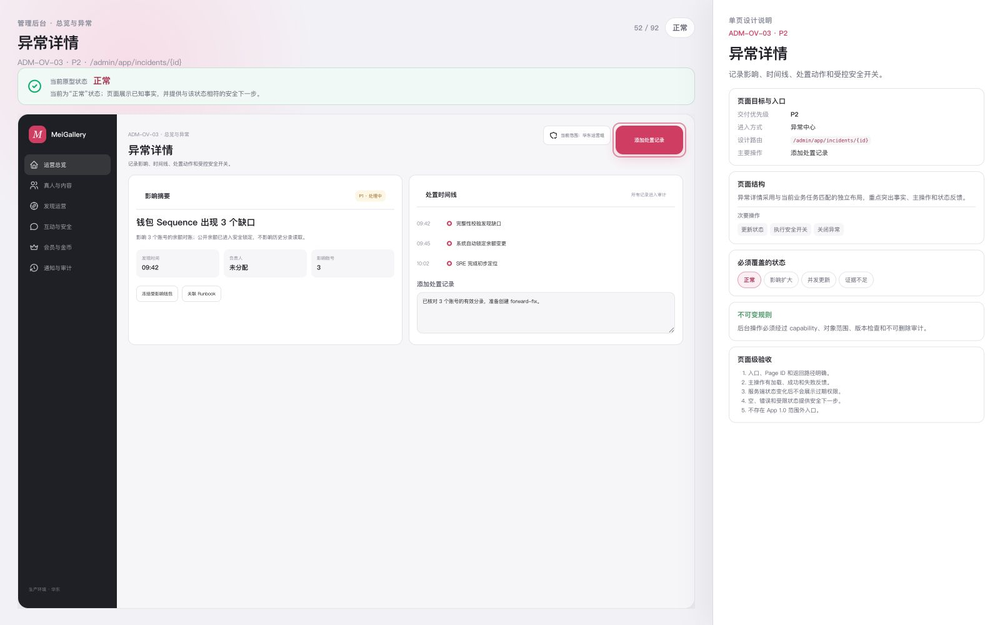

---

### 管理后台 · 真人与内容

本组共 6 个页面。实现、接口、测试和缺陷均按 Page ID 追踪。

#### ADM-PER-01 真人列表

**平台与模块：** 管理后台 · 真人与内容　　**优先级：** P0　　**设计路由：** `/admin/app/persons`

**用户价值：** 管理真人草稿、认证和发布双状态，并进入新建或审核。

**适用角色：** 内容编辑、合规审核、发布者、Owner

**前置条件：** 管理员已登录，并同时满足角色 capability、对象范围、数据版本和必要的独立复核条件。

**进入路径：** 真人与内容导航

**页面结构：** 筛选、批量动作、业务表格、分页和审计入口组成标准后台列表。

**详细交互：** 用户从“真人与内容导航”进入。主要操作为“新建真人”，执行时显示处理中状态；服务端确认成功后刷新权威数据并可进入 ADM-PER-02「手动新建真人」。次要操作包括：批量导入、筛选状态、进入审核。失败时保留已输入内容，展示可理解原因，并提供重试、返回或帮助入口。

**业务规则：** 只有管理员创建或导入真人资料；认证、授权、审核和发布状态必须可追溯。

**数据与权限：** 管理员 API 与公开 API 分离；读取和写入同时校验 capability、对象范围、版本与审计要求。

**页面状态：** 正常、草稿、待审、已发布、已暂停、争议

**Figma 最终稿映射：** `20｜Admin Pages` → `ADM-PER-01`，共 6 个需求状态；在 [Figma 最终设计文件](https://www.figma.com/design/LaNSwwGsznwcpV8msj7BQC/Peachmote-UI-%E5%80%9F%E9%89%B4%E5%AE%A1%E6%9F%A5%E6%9D%BF---MeiGallery) 中按 Page ID 定位。

**实现追踪：**

- 追踪键：`ADM-PER-01 → PRD-FR-010,PRD-FR-011,PRD-FR-012,PRD-FR-013,PRD-FR-090,PRD-FR-091,PRD-FR-092 → SCP-FR-012,SCP-FR-014 → A-01–A-02/SRC-FR-*`
- 产品需求：`PRD-FR-010`、`PRD-FR-011`、`PRD-FR-012`、`PRD-FR-013`、`PRD-FR-090`、`PRD-FR-091`、`PRD-FR-092`
- 发布范围：`SCP-FR-012`、`SCP-FR-014`
- 非功能要求：`PRD-NFR-001`、`PRD-NFR-002`、`PRD-NFR-003`、`PRD-NFR-005`、`PRD-NFR-006`、`PRD-NFR-007`、`PRD-NFR-008`
- 产品级验收：`PRD-AC-001`、`PRD-AC-002`、`PRD-AC-010`
- 模块 PRD：[A-01–A-02 真人来源、上传与 MeiGallery 导入](../ways-of-work/plan/real-person-discovery-platform/person-source-upload-and-meigallery-import/prd.md)（SRC-FR-*）

**开发验收：**

- 从“真人与内容导航”能够进入，页面明确显示 ADM-PER-01、页面名称、设计路由和返回路径。
- 主要操作“新建真人”具有处理中、成功和失败反馈，重复提交不会产生不可控的重复业务结果。
- 页面覆盖“正常、草稿、待审、已发布、已暂停、争议”状态，并在空、错误、受限或冲突时提供安全下一步。
- 服务端状态变化后不会继续展示过期权限、过期余额、失效认证或不可访问内容。
- 只有管理员创建或导入真人资料；认证、授权、审核和发布状态必须可追溯。
- UI 层、状态层、数据层和服务端契约不得使用页面展示名称替代稳定 ID、rank、entitlement 或状态枚举。
- 加载、空、错误、离线、无权限、对象失效和服务端状态变化必须按本页状态集合安全收敛。

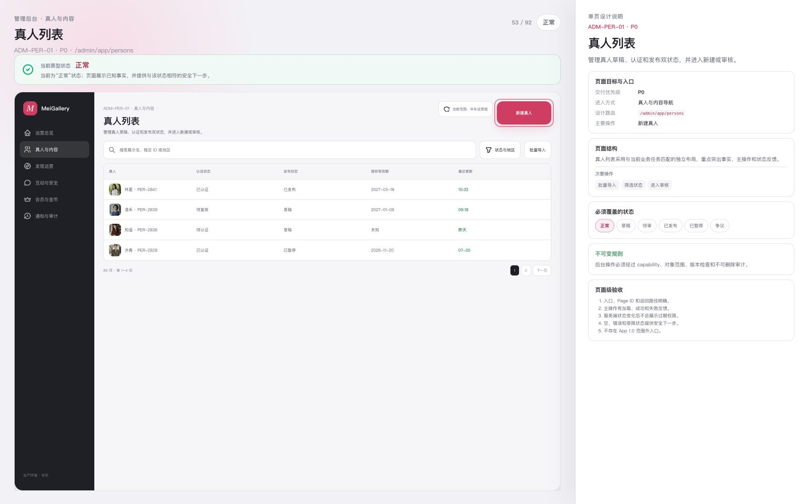

**P0 关键状态：** 争议

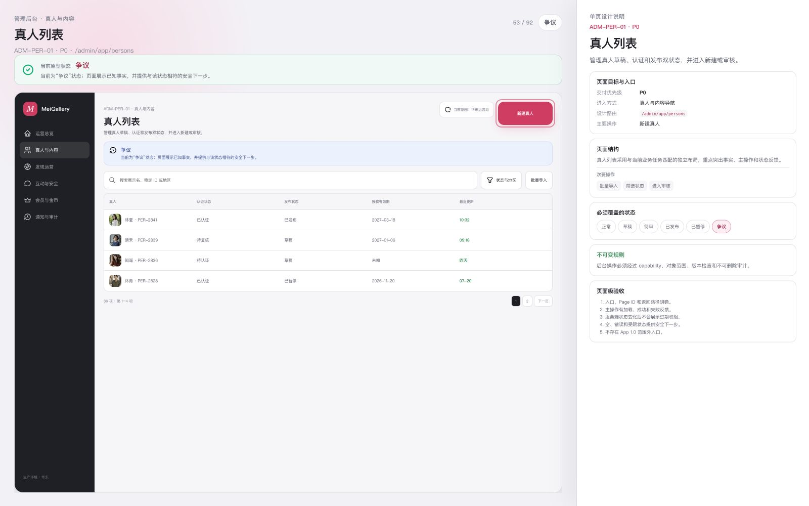

---

#### ADM-PER-02 手动新建真人

**平台与模块：** 管理后台 · 真人与内容　　**优先级：** P0　　**设计路由：** `/admin/app/persons/new`

**用户价值：** 创建带来源、授权、主体和媒体信息的真人草稿。

**适用角色：** 内容编辑、合规审核、发布者、Owner

**前置条件：** 管理员已登录，并同时满足角色 capability、对象范围、数据版本和必要的独立复核条件。

**进入路径：** 真人列表主操作

**页面结构：** 对象事实、表单字段、风险提示、预览和提交动作按任务顺序组织。

**详细交互：** 用户从“真人列表主操作”进入。主要操作为“保存草稿”，执行时显示处理中状态；服务端确认成功后刷新权威数据并可进入 ADM-PER-03「真人工作台」。次要操作包括：提交认证、检测重复。失败时保留已输入内容，展示可理解原因，并提供重试、返回或帮助入口。

**业务规则：** 只有管理员创建或导入真人资料；认证、授权、审核和发布状态必须可追溯。

**数据与权限：** 管理员 API 与公开 API 分离；读取和写入同时校验 capability、对象范围、版本与审计要求。

**页面状态：** 正常、缺少来源、重复候选、媒体失败

**Figma 最终稿映射：** `20｜Admin Pages` → `ADM-PER-02`，共 4 个需求状态；在 [Figma 最终设计文件](https://www.figma.com/design/LaNSwwGsznwcpV8msj7BQC/Peachmote-UI-%E5%80%9F%E9%89%B4%E5%AE%A1%E6%9F%A5%E6%9D%BF---MeiGallery) 中按 Page ID 定位。

**实现追踪：**

- 追踪键：`ADM-PER-02 → PRD-FR-010,PRD-FR-011,PRD-FR-012,PRD-FR-013,PRD-FR-090,PRD-FR-091,PRD-FR-092 → SCP-FR-012,SCP-FR-014 → A-01–A-02/SRC-FR-*`
- 产品需求：`PRD-FR-010`、`PRD-FR-011`、`PRD-FR-012`、`PRD-FR-013`、`PRD-FR-090`、`PRD-FR-091`、`PRD-FR-092`
- 发布范围：`SCP-FR-012`、`SCP-FR-014`
- 非功能要求：`PRD-NFR-001`、`PRD-NFR-002`、`PRD-NFR-003`、`PRD-NFR-005`、`PRD-NFR-006`、`PRD-NFR-007`、`PRD-NFR-008`
- 产品级验收：`PRD-AC-001`、`PRD-AC-002`、`PRD-AC-010`
- 模块 PRD：[A-01–A-02 真人来源、上传与 MeiGallery 导入](../ways-of-work/plan/real-person-discovery-platform/person-source-upload-and-meigallery-import/prd.md)（SRC-FR-*）

**开发验收：**

- 从“真人列表主操作”能够进入，页面明确显示 ADM-PER-02、页面名称、设计路由和返回路径。
- 主要操作“保存草稿”具有处理中、成功和失败反馈，重复提交不会产生不可控的重复业务结果。
- 页面覆盖“正常、缺少来源、重复候选、媒体失败”状态，并在空、错误、受限或冲突时提供安全下一步。
- 服务端状态变化后不会继续展示过期权限、过期余额、失效认证或不可访问内容。
- 只有管理员创建或导入真人资料；认证、授权、审核和发布状态必须可追溯。
- UI 层、状态层、数据层和服务端契约不得使用页面展示名称替代稳定 ID、rank、entitlement 或状态枚举。
- 加载、空、错误、离线、无权限、对象失效和服务端状态变化必须按本页状态集合安全收敛。

**P0 关键状态：** 媒体失败

---

#### ADM-PER-03 真人工作台

**平台与模块：** 管理后台 · 真人与内容　　**优先级：** P0　　**设计路由：** `/admin/app/persons/{id}`

**用户价值：** 在版本化工作台中分区维护事实、草稿、认证和发布状态。

**适用角色：** 内容编辑、合规审核、发布者、Owner

**前置条件：** 管理员已登录，并同时满足角色 capability、对象范围、数据版本和必要的独立复核条件。

**进入路径：** 真人列表或导入结果

**页面结构：** 素材、资料编辑、校验结果和发布准备区并列，支持逐步保存。

**详细交互：** 用户从“真人列表或导入结果”进入。主要操作为“发起认证审核”，执行时显示处理中状态；服务端确认成功后刷新权威数据并可进入 ADM-PER-05「认证审核」。次要操作包括：编辑草稿、查看版本、预览 App。失败时保留已输入内容，展示可理解原因，并提供重试、返回或帮助入口。

**业务规则：** 只有管理员创建或导入真人资料；认证、授权、审核和发布状态必须可追溯。

**数据与权限：** 管理员 API 与公开 API 分离；读取和写入同时校验 capability、对象范围、版本与审计要求。

**页面状态：** 正常、认证待审、发布待审、授权过期

**Figma 最终稿映射：** `20｜Admin Pages` → `ADM-PER-03`，共 4 个需求状态；在 [Figma 最终设计文件](https://www.figma.com/design/LaNSwwGsznwcpV8msj7BQC/Peachmote-UI-%E5%80%9F%E9%89%B4%E5%AE%A1%E6%9F%A5%E6%9D%BF---MeiGallery) 中按 Page ID 定位。

**实现追踪：**

- 追踪键：`ADM-PER-03 → PRD-FR-010,PRD-FR-011,PRD-FR-012,PRD-FR-013,PRD-FR-090,PRD-FR-091,PRD-FR-092 → SCP-FR-012,SCP-FR-014 → A-01–A-02/SRC-FR-*`
- 产品需求：`PRD-FR-010`、`PRD-FR-011`、`PRD-FR-012`、`PRD-FR-013`、`PRD-FR-090`、`PRD-FR-091`、`PRD-FR-092`
- 发布范围：`SCP-FR-012`、`SCP-FR-014`
- 非功能要求：`PRD-NFR-001`、`PRD-NFR-002`、`PRD-NFR-003`、`PRD-NFR-005`、`PRD-NFR-006`、`PRD-NFR-007`、`PRD-NFR-008`
- 产品级验收：`PRD-AC-001`、`PRD-AC-002`、`PRD-AC-010`
- 模块 PRD：[A-01–A-02 真人来源、上传与 MeiGallery 导入](../ways-of-work/plan/real-person-discovery-platform/person-source-upload-and-meigallery-import/prd.md)（SRC-FR-*）

**开发验收：**

- 从“真人列表或导入结果”能够进入，页面明确显示 ADM-PER-03、页面名称、设计路由和返回路径。
- 主要操作“发起认证审核”具有处理中、成功和失败反馈，重复提交不会产生不可控的重复业务结果。
- 页面覆盖“正常、认证待审、发布待审、授权过期”状态，并在空、错误、受限或冲突时提供安全下一步。
- 服务端状态变化后不会继续展示过期权限、过期余额、失效认证或不可访问内容。
- 只有管理员创建或导入真人资料；认证、授权、审核和发布状态必须可追溯。
- UI 层、状态层、数据层和服务端契约不得使用页面展示名称替代稳定 ID、rank、entitlement 或状态枚举。
- 加载、空、错误、离线、无权限、对象失效和服务端状态变化必须按本页状态集合安全收敛。

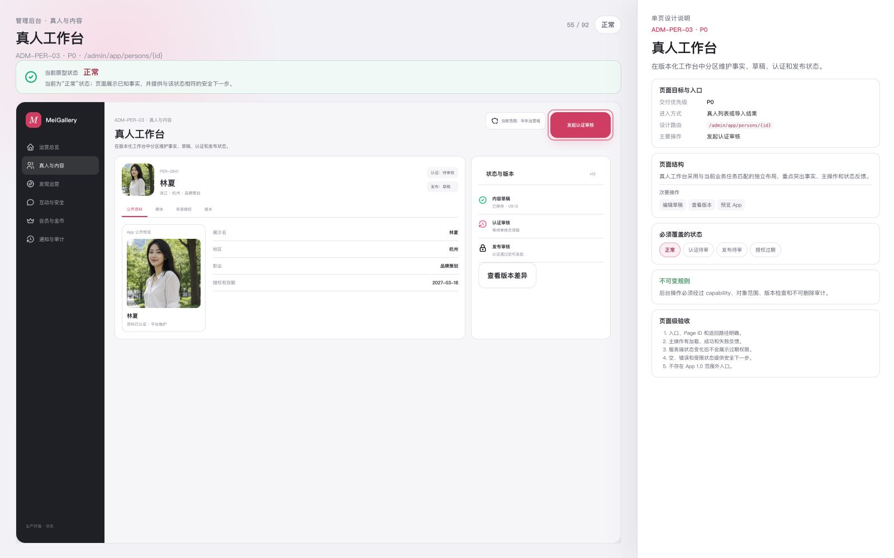

**P0 关键状态：** 授权过期

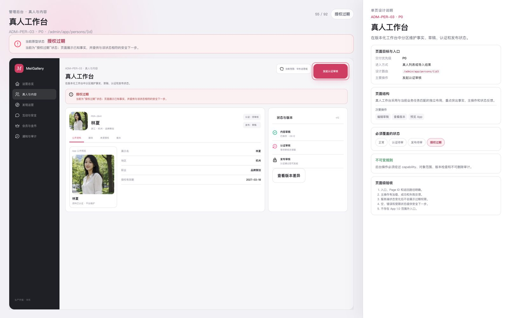

---

#### ADM-PER-04 导入任务

**平台与模块：** 管理后台 · 真人与内容　　**优先级：** P0　　**设计路由：** `/admin/app/imports`

**用户价值：** 上传或引用导入包，逐项校验并允许部分失败重试。

**适用角色：** 内容编辑、合规审核、发布者、Owner

**前置条件：** 管理员已登录，并同时满足角色 capability、对象范围、数据版本和必要的独立复核条件。

**进入路径：** 真人列表批量导入

**页面结构：** 上传、解析、逐项校验、部分成功和失败重试形成批量导入闭环。

**详细交互：** 用户从“真人列表批量导入”进入。主要操作为“执行导入”，执行时显示处理中状态；服务端确认成功后刷新权威数据并可进入 ADM-PER-03「真人工作台」。次要操作包括：上传包、查看失败、重试失败项。失败时保留已输入内容，展示可理解原因，并提供重试、返回或帮助入口。

**业务规则：** 只有管理员创建或导入真人资料；认证、授权、审核和发布状态必须可追溯。

**数据与权限：** 管理员 API 与公开 API 分离；读取和写入同时校验 capability、对象范围、版本与审计要求。

**页面状态：** 正常、校验中、部分失败、已暂停、已完成

**Figma 最终稿映射：** `20｜Admin Pages` → `ADM-PER-04`，共 5 个需求状态；在 [Figma 最终设计文件](https://www.figma.com/design/LaNSwwGsznwcpV8msj7BQC/Peachmote-UI-%E5%80%9F%E9%89%B4%E5%AE%A1%E6%9F%A5%E6%9D%BF---MeiGallery) 中按 Page ID 定位。

**实现追踪：**

- 追踪键：`ADM-PER-04 → PRD-FR-010,PRD-FR-011,PRD-FR-012,PRD-FR-013,PRD-FR-090,PRD-FR-091,PRD-FR-092 → SCP-FR-012,SCP-FR-014 → A-01–A-02/SRC-FR-*`
- 产品需求：`PRD-FR-010`、`PRD-FR-011`、`PRD-FR-012`、`PRD-FR-013`、`PRD-FR-090`、`PRD-FR-091`、`PRD-FR-092`
- 发布范围：`SCP-FR-012`、`SCP-FR-014`
- 非功能要求：`PRD-NFR-001`、`PRD-NFR-002`、`PRD-NFR-003`、`PRD-NFR-005`、`PRD-NFR-006`、`PRD-NFR-007`、`PRD-NFR-008`
- 产品级验收：`PRD-AC-001`、`PRD-AC-002`、`PRD-AC-010`
- 模块 PRD：[A-01–A-02 真人来源、上传与 MeiGallery 导入](../ways-of-work/plan/real-person-discovery-platform/person-source-upload-and-meigallery-import/prd.md)（SRC-FR-*）

**开发验收：**

- 从“真人列表批量导入”能够进入，页面明确显示 ADM-PER-04、页面名称、设计路由和返回路径。
- 主要操作“执行导入”具有处理中、成功和失败反馈，重复提交不会产生不可控的重复业务结果。
- 页面覆盖“正常、校验中、部分失败、已暂停、已完成”状态，并在空、错误、受限或冲突时提供安全下一步。
- 服务端状态变化后不会继续展示过期权限、过期余额、失效认证或不可访问内容。
- 只有管理员创建或导入真人资料；认证、授权、审核和发布状态必须可追溯。
- UI 层、状态层、数据层和服务端契约不得使用页面展示名称替代稳定 ID、rank、entitlement 或状态枚举。
- 加载、空、错误、离线、无权限、对象失效和服务端状态变化必须按本页状态集合安全收敛。

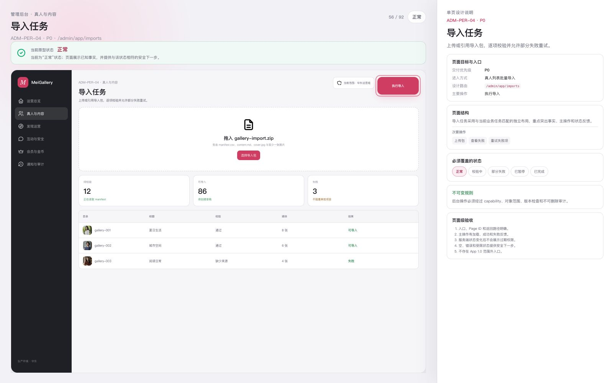

**P0 关键状态：** 部分失败

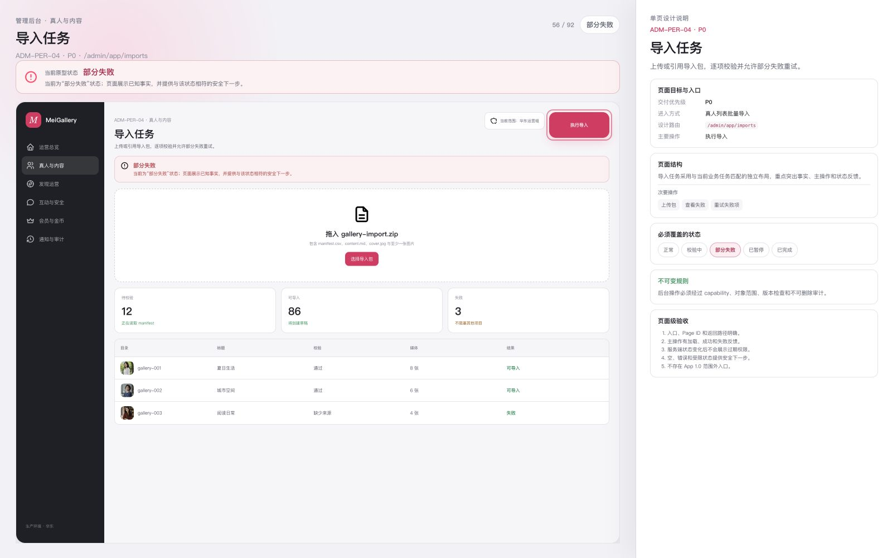

---

#### ADM-PER-05 认证审核

**平台与模块：** 管理后台 · 真人与内容　　**优先级：** P0　　**设计路由：** `/admin/app/verifications/{id}`

**用户价值：** 独立检查主体存在性、成年、授权范围、资料一致性与媒体权利。

**适用角色：** 内容编辑、合规审核、发布者、Owner

**前置条件：** 管理员已登录，并同时满足角色 capability、对象范围、数据版本和必要的独立复核条件。

**进入路径：** 真人工作台提交认证

**页面结构：** 锁定版本预览与审核检查并列，编辑和批准职责分离。

**详细交互：** 用户从“真人工作台提交认证”进入。主要操作为“通过认证”，执行时显示处理中状态；服务端确认成功后刷新权威数据并可进入 ADM-PER-06「发布审核」。次要操作包括：退回补充、拒绝、升级法务。失败时保留已输入内容，展示可理解原因，并提供重试、返回或帮助入口。

**业务规则：** 只有管理员创建或导入真人资料；认证、授权、审核和发布状态必须可追溯。

**数据与权限：** 管理员 API 与公开 API 分离；读取和写入同时校验 capability、对象范围、版本与审计要求。

**页面状态：** 正常、证据不足、版本冲突、需要复核

**Figma 最终稿映射：** `20｜Admin Pages` → `ADM-PER-05`，共 4 个需求状态；在 [Figma 最终设计文件](https://www.figma.com/design/LaNSwwGsznwcpV8msj7BQC/Peachmote-UI-%E5%80%9F%E9%89%B4%E5%AE%A1%E6%9F%A5%E6%9D%BF---MeiGallery) 中按 Page ID 定位。

**实现追踪：**

- 追踪键：`ADM-PER-05 → PRD-FR-010,PRD-FR-011,PRD-FR-012,PRD-FR-013,PRD-FR-090,PRD-FR-091,PRD-FR-092 → SCP-FR-012,SCP-FR-014 → A-03/VER-FR-*`
- 产品需求：`PRD-FR-010`、`PRD-FR-011`、`PRD-FR-012`、`PRD-FR-013`、`PRD-FR-090`、`PRD-FR-091`、`PRD-FR-092`
- 发布范围：`SCP-FR-012`、`SCP-FR-014`
- 非功能要求：`PRD-NFR-001`、`PRD-NFR-002`、`PRD-NFR-003`、`PRD-NFR-005`、`PRD-NFR-006`、`PRD-NFR-007`、`PRD-NFR-008`
- 产品级验收：`PRD-AC-001`、`PRD-AC-002`、`PRD-AC-010`
- 模块 PRD：[A-03 真人认证与发布审核](../ways-of-work/plan/real-person-discovery-platform/person-verification-and-publication/prd.md)（VER-FR-*）

**开发验收：**

- 从“真人工作台提交认证”能够进入，页面明确显示 ADM-PER-05、页面名称、设计路由和返回路径。
- 主要操作“通过认证”具有处理中、成功和失败反馈，重复提交不会产生不可控的重复业务结果。
- 页面覆盖“正常、证据不足、版本冲突、需要复核”状态，并在空、错误、受限或冲突时提供安全下一步。
- 服务端状态变化后不会继续展示过期权限、过期余额、失效认证或不可访问内容。
- 只有管理员创建或导入真人资料；认证、授权、审核和发布状态必须可追溯。
- UI 层、状态层、数据层和服务端契约不得使用页面展示名称替代稳定 ID、rank、entitlement 或状态枚举。
- 加载、空、错误、离线、无权限、对象失效和服务端状态变化必须按本页状态集合安全收敛。

**P0 关键状态：** 版本冲突

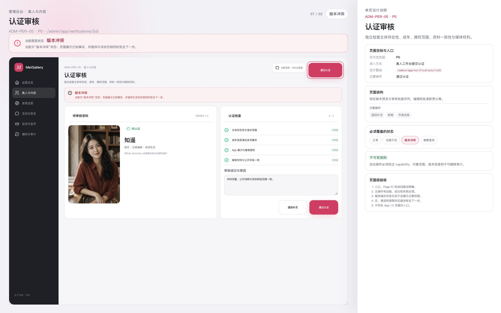

---

#### ADM-PER-06 发布审核

**平台与模块：** 管理后台 · 真人与内容　　**优先级：** P0　　**设计路由：** `/admin/app/publications/{id}`

**用户价值：** 预览锁定版本并校验认证、授权、公开字段和媒体安全。

**适用角色：** 内容编辑、合规审核、发布者、Owner

**前置条件：** 管理员已登录，并同时满足角色 capability、对象范围、数据版本和必要的独立复核条件。

**进入路径：** 认证通过后发起发布

**页面结构：** 锁定版本预览与审核检查并列，编辑和批准职责分离。

**详细交互：** 用户从“认证通过后发起发布”进入。主要操作为“发布到 App”，执行时显示处理中状态；服务端确认成功后刷新权威数据并可进入 ADM-PER-01「真人列表」。次要操作包括：暂停、归档、查看公开预览。失败时保留已输入内容，展示可理解原因，并提供重试、返回或帮助入口。

**业务规则：** 只有管理员创建或导入真人资料；认证、授权、审核和发布状态必须可追溯。

**数据与权限：** 管理员 API 与公开 API 分离；读取和写入同时校验 capability、对象范围、版本与审计要求。

**页面状态：** 正常、未认证、授权失效、投影失败

**Figma 最终稿映射：** `20｜Admin Pages` → `ADM-PER-06`，共 4 个需求状态；在 [Figma 最终设计文件](https://www.figma.com/design/LaNSwwGsznwcpV8msj7BQC/Peachmote-UI-%E5%80%9F%E9%89%B4%E5%AE%A1%E6%9F%A5%E6%9D%BF---MeiGallery) 中按 Page ID 定位。

**实现追踪：**

- 追踪键：`ADM-PER-06 → PRD-FR-010,PRD-FR-011,PRD-FR-012,PRD-FR-013,PRD-FR-090,PRD-FR-091,PRD-FR-092 → SCP-FR-012,SCP-FR-014 → A-03/VER-FR-*`
- 产品需求：`PRD-FR-010`、`PRD-FR-011`、`PRD-FR-012`、`PRD-FR-013`、`PRD-FR-090`、`PRD-FR-091`、`PRD-FR-092`
- 发布范围：`SCP-FR-012`、`SCP-FR-014`
- 非功能要求：`PRD-NFR-001`、`PRD-NFR-002`、`PRD-NFR-003`、`PRD-NFR-005`、`PRD-NFR-006`、`PRD-NFR-007`、`PRD-NFR-008`
- 产品级验收：`PRD-AC-001`、`PRD-AC-002`、`PRD-AC-010`
- 模块 PRD：[A-03 真人认证与发布审核](../ways-of-work/plan/real-person-discovery-platform/person-verification-and-publication/prd.md)（VER-FR-*）

**开发验收：**

- 从“认证通过后发起发布”能够进入，页面明确显示 ADM-PER-06、页面名称、设计路由和返回路径。
- 主要操作“发布到 App”具有处理中、成功和失败反馈，重复提交不会产生不可控的重复业务结果。
- 页面覆盖“正常、未认证、授权失效、投影失败”状态，并在空、错误、受限或冲突时提供安全下一步。
- 服务端状态变化后不会继续展示过期权限、过期余额、失效认证或不可访问内容。
- 只有管理员创建或导入真人资料；认证、授权、审核和发布状态必须可追溯。
- UI 层、状态层、数据层和服务端契约不得使用页面展示名称替代稳定 ID、rank、entitlement 或状态枚举。
- 加载、空、错误、离线、无权限、对象失效和服务端状态变化必须按本页状态集合安全收敛。

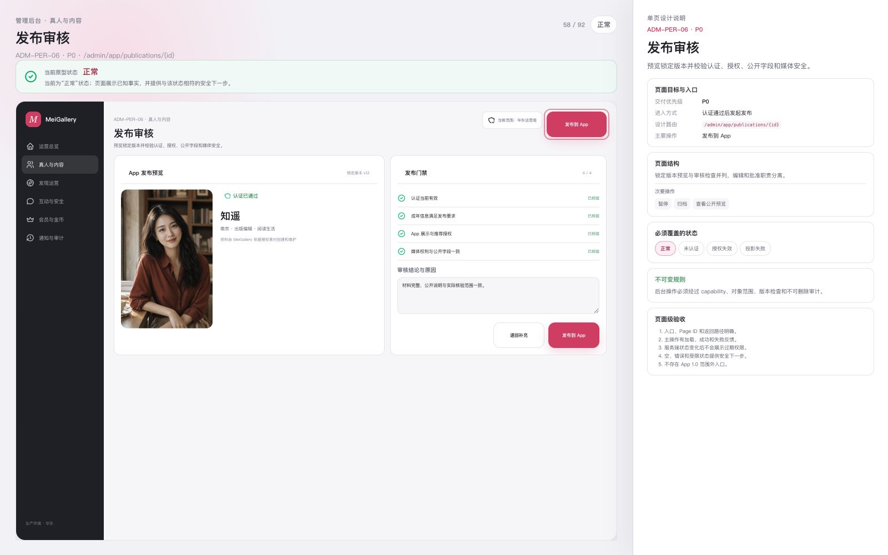

**P0 关键状态：** 授权失效

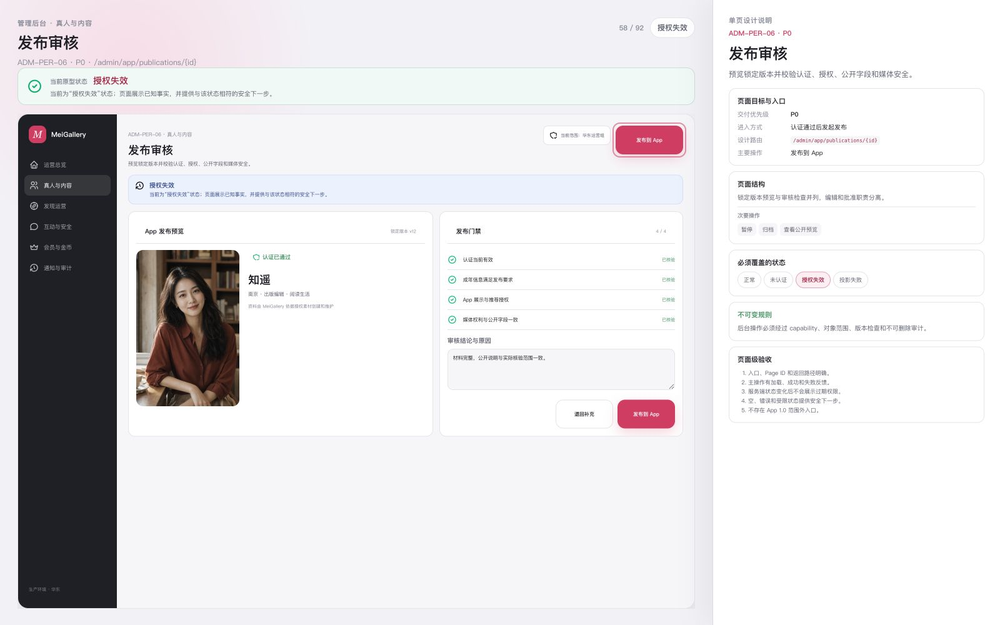

---

### 管理后台 · 发现运营

本组共 7 个页面。实现、接口、测试和缺陷均按 Page ID 追踪。

#### ADM-TAX-01 Taxonomy 目录树

**平台与模块：** 管理后台 · 发现运营　　**优先级：** P1　　**设计路由：** `/admin/app/taxonomy`

**用户价值：** 维护地区、身份、职业、风格与内容类型的版本化目录。

**适用角色：** 内容运营、标签管理员、推荐运营

**前置条件：** 管理员已登录，并同时满足角色 capability、对象范围、数据版本和必要的独立复核条件。

**进入路径：** 发现运营导航

**页面结构：** 分类树、词条详情、合并关系和影响范围在同一运营工作区呈现。

**详细交互：** 用户从“发现运营导航”进入。主要操作为“新建词条”，执行时显示处理中状态；服务端确认成功后刷新权威数据并可进入 ADM-TAX-02「词条详情」。次要操作包括：搜索词条、选择版本。失败时保留已输入内容，展示可理解原因，并提供重试、返回或帮助入口。

**业务规则：** 后台写操作必须经过 capability、对象范围、版本检查和不可删除审计。

**数据与权限：** 管理员 API 与公开 API 分离；读取和写入同时校验 capability、对象范围、版本与审计要求。

**页面状态：** 正常、草稿目录、生效目录、归档目录

**Figma 最终稿映射：** `20｜Admin Pages` → `ADM-TAX-01`，共 4 个需求状态；在 [Figma 最终设计文件](https://www.figma.com/design/LaNSwwGsznwcpV8msj7BQC/Peachmote-UI-%E5%80%9F%E9%89%B4%E5%AE%A1%E6%9F%A5%E6%9D%BF---MeiGallery) 中按 Page ID 定位。

**实现追踪：**

- 追踪键：`ADM-TAX-01 → PRD-FR-020,PRD-FR-021,PRD-FR-022,PRD-FR-023,PRD-FR-090,PRD-FR-091,PRD-FR-092 → SCP-FR-012,SCP-FR-030 → A-04/TAX-FR-*`
- 产品需求：`PRD-FR-020`、`PRD-FR-021`、`PRD-FR-022`、`PRD-FR-023`、`PRD-FR-090`、`PRD-FR-091`、`PRD-FR-092`
- 发布范围：`SCP-FR-012`、`SCP-FR-030`
- 非功能要求：`PRD-NFR-001`、`PRD-NFR-003`、`PRD-NFR-004`、`PRD-NFR-005`、`PRD-NFR-006`、`PRD-NFR-007`、`PRD-NFR-008`
- 产品级验收：`PRD-AC-002`、`PRD-AC-009`、`PRD-AC-010`
- 模块 PRD：[A-04 标签、地区与分类目录管理](../ways-of-work/plan/real-person-discovery-platform/taxonomy-region-and-category-management/prd.md)（TAX-FR-*）

**开发验收：**

- 从“发现运营导航”能够进入，页面明确显示 ADM-TAX-01、页面名称、设计路由和返回路径。
- 主要操作“新建词条”具有处理中、成功和失败反馈，重复提交不会产生不可控的重复业务结果。
- 页面覆盖“正常、草稿目录、生效目录、归档目录”状态，并在空、错误、受限或冲突时提供安全下一步。
- 服务端状态变化后不会继续展示过期权限、过期余额、失效认证或不可访问内容。
- 后台写操作必须经过 capability、对象范围、版本检查和不可删除审计。
- UI 层、状态层、数据层和服务端契约不得使用页面展示名称替代稳定 ID、rank、entitlement 或状态枚举。
- 加载、空、错误、离线、无权限、对象失效和服务端状态变化必须按本页状态集合安全收敛。

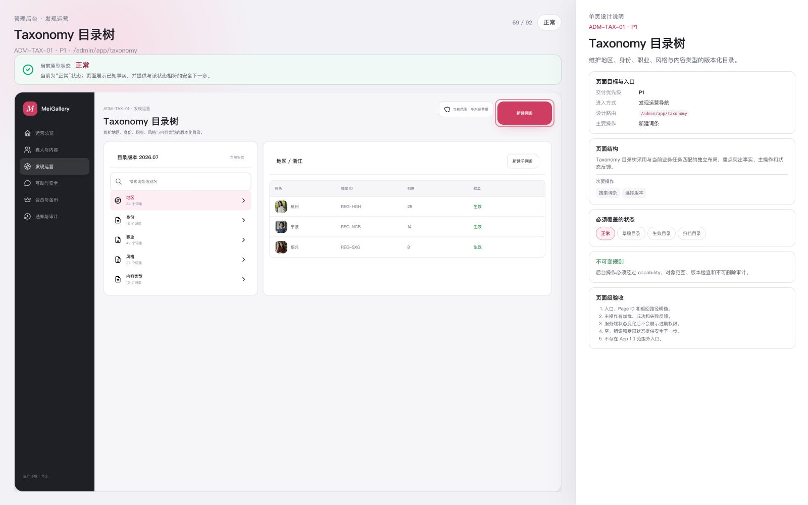

---

#### ADM-TAX-02 词条详情

**平台与模块：** 管理后台 · 发现运营　　**优先级：** P1　　**设计路由：** `/admin/app/taxonomy/{termId}`

**用户价值：** 编辑词条、别名和旧值映射，并预览合并影响。

**适用角色：** 内容运营、标签管理员、推荐运营

**前置条件：** 管理员已登录，并同时满足角色 capability、对象范围、数据版本和必要的独立复核条件。

**进入路径：** 目录树选择词条

**页面结构：** 词条属性、别名、引用范围和变更影响集中展示。

**详细交互：** 用户从“目录树选择词条”进入。主要操作为“保存词条草稿”，执行时显示处理中状态；服务端确认成功后刷新权威数据并可进入 ADM-TAX-03「目录发布」。次要操作包括：添加别名、合并预览。失败时保留已输入内容，展示可理解原因，并提供重试、返回或帮助入口。

**业务规则：** 后台写操作必须经过 capability、对象范围、版本检查和不可删除审计。

**数据与权限：** 管理员 API 与公开 API 分离；读取和写入同时校验 capability、对象范围、版本与审计要求。

**页面状态：** 正常、被引用、合并冲突、版本过期

**Figma 最终稿映射：** `20｜Admin Pages` → `ADM-TAX-02`，共 4 个需求状态；在 [Figma 最终设计文件](https://www.figma.com/design/LaNSwwGsznwcpV8msj7BQC/Peachmote-UI-%E5%80%9F%E9%89%B4%E5%AE%A1%E6%9F%A5%E6%9D%BF---MeiGallery) 中按 Page ID 定位。

**实现追踪：**

- 追踪键：`ADM-TAX-02 → PRD-FR-020,PRD-FR-021,PRD-FR-022,PRD-FR-023,PRD-FR-090,PRD-FR-091,PRD-FR-092 → SCP-FR-012,SCP-FR-030 → A-04/TAX-FR-*`
- 产品需求：`PRD-FR-020`、`PRD-FR-021`、`PRD-FR-022`、`PRD-FR-023`、`PRD-FR-090`、`PRD-FR-091`、`PRD-FR-092`
- 发布范围：`SCP-FR-012`、`SCP-FR-030`
- 非功能要求：`PRD-NFR-001`、`PRD-NFR-003`、`PRD-NFR-004`、`PRD-NFR-005`、`PRD-NFR-006`、`PRD-NFR-007`、`PRD-NFR-008`
- 产品级验收：`PRD-AC-002`、`PRD-AC-009`、`PRD-AC-010`
- 模块 PRD：[A-04 标签、地区与分类目录管理](../ways-of-work/plan/real-person-discovery-platform/taxonomy-region-and-category-management/prd.md)（TAX-FR-*）

**开发验收：**

- 从“目录树选择词条”能够进入，页面明确显示 ADM-TAX-02、页面名称、设计路由和返回路径。
- 主要操作“保存词条草稿”具有处理中、成功和失败反馈，重复提交不会产生不可控的重复业务结果。
- 页面覆盖“正常、被引用、合并冲突、版本过期”状态，并在空、错误、受限或冲突时提供安全下一步。
- 服务端状态变化后不会继续展示过期权限、过期余额、失效认证或不可访问内容。
- 后台写操作必须经过 capability、对象范围、版本检查和不可删除审计。
- UI 层、状态层、数据层和服务端契约不得使用页面展示名称替代稳定 ID、rank、entitlement 或状态枚举。
- 加载、空、错误、离线、无权限、对象失效和服务端状态变化必须按本页状态集合安全收敛。

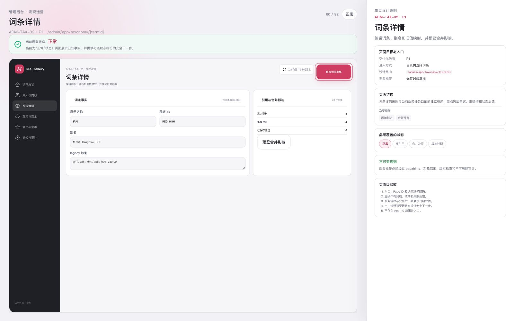

---

#### ADM-TAX-03 目录发布

**平台与模块：** 管理后台 · 发现运营　　**优先级：** P1　　**设计路由：** `/admin/app/taxonomy/releases/{id}`

**用户价值：** 校验目录变更对资料、筛选和客户端兼容性的影响。

**适用角色：** 内容运营、标签管理员、推荐运营

**前置条件：** 管理员已登录，并同时满足角色 capability、对象范围、数据版本和必要的独立复核条件。

**进入路径：** 目录版本页

**页面结构：** 规则版本、检查清单、预览差异和发布动作依次呈现。

**详细交互：** 用户从“目录版本页”进入。主要操作为“提交目录发布”，执行时显示处理中状态；服务端确认成功后刷新权威数据并可进入 ADM-TAX-01「Taxonomy 目录树」。次要操作包括：影响预览、回滚。失败时保留已输入内容，展示可理解原因，并提供重试、返回或帮助入口。

**业务规则：** 后台写操作必须经过 capability、对象范围、版本检查和不可删除审计。

**数据与权限：** 管理员 API 与公开 API 分离；读取和写入同时校验 capability、对象范围、版本与审计要求。

**页面状态：** 正常、未知引用、客户端不兼容、待复核

**Figma 最终稿映射：** `20｜Admin Pages` → `ADM-TAX-03`，共 4 个需求状态；在 [Figma 最终设计文件](https://www.figma.com/design/LaNSwwGsznwcpV8msj7BQC/Peachmote-UI-%E5%80%9F%E9%89%B4%E5%AE%A1%E6%9F%A5%E6%9D%BF---MeiGallery) 中按 Page ID 定位。

**实现追踪：**

- 追踪键：`ADM-TAX-03 → PRD-FR-020,PRD-FR-021,PRD-FR-022,PRD-FR-023,PRD-FR-090,PRD-FR-091,PRD-FR-092 → SCP-FR-012,SCP-FR-030 → A-04/TAX-FR-*`
- 产品需求：`PRD-FR-020`、`PRD-FR-021`、`PRD-FR-022`、`PRD-FR-023`、`PRD-FR-090`、`PRD-FR-091`、`PRD-FR-092`
- 发布范围：`SCP-FR-012`、`SCP-FR-030`
- 非功能要求：`PRD-NFR-001`、`PRD-NFR-003`、`PRD-NFR-004`、`PRD-NFR-005`、`PRD-NFR-006`、`PRD-NFR-007`、`PRD-NFR-008`
- 产品级验收：`PRD-AC-002`、`PRD-AC-009`、`PRD-AC-010`
- 模块 PRD：[A-04 标签、地区与分类目录管理](../ways-of-work/plan/real-person-discovery-platform/taxonomy-region-and-category-management/prd.md)（TAX-FR-*）

**开发验收：**

- 从“目录版本页”能够进入，页面明确显示 ADM-TAX-03、页面名称、设计路由和返回路径。
- 主要操作“提交目录发布”具有处理中、成功和失败反馈，重复提交不会产生不可控的重复业务结果。
- 页面覆盖“正常、未知引用、客户端不兼容、待复核”状态，并在空、错误、受限或冲突时提供安全下一步。
- 服务端状态变化后不会继续展示过期权限、过期余额、失效认证或不可访问内容。
- 后台写操作必须经过 capability、对象范围、版本检查和不可删除审计。
- UI 层、状态层、数据层和服务端契约不得使用页面展示名称替代稳定 ID、rank、entitlement 或状态枚举。
- 加载、空、错误、离线、无权限、对象失效和服务端状态变化必须按本页状态集合安全收敛。

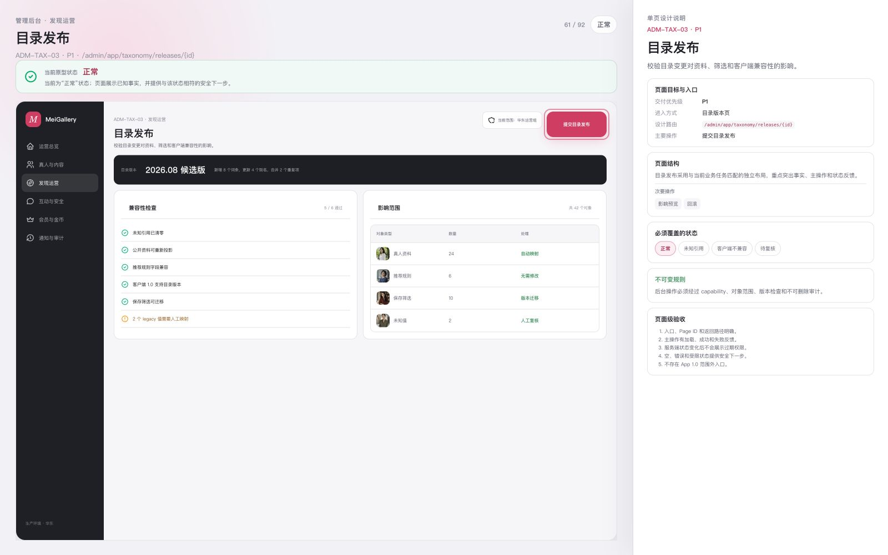

---

#### ADM-REC-01 推荐规则版本

**平台与模块：** 管理后台 · 发现运营　　**优先级：** P1　　**设计路由：** `/admin/app/recommendation/rules`

**用户价值：** 管理候选、排序和热度规则的草稿、生效、灰度与回滚。

**适用角色：** 推荐运营、数据分析、Owner

**前置条件：** 管理员已登录，并同时满足角色 capability、对象范围、数据版本和必要的独立复核条件。

**进入路径：** 发现运营导航

**页面结构：** 推荐规则、权重、适用范围和回退条件以可审计配置展示。

**详细交互：** 用户从“发现运营导航”进入。主要操作为“创建规则草稿”，执行时显示处理中状态；服务端确认成功后刷新权威数据并可进入 ADM-REC-02「推荐规则编辑」。次要操作包括：复制版本、停用。失败时保留已输入内容，展示可理解原因，并提供重试、返回或帮助入口。

**业务规则：** 后台写操作必须经过 capability、对象范围、版本检查和不可删除审计。

**数据与权限：** 管理员 API 与公开 API 分离；读取和写入同时校验 capability、对象范围、版本与审计要求。

**页面状态：** 正常、当前生效、灰度中、已回滚

**Figma 最终稿映射：** `20｜Admin Pages` → `ADM-REC-01`，共 4 个需求状态；在 [Figma 最终设计文件](https://www.figma.com/design/LaNSwwGsznwcpV8msj7BQC/Peachmote-UI-%E5%80%9F%E9%89%B4%E5%AE%A1%E6%9F%A5%E6%9D%BF---MeiGallery) 中按 Page ID 定位。

**实现追踪：**

- 追踪键：`ADM-REC-01 → PRD-FR-020,PRD-FR-021,PRD-FR-022,PRD-FR-023,PRD-FR-090,PRD-FR-091,PRD-FR-092 → SCP-FR-012,SCP-FR-030 → A-05/ROP-FR-*`
- 产品需求：`PRD-FR-020`、`PRD-FR-021`、`PRD-FR-022`、`PRD-FR-023`、`PRD-FR-090`、`PRD-FR-091`、`PRD-FR-092`
- 发布范围：`SCP-FR-012`、`SCP-FR-030`
- 非功能要求：`PRD-NFR-001`、`PRD-NFR-003`、`PRD-NFR-004`、`PRD-NFR-005`、`PRD-NFR-006`、`PRD-NFR-007`、`PRD-NFR-008`
- 产品级验收：`PRD-AC-002`、`PRD-AC-010`
- 模块 PRD：[A-05 推荐位、排序规则与热度运营](../ways-of-work/plan/real-person-discovery-platform/recommendation-and-popularity-operations/prd.md)（ROP-FR-*）

**开发验收：**

- 从“发现运营导航”能够进入，页面明确显示 ADM-REC-01、页面名称、设计路由和返回路径。
- 主要操作“创建规则草稿”具有处理中、成功和失败反馈，重复提交不会产生不可控的重复业务结果。
- 页面覆盖“正常、当前生效、灰度中、已回滚”状态，并在空、错误、受限或冲突时提供安全下一步。
- 服务端状态变化后不会继续展示过期权限、过期余额、失效认证或不可访问内容。
- 后台写操作必须经过 capability、对象范围、版本检查和不可删除审计。
- UI 层、状态层、数据层和服务端契约不得使用页面展示名称替代稳定 ID、rank、entitlement 或状态枚举。
- 加载、空、错误、离线、无权限、对象失效和服务端状态变化必须按本页状态集合安全收敛。

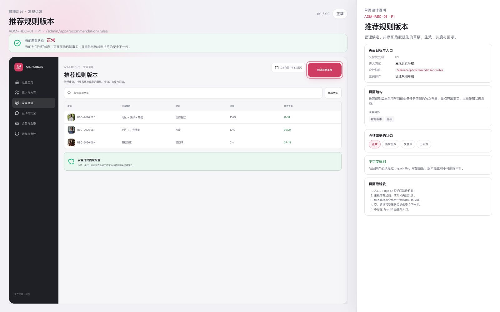

---

#### ADM-REC-02 推荐规则编辑

**平台与模块：** 管理后台 · 发现运营　　**优先级：** P1　　**设计路由：** `/admin/app/recommendation/rules/{id}`

**用户价值：** 配置候选和排序因子，安全过滤固定为不可关闭前置。

**适用角色：** 推荐运营、数据分析、Owner

**前置条件：** 管理员已登录，并同时满足角色 capability、对象范围、数据版本和必要的独立复核条件。

**进入路径：** 规则版本列表

**页面结构：** 配置编辑、即时预览、校验提示和保存发布路径并列。

**详细交互：** 用户从“规则版本列表”进入。主要操作为“提交规则审核”，执行时显示处理中状态；服务端确认成功后刷新权威数据并可进入 ADM-REC-03「推荐 Dry-run」。次要操作包括：保存草稿、查看差异。失败时保留已输入内容，展示可理解原因，并提供重试、返回或帮助入口。

**业务规则：** 后台写操作必须经过 capability、对象范围、版本检查和不可删除审计。

**数据与权限：** 管理员 API 与公开 API 分离；读取和写入同时校验 capability、对象范围、版本与审计要求。

**页面状态：** 正常、Schema 错误、触碰安全过滤、并发冲突

**Figma 最终稿映射：** `20｜Admin Pages` → `ADM-REC-02`，共 4 个需求状态；在 [Figma 最终设计文件](https://www.figma.com/design/LaNSwwGsznwcpV8msj7BQC/Peachmote-UI-%E5%80%9F%E9%89%B4%E5%AE%A1%E6%9F%A5%E6%9D%BF---MeiGallery) 中按 Page ID 定位。

**实现追踪：**

- 追踪键：`ADM-REC-02 → PRD-FR-020,PRD-FR-021,PRD-FR-022,PRD-FR-023,PRD-FR-090,PRD-FR-091,PRD-FR-092 → SCP-FR-012,SCP-FR-030 → A-05/ROP-FR-*`
- 产品需求：`PRD-FR-020`、`PRD-FR-021`、`PRD-FR-022`、`PRD-FR-023`、`PRD-FR-090`、`PRD-FR-091`、`PRD-FR-092`
- 发布范围：`SCP-FR-012`、`SCP-FR-030`
- 非功能要求：`PRD-NFR-001`、`PRD-NFR-003`、`PRD-NFR-004`、`PRD-NFR-005`、`PRD-NFR-006`、`PRD-NFR-007`、`PRD-NFR-008`
- 产品级验收：`PRD-AC-002`、`PRD-AC-010`
- 模块 PRD：[A-05 推荐位、排序规则与热度运营](../ways-of-work/plan/real-person-discovery-platform/recommendation-and-popularity-operations/prd.md)（ROP-FR-*）

**开发验收：**

- 从“规则版本列表”能够进入，页面明确显示 ADM-REC-02、页面名称、设计路由和返回路径。
- 主要操作“提交规则审核”具有处理中、成功和失败反馈，重复提交不会产生不可控的重复业务结果。
- 页面覆盖“正常、Schema 错误、触碰安全过滤、并发冲突”状态，并在空、错误、受限或冲突时提供安全下一步。
- 服务端状态变化后不会继续展示过期权限、过期余额、失效认证或不可访问内容。
- 后台写操作必须经过 capability、对象范围、版本检查和不可删除审计。
- UI 层、状态层、数据层和服务端契约不得使用页面展示名称替代稳定 ID、rank、entitlement 或状态枚举。
- 加载、空、错误、离线、无权限、对象失效和服务端状态变化必须按本页状态集合安全收敛。

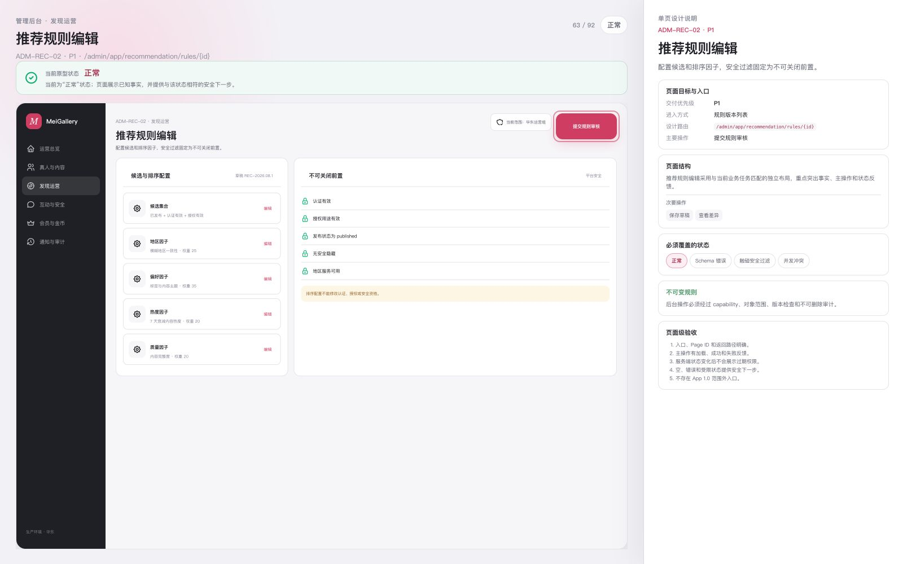

---

#### ADM-REC-03 推荐 Dry-run

**平台与模块：** 管理后台 · 发现运营　　**优先级：** P2　　**设计路由：** `/admin/app/recommendation/rules/{id}/preview`

**用户价值：** 使用合成场景比较新旧规则结果，不读取不必要的用户敏感数据。

**适用角色：** 推荐运营、数据分析、Owner

**前置条件：** 管理员已登录，并同时满足角色 capability、对象范围、数据版本和必要的独立复核条件。

**进入路径：** 规则编辑页

**页面结构：** 版本前后差异、影响范围和回滚条件在同一比较视图呈现。

**详细交互：** 用户从“规则编辑页”进入。主要操作为“运行对比”，执行时显示处理中状态；服务端确认成功后刷新权威数据并可进入 ADM-REC-02「推荐规则编辑」。次要操作包括：切换场景、查看解释。失败时保留已输入内容，展示可理解原因，并提供重试、返回或帮助入口。

**业务规则：** 后台写操作必须经过 capability、对象范围、版本检查和不可删除审计。

**数据与权限：** 管理员 API 与公开 API 分离；读取和写入同时校验 capability、对象范围、版本与审计要求。

**页面状态：** 正常、样本不足、数据延迟

**Figma 最终稿映射：** `20｜Admin Pages` → `ADM-REC-03`，共 3 个需求状态；在 [Figma 最终设计文件](https://www.figma.com/design/LaNSwwGsznwcpV8msj7BQC/Peachmote-UI-%E5%80%9F%E9%89%B4%E5%AE%A1%E6%9F%A5%E6%9D%BF---MeiGallery) 中按 Page ID 定位。

**实现追踪：**

- 追踪键：`ADM-REC-03 → PRD-FR-020,PRD-FR-021,PRD-FR-022,PRD-FR-023,PRD-FR-090,PRD-FR-091,PRD-FR-092 → SCP-FR-012,SCP-FR-030 → A-05/ROP-FR-*`
- 产品需求：`PRD-FR-020`、`PRD-FR-021`、`PRD-FR-022`、`PRD-FR-023`、`PRD-FR-090`、`PRD-FR-091`、`PRD-FR-092`
- 发布范围：`SCP-FR-012`、`SCP-FR-030`
- 非功能要求：`PRD-NFR-001`、`PRD-NFR-003`、`PRD-NFR-004`、`PRD-NFR-005`、`PRD-NFR-006`、`PRD-NFR-007`、`PRD-NFR-008`
- 产品级验收：`PRD-AC-002`、`PRD-AC-010`
- 模块 PRD：[A-05 推荐位、排序规则与热度运营](../ways-of-work/plan/real-person-discovery-platform/recommendation-and-popularity-operations/prd.md)（ROP-FR-*）

**开发验收：**

- 从“规则编辑页”能够进入，页面明确显示 ADM-REC-03、页面名称、设计路由和返回路径。
- 主要操作“运行对比”具有处理中、成功和失败反馈，重复提交不会产生不可控的重复业务结果。
- 页面覆盖“正常、样本不足、数据延迟”状态，并在空、错误、受限或冲突时提供安全下一步。
- 服务端状态变化后不会继续展示过期权限、过期余额、失效认证或不可访问内容。
- 后台写操作必须经过 capability、对象范围、版本检查和不可删除审计。
- UI 层、状态层、数据层和服务端契约不得使用页面展示名称替代稳定 ID、rank、entitlement 或状态枚举。
- 加载、空、错误、离线、无权限、对象失效和服务端状态变化必须按本页状态集合安全收敛。

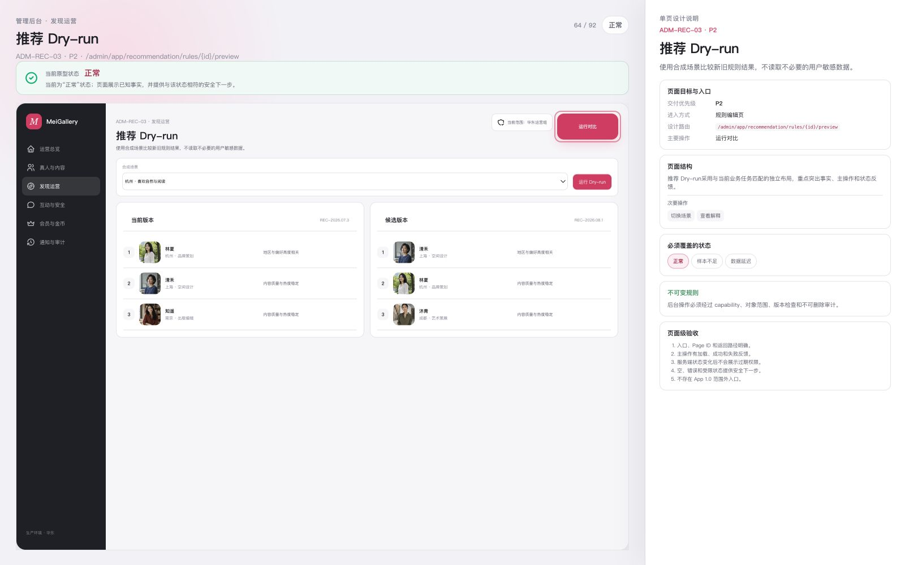

---

#### ADM-REC-04 运营精选

**平台与模块：** 管理后台 · 发现运营　　**优先级：** P1　　**设计路由：** `/admin/app/recommendation/placements`

**用户价值：** 为人工精选资料配置位置、时间和“平台精选”披露。

**适用角色：** 推荐运营、数据分析、Owner

**前置条件：** 管理员已登录，并同时满足角色 capability、对象范围、数据版本和必要的独立复核条件。

**进入路径：** 发现运营导航

**页面结构：** 排期、优先级、冲突和发布窗口以日历与列表结合展示。

**详细交互：** 用户从“发现运营导航”进入。主要操作为“创建排期”，执行时显示处理中状态；服务端确认成功后刷新权威数据并可进入 ADM-REC-01「推荐规则版本」。次要操作包括：预览披露、暂停排期。失败时保留已输入内容，展示可理解原因，并提供重试、返回或帮助入口。

**业务规则：** 后台写操作必须经过 capability、对象范围、版本检查和不可删除审计。

**数据与权限：** 管理员 API 与公开 API 分离；读取和写入同时校验 capability、对象范围、版本与审计要求。

**页面状态：** 正常、时间冲突、资料下架

**Figma 最终稿映射：** `20｜Admin Pages` → `ADM-REC-04`，共 3 个需求状态；在 [Figma 最终设计文件](https://www.figma.com/design/LaNSwwGsznwcpV8msj7BQC/Peachmote-UI-%E5%80%9F%E9%89%B4%E5%AE%A1%E6%9F%A5%E6%9D%BF---MeiGallery) 中按 Page ID 定位。

**实现追踪：**

- 追踪键：`ADM-REC-04 → PRD-FR-020,PRD-FR-021,PRD-FR-022,PRD-FR-023,PRD-FR-090,PRD-FR-091,PRD-FR-092 → SCP-FR-012,SCP-FR-030 → A-05/ROP-FR-*`
- 产品需求：`PRD-FR-020`、`PRD-FR-021`、`PRD-FR-022`、`PRD-FR-023`、`PRD-FR-090`、`PRD-FR-091`、`PRD-FR-092`
- 发布范围：`SCP-FR-012`、`SCP-FR-030`
- 非功能要求：`PRD-NFR-001`、`PRD-NFR-003`、`PRD-NFR-004`、`PRD-NFR-005`、`PRD-NFR-006`、`PRD-NFR-007`、`PRD-NFR-008`
- 产品级验收：`PRD-AC-002`、`PRD-AC-010`
- 模块 PRD：[A-05 推荐位、排序规则与热度运营](../ways-of-work/plan/real-person-discovery-platform/recommendation-and-popularity-operations/prd.md)（ROP-FR-*）

**开发验收：**

- 从“发现运营导航”能够进入，页面明确显示 ADM-REC-04、页面名称、设计路由和返回路径。
- 主要操作“创建排期”具有处理中、成功和失败反馈，重复提交不会产生不可控的重复业务结果。
- 页面覆盖“正常、时间冲突、资料下架”状态，并在空、错误、受限或冲突时提供安全下一步。
- 服务端状态变化后不会继续展示过期权限、过期余额、失效认证或不可访问内容。
- 后台写操作必须经过 capability、对象范围、版本检查和不可删除审计。
- UI 层、状态层、数据层和服务端契约不得使用页面展示名称替代稳定 ID、rank、entitlement 或状态枚举。
- 加载、空、错误、离线、无权限、对象失效和服务端状态变化必须按本页状态集合安全收敛。

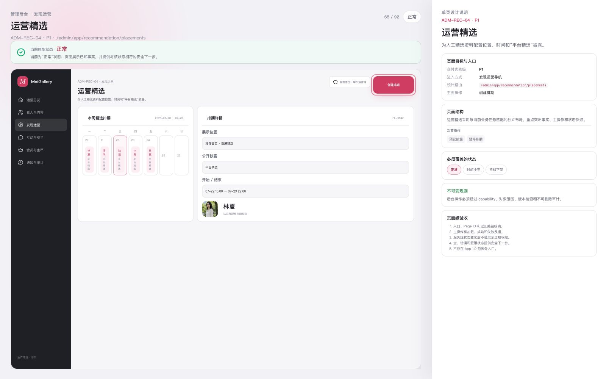

---

### 管理后台 · 平台话题运营

本组共 4 个页面。实现、接口、测试和缺陷均按 Page ID 追踪。

#### ADM-MSG-01 会话队列

**平台与模块：** 管理后台 · 平台话题运营　　**优先级：** P0　　**设计路由：** `/admin/app/conversations`

**用户价值：** 按运营组、地区、等待时间、会员等级和安全状态分配会话。

**适用角色：** 话题运营、运营主管、质检人员

**前置条件：** 管理员已登录，并同时满足角色 capability、对象范围、数据版本和必要的独立复核条件。

**进入路径：** 互动与安全导航

**页面结构：** 筛选、范围、等待时间、状态和列表详情入口保持稳定。

**详细交互：** 用户从“互动与安全导航”进入。主要操作为“领取会话”，执行时显示处理中状态；服务端确认成功后刷新权威数据并可进入 ADM-MSG-02「会话工作台」。次要操作包括：筛选队列、批量分组。失败时保留已输入内容，展示可理解原因，并提供重试、返回或帮助入口。

**业务规则：** 管理员只能以固定平台运营身份发送，正文读取按租约和对象范围控制。

**数据与权限：** 正文访问受领取租约、对象范围和最小必要原则限制；发送身份固定为平台运营。

**页面状态：** 正常、待分配、待平台、待用户、安全审核

**Figma 最终稿映射：** `20｜Admin Pages` → `ADM-MSG-01`，共 5 个需求状态；在 [Figma 最终设计文件](https://www.figma.com/design/LaNSwwGsznwcpV8msj7BQC/Peachmote-UI-%E5%80%9F%E9%89%B4%E5%AE%A1%E6%9F%A5%E6%9D%BF---MeiGallery) 中按 Page ID 定位。

**实现追踪：**

- 追踪键：`ADM-MSG-01 → PRD-FR-050,PRD-FR-051,PRD-FR-052,PRD-FR-053,PRD-FR-054,PRD-FR-055,PRD-FR-056,PRD-FR-090,PRD-FR-091,PRD-FR-092 → SCP-FR-007,SCP-FR-008,SCP-FR-012,SCP-FR-015 → F-07、A-06/MOP-FR-*`
- 产品需求：`PRD-FR-050`、`PRD-FR-051`、`PRD-FR-052`、`PRD-FR-053`、`PRD-FR-054`、`PRD-FR-055`、`PRD-FR-056`、`PRD-FR-090`、`PRD-FR-091`、`PRD-FR-092`
- 发布范围：`SCP-FR-007`、`SCP-FR-008`、`SCP-FR-012`、`SCP-FR-015`
- 非功能要求：`PRD-NFR-001`、`PRD-NFR-002`、`PRD-NFR-003`、`PRD-NFR-005`、`PRD-NFR-006`、`PRD-NFR-007`、`PRD-NFR-008`
- 产品级验收：`PRD-AC-004`、`PRD-AC-005`、`PRD-AC-010`、`PRD-AC-011`
- 模块 PRD：[F-07、A-06 会员平台话题、实时会话与运营工作台](../ways-of-work/plan/real-person-discovery-platform/member-messaging-and-managed-operations/prd.md)（MOP-FR-*）

**开发验收：**

- 从“互动与安全导航”能够进入，页面明确显示 ADM-MSG-01、页面名称、设计路由和返回路径。
- 主要操作“领取会话”具有处理中、成功和失败反馈，重复提交不会产生不可控的重复业务结果。
- 页面覆盖“正常、待分配、待平台、待用户、安全审核”状态，并在空、错误、受限或冲突时提供安全下一步。
- 服务端状态变化后不会继续展示过期权限、过期余额、失效认证或不可访问内容。
- 管理员只能以固定平台运营身份发送，正文读取按租约和对象范围控制。
- UI 层、状态层、数据层和服务端契约不得使用页面展示名称替代稳定 ID、rank、entitlement 或状态枚举。
- 加载、空、错误、离线、无权限、对象失效和服务端状态变化必须按本页状态集合安全收敛。

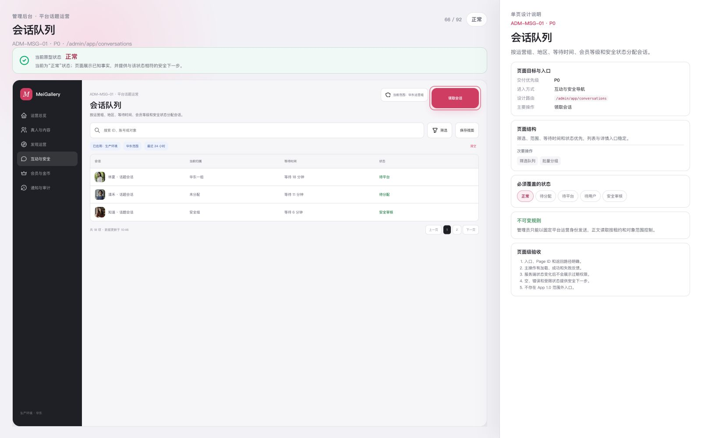

**P0 关键状态：** 安全审核

---

#### ADM-MSG-02 会话工作台

**平台与模块：** 管理后台 · 平台话题运营　　**优先级：** P0　　**设计路由：** `/admin/app/conversations/{id}`

**用户价值：** 以固定平台身份回复、记录内部备注、转派和升级安全审核。

**适用角色：** 话题运营、运营主管、质检人员

**前置条件：** 管理员已登录，并同时满足角色 capability、对象范围、数据版本和必要的独立复核条件。

**进入路径：** 会话队列

**页面结构：** 队列、会话正文和最小必要上下文分栏，固定平台发送主体。

**详细交互：** 用户从“会话队列”进入。主要操作为“以平台身份回复”，执行时显示处理中状态；服务端确认成功后刷新权威数据并可进入 ADM-MSG-01「会话队列」。次要操作包括：内部备注、转派、升级安全。失败时保留已输入内容，展示可理解原因，并提供重试、返回或帮助入口。

**业务规则：** 管理员只能以固定平台运营身份发送，正文读取按租约和对象范围控制。

**数据与权限：** 正文访问受领取租约、对象范围和最小必要原则限制；发送身份固定为平台运营。

**页面状态：** 正常、租约冲突、只读、冻结、关闭

**Figma 最终稿映射：** `20｜Admin Pages` → `ADM-MSG-02`，共 5 个需求状态；在 [Figma 最终设计文件](https://www.figma.com/design/LaNSwwGsznwcpV8msj7BQC/Peachmote-UI-%E5%80%9F%E9%89%B4%E5%AE%A1%E6%9F%A5%E6%9D%BF---MeiGallery) 中按 Page ID 定位。

**实现追踪：**

- 追踪键：`ADM-MSG-02 → PRD-FR-050,PRD-FR-051,PRD-FR-052,PRD-FR-053,PRD-FR-054,PRD-FR-055,PRD-FR-056,PRD-FR-090,PRD-FR-091,PRD-FR-092 → SCP-FR-007,SCP-FR-008,SCP-FR-012,SCP-FR-015 → F-07、A-06/MOP-FR-*`
- 产品需求：`PRD-FR-050`、`PRD-FR-051`、`PRD-FR-052`、`PRD-FR-053`、`PRD-FR-054`、`PRD-FR-055`、`PRD-FR-056`、`PRD-FR-090`、`PRD-FR-091`、`PRD-FR-092`
- 发布范围：`SCP-FR-007`、`SCP-FR-008`、`SCP-FR-012`、`SCP-FR-015`
- 非功能要求：`PRD-NFR-001`、`PRD-NFR-002`、`PRD-NFR-003`、`PRD-NFR-005`、`PRD-NFR-006`、`PRD-NFR-007`、`PRD-NFR-008`
- 产品级验收：`PRD-AC-004`、`PRD-AC-005`、`PRD-AC-010`、`PRD-AC-011`
- 模块 PRD：[F-07、A-06 会员平台话题、实时会话与运营工作台](../ways-of-work/plan/real-person-discovery-platform/member-messaging-and-managed-operations/prd.md)（MOP-FR-*）

**开发验收：**

- 从“会话队列”能够进入，页面明确显示 ADM-MSG-02、页面名称、设计路由和返回路径。
- 主要操作“以平台身份回复”具有处理中、成功和失败反馈，重复提交不会产生不可控的重复业务结果。
- 页面覆盖“正常、租约冲突、只读、冻结、关闭”状态，并在空、错误、受限或冲突时提供安全下一步。
- 服务端状态变化后不会继续展示过期权限、过期余额、失效认证或不可访问内容。
- 管理员只能以固定平台运营身份发送，正文读取按租约和对象范围控制。
- UI 层、状态层、数据层和服务端契约不得使用页面展示名称替代稳定 ID、rank、entitlement 或状态枚举。
- 加载、空、错误、离线、无权限、对象失效和服务端状态变化必须按本页状态集合安全收敛。

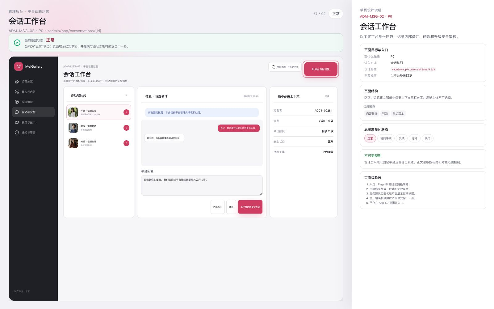

**P0 关键状态：** 租约冲突

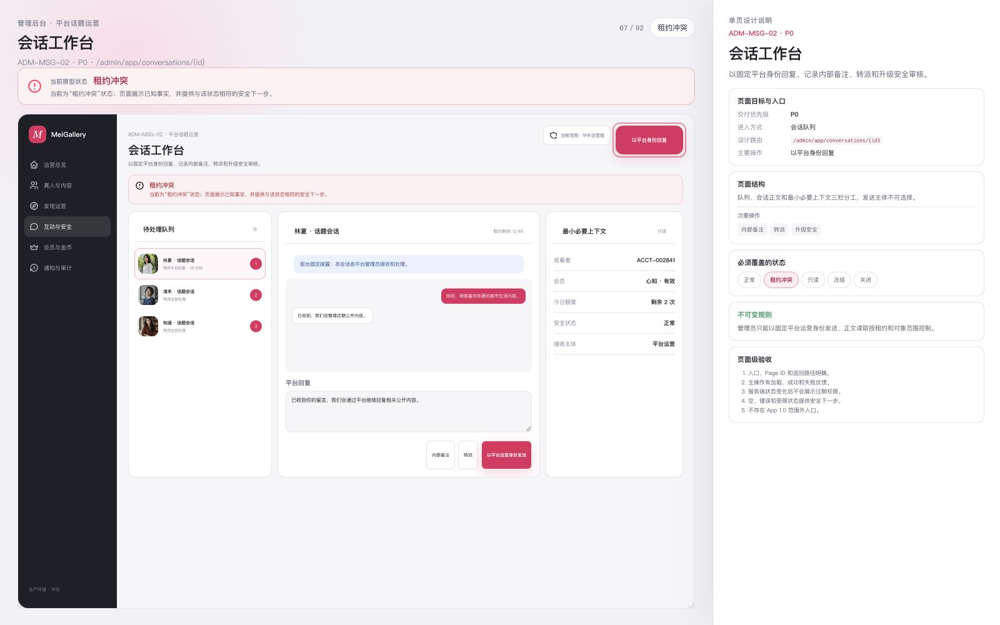

---

#### ADM-MSG-03 分组与班次

**平台与模块：** 管理后台 · 平台话题运营　　**优先级：** P0　　**设计路由：** `/admin/app/conversation-groups`

**用户价值：** 配置运营组、班次、容量和自动分配规则。

**适用角色：** 话题运营、运营主管、质检人员

**前置条件：** 管理员已登录，并同时满足角色 capability、对象范围、数据版本和必要的独立复核条件。

**进入路径：** 会话管理导航

**页面结构：** 领取、预约回复、超时和交接动作围绕会话运营排期组织。

**详细交互：** 用户从“会话管理导航”进入。主要操作为“保存分配规则”，执行时显示处理中状态；服务端确认成功后刷新权威数据并可进入 ADM-MSG-01「会话队列」。次要操作包括：调整班次、查看容量。失败时保留已输入内容，展示可理解原因，并提供重试、返回或帮助入口。

**业务规则：** 管理员只能以固定平台运营身份发送，正文读取按租约和对象范围控制。

**数据与权限：** 正文访问受领取租约、对象范围和最小必要原则限制；发送身份固定为平台运营。

**页面状态：** 正常、无值班、过载、配置冲突

**Figma 最终稿映射：** `20｜Admin Pages` → `ADM-MSG-03`，共 4 个需求状态；在 [Figma 最终设计文件](https://www.figma.com/design/LaNSwwGsznwcpV8msj7BQC/Peachmote-UI-%E5%80%9F%E9%89%B4%E5%AE%A1%E6%9F%A5%E6%9D%BF---MeiGallery) 中按 Page ID 定位。

**实现追踪：**

- 追踪键：`ADM-MSG-03 → PRD-FR-050,PRD-FR-051,PRD-FR-052,PRD-FR-053,PRD-FR-054,PRD-FR-055,PRD-FR-056,PRD-FR-090,PRD-FR-091,PRD-FR-092 → SCP-FR-007,SCP-FR-008,SCP-FR-012,SCP-FR-015 → F-07、A-06/MOP-FR-*`
- 产品需求：`PRD-FR-050`、`PRD-FR-051`、`PRD-FR-052`、`PRD-FR-053`、`PRD-FR-054`、`PRD-FR-055`、`PRD-FR-056`、`PRD-FR-090`、`PRD-FR-091`、`PRD-FR-092`
- 发布范围：`SCP-FR-007`、`SCP-FR-008`、`SCP-FR-012`、`SCP-FR-015`
- 非功能要求：`PRD-NFR-001`、`PRD-NFR-002`、`PRD-NFR-003`、`PRD-NFR-005`、`PRD-NFR-006`、`PRD-NFR-007`、`PRD-NFR-008`
- 产品级验收：`PRD-AC-004`、`PRD-AC-005`、`PRD-AC-010`、`PRD-AC-011`
- 模块 PRD：[F-07、A-06 会员平台话题、实时会话与运营工作台](../ways-of-work/plan/real-person-discovery-platform/member-messaging-and-managed-operations/prd.md)（MOP-FR-*）

**开发验收：**

- 从“会话管理导航”能够进入，页面明确显示 ADM-MSG-03、页面名称、设计路由和返回路径。
- 主要操作“保存分配规则”具有处理中、成功和失败反馈，重复提交不会产生不可控的重复业务结果。
- 页面覆盖“正常、无值班、过载、配置冲突”状态，并在空、错误、受限或冲突时提供安全下一步。
- 服务端状态变化后不会继续展示过期权限、过期余额、失效认证或不可访问内容。
- 管理员只能以固定平台运营身份发送，正文读取按租约和对象范围控制。
- UI 层、状态层、数据层和服务端契约不得使用页面展示名称替代稳定 ID、rank、entitlement 或状态枚举。
- 加载、空、错误、离线、无权限、对象失效和服务端状态变化必须按本页状态集合安全收敛。

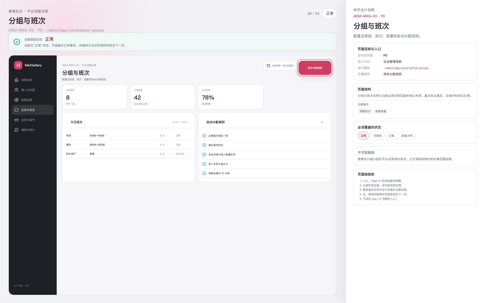

**P0 关键状态：** 配置冲突

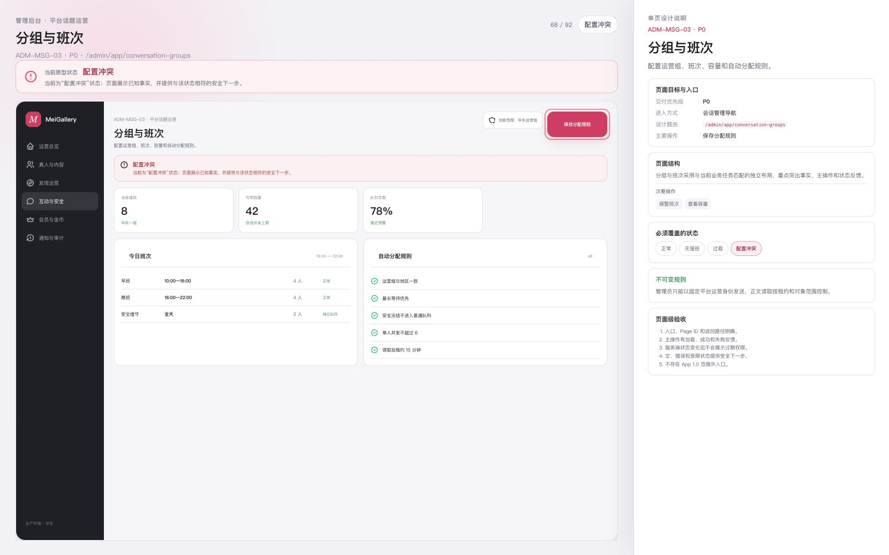

---

#### ADM-MSG-04 会话质量与抽检

**平台与模块：** 管理后台 · 平台话题运营　　**优先级：** P0　　**设计路由：** `/admin/app/conversation-quality`

**用户价值：** 在受控样本上检查身份披露、服务质量和违规文案。

**适用角色：** 话题运营、运营主管、质检人员

**前置条件：** 管理员已登录，并同时满足角色 capability、对象范围、数据版本和必要的独立复核条件。

**进入路径：** 平台话题运营组长质量入口

**页面结构：** 抽检样本、问题分类、评分和改进动作集中展示。

**详细交互：** 用户从“平台话题运营组长质量入口”进入。主要操作为“记录抽检结论”，执行时显示处理中状态；服务端确认成功后刷新权威数据并可进入 ADM-MSG-01「会话队列」。次要操作包括：选择样本、创建改进任务。失败时保留已输入内容，展示可理解原因，并提供重试、返回或帮助入口。

**业务规则：** 管理员只能以固定平台运营身份发送，正文读取按租约和对象范围控制。

**数据与权限：** 正文访问受领取租约、对象范围和最小必要原则限制；发送身份固定为平台运营。

**页面状态：** 正常、无正文授权、披露缺失

**Figma 最终稿映射：** `20｜Admin Pages` → `ADM-MSG-04`，共 3 个需求状态；在 [Figma 最终设计文件](https://www.figma.com/design/LaNSwwGsznwcpV8msj7BQC/Peachmote-UI-%E5%80%9F%E9%89%B4%E5%AE%A1%E6%9F%A5%E6%9D%BF---MeiGallery) 中按 Page ID 定位。

**实现追踪：**

- 追踪键：`ADM-MSG-04 → PRD-FR-050,PRD-FR-051,PRD-FR-052,PRD-FR-053,PRD-FR-054,PRD-FR-055,PRD-FR-056,PRD-FR-090,PRD-FR-091,PRD-FR-092 → SCP-FR-007,SCP-FR-008,SCP-FR-012,SCP-FR-015 → F-07、A-06/MOP-FR-*`
- 产品需求：`PRD-FR-050`、`PRD-FR-051`、`PRD-FR-052`、`PRD-FR-053`、`PRD-FR-054`、`PRD-FR-055`、`PRD-FR-056`、`PRD-FR-090`、`PRD-FR-091`、`PRD-FR-092`
- 发布范围：`SCP-FR-007`、`SCP-FR-008`、`SCP-FR-012`、`SCP-FR-015`
- 非功能要求：`PRD-NFR-001`、`PRD-NFR-002`、`PRD-NFR-003`、`PRD-NFR-005`、`PRD-NFR-006`、`PRD-NFR-007`、`PRD-NFR-008`
- 产品级验收：`PRD-AC-004`、`PRD-AC-005`、`PRD-AC-010`、`PRD-AC-011`
- 模块 PRD：[F-07、A-06 会员平台话题、实时会话与运营工作台](../ways-of-work/plan/real-person-discovery-platform/member-messaging-and-managed-operations/prd.md)（MOP-FR-*）

**开发验收：**

- 从“平台话题运营组长质量入口”能够进入，页面明确显示 ADM-MSG-04、页面名称、设计路由和返回路径。
- 主要操作“记录抽检结论”具有处理中、成功和失败反馈，重复提交不会产生不可控的重复业务结果。
- 页面覆盖“正常、无正文授权、披露缺失”状态，并在空、错误、受限或冲突时提供安全下一步。
- 服务端状态变化后不会继续展示过期权限、过期余额、失效认证或不可访问内容。
- 管理员只能以固定平台运营身份发送，正文读取按租约和对象范围控制。
- UI 层、状态层、数据层和服务端契约不得使用页面展示名称替代稳定 ID、rank、entitlement 或状态枚举。
- 加载、空、错误、离线、无权限、对象失效和服务端状态变化必须按本页状态集合安全收敛。

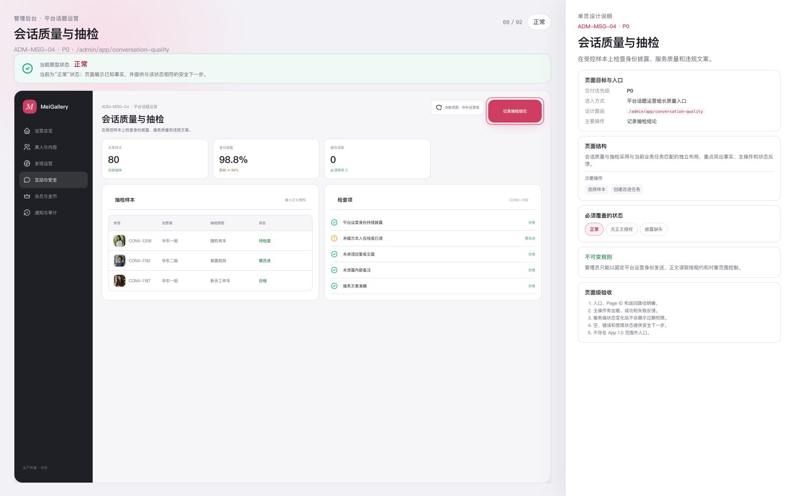

**P0 关键状态：** 无正文授权

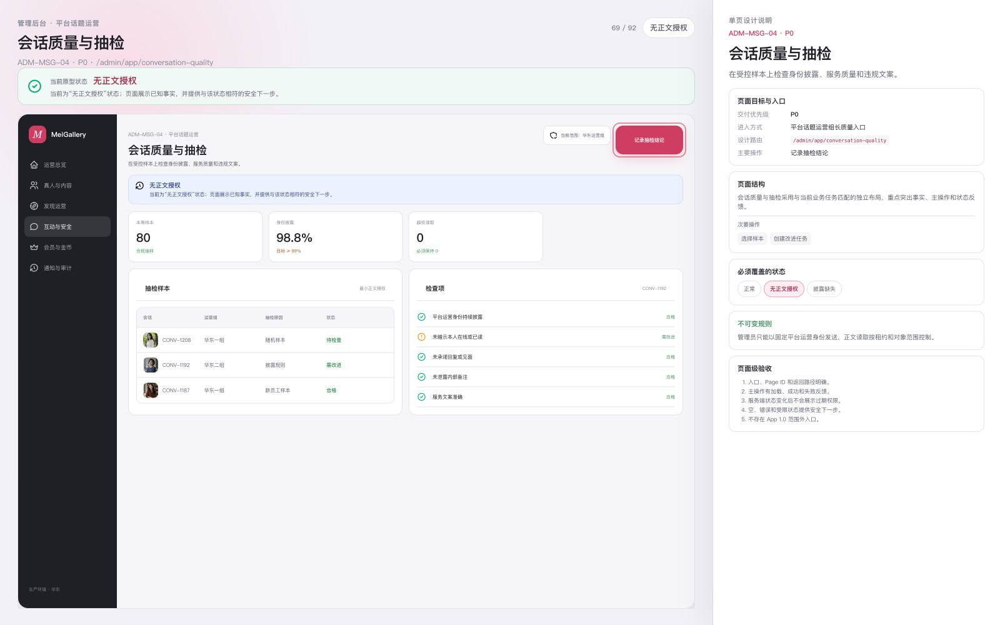

---

### 管理后台 · 安全与申诉

本组共 4 个页面。实现、接口、测试和缺陷均按 Page ID 追踪。

#### ADM-SAF-01 安全审核队列

**平台与模块：** 管理后台 · 安全与申诉　　**优先级：** P0　　**设计路由：** `/admin/app/reviews`

**用户价值：** 按优先级和时限分配真人、媒体、会话和消息举报案件。

**适用角色：** 安全专员、独立申诉复核人、Owner

**前置条件：** 管理员已登录，并同时满足角色 capability、对象范围、数据版本和必要的独立复核条件。

**进入路径：** 互动与安全导航或举报事件

**页面结构：** 筛选、范围、等待时间、状态和列表详情入口保持稳定。

**详细交互：** 用户从“互动与安全导航或举报事件”进入。主要操作为“领取案件”，执行时显示处理中状态；服务端确认成功后刷新权威数据并可进入 ADM-SAF-02「安全案件详情」。次要操作包括：调整优先级、升级案件。失败时保留已输入内容，展示可理解原因，并提供重试、返回或帮助入口。

**业务规则：** 后台写操作必须经过 capability、对象范围、版本检查和不可删除审计。

**数据与权限：** 管理员 API 与公开 API 分离；读取和写入同时校验 capability、对象范围、版本与审计要求。

**页面状态：** 正常、P0、超时、未分配

**Figma 最终稿映射：** `20｜Admin Pages` → `ADM-SAF-01`，共 4 个需求状态；在 [Figma 最终设计文件](https://www.figma.com/design/LaNSwwGsznwcpV8msj7BQC/Peachmote-UI-%E5%80%9F%E9%89%B4%E5%AE%A1%E6%9F%A5%E6%9D%BF---MeiGallery) 中按 Page ID 定位。

**实现追踪：**

- 追踪键：`ADM-SAF-01 → PRD-FR-032,PRD-FR-080,PRD-FR-081,PRD-FR-082,PRD-FR-090,PRD-FR-091,PRD-FR-092 → SCP-FR-012,SCP-FR-015 → A-07/MOD-FR-*`
- 产品需求：`PRD-FR-032`、`PRD-FR-080`、`PRD-FR-081`、`PRD-FR-082`、`PRD-FR-090`、`PRD-FR-091`、`PRD-FR-092`
- 发布范围：`SCP-FR-012`、`SCP-FR-015`
- 非功能要求：`PRD-NFR-001`、`PRD-NFR-002`、`PRD-NFR-003`、`PRD-NFR-005`、`PRD-NFR-006`、`PRD-NFR-007`、`PRD-NFR-008`
- 产品级验收：`PRD-AC-002`、`PRD-AC-005`、`PRD-AC-010`
- 模块 PRD：[A-07 举报、拉黑与安全审核](../ways-of-work/plan/real-person-discovery-platform/report-blocking-and-moderation/prd.md)（MOD-FR-*）

**开发验收：**

- 从“互动与安全导航或举报事件”能够进入，页面明确显示 ADM-SAF-01、页面名称、设计路由和返回路径。
- 主要操作“领取案件”具有处理中、成功和失败反馈，重复提交不会产生不可控的重复业务结果。
- 页面覆盖“正常、P0、超时、未分配”状态，并在空、错误、受限或冲突时提供安全下一步。
- 服务端状态变化后不会继续展示过期权限、过期余额、失效认证或不可访问内容。
- 后台写操作必须经过 capability、对象范围、版本检查和不可删除审计。
- UI 层、状态层、数据层和服务端契约不得使用页面展示名称替代稳定 ID、rank、entitlement 或状态枚举。
- 加载、空、错误、离线、无权限、对象失效和服务端状态变化必须按本页状态集合安全收敛。

**P0 关键状态：** 超时

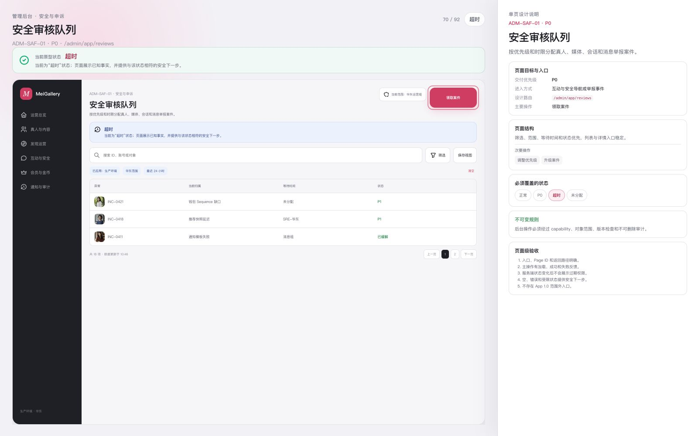

---

#### ADM-SAF-02 安全案件详情

**平台与模块：** 管理后台 · 安全与申诉　　**优先级：** P0　　**设计路由：** `/admin/app/reviews/{caseId}`

**用户价值：** 只展示处置所需的最小证据，并联动资料暂停、会话限制或账号限制。

**适用角色：** 安全专员、独立申诉复核人、Owner

**前置条件：** 管理员已登录，并同时满足角色 capability、对象范围、数据版本和必要的独立复核条件。

**进入路径：** 安全审核队列

**页面结构：** 事实证据、原处置、复核分工和结论理由形成完整案件视图。

**详细交互：** 用户从“安全审核队列”进入。主要操作为“提交处置”，执行时显示处理中状态；服务端确认成功后刷新权威数据并可进入 ADM-SAF-01「安全审核队列」。次要操作包括：请求补充、升级复核。失败时保留已输入内容，展示可理解原因，并提供重试、返回或帮助入口。

**业务规则：** 后台写操作必须经过 capability、对象范围、版本检查和不可删除审计。

**数据与权限：** 管理员 API 与公开 API 分离；读取和写入同时校验 capability、对象范围、版本与审计要求。

**页面状态：** 正常、证据受限、并发冲突、已冻结

**Figma 最终稿映射：** `20｜Admin Pages` → `ADM-SAF-02`，共 4 个需求状态；在 [Figma 最终设计文件](https://www.figma.com/design/LaNSwwGsznwcpV8msj7BQC/Peachmote-UI-%E5%80%9F%E9%89%B4%E5%AE%A1%E6%9F%A5%E6%9D%BF---MeiGallery) 中按 Page ID 定位。

**实现追踪：**

- 追踪键：`ADM-SAF-02 → PRD-FR-032,PRD-FR-080,PRD-FR-081,PRD-FR-082,PRD-FR-090,PRD-FR-091,PRD-FR-092 → SCP-FR-012,SCP-FR-015 → A-07/MOD-FR-*`
- 产品需求：`PRD-FR-032`、`PRD-FR-080`、`PRD-FR-081`、`PRD-FR-082`、`PRD-FR-090`、`PRD-FR-091`、`PRD-FR-092`
- 发布范围：`SCP-FR-012`、`SCP-FR-015`
- 非功能要求：`PRD-NFR-001`、`PRD-NFR-002`、`PRD-NFR-003`、`PRD-NFR-005`、`PRD-NFR-006`、`PRD-NFR-007`、`PRD-NFR-008`
- 产品级验收：`PRD-AC-002`、`PRD-AC-005`、`PRD-AC-010`
- 模块 PRD：[A-07 举报、拉黑与安全审核](../ways-of-work/plan/real-person-discovery-platform/report-blocking-and-moderation/prd.md)（MOD-FR-*）

**开发验收：**

- 从“安全审核队列”能够进入，页面明确显示 ADM-SAF-02、页面名称、设计路由和返回路径。
- 主要操作“提交处置”具有处理中、成功和失败反馈，重复提交不会产生不可控的重复业务结果。
- 页面覆盖“正常、证据受限、并发冲突、已冻结”状态，并在空、错误、受限或冲突时提供安全下一步。
- 服务端状态变化后不会继续展示过期权限、过期余额、失效认证或不可访问内容。
- 后台写操作必须经过 capability、对象范围、版本检查和不可删除审计。
- UI 层、状态层、数据层和服务端契约不得使用页面展示名称替代稳定 ID、rank、entitlement 或状态枚举。
- 加载、空、错误、离线、无权限、对象失效和服务端状态变化必须按本页状态集合安全收敛。

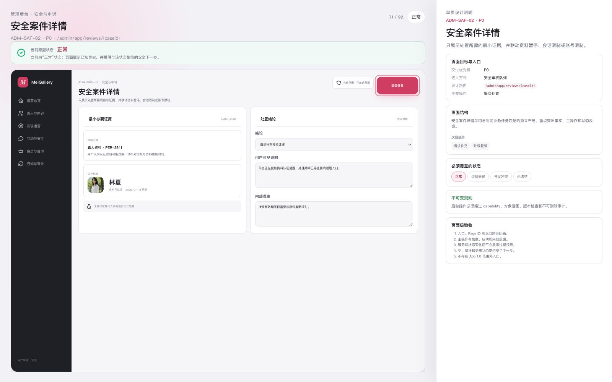

**P0 关键状态：** 证据受限

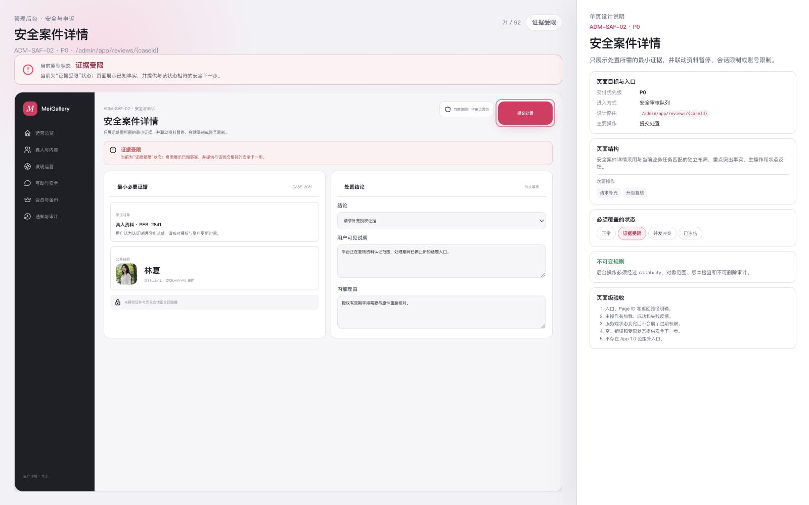

---

#### ADM-SAF-03 申诉队列

**平台与模块：** 管理后台 · 安全与申诉　　**优先级：** P0　　**设计路由：** `/admin/app/appeals`

**用户价值：** 把申诉分配给与原处置人员隔离的复核人员。

**适用角色：** 安全专员、独立申诉复核人、Owner

**前置条件：** 管理员已登录，并同时满足角色 capability、对象范围、数据版本和必要的独立复核条件。

**进入路径：** 安全与申诉导航

**页面结构：** 筛选、范围、等待时间、状态和列表详情入口保持稳定。

**详细交互：** 用户从“安全与申诉导航”进入。主要操作为“分配申诉”，执行时显示处理中状态；服务端确认成功后刷新权威数据并可进入 ADM-SAF-04「申诉详情」。次要操作包括：筛选状态、调整优先级。失败时保留已输入内容，展示可理解原因，并提供重试、返回或帮助入口。

**业务规则：** 后台写操作必须经过 capability、对象范围、版本检查和不可删除审计。

**数据与权限：** 管理员 API 与公开 API 分离；读取和写入同时校验 capability、对象范围、版本与审计要求。

**页面状态：** 正常、原审核人隔离、逾期

**Figma 最终稿映射：** `20｜Admin Pages` → `ADM-SAF-03`，共 3 个需求状态；在 [Figma 最终设计文件](https://www.figma.com/design/LaNSwwGsznwcpV8msj7BQC/Peachmote-UI-%E5%80%9F%E9%89%B4%E5%AE%A1%E6%9F%A5%E6%9D%BF---MeiGallery) 中按 Page ID 定位。

**实现追踪：**

- 追踪键：`ADM-SAF-03 → PRD-FR-032,PRD-FR-080,PRD-FR-081,PRD-FR-082,PRD-FR-090,PRD-FR-091,PRD-FR-092 → SCP-FR-012,SCP-FR-015 → A-07/MOD-FR-*`
- 产品需求：`PRD-FR-032`、`PRD-FR-080`、`PRD-FR-081`、`PRD-FR-082`、`PRD-FR-090`、`PRD-FR-091`、`PRD-FR-092`
- 发布范围：`SCP-FR-012`、`SCP-FR-015`
- 非功能要求：`PRD-NFR-001`、`PRD-NFR-002`、`PRD-NFR-003`、`PRD-NFR-005`、`PRD-NFR-006`、`PRD-NFR-007`、`PRD-NFR-008`
- 产品级验收：`PRD-AC-002`、`PRD-AC-005`、`PRD-AC-010`
- 模块 PRD：[A-07 举报、拉黑与安全审核](../ways-of-work/plan/real-person-discovery-platform/report-blocking-and-moderation/prd.md)（MOD-FR-*）

**开发验收：**

- 从“安全与申诉导航”能够进入，页面明确显示 ADM-SAF-03、页面名称、设计路由和返回路径。
- 主要操作“分配申诉”具有处理中、成功和失败反馈，重复提交不会产生不可控的重复业务结果。
- 页面覆盖“正常、原审核人隔离、逾期”状态，并在空、错误、受限或冲突时提供安全下一步。
- 服务端状态变化后不会继续展示过期权限、过期余额、失效认证或不可访问内容。
- 后台写操作必须经过 capability、对象范围、版本检查和不可删除审计。
- UI 层、状态层、数据层和服务端契约不得使用页面展示名称替代稳定 ID、rank、entitlement 或状态枚举。
- 加载、空、错误、离线、无权限、对象失效和服务端状态变化必须按本页状态集合安全收敛。

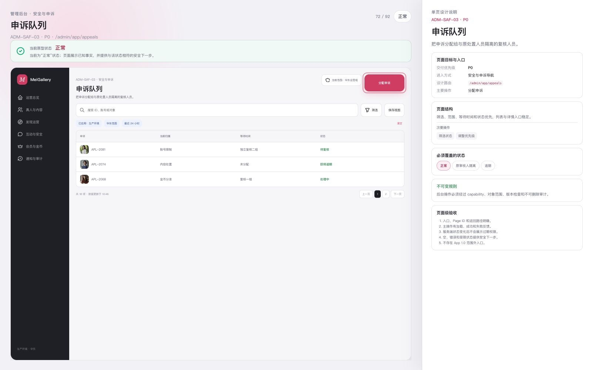

**P0 关键状态：** 原审核人隔离

---

#### ADM-SAF-04 申诉详情

**平台与模块：** 管理后台 · 安全与申诉　　**优先级：** P0　　**设计路由：** `/admin/app/appeals/{id}`

**用户价值：** 独立复核原事实、处置和新增说明，记录维持或改判理由。

**适用角色：** 安全专员、独立申诉复核人、Owner

**前置条件：** 管理员已登录，并同时满足角色 capability、对象范围、数据版本和必要的独立复核条件。

**进入路径：** 申诉队列

**页面结构：** 事实证据、原处置、复核分工和结论理由形成完整案件视图。

**详细交互：** 用户从“申诉队列”进入。主要操作为“提交复核结论”，执行时显示处理中状态；服务端确认成功后刷新权威数据并可进入 ADM-SAF-03「申诉队列」。次要操作包括：维持原判、改判、请求补充。失败时保留已输入内容，展示可理解原因，并提供重试、返回或帮助入口。

**业务规则：** 后台写操作必须经过 capability、对象范围、版本检查和不可删除审计。

**数据与权限：** 管理员 API 与公开 API 分离；读取和写入同时校验 capability、对象范围、版本与审计要求。

**页面状态：** 正常、证据不足、需要升级

**Figma 最终稿映射：** `20｜Admin Pages` → `ADM-SAF-04`，共 3 个需求状态；在 [Figma 最终设计文件](https://www.figma.com/design/LaNSwwGsznwcpV8msj7BQC/Peachmote-UI-%E5%80%9F%E9%89%B4%E5%AE%A1%E6%9F%A5%E6%9D%BF---MeiGallery) 中按 Page ID 定位。

**实现追踪：**

- 追踪键：`ADM-SAF-04 → PRD-FR-032,PRD-FR-080,PRD-FR-081,PRD-FR-082,PRD-FR-090,PRD-FR-091,PRD-FR-092 → SCP-FR-012,SCP-FR-015 → A-07/MOD-FR-*`
- 产品需求：`PRD-FR-032`、`PRD-FR-080`、`PRD-FR-081`、`PRD-FR-082`、`PRD-FR-090`、`PRD-FR-091`、`PRD-FR-092`
- 发布范围：`SCP-FR-012`、`SCP-FR-015`
- 非功能要求：`PRD-NFR-001`、`PRD-NFR-002`、`PRD-NFR-003`、`PRD-NFR-005`、`PRD-NFR-006`、`PRD-NFR-007`、`PRD-NFR-008`
- 产品级验收：`PRD-AC-002`、`PRD-AC-005`、`PRD-AC-010`
- 模块 PRD：[A-07 举报、拉黑与安全审核](../ways-of-work/plan/real-person-discovery-platform/report-blocking-and-moderation/prd.md)（MOD-FR-*）

**开发验收：**

- 从“申诉队列”能够进入，页面明确显示 ADM-SAF-04、页面名称、设计路由和返回路径。
- 主要操作“提交复核结论”具有处理中、成功和失败反馈，重复提交不会产生不可控的重复业务结果。
- 页面覆盖“正常、证据不足、需要升级”状态，并在空、错误、受限或冲突时提供安全下一步。
- 服务端状态变化后不会继续展示过期权限、过期余额、失效认证或不可访问内容。
- 后台写操作必须经过 capability、对象范围、版本检查和不可删除审计。
- UI 层、状态层、数据层和服务端契约不得使用页面展示名称替代稳定 ID、rank、entitlement 或状态枚举。
- 加载、空、错误、离线、无权限、对象失效和服务端状态变化必须按本页状态集合安全收敛。

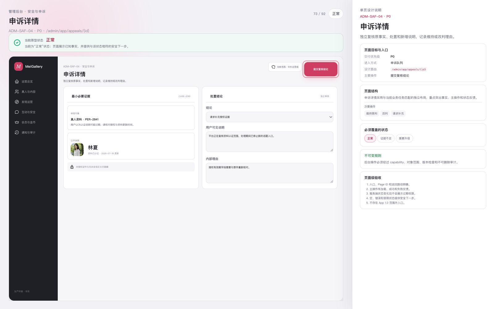

**P0 关键状态：** 证据不足

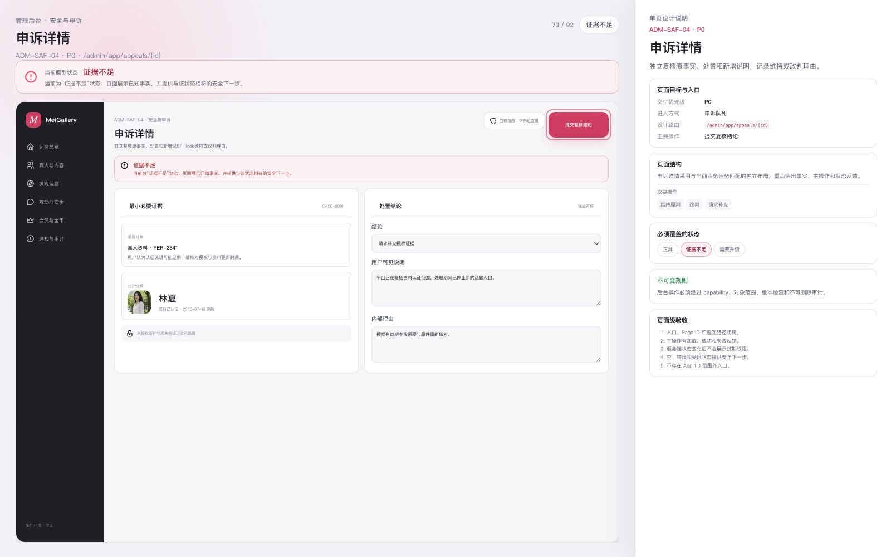

---

### 管理后台 · 会员与金币

本组共 12 个页面。实现、接口、测试和缺陷均按 Page ID 追踪。

#### ADM-MBR-01 五级会员目录

**平台与模块：** 管理后台 · 会员与金币　　**优先级：** P1　　**设计路由：** `/admin/app/membership/catalogs`

**用户价值：** 版本化配置五级会员名称、rank 和 entitlement 组合。

**适用角色：** 会员运营、独立复核人、Owner

**前置条件：** 管理员已登录，并同时满足角色 capability、对象范围、数据版本和必要的独立复核条件。

**进入路径：** 会员与金币导航

**页面结构：** 会员目录版本、等级 rank、权益差异和发布状态集中展示。

**详细交互：** 用户从“会员与金币导航”进入。主要操作为“新建目录版本”，执行时显示处理中状态；服务端确认成功后刷新权威数据并可进入 ADM-MBR-02「Entitlement 定义」。次要操作包括：比较版本、提交发布。失败时保留已输入内容，展示可理解原因，并提供重试、返回或帮助入口。

**业务规则：** 等级名称配置化，权限使用 rank 与稳定 entitlement key，不硬编码会员名称。

**数据与权限：** 高风险写操作采用申请—独立复核—执行状态机；申请人不得复核本人操作，所有阶段写入审计。

**页面状态：** 正常、草稿、生效、待回滚

**Figma 最终稿映射：** `20｜Admin Pages` → `ADM-MBR-01`，共 4 个需求状态；在 [Figma 最终设计文件](https://www.figma.com/design/LaNSwwGsznwcpV8msj7BQC/Peachmote-UI-%E5%80%9F%E9%89%B4%E5%AE%A1%E6%9F%A5%E6%9D%BF---MeiGallery) 中按 Page ID 定位。

**实现追踪：**

- 追踪键：`ADM-MBR-01 → PRD-FR-060,PRD-FR-061,PRD-FR-062,PRD-FR-063,PRD-FR-064,PRD-FR-065,PRD-FR-066,PRD-FR-090,PRD-FR-091,PRD-FR-092 → SCP-FR-004,SCP-FR-005,SCP-FR-005B,SCP-FR-012,SCP-FR-030 → F-09、A-08/MBR-FR-*`
- 产品需求：`PRD-FR-060`、`PRD-FR-061`、`PRD-FR-062`、`PRD-FR-063`、`PRD-FR-064`、`PRD-FR-065`、`PRD-FR-066`、`PRD-FR-090`、`PRD-FR-091`、`PRD-FR-092`
- 发布范围：`SCP-FR-004`、`SCP-FR-005`、`SCP-FR-005B`、`SCP-FR-012`、`SCP-FR-030`
- 非功能要求：`PRD-NFR-001`、`PRD-NFR-002`、`PRD-NFR-003`、`PRD-NFR-004`、`PRD-NFR-005`、`PRD-NFR-006`、`PRD-NFR-007`、`PRD-NFR-008`
- 产品级验收：`PRD-AC-007`、`PRD-AC-009`、`PRD-AC-011`
- 模块 PRD：[F-09、A-08 心享会员、Entitlement 与管理员手动发放](../ways-of-work/plan/real-person-discovery-platform/membership-entitlements-and-manual-grants/prd.md)（MBR-FR-*）

**开发验收：**

- 从“会员与金币导航”能够进入，页面明确显示 ADM-MBR-01、页面名称、设计路由和返回路径。
- 主要操作“新建目录版本”具有处理中、成功和失败反馈，重复提交不会产生不可控的重复业务结果。
- 页面覆盖“正常、草稿、生效、待回滚”状态，并在空、错误、受限或冲突时提供安全下一步。
- 服务端状态变化后不会继续展示过期权限、过期余额、失效认证或不可访问内容。
- 等级名称配置化，权限使用 rank 与稳定 entitlement key，不硬编码会员名称。
- UI 层、状态层、数据层和服务端契约不得使用页面展示名称替代稳定 ID、rank、entitlement 或状态枚举。
- 加载、空、错误、离线、无权限、对象失效和服务端状态变化必须按本页状态集合安全收敛。

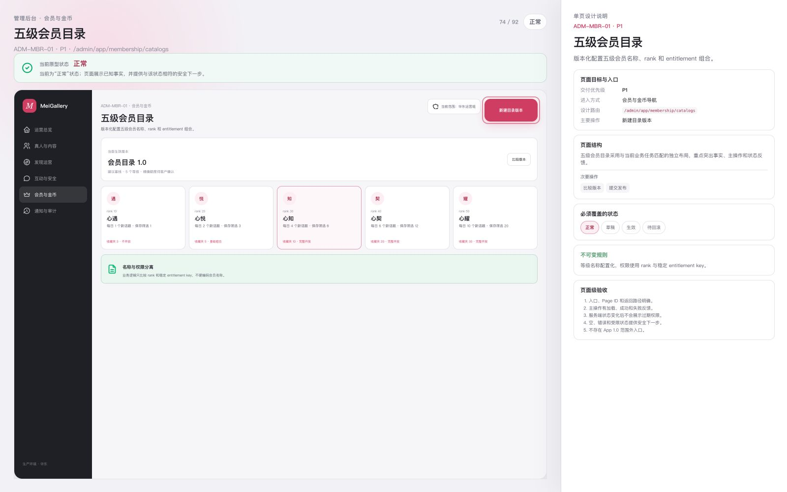

---

#### ADM-MBR-02 Entitlement 定义

**平台与模块：** 管理后台 · 会员与金币　　**优先级：** P1　　**设计路由：** `/admin/app/entitlements`

**用户价值：** 管理稳定能力键、参数 Schema 和客户端兼容范围。

**适用角色：** 会员运营、独立复核人、Owner

**前置条件：** 管理员已登录，并同时满足角色 capability、对象范围、数据版本和必要的独立复核条件。

**进入路径：** 会员目录或技术配置入口

**页面结构：** 稳定能力键、参数 Schema、兼容范围和影响查询并列。

**详细交互：** 用户从“会员目录或技术配置入口”进入。主要操作为“新建 Entitlement”，执行时显示处理中状态；服务端确认成功后刷新权威数据并可进入 ADM-MBR-01「五级会员目录」。次要操作包括：Schema 校验、影响查询。失败时保留已输入内容，展示可理解原因，并提供重试、返回或帮助入口。

**业务规则：** 等级名称配置化，权限使用 rank 与稳定 entitlement key，不硬编码会员名称。

**数据与权限：** 高风险写操作采用申请—独立复核—执行状态机；申请人不得复核本人操作，所有阶段写入审计。

**页面状态：** 正常、未知客户端、合并冲突

**Figma 最终稿映射：** `20｜Admin Pages` → `ADM-MBR-02`，共 3 个需求状态；在 [Figma 最终设计文件](https://www.figma.com/design/LaNSwwGsznwcpV8msj7BQC/Peachmote-UI-%E5%80%9F%E9%89%B4%E5%AE%A1%E6%9F%A5%E6%9D%BF---MeiGallery) 中按 Page ID 定位。

**实现追踪：**

- 追踪键：`ADM-MBR-02 → PRD-FR-060,PRD-FR-061,PRD-FR-062,PRD-FR-063,PRD-FR-064,PRD-FR-065,PRD-FR-066,PRD-FR-090,PRD-FR-091,PRD-FR-092 → SCP-FR-004,SCP-FR-005,SCP-FR-005B,SCP-FR-012,SCP-FR-030 → F-09、A-08/MBR-FR-*`
- 产品需求：`PRD-FR-060`、`PRD-FR-061`、`PRD-FR-062`、`PRD-FR-063`、`PRD-FR-064`、`PRD-FR-065`、`PRD-FR-066`、`PRD-FR-090`、`PRD-FR-091`、`PRD-FR-092`
- 发布范围：`SCP-FR-004`、`SCP-FR-005`、`SCP-FR-005B`、`SCP-FR-012`、`SCP-FR-030`
- 非功能要求：`PRD-NFR-001`、`PRD-NFR-002`、`PRD-NFR-003`、`PRD-NFR-004`、`PRD-NFR-005`、`PRD-NFR-006`、`PRD-NFR-007`、`PRD-NFR-008`
- 产品级验收：`PRD-AC-007`、`PRD-AC-009`、`PRD-AC-011`
- 模块 PRD：[F-09、A-08 心享会员、Entitlement 与管理员手动发放](../ways-of-work/plan/real-person-discovery-platform/membership-entitlements-and-manual-grants/prd.md)（MBR-FR-*）

**开发验收：**

- 从“会员目录或技术配置入口”能够进入，页面明确显示 ADM-MBR-02、页面名称、设计路由和返回路径。
- 主要操作“新建 Entitlement”具有处理中、成功和失败反馈，重复提交不会产生不可控的重复业务结果。
- 页面覆盖“正常、未知客户端、合并冲突”状态，并在空、错误、受限或冲突时提供安全下一步。
- 服务端状态变化后不会继续展示过期权限、过期余额、失效认证或不可访问内容。
- 等级名称配置化，权限使用 rank 与稳定 entitlement key，不硬编码会员名称。
- UI 层、状态层、数据层和服务端契约不得使用页面展示名称替代稳定 ID、rank、entitlement 或状态枚举。
- 加载、空、错误、离线、无权限、对象失效和服务端状态变化必须按本页状态集合安全收敛。

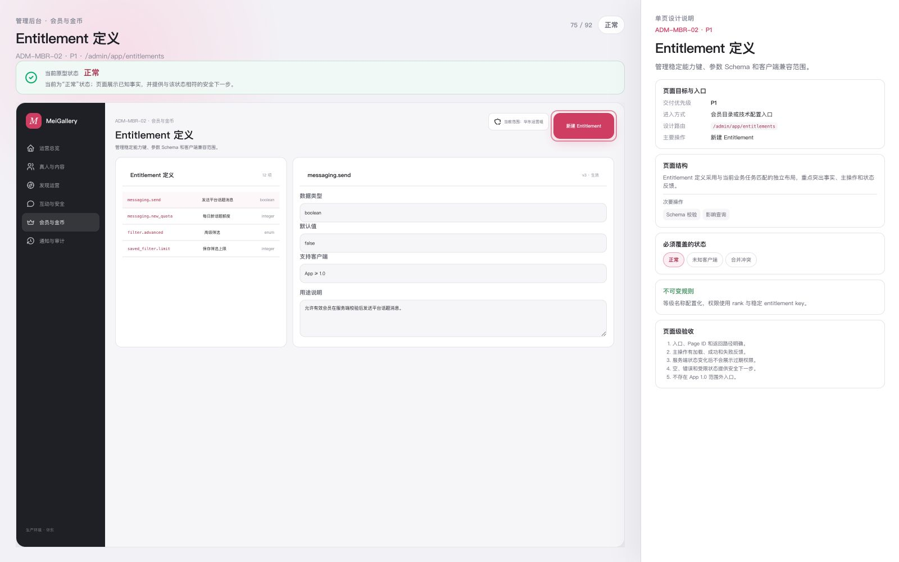

---

#### ADM-MBR-03 会员申请与发放队列

**平台与模块：** 管理后台 · 会员与金币　　**优先级：** P0　　**设计路由：** `/admin/app/membership/applications`

**用户价值：** 受理用户申请、搜索账号、查看处理与发放时间线，并进入发放申请。

**适用角色：** 会员运营、独立复核人、Owner

**前置条件：** 管理员已登录，并同时满足角色 capability、对象范围、数据版本和必要的独立复核条件。

**进入路径：** 会员与金币导航

**页面结构：** 申请队列、账号事实、处理状态和发放时间线保持可追溯。

**详细交互：** 用户从“会员与金币导航”进入。主要操作为“受理会员申请”，执行时显示处理中状态；服务端确认成功后刷新权威数据并可进入 ADM-MBR-04「会员发放申请」。次要操作包括：领取申请、查看账号、查看时间线。失败时保留已输入内容，展示可理解原因，并提供重试、返回或帮助入口。

**业务规则：** 等级名称配置化，权限使用 rank 与稳定 entitlement key，不硬编码会员名称。

**数据与权限：** 高风险写操作采用申请—独立复核—执行状态机；申请人不得复核本人操作，所有阶段写入审计。

**页面状态：** 待处理、处理中、待补充、已通过、已拒绝、直接发放

**Figma 最终稿映射：** `20｜Admin Pages` → `ADM-MBR-03`，共 6 个需求状态；在 [Figma 最终设计文件](https://www.figma.com/design/LaNSwwGsznwcpV8msj7BQC/Peachmote-UI-%E5%80%9F%E9%89%B4%E5%AE%A1%E6%9F%A5%E6%9D%BF---MeiGallery) 中按 Page ID 定位。

**实现追踪：**

- 追踪键：`ADM-MBR-03 → PRD-FR-060,PRD-FR-061,PRD-FR-062,PRD-FR-063,PRD-FR-064,PRD-FR-065,PRD-FR-066,PRD-FR-090,PRD-FR-091,PRD-FR-092 → SCP-FR-004,SCP-FR-005,SCP-FR-005B,SCP-FR-012,SCP-FR-030 → F-09、A-08/MBR-FR-*`
- 产品需求：`PRD-FR-060`、`PRD-FR-061`、`PRD-FR-062`、`PRD-FR-063`、`PRD-FR-064`、`PRD-FR-065`、`PRD-FR-066`、`PRD-FR-090`、`PRD-FR-091`、`PRD-FR-092`
- 发布范围：`SCP-FR-004`、`SCP-FR-005`、`SCP-FR-005B`、`SCP-FR-012`、`SCP-FR-030`
- 非功能要求：`PRD-NFR-001`、`PRD-NFR-002`、`PRD-NFR-003`、`PRD-NFR-004`、`PRD-NFR-005`、`PRD-NFR-006`、`PRD-NFR-007`、`PRD-NFR-008`
- 产品级验收：`PRD-AC-007`、`PRD-AC-009`、`PRD-AC-011`
- 模块 PRD：[F-09、A-08 心享会员、Entitlement 与管理员手动发放](../ways-of-work/plan/real-person-discovery-platform/membership-entitlements-and-manual-grants/prd.md)（MBR-FR-*）

**开发验收：**

- 从“会员与金币导航”能够进入，页面明确显示 ADM-MBR-03、页面名称、设计路由和返回路径。
- 主要操作“受理会员申请”具有处理中、成功和失败反馈，重复提交不会产生不可控的重复业务结果。
- 页面覆盖“待处理、处理中、待补充、已通过、已拒绝、直接发放”状态，并在空、错误、受限或冲突时提供安全下一步。
- 服务端状态变化后不会继续展示过期权限、过期余额、失效认证或不可访问内容。
- 等级名称配置化，权限使用 rank 与稳定 entitlement key，不硬编码会员名称。
- UI 层、状态层、数据层和服务端契约不得使用页面展示名称替代稳定 ID、rank、entitlement 或状态枚举。
- 加载、空、错误、离线、无权限、对象失效和服务端状态变化必须按本页状态集合安全收敛。

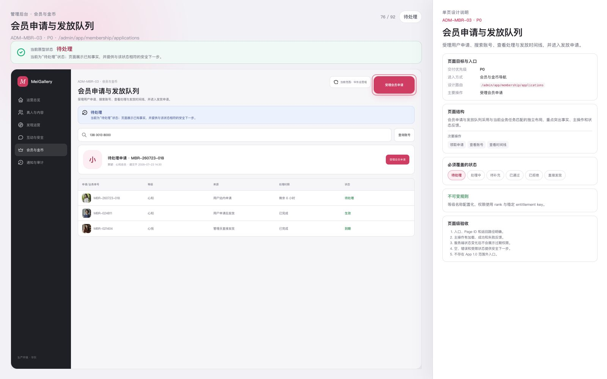

**P0 关键状态：** 已拒绝

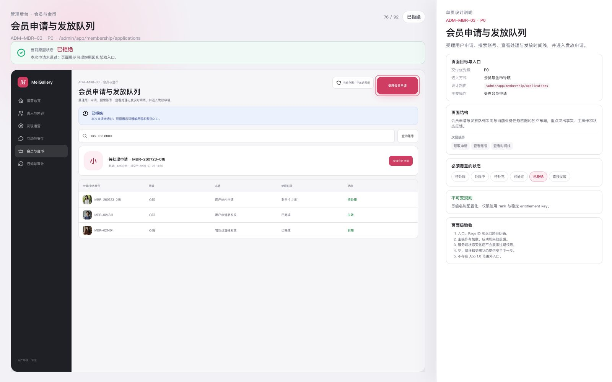

---

#### ADM-MBR-04 会员发放申请

**平台与模块：** 管理后台 · 会员与金币　　**优先级：** P0　　**设计路由：** `/admin/app/membership/grants/new`

**用户价值：** 填写等级、有效期、来源、业务单号、用户说明和内部原因。

**适用角色：** 会员运营、独立复核人、Owner

**前置条件：** 管理员已登录，并同时满足角色 capability、对象范围、数据版本和必要的独立复核条件。

**进入路径：** 发放记录主操作

**页面结构：** 对象事实、表单字段、风险提示、预览和提交动作按任务顺序组织。

**详细交互：** 用户从“发放记录主操作”进入。主要操作为“提交发放申请”，执行时显示处理中状态；服务端确认成功后刷新权威数据并可进入 ADM-MBR-05「会员发放复核」。次要操作包括：保存草稿、预览权益差异。失败时保留已输入内容，展示可理解原因，并提供重试、返回或帮助入口。

**业务规则：** 等级名称配置化，权限使用 rank 与稳定 entitlement key，不硬编码会员名称。

**数据与权限：** 高风险写操作采用申请—独立复核—执行状态机；申请人不得复核本人操作，所有阶段写入审计。

**页面状态：** 正常、账号错误、高风险、重复业务单

**Figma 最终稿映射：** `20｜Admin Pages` → `ADM-MBR-04`，共 4 个需求状态；在 [Figma 最终设计文件](https://www.figma.com/design/LaNSwwGsznwcpV8msj7BQC/Peachmote-UI-%E5%80%9F%E9%89%B4%E5%AE%A1%E6%9F%A5%E6%9D%BF---MeiGallery) 中按 Page ID 定位。

**实现追踪：**

- 追踪键：`ADM-MBR-04 → PRD-FR-060,PRD-FR-061,PRD-FR-062,PRD-FR-063,PRD-FR-064,PRD-FR-065,PRD-FR-066,PRD-FR-090,PRD-FR-091,PRD-FR-092 → SCP-FR-004,SCP-FR-005,SCP-FR-005B,SCP-FR-012,SCP-FR-030 → F-09、A-08/MBR-FR-*`
- 产品需求：`PRD-FR-060`、`PRD-FR-061`、`PRD-FR-062`、`PRD-FR-063`、`PRD-FR-064`、`PRD-FR-065`、`PRD-FR-066`、`PRD-FR-090`、`PRD-FR-091`、`PRD-FR-092`
- 发布范围：`SCP-FR-004`、`SCP-FR-005`、`SCP-FR-005B`、`SCP-FR-012`、`SCP-FR-030`
- 非功能要求：`PRD-NFR-001`、`PRD-NFR-002`、`PRD-NFR-003`、`PRD-NFR-004`、`PRD-NFR-005`、`PRD-NFR-006`、`PRD-NFR-007`、`PRD-NFR-008`
- 产品级验收：`PRD-AC-007`、`PRD-AC-009`、`PRD-AC-011`
- 模块 PRD：[F-09、A-08 心享会员、Entitlement 与管理员手动发放](../ways-of-work/plan/real-person-discovery-platform/membership-entitlements-and-manual-grants/prd.md)（MBR-FR-*）

**开发验收：**

- 从“发放记录主操作”能够进入，页面明确显示 ADM-MBR-04、页面名称、设计路由和返回路径。
- 主要操作“提交发放申请”具有处理中、成功和失败反馈，重复提交不会产生不可控的重复业务结果。
- 页面覆盖“正常、账号错误、高风险、重复业务单”状态，并在空、错误、受限或冲突时提供安全下一步。
- 服务端状态变化后不会继续展示过期权限、过期余额、失效认证或不可访问内容。
- 等级名称配置化，权限使用 rank 与稳定 entitlement key，不硬编码会员名称。
- UI 层、状态层、数据层和服务端契约不得使用页面展示名称替代稳定 ID、rank、entitlement 或状态枚举。
- 加载、空、错误、离线、无权限、对象失效和服务端状态变化必须按本页状态集合安全收敛。

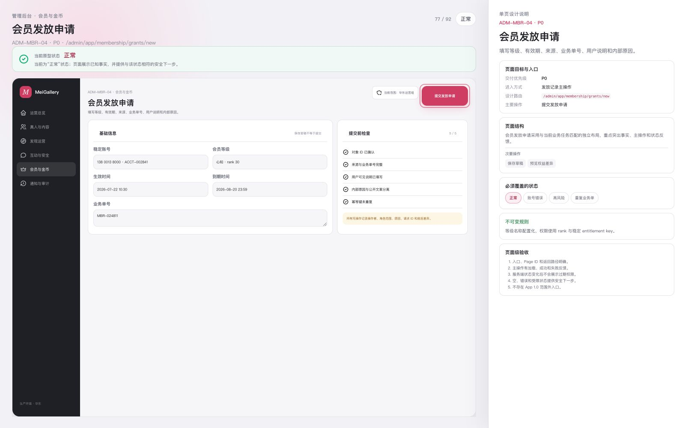

**P0 关键状态：** 账号错误

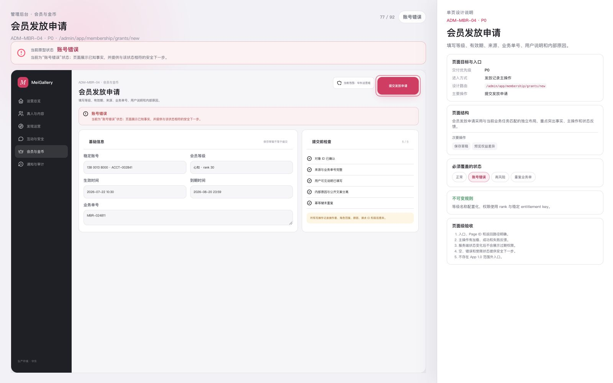

---

#### ADM-MBR-05 会员发放复核

**平台与模块：** 管理后台 · 会员与金币　　**优先级：** P0　　**设计路由：** `/admin/app/membership/reviews/{id}`

**用户价值：** 由独立复核人比较前后权益并批准或拒绝。

**适用角色：** 会员运营、独立复核人、Owner

**前置条件：** 管理员已登录，并同时满足角色 capability、对象范围、数据版本和必要的独立复核条件。

**进入路径：** 复核任务队列

**页面结构：** 申请事实与复核检查并列，前后影响和职责分离始终可见。

**详细交互：** 用户从“复核任务队列”进入。主要操作为“批准发放”，执行时显示处理中状态；服务端确认成功后刷新权威数据并可进入 ADM-MBR-03「会员申请与发放队列」。次要操作包括：拒绝、查看申请来源。失败时保留已输入内容，展示可理解原因，并提供重试、返回或帮助入口。

**业务规则：** 等级名称配置化，权限使用 rank 与稳定 entitlement key，不硬编码会员名称。

**数据与权限：** 高风险写操作采用申请—独立复核—执行状态机；申请人不得复核本人操作，所有阶段写入审计。

**页面状态：** 正常、发起人冲突、账号状态已变

**Figma 最终稿映射：** `20｜Admin Pages` → `ADM-MBR-05`，共 3 个需求状态；在 [Figma 最终设计文件](https://www.figma.com/design/LaNSwwGsznwcpV8msj7BQC/Peachmote-UI-%E5%80%9F%E9%89%B4%E5%AE%A1%E6%9F%A5%E6%9D%BF---MeiGallery) 中按 Page ID 定位。

**实现追踪：**

- 追踪键：`ADM-MBR-05 → PRD-FR-060,PRD-FR-061,PRD-FR-062,PRD-FR-063,PRD-FR-064,PRD-FR-065,PRD-FR-066,PRD-FR-090,PRD-FR-091,PRD-FR-092 → SCP-FR-004,SCP-FR-005,SCP-FR-005B,SCP-FR-012,SCP-FR-030 → F-09、A-08/MBR-FR-*`
- 产品需求：`PRD-FR-060`、`PRD-FR-061`、`PRD-FR-062`、`PRD-FR-063`、`PRD-FR-064`、`PRD-FR-065`、`PRD-FR-066`、`PRD-FR-090`、`PRD-FR-091`、`PRD-FR-092`
- 发布范围：`SCP-FR-004`、`SCP-FR-005`、`SCP-FR-005B`、`SCP-FR-012`、`SCP-FR-030`
- 非功能要求：`PRD-NFR-001`、`PRD-NFR-002`、`PRD-NFR-003`、`PRD-NFR-004`、`PRD-NFR-005`、`PRD-NFR-006`、`PRD-NFR-007`、`PRD-NFR-008`
- 产品级验收：`PRD-AC-007`、`PRD-AC-009`、`PRD-AC-011`
- 模块 PRD：[F-09、A-08 心享会员、Entitlement 与管理员手动发放](../ways-of-work/plan/real-person-discovery-platform/membership-entitlements-and-manual-grants/prd.md)（MBR-FR-*）

**开发验收：**

- 从“复核任务队列”能够进入，页面明确显示 ADM-MBR-05、页面名称、设计路由和返回路径。
- 主要操作“批准发放”具有处理中、成功和失败反馈，重复提交不会产生不可控的重复业务结果。
- 页面覆盖“正常、发起人冲突、账号状态已变”状态，并在空、错误、受限或冲突时提供安全下一步。
- 服务端状态变化后不会继续展示过期权限、过期余额、失效认证或不可访问内容。
- 等级名称配置化，权限使用 rank 与稳定 entitlement key，不硬编码会员名称。
- UI 层、状态层、数据层和服务端契约不得使用页面展示名称替代稳定 ID、rank、entitlement 或状态枚举。
- 加载、空、错误、离线、无权限、对象失效和服务端状态变化必须按本页状态集合安全收敛。

**P0 关键状态：** 发起人冲突

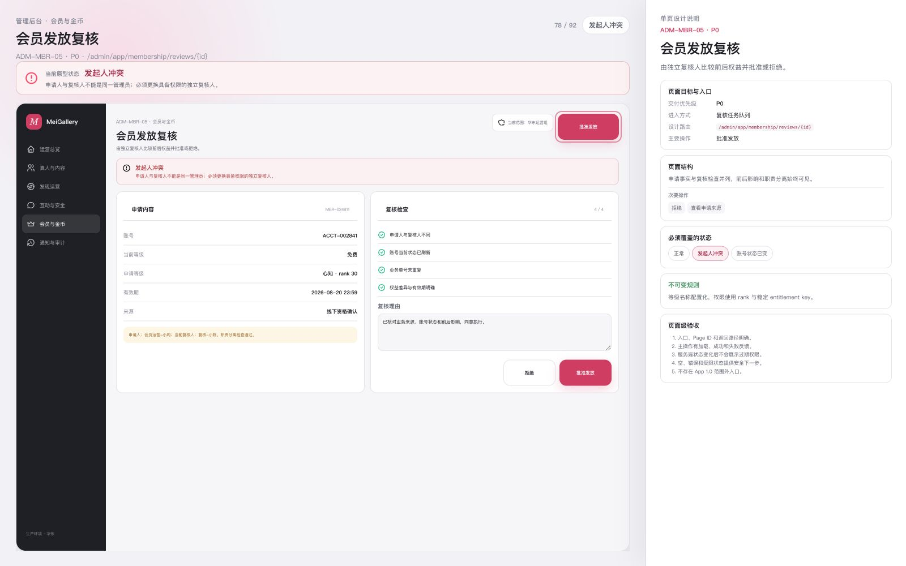

---

#### ADM-MBR-06 旧会员映射

**平台与模块：** 管理后台 · 会员与金币　　**优先级：** P1　　**设计路由：** `/admin/app/membership/migrations`

**用户价值：** 对 legacy vip/svip 证据执行 Dry-run、逐项复核和受控迁移。

**适用角色：** 会员运营、独立复核人、Owner

**前置条件：** 管理员已登录，并同时满足角色 capability、对象范围、数据版本和必要的独立复核条件。

**进入路径：** 迁移工作台

**页面结构：** 证据、映射、Dry-run、冲突和受控执行形成迁移闭环。

**详细交互：** 用户从“迁移工作台”进入。主要操作为“执行迁移”，执行时显示处理中状态；服务端确认成功后刷新权威数据并可进入 ADM-MBR-03「会员申请与发放队列」。次要操作包括：运行 Dry-run、导出冲突。失败时保留已输入内容，展示可理解原因，并提供重试、返回或帮助入口。

**业务规则：** 等级名称配置化，权限使用 rank 与稳定 entitlement key，不硬编码会员名称。

**数据与权限：** 高风险写操作采用申请—独立复核—执行状态机；申请人不得复核本人操作，所有阶段写入审计。

**页面状态：** 正常、证据不足、映射冲突

**Figma 最终稿映射：** `20｜Admin Pages` → `ADM-MBR-06`，共 3 个需求状态；在 [Figma 最终设计文件](https://www.figma.com/design/LaNSwwGsznwcpV8msj7BQC/Peachmote-UI-%E5%80%9F%E9%89%B4%E5%AE%A1%E6%9F%A5%E6%9D%BF---MeiGallery) 中按 Page ID 定位。

**实现追踪：**

- 追踪键：`ADM-MBR-06 → PRD-FR-060,PRD-FR-061,PRD-FR-062,PRD-FR-063,PRD-FR-064,PRD-FR-065,PRD-FR-066,PRD-FR-090,PRD-FR-091,PRD-FR-092 → SCP-FR-004,SCP-FR-005,SCP-FR-005B,SCP-FR-012,SCP-FR-030 → F-09、A-08/MBR-FR-*`
- 产品需求：`PRD-FR-060`、`PRD-FR-061`、`PRD-FR-062`、`PRD-FR-063`、`PRD-FR-064`、`PRD-FR-065`、`PRD-FR-066`、`PRD-FR-090`、`PRD-FR-091`、`PRD-FR-092`
- 发布范围：`SCP-FR-004`、`SCP-FR-005`、`SCP-FR-005B`、`SCP-FR-012`、`SCP-FR-030`
- 非功能要求：`PRD-NFR-001`、`PRD-NFR-002`、`PRD-NFR-003`、`PRD-NFR-004`、`PRD-NFR-005`、`PRD-NFR-006`、`PRD-NFR-007`、`PRD-NFR-008`
- 产品级验收：`PRD-AC-007`、`PRD-AC-009`、`PRD-AC-011`
- 模块 PRD：[F-09、A-08 心享会员、Entitlement 与管理员手动发放](../ways-of-work/plan/real-person-discovery-platform/membership-entitlements-and-manual-grants/prd.md)（MBR-FR-*）

**开发验收：**

- 从“迁移工作台”能够进入，页面明确显示 ADM-MBR-06、页面名称、设计路由和返回路径。
- 主要操作“执行迁移”具有处理中、成功和失败反馈，重复提交不会产生不可控的重复业务结果。
- 页面覆盖“正常、证据不足、映射冲突”状态，并在空、错误、受限或冲突时提供安全下一步。
- 服务端状态变化后不会继续展示过期权限、过期余额、失效认证或不可访问内容。
- 等级名称配置化，权限使用 rank 与稳定 entitlement key，不硬编码会员名称。
- UI 层、状态层、数据层和服务端契约不得使用页面展示名称替代稳定 ID、rank、entitlement 或状态枚举。
- 加载、空、错误、离线、无权限、对象失效和服务端状态变化必须按本页状态集合安全收敛。

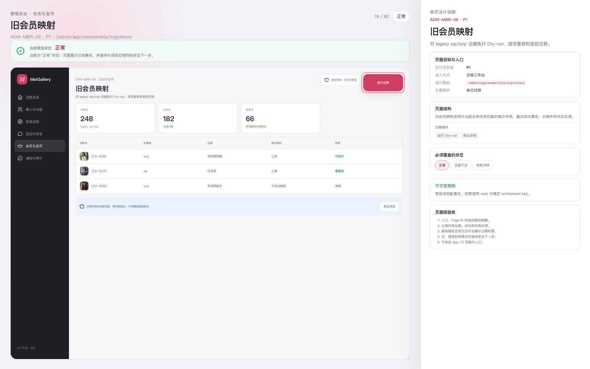

---

#### ADM-WAL-01 钱包查询

**平台与模块：** 管理后台 · 会员与金币　　**优先级：** P0　　**设计路由：** `/admin/app/wallets`

**用户价值：** 按稳定账号搜索余额、有效分录和对账状态。

**适用角色：** 财务运营、独立复核人、Owner

**前置条件：** 管理员已登录，并同时满足角色 capability、对象范围、数据版本和必要的独立复核条件。

**进入路径：** 会员与金币导航

**页面结构：** 稳定账号搜索、余额、分录和对账状态组成钱包查询入口。

**详细交互：** 用户从“会员与金币导航”进入。主要操作为“查看钱包”，执行时显示处理中状态；服务端确认成功后刷新权威数据并可进入 ADM-WAL-02「钱包详情」。次要操作包括：搜索账号、筛选异常。失败时保留已输入内容，展示可理解原因，并提供重试、返回或帮助入口。

**业务规则：** 余额只允许通过追加分录变化；高风险申请必须由不同管理员复核。

**数据与权限：** 高风险写操作采用申请—独立复核—执行状态机；申请人不得复核本人操作，所有阶段写入审计。

**页面状态：** 正常、账号受限、对账异常

**Figma 最终稿映射：** `20｜Admin Pages` → `ADM-WAL-01`，共 3 个需求状态；在 [Figma 最终设计文件](https://www.figma.com/design/LaNSwwGsznwcpV8msj7BQC/Peachmote-UI-%E5%80%9F%E9%89%B4%E5%AE%A1%E6%9F%A5%E6%9D%BF---MeiGallery) 中按 Page ID 定位。

**实现追踪：**

- 追踪键：`ADM-WAL-01 → PRD-FR-070,PRD-FR-071,PRD-FR-074,PRD-FR-090,PRD-FR-091,PRD-FR-092 → SCP-FR-010,SCP-FR-012 → F-10、A-10/WAL-FR-*`
- 产品需求：`PRD-FR-070`、`PRD-FR-071`、`PRD-FR-074`、`PRD-FR-090`、`PRD-FR-091`、`PRD-FR-092`
- 发布范围：`SCP-FR-010`、`SCP-FR-012`
- 非功能要求：`PRD-NFR-001`、`PRD-NFR-002`、`PRD-NFR-003`、`PRD-NFR-005`、`PRD-NFR-006`、`PRD-NFR-007`、`PRD-NFR-008`
- 产品级验收：`PRD-AC-006`、`PRD-AC-010`
- 模块 PRD：[F-10、A-10 金币钱包与管理员调币](../ways-of-work/plan/real-person-discovery-platform/wallet-ledger-and-admin-coin-adjustments/prd.md)（WAL-FR-*）

**开发验收：**

- 从“会员与金币导航”能够进入，页面明确显示 ADM-WAL-01、页面名称、设计路由和返回路径。
- 主要操作“查看钱包”具有处理中、成功和失败反馈，重复提交不会产生不可控的重复业务结果。
- 页面覆盖“正常、账号受限、对账异常”状态，并在空、错误、受限或冲突时提供安全下一步。
- 服务端状态变化后不会继续展示过期权限、过期余额、失效认证或不可访问内容。
- 余额只允许通过追加分录变化；高风险申请必须由不同管理员复核。
- UI 层、状态层、数据层和服务端契约不得使用页面展示名称替代稳定 ID、rank、entitlement 或状态枚举。
- 加载、空、错误、离线、无权限、对象失效和服务端状态变化必须按本页状态集合安全收敛。

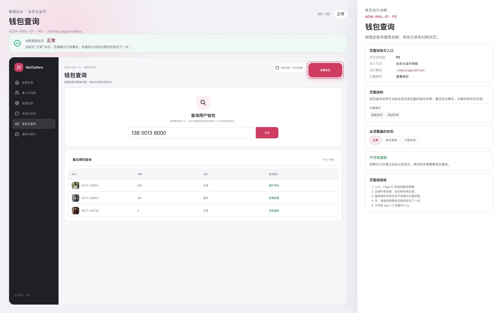

**P0 关键状态：** 账号受限

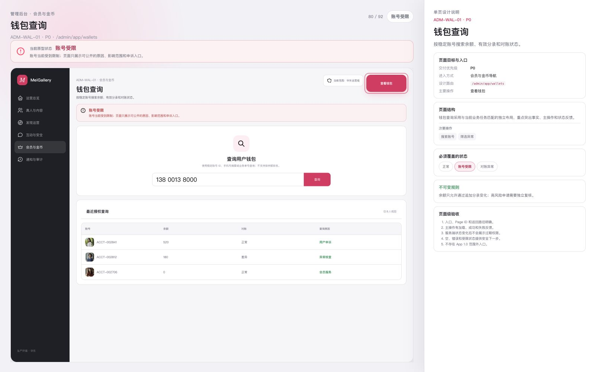

---

#### ADM-WAL-02 钱包详情

**平台与模块：** 管理后台 · 会员与金币　　**优先级：** P0　　**设计路由：** `/admin/app/wallets/{accountId}`

**用户价值：** 展示余额、sequence、分录与冲正关系，不允许直接编辑余额。

**适用角色：** 财务运营、独立复核人、Owner

**前置条件：** 管理员已登录，并同时满足角色 capability、对象范围、数据版本和必要的独立复核条件。

**进入路径：** 钱包查询

**页面结构：** 余额、sequence、有效分录与冲正关系展示为不可直接编辑的事实。

**详细交互：** 用户从“钱包查询”进入。主要操作为“新建调币申请”，执行时显示处理中状态；服务端确认成功后刷新权威数据并可进入 ADM-WAL-03「调币申请」。次要操作包括：查看分录、查看冲正。失败时保留已输入内容，展示可理解原因，并提供重试、返回或帮助入口。

**业务规则：** 余额只允许通过追加分录变化；高风险申请必须由不同管理员复核。

**数据与权限：** 高风险写操作采用申请—独立复核—执行状态机；申请人不得复核本人操作，所有阶段写入审计。

**页面状态：** 正常、余额锁定、Sequence 异常

**Figma 最终稿映射：** `20｜Admin Pages` → `ADM-WAL-02`，共 3 个需求状态；在 [Figma 最终设计文件](https://www.figma.com/design/LaNSwwGsznwcpV8msj7BQC/Peachmote-UI-%E5%80%9F%E9%89%B4%E5%AE%A1%E6%9F%A5%E6%9D%BF---MeiGallery) 中按 Page ID 定位。

**实现追踪：**

- 追踪键：`ADM-WAL-02 → PRD-FR-070,PRD-FR-071,PRD-FR-074,PRD-FR-090,PRD-FR-091,PRD-FR-092 → SCP-FR-010,SCP-FR-012 → F-10、A-10/WAL-FR-*`
- 产品需求：`PRD-FR-070`、`PRD-FR-071`、`PRD-FR-074`、`PRD-FR-090`、`PRD-FR-091`、`PRD-FR-092`
- 发布范围：`SCP-FR-010`、`SCP-FR-012`
- 非功能要求：`PRD-NFR-001`、`PRD-NFR-002`、`PRD-NFR-003`、`PRD-NFR-005`、`PRD-NFR-006`、`PRD-NFR-007`、`PRD-NFR-008`
- 产品级验收：`PRD-AC-006`、`PRD-AC-010`
- 模块 PRD：[F-10、A-10 金币钱包与管理员调币](../ways-of-work/plan/real-person-discovery-platform/wallet-ledger-and-admin-coin-adjustments/prd.md)（WAL-FR-*）

**开发验收：**

- 从“钱包查询”能够进入，页面明确显示 ADM-WAL-02、页面名称、设计路由和返回路径。
- 主要操作“新建调币申请”具有处理中、成功和失败反馈，重复提交不会产生不可控的重复业务结果。
- 页面覆盖“正常、余额锁定、Sequence 异常”状态，并在空、错误、受限或冲突时提供安全下一步。
- 服务端状态变化后不会继续展示过期权限、过期余额、失效认证或不可访问内容。
- 余额只允许通过追加分录变化；高风险申请必须由不同管理员复核。
- UI 层、状态层、数据层和服务端契约不得使用页面展示名称替代稳定 ID、rank、entitlement 或状态枚举。
- 加载、空、错误、离线、无权限、对象失效和服务端状态变化必须按本页状态集合安全收敛。

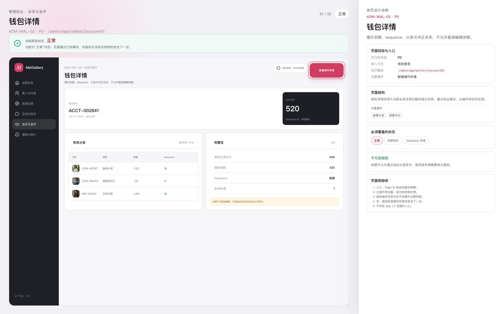

**P0 关键状态：** 余额锁定

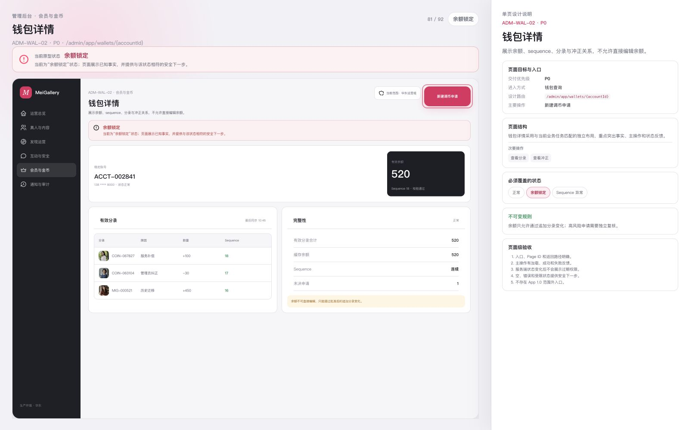

---

#### ADM-WAL-03 调币申请

**平台与模块：** 管理后台 · 会员与金币　　**优先级：** P0　　**设计路由：** `/admin/app/coin-adjustments/new`

**用户价值：** 填写加币或扣币数量、标准原因、用户说明、内部备注和业务单号。

**适用角色：** 财务运营、独立复核人、Owner

**前置条件：** 管理员已登录，并同时满足角色 capability、对象范围、数据版本和必要的独立复核条件。

**进入路径：** 钱包详情

**页面结构：** 对象事实、表单字段、风险提示、预览和提交动作按任务顺序组织。

**详细交互：** 用户从“钱包详情”进入。主要操作为“提交调币申请”，执行时显示处理中状态；服务端确认成功后刷新权威数据并可进入 ADM-WAL-04「调币复核」。次要操作包括：保存草稿、预览余额。失败时保留已输入内容，展示可理解原因，并提供重试、返回或帮助入口。

**业务规则：** 余额只允许通过追加分录变化；高风险申请必须由不同管理员复核。

**数据与权限：** 高风险写操作采用申请—独立复核—执行状态机；申请人不得复核本人操作，所有阶段写入审计。

**页面状态：** 正常、预计负余额、高风险、重复业务单

**Figma 最终稿映射：** `20｜Admin Pages` → `ADM-WAL-03`，共 4 个需求状态；在 [Figma 最终设计文件](https://www.figma.com/design/LaNSwwGsznwcpV8msj7BQC/Peachmote-UI-%E5%80%9F%E9%89%B4%E5%AE%A1%E6%9F%A5%E6%9D%BF---MeiGallery) 中按 Page ID 定位。

**实现追踪：**

- 追踪键：`ADM-WAL-03 → PRD-FR-070,PRD-FR-071,PRD-FR-074,PRD-FR-090,PRD-FR-091,PRD-FR-092 → SCP-FR-010,SCP-FR-012 → F-10、A-10/WAL-FR-*`
- 产品需求：`PRD-FR-070`、`PRD-FR-071`、`PRD-FR-074`、`PRD-FR-090`、`PRD-FR-091`、`PRD-FR-092`
- 发布范围：`SCP-FR-010`、`SCP-FR-012`
- 非功能要求：`PRD-NFR-001`、`PRD-NFR-002`、`PRD-NFR-003`、`PRD-NFR-005`、`PRD-NFR-006`、`PRD-NFR-007`、`PRD-NFR-008`
- 产品级验收：`PRD-AC-006`、`PRD-AC-010`
- 模块 PRD：[F-10、A-10 金币钱包与管理员调币](../ways-of-work/plan/real-person-discovery-platform/wallet-ledger-and-admin-coin-adjustments/prd.md)（WAL-FR-*）

**开发验收：**

- 从“钱包详情”能够进入，页面明确显示 ADM-WAL-03、页面名称、设计路由和返回路径。
- 主要操作“提交调币申请”具有处理中、成功和失败反馈，重复提交不会产生不可控的重复业务结果。
- 页面覆盖“正常、预计负余额、高风险、重复业务单”状态，并在空、错误、受限或冲突时提供安全下一步。
- 服务端状态变化后不会继续展示过期权限、过期余额、失效认证或不可访问内容。
- 余额只允许通过追加分录变化；高风险申请必须由不同管理员复核。
- UI 层、状态层、数据层和服务端契约不得使用页面展示名称替代稳定 ID、rank、entitlement 或状态枚举。
- 加载、空、错误、离线、无权限、对象失效和服务端状态变化必须按本页状态集合安全收敛。

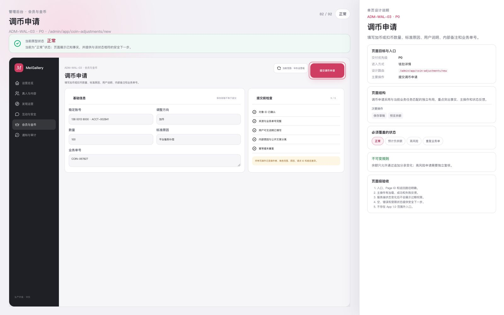

**P0 关键状态：** 预计负余额

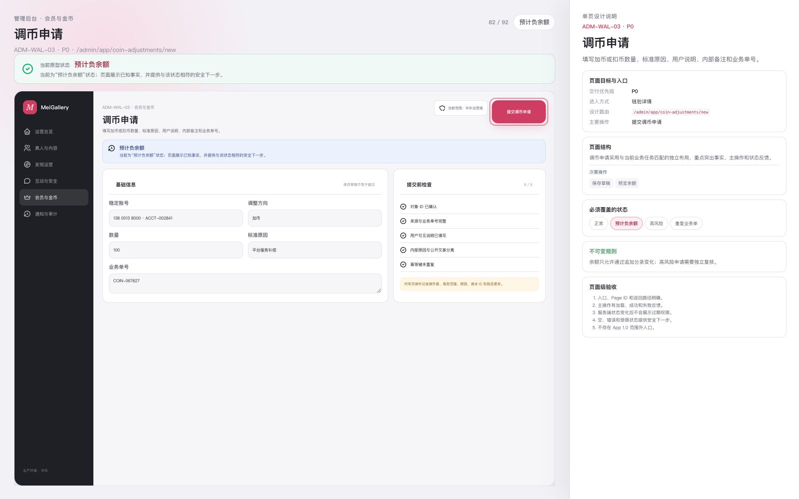

---

#### ADM-WAL-04 调币复核

**平台与模块：** 管理后台 · 会员与金币　　**优先级：** P0　　**设计路由：** `/admin/app/coin-adjustments/{id}/review`

**用户价值：** 由不同管理员复核余额变化、阈值、原因和业务证据。

**适用角色：** 财务运营、独立复核人、Owner

**前置条件：** 管理员已登录，并同时满足角色 capability、对象范围、数据版本和必要的独立复核条件。

**进入路径：** 复核任务队列

**页面结构：** 申请事实与复核检查并列，前后影响和职责分离始终可见。

**详细交互：** 用户从“复核任务队列”进入。主要操作为“批准并入账”，执行时显示处理中状态；服务端确认成功后刷新权威数据并可进入 ADM-WAL-02「钱包详情」。次要操作包括：拒绝、查看原始分录。失败时保留已输入内容，展示可理解原因，并提供重试、返回或帮助入口。

**业务规则：** 余额只允许通过追加分录变化；高风险申请必须由不同管理员复核。

**数据与权限：** 高风险写操作采用申请—独立复核—执行状态机；申请人不得复核本人操作，所有阶段写入审计。

**页面状态：** 正常、余额已变化、发起人冲突

**Figma 最终稿映射：** `20｜Admin Pages` → `ADM-WAL-04`，共 3 个需求状态；在 [Figma 最终设计文件](https://www.figma.com/design/LaNSwwGsznwcpV8msj7BQC/Peachmote-UI-%E5%80%9F%E9%89%B4%E5%AE%A1%E6%9F%A5%E6%9D%BF---MeiGallery) 中按 Page ID 定位。

**实现追踪：**

- 追踪键：`ADM-WAL-04 → PRD-FR-070,PRD-FR-071,PRD-FR-074,PRD-FR-090,PRD-FR-091,PRD-FR-092 → SCP-FR-010,SCP-FR-012 → F-10、A-10/WAL-FR-*`
- 产品需求：`PRD-FR-070`、`PRD-FR-071`、`PRD-FR-074`、`PRD-FR-090`、`PRD-FR-091`、`PRD-FR-092`
- 发布范围：`SCP-FR-010`、`SCP-FR-012`
- 非功能要求：`PRD-NFR-001`、`PRD-NFR-002`、`PRD-NFR-003`、`PRD-NFR-005`、`PRD-NFR-006`、`PRD-NFR-007`、`PRD-NFR-008`
- 产品级验收：`PRD-AC-006`、`PRD-AC-010`
- 模块 PRD：[F-10、A-10 金币钱包与管理员调币](../ways-of-work/plan/real-person-discovery-platform/wallet-ledger-and-admin-coin-adjustments/prd.md)（WAL-FR-*）

**开发验收：**

- 从“复核任务队列”能够进入，页面明确显示 ADM-WAL-04、页面名称、设计路由和返回路径。
- 主要操作“批准并入账”具有处理中、成功和失败反馈，重复提交不会产生不可控的重复业务结果。
- 页面覆盖“正常、余额已变化、发起人冲突”状态，并在空、错误、受限或冲突时提供安全下一步。
- 服务端状态变化后不会继续展示过期权限、过期余额、失效认证或不可访问内容。
- 余额只允许通过追加分录变化；高风险申请必须由不同管理员复核。
- UI 层、状态层、数据层和服务端契约不得使用页面展示名称替代稳定 ID、rank、entitlement 或状态枚举。
- 加载、空、错误、离线、无权限、对象失效和服务端状态变化必须按本页状态集合安全收敛。

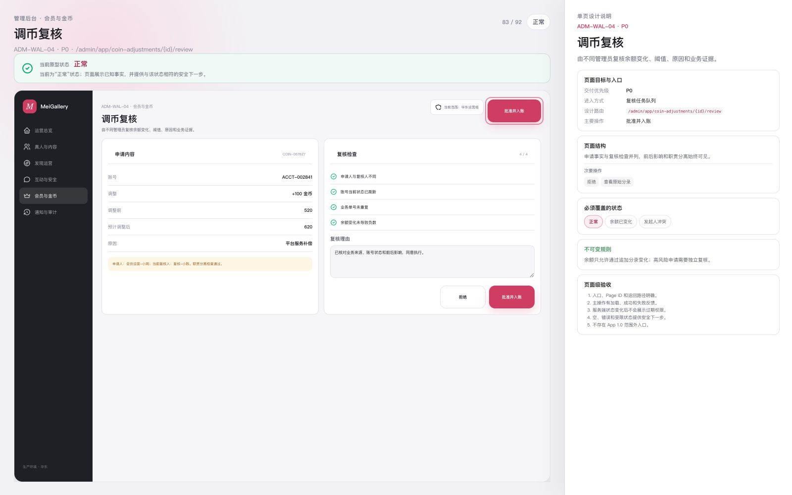

**P0 关键状态：** 发起人冲突

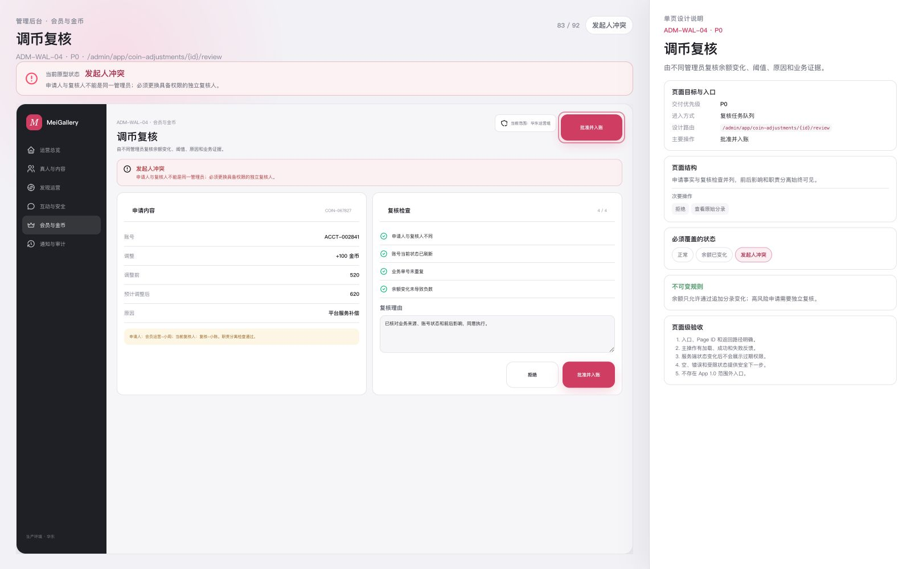

---

#### ADM-WAL-05 批量调币任务

**平台与模块：** 管理后台 · 会员与金币　　**优先级：** P2　　**设计路由：** `/admin/app/coin-adjustment-batches`

**用户价值：** 上传、校验和复核批量调币，逐项返回结果并允许重试失败项。

**适用角色：** 财务运营、独立复核人、Owner

**前置条件：** 管理员已登录，并同时满足角色 capability、对象范围、数据版本和必要的独立复核条件。

**进入路径：** 钱包运营工具

**页面结构：** 文件上传、逐项校验、总额复核、部分成功和失败重试形成批量闭环。

**详细交互：** 用户从“钱包运营工具”进入。主要操作为“提交批量复核”，执行时显示处理中状态；服务端确认成功后刷新权威数据并可进入 ADM-WAL-06「钱包对账差异」。次要操作包括：上传文件、暂停、重试失败项。失败时保留已输入内容，展示可理解原因，并提供重试、返回或帮助入口。

**业务规则：** 余额只允许通过追加分录变化；高风险申请必须由不同管理员复核。

**数据与权限：** 高风险写操作采用申请—独立复核—执行状态机；申请人不得复核本人操作，所有阶段写入审计。

**页面状态：** 正常、部分成功、重复项、总额异常

**Figma 最终稿映射：** `20｜Admin Pages` → `ADM-WAL-05`，共 4 个需求状态；在 [Figma 最终设计文件](https://www.figma.com/design/LaNSwwGsznwcpV8msj7BQC/Peachmote-UI-%E5%80%9F%E9%89%B4%E5%AE%A1%E6%9F%A5%E6%9D%BF---MeiGallery) 中按 Page ID 定位。

**实现追踪：**

- 追踪键：`ADM-WAL-05 → PRD-FR-070,PRD-FR-071,PRD-FR-074,PRD-FR-090,PRD-FR-091,PRD-FR-092 → SCP-FR-010,SCP-FR-012 → F-10、A-10/WAL-FR-*`
- 产品需求：`PRD-FR-070`、`PRD-FR-071`、`PRD-FR-074`、`PRD-FR-090`、`PRD-FR-091`、`PRD-FR-092`
- 发布范围：`SCP-FR-010`、`SCP-FR-012`
- 非功能要求：`PRD-NFR-001`、`PRD-NFR-002`、`PRD-NFR-003`、`PRD-NFR-005`、`PRD-NFR-006`、`PRD-NFR-007`、`PRD-NFR-008`
- 产品级验收：`PRD-AC-006`、`PRD-AC-010`
- 模块 PRD：[F-10、A-10 金币钱包与管理员调币](../ways-of-work/plan/real-person-discovery-platform/wallet-ledger-and-admin-coin-adjustments/prd.md)（WAL-FR-*）

**开发验收：**

- 从“钱包运营工具”能够进入，页面明确显示 ADM-WAL-05、页面名称、设计路由和返回路径。
- 主要操作“提交批量复核”具有处理中、成功和失败反馈，重复提交不会产生不可控的重复业务结果。
- 页面覆盖“正常、部分成功、重复项、总额异常”状态，并在空、错误、受限或冲突时提供安全下一步。
- 服务端状态变化后不会继续展示过期权限、过期余额、失效认证或不可访问内容。
- 余额只允许通过追加分录变化；高风险申请必须由不同管理员复核。
- UI 层、状态层、数据层和服务端契约不得使用页面展示名称替代稳定 ID、rank、entitlement 或状态枚举。
- 加载、空、错误、离线、无权限、对象失效和服务端状态变化必须按本页状态集合安全收敛。

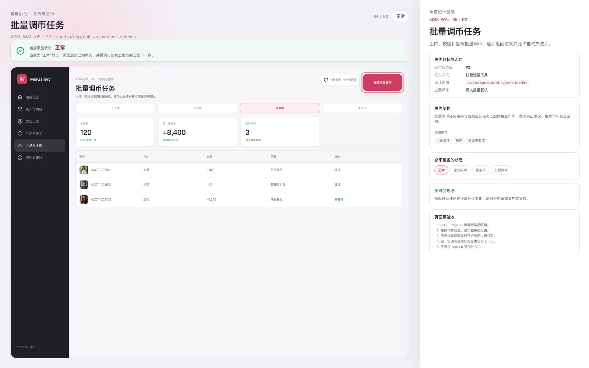

---

#### ADM-WAL-06 钱包对账差异

**平台与模块：** 管理后台 · 会员与金币　　**优先级：** P0　　**设计路由：** `/admin/app/reconciliation`

**用户价值：** 识别余额、sequence 和有效分录差异，通过追加式 forward-fix 修复。

**适用角色：** 财务运营、独立复核人、Owner

**前置条件：** 管理员已登录，并同时满足角色 capability、对象范围、数据版本和必要的独立复核条件。

**进入路径：** 运营总览或钱包异常入口

**页面结构：** 余额、sequence 和分录差异并列，修复只采用追加式 forward-fix。

**详细交互：** 用户从“运营总览或钱包异常入口”进入。主要操作为“认领差异”，执行时显示处理中状态；服务端确认成功后刷新权威数据并可进入 ADM-WAL-02「钱包详情」。次要操作包括：重建验证、创建修复申请。失败时保留已输入内容，展示可理解原因，并提供重试、返回或帮助入口。

**业务规则：** 余额只允许通过追加分录变化；高风险申请必须由不同管理员复核。

**数据与权限：** 高风险写操作采用申请—独立复核—执行状态机；申请人不得复核本人操作，所有阶段写入审计。

**页面状态：** 正常、钱包冻结、差异未解释

**Figma 最终稿映射：** `20｜Admin Pages` → `ADM-WAL-06`，共 3 个需求状态；在 [Figma 最终设计文件](https://www.figma.com/design/LaNSwwGsznwcpV8msj7BQC/Peachmote-UI-%E5%80%9F%E9%89%B4%E5%AE%A1%E6%9F%A5%E6%9D%BF---MeiGallery) 中按 Page ID 定位。

**实现追踪：**

- 追踪键：`ADM-WAL-06 → PRD-FR-070,PRD-FR-071,PRD-FR-074,PRD-FR-090,PRD-FR-091,PRD-FR-092 → SCP-FR-010,SCP-FR-012 → F-10、A-10/WAL-FR-*`
- 产品需求：`PRD-FR-070`、`PRD-FR-071`、`PRD-FR-074`、`PRD-FR-090`、`PRD-FR-091`、`PRD-FR-092`
- 发布范围：`SCP-FR-010`、`SCP-FR-012`
- 非功能要求：`PRD-NFR-001`、`PRD-NFR-002`、`PRD-NFR-003`、`PRD-NFR-005`、`PRD-NFR-006`、`PRD-NFR-007`、`PRD-NFR-008`
- 产品级验收：`PRD-AC-006`、`PRD-AC-010`
- 模块 PRD：[F-10、A-10 金币钱包与管理员调币](../ways-of-work/plan/real-person-discovery-platform/wallet-ledger-and-admin-coin-adjustments/prd.md)（WAL-FR-*）

**开发验收：**

- 从“运营总览或钱包异常入口”能够进入，页面明确显示 ADM-WAL-06、页面名称、设计路由和返回路径。
- 主要操作“认领差异”具有处理中、成功和失败反馈，重复提交不会产生不可控的重复业务结果。
- 页面覆盖“正常、钱包冻结、差异未解释”状态，并在空、错误、受限或冲突时提供安全下一步。
- 服务端状态变化后不会继续展示过期权限、过期余额、失效认证或不可访问内容。
- 余额只允许通过追加分录变化；高风险申请必须由不同管理员复核。
- UI 层、状态层、数据层和服务端契约不得使用页面展示名称替代稳定 ID、rank、entitlement 或状态枚举。
- 加载、空、错误、离线、无权限、对象失效和服务端状态变化必须按本页状态集合安全收敛。

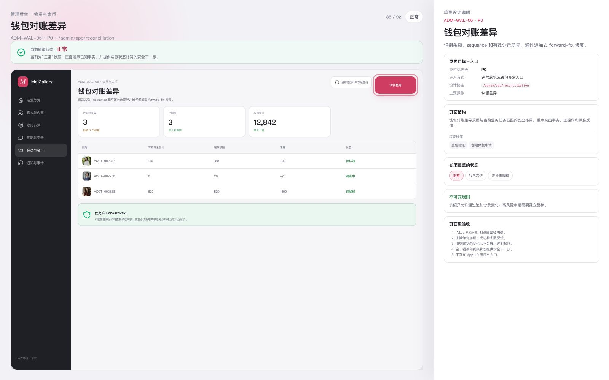

**P0 关键状态：** 钱包冻结

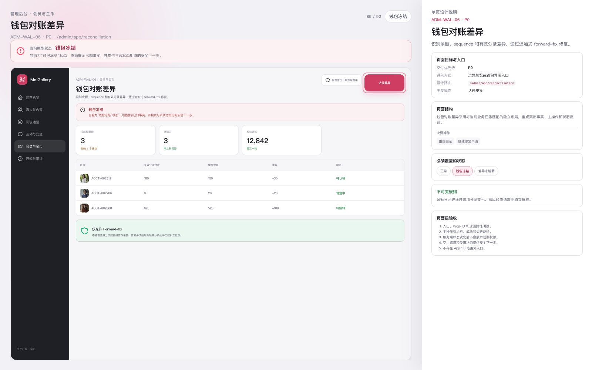

---

### 管理后台 · 通知与审计

本组共 7 个页面。实现、接口、测试和缺陷均按 Page ID 追踪。

#### ADM-NTF-01 通知事件定义

**平台与模块：** 管理后台 · 通知与审计　　**优先级：** P1　　**设计路由：** `/admin/app/notifications/events`

**用户价值：** 查看事件 Schema、必要性、敏感字段策略和版本状态。

**适用角色：** 通知运营、模板审核人、Owner

**前置条件：** 管理员已登录，并同时满足角色 capability、对象范围、数据版本和必要的独立复核条件。

**进入路径：** 站内通知导航

**页面结构：** 事件 Schema、必要性、敏感字段策略和版本状态集中展示。

**详细交互：** 用户从“站内通知导航”进入。主要操作为“查看事件版本”，执行时显示处理中状态；服务端确认成功后刷新权威数据并可进入 ADM-NTF-02「通知模板版本」。次要操作包括：筛选必要通知、查看消费者。失败时保留已输入内容，展示可理解原因，并提供重试、返回或帮助入口。

**业务规则：** 后台写操作必须经过 capability、对象范围、版本检查和不可删除审计。

**数据与权限：** 管理员 API 与公开 API 分离；读取和写入同时校验 capability、对象范围、版本与审计要求。

**页面状态：** 正常、未登记、已停用

**Figma 最终稿映射：** `20｜Admin Pages` → `ADM-NTF-01`，共 3 个需求状态；在 [Figma 最终设计文件](https://www.figma.com/design/LaNSwwGsznwcpV8msj7BQC/Peachmote-UI-%E5%80%9F%E9%89%B4%E5%AE%A1%E6%9F%A5%E6%9D%BF---MeiGallery) 中按 Page ID 定位。

**实现追踪：**

- 追踪键：`ADM-NTF-01 → PRD-FR-080,PRD-FR-081,PRD-FR-090,PRD-FR-091,PRD-FR-092 → SCP-FR-009,SCP-FR-012 → F-12/NTF-FR-*`
- 产品需求：`PRD-FR-080`、`PRD-FR-081`、`PRD-FR-090`、`PRD-FR-091`、`PRD-FR-092`
- 发布范围：`SCP-FR-009`、`SCP-FR-012`
- 非功能要求：`PRD-NFR-001`、`PRD-NFR-002`、`PRD-NFR-003`、`PRD-NFR-004`、`PRD-NFR-005`、`PRD-NFR-006`、`PRD-NFR-007`、`PRD-NFR-008`
- 产品级验收：`PRD-AC-010`
- 模块 PRD：[F-12 站内通知中心与通知偏好](../ways-of-work/plan/real-person-discovery-platform/in-app-notification-center/prd.md)（NTF-FR-*）

**开发验收：**

- 从“站内通知导航”能够进入，页面明确显示 ADM-NTF-01、页面名称、设计路由和返回路径。
- 主要操作“查看事件版本”具有处理中、成功和失败反馈，重复提交不会产生不可控的重复业务结果。
- 页面覆盖“正常、未登记、已停用”状态，并在空、错误、受限或冲突时提供安全下一步。
- 服务端状态变化后不会继续展示过期权限、过期余额、失效认证或不可访问内容。
- 后台写操作必须经过 capability、对象范围、版本检查和不可删除审计。
- UI 层、状态层、数据层和服务端契约不得使用页面展示名称替代稳定 ID、rank、entitlement 或状态枚举。
- 加载、空、错误、离线、无权限、对象失效和服务端状态变化必须按本页状态集合安全收敛。

---

#### ADM-NTF-02 通知模板版本

**平台与模块：** 管理后台 · 通知与审计　　**优先级：** P1　　**设计路由：** `/admin/app/notifications/templates/{id}`

**用户价值：** 编辑用户安全文案、变量、地区与语言版本并提交审核。

**适用角色：** 通知运营、模板审核人、Owner

**前置条件：** 管理员已登录，并同时满足角色 capability、对象范围、数据版本和必要的独立复核条件。

**进入路径：** 通知事件定义

**页面结构：** 用户安全文案、变量、地区语言版本和预览在同一编辑面呈现。

**详细交互：** 用户从“通知事件定义”进入。主要操作为“提交模板审核”，执行时显示处理中状态；服务端确认成功后刷新权威数据并可进入 ADM-NTF-03「通知生成结果」。次要操作包括：保存草稿、预览变量。失败时保留已输入内容，展示可理解原因，并提供重试、返回或帮助入口。

**业务规则：** 后台写操作必须经过 capability、对象范围、版本检查和不可删除审计。

**数据与权限：** 管理员 API 与公开 API 分离；读取和写入同时校验 capability、对象范围、版本与审计要求。

**页面状态：** 正常、变量缺失、地区冲突、语言冲突

**Figma 最终稿映射：** `20｜Admin Pages` → `ADM-NTF-02`，共 4 个需求状态；在 [Figma 最终设计文件](https://www.figma.com/design/LaNSwwGsznwcpV8msj7BQC/Peachmote-UI-%E5%80%9F%E9%89%B4%E5%AE%A1%E6%9F%A5%E6%9D%BF---MeiGallery) 中按 Page ID 定位。

**实现追踪：**

- 追踪键：`ADM-NTF-02 → PRD-FR-080,PRD-FR-081,PRD-FR-090,PRD-FR-091,PRD-FR-092 → SCP-FR-009,SCP-FR-012 → F-12/NTF-FR-*`
- 产品需求：`PRD-FR-080`、`PRD-FR-081`、`PRD-FR-090`、`PRD-FR-091`、`PRD-FR-092`
- 发布范围：`SCP-FR-009`、`SCP-FR-012`
- 非功能要求：`PRD-NFR-001`、`PRD-NFR-002`、`PRD-NFR-003`、`PRD-NFR-004`、`PRD-NFR-005`、`PRD-NFR-006`、`PRD-NFR-007`、`PRD-NFR-008`
- 产品级验收：`PRD-AC-010`
- 模块 PRD：[F-12 站内通知中心与通知偏好](../ways-of-work/plan/real-person-discovery-platform/in-app-notification-center/prd.md)（NTF-FR-*）

**开发验收：**

- 从“通知事件定义”能够进入，页面明确显示 ADM-NTF-02、页面名称、设计路由和返回路径。
- 主要操作“提交模板审核”具有处理中、成功和失败反馈，重复提交不会产生不可控的重复业务结果。
- 页面覆盖“正常、变量缺失、地区冲突、语言冲突”状态，并在空、错误、受限或冲突时提供安全下一步。
- 服务端状态变化后不会继续展示过期权限、过期余额、失效认证或不可访问内容。
- 后台写操作必须经过 capability、对象范围、版本检查和不可删除审计。
- UI 层、状态层、数据层和服务端契约不得使用页面展示名称替代稳定 ID、rank、entitlement 或状态枚举。
- 加载、空、错误、离线、无权限、对象失效和服务端状态变化必须按本页状态集合安全收敛。

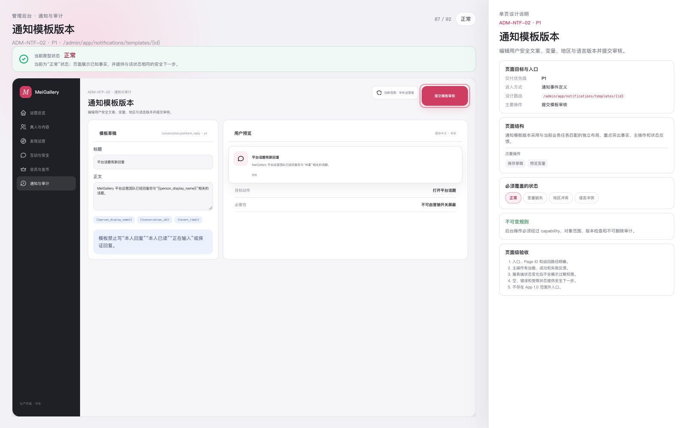

---

#### ADM-NTF-03 通知生成结果

**平台与模块：** 管理后台 · 通知与审计　　**优先级：** P2　　**设计路由：** `/admin/app/notifications/deliveries`

**用户价值：** 查询事件生成、失败、抑制和防重结果，不查看不必要的正文。

**适用角色：** 通知运营、模板审核人、Owner

**前置条件：** 管理员已登录，并同时满足角色 capability、对象范围、数据版本和必要的独立复核条件。

**进入路径：** 站内通知导航或异常卡

**页面结构：** 生成、失败、抑制、防重和积压结果以最小必要信息展示。

**详细交互：** 用户从“站内通知导航或异常卡”进入。主要操作为“查看生成详情”，执行时显示处理中状态；服务端确认成功后刷新权威数据并可进入 ADM-NTF-01「通知事件定义」。次要操作包括：筛选失败、查看防重键。失败时保留已输入内容，展示可理解原因，并提供重试、返回或帮助入口。

**业务规则：** 后台写操作必须经过 capability、对象范围、版本检查和不可删除审计。

**数据与权限：** 管理员 API 与公开 API 分离；读取和写入同时校验 capability、对象范围、版本与审计要求。

**页面状态：** 正常、积压、模板失败、重复抑制

**Figma 最终稿映射：** `20｜Admin Pages` → `ADM-NTF-03`，共 4 个需求状态；在 [Figma 最终设计文件](https://www.figma.com/design/LaNSwwGsznwcpV8msj7BQC/Peachmote-UI-%E5%80%9F%E9%89%B4%E5%AE%A1%E6%9F%A5%E6%9D%BF---MeiGallery) 中按 Page ID 定位。

**实现追踪：**

- 追踪键：`ADM-NTF-03 → PRD-FR-080,PRD-FR-081,PRD-FR-090,PRD-FR-091,PRD-FR-092 → SCP-FR-009,SCP-FR-012 → F-12/NTF-FR-*`
- 产品需求：`PRD-FR-080`、`PRD-FR-081`、`PRD-FR-090`、`PRD-FR-091`、`PRD-FR-092`
- 发布范围：`SCP-FR-009`、`SCP-FR-012`
- 非功能要求：`PRD-NFR-001`、`PRD-NFR-002`、`PRD-NFR-003`、`PRD-NFR-004`、`PRD-NFR-005`、`PRD-NFR-006`、`PRD-NFR-007`、`PRD-NFR-008`
- 产品级验收：`PRD-AC-010`
- 模块 PRD：[F-12 站内通知中心与通知偏好](../ways-of-work/plan/real-person-discovery-platform/in-app-notification-center/prd.md)（NTF-FR-*）

**开发验收：**

- 从“站内通知导航或异常卡”能够进入，页面明确显示 ADM-NTF-03、页面名称、设计路由和返回路径。
- 主要操作“查看生成详情”具有处理中、成功和失败反馈，重复提交不会产生不可控的重复业务结果。
- 页面覆盖“正常、积压、模板失败、重复抑制”状态，并在空、错误、受限或冲突时提供安全下一步。
- 服务端状态变化后不会继续展示过期权限、过期余额、失效认证或不可访问内容。
- 后台写操作必须经过 capability、对象范围、版本检查和不可删除审计。
- UI 层、状态层、数据层和服务端契约不得使用页面展示名称替代稳定 ID、rank、entitlement 或状态枚举。
- 加载、空、错误、离线、无权限、对象失效和服务端状态变化必须按本页状态集合安全收敛。

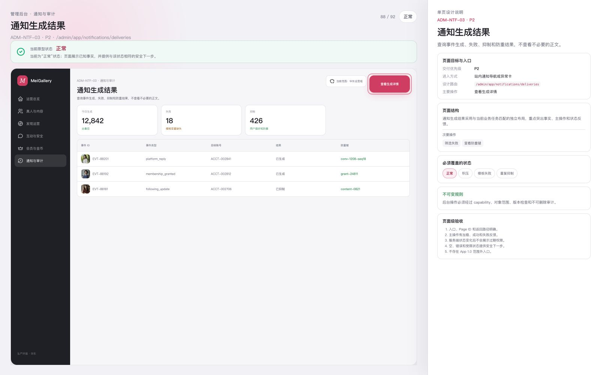

---

#### ADM-AUD-01 审计查询

**平台与模块：** 管理后台 · 通知与审计　　**优先级：** P0　　**设计路由：** `/admin/app/audit`

**用户价值：** 按动作、对象、操作者、时间和请求链查询不可编辑审计事件。

**适用角色：** 审计员、Owner

**前置条件：** 管理员已登录，并同时满足角色 capability、对象范围、数据版本和必要的独立复核条件。

**进入路径：** 审计导航或业务对象审计入口

**页面结构：** 查询条件、结果、请求链和受控导出入口构成审计检索工作区。

**详细交互：** 用户从“审计导航或业务对象审计入口”进入。主要操作为“执行审计查询”，执行时显示处理中状态；服务端确认成功后刷新权威数据并可进入 ADM-AUD-02「审计详情」。次要操作包括：保存查询、申请导出。失败时保留已输入内容，展示可理解原因，并提供重试、返回或帮助入口。

**业务规则：** 后台写操作必须经过 capability、对象范围、版本检查和不可删除审计。

**数据与权限：** 仅允许具备审计 capability 的管理员按授权范围读取脱敏事件；导出必须申请、复核、短期授权并记录审计。

**页面状态：** 正常、范围过大、完整性告警

**Figma 最终稿映射：** `20｜Admin Pages` → `ADM-AUD-01`，共 3 个需求状态；在 [Figma 最终设计文件](https://www.figma.com/design/LaNSwwGsznwcpV8msj7BQC/Peachmote-UI-%E5%80%9F%E9%89%B4%E5%AE%A1%E6%9F%A5%E6%9D%BF---MeiGallery) 中按 Page ID 定位。

**实现追踪：**

- 追踪键：`ADM-AUD-01 → PRD-FR-090,PRD-FR-091,PRD-FR-092 → SCP-FR-012 → A-13/OAU-FR-*`
- 产品需求：`PRD-FR-090`、`PRD-FR-091`、`PRD-FR-092`
- 发布范围：`SCP-FR-012`
- 非功能要求：`PRD-NFR-001`、`PRD-NFR-002`、`PRD-NFR-003`、`PRD-NFR-004`、`PRD-NFR-005`、`PRD-NFR-006`、`PRD-NFR-007`、`PRD-NFR-008`
- 产品级验收：`PRD-AC-006`、`PRD-AC-010`
- 模块 PRD：[A-13 运营看板、审计日志与异常追踪](../ways-of-work/plan/real-person-discovery-platform/operations-dashboard-and-audit-log/prd.md)（OAU-FR-*）

**开发验收：**

- 从“审计导航或业务对象审计入口”能够进入，页面明确显示 ADM-AUD-01、页面名称、设计路由和返回路径。
- 主要操作“执行审计查询”具有处理中、成功和失败反馈，重复提交不会产生不可控的重复业务结果。
- 页面覆盖“正常、范围过大、完整性告警”状态，并在空、错误、受限或冲突时提供安全下一步。
- 服务端状态变化后不会继续展示过期权限、过期余额、失效认证或不可访问内容。
- 后台写操作必须经过 capability、对象范围、版本检查和不可删除审计。
- UI 层、状态层、数据层和服务端契约不得使用页面展示名称替代稳定 ID、rank、entitlement 或状态枚举。
- 加载、空、错误、离线、无权限、对象失效和服务端状态变化必须按本页状态集合安全收敛。

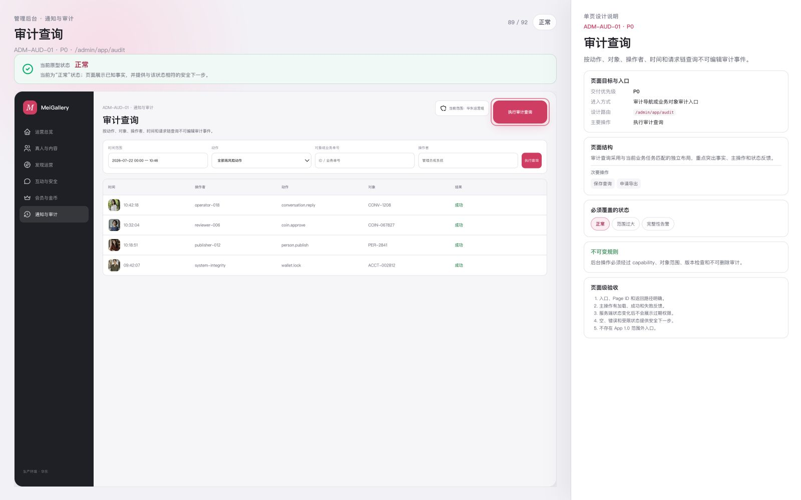

**P0 关键状态：** 范围过大

---

#### ADM-AUD-02 审计详情

**平台与模块：** 管理后台 · 通知与审计　　**优先级：** P0　　**设计路由：** `/admin/app/audit/{eventId}`

**用户价值：** 展示事件时间线、脱敏前后差异和申请/批准/执行关系。

**适用角色：** 审计员、Owner

**前置条件：** 管理员已登录，并同时满足角色 capability、对象范围、数据版本和必要的独立复核条件。

**进入路径：** 审计查询结果

**页面结构：** 事件时间线、脱敏差异和申请—批准—执行关系集中展示。

**详细交互：** 用户从“审计查询结果”进入。主要操作为“查看关联事件”，执行时显示处理中状态；服务端确认成功后刷新权威数据并可进入 ADM-AUD-01「审计查询」。次要操作包括：复制请求 ID、查看业务对象。失败时保留已输入内容，展示可理解原因，并提供重试、返回或帮助入口。

**业务规则：** 后台写操作必须经过 capability、对象范围、版本检查和不可删除审计。

**数据与权限：** 仅允许具备审计 capability 的管理员按授权范围读取脱敏事件；导出必须申请、复核、短期授权并记录审计。

**页面状态：** 正常、关联缺失、敏感字段受限

**Figma 最终稿映射：** `20｜Admin Pages` → `ADM-AUD-02`，共 3 个需求状态；在 [Figma 最终设计文件](https://www.figma.com/design/LaNSwwGsznwcpV8msj7BQC/Peachmote-UI-%E5%80%9F%E9%89%B4%E5%AE%A1%E6%9F%A5%E6%9D%BF---MeiGallery) 中按 Page ID 定位。

**实现追踪：**

- 追踪键：`ADM-AUD-02 → PRD-FR-090,PRD-FR-091,PRD-FR-092 → SCP-FR-012 → A-13/OAU-FR-*`
- 产品需求：`PRD-FR-090`、`PRD-FR-091`、`PRD-FR-092`
- 发布范围：`SCP-FR-012`
- 非功能要求：`PRD-NFR-001`、`PRD-NFR-002`、`PRD-NFR-003`、`PRD-NFR-004`、`PRD-NFR-005`、`PRD-NFR-006`、`PRD-NFR-007`、`PRD-NFR-008`
- 产品级验收：`PRD-AC-006`、`PRD-AC-010`
- 模块 PRD：[A-13 运营看板、审计日志与异常追踪](../ways-of-work/plan/real-person-discovery-platform/operations-dashboard-and-audit-log/prd.md)（OAU-FR-*）

**开发验收：**

- 从“审计查询结果”能够进入，页面明确显示 ADM-AUD-02、页面名称、设计路由和返回路径。
- 主要操作“查看关联事件”具有处理中、成功和失败反馈，重复提交不会产生不可控的重复业务结果。
- 页面覆盖“正常、关联缺失、敏感字段受限”状态，并在空、错误、受限或冲突时提供安全下一步。
- 服务端状态变化后不会继续展示过期权限、过期余额、失效认证或不可访问内容。
- 后台写操作必须经过 capability、对象范围、版本检查和不可删除审计。
- UI 层、状态层、数据层和服务端契约不得使用页面展示名称替代稳定 ID、rank、entitlement 或状态枚举。
- 加载、空、错误、离线、无权限、对象失效和服务端状态变化必须按本页状态集合安全收敛。

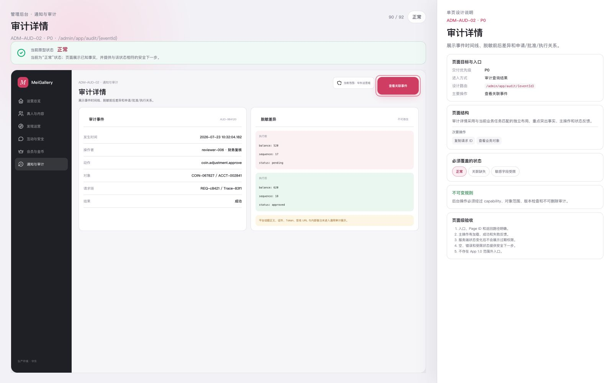

**P0 关键状态：** 敏感字段受限

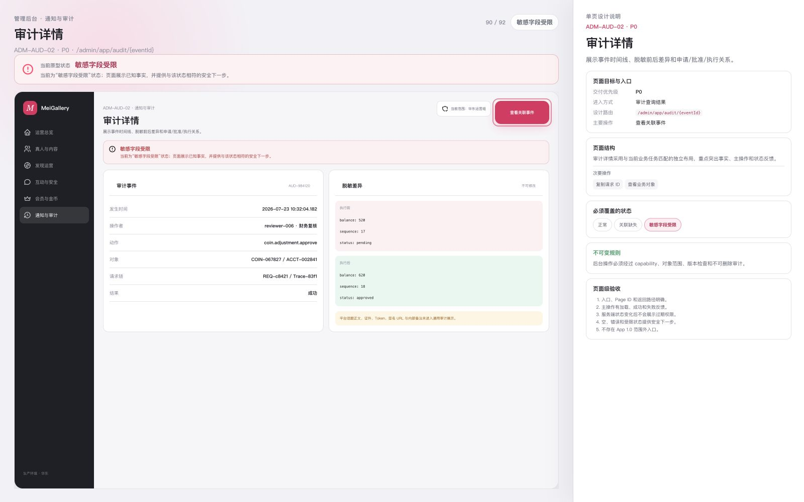

---

#### ADM-AUD-03 审计完整性状态

**平台与模块：** 管理后台 · 通知与审计　　**优先级：** P2　　**设计路由：** `/admin/app/audit/integrity`

**用户价值：** 检查 sequence 缺口、高风险业务无审计和校验任务结果。

**适用角色：** 审计员、Owner

**前置条件：** 管理员已登录，并同时满足角色 capability、对象范围、数据版本和必要的独立复核条件。

**进入路径：** 审计导航或异常中心

**页面结构：** sequence 缺口、无审计业务和校验结果按风险程度组织。

**详细交互：** 用户从“审计导航或异常中心”进入。主要操作为“运行完整性校验”，执行时显示处理中状态；服务端确认成功后刷新权威数据并可进入 ADM-AUD-01「审计查询」。次要操作包括：查看异常、创建事件。失败时保留已输入内容，展示可理解原因，并提供重试、返回或帮助入口。

**业务规则：** 后台写操作必须经过 capability、对象范围、版本检查和不可删除审计。

**数据与权限：** 仅允许具备审计 capability 的管理员按授权范围读取脱敏事件；导出必须申请、复核、短期授权并记录审计。

**页面状态：** 正常、Sequence 缺口、业务无审计

**Figma 最终稿映射：** `20｜Admin Pages` → `ADM-AUD-03`，共 3 个需求状态；在 [Figma 最终设计文件](https://www.figma.com/design/LaNSwwGsznwcpV8msj7BQC/Peachmote-UI-%E5%80%9F%E9%89%B4%E5%AE%A1%E6%9F%A5%E6%9D%BF---MeiGallery) 中按 Page ID 定位。

**实现追踪：**

- 追踪键：`ADM-AUD-03 → PRD-FR-090,PRD-FR-091,PRD-FR-092 → SCP-FR-012 → A-13/OAU-FR-*`
- 产品需求：`PRD-FR-090`、`PRD-FR-091`、`PRD-FR-092`
- 发布范围：`SCP-FR-012`
- 非功能要求：`PRD-NFR-001`、`PRD-NFR-002`、`PRD-NFR-003`、`PRD-NFR-004`、`PRD-NFR-005`、`PRD-NFR-006`、`PRD-NFR-007`、`PRD-NFR-008`
- 产品级验收：`PRD-AC-006`、`PRD-AC-010`
- 模块 PRD：[A-13 运营看板、审计日志与异常追踪](../ways-of-work/plan/real-person-discovery-platform/operations-dashboard-and-audit-log/prd.md)（OAU-FR-*）

**开发验收：**

- 从“审计导航或异常中心”能够进入，页面明确显示 ADM-AUD-03、页面名称、设计路由和返回路径。
- 主要操作“运行完整性校验”具有处理中、成功和失败反馈，重复提交不会产生不可控的重复业务结果。
- 页面覆盖“正常、Sequence 缺口、业务无审计”状态，并在空、错误、受限或冲突时提供安全下一步。
- 服务端状态变化后不会继续展示过期权限、过期余额、失效认证或不可访问内容。
- 后台写操作必须经过 capability、对象范围、版本检查和不可删除审计。
- UI 层、状态层、数据层和服务端契约不得使用页面展示名称替代稳定 ID、rank、entitlement 或状态枚举。
- 加载、空、错误、离线、无权限、对象失效和服务端状态变化必须按本页状态集合安全收敛。

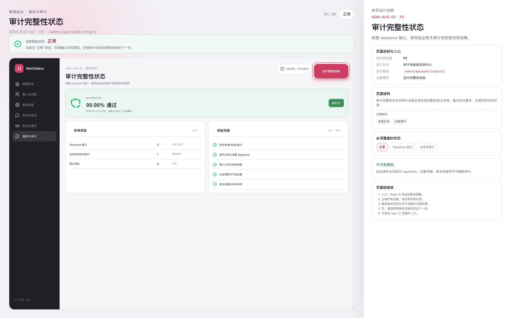

---

#### ADM-AUD-04 受控导出

**平台与模块：** 管理后台 · 通知与审计　　**优先级：** P2　　**设计路由：** `/admin/app/audit/exports`

**用户价值：** 通过申请、复核、短期凭证和范围再校验导出审计数据。

**适用角色：** 审计员、Owner

**前置条件：** 管理员已登录，并同时满足角色 capability、对象范围、数据版本和必要的独立复核条件。

**进入路径：** 审计查询

**页面结构：** 范围、目的、独立复核、短期凭证和过期状态形成受控导出闭环。

**详细交互：** 用户从“审计查询”进入。主要操作为“提交导出申请”，执行时显示处理中状态；服务端确认成功后刷新权威数据并可进入 ADM-AUD-01「审计查询」。次要操作包括：查看申请、下载已批准文件。失败时保留已输入内容，展示可理解原因，并提供重试、返回或帮助入口。

**业务规则：** 后台写操作必须经过 capability、对象范围、版本检查和不可删除审计。

**数据与权限：** 仅允许具备审计 capability 的管理员按授权范围读取脱敏事件；导出必须申请、复核、短期授权并记录审计。

**页面状态：** 正常、待批准、已过期、范围变化

**Figma 最终稿映射：** `20｜Admin Pages` → `ADM-AUD-04`，共 4 个需求状态；在 [Figma 最终设计文件](https://www.figma.com/design/LaNSwwGsznwcpV8msj7BQC/Peachmote-UI-%E5%80%9F%E9%89%B4%E5%AE%A1%E6%9F%A5%E6%9D%BF---MeiGallery) 中按 Page ID 定位。

**实现追踪：**

- 追踪键：`ADM-AUD-04 → PRD-FR-090,PRD-FR-091,PRD-FR-092 → SCP-FR-012 → A-13/OAU-FR-*`
- 产品需求：`PRD-FR-090`、`PRD-FR-091`、`PRD-FR-092`
- 发布范围：`SCP-FR-012`
- 非功能要求：`PRD-NFR-001`、`PRD-NFR-002`、`PRD-NFR-003`、`PRD-NFR-004`、`PRD-NFR-005`、`PRD-NFR-006`、`PRD-NFR-007`、`PRD-NFR-008`
- 产品级验收：`PRD-AC-006`、`PRD-AC-010`
- 模块 PRD：[A-13 运营看板、审计日志与异常追踪](../ways-of-work/plan/real-person-discovery-platform/operations-dashboard-and-audit-log/prd.md)（OAU-FR-*）

**开发验收：**

- 从“审计查询”能够进入，页面明确显示 ADM-AUD-04、页面名称、设计路由和返回路径。
- 主要操作“提交导出申请”具有处理中、成功和失败反馈，重复提交不会产生不可控的重复业务结果。
- 页面覆盖“正常、待批准、已过期、范围变化”状态，并在空、错误、受限或冲突时提供安全下一步。
- 服务端状态变化后不会继续展示过期权限、过期余额、失效认证或不可访问内容。
- 后台写操作必须经过 capability、对象范围、版本检查和不可删除审计。
- UI 层、状态层、数据层和服务端契约不得使用页面展示名称替代稳定 ID、rank、entitlement 或状态枚举。
- 加载、空、错误、离线、无权限、对象失效和服务端状态变化必须按本页状态集合安全收敛。

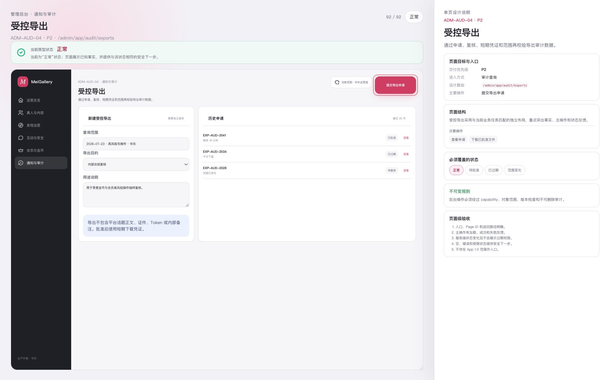

---

## 9. 开发启动门禁（Definition of Ready）

- 客户 C-01～C-08 的选择、会员额度、Beta 门槛和运营服务参数已记录；未关闭项有 Owner、截止点和安全默认值。
- P0 页面、路由、状态集合、文案身份披露和原型已经评审；任何业务变化已同步 PRD/SCP/Feature PRD。
- OpenAPI、事件 Schema、错误模型、幂等规则和未知枚举策略已冻结到可实现版本。
- Account、Person、PersonProfile、Gallery、会员、会话、账本和 legacy 映射已完成数据所有权与 migration 评审。
- 管理后台 capability、scope、强认证、复核与审计规则已定义，测试账号和最小样例数据可用。
- P0 端到端旅程的测试计划、可观测性、降级、恢复和回滚证据要求已确认。

## 10. 完成定义（Definition of Done）

- 每个实现任务引用需求编号和 Page ID，满足逐页开发验收与关联 Feature PRD 的 Given/When/Then。
- 客户端与后台覆盖本页声明的全部状态；实现截图与 Figma 同一 Page ID、同一状态在相同视口下完成视觉回归。
- 所有对象级授权、会员、媒体、消息、账本和后台写操作通过服务端验证；越权与过期用例有自动化测试。
- API/DTO/事件与冻结 Schema 一致，未知字段和枚举兼容测试通过，重试不产生重复业务结果。
- 关键操作具备审计、最小化日志、指标和告警；敏感字段未进入日志、埋点或崩溃报告。
- Android/iOS 无支付 SDK、无推送 SDK 时 P0 E2E 通过；Nuxt 后台关键工作流、键盘操作和 200% 缩放通过。
- 未来能力没有出现在 1.0 页面、菜单、远程配置可执行入口或上线验收中。
- 需求一致性、原型、DOCX 映射、类型检查和 Web 构建校验全部通过。

## 11. 维护与生成

- 编辑上游：`PRODUCT_REQUIREMENTS.md`、App 1.0 发布范围、Feature PRD、`page-catalog.js` 和开放问题清单。
- 重新生成：`node scripts/generate_app_page_spec.mjs`。
- 一致性校验：`python scripts/verify_app_requirement_consistency.py`、`python scripts/verify_app_page_prototypes.py --skip-contact-sheets`。
- 客户文档：上游同步后运行 `python scripts/generate_app_product_docs.py`，DOCX 不作为需求源手工分叉。
