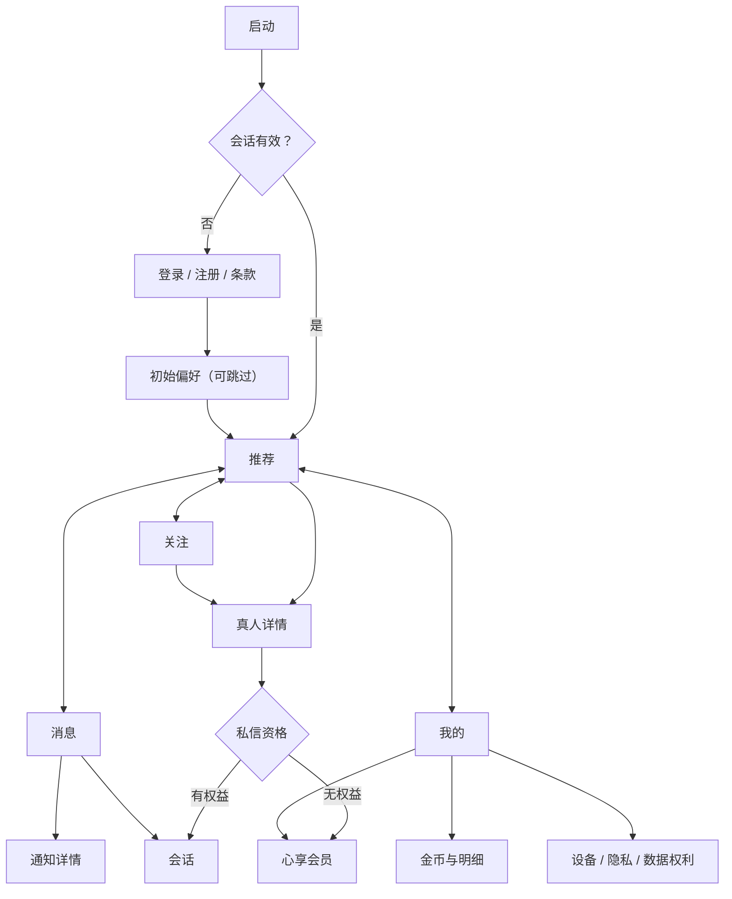

# App 1.0 移动端页面与交互规格

App 版本：1.0

日期：2026-07-20

状态：需求讨论中

文档类型：Reference

## 1. 文档目的

本文把 App 1.0 的产品与 Feature PRD 转换为移动端页面级交互契约，供产品、UI、KMP、API、测试和运营共同使用。本文定义页面编号、信息层级、入口、操作、返回行为、关键状态和验收；不定义最终像素、字体尺寸、品牌资产或实现代码。

上游事实源：

- [产品需求](./PRODUCT_REQUIREMENTS.md)
- [UI/UX 设计总纲](./UI_UX_DESIGN.md)
- [Feature PRD 目录](../ways-of-work/plan/real-person-discovery-platform/README.md)
- [API 与实时通信契约](./API_AND_REALTIME_CONTRACT.md)
- [统一 UI 状态、文案与埋点目录](./UI_STATE_COPY_AND_ANALYTICS_CATALOG.md)

发生冲突时，产品范围和 Feature PRD 决定“做什么”，API 契约决定服务端事实，本文决定“页面如何呈现和流转”。

## 2. 适用范围

### 2.1 App 1.0 包含

- Android/iOS 启动、登录、注册、条款和初始偏好。
- 推荐、地区、热门、最新、分类、搜索、筛选、真人详情和媒体浏览。
- 喜欢、关注、收藏、浏览历史和拉黑联动。
- 五级心享会员目录、当前权益、额度和获取方式。
- 有效会员创建/发送私信、平台代运营披露、文本/表情消息。
- 站内通知中心、金币余额与追加式明细。
- 账号、设备、隐私、通知偏好、举报、申诉、数据导出和注销。

### 2.2 App 1.0 不显示入口

- 在线支付、会员购买/续订/退款、金币充值。
- 系统推送授权、锁屏通知配置。
- 图片/语音/视频/文件/位置消息、音视频通话、直播。
- 礼物、头像框、主页皮肤、聊天皮肤。
- 普通用户公开资料、双方匹配、用户间聊天。
- 真人本人认领、本人收件箱和历史会话交接。

未来能力不得以禁用按钮、灰色占位或“敬请期待”挤占 App 1.0 页面；立项后再随对应客户端版本加入。

## 3. 编号与路由约定

### 3.1 Screen ID

| 前缀 | 领域 | 示例 |
|------|------|------|
| `AUTH` | 启动、认证和初始设置 | `APP-AUTH-03` 注册 |
| `DSC` | 推荐、搜索和真人资料 | `APP-DSC-07` 真人详情 |
| `INT` | 关注、喜欢、收藏和历史 | `APP-INT-03` 收藏夹 |
| `MSG` | 会话和站内通知 | `APP-MSG-03` 会话页 |
| `MBR` | 心享会员和 entitlement | `APP-MBR-01` 会员目录 |
| `WAL` | 金币钱包和明细 | `APP-WAL-02` 金币明细 |
| `SET` | 我的、设备、隐私和数据权利 | `APP-SET-04` 隐私设置 |
| `SYS` | 通用错误、升级和安全状态 | `APP-SYS-03` 账号受限 |

Screen ID 是产品、设计、埋点和测试的稳定引用。实际 Compose route 名可在技术设计中映射，但不得改变 Screen ID 的业务含义。

### 3.2 设计路由

- 本文使用 `/discover` 等设计路由表达导航语义，不承诺 URL 实现。
- `app://person/{profileId}` 等为抽象深链；正式 Scheme/Universal Link 在品牌、域名和应用 ID 确定后映射。
- 所有对象深链先进入服务端状态校验，不能绕过登录、资料发布、会员、拉黑或安全限制。

## 4. 全局导航模型



### 4.1 一级导航

底部固定为“推荐、关注、消息、我的”。每个一级入口维护独立返回栈和列表位置：

- 再次点击当前 Tab：若位于子页，回到该 Tab 根页；若已在根页，滚动至顶部并按页面策略允许刷新。
- 切换 Tab：保留其他 Tab 的筛选、滚动和已加载内容；账号、权限或对象失效时刷新后进入安全状态。
- Android 系统返回：先关闭键盘/弹层，再返回当前栈上一页；根页按系统惯例退出前台。
- iOS 页面返回：使用导航栏返回或边缘手势；关键表单有未保存内容时弹出离开确认。

### 4.2 登录与回跳

- 公开内容允许的范围由首发地区和服务端 capability 决定；需要登录的动作统一进入登录页。
- 登录前保存 `returnTarget`，登录成功后重新校验目标，再回跳；目标已下架或无权限时进入安全状态页。
- 账号退出、会话过期或远程撤销时清除私有缓存和返回栈，只保留允许的公开内容缓存。

### 4.3 深链顺序

```text
解析深链
→ 判断客户端是否支持 action
→ 校验登录和账号状态
→ 服务端读取对象当前状态和权限
→ 打开目标页 / 登录后回跳 / 升级提示 / 安全不可用页
```

未知 action 不猜测目标；显示通用说明并提供回到推荐首页的操作。

## 5. 页面目录

### 5.1 启动、认证与初始设置

| Screen ID | 设计路由 | 页面 | 主要内容与操作 | 必备状态 |
|-----------|----------|------|----------------|----------|
| `APP-AUTH-01` | `/launch` | 启动与会话恢复 | 品牌、配置/会话恢复、最低版本检查 | 首次、恢复中、离线、升级、维护 |
| `APP-AUTH-02` | `/auth/login` | 登录 | 服务端启用的登录方式、条款/隐私入口、帮助 | 输入错误、验证中、频控、账号受限 |
| `APP-AUTH-03` | `/auth/register` | 注册 | 登录标识验证、必要资格、条款选择 | 标识占用、验证码失效、地区不可用 |
| `APP-AUTH-04` | `/auth/challenge` | 风险验证 | 二次验证、原因说明、重新发送 | 等待、失败、次数限制 |
| `APP-AUTH-05` | `/onboarding/preferences` | 初始偏好 | 地区范围、标签、风格、内容类型、跳过 | 空目录、保存失败、非个性化说明 |
| `APP-AUTH-06` | `/legal/{document}` | 条款/隐私文档 | 文档版本、正文、更新时间、返回 | 加载失败、版本更新 |

注册只创建观看者账号，不出现“创建交友资料”、身高、职业、自我介绍或上传公开照片。

### 5.2 推荐、搜索与真人资料

| Screen ID | 设计路由 | 页面 | 主要内容与操作 | 必备状态 |
|-----------|----------|------|----------------|----------|
| `APP-DSC-01` | `/discover` | 推荐首页 | 地区、搜索、通知、推荐/地区/热门/最新、真人卡片 | 首次空、骨架、分页、离线缓存、规则刷新 |
| `APP-DSC-02` | `/discover/regions` | 地区选择 | 最近/常用地区、层级目录、模糊范围 | 定位未使用、目录更新、无结果 |
| `APP-DSC-03` | `/discover/categories` | 分类 | 分类组、标签入口、推荐主题 | 空分类、目录失效 |
| `APP-DSC-04` | `/search` | 搜索 | 搜索输入、历史、热门建议、结果 | 初始、输入中、无结果、历史关闭 |
| `APP-DSC-05` | `/search/filters` | 筛选 | 基础/高级条件、结果数、清空、应用、保存 | entitlement gate、目录冲突、无结果 |
| `APP-DSC-06` | `/saved-filters` | 已保存条件 | 条件列表、使用、重命名、删除 | 空、额度满、引用标签合并 |
| `APP-DSC-07` | `/person/{profileId}` | 真人详情 | 媒体、认证、地区/标签、简介、运营说明、互动与私信 | 下架、受限、离线摘要、媒体不可用 |
| `APP-DSC-08` | `/person/{profileId}/media` | 媒体浏览 | 图片分页、缩放、说明、举报 | 凭证刷新、加载失败、内容隐藏 |
| `APP-DSC-09` | `/person/{profileId}/verification` | 认证说明 | 认证范围、更新时间、平台说明 | 认证失效、资料变化 |

### 5.3 单向互动与历史

| Screen ID | 设计路由 | 页面 | 主要内容与操作 | 必备状态 |
|-----------|----------|------|----------------|----------|
| `APP-INT-01` | `/following` | 关注更新 | 关注真人更新流、筛选、进入详情 | 首次空、无更新、下架项 |
| `APP-INT-02` | `/likes` | 喜欢 | 喜欢过的真人、撤销、进入详情 | 空、不可用项 |
| `APP-INT-03` | `/favorites` | 收藏夹 | 文件夹、默认收藏、创建/重命名/删除 | 空、额度满、离线 |
| `APP-INT-04` | `/favorites/{folderId}` | 收藏夹详情 | 真人列表、移动、移除 | 文件夹删除、资料下架 |
| `APP-INT-05` | `/history` | 浏览历史 | 时间分组、逐条删除、全部清除 | 空、保留到期、清除失败 |

喜欢、关注、收藏使用不同图标和动词；任何成功反馈都不能出现“匹配成功”“对方已收到”或双方关系暗示。

### 5.4 私信与站内通知

| Screen ID | 设计路由 | 页面 | 主要内容与操作 | 必备状态 |
|-----------|----------|------|----------------|----------|
| `APP-MSG-01` | `/messages` | 私信列表 | 会话、平台运营标签、摘要、时间、未读、静音 | 首次空、离线、会话受限 |
| `APP-MSG-02` | `/messages/start/{profileId}` | 建会话确认 | 接收主体、权益/额度、不保证回复、确认创建 | 无会员、额度尽、资料失效、重复会话 |
| `APP-MSG-03` | `/messages/{conversationId}` | 会话 | 服务说明卡、消息、状态、文本/表情输入、菜单 | 补拉、审核中、只读、冻结、关闭 |
| `APP-MSG-04` | `/messages/{conversationId}/details` | 会话设置 | 接收主体说明、静音、举报、拉黑、关闭 | 操作失败、已关闭 |
| `APP-MSG-05` | `/notifications/{category}` | 通知列表 | 分类、未读、全部已读、通知卡 | 首次空、分页失败、实时离线 |
| `APP-MSG-06` | `/notifications/detail/{notificationId}` | 通知详情 | 用户安全正文、时间、当前目标状态、下一步 | 目标失效、无权限、需升级 |

### 5.5 会员与金币

| Screen ID | 设计路由 | 页面 | 主要内容与操作 | 必备状态 |
|-----------|----------|------|----------------|----------|
| `APP-MBR-01` | `/membership` | 五级会员目录 | 五级切换、当前等级、差异、获取方式、限制 | 免费、待生效、同步失败 |
| `APP-MBR-02` | `/membership/current` | 当前权益 | 有效期、typed entitlement、已用/剩余额度、重置时间 | 即将到期、到期、撤销、受限 |
| `APP-MBR-03` | `/membership/help` | 获取方式与帮助 | 平台发放说明、常见问题、客服入口 | 帮助不可用 |
| `APP-WAL-01` | `/wallet` | 金币钱包 | 余额、最后同步、规则、明细入口 | 空钱包、离线缓存、同步失败 |
| `APP-WAL-02` | `/wallet/entries` | 金币明细 | 全部/增加/扣减、数量、原因、时间 | 首次空、分页、对账维护 |
| `APP-WAL-03` | `/wallet/entries/{entryId}` | 分录详情 | 方向、数量、说明、安全业务单号、冲正、申诉 | 分录不可用、冲正中 |

### 5.6 我的、设置与数据权利

| Screen ID | 设计路由 | 页面 | 主要内容与操作 | 必备状态 |
|-----------|----------|------|----------------|----------|
| `APP-SET-01` | `/me` | 我的 | 账号摘要、会员、金币、设备、隐私、帮助 | 账号受限、摘要同步失败 |
| `APP-SET-02` | `/me/account` | 账号资料 | 私有昵称/头像、登录标识摘要 | 保存失败、重新验证 |
| `APP-SET-03` | `/me/devices` | 设备管理 | 当前设备、其他设备、远程退出 | 仅当前设备、撤销失败 |
| `APP-SET-04` | `/me/privacy` | 隐私与推荐 | 个性化、历史、可选分析、用途说明 | 保存冲突、政策更新 |
| `APP-SET-05` | `/me/notification-preferences` | 站内通知偏好 | 消息、互动、营销与不可关闭的必要通知 | 同步失败、策略变化 |
| `APP-SET-06` | `/me/blocks` | 拉黑名单 | 真人列表、解除拉黑、影响说明 | 空、解除失败 |
| `APP-SET-07` | `/me/reports` | 举报记录 | 状态、时间、用户可见进度 | 空、状态延迟 |
| `APP-SET-08` | `/me/appeals` | 申诉 | 创建、证据说明、进度 | 已有处理中、提交失败 |
| `APP-SET-09` | `/me/data-export` | 数据导出 | 范围说明、创建任务、进度、下载 | 处理中、失败、已过期、重新验证 |
| `APP-SET-10` | `/me/delete-account` | 注销账号 | 影响说明、重新验证、提交和可取消阶段 | 阻塞项、处理中、失败 |
| `APP-SET-11` | `/help` | 帮助中心 | 主题、搜索、服务说明、联系入口 | 离线、无结果 |
| `APP-SET-12` | `/about` | 关于与法律 | 版本、协议、隐私、开源许可 | 文档不可用 |

### 5.7 系统页面

| Screen ID | 场景 | 主文案方向 | 操作 |
|-----------|------|------------|------|
| `APP-SYS-01` | 强制升级 | 当前版本无法安全使用此功能 | 更新 App / 返回 |
| `APP-SYS-02` | 维护 | 服务暂时不可用，已保存的本地内容不代表最新状态 | 重试 / 帮助 |
| `APP-SYS-03` | 账号受限 | 说明可见范围、限制原因类别和申诉入口 | 查看详情 / 申诉 / 退出 |
| `APP-SYS-04` | 对象不可用 | 资料、会话或通知目标当前不可访问 | 返回推荐 / 帮助 |
| `APP-SYS-05` | 地区不可用 | 当前地区暂未开放服务 | 查看说明 / 退出 |

## 6. 关键页面低保真结构

线框只表达优先级，不规定尺寸和视觉样式。

### 6.1 推荐首页 `APP-DSC-01`

```text
┌─────────────────────────────┐
│ 城市范围⌄      搜索  筛选  通知│
│ 推荐   地区   热门   最新      │
├─────────────────────────────┤
│ 推荐理由 / 非个性化说明         │
│ ┌──────────┐  ┌──────────┐   │
│ │ 真人封面  │  │ 真人封面  │   │
│ │ 认证 名称 │  │ 认证 名称 │   │
│ │ 地区 标签 │  │ 地区 标签 │   │
│ │ 喜欢关注收藏│ │ 喜欢关注收藏│  │
│ └──────────┘  └──────────┘   │
│             加载/分页状态       │
├─────────────────────────────┤
│ 推荐      关注      消息      我的│
└─────────────────────────────┘
```

规则：大字体、小屏或辅助功能模式切换单列；通知红点来自服务端未读；卡片不显示在线、精确距离或保证回复。

### 6.2 真人详情 `APP-DSC-07`

```text
┌─────────────────────────────┐
│ 返回                  分享  更多│
│          媒体头图             │
│ ●认证  展示名                  │
│ 城市范围 · 职业 · 标签          │
│ 简介                           │
│ 图库横向预览                    │
│ ┌─────────────────────────┐  │
│ │ 消息由平台运营接收和回复    │  │
│ │ 查看服务说明                │  │
│ └─────────────────────────┘  │
│ 喜欢       关注       收藏      │
│ [               私信          ] │
└─────────────────────────────┘
```

“认证”和“平台运营”必须使用不同语义图标与文本。资料未认领不显示本人在线或真人头像消息气泡。

### 6.3 心享会员 `APP-MBR-01`

```text
┌─────────────────────────────┐
│ 返回        心享会员            │
│ 当前：心悦 · 有效至 {date}       │
│ 心遇 | 心悦 | 心知 | 心契 | 心耀 │
├─────────────────────────────┤
│ 等级名称与事实文案               │
│ ✓ 可创建和发送私信               │
│ ✓ 每日新会话 {limit}             │
│ ✓ 筛选 / 收藏 / 历史具体额度      │
│ 与上一级差异                     │
│ 获取方式：由平台审核后发放        │
│ 消息由平台运营接收；不保证回复     │
│ [了解获取方式]   [查看当前权益]   │
└─────────────────────────────┘
```

不得出现价格、购买、续订、退款、倒计时促销或“无限畅聊”。

### 6.4 会话 `APP-MSG-03`

```text
┌─────────────────────────────┐
│ 返回  真人展示名  [平台运营接收] ⋯│
├─────────────────────────────┤
│ ┌ 服务说明：由平台运营接收和回复 ┐│
│ └─────────────────────────┘  │
│ 系统消息                        │
│                 用户消息  状态  │
│ 平台运营头像  平台回复            │
│                 用户消息 审核中   │
│                               │
├─────────────────────────────┤
│ 表情  输入消息……          发送    │
└─────────────────────────────┘
```

会员到期、拉黑、安全冻结或会话关闭时，输入区替换为不可发送状态条；历史仍按权限可读。App 1.0 不显示加号、相册、礼物、语音或通话入口。

### 6.5 我的与钱包入口 `APP-SET-01`

```text
┌─────────────────────────────┐
│ 我的                           │
│ 账号头像  私有昵称  账号状态       │
│ ┌会员状态────┐  ┌金币余额────┐   │
│ │等级/期限/额度│  │余额/明细    │   │
│ └──────────┘  └──────────┘   │
│ 账号与设备                     ＞│
│ 站内通知设置                   ＞│
│ 隐私与推荐                     ＞│
│ 拉黑名单                       ＞│
│ 数据导出与注销                 ＞│
│ 帮助与申诉                     ＞│
└─────────────────────────────┘
```

## 7. 关键旅程与交互规则

### 7.1 首次注册到推荐

```text
启动 → 读取 capability/最低版本 → 选择登录或注册
→ 查看并接受当前条款/隐私 → 完成服务端验证
→ 初始偏好（允许跳过） → 推荐首页
```

- 条款未加载完成时不能用空白占位代替同意内容。
- 偏好跳过后使用非敏感基础排序；不自动读取精确位置。
- 注册成功不会创建 Person/Profile，也不要求填写公开交友资料。

### 7.2 推荐到互动

- 卡片点击进入详情；喜欢、关注、收藏支持乐观反馈，但服务端失败必须回滚并说明。
- 快捷操作区域与卡片跳转区域分离，避免误触。
- 下拉刷新创建新的推荐 session；分页沿用当前 session 和规则版本。
- 规则版本变化导致游标失效时保留当前可见内容，提示“推荐已更新”，由用户触发回到新列表顶部。

### 7.3 私信门槛与建会话

```text
详情点击私信
→ 服务端返回当前接收主体和资格
→ 无会员：打开 entitlement gate，不创建会话
→ 有会员：进入建会话确认，披露平台运营、额度和限制
→ 用户确认 → 幂等创建/复用会话 → 打开会话页
```

- entitlement gate 主操作为“查看心享会员”，不是“立即购买”。
- 重复点击、网络重试或已有有效会话均不得重复消耗额度。
- 额度不足显示重置时间；资料下架、拉黑或安全限制显示对应下一步。

### 7.4 消息发送与恢复

- 输入内容作为本地草稿保存；离线时不自动排队发送，避免恢复联网后无感发送。
- 点击发送后创建稳定 `clientMessageId`，状态依次由服务端事实驱动。
- `review_pending` 显示“审核中”，不能显示已送达。
- 实时断开显示非阻断离线条；恢复后从最后 sequence 补拉，发现 gap 时以 HTTP 快照为准。
- 撤回只在服务端返回的 `recallUntil` 前展示；成功后所有设备显示 tombstone，不提供编辑。
- 已读文案固定为“平台运营已读”；无实际回执时不显示已读。

### 7.5 会员变化

- 会员页每次进入拉取目录和本人快照；页面恢复前台时按缓存策略校验版本。
- `entitlement.changed` 只触发刷新，不直接根据事件 payload 改权限。
- 到期后所有会话输入区立即只读；重新发放生效后仍需重新校验会话状态。
- 不支持的 entitlement 只隐藏对应未知能力，已知权益继续展示。

### 7.6 通知打开

- 通知卡先幂等标记已读，再请求目标当前状态；标记失败时回滚本地未读。
- 目标失效进入 `APP-MSG-06` 安全详情，不跳转空白页。
- 必要通知不因关闭营销而消失；会话静音只停止消息类提示，不删除新消息。
- 实时离线不影响通知最终可见性，页面启动/恢复时通过 HTTP 对账未读。

### 7.7 金币与明细

- 钱包余额和分录只能显示服务端权威结果；本地不做加减预测。
- `wallet.changed` 后刷新摘要与首屏明细，通知内金额不替代钱包查询。
- 待复核、拒绝和失败的后台调币不进入用户账本。
- 冲正同时展示原分录与新分录关系，不把原记录改写成 0。

### 7.8 举报、拉黑与注销

- 举报支持真人、媒体、会话和消息；成功后展示案件号的用户安全版本和进度入口。
- 拉黑前明确影响：停止推荐、互动和私信；确认后立即返回安全页面。解除拉黑不恢复互动或会话。
- 注销必须重新验证，展示不可逆影响和可能依法隔离保留的数据类别；处理中不显示“已删除”。

## 8. 弹层与确认规范

| 类型 | 使用场景 | 规则 |
|------|----------|------|
| Bottom Sheet | 筛选、互动快速选择、服务说明 | 可轻量关闭，不承载不可逆最终提交 |
| Full-screen Sheet | 登录回跳、复杂筛选、举报表单 | 保留上下文，返回前处理未保存内容 |
| Alert Dialog | 拉黑、关闭会话、清除历史、远程退出 | 标题陈述动作，正文说明影响，危险按钮明确动词 |
| Entitlement Gate | 私信/高级筛选等权限不足 | 显示所需 key 的用户价值和获取方式，不创建业务记录 |
| Re-auth | 导出下载、注销、安全设备操作 | 说明原因，成功后回到原操作且重新校验状态 |

不得连续堆叠两个模态层；新高优先级确认出现前先关闭或合并当前弹层。

## 9. 数据刷新与缓存

| 数据 | 缓存用途 | 前台恢复策略 | 禁止事项 |
|------|----------|--------------|----------|
| 公开真人投影 | 加快首屏/离线摘要 | 校验 ETag/状态后更新 | 缓存不能绕过下架 |
| 推荐列表 | 保留滚动和 session | 规则变化时提示刷新 | 不跨账号复用个性化结果 |
| 互动状态 | 快速展示 | 写失败回滚、恢复时对账 | 不把本地状态当权威 |
| 会员/entitlement | 展示预提示 | 关键操作每次服务端重验 | 不离线扩大权限 |
| 会话/消息 | 历史和断线恢复 | sequence 补拉/HTTP 快照 | 不缓存内部备注 |
| 通知/未读 | 首屏与红点 | 启动、前台和实时提示后对账 | 不由本地永久计数 |
| 钱包 | 离线只读摘要 | 显示最后同步并联网刷新 | 不本地计算权威余额 |

退出账号、账号删除生效或设备被撤销时清除该账号私有缓存、草稿和短期媒体凭证。

## 10. 无障碍与平台适配

- 核心旅程在动态字体、屏幕阅读器、高对比度和减少动态效果下完整可用。
- 真人卡、会员卡和消息气泡提供线性朗读顺序；认证、会员、运营模式和状态不能只靠颜色。
- 图片按内容提供描述或标记装饰；媒体浏览提供关闭、页码和举报可访问名称。
- 键盘出现时不遮挡消息发送和表单错误；横屏与安全区不裁切关键说明。
- Android 与 iOS 可遵循各自返回、弹层和系统控件惯例，但 Screen ID、任务、文案事实与权限结果一致。

## 11. 页面级验收

- **MUI-AC-001**：四个一级 Tab 使用独立返回栈，切换后保持列表位置；账号或对象状态失效时不会继续展示可执行旧权限。
- **MUI-AC-002**：普通账号从任一私信入口都只能进入会员说明，不产生会话或额度消耗。
- **MUI-AC-003**：平台运营接收标识同时存在于真人详情、建会话确认、会话列表、会话顶部和服务说明卡。
- **MUI-AC-004**：会员到期时既有会话保留历史但输入区只读，重新获得会员后仍执行服务端会话校验。
- **MUI-AC-005**：App 1.0 所有页面均不存在支付、充值、推送授权、图片消息、礼物和装扮入口。
- **MUI-AC-006**：通知目标失效、资料下架或深链无权限时显示安全状态，不进入空白页或泄露对象存在性。
- **MUI-AC-007**：钱包页面不在本地预测余额，待复核/失败调币不出现在用户账本。
- **MUI-AC-008**：断线重连后消息按 sequence 补齐，无重复消息、虚假送达或虚假已读。
- **MUI-AC-009**：喜欢、关注和收藏使用不同反馈，任何路径都不出现匹配或双方关系文案。
- **MUI-AC-010**：屏幕阅读器和大字体下可完成注册、发现、私信门槛、阅读会话、举报和注销。

## 12. 设计交付要求

高保真和点击原型必须：

1. 使用本文 Screen ID 标注每个 Frame。
2. 标注正常、加载、空、错误、离线、受限和下架状态。
3. 标注使用的 API/服务端状态和事件，而不是用设计稿自造状态。
4. 标注埋点 event key、无障碍名称和动态字体行为。
5. 对平台运营披露、会员额度、钱包分录和危险操作使用统一文案 key。
6. 将未来能力放入单独 Future 页面，不混入 App 1.0 可点击原型。
