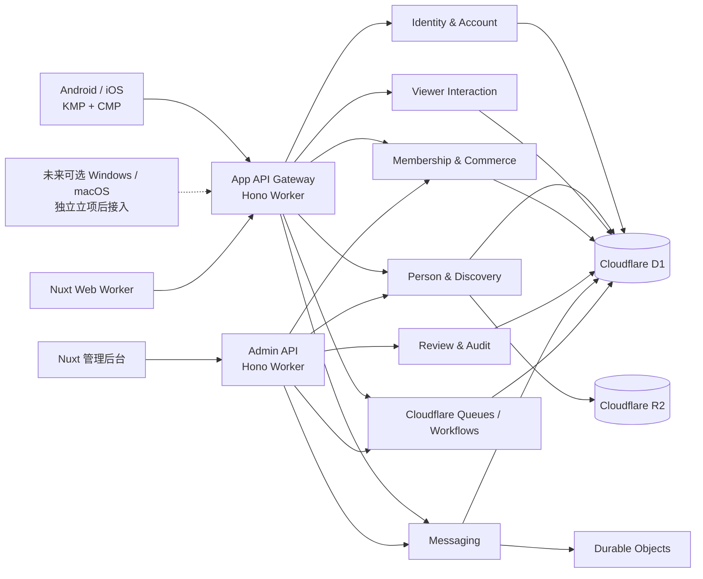

# 真人发现与互动平台技术架构方案

App 版本：1.0

日期：2026-07-20

状态：需求讨论中

## 1. 目标与约束

目标是在不破坏当前 MeiGallery Web 的前提下，为独立 App 和未来 Web 迁移建立共享核心平台。App 1.0 客户端为 Android/iOS，采用 KMP + Compose Multiplatform；普通用户 Windows/macOS 客户端未承诺立项。Nuxt Web 与管理后台继续运行在 Cloudflare Workers，并承担桌面运营场景。

硬约束：

- Cloudflare 是唯一运行时和基础设施平台，除经明确评审的商店、推送、短信、身份核验和内容审核适配器。
- Web 与 API 保持独立 Worker；不使用 Cloudflare Pages。
- 客户端不直接访问 D1、R2、Durable Objects 或 legacy 表。
- 受保护媒体、会员权限、消息发送、订单和调币全部由服务端授权。
- 普通账号与真人主体分离，不存在 Match 聚合或用户间聊天。
- Kotlin 和 TypeScript 通过版本化 schema 共享契约，不共享语言源码。

## 2. 总体架构



逻辑服务可在早期部署为少量 Worker 内的独立模块，不要求立即拆成微服务。边界由领域、权限、schema 和测试明确，达到容量或团队阈值后再物理拆分。

## 3. 客户端架构

### 3.1 KMP/CMP 模块

```text
apps/
├── androidApp
├── iosApp
├── desktopApp（未来独立立项后再创建）
└── shared
    ├── core-model
    ├── core-network
    ├── core-database
    ├── core-auth
    ├── core-design
    ├── feature-discovery
    ├── feature-person
    ├── feature-interaction
    ├── feature-messaging
    ├── feature-membership
    ├── feature-wallet
    ├── feature-cosmetic
    └── feature-settings
```

- `commonMain`：领域模型、用例、状态机、网络契约、本地缓存、共享 ViewModel 和大部分 Compose UI。
- `androidMain/iosMain`：App 1.0 深链、安全存储和系统适配；商店购买、系统推送、媒体选择和身份核验在未来 Feature 立项后加入。`desktopMain` 只在桌面客户端立项后创建。
- 支付、身份核验和高风险平台流程可保留原生 UI，不追求机械共享率。
- Compose Web 不在范围内；Nuxt Web/后台继续满足 SEO 和运营效率。

### 3.2 客户端库基线与平台边界

客户端稳定基线采用：Compose Multiplatform、Lifecycle/ViewModel、Navigation 3、Paging、Room/SQLite、DataStore Preferences、Ktor Client、kotlinx.serialization 和 Coil 3。完整版本矩阵、候选库、缓存规则和技术 Spike 见 [KMP 客户端技术栈与库选型](./KMP_CLIENT_TECH_STACK.md)。

- 网络：公共层使用 Ktor Client；Android 使用 OkHttp 引擎，iOS 使用 Darwin 引擎。
- 图片：公共层使用 Coil 3 + Ktor 3 网络模块；公开媒体和受保护媒体使用不同缓存策略。
- 视频：公共层只拥有视频源、播放状态、控制器接口和共享控制 UI；Android 使用 Media3 ExoPlayer，iOS 使用 AVPlayer/AVKit。
- 数据：Room 保存结构化离线投影，DataStore 只保存 Preferences 和非敏感配置；Token 与密钥进入 Android Keystore/iOS Keychain。
- App 1.0 不接入支付和系统推送，不预装相关 SDK；站内通知使用 HTTP/实时通道。未来能力通过平台端口和正常 App 升级交付。
- Media3、Hilt、WorkManager、CameraX 和平台安全存储类型不得进入 `commonMain`。
- Android App 1.0 使用 `minSdk = 26`，API 25 及以下不进入兼容和测试范围；脚手架冻结前可以基于安全、媒体或商店要求继续提高，不得静默降低。

### 3.3 本地数据

- 只缓存公开真人投影、用户互动状态、目录、会话摘要和已加密的必要消息。
- 订单结果、余额和 entitlement 以服务端为准；离线只读并标注最后同步时间。
- 消息使用 outbox 和客户端消息 ID，恢复网络后幂等提交。
- 退出、远程登出和账号注销触发本地敏感缓存清理。

## 4. 服务端领域

### 4.1 Identity & Account

拥有账号、凭证、设备、会话、角色、同意记录、资格状态和数据权利 Workflow。注册只创建 `Account`，不创建真人资料。

### 4.2 Person & Discovery

拥有 `Person`、`PersonProfile`、认证、授权、运营归属、认领、地区/标签、公开投影、搜索和推荐规则。

- 公开查询统一过滤 `verified + published`。
- 运营置顶和自然热度分开记录。
- 推荐输出理由代码、规则版本和排序模式。

### 4.3 Viewer Interaction

拥有浏览、喜欢、关注、收藏、收藏夹和历史。所有关系为 `Account → PersonProfile` 单向关系，不创建 Match。

### 4.4 Messaging

拥有会话资格、参与主体、运营模式、消息事件、管理员分配、已读、举报快照和会话状态。

- `platform_managed` 会话：观看者 + 平台运营身份，具体操作员只在审计中保存。
- `person_managed` 会话：观看者 + 已认领真人账号。
- 建会话需要 `direct_message.create`，发送需要 `direct_message.send`，均不需要双方同意；会员到期后既有会话只读。
- Durable Object 按 `conversationId` 串行处理消息、序号、连接和已读；D1 保存会话索引、可查询投影和审计关联。

### 4.5 Membership & Commerce

长期拥有五级会员目录、entitlement、SKU、订单、钱包、账本、礼物、装扮库存、退款和管理员调币。App 1.0 只实现五级目录、管理员 grant、entitlement、钱包账本和调币；其余能力在未来 Feature migration 中启用。

- rank 只表达等级顺序，实际权限来自 entitlement。
- 账本只追加，余额快照可重建。
- 高风险调币使用 Workflow 双人复核。
- 未来商店能力启用后，凭证仅服务端验证且重复回调幂等。

### 4.6 Review & Governance

拥有真人认证/发布审核、消息/媒体举报、安全处置、申诉、审计和高风险后台审批。内部备注与用户可见消息隔离。

## 5. Cloudflare 组件分工

| 组件 | 目标用途 |
|------|----------|
| Workers + Hono | App/Public/Admin API、鉴权、领域编排和签名凭证 |
| Workers Assets | Nuxt Web/后台静态资源 |
| D1 | 账号、真人、投影、互动、会话索引、会员、订单、账本、审核和审计 |
| R2 | 原始/处理后图片、导入包、授权证据和经审批的举报附件 |
| Cloudflare Stream | 未来视频 Feature 的上传、编码和受控播放；当前规划能力 |
| Durable Objects | 单会话实时连接、顺序、去重、已读和短期状态 |
| Queues | 通知、媒体处理、投影更新、订单回调和分析事件 |
| Workflows | 导入、认领、批量调币、退款、删除/导出和长事务编排 |
| Turnstile | 注册、登录恢复和高风险操作人机验证 |
| WAF / Rate Limiting | API 防护、撞库、爬取、消息和支付限流 |

添加配置前必须核对当前 Cloudflare 官方文档和目标套餐，不在架构中硬编码可能变化的产品限制。

## 6. 数据所有权与一致性

| 场景 | 一致性要求 | 方案 |
|------|------------|------|
| 真人认证并发布 | 认证/发布强一致，搜索最终一致 | D1 事务 + Outbox/Queue 更新投影 |
| 喜欢/关注/收藏 | 单关系幂等 | D1 唯一键 + 条件写 |
| 创建私信 | 权限、额度、唯一会话强一致 | D1 条件事务/服务端协调 + 幂等键 |
| 单会话消息 | 顺序、去重强一致 | conversation Durable Object |
| 会员发放 | 订单与 entitlement 可证明一致 | 幂等订单状态机 + Outbox/Saga |
| 金币消费/赠礼 | 扣币与业务记录原子 | D1 事务 + 唯一业务键 |
| 管理员调币 | 审批与分录强一致 | Workflow + D1 条件事务 |
| 认领交接 | 状态与路由强一致，通知最终一致 | Workflow + 版本检查 + Outbox |

不允许长期无归属双写。每个迁移阶段必须定义唯一写主、影子读、对账和回滚点。

## 7. 身份、授权与 RBAC

### 7.1 用户侧

服务端授权上下文至少包含：`accountId`、会话、设备、账号状态、地区/资格、角色、会员快照版本和风险状态。

对象级检查：

- 只能读取自己的互动、订单、账本、设备和数据请求。
- 创建私信校验目标资料、entitlement、额度、拉黑和安全状态。
- 读取会话校验参与主体和当前运营模式。
- 受保护媒体每次签发短期凭证前校验可见性和会员等级。

### 7.2 管理侧

建议角色：Owner、内容编辑、认证审核、发布审核、代运营、消息审核、客服、商业运营、财务、财务复核、审计只读。

认证、发布、代运营、财务和审计能力分离；高风险操作要求强认证和新鲜会话。所有管理写入包含操作者、目标、原因、前后状态和审批链。

## 8. 媒体安全

- 原始对象和授权证据存放在私有 R2。
- 前台使用审核通过的派生资源和短期签名 URL。
- 上传校验 MIME、扩展名、文件签名、尺寸、大小和恶意内容。
- EXIF/位置等非必要元数据在发布派生时移除。
- 资料暂停、授权撤销或会员到期后停止签发新凭证。
- CDN 已缓存资源使用不可猜测版本 URL和短 TTL/撤销策略。
- Coil 公开图片缓存与受保护媒体缓存隔离；受保护原图默认只使用内存缓存，任何磁盘缓存必须可在退出、远程登出、会员失效和权限撤回时清理。
- 短期签名 URL 与稳定媒体 ID、凭证过期时间分开建模，不把签名 URL 作为永久缓存键或业务主键。
- Cloudflare Stream Manifest 不持久缓存；Android Media3 和 iOS AVPlayer 只消费服务端授权后返回的短期签名 HLS URL。

## 9. 配置与功能演进

服务端配置域：会员目录、entitlement、商品、筛选、推荐、地区、披露文案、频控、远程开关和最低客户端版本。

每份配置包含 schema 版本、内容版本、生效区间、地区/渠道、灰度、审批和回滚。客户端只渲染已支持的组件类型，未知类型安全忽略。远程配置不得下载可执行代码或绕过商店审核。

## 10. 可观测性和审计

- Trace ID 贯穿 API、Queue、Workflow、DO 和外部适配器。
- 产品分析只记录事件 ID、对象引用和枚举，不记录私信正文、证件和完整支付凭证。
- 关键业务指标：发布、推荐、会话、响应、订单、账本、认领和安全队列。
- 安全告警：越权枚举、批量抓取、异常新会话、管理员大额调币、账本差异、凭证重放和审计缺口。
- 审计日志使用追加式存储、受限查询和独立保留策略。

## 11. 部署与环境

- `dev`、`staging`（实施时新增/确认）和 `production` 数据、密钥、Queue、R2、D1、DO namespace 全隔离。
- Web 和 API 继续独立 Worker；App API 可以先作为现有 API 的 `/api/v2` 模块，达到拆分条件再成为独立 Worker。
- 所有 migration 先备份/书签、在非生产演练、记录兼容窗口并提供 forward-fix/回滚策略。
- 未来商店、推送、身份和审核供应商使用适配器，生产凭证只存 Secret；App 1.0 不配置支付或推送生产凭证。

## 12. 演进路线

### M0

建立 v2 schema、stable ID、legacy 映射、公开投影、会员/商品/账本和契约生成；Web 保持 legacy 写主。

### M1

App 上线发现与单向互动；真人资料由新后台或迁移任务写入 v2；必要数据从 legacy 单向同步。

### M2A：App 1.0 私信与手动运营

上线五级会员目录与管理员 grant、会话 DO、代运营工作台、站内通知、金币账本和管理员调币；安全与账本门禁完成。

### M2B：未来在线商业化

通过独立 Feature 上线商店支付、订单、金币充值、礼物、装扮、图片消息和系统推送，并设置最低客户端版本。

### M3

上线认领 Workflow、本人账号绑定和会话路由；按 consent 处理历史交接。

### 可选平台扩展

多地区、视频和更完善实验平台；按模块将 MeiGallery Web 读写切向共享核心，最终归档 legacy 写路径。普通用户 Windows/macOS 客户端只有独立立项后才加入。

## 13. 架构验收

- **ARCH-AC-001**：注册普通账号不会创建真人资料或公开投影。
- **ARCH-AC-002**：所有公开查询在服务端排除非 `verified + published` 资料。
- **ARCH-AC-003**：系统中没有 Match 作为建会话前置；会员 entitlement 是必要但非唯一条件。
- **ARCH-AC-004**：平台代运营消息能追溯实际管理员，用户侧不冒充真人。
- **ARCH-AC-005**：余额可从账本重建，调币和退款不修改历史分录。
- **ARCH-AC-006**：认领后只有新会话自动路由本人，历史消息通过独立交接流程。
- **ARCH-AC-007**：Kotlin/TypeScript 契约兼容性在 CI 中验证。
- **ARCH-AC-008**：任一迁移阶段都能指出唯一写主、对账证据和回滚点。
- **ARCH-AC-009**：`commonMain` 不依赖 Media3、AVFoundation、OkHttp、Keystore 或 Keychain 平台类型，视频和安全存储通过公共端口适配。
- **ARCH-AC-010**：退出、远程登出、会员失效或媒体撤权后，客户端能清理不再授权的受保护媒体缓存。
