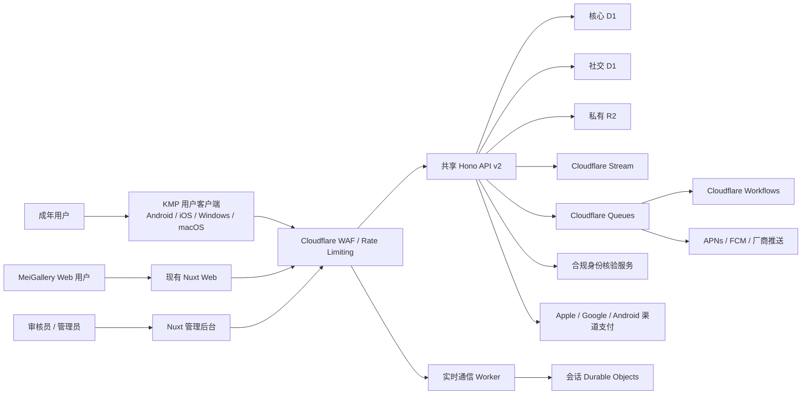
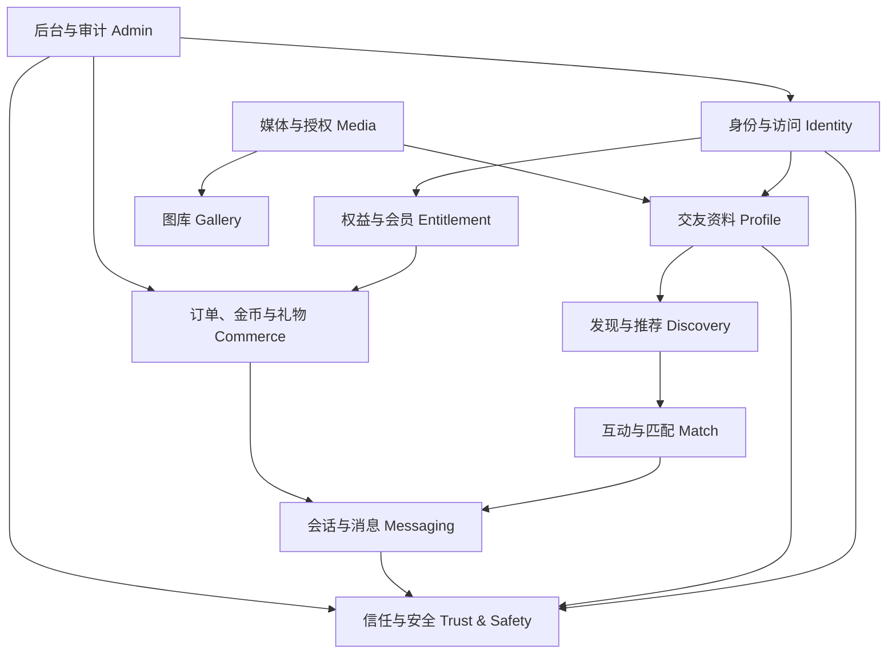
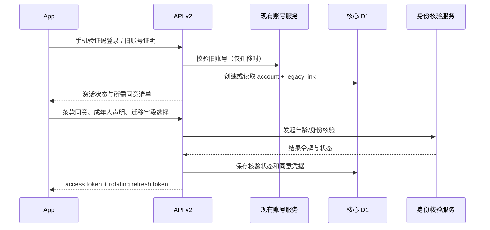
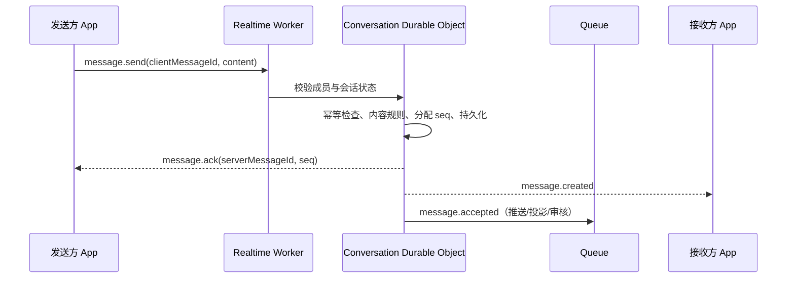
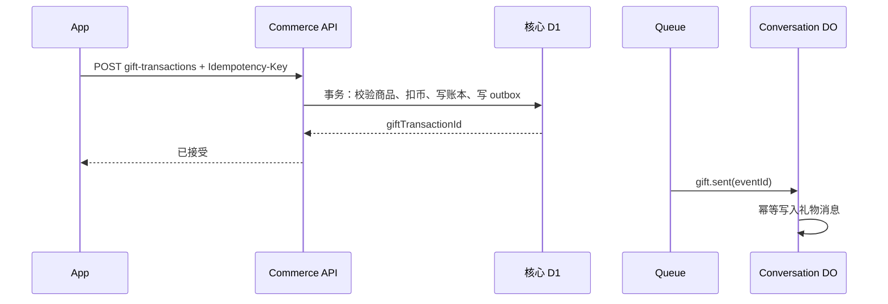

# 独立交友 App 与共享业务平台技术架构方案

版本：1.1（目标架构）

日期：2026-07-20
状态：`[已确认方向 / 目标设计 / 迁移设计]`

## 1. 架构目标

目标不是在现有图库 API 中追加一组聊天表，而是建立一个可同时服务独立移动/桌面客户端与 MeiGallery Web 的共享业务平台，并让现有 Web 在不停止服务的前提下逐步迁移。

架构必须满足：

- Android、iOS、Windows、macOS、Web 和后台通过版本化契约访问数据，不直接读取数据库。
- 身份、权益、媒体、标签和管理员能力成为共享核心。
- 图库域与交友域保持独立，不能把 Gallery 当作 User Profile。
- 实时消息在单会话内强顺序、可补拉、可幂等重试。
- 支付账本、匹配关系、消息事件和迁移任务可审计、可恢复。
- Cloudflare 是主要运行时和基础设施；APNs、FCM、应用商店支付和合规身份服务属于平台必需的外部集成。

## 2. 关键技术决策

| 决策 | 选择 | 原因 |
|------|------|------|
| 用户客户端 | Kotlin Multiplatform + Compose Multiplatform | 首期覆盖 iOS/Android，后续复用业务核心和大部分 UI 到 Windows/macOS；详见 [ADR-0001](../adr/adr-0001-kmp-compose-multiplatform-client.md) |
| 客户端构建 | Gradle + Xcode + GitHub Actions；按目标平台使用 macOS/Windows runner | 保留原生支付、推送、深链、签名、notarization 和合规 SDK 的控制权 |
| 跨语言契约 | OpenAPI + JSON Schema + WebSocket event schema | Kotlin 与 TypeScript 分别生成/校验模型，避免把 `@meigallery/shared` 源码当成跨语言协议 |
| API | Hono on Cloudflare Workers，新增 `/api/v2` | 延续现有团队能力，同时用版本边界隔离旧契约 |
| 实时通信 | Durable Objects + Hibernation WebSocket API | 以会话作为协调原子，提供有序广播、连接状态和闲置休眠 |
| 核心事务数据 | Cloudflare D1，按核心域和社交域分库 | 避免现有图库表与新社交/支付表继续耦合 |
| 私有媒体 | Cloudflare R2；视频后续使用 Cloudflare Stream signed token | 保持授权访问，避免暴露原始对象地址 |
| 异步任务 | Cloudflare Queues + Workflows | Queues 处理事件投递，Workflows 处理迁移、注销、审核和对账等长流程 |
| 人机验证 | Cloudflare Turnstile WebView + 服务端 Siteverify | 适配原生 App，并保留当前服务端验证模型 |
| 推送 | APNs、FCM；中国 Android 厂商推送作为适配器 | 操作系统级推送不可由 Cloudflare 替代 |
| 支付 | StoreKit 2、Google Play Billing 和经目标渠道批准的 Android 商店支付适配器 | 数字权益、虚拟币和交友订阅必须遵循分发渠道规则 |

技术版本只在实施计划阶段锁定。目标架构以能力和接口为约束，不以当前依赖的小版本作为长期契约。

## 3. 系统上下文



## 4. 目标部署单元

### 4.1 客户端

| 单元 | 目标职责 |
|------|----------|
| `clients/app-kmp` | 独立 Gradle 工程；KMP 共享业务核心、Compose Multiplatform UI、平台入口与适配器 |
| `packages/web` | 现有 Nuxt Web；迁移期继续消费 v1，按能力切换 v2 |
| `contracts` | OpenAPI、JSON Schema、WebSocket event schema 与兼容策略；作为 Kotlin/TypeScript 的唯一跨语言契约源 |
| `packages/shared` | Web/API 的 TypeScript 类型、错误码、权限常量和纯函数；不得被描述为 KMP 可直接导入的源码 |

`clients/app-kmp` 和 `contracts` 是未来实施建议路径，本阶段不创建目录。KMP 工程不加入 pnpm workspace；仓库级脚本和 CI 分别编排 pnpm 与 Gradle。

### 4.2 KMP 客户端分层

```text
clients/app-kmp/
├── composeApp/
│   └── src/
│       ├── commonMain/   领域、用例、状态、契约客户端、共享 UI
│       ├── androidMain/  Android 入口与平台适配器
│       ├── iosMain/      iOS 入口与平台适配器
│       └── desktopMain/  Windows/macOS 公共桌面能力
├── iosApp/               Xcode 工程、签名与 Apple 平台配置
├── desktopApp/           桌面入口、菜单、窗口、通知与打包
└── gradle/               版本目录、构建约束与依赖校验
```

共享边界遵循以下规则：

- `commonMain` 包含领域模型、用例、API/WebSocket、状态管理、错误映射、离线 outbox、设计 token 和可复用页面。
- 平台 source set 实现安全存储、推送、支付、相机/相册、定位、身份 SDK、深链和系统通知等端口。
- iOS 或桌面需要明显不同的系统体验时允许平台专属 UI，不以追求共享率牺牲可用性、无障碍或商店合规。
- 共享模块只消费生成的 Kotlin 契约，不手工复制 TypeScript DTO；契约变化先通过兼容检查再生成客户端。

| 能力 | 共享层职责 | 平台适配职责 |
|------|------------|--------------|
| 认证 | token 状态机、刷新与远程登出 | Keychain/Keystore/OS credential store、Apple/Google 登录 |
| 实时消息 | ticket、重连、补拉、幂等和离线 outbox | 网络状态、后台限制、系统通知 |
| 商业化 | 商品、权益、钱包和服务端验证状态 | StoreKit、Play Billing、桌面分发渠道支付 |
| 媒体与权限 | 上传流程、压缩规则、授权状态 | 相机、相册、文件选择器、定位和权限提示 |
| 桌面体验 | 共享页面与状态 | 多窗口、菜单、快捷键、托盘、通知、签名和自动更新 |

### 4.3 服务端

| 部署单元 | 职责 | 首阶段策略 |
|----------|------|------------|
| `meigallery-api` | 现有 v1 + 新增 v2 共享 API | 保持一个 Worker，按模块和路由边界隔离，避免过早拆服务 |
| `meigallery-realtime` | WebSocket、会话路由、在线状态和消息协调 | 独立 Worker + Durable Objects |
| Queue consumers | 推送、通知、内容任务、领域事件投影 | 按风险和凭证边界拆 consumer |
| Workflows | 账号迁移、数据导出、注销、退款对账、批量审核 | 与 API 解耦的长任务 |

只有当单个 Worker 的发布风险、权限边界或容量数据证明需要拆分时，才把 v2 API 再拆为 identity/social/commerce Workers。对外契约不因内部拆分改变。

## 5. 领域边界



### 5.1 身份与访问

- 统一内部 `account_id` 是不可枚举的稳定 ID；现有整数 `users.id` 只作为 legacy key。
- Web cookie session 与 App token session 分离，但归属于同一账号。
- 用户客户端使用短期 access token、轮换 refresh token 和平台安全凭据存储；移动端使用 Keychain/Keystore，桌面端使用操作系统 credential store；服务端只保存刷新令牌哈希。
- 管理员身份使用独立 audience、MFA 和更短会话，不允许 App token 访问后台。

### 5.2 权益与会员

- 共享核心把当前 `membership_levels.rank` 和 `user_memberships` 转换为统一 entitlement 视图。
- 新业务判断能力代码，例如 `chat.daily_intro.limit`、`visitor_history.days`，而不是判断 `vip` 字符串。
- 现有手动发放会员和未来商店订阅作为不同 grant source，共同投影成有效权益。

### 5.3 交友资料、发现和匹配

- Profile 是用户主动创建并授权的独立聚合，不从 Gallery 自动派生。
- Discovery 只消费资料公开投影和安全状态，不读取身份证明文或聊天内容。
- Match 服务拥有喜欢、招呼、匹配、解除匹配和拉黑后的可见性规则。

### 5.4 消息

- 一个 Durable Object 对应一个 conversation，负责序号分配、消息接受、WebSocket 广播和短期状态。
- SQLite-backed Durable Object Storage 保存消息权威副本；D1 保存会话列表、成员状态、未读计数和审核索引投影。
- 重要状态必须落盘，不能依赖 Durable Object 内存；休眠或部署重启后可恢复。
- 首版不承诺端到端加密。传输与存储加密、最小权限访问、举报证据审计必须在隐私政策中透明说明。

### 5.5 商业化

- 商店订单、权益 grant、金币账本位于核心 D1，同一财务操作在单库事务中落地。
- 礼物扣币成功后通过 outbox/Queue 发布 `gift.sent`，消息域按事件 ID 幂等展示。
- 不使用跨 D1 分布式事务；所有跨域流程采用“本地事务 + outbox + 幂等消费者 + 可补偿”。

## 6. 数据分层

### 6.1 数据存储职责

| 存储 | 权威数据 |
|------|----------|
| 现有 `meigallery-db` | 迁移期内的旧用户、旧会员、图库、媒体、标签和旧后台事实 |
| 核心 D1 | 统一账号、身份状态、同意记录、角色、权益、商品、订单、钱包账本和审计 |
| 社交 D1 | 资料、公开投影、偏好、互动、匹配、举报、审核、会话索引和迁移映射 |
| Durable Object SQLite | 单会话消息、顺序号、连接和消息幂等键 |
| R2 | 私有图片原件、审核证据、数据导出和迁移报告 |
| Stream | 后续视频资料和通话外的视频内容；必须启用 signed URL |

### 6.2 标识符规则

- 外部资源使用 ULID 或等价的不可枚举字符串 ID。
- 数据库内部可以使用整数主键，但不得直接暴露为用户公开 ID。
- 每个创建/支付/消息接口都接受 `Idempotency-Key`。
- 事件使用全局唯一 `event_id`、`event_type`、`schema_version`、`occurred_at` 和 `aggregate_version`。

### 6.3 时间与删除

- 服务端时间统一为 UTC ISO 8601；客户端按用户时区显示。
- 软删除只用于恢复窗口和审核证据，不能代替最终删除。
- 法定或安全留存数据与业务可见数据物理或逻辑隔离，达到期限后由 Workflow 删除。

## 7. 关键流程

### 7.1 App 登录与现有账号绑定



### 7.2 发送消息



### 7.3 发送虚拟礼物



## 8. 一致性与失败策略

### 8.1 一致性分类

| 场景 | 一致性要求 | 方案 |
|------|------------|------|
| 金币扣减、退款、权益 | 强一致 | 核心 D1 单事务 + 唯一幂等键 |
| 单会话消息顺序 | 强一致 | 单 conversation Durable Object 分配序号 |
| 匹配创建 | 单聚合强一致 | 社交 D1 条件更新 + 唯一组合键 |
| 会话列表、未读数 | 最终一致 | Queue 投影，可按会话权威序号纠正 |
| 推送 | 至少一次 | 幂等通知记录、过期时间和退避重试 |
| 推荐候选 | 最终一致 | 公开资料投影 + 短缓存，安全状态优先实时校验 |

### 8.2 失败处理

- 客户端网络重试必须复用原幂等键。
- Queue 消费失败进入有限重试和 DLQ；后台可查看、重放和审计。
- Workflows 每个步骤定义重试、安全重入和人工介入点。
- 推送失败不回滚已接受消息。
- 消息投影失败不丢消息，客户端可直接按 DO 权威序号补拉。
- 礼物消息投影失败不回滚扣币；必须自动重放，长期失败转人工工单。

## 9. 缓存与离线

- 客户端本地只缓存公开资料缩略图、会话索引和最近消息；令牌进入 Keychain/Keystore/OS credential store。
- 身份材料、精确位置、审核证据和完整支付回执不得写入普通异步存储。
- 发现流可短缓存候选 ID，但展示前重新应用拉黑、封禁和可发现状态。
- 离线发送进入本地 outbox，网络恢复时按原 `clientMessageId` 重试。
- 用户退出或账号被远程登出时清除本地敏感缓存。
- KMP 数据层只能通过抽象存储端口访问本地持久化；桌面文件系统路径、移动数据库和备份排除策略由平台实现负责。

## 10. 安全架构

- WAF 和 Cloudflare Rate Limiting Rules 作为边缘强限流；Worker 内限流只作兜底。
- 所有对象级访问执行服务端授权，客户端传入的 `userId` 不作为权限依据。
- R2 原件私有；下载由 Worker 代理或签发短期、用途受限凭证。
- Stream 视频启用 `requireSignedURLs`，播放前校验资料可见性和会话权限。
- 管理员、商店密钥、身份核验和推送凭证按独立 Worker/secret 边界隔离。
- 管理后台启用 MFA、IP/设备风险控制、敏感字段按角色脱敏。
- 日志禁止包含 access token、refresh token、短信验证码、完整身份证号、精确位置、私聊正文和商店原始凭证。

## 11. 可观测性

统一关联字段：

- `request_id`：单次 HTTP 请求。
- `trace_id`：跨 Worker/Queue/Workflow 链路。
- `event_id`：领域事件唯一标识。
- `account_id_hash`：仅用于运维关联的不可逆标识。
- `conversation_id`、`order_id`：按权限记录，不附带消息正文或支付明文。

核心告警：登录失败异常、消息接受失败、Queue/DLQ 堆积、账本不平衡、商店回调验证失败、举报 SLA 超时、身份核验服务异常、数据删除 Workflow 失败。

## 12. 部署与环境

| 环境 | 用途 | 数据规则 |
|------|------|----------|
| local | 单元和本地集成 | 全部合成数据，禁止真实身份和支付凭证 |
| dev | 联调和演示 | 独立 D1/R2/DO namespace；支付、身份和推送使用 sandbox |
| staging | 商店前验收和迁移演练 | 脱敏迁移样本；生产等价配置，不接收真实付费 |
| production | 正式服务 | 独立资源、密钥、WAF 和审计；变更经 release 门禁 |

Web、移动客户端和桌面客户端可独立发布，API 对所有仍受支持的客户端至少维持一个兼容窗口。破坏性 API 变更只能进入新主版本；`X-Client-Platform` 与版本门禁按平台分别配置。

客户端 CI 至少包含：

- `commonTest`、契约生成差异检查和共享 Compose UI 测试。
- Android 编译/单元测试与目标设备测试，iOS 模拟器编译/测试。
- macOS arm64 构建与签名预检，Windows x86-64 构建与安装包冒烟。
- 发布前的 Apple 签名/notarization、Windows 代码签名、商店凭证和自动更新源隔离。

## 13. 演进阶段

### 阶段 A：共享身份与兼容层

- 创建 v2 身份、同意和 entitlement 视图。
- 为现有用户生成稳定 `account_id` 和 legacy link。
- Web 继续使用 v1；App 只使用 v2。

### 阶段 B：移动社交核心与实时消息

- 上线资料、审核、发现、匹配、举报和 Durable Objects 会话。
- Android/iOS 客户端封闭内测；现有 Web 不展示交友数据。

### 阶段 C：商业化与公开发布

- 上线商店支付、账本、推送、对账和退款。
- 完成商店、备案、隐私、安全和内容审核门禁。

### 阶段 D：用户桌面客户端

- 在共享核心和移动端业务稳定后启用 Windows/macOS target。
- 首批复用登录、发现、匹配、聊天、安全中心和设备管理；桌面支付是否开放按分发渠道单独决策。
- 完成键盘导航、多窗口、通知、系统凭据存储、代码签名、notarization、增量更新和回滚演练。

### 阶段 E：Web 迁移

- Web 的账号、会员、媒体和后台按模块切换到 v2。
- v1 进入只读兼容期，完成流量对账后退役旧表和旧会话。

阶段 D 与阶段 E 在阶段 B/C 的共享平台稳定后可以并行，不要求为了桌面端延后现有 Web 迁移。

## 14. 架构治理

- 每个领域必须定义 owner、API、权威存储、事件和失败补偿。
- KMP `commonMain` 不得直接依赖平台 SDK；平台能力必须通过明确端口和 source set 适配。
- 不以代码共享率作为架构目标；平台安全、无障碍和用户体验优先于共享 UI。
- 禁止跨领域直接写表；读模型也必须通过版本化模块接口或投影。
- 跨域事件先写 outbox，再异步发布，禁止“先写库再裸发 Queue”。
- 账本和审计表只能追加或冲正，不允许静默覆盖历史。
- 所有新管理员写接口必须有授权测试和审计断言。
- 所有精确位置、身份结果和私聊证据访问都要记录目的和访问者。

## 15. 已核对的官方能力

- Kotlin Multiplatform 核心以及 Compose Multiplatform 的 Android、iOS 和 Desktop（JVM）目标已为 Stable；Web UI 目标仍为 Beta：[KMP 支持平台与稳定性](https://kotlinlang.org/docs/multiplatform/supported-platforms.html)。
- Google 正式支持 KMP 共享 Android/iOS 业务逻辑，Compose Multiplatform 可进一步共享 UI：[Android Developers Kotlin Multiplatform](https://developer.android.com/kotlin/multiplatform)。
- Compose Multiplatform 允许在 Android、iOS、desktop 和 web 使用公共 Compose API，但仍存在平台专属组件和 API：[Compose Multiplatform 与 Jetpack Compose](https://kotlinlang.org/docs/multiplatform/compose-multiplatform-and-jetpack-compose.html)。
- Durable Objects 可作为 WebSocket 服务端，Hibernation API 允许闲置时休眠且保持连接；重要状态必须持久化：[Use WebSockets](https://developers.cloudflare.com/durable-objects/best-practices/websockets/)。
- Cloudflare 建议新的 Durable Objects namespace 使用 SQLite storage，并提供事务性、强一致的对象私有存储：[Access Durable Objects Storage](https://developers.cloudflare.com/durable-objects/best-practices/access-durable-objects-storage/)。
- Workflows 支持持久化多步骤执行、自动重试和外部事件等待：[Cloudflare Workflows](https://developers.cloudflare.com/workflows/)。
- D1 Time Travel 默认启用，可恢复最近 30 天内的数据库状态，但生产迁移仍需独立导出和恢复演练：[D1 Time Travel](https://developers.cloudflare.com/d1/reference/time-travel/)。
- 原生 App 中 Turnstile 需要通过 WebView 运行，服务端 Siteverify 仍是强制要求：[Turnstile mobile implementation](https://developers.cloudflare.com/turnstile/get-started/mobile-implementation/)。
- 私有 Stream 视频应启用 signed URL/token：[Secure your Stream](https://developers.cloudflare.com/stream/viewing-videos/securing-your-stream/)。

## 16. 上线架构硬门槛

- 未完成中国大陆数据驻留、跨境传输、Cloudflare 资源位置和身份数据处理的书面评估，不面向中国大陆公开上线。
- 未完成身份核验、支付和内容审核供应商的数据处理协议与安全评估，不接入生产数据。
- 未完成消息补拉、账本幂等、举报拉黑即时生效和注销全链路演练，不开放公测。
- 未完成生产 D1/R2/DO 的备份、导出、恢复和回滚演练，不迁移现有主数据。
- 未完成各客户端平台的安全存储、推送/通知、签名、更新、无障碍和远程停用演练，不发布相应平台安装包。
