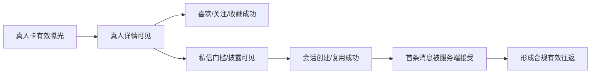

# App 1.0 统一 UI 状态、文案与埋点目录

App 版本：1.0

日期：2026-07-20

状态：需求讨论中

文档类型：Reference

## 1. 文档目的

本文为 Android/iOS App 和 Nuxt 管理后台提供统一的状态代码、用户文案、错误映射、反馈模式、组件状态和埋点事件。产品、设计、KMP、Nuxt、API、测试、客服和运营应引用本文中的 `stateKey`、`copyKey` 与 `eventKey`，避免同一事实在不同页面出现相反表述。

关联文档：

- [移动端页面与交互规格](./MOBILE_APP_INTERACTION_SPEC.md)
- [Nuxt 管理后台交互与低保真规格](./ADMIN_CONSOLE_INTERACTION_SPEC.md)
- [UI/UX 设计总纲](./UI_UX_DESIGN.md)
- [API 与实时通信契约](./API_AND_REALTIME_CONTRACT.md)
- [信任、安全、隐私与合规](./TRUST_SAFETY_PRIVACY_COMPLIANCE.md)

本文中的中文是 App 1.0 基准文案。实现时可通过版本化文案目录本地化，但不能改变事实含义、弱化限制或扩大权限。

## 2. 命名与治理规则

### 2.1 三类稳定标识

| 标识 | 格式 | 用途 | 示例 |
|------|------|------|------|
| `stateKey` | `ui.domain.state` | 页面/组件状态和测试断言 | `ui.entitlement.required` |
| `copyKey` | `copy.domain.purpose` | 本地化和文案审核 | `copy.operation.managed.full` |
| `eventKey` | `domain_object_action` | 产品/后台分析事件 | `messaging_conversation_created` |

- key 发布后不复用旧含义；文案修改通过文案版本记录。
- 展示名称、颜色和中文文案不得作为权限或状态判断条件。
- 未知 key 安全降级：未知状态进入通用不可执行状态，未知文案使用审核过的通用说明，未知事件不影响业务。

### 2.2 文案占位符

- 使用 `{displayName}`、`{date}`、`{time}`、`{count}`、`{limit}`、`{remaining}`、`{resetsAt}`、`{amount}` 等具名占位符。
- 未取得真实值时不能把占位符原样展示；改用不依赖该值的安全文案。
- 私信正文、内部备注、完整登录标识、证件和访问凭证不得作为通知或分析占位符。

## 3. 全局状态目录

### 3.1 页面状态优先级

同一页面出现多个条件时按以下优先级决定主状态：

```text
账号/安全撤权
→ 客户端能力或强制升级
→ 对象不存在/下架/无对象权限
→ entitlement/额度/业务状态限制
→ 网络/数据新鲜度
→ 加载/空/正常内容
```

高优先级状态不能被缓存内容、乐观状态或低优先级 Toast 覆盖。

### 3.2 状态参考

| stateKey | 触发条件 | 页面呈现 | 主操作 |
|----------|----------|----------|--------|
| `ui.loading.initial` | 首次无可用数据 | 与最终布局一致的骨架 | 无 |
| `ui.loading.refresh` | 已有内容刷新 | 保留内容，显示非阻断刷新 | 允许取消/继续浏览 |
| `ui.loading.pagination` | 加载下一页 | 列表尾部加载 | 失败后重试 |
| `ui.empty.first_use` | 从未产生对象 | 解释用途和首个安全动作 | 进入发现/创建允许对象 |
| `ui.empty.filtered` | 筛选后无结果 | 展示已应用条件 | 清空/修改筛选 |
| `ui.offline.cached` | 离线且有缓存 | 离线横幅、最后同步时间、只读内容 | 重试 |
| `ui.offline.no_data` | 离线且无缓存 | 说明需要联网 | 重试/帮助 |
| `ui.error.network` | 可重试网络失败 | 保留安全上下文，不显示成功 | 重试 |
| `ui.error.server` | 可恢复服务错误 | 通用说明和 Request ID | 重试/帮助 |
| `ui.error.conflict` | 版本/并发冲突 | 展示状态已变化 | 刷新最新版本 |
| `ui.error.rate_limited` | 触发频控 | 安全重试时间，不公开阈值 | 到时重试 |
| `ui.auth.required` | 未登录 | 说明登录目的并保留回跳 | 登录 |
| `ui.auth.expired` | 会话失效/设备撤销 | 清理私有状态 | 重新登录 |
| `ui.account.restricted` | 账号/资格/安全受限 | 原因类别、范围、申诉 | 查看说明/申诉 |
| `ui.object.unavailable` | 下架、归档或无对象权限 | 不泄露内部状态 | 返回/帮助 |
| `ui.entitlement.required` | 缺少所需 entitlement | 权益价值、获取方式、限制 | 查看心享会员 |
| `ui.entitlement.expired` | 会员到期 | 当前失效能力和历史可见范围 | 查看会员/帮助 |
| `ui.quota.exhausted` | 周期额度耗尽 | 额度名、重置时间 | 返回/查看权益 |
| `ui.moderation.pending` | 内容等待审核 | “审核中”，不显示送达 | 查看规则 |
| `ui.moderation.restricted` | 内容/会话被限制 | 可见范围和下一步 | 修改内容/申诉 |
| `ui.app.upgrade_required` | capability 不兼容 | 为什么需要升级 | 更新 App/返回 |
| `ui.service.maintenance` | 服务维护/关键降级 | 影响范围和可用只读能力 | 重试/帮助 |
| `ui.data.delayed` | 后台指标/任务延迟 | 未知/延迟和最后更新时间 | 刷新/查看异常 |

### 3.3 空状态规则

| 场景 | 正确方向 | 禁止方向 |
|------|----------|----------|
| 推荐无内容 | “暂时没有符合条件的真人资料” | “没有人喜欢你” |
| 未关注 | “关注感兴趣的真人后，可在这里查看更新” | “快去匹配” |
| 无会话 | “开通相应会员权益后，可从真人详情发起私信” | “还没有人找你聊天” |
| 无通知 | “暂时没有此类站内通知” | “你错过了消息” |
| 无金币分录 | “暂时没有金币变动记录” | “充值后查看记录” |
| 后台无任务 | “尚未创建任务” | 用 `0` 冒充数据延迟结果 |

## 4. API 错误到 UI 状态映射

客户端优先使用稳定错误码和安全 details，不解析服务端自然语言判断逻辑。

| API 错误码 | stateKey | 用户标题 | 建议操作 | 禁止事项 |
|------------|----------|----------|----------|----------|
| `AUTH_REQUIRED` | `ui.auth.required/expired` | 需要登录 / 登录已失效 | 登录并安全回跳 | 保留私有页面可操作状态 |
| `ACCOUNT_RESTRICTED` | `ui.account.restricted` | 当前账号部分功能受限 | 查看说明/申诉 | 暴露内部风控规则 |
| `ENTITLEMENT_REQUIRED` | `ui.entitlement.required` | 当前账号没有此项权益 | 查看心享会员 | 显示“立即购买” |
| `ENTITLEMENT_QUOTA_EXCEEDED` | `ui.quota.exhausted` | 本周期额度已用完 | 显示 `{resetsAt}` | 称为系统故障 |
| `PROFILE_NOT_AVAILABLE` | `ui.object.unavailable` | 该真人资料当前不可访问 | 返回推荐 | 泄露暂停/争议内部原因 |
| `CONVERSATION_FORBIDDEN` | `ui.moderation.restricted` | 当前会话不可继续操作 | 查看会话状态/帮助 | 自动重开或重发 |
| `CONTENT_REVIEW_PENDING` | `ui.moderation.pending` | 消息正在审核 | 等待结果 | 显示已送达 |
| `INSUFFICIENT_COINS` | `ui.entitlement.required` | 金币余额不足 | 返回钱包 | App 1.0 显示充值入口 |
| `PRODUCT_NOT_AVAILABLE` | `ui.object.unavailable` | 当前内容暂不可用 | 返回 | App 1.0 引导未来商品 |
| `IDEMPOTENCY_CONFLICT` | `ui.error.conflict` | 请求内容与原操作不一致 | 刷新结果/重新发起 | 自动换 key 重复提交 |
| `APP_UPGRADE_REQUIRED` | `ui.app.upgrade_required` | 需要更新 App | 更新/返回 | 远程执行未知能力 |
| `RATE_LIMITED` | `ui.error.rate_limited` | 操作过于频繁 | 按安全时间重试 | 展示风控阈值 |
| `PRIVACY_REQUEST_IN_PROGRESS` | `ui.error.conflict` | 已有同类请求正在处理 | 查看进度 | 重复创建任务 |
| `TAXONOMY_VERSION_CONFLICT` | `ui.error.conflict` | 分类目录已更新 | 刷新条件 | 静默使用失效 term |
| `MODERATION_RESTRICTED` | `ui.moderation.restricted` | 此操作因安全规则受限 | 查看说明/申诉 | 暴露命中规则细节 |
| `CURSOR_EXPIRED` | `ui.error.conflict` | 内容列表已更新 | 从顶部刷新 | 拼接不同规则版本列表 |

HTTP 超时、DNS 和无连接映射网络状态；未知 4xx/5xx 使用安全通用错误并记录 Request ID，不能直接展示内部错误正文。

## 5. 反馈组件目录

| 组件 | 适用 | 持续时间/关闭 | 不适用 |
|------|------|---------------|--------|
| Inline Error | 字段校验、对象局部失败 | 修正后消失 | 全局账号撤权 |
| Banner | 离线、数据延迟、只读、同步状态 | 状态恢复后消失 | 一次性轻操作成功 |
| Snackbar/Toast | 喜欢、关注、收藏等可逆结果 | 短时，必要时撤销 | 会员发放、调币、消息送达等权威结果 |
| Empty State | 列表首次/筛选为空 | 直到条件变化 | 网络错误 |
| Restricted State | entitlement、拉黑、安全或下架 | 直到服务端状态变化 | 普通加载 |
| Dialog | 不可逆/高风险最终确认 | 用户明确选择 | 复杂表单和详细影响预览 |
| Progress Page | 导入、导出、注销、批量和迁移 | 可离开后返回 | 伪造百分比的短操作 |

喜欢、关注、收藏允许乐观反馈并在失败时回滚；消息送达、会员生效、调币、钱包余额、审核和数据权利任务不允许仅靠 Toast 宣称成功。

## 6. 写作语气

### 6.1 基本规则

- 使用事实、当前状态和下一步，避免暧昧、诱导和关系结果承诺。
- 统一称“真人资料”“观看者”“平台运营”“心享会员”“金币明细”。
- 代运营场景不使用“她回复了”“对方在线”“对方已读”。
- 认证不写“绝对真实”；使用“资料与授权已由平台审核”。
- 会员不写“无限畅聊”“尊贵身份”；写具体可执行权益和额度。
- 后台按钮描述动作和阶段，例如“提交发布审核”“批准调币申请”，不用“确定”。

### 6.2 失败文案四要素

失败文案按适用性回答：

1. 发生了什么。
2. 哪些事实没有发生（例如未创建会话、未改变余额）。
3. 是否可以重试以及何时重试。
4. 下一步或帮助入口。

不得向用户展示数据库表、Worker、Queue、策略阈值、操作员 ID 或内部错误堆栈。

## 7. 核心前台文案目录

### 7.1 品牌、真人与认证

| copyKey | 基准文案 | 使用位置 |
|---------|----------|----------|
| `copy.brand.positioning` | 经认证的真人发现与互动平台 | 启动、登录、关于 |
| `copy.discovery.reason.followed_style` | 因为你关注了「{tagName}」风格 | 推荐理由 |
| `copy.discovery.reason.popular` | 近期受到更多关注 | 推荐理由 |
| `copy.person.verified.badge` | 真人资料已认证 | 认证徽章无障碍名称 |
| `copy.person.verified.explain` | 该资料的主体信息与展示授权已由平台按当前规则审核。认证不代表平台对所有内容或互动结果作保证。 | 认证说明 |
| `copy.person.region.approximate` | 地区为城市或模糊范围，不代表实时位置 | 地区说明 |
| `copy.person.unavailable` | 该真人资料当前不可访问 | 下架安全状态 |

### 7.2 平台代运营披露

| copyKey | 基准文案 | 使用位置 |
|---------|----------|----------|
| `copy.operation.managed.short` | 由平台运营接收和回复 | 详情、会话列表标签 |
| `copy.operation.managed.receiver` | 平台运营接收 | 会话顶部 |
| `copy.operation.managed.full` | 当前真人尚未认领此资料。你发送的消息由平台运营人员接收和回复，不代表真人本人已查看或回复。 | 服务说明卡、详情说明 |
| `copy.operation.managed.confirm_title` | 开始私信前请确认 | 建会话确认标题 |
| `copy.operation.managed.confirm_action` | 知道了，开始私信 | 有资格会员的确认按钮 |
| `copy.operation.managed.read` | 平台运营已读 | 实际回执 |
| `copy.operation.managed.no_guarantee` | 会员权益不保证回复时间、本人回复或关系结果 | 私信入口、会员页 |

“知道了，开始私信”只在服务端已确认会员和额度时出现；无资格时使用会员门槛文案。

### 7.3 私信、消息和状态

| copyKey | 基准文案 | 使用位置 |
|---------|----------|----------|
| `copy.dm.entitlement_required.title` | 当前账号没有私信权益 | Entitlement Gate |
| `copy.dm.entitlement_required.body` | 有效心享会员可以向真人资料创建和发送私信。消息由平台运营接收和回复。 | Entitlement Gate |
| `copy.dm.entitlement_required.action` | 查看心享会员 | 主操作 |
| `copy.dm.quota_exhausted` | 本周期新会话额度已用完，将于 {resetsAt} 重置 | 建会话失败 |
| `copy.dm.member_expired` | 心享会员已到期。历史会话仍可查看，暂时不能发送新消息。 | 会话只读条 |
| `copy.dm.conversation_closed` | 此会话已关闭，不能继续发送消息 | 会话状态 |
| `copy.dm.blocked` | 你已拉黑该真人资料，互动和私信已停止 | 拉黑后状态 |
| `copy.message.input.placeholder` | 输入消息… | 输入框 |
| `copy.message.status.sending` | 发送中 | 本地已提交 |
| `copy.message.status.review_pending` | 审核中 | 等待内容审核 |
| `copy.message.status.accepted` | 已发送 | 服务端接受 |
| `copy.message.status.delivered` | 已送达平台 | 平台接收成功 |
| `copy.message.status.read` | 平台运营已读 | 实际读取回执 |
| `copy.message.status.failed` | 发送失败，未送达 | 可重试失败 |
| `copy.message.status.rejected` | 此消息未通过安全检查，未送达 | 审核拒绝 |
| `copy.message.status.recalled` | 你撤回了一条消息 | tombstone |

### 7.4 互动

| copyKey | 基准文案 | 禁止替代 |
|---------|----------|----------|
| `copy.interaction.like.added` | 已喜欢 | “对方知道了” |
| `copy.interaction.follow.added` | 已关注，可在关注页查看更新 | “配对成功” |
| `copy.interaction.favorite.added` | 已收藏 | “加入心愿对象” |
| `copy.interaction.removed` | 已取消{interactionName} | 关系结果暗示 |
| `copy.interaction.block_impact` | 拉黑后，该真人资料将从推荐中移除，现有互动和私信停止；解除拉黑不会自动恢复。 | 模糊“屏蔽即可” |

### 7.5 心享会员

| copyKey | 基准文案 | 使用位置 |
|---------|----------|----------|
| `copy.membership.acquisition` | 当前会员由平台审核后发放 | 五级目录 |
| `copy.membership.active_until` | 当前等级：{tierName}，有效至 {date} | 当前权益 |
| `copy.membership.scheduled` | {tierName} 将于 {date} 生效 | 待生效 |
| `copy.membership.expiring` | 会员将于 {date} 到期 | 即将到期 |
| `copy.membership.expired` | 会员已到期，当前使用免费权限 | 已到期 |
| `copy.membership.revoked` | 会员权益已结束 | 撤销用户说明 |
| `copy.membership.syncing` | 权益正在同步，受限操作将由服务端重新确认 | 多设备同步 |
| `copy.membership.thread_quota` | 每周期可新建 {limit} 个会话，剩余 {remaining} 个 | 额度 |
| `copy.membership.no_purchase` | App 1.0 暂不提供在线购买、续订或退款 | 获取方式说明 |

五级品牌主文案继续使用 UI/UX 总纲中的心遇、心悦、心知、心契、心耀文案；所有比较项必须展示具体 entitlement 值。

### 7.6 金币与明细

| copyKey | 基准文案 | 使用位置 |
|---------|----------|----------|
| `copy.wallet.balance` | 金币余额 | 钱包标题 |
| `copy.wallet.last_synced` | 更新于 {time} | 缓存/同步 |
| `copy.wallet.rules` | App 1.0 仅展示余额和明细，不支持充值、消费、转账或提现。 | 钱包规则 |
| `copy.wallet.adjustment.credit` | 平台调整 +{amount} 金币 | 加币分录 |
| `copy.wallet.adjustment.debit` | 平台调整 −{amount} 金币 | 扣币分录 |
| `copy.wallet.compensation` | 平台服务补偿 +{amount} 金币 | 补偿分录 |
| `copy.wallet.reversal` | 调整冲正 {signedAmount} 金币 | 冲正分录 |
| `copy.wallet.pending_hidden` | 调整尚未生效，不会改变当前余额 | 仅客服/帮助说明 |
| `copy.wallet.dispute_action` | 对此记录有疑问 | 分录申诉入口 |
| `copy.wallet.maintenance` | 金币数据正在核对，当前显示可能延迟，请以核对完成后的结果为准 | 对账异常 |

### 7.7 通知、隐私和数据权利

| copyKey | 基准文案 | 使用位置 |
|---------|----------|----------|
| `copy.notification.empty` | 暂时没有此类站内通知 | 空状态 |
| `copy.notification.offline` | 当前离线，显示的是上次同步结果 | 离线横幅 |
| `copy.notification.target_unavailable` | 此通知关联的内容当前不可访问 | 通知详情 |
| `copy.notification.system_push_absent` | App 1.0 仅提供站内通知 | 设置帮助 |
| `copy.privacy.personalization` | 允许使用你的地区范围、标签偏好和站内互动改善推荐 | 个性化设置 |
| `copy.privacy.non_personalized` | 关闭后仍可使用热门、最新和分类等非个性化入口 | 关闭说明 |
| `copy.data_export.in_progress` | 数据导出正在准备，可稍后回到此页查看进度 | 导出任务 |
| `copy.data_export.expired` | 下载凭证已过期，请重新验证后获取 | 下载过期 |
| `copy.deletion.impact` | 注销将停止登录并清理或隔离处理账号数据；依法需要保留的数据不会继续用于普通产品功能。 | 注销确认 |

## 8. 后台文案与动作目录

| copyKey | 基准文案 | 说明 |
|---------|----------|------|
| `copy.admin.environment.production` | 生产环境：操作可能立即影响用户 | 全局环境条 |
| `copy.admin.data.delayed` | 数据延迟，以下数值不代表当前实时状态 | 看板质量 |
| `copy.admin.save_draft` | 保存草稿 | 不提交审核 |
| `copy.admin.submit_review` | 提交审核 | 不表示通过 |
| `copy.admin.pending_approval` | 等待独立复核，尚未生效 | 会员/调币 |
| `copy.admin.approve` | 批准申请 | 批准后仍可能执行中 |
| `copy.admin.execution_pending` | 已批准，正在执行 | 不宣称完成 |
| `copy.admin.applied` | 已生效 | 权威业务结果已完成 |
| `copy.admin.reject` | 拒绝申请 | 必填结论 |
| `copy.admin.version_conflict` | 对象已被其他人员更新，请查看最新版本 | 并发冲突 |
| `copy.admin.operator.reply` | 发送平台运营回复 | 消息发送按钮 |
| `copy.admin.operator.note` | 保存内部备注 | 永不发送给用户 |
| `copy.admin.membership.preview` | 预览会员与权益变化 | 发放前 |
| `copy.admin.coin.preview` | 预览余额变化与风险 | 调币前 |
| `copy.admin.coin.no_direct_edit` | 余额只能由新账本分录改变 | 钱包详情 |
| `copy.admin.audit.read_only` | 审计记录只读；修复需从对应业务流程发起新操作 | 审计详情 |
| `copy.admin.export.expiring` | 导出文件含受控数据，将在 {date} 失效 | 导出确认 |

后台用户可见说明与内部备注必须是两个字段。用户说明会进入 App/通知时，应在提交前提供独立预览。

## 9. 确认与危险操作矩阵

| 动作 | 风险 | 前置页面必须展示 | 最终按钮 |
|------|------|------------------|----------|
| 清除浏览/搜索历史 | 中 | 范围、推荐影响、不可恢复 | 清除历史 |
| 拉黑真人 | 高 | 推荐、互动、私信影响，解除不恢复 | 拉黑并停止互动 |
| 关闭会话 | 中 | 新消息停止、重开规则 | 关闭会话 |
| 远程退出设备 | 高 | 设备、最近活动、安全影响 | 退出该设备 |
| 注销账号 | 高 | 数据、会话、会员、任务和保留说明 | 提交注销申请 |
| 发布真人资料 | 高 | 公开字段、媒体、授权、版本和影响入口 | 发布真人资料 |
| 暂停真人资料 | 高 | 撤回推荐、搜索、分享、媒体和新私信 | 暂停公开展示 |
| 发送平台运营回复 | 中 | 发送身份、目标会话、内容审核状态 | 发送平台运营回复 |
| 发放/撤销会员 | 高 | 账号、等级、区间、权益前后差异 | 提交发放/撤销申请 |
| 加币/扣币/冲正 | 高 | 账号、数量、方向、余额前后、风险 | 提交调币/冲正申请 |
| 合并 taxonomy/回滚规则 | 高 | 引用、客户端、推荐和迁移影响 | 提交发布/回滚审核 |
| 导出审计/敏感报表 | 高 | 数据范围、用途、到期、水印 | 提交导出申请 |

危险操作按钮不使用默认主品牌色作为唯一提示；文本必须包含具体动作。

## 10. 埋点通用契约

### 10.1 公共属性

前台与后台事件按适用性携带：

| 字段 | 说明 |
|------|------|
| `eventId` | 客户端/服务端生成的稳定事件 ID，用于防重 |
| `occurredAt` | UTC 事件时间 |
| `screenId` / `pageId` | 本文定义的页面编号 |
| `sessionId` | 当前产品会话，不等于认证 Token |
| `accountIdHash` | 最小化稳定哈希；匿名场景为空 |
| `platform` | android / ios / web-admin |
| `clientVersion` | App 或 Web 构建版本 |
| `entryPoint` | 来源页面/深链/通知/后台任务 |
| `objectType` / `objectId` | 必要业务对象；按敏感级别最小化或哈希 |
| `result` | success / failed / cancelled / suppressed |
| `reasonCode` | 稳定安全原因码，不含自由文本 |
| `requestId` | 与服务端 trace 关联；没有请求时为空 |
| `ruleVersion` | 推荐、目录、模板或策略版本（适用时） |

禁止属性：私信正文、搜索敏感原文、内部备注、证件、授权原件、完整手机号/邮箱、访问令牌、签名 URL、精确位置、完整调币内部原因。

### 10.2 事件触发原则

- 曝光事件只在元素实际进入可见范围并满足统一去重窗口时记录；具体阈值由分析技术方案冻结。
- 点击不等于业务成功；关键操作至少区分 `requested` 和服务端 `succeeded/failed`。
- 重试沿用业务 request/idempotency 关联，不能把一次用户意图统计成多次成功。
- 页面恢复、旋转和 Tab 切换不得制造虚假新会话或重复曝光。
- 后台敏感查询和导出既写产品操作事件，也写不可变审计；分析事件不能替代审计。

## 11. 前台事件目录

| eventKey | Screen ID | 触发时点 | 必要附加属性 |
|----------|-----------|----------|----------------|
| `auth_login_requested` | `APP-AUTH-02` | 用户提交登录 | `provider`, `result` 后续事件关联 |
| `auth_login_completed` | `APP-AUTH-02/04` | 服务端确认结果 | `provider`, `result`, `reasonCode` |
| `onboarding_preferences_saved` | `APP-AUTH-05` | 服务端保存/跳过 | `mode=saved/skipped` |
| `discovery_feed_viewed` | `APP-DSC-01` | 推荐首屏可用 | `feedMode`, `ruleVersion` |
| `person_card_impression` | `APP-DSC-01/INT-*` | 卡片有效曝光 | `profileId`, `reasonCode`, `positionBucket` |
| `discovery_refresh_requested` | `APP-DSC-01` | 用户主动刷新 | `feedMode` |
| `search_submitted` | `APP-DSC-04` | 提交查询 | `queryCategory`, `resultCountBucket`；不传敏感原文 |
| `discovery_filter_applied` | `APP-DSC-05` | 应用筛选 | `termIds`, `filterTier`, `resultCountBucket` |
| `person_profile_viewed` | `APP-DSC-07` | 详情权威内容可见 | `profileId`, `entryPoint` |
| `person_media_access_result` | `APP-DSC-08` | 凭证结果 | `mediaType`, `result`, `reasonCode` |
| `viewer_interaction_requested` | `APP-DSC-07/INT-*` | 喜欢/关注/收藏操作 | `interactionType`, `action=add/remove` |
| `viewer_interaction_completed` | 同上 | 服务端结果 | `interactionType`, `action`, `result` |
| `messaging_gate_viewed` | `APP-MSG-02` | 权益/额度门槛显示 | `requiredEntitlement`, `reasonCode` |
| `messaging_disclosure_viewed` | `APP-DSC-07/MSG-02/03` | 披露实际可见 | `operationMode`, `disclosureVersion`, `placement` |
| `messaging_conversation_requested` | `APP-MSG-02` | 确认创建 | `profileId`, `operationMode` |
| `messaging_conversation_completed` | `APP-MSG-02` | 创建/复用结果 | `result`, `reused`, `reasonCode` |
| `messaging_message_requested` | `APP-MSG-03` | 用户点击发送 | `messageType=text/emoji`, `clientMessageId` |
| `messaging_message_completed` | `APP-MSG-03` | 服务端终态/关键状态 | `status`, `reasonCode`；不含正文 |
| `messaging_conversation_controlled` | `APP-MSG-04` | 静音/关闭/拉黑 | `action`, `result` |
| `membership_catalog_viewed` | `APP-MBR-01` | 五级目录可见 | `catalogVersion`, `currentRank` |
| `membership_tier_viewed` | `APP-MBR-01` | 等级详情有效曝光 | `rank`, `catalogVersion` |
| `membership_entitlements_viewed` | `APP-MBR-02` | 当前权益可见 | `snapshotVersion`, `currentRank` |
| `notification_list_viewed` | `APP-MSG-05` | 分类列表可见 | `category`, `unreadCountBucket` |
| `notification_opened` | `APP-MSG-05/06` | 打开通知 | `category`, `eventType`, `targetState` |
| `notification_preference_changed` | `APP-SET-05` | 服务端保存结果 | `category`, `enabled`, `result` |
| `wallet_viewed` | `APP-WAL-01` | 权威余额可见 | `ledgerVersion`; 不传余额 |
| `wallet_entry_viewed` | `APP-WAL-03` | 分录详情可见 | `entryType`, `direction`, `reasonCode`; 不传数量 |
| `privacy_preference_changed` | `APP-SET-04` | 服务端保存结果 | `purpose`, `enabled`, `policyVersion` |
| `safety_report_completed` | 举报入口 | 举报创建结果 | `targetType`, `reasonCategory`, `result` |
| `data_right_request_created` | `APP-SET-09/10` | 导出/注销任务结果 | `requestType`, `result`, `reasonCode` |

### 11.1 核心漏斗



漏斗按去重观看者和规则版本统计；消费金额和单纯消息数不能替代有效往返。

## 12. 后台事件目录

| eventKey | Page ID | 触发时点 | 必要附加属性 |
|----------|---------|----------|----------------|
| `admin_page_viewed` | 全部 | 页面权威数据可见 | `role`, `scopeType` |
| `admin_filter_applied` | 列表 | 服务端筛选完成 | `filterKeys`, `resultCountBucket` |
| `person_import_submitted` | `ADM-PER-04` | 导入任务创建 | `sourceType`, `itemCountBucket` |
| `person_review_completed` | `ADM-PER-05/06` | 认证/发布结论 | `reviewType`, `decision`, `reasonCode` |
| `taxonomy_release_submitted` | `ADM-TAX-03` | 发布/回滚提交 | `catalogVersion`, `action` |
| `recommendation_rule_submitted` | `ADM-REC-02/03` | 规则发布/回滚提交 | `ruleVersion`, `action`, `result` |
| `managed_conversation_assigned` | `ADM-MSG-01/02` | 分配/转派完成 | `assignmentType`, `result` |
| `managed_message_completed` | `ADM-MSG-02` | 平台消息服务端结果 | `status`, `templateRef`; 不含正文 |
| `moderation_action_completed` | `ADM-SAF-02` | 安全处置完成 | `action`, `severity`, `result` |
| `membership_grant_submitted` | `ADM-MBR-04` | 发放请求创建 | `action`, `rank`, `riskBucket` |
| `membership_grant_reviewed` | `ADM-MBR-05` | 复核结论 | `decision`, `riskBucket` |
| `membership_grant_applied` | 会员后台 | grant 生效 | `action`, `rank`, `source` |
| `coin_adjustment_submitted` | `ADM-WAL-03/05` | 单笔/批量请求创建 | `direction`, `reasonCode`, `riskBucket`；不传数量 |
| `coin_adjustment_reviewed` | `ADM-WAL-04` | 复核结论 | `decision`, `riskBucket` |
| `coin_adjustment_applied` | 钱包后台 | 分录生效 | `direction`, `reasonCode`, `result` |
| `notification_template_submitted` | `ADM-NTF-02` | 模板审核提交 | `eventType`, `templateVersion`, `locale` |
| `audit_query_completed` | `ADM-AUD-01` | 查询完成 | `actionTypes`, `rangeBucket`, `resultCountBucket` |
| `audit_export_requested` | `ADM-AUD-04` | 导出申请 | `scopeType`, `rangeBucket`, `reviewRequired` |
| `incident_status_changed` | `ADM-OV-03` | 异常状态更新 | `severity`, `fromStatus`, `toStatus` |
| `safety_switch_changed` | `ADM-OV-03` | 安全开关结果 | `switchKey`, `action`, `result` |

操作者绩效不得只按消息数、审核数、发放金额或调币总额公开排名。

## 13. 组件状态矩阵

| 组件 | 正常 | 加载 | 空/未知 | 受限/错误 |
|------|------|------|-----------|-----------|
| `PersonCard` | 封面、认证、地区、标签、理由 | 固定比例骨架 | 无封面用审核占位 | 下架不显示可执行互动 |
| `InteractionBar` | 三种独立状态 | 保留当前并显示局部进度 | 未登录提示登录 | 失败回滚 |
| `OperationModeBadge` | 平台运营接收 | 等待服务端状态 | 不显示推断标签 | 未知模式阻止私信 |
| `EntitlementGate` | 所需权益、价值、获取方式 | 等待快照 | 不推断等级 | 显示安全原因和帮助 |
| `MembershipTierCard` | 具体 entitlement 和差异 | 目录骨架 | 无目录显示服务不可用 | 未知能力安全隐藏 |
| `ConversationRow` | 平台标签、摘要、时间、未读 | 列表骨架 | 私信空状态 | 受限/关闭标签 |
| `MessageBubble` | 类型、内容、权威状态 | 本地发送中 | 撤回 tombstone | 失败/拒绝不显示送达 |
| `NotificationRow` | 类别、摘要、时间、未读 | 列表骨架 | 分类空状态 | 目标失效仍可开安全详情 |
| `WalletBalance` | 余额、版本、同步时间 | 不闪现旧值为新值 | 无钱包安全空状态 | 离线/对账只读 |
| `LedgerRow` | 方向、数量、原因、时间 | 分页骨架 | 无分录 | 冲正显示关联，不改原行 |
| `AdminApprovalPanel` | 申请、风险、前后差异 | 重新校验 | 证据不足 | 发起人冲突/已处理不可提交 |
| `AuditTimeline` | 申请到执行关联 | 分页加载 | 关联缺失告警 | 只读且敏感字段脱敏 |

## 14. 审核、版本和测试

### 14.1 变更流程

1. 产品提出 key 新增或文案变更，并关联 Feature requirement。
2. 运营、安全、隐私或财务按内容类别审核事实和风险。
3. 设计确认页面位置、长度、动态字体和无障碍名称。
4. Kotlin/TypeScript 契约与本地化资源同步。
5. 测试验证 key、占位符、错误码、埋点和未知值降级。
6. 服务端文案版本生效并可回滚；权限逻辑不依赖自然语言。

### 14.2 必测项

- 每个 API 错误码映射一个安全 UI 状态和可执行下一步。
- 每个 `copyKey` 占位符齐全，缺值不会显示模板原文。
- 代运营披露在五个指定位置一致，不能被营销文案覆盖。
- 会员到期、资料下架、拉黑和安全冻结的状态优先级高于缓存内容。
- 消息、钱包、会员、调币和审核不通过乐观 Toast 宣称权威成功。
- 事件不包含禁止字段；重试、旋转和恢复不会制造重复成功。
- 后台高风险动作同时产生业务事件与审计，不用分析事件代替审计。
- 大字体、屏幕阅读器和后台 200% 缩放下文案不截断关键事实。

## 15. 验收标准

- **CAT-AC-001**：Given 同一 API 错误发生在不同入口，When 页面展示，Then 使用相同 `stateKey` 和事实一致的 `copyKey`，主操作按页面上下文正确。
- **CAT-AC-002**：Given 平台代运营会话，When 查看详情、建会话、列表和会话，Then 均使用本目录的接收主体文案，不出现真人本人暗示。
- **CAT-AC-003**：Given 会员到期，When 用户进入既有会话，Then 展示只读文案且发送按钮不可用，不显示“系统错误”。
- **CAT-AC-004**：Given 消息等待审核，When 查看气泡，Then 显示“审核中”，不记录或展示已送达/已读。
- **CAT-AC-005**：Given 管理员批准调币，When 分录仍在执行，Then 后台显示“已批准，正在执行”，用户端不显示成功分录。
- **CAT-AC-006**：Given 通知或日志被检查，When 原业务包含私信/证件/内部备注，Then payload、文案和分析属性不含对应敏感正文。
- **CAT-AC-007**：Given 相同业务请求因超时重试，When 统计事件，Then `requested` 可反映重试但权威成功只按业务结果防重统计一次。
- **CAT-AC-008**：Given 后台指标数据延迟，When 页面加载，Then 使用 `ui.data.delayed` 和最后更新时间，不显示为 0。
- **CAT-AC-009**：Given 客户端收到未知状态、文案 key 或 action，When 渲染，Then 安全降级、不崩溃、不执行未知能力且不扩大权限。
- **CAT-AC-010**：Given Future 功能尚未启用，When 检查 App 1.0 文案和事件，Then 不出现支付、充值、系统推送、图片消息、礼物或装扮的可执行引导。
