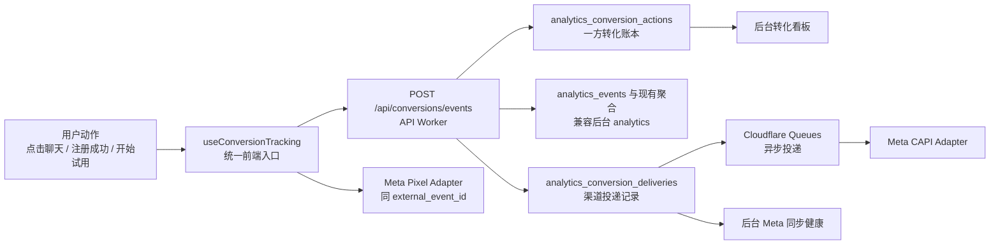

# Meta 归因与转化事件账本设计

状态：历史设计参考。核心架构已实现，生产放行细节由 2026-07-10 Meta 生产就绪设计、`docs/DEPLOYMENT.md`、`docs/GIT_WORKFLOW.md` 和 `docs/TECHNICAL_SPEC.md` 覆盖；本文件保留历史决策，不作为当前部署步骤。

更新时间：2026-07-10（原始设计：2026-07-08）

## 1. 背景

当前站点已经具备三类能力：

- 一方数据分析：`/api/analytics/events` 写入 D1，并在后台 `/admin/analytics` 展示来源、点击、趋势、SEO 和健康数据。
- 推广来源链接：后台可创建 `mg_source`、UTM 链接，用于区分广告版本和渠道来源。
- Meta Pixel：历史方案曾枚举 `PageView`、`ViewContent`、`Search`、`Contact`、`Lead`、`CompleteRegistration`、`StartTrial` 等事件；当前正式 Meta 转化契约仅保留 `Contact`、`Lead`、`CompleteRegistration`，不支持 `StartTrial`。

这三类能力现在是并行接入的。典型问题是业务组件里同时调用一方 analytics 和 Meta Pixel，例如联系方式点击既调用 `useAnalytics()`，又调用 `useFacebookPixel()`。这会导致事件口径分散、`event_id` 无法统一、Meta Pixel 与未来 CAPI 难以去重，后台也容易把 UTM 来源误理解为 Pixel 回传。

本设计的目标是把归因方案重构为一个干净、可维护、可扩展的架构：**站内转化事件账本是唯一事实源，Meta Pixel、Meta Conversions API 和未来广告平台都只是同步渠道**。

## 2. 当前症结

### 2.1 事件所有权分散

当前高价值业务动作的定义散落在多个文件：

- `packages/web/app/components/ContactPanel.vue` 同时触发 Pixel 和站内 analytics。
- `packages/web/app/pages/register.vue` 注册成功后分别触发 Pixel 和站内 analytics。
- `packages/web/app/composables/useFacebookPixel.ts` 内部自行判断 `Lead`、`StartTrial` 去重。
- `packages/web/app/composables/useAnalytics.ts` 每次独立生成站内 `eventId`，无法和 Meta `event_id` 共用。

结果是同一个用户动作没有稳定的业务主键，后续接 CAPI 时只能继续补丁式把 ID 传来传去。

### 2.2 后台口径容易混淆

后台来源分析中的 `fb`、`facebook`、`meta` 来自 UTM、推广链接或 referrer。它们是站内来源归因，不是 Pixel 或 CAPI 回传。

当前“Meta 像素测试地址”本质是广告测试链接生成器，不是 Pixel 事件测试页，也不是 CAPI 同步状态页。这个入口有价值，但名称和位置需要调整，避免运营误读。

### 2.3 重复事件治理不完整

历史设计时 `analytics_click_daily` 的有效点击和重复点击还没有完整的业务幂等口径，Meta 侧也没有统一 `event_id`。当前实现已由统一 `external_event_id`、Pixel attempted 回执、CAPI Queue/DLQ 和发布证据补齐；具体生产放行以 2026-07-10 覆盖文档为准。

### 2.4 `StartTrial` 口径不成立

现在注册成功后会发送 `StartTrial`，但产品并没有独立的“开始试用”动作。为了广告学习质量，`StartTrial` 只能在确实有试用或免费会员体验入口时发送；注册成功不能默认等同于开始试用。

## 3. 总体目标

- 建立统一转化事件账本，让站内 analytics、Meta Pixel、Meta CAPI 从同一个业务动作派生。
- 为每个高价值转化生成稳定 `conversion_action_id`，并为每个外部渠道事件生成可去重的 `external_event_id`。
- 保留站内一方数据作为后台事实来源，不从 Meta 反向覆盖后台大盘。
- 支持点击聊天跳转后立即记录有效联系事件，并保证上报失败不阻断用户跳转、复制或扫码。
- 在后台清晰展示广告链接效果、转化趋势、Meta 同步状态和失败原因。
- 基于 Cloudflare Workers、D1、Queues、Worker Secrets，不引入非 Cloudflare 基础设施。
- 为未来接入 Google Ads、TikTok、Meta Marketing API 预留渠道适配层。

## 4. 非目标

- 不在本阶段自动创建 Meta 广告系列、广告组、素材或预算。
- 不在本阶段导入 Meta 广告花费、展示、点击和广告后台归因结果。
- 不把 Cloudflare Zaraz、GTM Server-Side、Stape、TAGGRS、Addingwell 等外部托管工具作为主链路。
- 不把 Pixel 或 CAPI 当作后台数据分析的事实来源。
- 不上传邮箱、手机号、联系方式值、会员备注、私有媒体 URL、R2 key、Stream token、session token 或后台路径。
- 不对普通浏览、后台行为、受保护媒体访问做 CAPI 上报。

## 5. 核心架构



设计原则：

- 业务组件只描述业务动作，不直接知道 Meta Pixel、CAPI 或投递细节。
- API Worker 同步写入转化账本，异步投递第三方渠道。
- Pixel 和 CAPI 对同一个 Meta 事件使用相同 `external_event_id`。
- 后台先看站内转化，再看渠道投递状态。

## 6. 关键设计决策

### 6.1 转化账本是唯一事实源

新增 `analytics_conversion_actions` 作为高价值转化事实表。后台的“有效联系”“注册”“试用”等指标以该表和现有 analytics 聚合为准。

Meta Pixel 和 Meta CAPI 只记录为 delivery，不反向成为事实数据源。

### 6.2 渠道适配器模式

所有外部平台都通过统一 delivery 模型接入：

- `meta_pixel`：浏览器发送，站内只能记录 `attempted` / `skipped`；`attempted` 不能确认 Meta 是否接收。
- `meta_capi`：服务端发送，站内可记录 queued / sent / failed / skipped / duplicate_suppressed。
- `first_party_analytics`：现有 `/api/analytics/events` 兼容输出。
- 后续可扩展 `google_ads`、`tiktok_events_api` 等。

### 6.3 生产 CAPI 使用 Cloudflare Queues

`waitUntil` 适合轻量日志和短任务，但官方文档明确它有请求结束后的时间限制，且不提供持久重试。CAPI 属于外部网络投递，生产方案应直接使用 Cloudflare Queues：

1. API Worker 写入账本和 delivery 记录。
2. API Worker 把待发送任务投递到 Queue。
3. Queue consumer 调用 Meta CAPI。
4. consumer 更新 delivery 状态和日聚合。
5. 失败按队列重试策略处理，最终进入 dead-letter 或 `failed` 状态。

开发环境可提供手动 flush 或短路发送能力，但生产设计不依赖 `waitUntil` 兜底。

### 6.4 同意状态不再硬编码

当前 `useFacebookPixel()` 中 `hasTrackingConsent()` 恒为 `true`，这不适合长期广告投放。

新方案必须拆分：

- 一方 analytics consent：控制站内基础分析。
- marketing consent：控制 Pixel、CAPI 和其他广告平台同步。

在完整 CMP 未上线前，后台必须显式显示当前营销追踪模式，并允许 Owner 一键关闭 Pixel 和 CAPI。

### 6.5 `StartTrial` 从注册链路移除

注册成功只触发 `CompleteRegistration`。

`StartTrial` 必须等产品有独立试用入口、免费会员体验或试用权益发放动作后再触发。没有独立业务动作时，不发送 `StartTrial`。

## 7. 事件契约

### 7.1 转化动作

| 转化动作 | 站内 analytics 兼容事件 | Meta 事件 | 触发条件 |
|----------|--------------------------|-----------|----------|
| `contact_method_click` | `contact_method_click` | `Contact` | 用户点击具体联系方式、复制联系方式、点击聊天跳转，或主动展开二维码。 |
| `contact_lead` | `contact_method_click` | `Lead` | 同一 session 第一次有效联系动作派生，不单独要求组件触发。 |
| `register_success` | `register_success` | `CompleteRegistration` | 注册 API 成功后触发。 |
| `trial_start` | 后续新增显式试用事件 | `StartTrial` | 仅在产品存在明确试用动作时触发。 |

不进入 CAPI 的事件：

- `PageView`
- `ViewContent`
- `Search`
- `filter_selected`
- `login_success`
- `contact_panel_open`
- `/admin/**` 行为
- 受保护媒体访问行为

### 7.2 有效联系口径

有效联系只认用户对具体联系方式的主动动作：

- `open_link`：打开 Telegram、WhatsApp、email、外部聊天链接等。
- `copy`：复制联系方式值。
- `qr_view`：主动点击二维码按钮展开二维码。

不计为有效联系：

- 打开联系面板。
- 鼠标 hover 自动露出二维码。
- 查看服务流程或规则。
- 同一 session 内对同一联系方式的短时间重复点击。

推荐幂等键：

```text
session_id + action_name + method_type + action_type + target_id
```

同一幂等键首次写入为 effective，重复写入记录 raw 但标记 `duplicate_suppressed`，不再派生 `Lead`。

### 7.3 Meta 去重规则

一个业务动作生成一个 `conversion_action_id`：

```text
conv_20260708_x7k2_contact_method_click
```

同一业务动作可派生多个外部事件：

```text
conv_20260708_x7k2_contact_method_click:meta:Contact
conv_20260708_x7k2_contact_method_click:meta:Lead
```

规则：

- Pixel 和 CAPI 对同一个 `event_name` 使用同一个 `external_event_id`。
- `Contact` 与 `Lead` 不共用 ID。
- CAPI 以 `external_event_id` 做幂等，已成功发送则不重复调用 Meta。
- Pixel 调用使用 `fbq('track', eventName, payload, { eventID })`。

## 8. 前端设计

### 8.1 新增统一入口

新增 `useConversionTracking()`，业务组件调用它，而不是直接调用 Pixel 或 CAPI。

建议接口：

```ts
trackConversion('contact_method_click', {
  entityType: 'contact',
  entityId: method.id,
  props: {
    method_type: method.platform,
    action_type: 'open_link',
    location: 'floating_contact_panel',
  },
  flush: true,
})
```

入口职责：

- 生成或接收 `conversion_action_id`。
- 读取 route、visitor、session、source、UTM、consent、device context。
- 调用 API Worker 写入转化账本。
- 调用 Pixel adapter，传入统一 `external_event_id`。
- 对跳转型联系使用 `sendBeacon` 或 `fetch keepalive`，减少页面离开导致的丢失。
- 不阻断用户跳转、复制、扫码和注册完成。

### 8.2 保留普通 analytics

普通页面浏览、搜索、筛选、曝光、时长仍由现有 `useAnalytics()` 负责。

高价值转化由 `useConversionTracking()` 负责，并可同步写入现有 analytics 兼容事件。这样既不重写全站 analytics，也避免转化事件再散落到业务组件。

### 8.3 Pixel adapter 改造

`useFacebookPixel()` 不再拥有业务口径，只负责发送。

需要改造：

- 支持第四参数 `{ eventID }`。
- 移除内部 `leadTracked`、`startTrialTracked` 业务判断。
- 不再由 Pixel 层决定 `Contact -> Lead`。
- 保留 admin path、敏感 URL 和 debug 脱敏保护。
- `hasTrackingConsent()` 读取 marketing consent，不再恒为 `true`。

### 8.4 组件迁移范围

第一批迁移：

- `ContactPanel.vue`
- `ContactMethodItem.vue`
- `register.vue`

原则：

- `ContactMethodItem.vue` 只 emit 用户动作，不做上报。
- `ContactPanel.vue` 调用 `trackConversion()`，不直接调用 Pixel。
- `register.vue` 注册成功后只调用 `trackConversion('register_success')`。
- `StartTrial` 从注册成功路径移除。

## 9. API Worker 设计

### 9.1 公开接口

新增：

```text
POST /api/conversions/events
```

职责：

- 接收高价值转化动作。
- 校验事件白名单、路径、来源字段、props 长度和敏感字段。
- 生成或校验 `conversion_action_id`、`dedupe_key`。
- 写入 `analytics_conversion_actions`。
- 兼容写入现有 analytics 聚合需要的事件。
- 创建 delivery 记录。
- 对启用的服务端渠道投递 Queue。

不建议命名为 `/api/analytics/meta-capi-event`，因为这会把公共接口绑定到 Meta。干净方案应以站内转化动作命名，Meta 只是 adapter。

### 9.2 管理接口

新增后台接口：

```text
GET /api/admin/analytics/conversions
GET /api/admin/analytics/conversion-deliveries
GET /api/admin/analytics/meta-health
POST /api/admin/analytics/meta-test-event
```

说明：

- `conversions` 展示站内转化趋势和来源质量。
- `conversion-deliveries` 展示渠道投递状态。
- `meta-health` 展示 Pixel ID、CAPI 开关、Secret 状态、最近成功和失败分类。
- `meta-test-event` 由 Owner 触发测试事件，写审计日志。

### 9.3 配置和 Secret

保留现有设置：

- `facebook_pixel_enabled`
- `facebook_pixel_id`
- `facebook_pixel_debug_enabled`

新增站点设置：

- `meta_capi_enabled`：默认 `false`。
- `meta_capi_debug_enabled`：默认 `false`。
- `marketing_consent_mode`：`granted` / `limited` / `denied`，默认应谨慎，生产由 Owner 显式确认。

新增 Worker Secret：

- `META_CAPI_ACCESS_TOKEN`
- `META_CAPI_TEST_EVENT_CODE`，可选，仅用于 Meta Test Events。

Token 不进入 D1、前端 runtime config、后台表单或日志。

## 10. D1 数据模型

### 10.1 转化动作表

```sql
CREATE TABLE analytics_conversion_actions (
  id TEXT PRIMARY KEY,
  action_name TEXT NOT NULL,
  dedupe_key TEXT NOT NULL,
  dedupe_status TEXT NOT NULL DEFAULT 'effective',
  occurred_at TEXT NOT NULL,
  date TEXT NOT NULL,
  visitor_id TEXT NOT NULL,
  session_id TEXT NOT NULL,
  user_id INTEGER,
  route_name TEXT NOT NULL,
  path TEXT NOT NULL,
  source_channel TEXT NOT NULL DEFAULT 'unknown',
  source_name TEXT NOT NULL DEFAULT '',
  utm_source TEXT NOT NULL DEFAULT '',
  utm_medium TEXT NOT NULL DEFAULT '',
  utm_campaign TEXT NOT NULL DEFAULT '',
  utm_content TEXT NOT NULL DEFAULT '',
  tracking_source_slug TEXT NOT NULL DEFAULT '',
  consent_state TEXT NOT NULL DEFAULT 'limited',
  marketing_consent_state TEXT NOT NULL DEFAULT 'limited',
  entity_type TEXT NOT NULL DEFAULT 'system',
  entity_id TEXT NOT NULL DEFAULT '',
  props TEXT NOT NULL DEFAULT '{}',
  value REAL,
  created_at TEXT NOT NULL DEFAULT (datetime('now')),
  updated_at TEXT NOT NULL DEFAULT (datetime('now'))
);
```

索引：

```sql
CREATE UNIQUE INDEX idx_analytics_conversion_actions_dedupe
  ON analytics_conversion_actions(dedupe_key);

CREATE INDEX idx_analytics_conversion_actions_date_source
  ON analytics_conversion_actions(date, source_channel, source_name);

CREATE INDEX idx_analytics_conversion_actions_session
  ON analytics_conversion_actions(session_id, occurred_at);
```

### 10.2 渠道投递表

```sql
CREATE TABLE analytics_conversion_deliveries (
  id TEXT PRIMARY KEY,
  conversion_action_id TEXT NOT NULL,
  channel TEXT NOT NULL,
  external_event_name TEXT NOT NULL,
  external_event_id TEXT NOT NULL,
  status TEXT NOT NULL,
  status_reason TEXT NOT NULL DEFAULT '',
  attempt_count INTEGER NOT NULL DEFAULT 0,
  next_retry_at TEXT,
  last_attempt_at TEXT,
  sent_at TEXT,
  response_code INTEGER,
  response_trace_id TEXT NOT NULL DEFAULT '',
  error_code TEXT NOT NULL DEFAULT '',
  error_message TEXT NOT NULL DEFAULT '',
  payload_version INTEGER NOT NULL DEFAULT 1,
  created_at TEXT NOT NULL DEFAULT (datetime('now')),
  updated_at TEXT NOT NULL DEFAULT (datetime('now'))
);
```

索引：

```sql
CREATE UNIQUE INDEX idx_analytics_conversion_deliveries_external
  ON analytics_conversion_deliveries(channel, external_event_id);

CREATE INDEX idx_analytics_conversion_deliveries_status
  ON analytics_conversion_deliveries(status, updated_at);
```

### 10.3 日聚合表

```sql
CREATE TABLE analytics_conversion_daily (
  date TEXT NOT NULL,
  action_name TEXT NOT NULL,
  source_channel TEXT NOT NULL DEFAULT 'unknown',
  source_name TEXT NOT NULL DEFAULT '',
  utm_campaign TEXT NOT NULL DEFAULT '',
  utm_content TEXT NOT NULL DEFAULT '',
  effective_count INTEGER NOT NULL DEFAULT 0,
  raw_count INTEGER NOT NULL DEFAULT 0,
  duplicate_count INTEGER NOT NULL DEFAULT 0,
  created_at TEXT NOT NULL DEFAULT (datetime('now')),
  updated_at TEXT NOT NULL DEFAULT (datetime('now')),
  PRIMARY KEY(date, action_name, source_channel, source_name, utm_campaign, utm_content)
);

CREATE TABLE analytics_conversion_delivery_daily (
  date TEXT NOT NULL,
  channel TEXT NOT NULL,
  external_event_name TEXT NOT NULL,
  status TEXT NOT NULL,
  source_channel TEXT NOT NULL DEFAULT 'unknown',
  source_name TEXT NOT NULL DEFAULT '',
  count INTEGER NOT NULL DEFAULT 0,
  created_at TEXT NOT NULL DEFAULT (datetime('now')),
  updated_at TEXT NOT NULL DEFAULT (datetime('now')),
  PRIMARY KEY(date, channel, external_event_name, status, source_channel, source_name)
);
```

保留策略：

- `analytics_conversion_actions` 保留至少 395 天，用于广告复盘。
- `analytics_conversion_deliveries` 明细保留 90 天，用于排错。
- delivery 日聚合长期保留。

## 11. Meta CAPI Payload

标准字段：

| 字段 | 口径 |
|------|------|
| `event_name` | `Contact`、`Lead`、`CompleteRegistration`、后续显式 `StartTrial` |
| `event_time` | 转化动作发生时间，秒级 Unix timestamp |
| `event_id` | Pixel 和 CAPI 共用的 `external_event_id` |
| `event_source_url` | 当前公开页面 URL，过滤敏感 query/hash |
| `action_source` | 固定为 `website` |

`user_data`：

| 字段 | 口径 |
|------|------|
| `client_ip_address` | Worker 请求上下文中的访客 IP |
| `client_user_agent` | 请求头 `User-Agent` |
| `fbp` | 浏览器 `_fbp`，格式校验通过才发送 |
| `fbc` | 浏览器 `_fbc` 或 `fbclid` 衍生值，格式校验通过才发送 |
| `external_id` | 后续如需使用，只能发送稳定内部匿名 ID 的 hash；首期不启用 |

`custom_data`：

| 字段 | 口径 |
|------|------|
| `location` | 固定枚举，如 `floating_contact_panel` |
| `method_type` | 联系方式类型，如 `telegram`、`wechat`、`email` |
| `action_type` | `open_link`、`copy`、`qr_view` |
| `utm_source` | 当前来源 |
| `utm_medium` | 当前媒介 |
| `utm_campaign` | 当前广告系列 |
| `utm_content` | 当前素材、受众或版位 |
| `tracking_source_slug` | 站内推广链接 slug |

禁止字段：

- email、phone、nickname、username
- 具体联系方式值
- 会员备注、会员等级明细
- session token、cookie 原文
- R2 key、Stream token、私有媒体 URL
- 后台路径和后台操作详情

## 12. 后台数据分析设计

后台数据分析需要从“泛 analytics 看板”升级为“分析 + 归因 + 投递健康”三层结构。

### 12.1 总览页

保留现有访问规模、内容兴趣、有效联系、注册 / 会员。

新增归因健康条：

- 今日有效联系。
- 今日注册。
- Meta CAPI sent / failed / skipped。
- 最近一次成功投递时间。
- 重复转化占比。

### 12.2 转化页

新增 `/admin/analytics/conversions`：

- 趋势图：有效联系、注册、试用。
- 来源表：source、campaign、content、session、有效联系、注册、转化率。
- 转化明细抽样：时间、来源、动作、是否重复、delivery 状态。
- 单日查看沿用现有 `range=day&from=YYYY-MM-DD&to=YYYY-MM-DD` 能力。

### 12.3 投放链接页

将当前“Meta 像素测试地址”改名为“广告测试链接”或“投放追踪链接”。

位置建议：

- 从来源分析侧栏移到独立的投放链接区域。
- 默认模板支持 Meta 广告，但文案必须说明这是 UTM / mg_source 链接，不是 Pixel 地址。
- 支持 `utm_campaign`、`utm_content`、目标页面、备注。

### 12.4 Meta 同步页

新增 `/admin/analytics/meta`：

- Pixel 配置状态。
- CAPI 配置状态。
- Secret 是否存在，只显示存在 / 缺失，不显示值。
- Test Event 触发入口。
- 最近错误分类。
- Contact / Lead / CompleteRegistration 的 sent、failed、skipped 趋势。

### 12.5 视觉和交互原则

- 后台是运营工具，布局保持紧凑、克制、可扫描。
- 不使用营销式大 hero。
- 趋势图优先展示变化，表格用于定位来源和错误。
- 所有“Meta”相关卡片必须明确区分：站内来源、Pixel attempted、CAPI sent。

## 13. 合规与安全

- 用户拒绝 marketing tracking 时，不加载 Pixel，不创建 Meta CAPI delivery。
- 后台 `/admin/**`、API 路径、敏感 query、私有媒体访问路径不允许进入 Pixel / CAPI。
- 不上传 PII 和联系方式值，即使 hash 后也不在首期启用。
- CAPI token 只存在 Worker Secret。
- Meta API 错误日志必须脱敏并截断。
- Owner 修改广告追踪设置、触发测试事件、启停 CAPI 都写审计日志。
- 如果后续面向 EU / UK / CA 等强隐私地区投放，应先接 CMP，再扩大预算。

## 14. 失败处理

| 场景 | 行为 |
|------|------|
| `meta_capi_enabled=false` | delivery 记录 `skipped`，原因 `disabled`，不入队。 |
| `META_CAPI_ACCESS_TOKEN` 缺失 | delivery 记录 `skipped`，原因 `missing_secret`。 |
| Pixel ID 缺失 | delivery 记录 `skipped`，原因 `missing_pixel_id`。 |
| marketing consent denied | 不创建 Meta delivery，记录站内转化。 |
| `external_event_id` 非法 | 返回 400，记录 invalid，不能入队。 |
| Meta API 4xx | 记录 `failed`，不重试或按错误码判断。 |
| Meta API 5xx / 网络错误 | Queue 自动重试，超过阈值后记录 `failed`。 |
| 同一 external event 重复 | 已 sent 则 `duplicate_suppressed`，不重复调用 Meta。 |

任何投递失败都不阻断聊天跳转、复制联系方式、二维码展示或注册完成。

## 15. 实施阶段

### 阶段 1：转化账本和统一入口

- 新增 shared 转化事件类型、映射表和测试。
- 新增 D1 转化动作表、delivery 表、日聚合表。
- 新增 `/api/conversions/events`。
- 新增 `useConversionTracking()`。
- 迁移联系方式和注册成功。
- Pixel 支持 `eventID`。
- 移除注册成功自动 `StartTrial`。
- 后台新增转化页基础趋势和来源表。

验收：

- 点击聊天跳转后生成一条有效联系转化。
- 同一 session 首次有效联系派生 `Lead`。
- 重复点击不重复派生 `Lead`。
- 注册成功只触发 `CompleteRegistration`。
- 后台单日可查有效联系和注册。

### 阶段 2：Meta CAPI Queue 投递

- 配置 Cloudflare Queue binding。
- 新增 Meta CAPI adapter 和 queue consumer。
- 新增 CAPI 设置、Secret 检查、测试事件。
- 后台新增 Meta 同步页和错误分类。
- 使用 Meta Test Events 验证 `Contact`、`Lead`、`CompleteRegistration`。

验收：

- Pixel 和 CAPI 的同一 Meta 事件共享 `event_id`。
- Meta 后台不再提示同一事件重复上报。
- CAPI 失败可在后台看到原因。
- Secret 缺失、CAPI disabled 不影响站内转化。

### 阶段 3：投放链接和运营看板整理

- 将“Meta 像素测试地址”改为“广告测试链接”。
- 支持 `utm_content`，用于素材、受众或版位 A/B 测试。
- 转化页和来源页联动下钻。
- 增加重复转化、失败率、来源质量诊断。

验收：

- 每条广告测试链接可以独立查看有效联系、注册、Meta delivery 状态。
- 后台文案不再把 UTM 来源称为 Pixel 回传。

## 16. 测试策略

单元测试：

- 转化动作 ID、dedupe key、external event ID 生成。
- Contact / Lead / CompleteRegistration / StartTrial 映射。
- Pixel `eventID` 第四参数。
- CAPI payload 字段白名单和敏感字段过滤。
- `fbp`、`fbc`、URL、UTM、method/action 校验。
- consent denied、CAPI disabled、Secret 缺失降级。
- 重复点击、重复 delivery 抑制。

集成测试：

- 点击聊天链接后，账本、analytics 兼容事件、Pixel delivery 共享同一转化动作。
- 注册成功后只触发 `CompleteRegistration`。
- `/admin/**` 不触发转化。
- Queue consumer 成功和失败路径。
- 后台单日查询、来源筛选、Meta health。

人工验收：

- Meta Pixel Helper 验证浏览器事件和 `eventID`。
- Meta Test Events 验证 CAPI 事件。
- Worker Logs 不出现联系方式值、token、私有 URL。
- 后台按日期和广告链接查看趋势。

## 17. 发布和回滚（历史方案，已被 2026-07-10 流程覆盖）

发布顺序：

1. 代码保持 `meta_tracking_mode=disabled`、`meta_capi_enabled=false`，完成本地验证。
2. 在独立 dev 主 Queue/DLQ 上生成 `Contact`、`Lead`、`CompleteRegistration` 的 live evidence；不得出现 `StartTrial`。
3. 用户授权后核验 production 主 Queue/DLQ 和独立 secret，应用 migration；迁移后仍保持关闭态。
4. 最终 `main` HEAD 必须重新部署 dev、重做同 commit evidence，并运行同 commit `verify:release`。
5. 部署生产 API/Web 后，Owner 在 `test` mode 运行 Test Event；只有 CAPI `sent` 且 `events_received=1` 才切到 `production`。
6. 再次确认营销授权门禁后开启 CAPI，并以小流量观察 Pixel `attempted`、CAPI `sent`、failed/skipped 和 DLQ。

回滚：

- 先关闭 `meta_capi_enabled`，停止 CAPI 入队但不影响站内转化。
- 再将 `meta_tracking_mode` 切为 `disabled`，阻止新的营销 delivery；必要时关闭 `facebook_pixel_enabled`。
- 保留 Queue/DLQ、D1 migration 和账本，记录 failed/skipped 原因；修复后从 `test` mode 和严格 Test Event 重新开始。
- `analytics_enabled` 只控制一方分析，不能替代 Meta 关闭态。

## 18. 后续增强

- 接入 Meta Marketing API，导入 spend、campaign、ad set、ad 数据。
- 接入 Google Ads、TikTok Events API。
- 引入 CMP 或评估 Cloudflare Zaraz Consent Management。
- 在合规依据明确后评估高级匹配。
- 增加 LTV、会员发放后的延迟转化回传。

## 19. 参考

- `docs/UI_DATA_ANALYTICS_DASHBOARD.md`
- `packages/web/app/components/ContactPanel.vue`
- `packages/web/app/composables/useFacebookPixel.ts`
- `packages/web/app/composables/useAnalytics.ts`
- `packages/api/src/services/analytics-ingest.ts`
- Meta Conversions API：`https://developers.facebook.com/docs/marketing-api/conversions-api/set-up-conversions-api-as-a-platform`
- Meta Pixel reference：`https://developers.facebook.com/docs/meta-pixel/reference`
- Cloudflare Workers `waitUntil`：`https://developers.cloudflare.com/workers/runtime-apis/context/`
- Cloudflare Queues：`https://developers.cloudflare.com/queues/`
- Cloudflare Zaraz：`https://developers.cloudflare.com/zaraz/`
