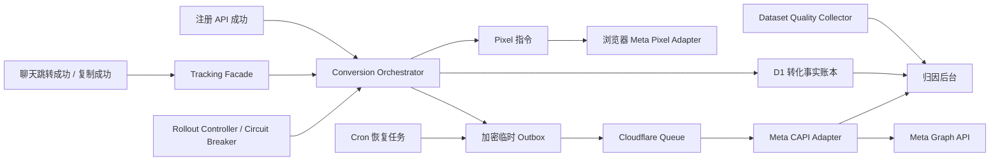

# Meta CAPI v2 统一归因架构设计

## 0. 文档状态

- 日期：2026-07-10
- 状态：设计已确认，待用户审核书面规范
- 范围：Meta Pixel、Meta Conversions API、Dataset Quality API、转化事件所有权、增强匹配、可靠投递、数据看板、发布门禁与回滚
- 基础设施约束：仅使用 Cloudflare Workers、D1、Queues、Worker Secrets 和 Cron，不引入 CAPI Gateway、合作伙伴托管服务或其他云基础设施
- 取代关系：本设计取代既有 Meta CAPI 运行时事件契约和生产接入方案；历史设计仅保留决策追溯价值，不得继续作为新增实现依据

本设计的核心目标不是让 CAPI 请求“可以发送”，而是建立一个能长期稳定影响广告优化效果、可以精确诊断、可以安全放量、可以可靠回滚的统一转化体系。

## 1. 已确认决策

1. 保留 Cloudflare 原生直接 CAPI，不使用 Meta Conversions API Gateway。
2. 一个业务动作只能有一个事实生产者；Analytics、Pixel、CAPI 都是派生消费者。
3. `Contact` 只在成功发起聊天跳转或成功复制联系方式后创建。
4. 主动展开二维码只记录站内分析，不发送 Meta `Contact`。
5. `CompleteRegistration` 由注册 API 服务端可信创建，不再由前端二次声明。
6. 停止自动派生和新增 `Lead`；历史 `Lead` 仅允许只读查询。
7. 停止运行时创建 `StartTrial`；历史数据仅允许只读查询。
8. CAPI 只发送 `Contact` 和 `CompleteRegistration` 两个高价值事件。
9. Pixel 继续发送 `PageView`、`ViewContent`、`Search`，并发送与 CAPI 同 ID 的 `Contact`、`CompleteRegistration`。
10. 用户明确同意营销追踪后，`CompleteRegistration` 允许发送 SHA-256 邮箱和不可逆 `external_id`；`Contact` 不发送邮箱或内部用户标识。
11. 匹配数据使用 AES-256-GCM 加密临时 Outbox，最长保留 24 小时。
12. dev 与 production 使用完全独立的 Dataset、Pixel ID、Token、Test Event Code、加密密钥和验证证据。
13. 首版接入 Dataset Quality API，但该读取链路不得阻断 CAPI 投递。
14. 生产按 `0% -> 10% -> 50% -> 100%` 人工分阶段放量，系统只自动熔断，不自动升级。

## 2. 当前实现审计

### 2.1 已有可复用能力

- D1 转化事实账本和渠道 delivery 账本。
- Pixel/CAPI 共用 `event_name + event_id` 的基础去重能力。
- Cloudflare Queue、重试、DLQ、pending outbox 恢复和最终状态回写。
- 营销授权 `granted / limited / denied` 门禁。
- `_fbp`、`_fbc`、客户端 IP、User-Agent 的短期 Queue 传递。
- Meta Test Event、发布证据、同 commit release gate。
- 后台归因、Meta 同步、重复诊断和发布检查页面。
- Graph API `v25.0` 直接 HTTP Adapter；当前版本与 Meta 官方 Business SDK v25 主版本一致。

### 2.2 必须清理的重复入口

当前代码仍存在多个事实生产入口：

- 注册页调用 `trackConversion('complete_registration')`。
- Analytics ingest 将 `register_success` 再映射为 `complete_registration`。
- Analytics ingest 将 `contact_method_click` 再映射为 `contact`。
- 转化服务在第一次 `contact` 后自动派生 `Lead`。
- 搜索、图库、登录等页面直接调用 `useFacebookPixel()`。

这些路径即使依赖幂等键压制部分重复，也无法满足“一个业务动作只有一个生产者”的架构要求，必须删除而不是继续兼容。

### 2.3 当前生产阻断

- dev DLQ 尚未创建，主 Queue consumer 仍使用旧重试参数。
- dev 缺少两个 Meta Worker Secret，`0034`、`0035` 尚未应用。
- production 主 Queue 和 DLQ 尚未创建。
- production 缺少两个 Meta Worker Secret，`0032` 到 `0035` 尚未应用。
- 当前 commit 没有有效的 Meta live evidence 和同 commit release 报告。
- 当前代码仍在 `dev`，尚未通过合规 PR 进入最终 `main` HEAD。

因此本设计实施前后都必须保持生产 CAPI 关闭。

## 3. 目标架构



边界原则：

- 业务页面和组件只描述业务动作，不引用 Meta Adapter。
- Conversion Orchestrator 是高价值转化口径、事实记录和渠道 delivery 的唯一解释者。
- Analytics 只能消费业务事实并做聚合，不得反向创建 conversion。
- Pixel Adapter 只执行服务端返回的高价值事件指令，或执行 Tracking Facade 明确允许的上漏斗事件。
- CAPI Adapter 只发送已经创建的 delivery，不判断业务动作是否成立。
- Dataset Quality Collector 只读取聚合质量指标，不参与投递状态机。
- D1 事实账本不被 Meta 接收状态反向覆盖。

## 4. 单一业务所有权

| 业务动作 | 唯一生产者 | 派生消费者 |
|---|---|---|
| 联系成功 | `Tracking Facade -> Conversion API -> Conversion Orchestrator` | Analytics、Pixel `Contact`、CAPI `Contact` |
| 注册成功 | `/api/auth/register -> Conversion Orchestrator` | Analytics、Pixel `CompleteRegistration`、CAPI `CompleteRegistration` |
| 页面浏览 | Tracking Facade / Pixel plugin | Analytics、Pixel `PageView` |
| 内容浏览 | Tracking Facade | Analytics、Pixel `ViewContent` |
| 搜索和筛选 | Tracking Facade | Analytics、Pixel `Search` 或允许的自定义事件 |
| Meta 投递 | Meta Delivery Orchestrator | Pixel Adapter、加密 Outbox、CAPI Adapter |

实施约束：

- 公共 Conversion API 仅接受 `contact`，不再接受 `complete_registration`。
- 注册 API 在用户创建成功后可信创建注册 conversion，并在响应中返回 Pixel 指令。
- 注册 conversion 创建失败不得回滚已成功注册。Cron 必须扫描“已有用户但缺少对应 CompleteRegistration 事实”的记录并补建一方事实；由于原始请求上下文已经丢失，补建记录不得创建 Pixel/CAPI delivery，也不得伪造营销授权或匹配数据。
- 页面和组件不得直接导入 `useFacebookPixel()`。
- API 不再对普通模块导出通用 `recordConversionAction()`；只暴露明确的 `recordContact()`、`recordRegistration()` 等领域入口。
- Analytics ingest 删除所有 conversion 创建逻辑。

## 5. 事件契约

### 5.1 正式事件

| 站内动作 | Meta 事件 | 触发条件 | Pixel | CAPI |
|---|---|---|---|---|
| `contact` | `Contact` | 安全聊天跳转已成功发起，或联系方式复制成功 | 是 | 是 |
| `complete_registration` | `CompleteRegistration` | 注册 API 已成功创建用户 | 是 | 是 |

### 5.2 不作为正式转化的动作

- 展开或悬浮查看二维码。
- 打开联系面板。
- 登录成功。
- 页面浏览、内容浏览、搜索和筛选。
- 后台操作和受保护媒体访问。
- 历史 `Lead`、`StartTrial`。

上漏斗事件可以继续作为 Pixel 或一方 Analytics 行为信号，但不能进入 CAPI 高价值转化账本。

### 5.3 去重

- 同一高价值业务动作的 Pixel 与 CAPI 必须使用相同 `event_name + event_id`。
- `event_id` 由 API 根据可信业务输入生成，客户端不得指定最终值。
- 每个 conversion 每个 channel 最多存在一条 delivery。
- 已经 `sent` 的 CAPI delivery 不得再次调用 Meta；重复 Queue 消息只写入幂等诊断。
- Pixel `attempted` 只代表浏览器调用尝试，不代表 Meta 已接收。
- CAPI 只有 Graph API 返回 `events_received=1` 才进入 `sent`。

## 6. MetaConnection 绑定模型

Pixel ID 与 Secret 必须物理隔离，但在业务上作为一个逻辑连接管理。

### 6.1 连接组成

```text
Pixel ID
+ Access Token 指纹
+ Test Event Code 存在状态
+ Dataset Quality API 权限状态
+ 最近验证时间
+ 验证使用的 release commit
```

D1 只保存 Pixel ID、Token 连接指纹、验证状态、验证时间、验证 commit 和质量 API 状态。Access Token、Test Event Code 和加密密钥只存 Worker Secret。

连接指纹使用 Access Token 作为 HMAC 密钥，对带领域前缀的 Pixel ID 计算。指纹不能反推出 Token；Pixel ID 或 Token 任一变化都会得到不同指纹。

### 6.2 验证与失效

- Owner Test Event 返回 `events_received=1` 后记录当前连接指纹。
- 生产发送前计算当前指纹并与已验证指纹比较。
- Pixel ID 或 Token 变化后旧验证立即失效。
- 指纹失效时 Circuit Breaker 打开，有效放量自动变为 `0%`。
- 后台必须区分“Secret 已配置”和“连接已验证”。
- 重新发送 Test Event 并关闭 incident 后才能恢复放量。

Test Event Code 不参与 production payload；即使 Secret 仍存在，production 模式也不得发送 `test_event_code`。

## 7. 营销授权与增强匹配

### 7.1 授权门禁

真实用户行为只有以下条件同时成立才创建可发送的 Meta delivery：

```text
meta_tracking_mode in (test, production)
AND marketing_consent_state = granted
AND 对应渠道开关已开启
AND MetaConnection 验证有效
AND 当前访客命中有效 rollout 比例
AND Circuit Breaker 未打开
```

`limited` 和 `denied` 只保留必要的一方业务事实，不加载 Pixel、不创建 Meta delivery。

营销授权由 API 使用 `SESSION_SECRET` 签发的 30 分钟 HttpOnly receipt cookie 作为服务端权威依据。公开 API 负责授权、撤销和读取脱敏状态；请求 body 只能降级授权，不能把 missing、invalid、expired 或 denied receipt 升级为 `granted`。receipt、签名、nonce 和 cookie 值不进入日志、D1、API 响应、审计或报告。浏览器 Pixel 使用公开 API 返回状态，服务端 CAPI 独立验证 receipt。

Owner 合成 Test Event 是建立 MetaConnection 验证的唯一引导例外：它只允许在 `test` 模式下绕过“已有连接验证”和 rollout 检查，仍必须要求 Pixel ID、Access Token、Test Event Code、Queue 和加密能力存在。它不读取用户邮箱、联系方式或站内用户标识；成功返回 `events_received=1` 后才能写入新的连接指纹。

### 7.2 Contact 匹配字段

- `_fbp`
- `_fbc`
- 客户端 IP
- User-Agent

`Contact` 不发送邮箱、手机号、内部用户 ID 或联系方式值。

### 7.3 CompleteRegistration 匹配字段

在 Contact 字段基础上增加：

- 服务端标准化邮箱后的 SHA-256。
- 每个用户随机生成的 128 位 `meta_external_id`，再次 SHA-256 后发送。

明文邮箱只存在于既有用户注册流程和用户表，不进入 Meta Outbox、Queue、日志、审计或发布报告。哈希邮箱仍属于个人数据处理，启用前必须更新隐私说明和营销授权文案。

## 8. 加密临时 Outbox

### 8.1 数据结构

```text
delivery_id
ciphertext
iv
auth_tag
key_version
expires_at
created_at
```

匹配数据在进入 D1 前使用 AES-256-GCM 加密。AAD 必须绑定 `delivery_id + event_name + key_version`，防止密文被替换到其他 delivery。

### 8.2 生命周期

- 最长保留 24 小时。
- 成功入队后立即删除 D1 密文。
- Queue message 自身携带密文，由 consumer 解密。
- 成功、永久失败或 DLQ 终态后销毁临时数据。
- Cron 清理过期密文并创建脱敏诊断。
- 解密失败不得发送降级事件，必须打开 Circuit Breaker。
- Queue 发送成功但 D1 状态更新失败时允许恢复任务重复入队，依靠 delivery 状态和相同 event ID 幂等抑制。

### 8.3 密钥

- dev 和 production 分别配置不同的 32 字节 Base64 Worker Secret：`META_CAPI_DATA_KEY_CURRENT`。
- 轮换窗口允许临时配置 `META_CAPI_DATA_KEY_PREVIOUS`，完成后删除。
- `key_version` 使用对应密钥 SHA-256 指纹的前 12 位，不需要额外保存版本 Secret。
- Worker 同时支持当前密钥和上一版密钥，完成无中断轮换；新密文只能使用当前密钥。
- 密钥值不得出现在 Wrangler 配置、D1、日志、报告或后台 API。

## 9. CAPI 投递状态机

```text
pending -> queued -> sending -> sent
                    |      |
                    |      -> failed_permanent
                    -> retryable -> Queue retry -> DLQ -> retry_exhausted
```

实现可以继续使用当前数据库状态名称，但对外口径必须能够区分 queued、可重试失败、永久失败和重试耗尽。

错误分类：

- 2xx 且 `events_received=1`：`sent`。
- 2xx 且未接收：永久失败。
- 400 等确定性参数错误：永久失败。
- 401/403 或数据集无权访问：永久失败并立即熔断。
- 429、5xx、网络错误和超时：可重试。
- 已 sent delivery：重复抑制，不再请求 Meta。
- Graph fetch 前必须通过 D1 CAS 获取短期 delivery lease；并发 loser 不 fetch，网络、Meta 或状态写回失败释放 lease，消费者崩溃后由 TTL 到期接管。所有接管继续使用原 event ID，lease token 不写日志或响应。
- DLQ：写入 `retry_exhausted`，不无限重试。

Graph API 版本集中在 Meta Adapter 配置中，并通过契约测试和季度版本审查维护。正式请求继续使用 Worker 兼容的窄接口直接 HTTP Adapter，不为两个事件引入完整 Node Business SDK 运行时。

## 10. Dataset Quality API

### 10.1 独立职责

Dataset Quality Collector 由 Cloudflare Cron 定时执行，只读取 Meta 当前允许的聚合质量指标，不参与事件发送和 Circuit Breaker 的即时判定。

首版在独立 dev Dataset 上完成接口发现和契约固化，只将 Meta 实际返回、经过白名单批准的字段加入生产模型。不得根据旧文档猜测字段。

### 10.2 数据边界

允许保存：

- Dataset、事件名和指标键。
- 数值型质量指标。
- Meta 指标时间窗口。
- 抓取时间、成功状态和脱敏错误分类。

禁止保存：

- 用户级 Meta 数据。
- Access Token、Test Event Code。
- 原始 API 响应中的未知字段。
- 任何可还原用户身份的标识。

Dataset Quality API 故障只产生 warning，不影响 CAPI 投递。

## 11. 分阶段放量与熔断

### 11.1 Rollout

`meta_capi_rollout_percentage` 只允许 `0 / 10 / 50 / 100`。

- 使用稳定访客标识做一致性哈希。
- 同一访客在同一阶段始终保持相同结果。
- 缺少匿名访客标识时，注册事件使用用户 `meta_external_id` 作为稳定后备。
- Pixel 对已授权用户继续运行，CAPI 按 rollout 比例补充。
- 已授权但未命中 rollout 的事件仍创建 `skipped/rollout_excluded` delivery，且不创建加密 Outbox，用于准确计算覆盖率。
- Circuit Breaker 打开时创建 `skipped/circuit_open` delivery，保留业务事实和诊断口径。
- Owner 手动升级并写审计日志，系统不得自动升级。

建议升级门槛：

- `10% -> 50%`：至少 10 条投递，成功率不低于 98%，无权限错误、DLQ 或陈旧 pending。
- `50% -> 100%`：至少 50 条投递，成功率不低于 99%，Meta 无关键质量诊断。
- 流量不足时允许 Owner 强制升级，但必须填写并审计理由。

### 11.2 Circuit Breaker

立即打开：

- MetaConnection 指纹失效。
- Meta 返回 401/403 或明确的数据集权限错误。
- Outbox 解密失败。
- Pixel ID 与已验证 Dataset 不一致。

阈值打开：

- 15 分钟内至少 10 次投递且永久失败率达到 5%。
- 15 分钟内出现 3 条 `retry_exhausted`。
- 15 分钟窗口内至少 5 条 delivery pending 超过 10 分钟。
- 检测到同一 `conversion_action_id + channel` 出现多条有效 delivery，违反数据库唯一性约束。

`duplicate_suppressed` 比例超过 10% 且样本不少于 20 条时只产生 warning，不自动熔断；该状态可能来自 Queue 的至少一次投递语义，必须结合 sent 唯一性和 Meta 去重证据人工判断。

打开后：

- 有效放量立即变为 `0%`，但保留 Owner 配置的目标比例。
- Pixel、事实账本和诊断继续运行。
- 创建 `meta_capi_incident` 并写审计日志。
- Owner 完成 Test Event、解决阻断并关闭 incident 后才能恢复。

## 12. 管理后台

后台归因页面统一为五个区域：

1. **连接状态**：Pixel ID、Secret 存在状态、连接指纹验证、Dataset Quality API 状态、验证 commit。
2. **业务转化趋势**：站内 `Contact`、`CompleteRegistration`，以一方事实账本为准。
3. **投递趋势**：Pixel attempted、CAPI sent、failed、skipped、pending、DLQ。
4. **质量趋势**：`fbp/fbc` 覆盖、增强匹配覆盖、Meta 聚合质量指标、去重证据。
5. **发布控制**：目标和有效 rollout、incident、最近 Test Event、live evidence、release report。

所有页面支持指定日期和时间范围，至少提供：

- Contact 与注册趋势。
- Pixel/CAPI 覆盖和成功率趋势。
- CAPI 延迟、重试和 DLQ 趋势。
- 匹配字段覆盖趋势。
- 按 UTM campaign、content 和推广链接的转化及投递质量。

口径不得混淆：

- 站内 Contact 不等于 Meta 已接收。
- Pixel attempted 不等于 Meta 已接收。
- CAPI sent 只代表 Meta API 接收，不代表广告后台最终归因。
- Dataset Quality 指标不反向修改站内事实。

## 13. 数据模型变更

新增或调整以下 schema：

### 13.1 用户匿名匹配标识

`users.meta_external_id`：

- 128 位安全随机值，唯一且不可由用户 ID 推导。
- 新注册用户在创建时生成。
- 既有用户由 migration 分批回填。
- 发送 Meta 前再做 SHA-256；D1 中不保存最终发送哈希。

### 13.2 连接验证

`meta_connection_verifications`：

- `pixel_id`
- `token_fingerprint`
- `transport_verified_at`
- `quality_api_verified_at`
- `release_commit`
- `status`
- `invalidated_at`

每个环境使用独立 D1，因此表内不混存 dev/production 凭证。历史验证记录只用于审计，只有最新且与当前运行配置、release commit 一致的记录可以放行。

### 13.3 加密 Outbox

`meta_capi_secure_outbox`：

- `delivery_id` 主键并关联 delivery。
- `ciphertext`、`iv`、`auth_tag`、`key_version`。
- `expires_at`、`created_at`。

不得增加明文匹配字段或可搜索的用户标识索引。

### 13.4 Dataset Quality 快照

`meta_dataset_quality_snapshots`：

- `pixel_id`、`event_name`、`metric_key`。
- `metric_value`、`window_start`、`window_end`。
- `fetched_at`、`status`、`error_category`。

只保存经过契约白名单批准的聚合字段。

### 13.5 Incident 与 rollout

`meta_capi_incidents` 保存 incident 类型、阈值窗口、打开/关闭时间、脱敏摘要、处理 Owner 和关闭理由。

`site_settings` 新增 `meta_capi_rollout_percentage`，默认 `0`。`meta_capi_enabled` 继续表示 Owner 的目标开关；实际发送状态由目标开关、rollout、连接验证和 Circuit Breaker 共同计算。

`analytics_conversion_deliveries` 增加 `has_email`、`has_external_id` 和创建时 rollout 快照等非敏感诊断字段，并建立 `(conversion_action_id, channel)` 唯一约束。不得保存邮箱哈希或 external ID 哈希本身。

### 13.6 注册请求上下文

注册页面对所有注册请求提交经过现有白名单清洗的 visitor、session、来源和 UTM 上下文，而不是只在邀请码注册时提交。注册 API 从服务端签名的短期 consent receipt cookie 读取营销授权，并只在 `granted` 时接收和校验浏览器标识；邮箱哈希始终在服务端生成。注册响应返回本次服务端创建的 Pixel 指令。

## 14. 旧代码清理

实施完成时必须删除：

- 注册页的 `trackRegistrationConversion()` 和 `trackConversion('complete_registration')`。
- Analytics ingest 的 `conversionInputFromAnalyticsEvent()`、`recordAcceptedConversions()` 及 conversion 写入依赖。
- `buildConversionBatchPlan()` 中的 Contact -> Lead 派生。
- 公共 Conversion API 的 `complete_registration` 输入能力。
- 页面和业务组件对 `useFacebookPixel()` 的直接引用。
- 运行时 Lead/StartTrial 创建映射、测试 fixture 和 readiness 成功条件。
- 旧版 Gateway、双入口和错误事件口径文档。
- `setup.sh` 中不完整的 Queue 初始化说明。

保留范围：

- 历史 Lead/StartTrial 数据库值和只读报表兼容。
- 迁移旧 delivery 状态所需的最小兼容代码。
- 旧公共写入 payload 不做静默兼容；不再支持的动作返回明确 4xx，防止旧客户端继续制造新旧双口径。

防止回归：

- ESLint `no-restricted-imports` 禁止页面和组件导入 Meta Adapter。
- 架构测试禁止 Analytics 模块依赖 Conversion 写入模块。
- API 只导出类型明确的领域入口。
- 集成测试断言每个业务动作只创建一条事实和每渠道一条 delivery。

## 15. 测试策略

### 15.1 单元测试

- Contact、CompleteRegistration 的唯一入口。
- Lead、StartTrial 不可创建。
- 营销授权三态。
- 邮箱规范化、SHA-256 和随机 external ID。
- Pixel/Token 指纹生成、比较和失效。
- AES-GCM 加解密、AAD 篡改、TTL 和密钥轮换。
- 0/10/50/100 稳定采样。
- Circuit Breaker 阈值、恢复和审计。
- Meta 2xx、4xx、429、5xx、网络和超时分类。
- Dataset Quality 字段白名单和故障降级。

### 15.2 集成测试

- 从空库执行全部 D1 migration。
- 注册成功创建用户和一次可信注册 conversion。
- Queue 首次入队失败由加密 Outbox 完整恢复。
- 重复 Queue 消息不重复发送已 sent delivery。
- DLQ 写回 `retry_exhausted`。
- Pixel/CAPI 同名事件使用同一 event ID。
- Secret、明文邮箱、原始 IP、User-Agent、fbp/fbc 不进入 D1 明文字段、日志、审计和报告。

### 15.3 Web E2E

- 未授权不加载 Pixel、不创建 CAPI delivery。
- 聊天跳转成功和复制成功触发 Contact。
- 二维码展开只写站内分析。
- 注册成功只产生一次 CompleteRegistration。
- 页面没有直接调用 Meta Adapter。
- 后台日期筛选、趋势、rollout 和 incident 流程完整。

### 15.4 真实 Meta 验证

自动测试不能替代真实 Meta 环境。独立 dev Dataset 必须确认：

- Contact、CompleteRegistration 均有 Browser 与 Server。
- Browser/Server event ID 一致并成功去重。
- CAPI 返回 `events_received=1`。
- 增强匹配覆盖符合设计。
- Dataset Quality API 可读取已批准指标。
- 不出现 Lead、StartTrial 或额外重复事件。

证据必须绑定最终 commit，严格有效 24 小时。

## 16. 迁移与发布

1. 保持 production `meta_tracking_mode=disabled`、CAPI 有效 rollout 为 `0%`。
2. 增加新 schema、加密 Outbox、连接验证、质量快照、incident 和 rollout 配置。
3. 引入新领域入口并迁移 Contact、Registration。
4. 删除旧双入口、Lead 派生和直接 Pixel 调用。
5. 运行全量单元、覆盖率、集成、E2E、类型检查和构建。
6. 创建独立 dev Dataset、Queue、DLQ、Secret 和加密密钥。
7. 部署最终 commit 到 dev，完成真实 Meta evidence。
8. PR 合入 `main`。
9. 使用最终 `main` commit 重新部署 dev 并重新生成 evidence。
10. 创建 production Queue、DLQ 和 Secret，应用 migration，保持 rollout `0%`。
11. 生成同 commit `verify:release` 报告。
12. 部署 production 并执行 production Test Event。
13. Owner 按 `10% -> 50% -> 100%` 人工放量。

任何旧 commit evidence、旧 release report 或仅本地 mock 的成功结果都不得放行新 HEAD。

## 17. 回滚

- Circuit Breaker 或 Owner 将有效 rollout 降为 `0%`。
- Pixel 保持运行。
- Queue、DLQ、Outbox、事实账本和 incident 保留诊断。
- 不执行破坏性 D1 migration 回滚。
- Token、Pixel ID 或加密密钥变化后强制重新验证。
- 修复后从 dev evidence 和 production 10% 阶段重新开始。
- 回滚不得恢复 Lead 派生、Analytics conversion fallback 或页面直连 Pixel 的旧路径。

## 18. 验收标准

- 运行时代码只能创建 Contact、CompleteRegistration 两个正式 Meta 转化。
- 每个业务动作只有一个事实生产者。
- Contact 和注册均只创建一次事实和每渠道一条 delivery。
- Pixel/CAPI 同名事件 ID 一致。
- CompleteRegistration 增强匹配只在 granted 下生成。
- 敏感匹配数据仅以密文临时存在，24 小时内删除。
- Pixel/Token 任一变化使旧连接验证失效。
- Dataset Quality API 故障不影响投递。
- Circuit Breaker 能自动将有效 rollout 降为 0%。
- 管理后台能按日期查看业务、投递、质量和 incident 趋势。
- dev 真实 Meta evidence、最终 main 同 commit release 和 production 资源检查全部通过。
- 旧双入口和冗余运行时代码已删除，不以 deprecated 分支继续保留。

## 19. 参考

- Meta Conversions API：https://www.facebook.com/business/help/AboutConversionsAPI
- Meta Pixel / CAPI 设置方式：https://www.facebook.com/help/messenger-app/952192354843755
- Meta Business SDK：https://github.com/facebook/facebook-nodejs-business-sdk
- Cloudflare Queues retries：https://developers.cloudflare.com/queues/configuration/batching-retries/
- Cloudflare Queues DLQ：https://developers.cloudflare.com/queues/configuration/dead-letter-queues/
