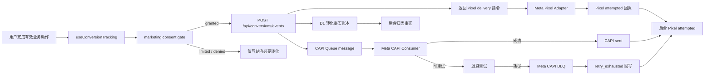

# Meta Pixel 与 CAPI 生产就绪加固设计

## 0. 文档状态

- 日期：2026-07-10
- 状态：历史设计输入；当前 Dataset Quality 为 `contract_pending`，production readiness blocked，production rollout `0`
- 范围：Meta Pixel、Meta CAPI、营销授权、事件去重、Cloudflare Queue 可靠性、归因后台口径和生产放行
- 依赖设计：`2026-07-08-meta-capi-attribution-layer-design.md`、`2026-07-09-local-release-verification-design.md`
- 设计基线：继续以站内转化账本为事实源，Pixel 与 CAPI 只作为外部同步渠道

本文不重写既有归因架构，而是补齐“代码存在”到“可以正式投放”之间的生产验收契约。与既有文档冲突时，涉及生产放行、授权、Pixel 状态和 Queue 可靠性的内容以本文为准。

当前放行口径以 `docs/PROJECT_STATUS.md`、`docs/DEPLOYMENT.md` 和 Meta CAPI v2 质量运营计划为准。没有真实 dev Dataset capture、Owner 批准的 Dataset Quality contract 与已验收 collector 时，本设计不得被解释为允许 production rollout；记录器能力本身不改变 `contract_pending`。

## 1. 审计结论

当前代码已具备以下基础能力：

- 联系方式跳转或复制成功后记录 `Contact`。
- 首次有效联系派生 `Lead`。
- 注册成功记录 `CompleteRegistration`。
- Pixel 与 CAPI 使用稳定 `external_event_id` 的基础实现。
- CAPI 通过 Cloudflare Queue 异步投递。
- 后台具备归因、Meta 同步、重复诊断和发布检查页面。
- 本地单测、类型检查、Playwright、构建和 Wrangler dry-run 已通过。

但截至 2026-07-10，生产就绪仍存在以下阻断：

1. dev 未配置 Meta 测试 token 和 Test Event Code，准生产 Test Event 实际为 `skipped`，却被发布脚本判定为通过。
2. 生产 `0032_attribution_conversions.sql`、`0033_meta_delivery_settings.sql` 尚未应用。
3. 生产 `meigallery-meta-capi` Queue、CAPI token 和 Test Event Code 尚未配置。
4. Pixel 初始化中的授权判断恒为 `true`，没有真实 marketing consent。
5. CAPI 代码能读取 `fbp`、`fbc`，但真实前端链路没有采集和传递，事件匹配质量不可验证。
6. `StartTrial` 只有 API 和脚本模拟，没有对应产品动作。
7. 后台将 Pixel delivery 建模为可进入 `sent`，但浏览器无法证明 Meta 已接收；实际代码也没有可靠更新 Pixel delivery 的路径。
8. CAPI Queue 未配置 DLQ、显式重试策略和外部请求超时，重试耗尽后可能丢失消息。
9. Meta 相关模块未进入 API 覆盖率阈值清单，当前绿灯不能证明关键分支覆盖达标。
10. 生产发布报告必须来自最终 `main` HEAD；`dev` 报告不能直接放行生产。

因此，当前状态是“代码门禁通过，Meta 生产闭环未通过”。

## 2. 目标与非目标

### 2.1 目标

- 只有在营销授权明确为 `granted` 时才加载 Pixel、创建 Pixel/CAPI delivery 或发送 Meta 事件。
- `Contact`、`Lead`、`CompleteRegistration` 的浏览器与服务端事件使用相同 `event_name + event_id`。
- Pixel 只记录 `attempted` 或 `skipped`，不把浏览器调用成功误写为 Meta 已接收。
- CAPI 记录 `pending`、`sent`、`failed`、`skipped` 和 `duplicate_suppressed`；重试耗尽以 `failed/retry_exhausted` 表示。
- 提供足够的 `fbp`、`fbc`、客户端 IP 和 User-Agent 信号，提高 Meta 事件匹配能力，但不把原始标识长期写入 D1。
- Cloudflare Queue 具备超时、分类重试、退避、DLQ 和最终失败回写。
- dev Test Events 必须真实收到事件，不能再把 `skipped` 当作通过。
- 后台发布检查反映真实生产依赖：migration、Queue、DLQ、secret、授权模式、最近 Test Event 和失败积压。
- 在最终 `main` commit 上生成可审计、未过期的生产放行报告。

### 2.2 非目标

- 不接入 Meta Marketing API，不同步广告花费、campaign、ad set 或广告素材数据。
- 不自动创建或调整 Meta 广告。
- 不以 Pixel/CAPI 数据覆盖站内转化账本。
- 不发送邮箱、手机号、联系方式值、会员备注、私有媒体路径、token 或后台操作信息。
- 不新增真实 `StartTrial` 产品功能；当前阶段明确不发送该事件。
- 不引入 Cloudflare 之外的常驻基础设施。

## 3. 生产就绪分级

Meta 能力使用四级状态，后台和发布报告必须明确展示当前等级：

| 等级 | 名称 | 判定标准 | 可执行动作 |
|------|------|----------|------------|
| L1 | 代码就绪 | 单测、类型检查、构建、dry-run 通过 | 允许继续开发，不允许宣称 CAPI 可用 |
| L2 | dev 实链路就绪 | 隔离 dev 资源、测试 Pixel、测试 token、Test Event Code、Queue 和 DLQ 全部通过 | 允许准备生产资源 |
| L3 | 生产待启用 | 生产 migration、Queue、DLQ、secret、Worker 部署完成，开关仍关闭 | 允许生产 Test Event，不允许正式发送用户事件 |
| L4 | 正式投放就绪 | Meta Events Manager 确认 Browser + Server 事件及去重，后台无阻断项，最终 `main` 报告通过 | 允许开启 CAPI 和广告投放 |

`verify:quick` 只能证明 L1。生产部署脚本可以部署 L3 的关闭态代码，但只有 L4 才能在后台开启 `meta_capi_enabled`。

## 4. 总体架构



边界原则：

- 业务组件只调用 `useConversionTracking()`。
- API Worker 拥有转化口径、去重键、Meta 事件映射和 delivery 指令的最终解释权。
- Pixel Adapter 只执行服务端返回的浏览器指令。
- CAPI Adapter 只处理 Queue message，不参与业务动作判断。
- 后台同时展示站内事实、浏览器尝试和服务端接收结果，三者不混为一谈。

## 5. 授权与隐私边界

### 5.1 状态定义

继续使用 `granted / limited / denied`，但明确含义：

- `granted`：用户已同意营销追踪，可加载 Pixel 并创建 CAPI delivery。
- `limited`：未取得明确营销授权，只保留必要的一方转化事实；不加载 Pixel，不创建 CAPI delivery。
- `denied`：用户明确拒绝营销追踪；行为与 `limited` 相同，并保留拒绝状态供本地判断。

只有严格等于 `granted` 才允许进入 Meta 渠道。当前“不是 denied 就发送”的逻辑必须移除。

### 5.2 配置边界

配置拆分为两个维度：

- `meta_tracking_mode`：Owner 控制的系统运行模式，取值 `disabled / test / production`。
- `marketing_consent_state`：用户侧授权状态，取值 `granted / limited / denied`。

发送条件必须同时满足：

```text
meta_tracking_mode in (test, production)
AND marketing_consent_state = granted
AND 对应 Pixel/CAPI 开关已开启
```

在完整 CMP 尚未接入时，默认状态为 `limited`。系统可以部署，但不得加载 Pixel 或发送 CAPI。后续若面向 EU、UK、CA 等强隐私地区投放，CMP 属于扩大投放前的独立前置项。

`marketing_consent_state` 由统一的 `useMarketingConsent()` 提供。它优先读取 CMP 写入的第一方 consent cookie；没有 CMP cookie 时回退 `limited`。站点设置只能决定系统运行模式，不能把所有访客的个人授权强制改成 `granted`。

Owner 主动触发的合成 Test Event 是唯一例外：它只在 `meta_tracking_mode=test` 下运行，不代表真实用户行为，不创建 Pixel delivery，也不读取联系方式或登录用户资料；CAPI 可使用该管理请求的 IP、User-Agent 和 Test Event Code 完成连通性验证。

### 5.3 数据最小化

- D1 不保存原始 IP、User-Agent、`_fbp` 或 `_fbc`。
- Queue message 可短期携带已校验的 `fbp`、`fbc`、客户端 IP 和 User-Agent，仅用于当前 delivery。
- 日志、审计记录和发布报告不得输出这些值。
- 不发送邮箱、手机号和联系方式值，即使已登录或注册。
- `event_source_url` 只保留站点 origin 与 allow-list pathname，不包含 query、hash、token 或后台路径。

## 6. 事件契约

### 6.1 当前正式事件

| 站内动作 | Meta 事件 | 触发条件 | Pixel | CAPI |
|----------|-----------|----------|-------|------|
| `contact` | `Contact` | 安全跳转已发起，或复制成功 | 是 | 是 |
| `lead` | `Lead` | 同一 session 首次有效联系，由服务端派生 | 是 | 是 |
| `complete_registration` | `CompleteRegistration` | 注册 API 成功 | 是 | 是 |
| `start_trial` | `StartTrial` | 当前无真实产品动作 | 否 | 否 |

`StartTrial` 保留数据库和共享类型兼容，但从公开 conversion API 的可写动作中移除，不得出现在生产 readiness 成功条件、默认趋势指标或 Test Events 必测清单中。未来新增真实试用权益后，必须单独设计并验收。

### 6.2 统一事件 ID

事件 ID 的纯函数迁移到 `packages/shared`，Web 与 API 共用，避免双份实现漂移。

```text
Contact:
meta:Contact:contact:<session>:<method>:<target>

Lead:
meta:Lead:lead:<session>

CompleteRegistration:
meta:CompleteRegistration:complete_registration:<session>:<date>
```

API 仍需重新计算并校验事件 ID，不能直接信任客户端提交值。API 响应返回本次实际创建的 Pixel 指令：

```json
{
  "data": {
    "conversionId": "conv_xxx",
    "created": true,
    "pixelEvents": [
      {
        "deliveryId": "cdlv_xxx",
        "eventName": "Contact",
        "eventId": "meta:Contact:contact:session_x:telegram:floating_contact_panel",
        "payload": {
          "method_type": "telegram",
          "location": "floating_contact_panel"
        },
        "receiptToken": "短期一次性回执令牌"
      }
    ]
  }
}
```

首次有效联系的响应同时返回 `Contact` 和 `Lead` 两条 Pixel 指令。这样派生 `Lead` 不再只有 CAPI，也不会由前端自行猜测是否为首次联系。

重复业务动作返回 `created=false` 且不返回新的 Pixel 指令，避免重复发送。

### 6.3 前端失败处理

服务端返回的 `pixelEvents` 是高价值 Pixel 事件的唯一指令源。conversion API 失败时，前端不得自行猜测 `Lead` 或使用另一套 ID 直接发送 Pixel，否则会重新引入双通道口径漂移。

- 联系跳转、复制和注册结果始终优先，不等待追踪成功才完成用户动作。
- conversion API 使用 `keepalive` 或等价安全请求，并在当前浏览器会话内最多重试 3 次。
- API 最终失败时继续保留可用的一方 analytics 兼容事件，但不发送本次 Pixel/CAPI；错误只记脱敏诊断。
- API 恢复后，相同业务幂等键只能补写一次转化并返回一次 Pixel 指令。

## 7. Pixel 投递状态

浏览器调用 `fbq()` 只能证明代码已尝试调用，不能证明 Meta 已接收。因此：

- `meta_pixel` 不使用 `sent`。
- Pixel 状态限定为 `pending / attempted / skipped / duplicate_suppressed`。
- `attempted` 表示 Pixel Adapter 已成功调用 `fbq('track', ...)`。
- Meta 是否接收只在 Events Manager / Pixel Helper 的人工或联调证据中确认，不写成日常 delivery 的 `sent`。

前端执行 Pixel 指令后，调用一次回执接口：

```text
POST /api/conversions/pixel-receipts
```

请求只包含 `deliveryId`、`attempted` 和服务端签发的一次性 `receiptToken`。令牌使用项目现有服务端密钥做带领域前缀的 HMAC，绑定 delivery ID、event ID 和 5 分钟有效期，不新增可被前端读取的 secret。服务端验证令牌、有效期、delivery channel 与 event ID 后，将状态从 `pending` 更新为 `attempted`；相同回执重放只返回幂等成功。回执失败不阻断用户动作，但进入前端受限重试队列，最多重试 3 次且不跨浏览器会话持久化。

后台 Meta 页面必须分别显示：

- Pixel attempted
- CAPI sent
- CAPI failed / retry exhausted
- skipped 原因
- Meta Test Events 最近一次确认时间

页面不得把 Pixel attempted 与 CAPI sent 合并成一个“已同步”数字。

## 8. CAPI Payload 与临时标识

### 8.1 标识来源

取得 `granted` 后：

- 从第一方 cookie 读取并校验 `_fbp`。
- 从第一方 cookie 读取并校验 `_fbc`；若首次落地包含合法 `fbclid`，按 Meta 格式生成 `_fbc`。
- API Worker 从请求中读取客户端 IP 和 User-Agent。
- 不接受业务 metadata 直接覆盖以上字段。

Queue message 使用版本化 schema：

```json
{
  "schemaVersion": 1,
  "deliveryId": "cdlv_xxx",
  "userData": {
    "fbp": "已校验值",
    "fbc": "已校验值",
    "clientIpAddress": "请求来源 IP",
    "clientUserAgent": "请求 User-Agent"
  }
}
```

Queue consumer 根据 `deliveryId` 从 D1 读取业务事件，再合并 Queue 中的临时 `userData` 发送 Meta。消息成功、永久失败或进入 DLQ 后，不在 D1 留存原始标识。

### 8.2 Payload 白名单

CAPI 事件只允许：

- `event_name`
- `event_time`
- `event_id`
- `event_source_url`
- `action_source=website`
- `user_data.fbp`
- `user_data.fbc`
- `user_data.client_ip_address`
- `user_data.client_user_agent`
- 已批准的 `custom_data`：`method_type`、`action_type`、`location`、`content_name`、`content_category`、UTM 字段

Test Event 额外允许顶层 `test_event_code`。任何未知字段在发送前丢弃。

## 9. Cloudflare Queue 可靠性

### 9.1 资源

| 环境 | 主 Queue | DLQ |
|------|----------|-----|
| dev | `meigallery-meta-capi-dev` | `meigallery-meta-capi-dev-dlq` |
| production | `meigallery-meta-capi` | `meigallery-meta-capi-dlq` |

主 Queue consumer 显式配置：

- `max_batch_size`：保持当前环境值。
- `max_batch_timeout`：不超过 30 秒。
- `max_retries`：5。
- `retry_delay`：初始 60 秒；代码可基于 `message.attempts` 使用更长退避。
- `dead_letter_queue`：绑定对应环境 DLQ。

DLQ 由同一 API Worker 消费，通过 `batch.queue` 区分来源。DLQ consumer 将 delivery 更新为：

```text
status=failed
error_code=retry_exhausted
attempt_count=<最终次数>
```

随后写入日聚合、结构化错误日志并 ack。DLQ 不做无限重试。

### 9.2 超时与错误分类

Meta 请求使用 `AbortSignal.timeout()` 或等价组合信号，默认 8 秒：

- 2xx 且 Meta 响应 `events_received=1`：`sent`，ack；保存脱敏 request ID 或 trace ID（如响应提供）。
- 2xx 但 `events_received!=1`：`failed/permanent`，ack。
- 400、401、403 等确定性 4xx：`failed/permanent`，ack。
- 429：`failed/retryable`，带退避 retry。
- 5xx：`failed/retryable`，带退避 retry。
- DNS、连接、超时：`failed/retryable`，带退避 retry。
- 已经 `sent` 的 delivery：`duplicate_suppressed`，ack，不再次调用 Meta。

错误消息脱敏并限制长度。日志使用结构化字段，只记录 delivery ID、HTTP 状态、错误分类和尝试次数。CAPI Adapter 返回结构化结果，Test Event 和 dev rehearsal 可以据此校验 `events_received`，不能只依据 HTTP 2xx。

## 10. Test Events 与发布门禁

### 10.1 自动验证

dev rehearsal 必须使用独立测试 Pixel / dataset、测试 token 和 Test Event Code。开启严格模式时，以下任一情况都必须失败：

- secret 或 Test Event Code 缺失。
- API 返回 `skipped`、`failed` 或 `events_received != 1`。
- delivery 未在超时窗口内变为 `sent`。
- `Contact`、`Lead`、`CompleteRegistration` 任一未收到。
- Pixel 和 CAPI 的同名事件 ID 不一致。

禁止再把“Test Event endpoint 可调用”当作“Meta 已收到”。

### 10.2 人工确认

首次启用、Pixel ID 变更、事件契约变更或去重逻辑变更时，必须在 Meta Events Manager 完成人工确认：

1. 从 dev 测试链接进入前台。
2. 完成一次联系方式跳转和一次注册。
3. Test Events 中看到 Browser 与 Server 的 `Contact`、`Lead`、`CompleteRegistration`。
4. 同名 Browser/Server 事件 ID 相同，Meta 未提示重复计数。
5. `StartTrial` 不出现。

人工确认生成脱敏 JSON 证据，仅记录 commit、测试 Pixel ID 后四位、事件名、event ID 摘要、Browser/Server、去重结果、时间和确认人，不记录 token、Test Event Code 或用户标识。

### 10.3 生产放行条件

生产 gate 除现有 release 报告外，还要求：

- 当前 commit 的 Meta live verification 证据存在且未超过 24 小时。
- 证据覆盖全部正式 Meta 事件。
- dev Queue 和 DLQ 均有 producer/consumer。
- 生产 Queue、DLQ、CAPI token 和 Test Event Code 已存在。
- 生产 D1 没有待应用的归因 migration。
- `meta_capi_enabled` 在首次生产部署前保持 `false`。
- 当前分支为最终 `main` 或符合发布规范的 `release/*`。

## 11. 后台 Readiness 设计

`/admin/attribution/readiness` 从简单数据检查升级为分层检查：

### 阻断项

- conversion migration 已应用。
- Pixel ID 与运行模式一致。
- marketing consent 模式明确。
- CAPI 开启时 secret 必须存在。
- Queue producer binding 存在，DLQ 配置已被当前 commit 的发布验证报告确认。
- 最近 dev Meta live verification 有效。
- 最近 24 小时没有 `retry_exhausted`。
- Pixel/CAPI 同名事件 ID 采样一致。
- 生产部署报告属于当前 commit。

### 警告项

- `fbp/fbc` 覆盖率偏低。
- CAPI sent 比 Pixel attempted 明显偏低。
- 有 pending 超过 10 分钟。
- Meta 4xx 永久失败出现。
- 最近人工去重确认超过 30 天。

运行时 API 只能直接确认 Queue producer binding 和 secret 是否存在，不能调用 Cloudflare REST API 探测 DLQ。DLQ、consumer 和 migration 状态由发布验证脚本通过 Wrangler 只读命令确认，并以当前 commit 的脱敏验证摘要写入 D1；后台读取该摘要展示“已确认 / 过期 / 未确认”。后台不返回 secret 值、Cloudflare 资源 ID 或凭证。

## 12. 测试策略

### 12.1 单元测试

- marketing consent 三态：只有 `granted` 加载 Pixel、创建 Meta delivery。
- `Contact`、派生 `Lead`、`CompleteRegistration` 的服务端 Pixel 指令。
- shared event ID 在 Web/API 输入相同时完全一致。
- Pixel attempted 回执令牌、过期、重放和 channel 校验。
- `_fbp`、`_fbc`、`fbclid` 格式校验。
- CAPI payload 白名单和敏感字段清除。
- 2xx、4xx、429、5xx、网络异常和超时分类。
- 已 sent delivery 的幂等抑制。
- Queue retry、退避和 DLQ 最终回写。
- Readiness 每个阻断项和警告项。

Meta 关键模块必须加入 API 覆盖率范围，最低阈值：

- statements：85%
- branches：80%
- functions：85%
- lines：85%

`verify:quick` 和 CI 都必须运行 `api-coverage`；缺少覆盖率产物或阈值失败时，release 不能通过。

### 12.2 集成测试

- Wrangler local D1 应用全部 migration。
- conversion API 写入事实账本并返回 Pixel 指令。
- Queue mock 消费后 delivery 进入 `sent`。
- 失败达到重试上限后进入 DLQ 并回写 `retry_exhausted`。
- Pixel receipt 从 `pending` 更新为 `attempted`。
- 后台 Meta 与 readiness 读取真实测试数据库，不使用不可达的伪造 `meta_pixel sent` fixture。

### 12.3 Web 与端到端测试

- 未授权时不插入 Pixel script、不发送 PageView 或标准事件。
- 联系方式只有安全跳转已发起或复制成功后才触发。
- 首次联系执行 `Contact + Lead` 两条服务端返回的 Pixel 指令。
- 重复联系不产生新 Pixel 指令。
- 注册成功执行 `CompleteRegistration`。
- 全站不触发 `StartTrial`。
- Pixel 调用失败不阻断跳转、复制或注册。
- 后台区分 Pixel attempted 与 CAPI sent。

### 12.4 dev 真实验证

- 隔离 dev D1/R2/Queue/DLQ。
- 真实测试 Pixel、token 和 Test Event Code。
- Browser + Server 的三类正式事件均可见。
- 同名事件 ID 一致并完成去重。
- 关闭或拒绝授权时，Meta Test Events 不出现新事件。

## 13. 上线顺序

1. 实现并通过新增单元、集成和 Web 测试。
2. 创建 dev DLQ，配置 dev 测试 Pixel、token 和 Test Event Code。
3. 在 dev 完成自动 Test Events 和人工去重确认。
4. 创建生产 Queue 与 DLQ，配置生产 CAPI token 和 Test Event Code；保持 `meta_capi_enabled=false`。
5. 将归因 migration 应用到生产 D1。
6. 从 `dev` 创建 release 分支，通过 CI 后 PR 合入 `main`。
7. 在最终 `main` HEAD 重新运行完整 release 与 Meta live verification。
8. 先部署 API Worker，再部署 Web Worker。
9. 在生产后台执行 Owner Test Event，确认 Queue、secret 和 CAPI 响应。
10. 开启 Pixel/CAPI 前再次检查 marketing consent 模式。
11. 开启 CAPI，观察 30 分钟 delivery、DLQ、重复率和 Events Manager 诊断。
12. 所有指标稳定后开始广告投放。

### 13.1 数据与配置迁移

新增顺序 migration，不修改已经发布的 `0032`、`0033`：

- 新 migration 以 SQLite 安全重建方式扩展 delivery 状态约束，加入 `attempted`；迁移期间保留现有记录、索引和外键关系。
- 新增 `meta_tracking_mode` 规范值约束；历史 `limited`、`hybrid` 或未知值统一迁移为最保守的 `disabled`。
- 新增发布验证摘要表，仅保存 commit、验证类型、状态、时间和脱敏资源检查，不保存命令凭证或 Meta 标识。

迁移完成后，`meta_pixel/sent` 历史记录作为旧口径保留展示，但不得进入新口径的 Pixel attempted 指标。新代码不再生成 `meta_pixel/sent`。

## 14. 回滚

出现异常时按开关优先回滚：

1. 关闭 `meta_capi_enabled`，停止新 CAPI 入队。
2. 必要时关闭 `facebook_pixel_enabled`，站内转化事实继续写入。
3. 暂停主 Queue delivery，保留消息用于诊断。
4. 检查 DLQ、永久 4xx、token 权限和 Pixel ID。
5. 修复并通过 dev Test Events 后恢复 Queue。
6. Worker 版本回滚前仍保持 Meta 开关关闭。

不回滚已应用的 D1 migration，不删除 Queue、DLQ 或历史 delivery。

## 15. 验收标准

实现完成必须同时满足：

- 当前正式事件只有 `Contact`、`Lead`、`CompleteRegistration`。
- `limited` 和 `denied` 均不会加载 Pixel 或创建 CAPI delivery。
- 首次联系的 Pixel/CAPI 均包含 `Contact` 与 `Lead`，同名事件 ID 一致。
- 注册成功的 Pixel/CAPI `CompleteRegistration` ID 一致。
- `StartTrial` 不会被真实页面、脚本 smoke 或生产 Test Event 触发。
- Pixel 后台状态只显示 attempted，不宣称 Meta 已接收。
- CAPI Test Event 返回真实 `sent`，不能以 skipped 通过。
- CAPI 具备 8 秒超时、分类重试、退避、DLQ 和最终失败回写。
- D1 不长期保存 IP、User-Agent、`fbp` 或 `fbc`。
- Meta 关键代码覆盖率达到约定阈值。
- Meta Events Manager 中 Browser + Server 三类事件可见且去重正常。
- 生产 D1、Queue、DLQ、secret 和后台 readiness 全部通过。
- 最终生产报告绑定同一 `main` commit，工作区干净且报告未过期。

只有全部满足后，项目才可标记为“Meta Pixel + CAPI 正式投放就绪”。
