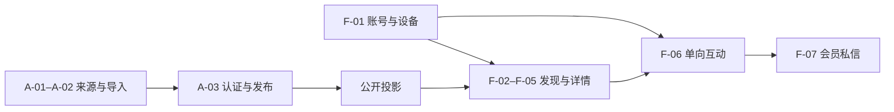
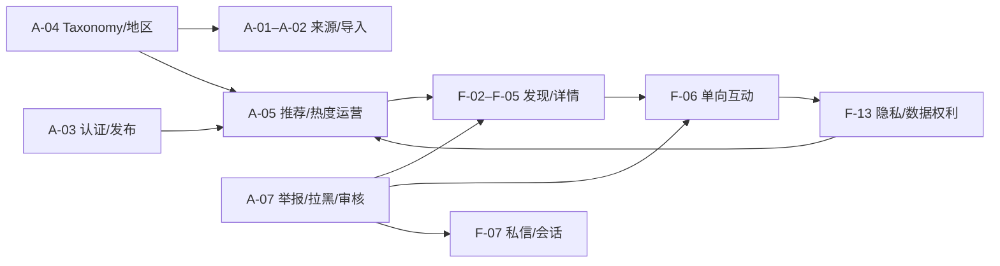
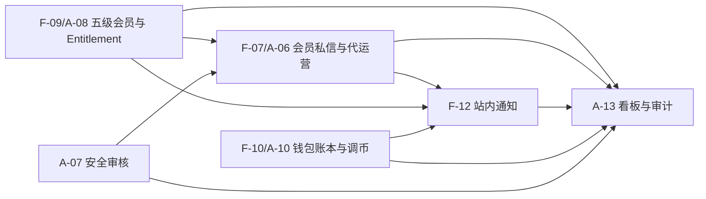

# 真人发现与互动平台 Feature PRD 目录

更新时间：2026-07-20

App 版本：1.0

状态：需求讨论中

本目录把 [产品蓝图](./product-blueprint/prd.md) 拆为可独立评审、设计、估算和验收的 Feature PRD。上游产品与技术基线见 [App 文档总览](../../../app/README.md)，已确认设计记录见 [真人发现与互动平台产品蓝图](../../../superpowers/specs/2026-07-20-real-person-discovery-product-blueprint-design.md)。

## 1. 使用规则

- 产品蓝图定义公开定位、角色、领域边界、路线和全局验收，是本 Epic 的事实源。
- 每个 Feature PRD 必须链接产品蓝图，并说明依赖、版本、入口、异常状态和验收证据。
- 普通账号不创建公开真人资料；任何 Feature 不得重新引入双方匹配或用户间聊天。
- 真人资料只有在管理员认证并发布后才能进入列表。
- 未认领真人的私信由管理员代运营，并向观看者披露实际接收主体。
- 会员功能使用 rank/entitlement，不硬编码心遇、心悦等展示名称。

## 2. 已完成 PRD

| 类型 | Feature | 文档 | 解决的问题 |
|------|---------|------|------------|
| 范围 | App 1.0 发布范围 | [PRD](./app-1-0-release-scope/prd.md) | 首发必须交付、仅预留、未来升级和不承诺能力 |
| 总纲 | 产品蓝图 | [PRD](./product-blueprint/prd.md) | 产品定位、角色、范围、路线和产品级验收 |
| 总纲 | 真人发现与代运营私信 | [PRD](./managed-person-discovery-and-messaging/prd.md) | 真人资料准入、推荐、单向互动、心享会员私信和本人认领 |
| 总纲 | 心享会员与虚拟商业化 | [PRD](./heart-membership-and-virtual-commerce/prd.md) | 五级会员、权限目录、金币、礼物、装扮和后台调币 |
| 详细 | F-01 观看者注册、登录与设备安全 | [PRD](./account-access-and-device-management/prd.md) | 登录适配、账号边界、会话、设备和撤权 |
| 详细 | F-02–F-05 真人发现、搜索与资料浏览 | [PRD](./person-discovery-and-profile-experience/prd.md) | 推荐、列表、搜索筛选、详情和受保护媒体 |
| 详细 | A-01–A-02 真人来源、上传与 MeiGallery 导入 | [PRD](./person-source-upload-and-meigallery-import/prd.md) | 手动供给、候选迁移、授权、去重和逐项幂等 |
| 详细 | A-03 真人认证与发布审核 | [PRD](./person-verification-and-publication/prd.md) | 双状态审核、公开投影、暂停撤权和审计 |
| 详细 | F-06 喜欢、关注、收藏与浏览历史 | [PRD](./viewer-interactions-and-history/prd.md) | 单向私有关系、收藏夹、历史、拉黑联动和推荐信号 |
| 详细 | F-13 我的、隐私设置与数据权利 | [PRD](./privacy-settings-and-data-rights/prd.md) | 账号设置、隐私选择、导出、注销、帮助与申诉 |
| 详细 | A-04 标签、地区与分类目录管理 | [PRD](./taxonomy-region-and-category-management/prd.md) | stable taxonomy、地区层级、legacy 映射与目录演进 |
| 详细 | A-05 推荐位、排序规则与热度运营 | [PRD](./recommendation-and-popularity-operations/prd.md) | 候选资格、规则版本、热度、精选、灰度与回滚 |
| 详细 | A-07 举报、拉黑与安全审核 | [PRD](./report-blocking-and-moderation/prd.md) | 举报案件、最小证据、拉黑、审核、处置与申诉 |
| 详细 | F-09、A-08 心享会员、Entitlement 与管理员手动发放 | [PRD](./membership-entitlements-and-manual-grants/prd.md) | 五级目录、typed entitlement、grant、有效期、复核与旧会员迁移 |
| 详细 | F-07、A-06 会员私信、实时会话与平台代运营 | [PRD](./member-messaging-and-managed-operations/prd.md) | 直接建会话、持续披露、消息状态、实时恢复、队列分配与安全升级 |
| 详细 | F-12 站内通知中心与通知偏好 | [PRD](./in-app-notification-center/prd.md) | 事件模板、分类、未读、偏好、深链、HTTP/实时刷新与必要通知 |
| 详细 | F-10、A-10 金币钱包与管理员调币 | [PRD](./wallet-ledger-and-admin-coin-adjustments/prd.md) | 余额明细、追加账本、加扣币、复核、批量、冲正与对账 |
| 详细 | A-13 运营看板、审计日志与异常追踪 | [PRD](./operations-dashboard-and-audit-log/prd.md) | 指标口径、最小化看板、追加审计、完整性、异常与受控导出 |

## 3. 前台 Feature 拆分顺序

| 序号 | Feature | 目标版本 | 主要依赖 |
|------|---------|----------|----------|
| F-01 | [注册、登录与设备管理](./account-access-and-device-management/prd.md) | M1 | 共享身份、条款、会话安全 |
| F-02 | [首页与个性化推荐](./person-discovery-and-profile-experience/prd.md) | M1 | 真人公开投影、推荐规则 |
| F-03 | [地区、热门、最新与分类列表](./person-discovery-and-profile-experience/prd.md) | M1 | 地区/标签体系、热度投影 |
| F-04 | [搜索、筛选与保存条件](./person-discovery-and-profile-experience/prd.md) | M1/M2 | 搜索索引、会员 entitlement |
| F-05 | [真人详情与媒体浏览](./person-discovery-and-profile-experience/prd.md) | M1 | Person/Profile/Gallery 映射、媒体授权 |
| F-06 | [喜欢、关注、收藏与历史](./viewer-interactions-and-history/prd.md) | M1 | 观看者互动、隐私与幂等 |
| F-07 | [心享会员私信与会话](./member-messaging-and-managed-operations/prd.md) | M2 | 心享会员、代运营工作台、实时消息 |
| F-08 | 礼物与互动记录 | 后续商业化 | 金币账本、礼物目录、会话 |
| F-09 | [心享会员手动发放与权益](./membership-entitlements-and-manual-grants/prd.md) | App 1.0 | 五级目录、管理员发放、有效期、entitlement |
| F-10 | [金币余额、明细与管理员调整](./wallet-ledger-and-admin-coin-adjustments/prd.md) | App 1.0 | 钱包、追加账本、后台调币；充值后续立项 |
| F-11 | 头像框、主页皮肤与聊天皮肤 | 后续商业化 | 商品库存、装扮渲染、到期规则 |
| F-12 | [站内通知中心](./in-app-notification-center/prd.md) | App 1.0 | 消息、会员/金币和安全事件；系统推送后续立项 |
| F-13 | [我的、隐私、数据导出与注销](./privacy-settings-and-data-rights/prd.md) | M1 | 账号、设备、数据权利 Workflow |

## 4. 后台 Feature 拆分顺序

| 序号 | Feature | 目标版本 | 主要依赖 |
|------|---------|----------|----------|
| A-01 | [真人资料上传](./person-source-upload-and-meigallery-import/prd.md) | M0/M1 | Person/Profile 模型、R2 |
| A-02 | [MeiGallery 人物导入](./person-source-upload-and-meigallery-import/prd.md) | M0/M1 | legacy 映射、授权证据、迁移任务 |
| A-03 | [真人认证与发布审核](./person-verification-and-publication/prd.md) | M1 | 审核状态机、角色权限、审计 |
| A-04 | [标签、地区与分类管理](./taxonomy-region-and-category-management/prd.md) | M1 | Taxonomy、搜索和推荐 |
| A-05 | [推荐位与热度运营](./recommendation-and-popularity-operations/prd.md) | M1 | 热度指标、feature flags、审计 |
| A-06 | [私信代运营工作台](./member-messaging-and-managed-operations/prd.md) | M2 | Conversation、管理员分配、消息审计 |
| A-07 | [举报、拉黑与内容审核](./report-blocking-and-moderation/prd.md) | M1/M2 | UGC 规则、审核队列、证据存储 |
| A-08 | [会员与 entitlement 管理](./membership-entitlements-and-manual-grants/prd.md) | M2 | 五级目录、grant、有效期 |
| A-09 | 商品、礼物和装扮管理 | 后续商业化 | 商品目录、资产审核、价格版本 |
| A-10 | [管理员加币、扣币与复核](./wallet-ledger-and-admin-coin-adjustments/prd.md) | App 1.0 | 钱包账本、RBAC、双人复核 |
| A-11 | 订单、退款与账本审计 | 后续商业化 | 商店回调、冲正、财务对账 |
| A-12 | 真人认领与资料交接 | M3 | 身份核验、授权、账号绑定、会话交接 |
| A-13 | [运营看板与审计日志](./operations-dashboard-and-audit-log/prd.md) | M1–M4 | 事件字典、数据最小化、权限 |

## 5. 依赖主链

```text
Person/Profile/Gallery 建模
→ 真人导入与审核发布
→ 推荐、列表、搜索和详情
→ 喜欢、关注、收藏
→ 心享会员与商品目录
→ 心享会员私信与代运营工作台
→ 金币、礼物和装扮
→ 真人本人认领与会话交接
→ 桌面端与多地区扩展
```

安全、审计、数据权利、契约和可访问性是所有链路的横向前置，不作为最后补充模块。

### 5.1 App 1.0 首批落地主链



首批详细 PRD 已冻结业务流程和门禁，但不代表开放参数已经关闭。正式进入实现前仍需按各 PRD 的“实施前门禁”完成首发地区、身份方式、授权范围、认证声明、审核复核和推荐规则决策。

### 5.2 第二批横向治理链



第二批把 taxonomy、推荐规则、安全处置和数据权利作为贯穿前后台的治理能力：推荐配置不能绕过认证/授权，拉黑必须联动推荐与会话，用户清除/关闭后的数据不能继续作为新推荐信号。

### 5.3 第三批 App 1.0 服务闭环



第三批冻结 App 1.0 的服务与内控闭环：五级会员全部可私信但按 entitlement 表达差异；平台代运营身份持续披露；站内通知不依赖系统推送；金币只允许管理员通过追加账本调整；所有高风险动作进入审计、异常和对账。

## 6. 页面交互设计参考

| 文档 | 作用 |
|------|------|
| [移动端页面与交互规格](../../../app/MOBILE_APP_INTERACTION_SPEC.md) | 将 F-01–F-13 映射为 Screen ID、设计路由、页面状态、关键旅程和移动端低保真结构 |
| [Nuxt 管理后台交互与低保真规格](../../../app/ADMIN_CONSOLE_INTERACTION_SPEC.md) | 将 A-01–A-13 映射为 Page ID、角色权限、工作台、审批阶段、并发和后台低保真结构 |
| [统一 UI 状态、文案与埋点目录](../../../app/UI_STATE_COPY_AND_ANALYTICS_CATALOG.md) | 统一错误映射、平台代运营/会员/金币文案、状态 key、事件 key 和组件状态矩阵 |

页面级文档是 Feature PRD 到高保真、技术设计和测试用例之间的可追溯桥梁。未来 Feature 不得提前混入 App 1.0 可点击原型。

## 7. 文档完成定义

任一 Feature 进入技术方案前必须具备：目标用户、用户故事、功能/非功能要求、主流程、异常状态、权限边界、埋点、验收标准和明确不做项。任何仍依赖价格、具体额度或地区政策的参数必须进入统一决策登记，并通过配置表达，不能用模糊占位符代替产品规则。
