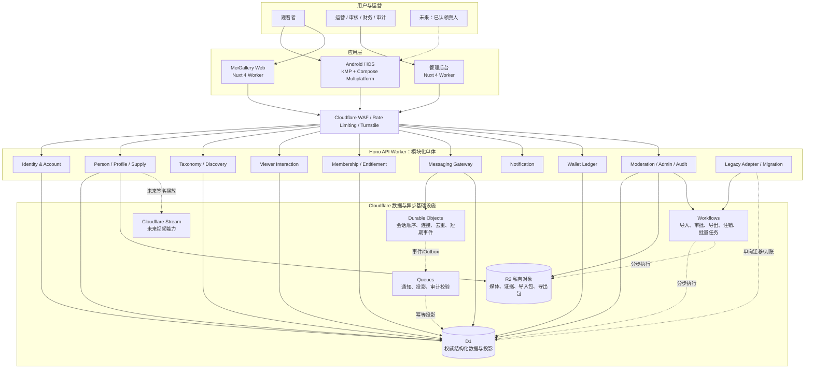

# 真人发现与互动平台 Epic 架构方案

App 版本：1.0

日期：2026-07-20

状态：需求讨论中；模块级技术方案基线

## 1. Epic 架构概览

本方案把现有 MeiGallery、独立 Android/iOS App、Nuxt Web 和 Nuxt 管理后台统一到一个可渐进迁移的业务核心中。App 1.0 的产品核心是：观看者发现经认证并发布的真人资料，进行单向喜欢、关注和收藏；有效心享会员可直接发起文本私信，未认领真人的消息由平台运营接收并明确披露；管理员可手动发放会员、加币、扣币、冲正并留下完整审计。

架构采用“Cloudflare 上的模块化单体 + 明确领域所有权 + 必要的异步基础设施”，首期不为组织结构或想象中的规模拆微服务。Web Worker 和 API Worker 保持独立部署，API Worker 内以领域模块隔离路由、用例、Repository 和权限；消息顺序交给 Durable Objects，长任务交给 Workflows，最终一致的投影和通知交给 Queues。

本方案是实现边界，不是部署完成声明。支付、金币充值、礼物、装扮、图片消息、系统推送、本人认领和普通用户桌面端只保留兼容方向，不进入 App 1.0 生产实现。

### 1.1 架构目标

- App 不依赖 MeiGallery legacy 表结构，Web 可按模块逐步迁移。
- `Account`、`Person`、`PersonProfile`、`Gallery` 和 `OperatorAssignment` 保持独立。
- 公开列表只读取 `verified + published` 的公开投影。
- 权限由服务端的 `rank + entitlement + 对象状态 + 风险状态` 联合决定。
- 跨 Kotlin/TypeScript 的接口以 OpenAPI、JSON Schema 和稳定错误码为契约源。
- 强一致范围尽量小且可说明；跨 D1、DO、Queue、R2 不伪装成单一事务。
- 后台所有写操作、高风险读取、审批和导出都可关联到追加式审计。

### 1.2 系统上下文与数据流



实线表示同步请求或权威访问；虚线表示异步任务、未来能力或渐进迁移。客户端永远不直接访问 D1、DO、R2 或 Stream。

## 2. 领域边界与所有权

| 领域 | 权威对象 | 允许同步依赖 | 发布的异步事件 | 禁止事项 |
|------|----------|--------------|----------------|----------|
| Identity & Account | 账号、身份、设备、会话、同意、数据权利请求 | Entitlement、Risk | 账号限制、设备撤权、注销状态 | 注册时创建公开真人资料 |
| Person/Profile/Supply | 真人、公开资料版本、授权、认证、运营归属、图库关联 | Taxonomy、Governance | 资料发布/暂停、授权撤销 | 管理员上传后直接公开 |
| Taxonomy/Discovery | 目录版本、公开投影、规则版本、推荐会话 | Person Public Projection、Interaction signals | 投影刷新、规则发布 | 把会员等级或运营置顶当认证 |
| Viewer Interaction | 喜欢、关注、收藏、历史、拉黑 | Account、Profile availability | 互动变更、拉黑变更 | 创建 reciprocal 或 Match |
| Membership/Entitlement | 等级目录、grant、解析后权限快照 | Account、配置目录 | 权益变更、到期 | 用中文等级名参与授权 |
| Messaging | 会话、参与主体、运营模式、消息序号、回执 | Account、Entitlement、Profile、Block/Risk | 消息、限制、运营模式变更 | 管理员伪装成真人本人 |
| Notification | 通知、模板版本、未读状态、偏好 | 业务事件、Account | 通知已读/归档 | 把实时提示当唯一通知存储 |
| Wallet Ledger | 钱包分录、余额快照、调整单、冲正关系 | Account、Approval | 余额变化、异常 | 覆盖余额或删除原分录 |
| Moderation/Admin/Audit | 案件、审批、处置、角色范围、审计事件 | 各领域受控命令 | 审批/处置/完整性异常 | 跨领域直接改表绕过用例 |
| Legacy/Migration | stable ID 映射、任务、校验、对账 | Legacy 只读适配器、目标领域命令 | 迁移进度/差异 | 长期双写无写主 |

边界规则：每张权威表只有一个领域拥有者；其他模块通过只读接口、稳定投影或领域事件读取，不跨模块直接写表。模块化单体允许共享同一 D1 数据库，但不能因此放弃所有权和测试边界。

## 3. 高层 Feature 与架构 Enabler

### 3.1 App 1.0 用户 Feature

| Feature | 主要模块 | 关键技术要求 |
|---------|----------|--------------|
| 注册、登录、设备管理 | Identity、KMP auth | 会话刷新单航班、远程撤权、本地敏感缓存清理 |
| 推荐、地区、热门、最新、搜索 | Discovery、KMP discovery | 公开投影、游标绑定规则版本、未知目录项安全降级 |
| 真人详情和媒体 | Person/Profile、Media access | 仅认证发布资料；私有资源短期访问凭证 |
| 喜欢、关注、收藏、历史 | Interaction | 关系唯一键、幂等写、本地乐观更新可回滚 |
| 五级心享会员 | Entitlement | 所有有效等级可私信；数值由配置和未决决策冻结 |
| 文本私信与代运营 | Messaging、DO | 直接建会话、身份持续披露、会话顺序、断线补拉 |
| 站内通知 | Notification | HTTP 权威列表、实时仅作刷新提示、幂等未读 |
| 金币余额与明细 | Wallet | 追加式账本、管理员调整、冲正和用户可见说明 |

### 3.2 管理与运营 Feature

| Feature | 主要模块 | 关键技术要求 |
|---------|----------|--------------|
| 真人上传、MeiGallery 导入 | Supply、Migration、Workflow | 单项失败不阻塞全包、来源和授权必填、可恢复 |
| 认证与发布 | Governance、Person/Profile | 认证/发布双状态机、对象版本、防并发覆盖 |
| Taxonomy 和推荐运营 | Discovery、Governance | 不可变目录版本、灰度、回滚、置顶显式标识 |
| 代运营消息工作台 | Messaging、Admin RBAC | 操作员审计身份、领取/转派、内部备注隔离 |
| 举报与处置 | Moderation | 最小证据快照、分级队列、处置联动、申诉 |
| 会员发放 | Entitlement、Approval | 有效期、来源、幂等业务单号、必要复核 |
| 调币与对账 | Wallet、Approval、Audit | 高风险双人复核、不可负余额策略待冻结、冲正而非编辑 |
| 看板与审计 | Audit、Projection | 指标口径登记、敏感钻取重鉴权、导出留痕 |

### 3.3 横向 Enabler

- EN-01：稳定 ID、legacy 映射和公开资料投影。
- EN-02：OpenAPI、JSON Schema、错误码和事件 schema 的契约流水线。
- EN-03：统一身份、entitlement 解析、对象级授权和后台 RBAC。
- EN-04：D1 migration、Outbox、幂等消费和对账工具。
- EN-05：会话 Durable Object、连接票据、sequence 和恢复协议。
- EN-06：R2 私有媒体、访问票据、授权撤销和缓存清理。
- EN-07：追加式审计、审批链、Trace ID 和异常检测。
- EN-08：dev/staging/production 隔离、Feature flag、回滚和 Kill switch。

## 4. 技术栈

| 层次 | 选型 | 使用边界 |
|------|------|----------|
| Android/iOS | Kotlin Multiplatform + Compose Multiplatform | App 1.0 仅 Android/iOS，Android `minSdk=26` |
| 客户端状态/导航 | Lifecycle、ViewModel、StateFlow、Navigation 3、SavedState | 页面单向数据流；Navigation 3 在 Spike 后冻结 |
| 客户端数据 | Ktor Client、kotlinx.serialization、Paging、Room/SQLite、DataStore Preferences | Token 进入 Keystore/Keychain，不进 Room/DataStore 明文 |
| 图片/视频 | Coil 3；Android Media3；iOS AVPlayer/AVKit | 视频内核分平台，受保护媒体缓存隔离 |
| Web/后台 | Nuxt 4，Workers Assets，Tailwind CSS v4，后台 Nuxt UI v4 | Web 与 API 独立 Worker；不使用 Cloudflare Pages |
| API | Hono on Cloudflare Workers | `/api/v2` 模块化单体，公开与管理路由隔离 |
| 数据 | Cloudflare D1、R2、未来 Stream | D1 存结构化权威数据/投影；R2 存私有对象和证据 |
| 实时/异步 | Durable Objects、Queues、Workflows | DO 保会话顺序；Queue 最终一致；Workflow 长流程 |
| 边缘安全 | Turnstile、WAF、Rate Limiting、短期签名凭证 | 服务端权限是最终依据 |
| 契约 | OpenAPI、JSON Schema、稳定错误码注册表 | Kotlin/TypeScript 生成或验证，不共享源码 |

实现时的精确版本以 [KMP 客户端技术栈](../../../app/KMP_CLIENT_TECH_STACK.md) 的技术 Spike 和 OQ-026 决策为准，不在架构文档重复锁死。

## 5. 关键执行模型

### 5.1 普通 HTTP 命令

```text
边缘防护
→ 会话与账号校验
→ capability / entitlement / 对象范围校验
→ 输入和幂等键校验
→ 单领域 D1 事务
→ 写入领域结果与 Outbox
→ 返回权威结果
→ Queue 幂等生成投影、通知和分析事件
```

业务结果与 Outbox 应位于同一 D1 事务。Queue 消费者必须按 `eventId + consumer` 去重，允许重复投递，不假设 exactly-once。

### 5.2 会话消息命令

```text
API 校验账号、会员、目标资料、拉黑、安全与会话状态
→ 获取绑定账号/设备/会话的短期实时票据
→ Conversation Durable Object 校验票据并重新检查关键版本
→ 以 clientMessageId 去重并分配单调 sequence
→ 写入 DO durable event + outbox 后确认接收
→ Queue 幂等更新 D1 查询投影、通知和审核队列
→ 客户端按 sequence 去重；发现缺口时通过 HTTP/DO 补拉
```

D1 权益事务、DO 消息写入、Queue 投递和 R2 归档不能构成一个 ACID 事务。若 DO 已确认而下游未投影，DO outbox 必须可重放；若资格在进入 DO 前后发生变化，DO 依据票据中的版本/过期时间和必要的服务端复核拒绝过期授权。容量、保留和恢复参数由 OQ-020、OQ-028 决定。

### 5.3 高风险后台命令

```text
管理员强认证
→ RBAC capability + 对象范围 + 新鲜会话校验
→ 创建申请并记录原因/预览影响
→ 按规则判断直接执行或等待复核
→ 独立复核人批准
→ Workflow/领域命令执行
→ 写业务结果、审批链和审计
→ 用户通知 / 对账 / 异常监测
```

前端路由或按钮隐藏只改善体验，不是权限控制。财务阈值、负余额和批量规则由 OQ-018 冻结后配置化。

## 6. 安全、隐私与可靠性

### 6.1 信任边界

- App/Web/后台输入、客户端会员状态、客户端时间和缓存都不可信。
- 管理员也不是全局可信主体，权限按 capability、对象 scope、环境和审批状态共同判断。
- 私信正文、身份材料、授权证据、Token、签名 URL 和内部备注禁止进入通用日志与分析。
- 未认领真人的用户侧发送者只显示“平台运营”，内部才关联实际操作员；不得返回伪造的本人在线、输入中或已读。
- 受保护 R2/Stream 资源只能在服务端重验后签发短期凭证。

### 6.2 降级原则

| 故障 | 用户侧行为 | 后台行为 | 不允许的降级 |
|------|------------|----------|----------------|
| 推荐投影延迟 | 显示最后成功数据和更新时间，支持刷新 | 告警投影延迟 | 读取未审核源表补齐 |
| 实时连接失败 | HTTP 补拉与发送兜底，明确连接状态 | 查看队列和会话健康度 | 伪造已送达/已读 |
| Queue 延迟 | 权威写入已成功时显示处理中 | 幂等重放和积压告警 | 重复通知/重复分录 |
| entitlement 服务异常 | 受限操作关闭，公开内容尽量可读 | Kill switch/只读 | 客户端缓存自行放行 |
| 审计不可写 | 高风险后台写入失败关闭 | 告警并进入应急流程 | 先改数据、稍后补审计 |
| R2/Stream 访问失败 | 占位、重试或重新签发 | 检查资源与授权 | 返回永久公开 URL |

### 6.3 可观测性

- `requestId` 贯穿同步 API，`traceId` 贯穿 Queue、Workflow 和 DO，`businessId` 关联领域结果。
- 指标分为产品指标、技术指标和审计完整性指标，存储和权限分离。
- 重点告警包括：公开投影越界、DO sequence 缺口、Queue 积压、重复账本业务键、会员到期未撤权、审计缺口和管理员异常读取。
- SLO 与容量数值在 OQ-010、OQ-022、OQ-028、OQ-031 关闭后写入运行手册，不在讨论期臆定。

## 7. 技术价值与取舍

技术价值评估：**高**。

- 直接解除 App 对 legacy 表的耦合，为现有 Web 逐模块迁移提供同一目标模型。
- 把真人、账号、公开资料和运营归属拆开，能同时支持当前管理员代运营和未来本人认领。
- entitlement 与展示名称分离，使五级会员和未来功能可配置演进，不需要为每个权益改权限代码。
- 模块化单体减少首期部署、事务和运维复杂度，同时保留通过 schema、事件和所有权拆分的路径。
- DO 只承担会话强顺序，D1 承担查询和治理，避免把整个业务错误地塞入实时组件。
- 后台 RBAC、审批和审计从一开始作为业务闭环，降低代运营和调币的内部风险。

主要取舍：跨组件最终一致需要 outbox、幂等、重放和对账；KMP 能复用领域/UI，但视频、安全存储和商店能力仍需要平台实现；只使用 Cloudflare 简化基础设施边界，但必须在 OQ-024、OQ-031 中验证地区与容量适用性。

## 8. 工作量估算

T-shirt size：**XL**。

估算理由：该 Epic 同时包含新客户端、共享领域模型、legacy 迁移、实时消息、管理员代运营、五级权益、钱包账本、后台 RBAC、审计和合规门禁。它不是单一 App 页面项目，至少需要按可独立验收的阶段推进。

| 阶段 | 主要成果 | 相对规模 |
|------|----------|----------|
| M0 地基 | stable ID、schema、公开投影、认证发布、迁移适配、契约流水线 | L |
| M1 发现 | KMP 账号/发现/详情/互动、后台内容链路、隐私安全 | L |
| M2A 服务闭环 | 五级 entitlement、消息 DO、代运营、通知、钱包调币、审计 | XL |
| 发布工程 | Android/iOS 构建、兼容、性能、安全、商店与运营演练 | L |

人日或日历期必须在 OQ-002、OQ-014、OQ-020、OQ-021、OQ-022、OQ-026、OQ-028、OQ-030、OQ-031 关闭并完成技术 Spike 后估算；当前不提供伪精确日期。

## 9. 架构冻结与退出标准

进入实现排期前必须满足：

- 领域词汇、stable ID、表所有权和状态机通过产品/技术评审。
- App 1.0 OpenAPI、实时事件、错误码和管理权限目录进入冻结候选。
- OQ-001、OQ-002、OQ-003、OQ-006、OQ-007、OQ-020、OQ-024、OQ-026、OQ-030 关闭。
- 私信实现前额外关闭 OQ-010、OQ-014、OQ-021、OQ-022、OQ-028、OQ-033；调币实现前关闭 OQ-018。
- KMP 最小工程完成 Android/iOS 的导航、网络、Room、Coil、WebSocket 和平台视频 Spike。
- D1/DO/Queue 的消息提交、恢复、重复消费、导出与灾备用故障注入验证。
- 后台 RBAC 能回答“谁、以什么角色、在哪个对象范围、因为什么、经谁批准、产生什么结果”。
- 每个迁移阶段定义唯一写主、对账、停止条件和回滚/forward-fix。

## 10. 相关文档

- [产品蓝图](./product-blueprint/prd.md)
- [App 1.0 发布范围](./app-1-0-release-scope/prd.md)
- [技术架构方案](../../../app/TECHNICAL_ARCHITECTURE.md)
- [KMP 客户端模块设计](../../../app/KMP_CLIENT_MODULE_DESIGN.md)
- [Cloudflare 后端模块与实时链路设计](../../../app/CLOUDFLARE_BACKEND_MODULE_DESIGN.md)
- [管理后台 RBAC、审批与审计设计](../../../app/ADMIN_RBAC_AND_WORKFLOW_DESIGN.md)
- [API、DTO 与数据契约冻结计划](../../../app/API_DATA_CONTRACT_FREEZE_PLAN.md)
- [开放问题与决策登记](../../../app/DECISIONS_AND_OPEN_QUESTIONS.md)
